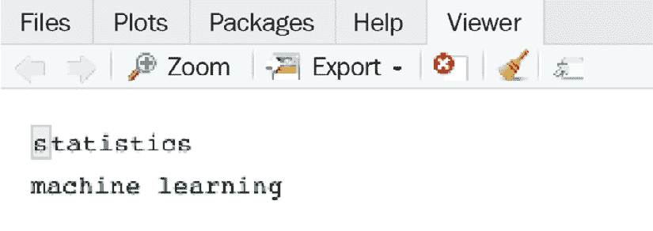

# 3

# 中间数据处理

上一章介绍了`dplyr`提供的用于数据处理的常用函数集。例如，在描述和提取数据集的统计信息时，我们可以使用`group_by()`和`summarize()`函数遵循拆分-应用-组合程序。本章从上一章继续，重点关注中间数据处理技术，包括转换分类和数值变量以及重塑数据框。除此之外，我们还将介绍用于处理文本数据的字符串操作技术，其格式与我们迄今为止所使用的整洁表格格式根本不同。

到本章结束时，你将能够执行更高级的数据操作，并将你的数据处理技能扩展到基于字符串的文本，这对于自然语言处理领域是基本的。

本章将涵盖以下主题：

+   转换分类和数值变量

+   重塑数据框

+   操作字符串数据

+   使用`stringr`

+   介绍正则表达式

+   使用整洁文本挖掘

# 技术要求

要完成本章的练习，你需要具备以下条件：

+   编写本文时，`rebus`包的最新版本是 0.1-3

+   编写本文时，`tidytext`包的最新版本是 0.3.2

+   编写本文时，`tm`包的最新版本是 0.7-8

本章的所有代码和数据都可在以下链接找到：[`github.com/PacktPublishing/The-Statistics-and-Machine-Learning-with-R-Workshop/tree/main/Chapter_3`](https://github.com/PacktPublishing/The-Statistics-and-Machine-Learning-with-R-Workshop/tree/main/Chapter_3)。

# 转换分类和数值变量

如前一章所述，我们可以使用`dplyr`中的`mutate()`函数来转换现有变量并创建新变量。具体的转换取决于变量的类型和我们希望其具有的形状。例如，我们可能希望根据映射字典更改分类变量的值，基于现有变量的过滤条件组合创建新变量，或者将数值变量分组到新的变量中的不同范围。让我们依次查看这些场景。

## 重新编码分类变量

在许多情况下，你可能需要重新编码变量的值，例如将国家的简称映射到相应的全称。让我们创建一个模拟的`tibble`数据集来展示这一点。

在以下代码中，我们创建了一个`students`变量，用于存储有关年龄、国家、性别和身高的信息。这是一个小型模拟数据集，但对于演示目的来说已经足够好了：

```py

students = tibble(age = c(26, 30, 28, 31, 25, 29, 30, 29),
                  country = c('SG', 'CN', 'US', 'UK','CN', 'SG', 'IN', 'SG'),
                  gender = c('F', 'F', 'M', 'M', 'M', 'F', 'F', 'M'),
height = c(168, 169, 175, 178, 170, 170, 172, 180))
```

现在，让我们通过一个将`country`变量的值转换为全称的示例来了解这个过程。

### 练习 3.1 – 将国家变量值转换为全称

这个练习将使用 `dplyr` 包中的 `recode()` 函数将现有的短国家名称映射到相应的全称：

1.  通过使用 `recode()` 函数并提供映射表来添加一个新列，将短国家名称转换为相应的全称：

    ```py

    students_new = students %>%
      mutate(country_fullname = recode(country,
                                       "SG"="Singapore",
                                       "CN"="China",
                                       "UK"="United Kingdom",
                                       "IN"="India"))
    >>> students_new
    # A tibble: 8 x 5
        age country gender height country_fullname
      <dbl> <chr>   <chr>   <dbl> <chr>
    1    26 SG      F         168 Singapore
    2    30 CN      F         169 China
    3    28 UK      M         175 United Kingdom
    4    31 UK      M         178 United Kingdom
    5    25 CN      M         170 China
    6    29 SG      F         170 Singapore
    7    30 IN      F         172 India
    8    29 SG      M         180 Singapore
    ```

    在这里，我们提供了映射字典作为 `recode()` 函数的参数，该函数在左侧列中搜索键，并将右侧列中对应的值分配给 `country_fullname`。请注意，新创建的列假定是字符类型。

1.  执行相同的转换，并将结果存储为 `factor` 类型：

    ```py

    students_new = students_new %>%
      mutate(country_fullname2 = recode_factor(country,
                                       "SG"="Singapore",
                                       "CN"="China",
                                       "UK"="United Kingdom",
                                       "IN"="India"))
    >>> students_new
    # A tibble: 8 x 6
        age country gender height country_fullname country_fullname2
      <dbl> <chr>   <chr>   <dbl> <chr>            <fct>
    1    26 SG      F         168 Singapore        Singapore
    2    30 CN      F         169 China            China
    3    28 UK      M         175 United Kingdom   United Kingdom
    4    31 UK      M         178 United Kingdom   United Kingdom
    5    25 CN      M         170 China            China
    6    29 SG      F         170 Singapore        Singapore
    7    30 IN      F         172 India            India
    8    29 SG      M         180 Singapore        Singapore
    ```

    我们可以看到，使用 `recode_factor()` 后，生成的变量 `country_fullname2` 是一个因子。

当我们想要创建的新列依赖于现有列的复杂组合时，我们可以求助于下一节中介绍的 `case_when()` 函数。

## 使用 case_when() 创建变量

`case_when()` 函数提供了一个在创建新变量时设置多个 `if-else` 条件的便捷方式。它接受一系列双向公式，其中左侧包含筛选条件，右侧提供与先前条件匹配的替换值。函数内部的语法遵循 `逻辑条件(们) ~ 替换值` 的模式，这些条件按顺序进行评估，其中可以在逻辑条件中使用多个变量。序列的末尾是一个 `TRUE ~ 默认值` 的情况，如果所有先前条件评估为 `FALSE`，则将该值分配给变量。

让我们通过一个练习来创建一个基于多个 `if-else` 条件的新变量，这些条件涉及多个列。

### 练习 3.2 – 使用多个条件和列创建新变量

在这个练习中，我们将创建一个新变量，该变量指示学生的年龄和地区。

创建一个新变量类型，用于识别学生是否来自亚洲，以及他们是否在 20 多岁或 30 多岁，分别假设 `asia_20+` 和 `asia_30+` 作为值。如果没有匹配项，将值设置为 `others`：

```py

students_new = students %>%
  mutate(type = case_when(age >= 30 & country %in% c("SG","IN","CN") ~ "asia_30+",
                             age < 30 & age >= 20 & country %in% c("SG","IN","CN") ~ "asia_20+",
                             TRUE ~ "others"))
>>> students_new
# A tibble: 8 x 5
    age country gender height type
  <dbl> <chr>   <chr>   <dbl> <chr>
1    26 SG      F         168 asia_20+
2    30 CN      F         169 asia_30+
3    28 UK      M         175 others
4    31 UK      M         178 others
5    25 CN      M         170 asia_20+
6    29 SG      F         170 asia_20+
7    30 IN      F         172 asia_30+
8    29 SG      M         180 asia_20+
```

在这里，我们使用了 `&` 符号来组合多个评估 `年龄` 和 `国家` 的 `AND` 条件。当序列中的前一个条件都不评估为 `TRUE` 时，函数将落入包含所有条件的 `TRUE` 情况，并将 `others` 作为默认值分配。

接下来，我们将查看将数值列转换为不同的箱/类别。

## 使用 cut() 对数值变量进行分箱

可以使用 `cut()` 函数将数值列划分为不同的类别。对于数值列，它将值分配给相应的预定义区间，并根据分配的区间对值进行编码。生成的区间列假定是一个有序因子类型。

`cut()`函数有三个关键参数：`x`用于接受要分组的数值向量，`breaks`用于接受一个数值向量作为切割点，这可能包括负无穷大`-Inf`和正无穷大`Inf`，以及`labels`用于指示结果区间的标签。

让我们通过使用`cut()`将`age`列转换为不同的年龄组进行一次练习。

### 练习 3.3 – 将年龄列分为三个组

在这个练习中，我们将使用`cut()`函数将`age`列的值分配到以下范围之一：`(-infinity, 25)`、`[26, 30]`或`[31, infinity]`：

1.  将`age`列分为三个区间，断点为`25`和`30`（右侧包含），并将它们存储在一个名为`age_group`的新列中：

    ```py

    students_new = students %>%
      mutate(age_group = cut(x = age,
                        breaks = c(-Inf, 25, 30, Inf),
                        labels = c("<=25", "26-30", ">30")))
    >>> students_new
    # A tibble: 8 x 5
        age country gender height age_group
      <dbl> <chr>   <chr>   <dbl> <fct>
    1    26 SG      F         168 26-30
    2    30 CN      F         169 26-30
    3    28 UK      M         175 26-30
    4    31 UK      M         178 >30
    5    25 CN      M         170 <=25
    6    29 SG      F         170 26-30
    7    30 IN      F         172 26-30
    8    29 SG      M         180 26-30
    ```

    这里，我们可以看到`age_group`是一个有序因子，有三个层级。

    几个切割函数在没有特定截止点的情况下执行自动分组。例如，`cut_interval()`将原始向量切割成指定数量的等间隔组，而`cut_number()`将输入向量转换为指定数量的组，其中每个组大约有相同数量的观测值。`tidyverse`包提供了这两个函数。让我们尝试一下。

1.  使用`cut_interval()`将`age`列分为三个等长的组：

    ```py

    students_new = students %>%
      mutate(age_group = cut_interval(age, n=3))
    >>> students_new
    # A tibble: 8 x 5
        age country gender height age_group
      <dbl> <chr>   <chr>   <dbl> <fct>
    1    26 SG      F         168 [25,27]
    2    30 CN      F         169 (29,31]
    3    28 UK      M         175 (27,29]
    4    31 UK      M         178 (29,31]
    5    25 CN      M         170 [25,27]
    6    29 SG      F         170 (27,29]
    7    30 IN      F         172 (29,31)
    8    29 SG      M         180 (27,29)
    ```

    `age_group`列现在由三个代表等长区间的层级组成。让我们使用`summary()`函数检查每个层级的计数：

    ```py
    >>> summary(students_new$age_group)
    [25,27] (27,29) (29,31)
          2       3       3
    ```

1.  使用`cut_interval()`将`age`列分为具有相等观测数的三个组：

    ```py

    students_new = students %>%
      mutate(age_group = cut_number(age, n=3))
    >>> students_new
    # A tibble: 8 x 5
        age country gender height age_group
      <dbl> <chr>   <chr>   <dbl> <fct>
    1    26 SG      F         168 [25,28.3]
    2    30 CN      F         169 (29.7,31]
    3    28 UK      M         175 [25,28.3]
    4    31 UK      M         178 (29.7,31]
    5    25 CN      M         170 [25,28.3]
    6    29 SG      F         170 (28.3,29.7]
    7    30 IN      F         172 (29.7,31)
    8    29 SG      M         180 (28.3,29.7)
    ```

    截止点现在假设为小数点，以使观测值的计数大约相等，如下面的代码所验证：

    ```py
    >>> summary(students_new$age_group)
      [25,28.3] (28.3,29.7)   (29.7,31)
    3           2           3
    ```

到目前为止，我们已经探讨了不同的方法来转换现有的分类或数值变量，并基于特定条件创建新变量。接下来，我们将探讨如何转换和重塑整个 DataFrame，以方便我们的分析。

# 重塑 DataFrame

由分类和数值列组合而成的 DataFrame 可以用宽格式和长格式表示。例如，`students`DataFrame 被认为是长格式，因为所有国家都存储在`country`列中。根据处理的具体目的，我们可能希望为数据集中的每个唯一国家创建一个单独的列，这会增加 DataFrame 的列数，并将其转换为宽格式。

通过`spread()`和`gather()`函数可以在宽格式和长格式之间进行转换，这两个函数都由`tidyr`包提供，属于`tidyverse`生态系统。让我们看看它在实际中的应用。

## 使用`spread()`将长格式转换为宽格式

有时会需要将长格式 DataFrame 转换为宽格式。`spread()` 函数可以将具有多个类别的分类列转换为由 `key` 参数指定的多个列，每个类别作为 DataFrame 中的单独列添加。列名将是分类列的唯一值。`value` 参数指定在调用 `spread()` 函数时要在这些附加列中展开和填充的内容。让我们通过一个练习来了解。

### 练习 3.4 – 将长格式转换为宽格式

在这个练习中，我们将使用 `spread()` 将 `students` DataFrame 转换为宽格式：

1.  使用 `country` 作为 `key` 参数，`height` 作为 `value` 参数，使用 `spread()` 将学生转换为宽格式。将结果 DataFrame 存储在 `students_wide` 中：

    ```py

    students_wide = students %>%
      spread(key = country, value = height)
    >>> students_wide
    # A tibble: 7 x 6
        age gender    CN    IN    SG    UK
      <dbl> <chr>  <dbl> <dbl> <dbl> <dbl>
    1    25 M        170    NA    NA    NA
    2    26 F         NA    NA   168    NA
    3    28 M         NA    NA    NA   175
    4    29 F         NA    NA   170    NA
    5    29 M         NA    NA   180    NA
    6    30 F        169   172    NA    NA
    7    31 M         NA    NA    NA   178
    ```

    我们可以看到原始的 `height` 列消失了，并增加了四个附加列。这四个列对应于唯一的各国，这些列的值由身高填充。如果特定国家的对应身高不可用，则使用 `NA` 填充缺失的组合。

    如果我们想为这些 `NA` 值指定默认值，我们可以在 `spread()` 中设置 `fill` 参数。

1.  使用四舍五入的平均身高来填充结果宽格式中的 `NA` 值。将结果 DataFrame 存储在 `students_wide2` 中：

    ```py

    avg_height = round(mean(students$height))
    students_wide2 = students %>%
      spread(key = country, value = height, fill = avg_height)
    >>> students_wide2
    # A tibble: 7 x 6
        age gender    CN    IN    SG    UK
      <dbl> <chr>  <dbl> <dbl> <dbl> <dbl>
    1    25 M        170   173   173   173
    2    26 F        173   173   168   173
    3    28 M        173   173   173   175
    4    29 F        173   173   170   173
    5    29 M        173   173   180   173
    6    30 F        169   172   173   173
    7    31 M        173   173   173   178
    ```

从长格式转换为宽格式在分析和展示方面可能很有帮助，因为我们可以直观地比较特定年龄和性别组合下所有国家的身高。然而，这会带来额外的存储成本，如之前显示的多个 `NA` 值所示。

现在，让我们学习如何将宽格式 DataFrame 转换为长格式。

## 使用 `gather()` 函数将宽格式转换为长格式

当我们处于相反的情况，即给定的数据是宽格式时，我们可以使用 `gather()` 函数将其转换为长格式，以便进行更方便的后续处理。例如，通过将四个国家列压缩到 `key` 变量中，并将所有身高存储在 `gather()` 中指定的 `value` 变量下，我们可以继续使用我们之前介绍过的基于两列（而不是四列或更多）的常规分割-应用-组合处理。

`gather()` 函数也使用 `key` 和 `value` 参数来指定长格式表中结果的 `key` 和 `value` 列的名称。此外，我们还需要指定用于填充 `key` 列的列名和 `value` 列中的值。当需要指定许多相邻的列时，我们可以通过传递起始和结束列名来使用 `:` 运算符选择所有中间的列。让我们通过一个练习来了解。

### 练习 3.5 – 将宽格式转换为长格式

本练习将宽格式化的`students_wide` DataFrame 转换回其原始的长格式：

1.  通过指定`key`列为`country`和`value`列为`height`，并将`CN`、`IN`、`SG`和`UK`列的值分别用于填充`key`和`value`列，将`students_wide`转换为长格式：

    ```py

    students_long = students_wide %>%
      gather(key = "country", value = "height", CN:UK)
    >>> students_long
    # A tibble: 28 x 4
         age gender country height
       <dbl> <chr>  <chr>    <dbl>
     1    25 M      CN         170
     2    26 F      CN          NA
     3    28 M      CN          NA
     4    29 F      CN          NA
     5    29 M      CN          NA
     6    30 F      CN         169
     7    31 M      CN          NA
     8    25 M      IN          NA
     9    26 F      IN          NA
    10    28 M      IN          NA
    # … with 18 more rows
    ```

    我们可以看到，由于`students_wide`中原本就存在缺失值，`height`列中添加了几行缺失值。让我们使用`dplyr`中的`drop_na()`函数来删除它们。

1.  删除`height`列中的`NA`值行：

    ```py

    students_long = students_long %>%
      drop_na(height)
    >>> students_long
    # A tibble: 8 x 4
        age gender country height
      <dbl> <chr>  <chr>    <dbl>
    1    25 M      CN         170
    2    30 F      CN         169
    3    30 F      IN         172
    4    26 F      SG         168
    5    29 F      SG         170
    6    29 M      SG         180
    7    28 M      UK         175
    8    31 M      UK         178
    ```

    通过这样，我们已经获得了长格式的 DataFrame。现在，让我们验证它是否与原始的`students` DataFrame 相同。

1.  使用`all_equal()`验证`students_long`是否与`students`相同：

    ```py

    >>> all_equal(students, students_long, ignore_row_order = T, ignore_col_order = T)
    TRUE
    ```

    `dplyr`中的`all_equal()`函数比较两个数据集并检查它们是否相同。它提供了一种灵活的方法来进行等价比较，并支持忽略行和/或列的顺序。结果显示，我们已经成功转换回原始数据集。

通过这样，我们已经探讨了不同的方法来重塑 DataFrame。接下来，我们将介绍如何处理字符串数据。

# 操作字符串数据

字符串类型在现实生活中的数据中很常见，例如姓名和地址。分析字符串数据需要正确清理原始字符，并将文本数据块中嵌入的信息转换为可量化的数值摘要。例如，我们可能想要找到所有遵循特定模式的学生的匹配姓名。

本节将介绍通过正则表达式定义不同模式的方法，以检测、分割和提取字符串数据。让我们从字符串的基础知识开始。

## 创建字符串

有时，单个引号（`'`）也被用来表示字符串，尽管通常建议除非字符本身包含双引号，否则使用双引号。

创建字符串有多种方式。以下练习介绍了初始化字符类型字符串的几种不同方法。

### 练习 3.6 – 在 R 中表达字符串

在这个练习中，我们将探讨如何在 R 中创建字符串：

1.  尝试在 R 控制台中键入以下字符串：

    ```py

    >>> "statistics workshop"
    "statistics workshop"
    ```

    字符串被正确打印出来。让我们看看如果我们用双引号包裹`statistics`会发生什么。

1.  在字符串中给`statistics`添加双引号：

    ```py

    >>> ""statistics" workshop"
    Error: unexpected symbol in """statistics"
    ```

    这次，出现了一个错误，因为 R 将第二个双引号视为字符串的结束引号。可以通过在字符串中使用双引号时，将外部引号切换为单引号来避免这个错误。

1.  用单引号包裹前面的字符串：

    ```py

    >>> '"statistics" workshop'
    "\"statistics\" workshop"
    ```

    现在，R 正确解释了字符串，并将单引号对内的所有内容视为一个整体字符串。请注意，结果字符串在控制台中仍然用双引号打印。字符串内的两个双引号前面也有一个反斜杠（`\`）。这被称为转义序列，用于指示双引号作为字符的原始解释，而不是字符串的开始。转义序列是在字符串中包含特殊字符的有用方式。

    我们也可以在字符串内部手动添加转义字符，以强制正确解释，这将打印出与之前相同的结果。

1.  在字符串内部双引号之前添加转义序列：

    ```py

    >>> "\"statistics\" workshop"
    "\"statistics\" workshop"
    ```

    使用反斜杠打印字符串序列不方便阅读。为了美化输出，我们可以将确切字符串传递给`writeLines()`函数。

1.  使用`writeLines()`打印相同的字符串：

    ```py

    >>> writeLines("\"statistics\" workshop")
    "statistics" workshop
    ```

接下来，我们将探讨如何将数字转换为字符串以进行更好的解释。

## 将数字转换为字符串

如我们之前所学，数字可以通过`as.character()`函数转换为字符串。然而，直接读取和报告像`123000`这样的大数字会很不方便。我们通常会以更易读的方式表达，例如 123,000，或者以更简洁的方式，例如 1.23e+05，后者遵循科学表示法，其中 e+05 等于 105。此外，我们可能还想显示浮点数小数点后有限位数的数字。

所有这些都可以通过`format()`函数实现，这在将数字作为字符串转换和打印时遵循不同格式时非常有用。让我们看看在实践中是如何做到这一点的。

### 练习 3.7 – 使用`format()`将数字转换为字符串

这个练习将使用`format()`将数字转换为漂亮且易于阅读的字符串：

1.  通过在`format()`函数中指定`big.mark`参数，将逗号作为千位分隔符添加到`123000`：

    ```py

    >>> format(123000, big.mark = ",")
    "123,000"
    ```

    注意，现在结果是带有逗号的字符类型字符串。

1.  将`123000`转换为科学格式：

    ```py

    >>> format(123000, scientific = TRUE)
    "1.23e+05"
    ```

    使用科学格式是表示大数字的简洁方式。我们还可以通过指定显示的数字位数来缩短一个长的浮点数。

1.  通过指定`digits`参数，仅显示`1.256`的三个数字：

    ```py

    >>> format(1.256, digits = 3)
    "1.26"
    ```

    结果被四舍五入并转换为字符串，显示指定数量的三个数字。我们也可以使用`round()`函数达到相同的四舍五入效果。

1.  将`1.256`四舍五入到两位小数：

    ```py

    >>> round(1.256, digits = 2)
    1.26
    ```

    这次，结果仍然是数值型，因为`round()`不涉及类型转换。

在下一节中，我们将探讨连接多个字符串。

## 连接字符串

当有多个字符串时，我们可以使用`paste()`将它们连接并合并成一个字符串。如果我们想在程序中打印长而定制的消息而不是手动输入，这变得很重要。

`paste()` 函数接受任意数量的字符串输入作为参数，并将它们组合成一个。让我们看看它是如何工作的。

### 练习 3.8 – 使用 paste() 组合字符串

在这个练习中，我们将探讨不同的方法来组合多个字符串输入：

1.  将 `statistics` 和 `workshop` 字符串连接起来生成 `statistics workshop`：

    ```py

    >>> paste("statistics", "workshop")
    "statistics workshop"
    ```

    在这里，我们可以看到两个字符串之间自动添加了一个空格。这是由 `sep` 参数控制的，它指定了字符串之间的填充内容，并假定默认值为空格。我们可以选择通过传递一个分隔字符来覆盖默认行为。

1.  移除中间的空格并生成 `statisticsworkshop`：

    ```py

    >>> paste("statistics", "workshop", sep = "")
    "statisticsworkshop"
    Let’s see what happens when we connect a single string to a vector of strings.
    ```

1.  将 `statistics` 和 `workshop` 向量与 `course` 连接：

    ```py

    >>> paste(c("statistics", "workshop"), "course")
    "statistics course" "workshop course"
    ```

    结果显示 `course` 被添加到向量的每个元素中。这是通过底层的回收操作完成的，其中 `course` 被回收以便可以与向量中的每个字符串组合。这类似于 Python 中的广播机制。

    我们也可以通过指定 `collapse` 参数来移除向量结构并将所有元素组合成一个字符串。

1.  将之前的输出压缩成一个由 `+` 分隔的单个字符串：

    ```py

    >>> paste(c("statistics", "workshop"), "course", collapse = " + ")
    "statistics course + workshop course"
    ```

    在将组合向量的所有组件插入并按指定参数分隔后，结果是单个折叠的字符串。

到目前为止，我们已经了解了处理字符串数据的基本知识。`tidyverse` 生态系统提供的 `stringr` 包提供了许多方便的函数，如果我们想要对字符串有更灵活的控制，这将在本节中介绍。

# 使用 stringr 处理字符串

`stringr` 包提供了一套连贯的函数，所有这些函数都以 `str_` 开头，旨在使字符串处理尽可能容易。

让我们从 `stringr` 的基本函数开始，通过复制上一个练习中的相同结果。

## stringr 的基础知识

`stringr` 包中的 `str_c()` 函数可以像 `paste()` 一样连接多个字符串，具有类似的功能。让我们看看它的实际应用。

### 练习 3.9 – 使用 paste() 组合字符串

在这个练习中，我们将使用 `str_c()` 重复 *练习 3.8* 中的相同操作：

1.  在 `statistics` 和 `workshop` 之间添加一个分隔空格来连接：

    ```py

    >>> str_c("statistics", "workshop", sep = " ")
    "statistics workshop"
    ```

    我们可以使用 `sep` 参数来指定字符串之间的分隔符。

1.  将 `statistics` 和 `workshop` 向量与 `course` 结合：

    ```py

    >>> str_c(c("statistics", "workshop"), "course", sep = " ")
    "statistics course" "workshop course"
    ```

    相同的回收行为也出现在这里。

1.  将前面的输出压缩成一个由 `+` 分隔的单个字符串：

    ```py

    >>> str_c(c("statistics", "workshop"), "course", sep = " ", collapse = " + ")
    "statistics course + workshop course"
    ```

有两个其他常见的 `stringr` 函数：`str_length()`，它返回字符串的长度，和 `str_sub()`，它从字符串中减去部分内容：

+   例如，我们可以得到向量中每个字符串的长度，如下面的代码片段所示。

    ```py

    >>> str_length(c("statistics", "workshop"))
    10  8
    ```

+   或者，我们可以使用来自基础 R 的 `nchar()` 函数来达到相同的结果，如下所示：

    ```py

    >>> nchar(c("statistics", "workshop"))
    10  8
    ```

+   我们还可以使用 `str_sub()` 通过提供起始和结束索引来提取字符串的一部分：

    ```py

    >>> str_sub(c("statistics", "workshop"), start = 1, end = 3)
    "sta" "wor"
    ```

提取字符串的一部分是查找字符串中模式的一种方式。在下一节中，我们将介绍一种比位置索引更高级的字符串匹配方法。

## 字符串中的模式匹配

在字符串中匹配模式是提取文本数据中的信息的一种常见方式。当找到匹配时，我们可以根据匹配拆分或替换字符串，添加如匹配次数等额外数据，或执行其他基于文本的分析。让我们通过几个练习来熟悉字符串匹配。

### 练习 3.10 – 在字符串中定位匹配

在这个练习中，我们将介绍三个在字符串中定位匹配时常用的函数，包括使用 `str_detect()` 检测匹配、使用 `str_subset()` 选择具有匹配的向量字符串，以及使用 `str_count()` 在字符串中计算匹配次数：

1.  在包含 `statistics` 和 `workshop` 的字符串向量中检测 `stat` 的出现：

    ```py

    >>> str_detect(c("statistics", "workshop"), "stat")
    TRUE FALSE
    ```

    `str_detect()` 函数在输入字符串中查找指定的模式，并返回一个与输入向量长度相同的逻辑向量，其中 `TRUE` 表示匹配，否则为 `FALSE`。

1.  选择包含 `stat` 的字符串子集：

    ```py

    >>> str_subset(c("statistics", "workshop"), "stat")
    "statistics"
    ```

    `str_subset()` 函数一次完成检测和选择。它将仅返回与指定模式匹配的字符串。

1.  计算前一个向量中每个字符串中 `t` 的出现次数：

    ```py

    >>> str_count(c("statistics", "workshop"), "t")
    3 0
    ```

    `str_count()` 函数返回一个与输入向量长度相同的整数向量，显示每个字符串中特定匹配的频率。

接下来，我们将探讨如何根据特定的匹配来拆分字符串。

## 拆分字符串

根据特定模式拆分字符串可以通过 `str_split()` 函数实现，该函数假设与之前函数具有相似的命名和参数设置。然后原始字符串可以被分解成更小的部分以支持更精细的分析。让我们看看它是如何使用的。

### 练习 3.11 – 使用 str_split() 拆分字符串

这个练习将使用 `str_split()` 根据特定的匹配条件将字符串分解成更小的部分：

1.  在 `&` 符号处拆分 `statistics & machine learning workshop` 字符串：

    ```py

    >>> str_split(c("statistics & machine leaning workshop"), "&")
    [[1]]
    [1] "statistics "               " machine leaning workshop"
    ```

    结果是一个包含两个元素的向量列表，位于第一个条目中。请注意，结果子字符串中都有空格，这表明使用了精确的模式匹配来拆分字符串。然后我们可以将空格包含在匹配模式中，以移除结果子字符串中的空格。

1.  在匹配模式中包含前导和尾随空格：

    ```py

    >>> str_split(c("statistics & machine leaning workshop"), " & ")
    [[1]]
    [1] "statistics"               "machine leaning workshop"
    ```

    通过这种方式，子字符串中的空格已经被移除。如下面的代码片段所示，由于结果被包裹在一个列表中，我们可以遵循列表索引规则来访问相应的元素。

1.  从上一个结果中访问第二个元素：

    ```py

    >>> str_split(c("statistics & machine leaning workshop"), " & ")[[1]][2]
    "machine leaning workshop"
    In this example, the first original string is split into two substrings while the second is split into three. Each original string corresponds to an entry in the list and can assume a different number of substrings.
    The resulting DataFrame will assume the same number of rows as the input vector and the same number of columns as the longest entry in the list.
    ```

接下来，我们将查看如何在字符串中替换匹配的模式。

## 替换字符串

`str_replace()` 和 `str_replace_all()` 函数使用 `replacement` 参数指定的新文本替换匹配项。区别在于 `str_replace()` 只替换第一个匹配项，而 `str_replace_all()` 如其名称所示替换所有匹配项。

让我们尝试使用两个函数将 `&` 符号替换为 `and`：

```py

>>> str_replace(c("statistics & machine leaning workshop", "stats & ml & workshop"), pattern = "&", replacement = "and")
"statistics and machine leaning workshop" "stats and ml & workshop"
>>> str_replace_all(c("statistics & machine leaning workshop", "stats & ml & workshop"), pattern = "&", replacement = "and")
"statistics and machine leaning workshop" "stats and ml and workshop"
```

我们可以看到，第二个字符串中的所有 `&` 符号都被替换为 `and`。再次强调，替换特定匹配项涉及两个步骤：定位匹配项（如果有的话），然后执行替换。`str_replace()` 和 `str_replace_all()` 函数一次完成这两个步骤。

在下一节中，我们将遇到一个需要结合这些 `stringr` 函数的挑战。

## 整合起来

通常，一个特定的字符串处理任务会涉及使用多个 `stringr` 函数。这些函数结合在一起可以对文本数据进行有用的转换。让我们通过一个练习来整合到目前为止我们所学的知识。

### 练习 3.12 – 使用多个函数转换字符串

在这个练习中，我们将使用不同的基于字符串的函数将 `statistics and machine leaning workshop` 转换为 `stats & ml workshop`。首先，我们将 `and` 替换为 `&` 符号，分割字符串，并处理各个部分。让我们看看如何实现这一点：

1.  创建一个 `title` 变量来存储字符串，并将 `and` 替换为 `&`：

    ```py

    >>> title = "statistics and machine leaning workshop"
    >>> title = str_replace(title, pattern = "and", replacement = "&")
    >>> title
    "statistics & machine leaning workshop"
    ```

    在这里，我们使用 `str_replace()` 将 `and` 替换为 `&`。

1.  使用 `&` 将 `title` 分割成子字符串：

    ```py

    >>> a = str_split(title, " & ")
    >>> a
    [[1]]
    [1] "statistics"               "machine leaning workshop"
    ```

    在这里，我们使用 `str_split()` 将原始字符串分割成更小的子字符串。注意，匹配模式中也添加了额外的空格。我们现在将处理这些单个部分。

1.  将 `statistics` 转换为 `stats`：

    ```py

    >>> b = str_c(str_sub(a[[1]][1], 1, 4), str_sub(a[[1]][1], -1, -1))
    >>> b
    "stats"
    ```

    在这里，我们使用 `str_sub()` 提取了前四个字符，即 `stat`，以及最后一个字符 `s`，然后使用 `str_c()` 将它们连接起来。注意 `-1` 表示字符串的最后一个位置索引。

    现在，我们可以开始处理第二部分。

1.  使用空格分割 `a` 变量的第二个元素：

    ```py

    >>> c = unlist(str_split(a[[1]][2], " "))
    >>> c
    "machine"  "leaning"  "workshop"
    ```

    在这里，我们使用 `str_split()` 使用空格分割 `machine leaning workshop` 字符串，并使用 `unlist()` 将结果从列表转换为向量。我们这样做是为了在后续引用中节省一些打字，因为返回的列表中只有一个条目。

    现在，我们可以通过提取 `machine` 和 `learning` 的第一个字符并将它们组合起来形成 `ml` 来重复类似的步骤。

1.  根据前面的输出形成 `ml`：

    ```py

    >>> d = str_c(str_sub(c[1], 1, 1), str_sub(c[2], 1, 1))
    >>> d
    "ml"
    ```

    现在，我们可以将所有处理过的组件组合成一个字符串。

1.  使用前面的输出形成最终的预期字符串：

    ```py

    >>> e = str_c(b, "&", d, c[3], sep = " ")
    >>> e
    "stats & ml workshop"
    ```

在下一节中，我们将学习更多使用正则表达式的先进模式匹配技术。

# 正则表达式介绍

一个`rebus`包。它是`stringr`的一个好伴侣，提供了便于字符串操作和使构建正则表达式更加容易的实用函数。记住，当你第一次使用它时，通过`install.package("rebus")`安装此包。

`rebus`包有一个特殊的操作符`%R%`，用于连接匹配条件。例如，为了检测一个字符串是否以特定的字符开始，比如`s`，我们可以指定模式为`START %R% "s"`并将其传递给`str_detect()`函数的模式参数，其中`START`是一个特殊关键字，用于指示字符串的开始。同样，`END`关键字表示字符串的结束。它们一起在`rebus`库中被称为锚点。让我们看看以下示例：

```py

>>> str_detect(c("statistics", "machine learning"), pattern = START %R% "s")
TRUE FALSE
```

我们也可以在控制台中输入`START`。结果是箭头符号，这正是 vanilla 正则表达式中用来指示字符串开始的字符：

```py

>>> START
<regex> ^
```

此外，`str_view()`是另一个有用的函数，它可视化字符串的匹配部分。运行以下命令将弹出一个带有高亮显示匹配部分的 HTML 查看器面板：

```py

>>> str_view(c("statistics", "machine learning"), pattern = START %R% "s")
```

这在*图 3.1*中显示：



图 3.1 – 使用 str_view()在查看器面板中可视化匹配结果

让我们通过一个练习来了解 rebus 中各种模式匹配函数的更多内容。

### 练习 3.13 – 使用 rebus 应用正则表达式

在这个练习中，我们将应用不同的正则表达式来匹配字符串中的预期模式：

1.  运行以下命令来创建一个字符串向量。注意，这些字符串设计得简单但足以展示我们将要介绍的匹配函数的目的：

    ```py

    >>> texts = c("stats 101", "machine learning", "R 101 ABC workshop", "101 R workshop")
    ```

1.  搜索以`learning`结尾的向量中的字符串：

    ```py

    >>> str_subset(texts, pattern = "learning" %R% END)
    "machine learning"
    ```

    这里，我们在`pattern`参数中使用了`END`关键字来指示字符串应以`learning`结尾。

1.  搜索包含任何字符后跟`101`的字符串：

    ```py

    >>> str_subset(texts, pattern = ANY_CHAR %R% "101")
    "stats 101"          "R 101 ABC workshop"
    ```

    注意`ANY_CHAR`是一个特殊关键字，是一个通配符，表示任何单个字符，在正常正则表达式中对应于点（.），如下面的代码所示：

    ```py
    >>> ANY_CHAR
    <regex> .
    ```

    由于模式表示任何字符后跟`101`，因此由于存在`101`，选出了两个字符串。`101 R workshop`没有被选中，因为没有字符在`101`之前。

1.  搜索第三个字符为`a`的字符串：

    ```py

    >>> str_subset(texts, pattern = START %R% ANY_CHAR %R% ANY_CHAR %R% "a")
    "stats 101"
    ```

    这里，我们通过传递两个通配符关键字在开头来指定第三个字符为`a`。

1.  搜索以`stats`或`R`开头的字符串：

    ```py

    >>> str_subset(texts, pattern = START %R% or("stats", "R"))
    "stats 101"          "R 101 ABC workshop"
    ```

    `or()`函数在指定多个匹配条件时很有用。

1.  搜索包含一个或多个`a`或`A`字符的字符串：

    ```py

    >>> str_subset(texts, pattern = one_or_more(char_class("aA")))
    "stats 101"          "machine learning"   "R 101 ABC workshop"
    ```

    在这里使用了两个新函数。`char_class()` 函数强制匹配输入参数中指定的允许字符之一，而 `one_or_more()` 函数表示括号内包含的模式可以重复一次或多次。

接下来，我们将介绍 `tidytext` 包，它允许我们方便地处理非结构化文本数据和 `tidyverse` 生态系统。

# 使用整洁文本进行挖掘

`tidytext` 包通过遵循整洁数据原则来处理非结构化文本，该原则规定数据应以结构化、矩形形状和类似 tibble 的对象表示。在文本挖掘的情况下，这需要将单个单元格中的文本转换为 DataFrame 中的每行一个标记。

对于一组文本（称为**语料库**）的另一种常用表示是**文档-词矩阵**，其中每一行代表一个文档（这可能是一句简短的句子或一篇长篇文章），每一列代表一个术语（整个语料库中唯一的单词，例如）。矩阵中的每个单元格通常包含一个代表性统计量，例如出现频率，以指示术语在文档中出现的次数。

在接下来的几节中，我们将深入了解这两种表示，并探讨如何将文档-词矩阵转换为整洁数据格式以进行文本挖掘。

## 使用 unnest_tokens() 将文本转换为整洁数据

让我们创建一个稍微不同的虚拟数据集，如下所示：

```py

texts = c("stats 101", "Machine Learning", "R and ML workshop", "R workshop & Statistics with R")
texts_df = tibble(id = 1:length(texts), text = texts)
>>> texts_df
# A tibble: 4 x 2
     id text
  <int> <chr>
1     1 stats 101
2     2 Machine Learning
3     3 R and ML workshop
4     4 R workshop & Statistics with R
```

在这个数据集中，`texts` 列包含任意长度的文本。尽管它存储为 tibble 对象，但它并不非常适合整洁文本分析。例如，`texts` 列中的每一行都包含多个单词，这使得推导出诸如单词频率之类的统计总结变得具有挑战性。当每一行对应于所有文本的单个单词时，获取这些统计量会容易得多。

注意，在文本挖掘中查看单词级信息是常见的，尽管我们也可以扩展到其他变化，如单词对或甚至句子。用于文本挖掘的分析单位称为 `tidytext` 包中的 `unnest_tokens()` 函数。如果你还没有这样做，请记住安装并加载此包。

`unnest_tokens()` 函数接受两个输入：用于存储结果标记的列，以及将文本分解为标记的列。此外，`unnest_tokens()` 函数在将数据转换为整洁文本 DataFrame 时还处理其他方面。让我们通过一个练习来了解更多关于这个函数的信息。

### 练习 3.14 – 使用 unnest_tokens() 构建整洁文本

在这个练习中，我们将使用 `unnest_tokens()` 函数来构建整洁的文本并提取词频：

1.  使用 `unnest_tokens()` 将 `texts_df` 转换为整洁文本格式，并将包含标记的列命名为 `unit_token`。将结果存储在 `tidy_df` 中：

    ```py

    >>> tidy_df <- texts_df %>%
      unnest_tokens(unit_token, text)
    >>> tidy_df
    # A tibble: 13 x 2
          id unit_token
       <int> <chr>
    1 stats
     2     1 101
     3     2 machine
     4     2 learning
     5     3 r
     6     3 and
     7     3 ml
     8     3 workshop
     9     4 r
    10     4 workshop
    11     4 statistics
    12     4 with
    13     4 r
    ```

    注意，`unnest_tokens()` 默认使用单词级别的标记化；因此，`unit_token` 列包含从相应文本中提取的所有单词标记，每个单词占一行。注意，由于 `unnest_tokens()` 默认移除所有标点符号并将所有单词转换为小写，`&` 符号已从结果中移除。其余的列，如 `id`，被保留并复制为原始文本字符串中的每个单词。

    我们还可以通过指定 `token` 和 *n* 参数，使用双词（bigram）表示将 `texts_df` 转换为整洁数据：

    ```py
    >>> tidy_df2 <- texts_df %>%
      unnest_tokens(unit_token, text, token = "ngrams", n = 2)
    >>> tidy_df2
    # A tibble: 9 x 2
         id unit_token
      <int> <chr>
    1     1 stats 101
    2     2 machine learning
    3     3 r and
    4     3 and ml
    5     3 ml workshop
    6     4 r workshop
    7     4 workshop statistics
    8     4 statistics with
    9     4 with r
    ```

    我们可以看到，生成的标记由原始文本中的每个连续单词对组成。同样，在底层执行了标点符号的移除和转换为小写。

    我们可以轻松地从可用的整洁数据中推导出单词频率分布。

1.  从 `tidy_df` 中推导单词计数：

    ```py

    >>> tidy_df %>%
    count(unit_token, sort = TRUE)
    # A tibble: 10 x 2
       unit_token     n
       <chr>      <int>
     1 r              3
     2 workshop       2
     3 101            1
     4 and            1
     5 learning       1
     6 machine        1
     7 ml             1
     8 statistics     1
     9 stats          1
    10 with           1
    ```

    在这里，我们使用了 `count()` 函数来计算每个唯一单词的频率。我们还可以通过其他 `dplyr` 操作来叠加此分析，例如从单词计数中移除停用词（例如，`the` 和 `a`）。停用词是文本挖掘中不传达额外意义的常见单词，通常从语料库中移除。我们可以使用 `get_stopwords()` 函数检查英语停用词列表，如下所示：

    ```py
    >>> get_stopwords()
    # A tibble: 175 x 2
       word      lexicon
       <chr>     <chr>
     1 i         snowball
     2 me        snowball
     3 my        snowball
     4 myself    snowball
     5 we        snowball
     6 our       snowball
     7 ours      snowball
     8 ourselves snowball
     9 you       snowball
    10 your      snowball
    # … with 165 more rows
    ```

1.  移除停用词后，推导单词频率。将结果存储在 `tidy_df2` 中：

    ```py

    >>> tidy_df2 = tidy_df %>%
      filter(!(unit_token %in% get_stopwords()$word)) %>%
      count(unit_token, sort = TRUE)
    >>> tidy_df2
    # A tibble: 8 x 2
      unit_token     n
      <chr>      <int>
    1 r              3
    2 workshop       2
    3 101            1
    4 learning       1
    5 machine        1
    6 ml             1
    7 statistics     1
    8 stats          1
    ```

    我们可以看到，结果中已经移除了 `and` 和 `with`。

接下来，我们将以文档-词矩阵的形式处理文本，这是在构建使用文本数据的机器学习模型时最常用的格式。

## 处理文档-词矩阵

我们可以将之前的整洁 DataFrame 转换为文档-词矩阵，也可以从文档-词矩阵转换回来。由于在前一个练习中我们使用了单词（unigram）表示，我们将继续使用单词频率，并查看如何在前面的练习中在整洁数据和文档-词矩阵之间进行转换。

常用的文本挖掘包是 `tm`。在继续进行以下练习之前，请记住安装并加载此包。

### 练习 3.15 – 转换为和从文档-词矩阵

在这个练习中，我们将以整洁格式获取单词频率表，然后将其转换为稀疏文档-词矩阵。稀疏矩阵是一种特殊的数据结构，它包含相同数量的信息，但比典型的 DataFrame 占用更少的内存空间。最后，我们将查看如何将文档-词矩阵转换回整洁格式：

1.  使用前一个练习中的 `tidy_df` 从每个文档和单词标记推导单词频率计数，并将结果保存到 `count_df` 中：

    ```py

    >>> count_df = tidy_df %>%
      group_by(id, unit_token) %>%
      summarise(count=n())
    >>> count_df
    # A tibble: 12 x 3
    # Groups:   id [4]
          id unit_token count
       <int> <chr>      <int>
     1     1 101            1
     2     1 stats          1
     3     2 learning       1
     4     2 machine        1
     5     3 and            1
     6     3 ml             1
     7     3 r              1
     8     3 workshop       1
     9     4 r              2
    10     4 statistics     1
    11     4 with           1
    12     4 workshop       1
    ```

    在这里，第四个文档中 `r` 出现了两次，其他所有单词都只出现一次。我们将将其转换为文档-词矩阵格式。

1.  使用 `tm` 包中的 `cast_dtm()` 函数将 `count_df` 转换为文档-词矩阵，并将结果存储在 `dtm` 中：

    ```py

    >>> dtm = count_df %>%
      cast_dtm(id, unit_token, count)
    >>> dtm
    <<DocumentTermMatrix (documents: 4, terms: 10)>>
    Non-/sparse entries: 12/28
    Sparsity           : 70%
    Maximal term length: 10
    Weighting          : term frequency (tf)
    ```

    结果显示，我们总共有四篇文档和 10 个术语。稀疏度高达 70%，因为大多数单词只出现在各自的文档中。此外，表示文档中单词的统计量是词频。

    我们还可以通过将其特别转换为普通矩阵来查看整个表格：

    ```py
    >>> as.data.frame(as.matrix(dtm), stringsAsFactors=False)
      101 stats learning machine and ml r workshop statistics with
    1   1     1        0       0   0  0 0        0          0    0
    2   0     0        1       1   0  0 0        0          0    0
    3   0     0        0       0   1  1 1        1          0    0
    4   0     0        0       0   0  0 2        1          1    1
    ```

    现在，我们有了标准的文档-词矩阵。请注意，我们可以使用其他统计方法，例如`tf-idf`，来表示矩阵中的每个单元格，或者甚至使用多个数值的向量来表示文档中的每个单词。后者被称为将`dtm`转换回整洁格式：

    ```py

    >>> tidy_dtm = tidy(dtm)
    >>> tidy_dtm
    # A tibble: 12 x 3
       document term       count
       <chr>    <chr>      <dbl>
     1 1        101            1
     2 1        stats          1
     3 2        learning       1
     4 2        machine        1
     5 3        and            1
     6 3        ml             1
     7 3        r              1
     8 4        r              2
     9 3        workshop       1
    10 4        workshop       1
    11 4        statistics     1
    12 4        with           1
    ```

    现在，我们拥有与之前相同的数据整洁格式。

# 摘要

在本章中，我们讨论了几种中间数据处理技术，从结构化表格数据到非结构化文本数据。首先，我们介绍了如何转换分类和数值变量，包括使用`recode()`重新编码分类变量，使用`case_when()`创建新变量，以及使用`cut()`对数值变量进行分箱。接下来，我们探讨了如何重塑 DataFrame，包括使用`spread()`将长格式 DataFrame 转换为宽格式，以及使用`gather()`反向转换。我们还深入探讨了字符串的处理，包括如何创建、转换和格式化字符串数据。

此外，我们还介绍了有关`stringr`包的一些基本知识，该包提供了许多有用的实用函数，以简化字符串处理任务。常见的函数包括`str_c()`、`str_sub()`、`str_subset()`、`str_detect()`、`str_split()`、`str_count()`和`str_replace()`。这些函数可以组合起来创建一个强大且易于理解的字符串处理管道。

然后，我们介绍了使用`rebus`包的正则表达式，该包提供了与`stringr`配合良好的便利模式匹配功能。其函数和关键字易于阅读，包括`START`、`END`、`ANY_CHAR`、`or()`、`one_or_more()`等。

最后，我们介绍了使用`tidytext`包处理整洁文本数据。将一组文本数据转换为整洁格式，可以轻松利用`tidyverse`生态系统中的许多实用函数。`unnest_tokens()`函数通常用于整理原始文本，整洁的输出也可以转换为文档-词矩阵，这是开发机器学习模型的标准数据结构。

文本挖掘是一个很大的主题，我们在这章中只介绍了最基本的内容。希望这里展示的基本内容能够鼓励你进一步探索`tidyverse`生态系统提供的潜在功能。

在下一章中，我们将转换方向，介绍数据可视化，将我们处理过的数据转换为可视和可操作的见解。
