# 第四章：使用 ggplot2 进行数据可视化

上一章介绍了中级数据处理技术，重点是处理字符串数据。当原始数据经过转换和处理，变成干净和结构化的形状后，我们可以通过在图表中可视化干净数据来将分析提升到下一个层次，这正是我们本章的目标。

到本章结束时，您将能够使用 `ggplot2` 软件包绘制标准图表，并添加自定义设置以呈现出色的视觉效果。

在本章中，我们将涵盖以下主题：

+   介绍 `ggplot2`

+   理解图形语法

+   图形中的几何形状

+   控制图形主题

# 技术要求

要完成本章的练习，您需要拥有以下软件包的最新版本：

+   `ggplot2` 软件包，版本 3.3.6。或者，安装 `tidyverse` 软件包并直接加载 `ggplot2`。

+   `ggthemes` 软件包，版本 4.2.4。

在我编写本书时，前述列表中提到的软件包版本都是最新的。

本章中所有代码和数据均可在[`github.com/PacktPublishing/The-Statistics-and-Machine-Learning-with-R-Workshop/tree/main/Chapter_4`](https://github.com/PacktPublishing/The-Statistics-and-Machine-Learning-with-R-Workshop/tree/main/Chapter_4)找到。

# 介绍 ggplot2

通过图表传达信息通常比单独的表格更有效、更具视觉吸引力。毕竟，人类在处理视觉信息方面要快得多，比如在图像中识别一辆汽车。在构建 **机器学习**（**ML**）模型时，我们通常对训练和测试损失曲线感兴趣，该曲线以折线图的形式表示随着模型训练时间的延长，训练集和测试集损失逐渐减少。观察性能指标有助于我们更好地诊断模型是否 **欠拟合** 或 **过拟合**——换句话说，当前模型是否过于简单或过于复杂。请注意，测试集用于近似未来的数据集，最小化测试集错误有助于模型泛化到新的数据集，这种方法被称为 **经验风险最小化**。欠拟合是指模型在训练集和测试集上都表现不佳，这是由于拟合能力不足造成的，而过拟合则意味着模型在训练集上表现良好，但在测试集上表现不佳，这是由于模型过于复杂造成的。无论是欠拟合还是过拟合，都会导致测试集上的错误频率高，从而降低泛化能力。

良好的可视化技能也是良好沟通者的标志。创建良好的可视化需要仔细设计界面，同时满足关于可实现性的技术限制。当被要求构建机器学习模型时，大部分时间通常花在数据处理、模型开发和微调上，只留下极小的一部分时间来向利益相关者传达建模结果。有效的沟通意味着即使对于该领域外的人来说，机器学习模型虽然是一个黑盒解决方案，但仍然可以透明且充分地向内部用户解释和理解。由`ggplot2`等提供的有意义的强大可视化，这是`tidyverse`生态系统中专注于图形的特定包，是有效沟通的绝佳促进者；其输出通常比基础 R 提供的默认绘图选项更具视觉吸引力和吸引力。毕竟，随着你在企业阶梯上的攀升和更多地从观众的角度思考，创建良好的可视化将成为一项基本技能。良好的演示技巧将和（如果不是比）你的技术技能（如模型开发）同样重要？

本节将向您展示如何通过构建简单而强大的图表来达到良好的视觉沟通效果，使用的是`ggplot2`包。这将有助于揭开使用 R 的现代可视化技术的神秘面纱，并为您准备更高级的可视化技术。我们将从一个简单的散点图示例开始，并使用包含一系列与汽车相关的观察数据的`mtcars`数据集介绍`ggplot2`包的基本绘图语法，该数据集在加载`ggplot2`时自动加载到工作环境中。

## 构建散点图

散点图是一种二维图表，其中两个变量的值（通常是数值类型）唯一确定图表上的每个点。当我们想要评估两个数值变量之间的关系时，散点图是首选的图表类型。

让我们通过一个练习来绘制使用`mtcars`数据集的汽车气缸数（`cyl`变量）和每加仑英里数（`mpg`变量）之间的关系图。

### 练习 4.1 – 使用 mtcars 数据集构建散点图

在这个练习中，我们将首先检查`mtcars`数据集的结构，并使用`ggplot2`生成一个双变量散点图。按照以下步骤进行：

1.  加载并检查`mtcars`数据集的结构，如下所示：

    ```py

    >>> library(ggplot2)
    >>> str(mtcars)
    'data.frame':  32 obs. of  11 variables:
     $ mpg : num  21 21 22.8 21.4 18.7 18.1 14.3 24.4 22.8 19.2 ...
     $ cyl : num  6 6 4 6 8 6 8 4 4 6 ...
     $ disp: num  160 160 108 258 360 ...
     $ hp  : num  110 110 93 110 175 105 245 62 95 123 ...
     $ drat: num  3.9 3.9 3.85 3.08 3.15 2.76 3.21 3.69 3.92 3.92 ...
     $ wt  : num  2.62 2.88 2.32 3.21 3.44 ...
     $ qsec: num  16.5 17 18.6 19.4 17 ...
     $ vs  : num  0 0 1 1 0 1 0 1 1 1 ...
     $ am  : num  1 1 1 0 0 0 0 0 0 0 ...
     $ gear: num  4 4 4 3 3 3 3 4 4 4 ...
     $ carb: num  4 4 1 1 2 1 4 2 2 4 ...
    ```

    结果显示，`mtcars` DataFrame 包含 32 行和 11 列，这是一个相对较小且结构化的数据集，易于处理。接下来，我们将绘制`cyl`和`mpg`之间的关系图。

1.  使用`ggplot()`和`geom_point()`函数根据`cyl`和`mpg`变量生成散点图。使用`theme`层放大标题和两轴上的文本大小：

    ```py

    >>> ggplot(mtcars, aes(x=cyl, y=mpg)) +
      geom_point() +
      theme(axis.text=element_text(size=18),
            axis.title=element_text(size=18,face="bold"))
    ```

    如*图 4**.1*所示，生成的结果包含 32 个点，其位置由`cyl`和`mpg`的组合唯一确定。截图表明，随着`cyl`的增加，`mpg`的值呈下降趋势，尽管在`cyl`的三个组内也存在明显的组内变异：

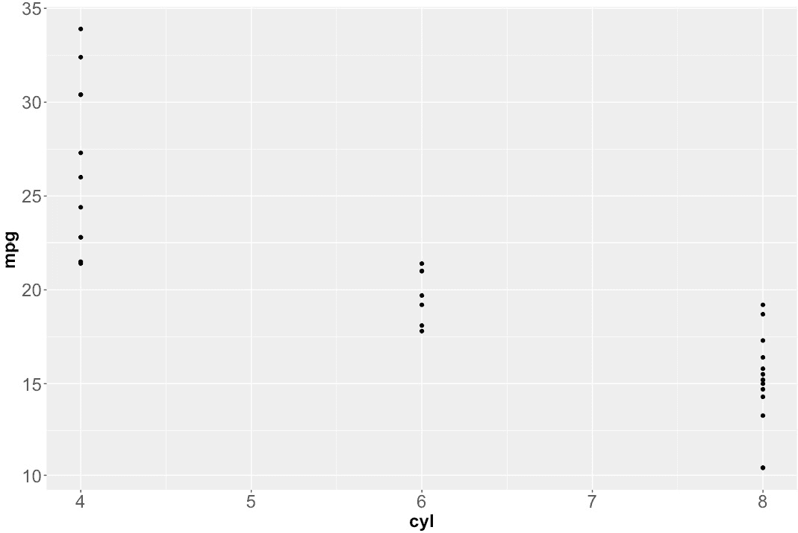

图 4.1 – cyl 和 mpg 之间的散点图

注意，`aes()`函数将`cyl`映射到*x*轴，将`mpg`映射到*y*轴。当映射关系没有明确显示时，我们通常假设第一个参数对应于水平轴，第二个对应于垂直轴。

生成散点图的脚本由两个高级函数组成：`ggplot()`和`geom_point()`。`ggplot()`函数在第一个参数中指定要使用的数据集，在第二个参数中指定分别绘制在两个轴上的变量，使用`aes()`函数包装（更多内容将在后面介绍）。`geom_point()`函数强制显示为散点图。这两个函数通过特定的`+`运算符连接在一起，表示将第二层操作叠加到第一层。

此外，请注意，`ggplot()`将`cyl`变量视为数值，如水平轴上的额外标签`5`和`7`所示。我们可以通过以下方式验证`cyl`的独立值：

```py

>>> unique(mtcars$cyl)
6 4 8
```

显然，我们需要将其视为一个分类变量，以避免不同值之间的不必要插值。这可以通过使用`factor()`函数包装`cyl`变量来实现，该函数将输入参数转换为分类输出：

```py

>>> ggplot(mtcars, aes(factor(cyl), mpg)) +
  geom_point() +
  theme(axis.text=element_text(size=18),
        axis.title=element_text(size=18,face="bold"))
```

结果图示在*图 4**.2*中。通过显式地将`cyl`转换为分类变量，水平轴正确地表示了每个唯一`cyl`值的点分布：

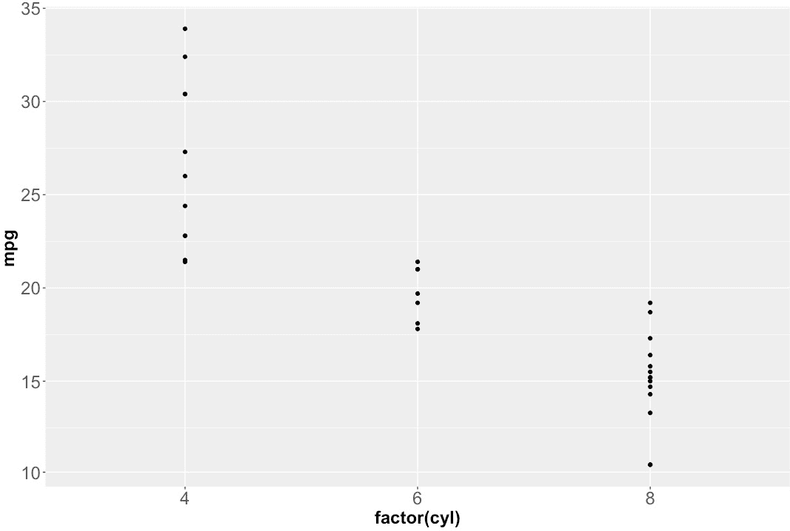

图 4.2 – 将 cyl 转换为分类变量后的散点图

到目前为止，我们已经学习了如何通过转换到所需类型后传入感兴趣的变量来构建散点图。这与其他类型的图表类似，遵循一套标准的语法规则。接下来，我们将探讨这些基本规则以了解它们的共性。

# 理解图形语法

之前的例子包含了在绘图时需要指定的三个基本层：**数据**、**美学**和**几何形状**。每一层的主要目的如下列出：

+   数据层指定要绘制的数据集。这对应于我们之前指定的`mtcars`数据集。

+   美学层指定了与缩放相关的项目，这些项目将变量映射到图表的视觉属性。例如，包括用于*x*轴和*y*轴的变量、大小和颜色，以及其他图表美学。这对应于我们之前指定的`cyl`和`mpg`变量。

+   几何层指定了用于数据的视觉元素，例如通过点、线或其他形式呈现数据。我们在前面的例子中设置的`geom_point()`命令告诉图表以散点图的形式显示。

其他层，如主题层，也有助于美化图表，我们将在后面介绍。

前面的例子中的`geom_point()`层还暗示我们可以通过更改下划线后的关键字轻松切换到另一种类型的图表。例如，如以下代码片段所示，我们可以使用`geom_boxplot()`函数将散点图显示为每个独特的`cyl`值的箱线图：

```py

>>> ggplot(mtcars, aes(factor(cyl), mpg)) +
  geom_boxplot() +
  theme(axis.text=element_text(size=18),
        axis.title=element_text(size=18,face="bold"))
```

执行此命令将生成*图 4.3*所示的输出，该输出将每个不同的`cyl`值的一组点作为箱线图进行可视化。使用箱线图是检测异常值（如位于第三个箱线图外的两个极端点）的一种极好方式：

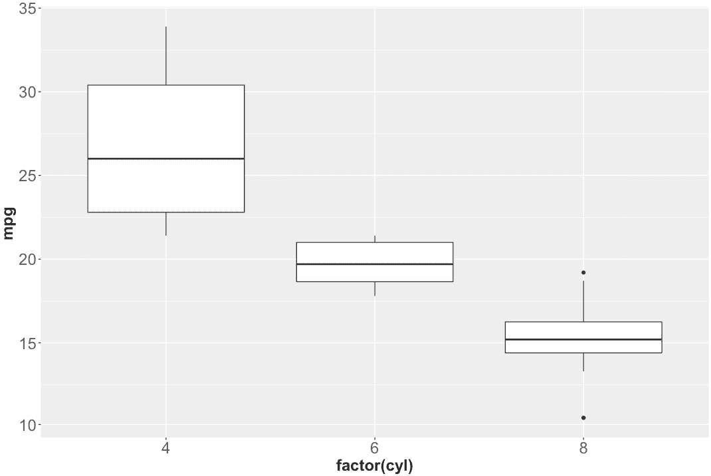

图 4.3 – 使用箱线图可视化相同的图表

类似地，我们可以通过调整美学层来改变之前散点图中点的颜色和大小。让我们通过一个练习来看看如何实现这一点。

### 练习 4.2 – 改变散点图中点的颜色和大小

在这个练习中，我们将使用美学层根据`disp`和`hp`变量修改最后散点图中显示的点的颜色和大小。`disp`变量衡量发动机排量，而`hp`变量表示总马力。因此，点的颜色和大小将根据`disp`和`hp`的不同值而变化。按照以下步骤进行：

1.  通过在`aes()`函数中将`disp`传递给`color`参数来改变散点图中点的颜色。同时，也将图例的`size`参数放大：

    ```py

    >>> ggplot(mtcars, aes(factor(cyl), mpg, color=disp)) +
      geom_point() +
      theme(axis.text=element_text(size=18),
           axis.title=element_text(size=18,face="bold"),
            legend.text = element_text(size=20))
    ```

    执行此命令将生成*图 4.4*所示的输出，其中每个点的颜色渐变根据`disp`的值而变化：

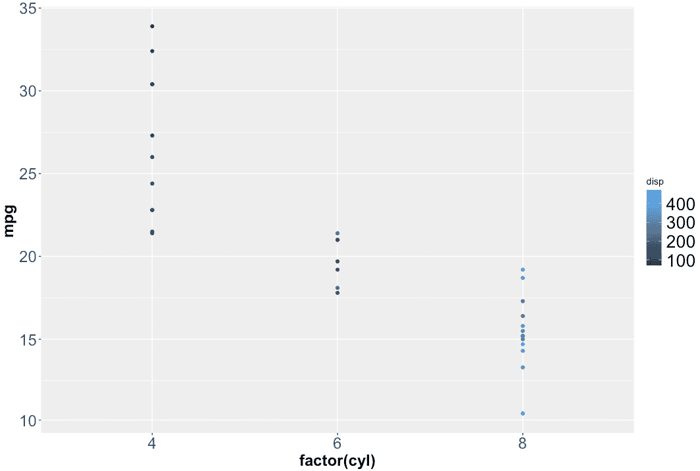

图 4.4 – 向散点图添加颜色

1.  通过在`aes()`函数中将`hp`传递给`size`参数，如下所示，来改变散点图中点的尺寸：

    ```py

    >>> ggplot(mtcars, aes(factor(cyl), mpg, color=disp, size=hp)) +
      geom_point()
    ```

    执行此命令将生成*图 4.5*所示的输出，其中每个点的尺寸也根据`hp`的值而变化：

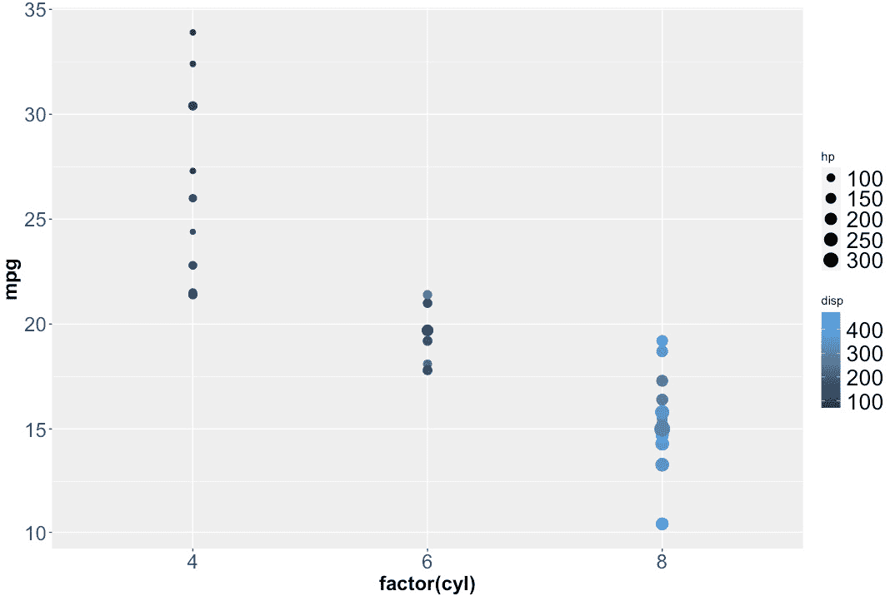

图 4.5 – 改变散点图中点的尺寸

虽然现在图表看起来更加丰富，但在向单个图表添加维度时要小心。在我们的当前示例中，单个图表包含四个维度的信息：`cyl`、`mpg`、`disp` 和 `hp`。人类大脑擅长处理二维或三维视觉，但在面对更高维度的图表时可能会感到困难。展示风格取决于我们想要传达给观众的信息。与其将所有维度混合在一起，不如构建一个只包含两个或三个变量的单独图表进行说明可能更有效。记住——在模型开发中，有效的沟通在于传达给观众的信息质量，而不是视觉输出的丰富性。

以下练习将让我们更详细地查看不同层级的各个组件。

### 练习 4.3 – 使用平滑曲线拟合构建散点图

在这个练习中，我们将构建一个散点图，并拟合一个穿过点的平滑曲线。添加平滑曲线有助于我们检测点之间的整体模式，这是通过使用 `geom_smooth()` 函数实现的。按照以下步骤进行：

1.  使用 `hp` 和 `mpg` 构建散点图，并使用 `geom_smooth()` 进行平滑曲线拟合，使用 `disp` 进行着色，并通过在 `geom_point()` 中设置 `alpha=0.6` 来调整点的透明度：

    ```py

    >>> ggplot(mtcars, aes(hp, mpg, color=disp)) +
      geom_point(alpha=0.6) +
      geom_smooth() +
      theme(axis.text=element_text(size=18),
           axis.title=element_text(size=18,face="bold"),
            legend.text = element_text(size=20))
    ```

    执行前面的命令会生成**图 4**.6 所示的输出，其中中心蓝色曲线代表最佳拟合点的模型，周围的界限表示不确定性区间。我们将在后面的章节中更详细地讨论模型的概念：

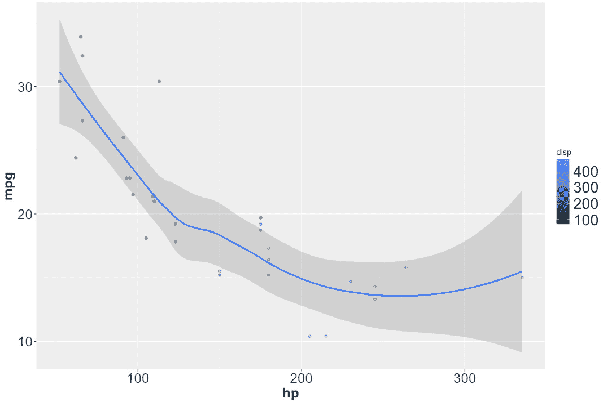

**图 4.6** – 在散点图中拟合点之间的平滑曲线

由于图形是基于叠加层概念构建的，我们也可以通过从一些组件开始，将它们存储在变量中，然后向图形变量添加额外的组件来生成一个图。让我们看看以下步骤是如何实现的。

1.  使用与之前相同的透明度级别，使用 `hp` 和 `mpg` 构建散点图，并将其存储在 `plt` 变量中：

    ```py

    >>> plt = ggplot(mtcars, aes(hp, mpg)) +
      geom_point(alpha=0.6) +
      theme(axis.text=element_text(size=18),
           axis.title=element_text(size=18,face="bold"))
    >>> plt
    ```

    如**图 4**.7 所示，直接打印出 `plt` 会生成一个工作图，这表明一个图也可以作为一个对象存储：

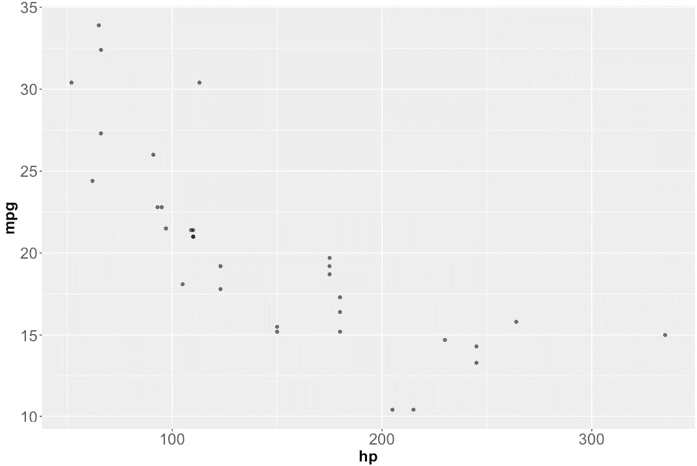

**图 4.7** – 使用 hp 和 mpg 生成散点图

1.  使用 `disp` 着色点，并像这样向之前的图表添加平滑曲线拟合：

    ```py

    >>> plt = plt +
      geom_point(aes(color=disp)) +
      geom_smooth()
    >>> plt
    ```

    执行这些命令将生成与**图 4**.6 所示相同的图。因此，我们可以构建一个基础图，将其保存在变量中，并通过添加额外的图层规格来调整其视觉属性。

我们还可以通过指定相关参数来对散点图中点的尺寸、形状和颜色进行更精细的控制，所有这些都可以在以下练习中完成。

### 练习 4.4 – 控制散点图中点的尺寸、形状和颜色

在这个练习中，我们将通过不同的输入参数来控制散点图中点的几个视觉属性。这些控制由 `geom_point()` 函数提供。按照以下步骤进行：

1.  生成 `hp` 和 `mpg` 之间的散点图，并使用 `disp` 为点着色。将点显示为大小为 `4` 的圆圈：

    ```py

    >>> ggplot(mtcars, aes(hp, mpg, color=disp)) +
      geom_point(shape=1, size=4) +
      theme(axis.text=element_text(size=18),
           axis.title=element_text(size=18,face="bold"),
            legend.text = element_text(size=20))
    ```

    执行此命令将生成 *图 4.8* 中所示的输出，其中我们看到点被放大成不同颜色的圆圈：

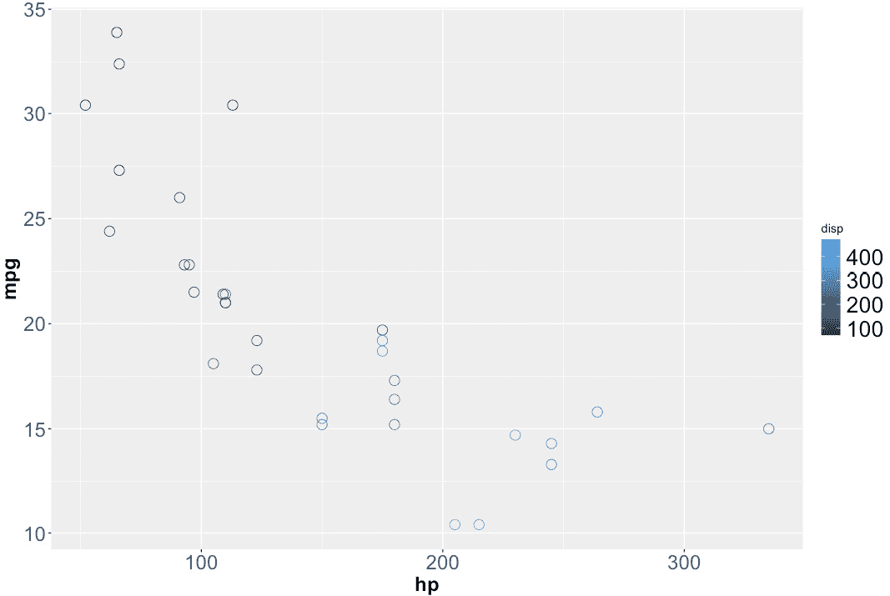

图 4.8 – 使用较大尺寸的圆圈作为点的散点图

注意，在 `geom_point()` 中设置 `shape=1` 将点显示为圆圈。我们可以通过更改此参数以其他形式展示它们。例如，以下命令将点可视化成较小尺寸的三角形：

```py

>>> ggplot(mtcars, aes(hp, mpg, color=disp)) +
  geom_point(shape=2, size=2) +
  theme(axis.text=element_text(size=18),
       axis.title=element_text(size=18,face="bold"),
        legend.text = element_text(size=20))
```

这在 *图 4.9* 中显示：

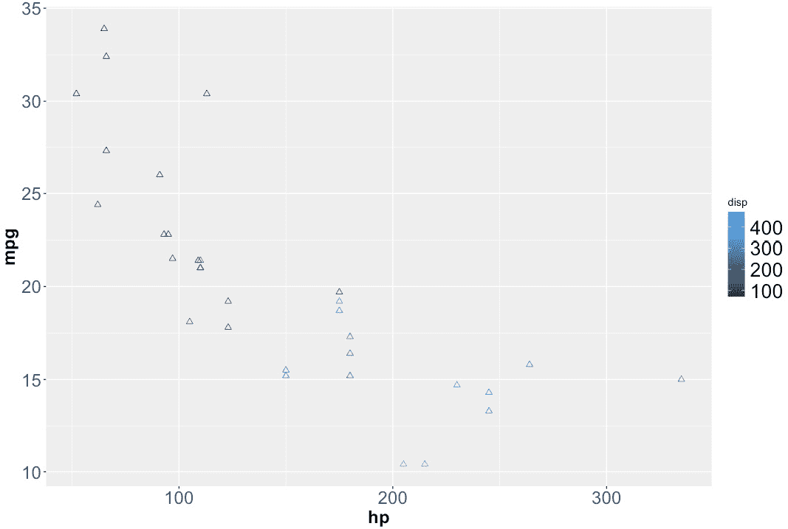

图 4.9 – 在散点图中将点可视化成三角形

接下来，我们将探讨如何通过填充点的内部颜色来使散点图更具视觉吸引力。

1.  使用 `aes()` 函数中的 `cyl`（在将其转换为因子类型后）填充之前散点图的颜色，并在 `geom_point()` 函数中将 `shape` 参数设置为 `21`，`size` 设置为 `5`，透明度（通过 `alpha`）设置为 `0.6`：

    ```py

    >>> ggplot(mtcars, aes(wt, mpg, fill = factor(cyl))) +
      geom_point(shape = 21, size = 5, alpha = 0.6) +
      theme(axis.text=element_text(size=18),
           axis.title=element_text(size=18,face="bold"),
            legend.text = element_text(size=20))
    ```

    观察到 *图 4.10* 中的输出，现在图表看起来更具视觉吸引力，其中三组点分布在 `hp` 和 `mpg` 的不同范围内。一个敏锐的读者可能会想知道为什么我们设置 `shape=21`，而点仍然被可视化成圆圈。这是因为 `21` 是一个特殊值，允许填充圆圈的内部颜色，以及它们的轮廓或外部颜色：

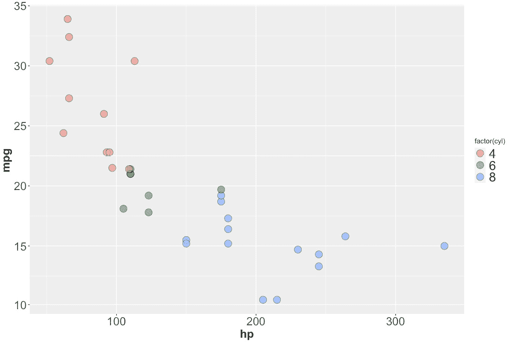

图 4.10 – 散点图中点的内部颜色填充

注意，除了在图上可视化点之外，我们还可以将它们作为文本标签来展示，这在特定场景中可能更有信息量。也可能出现多个点重叠的情况，使得难以区分它们。让我们看看如何处理这种情况，并通过以下练习以不同的方式展示点。

### 练习 4.5 – 散点图中展示点的不同方式

在这个练习中，我们将学习两种不同的方式来展示散点图中的点：显示文本标签和抖动重叠的点。这两种技术都将为我们的绘图工具包增加更多灵活性。按照以下步骤进行：

1.  使用 `row.names()` 根据每行的名称可视化品牌名称，并使用 `geom_text()` 将它们绘制在 `hp` 对 `mpg` 的先前散点图上：

    ```py

    >>> ggplot(mtcars, aes(hp, mpg)) +
      geom_text(label=row.names(mtcars)) +
      theme(axis.text=element_text(size=18),
           axis.title=element_text(size=18,face="bold"))
    ```

    执行此命令将生成如图 *图 4**.11* 所示的输出，其中品牌名称取代了点。然而，一些品牌名称彼此重叠，使得难以识别它们的特定文本。让我们看看如何解决这个问题：

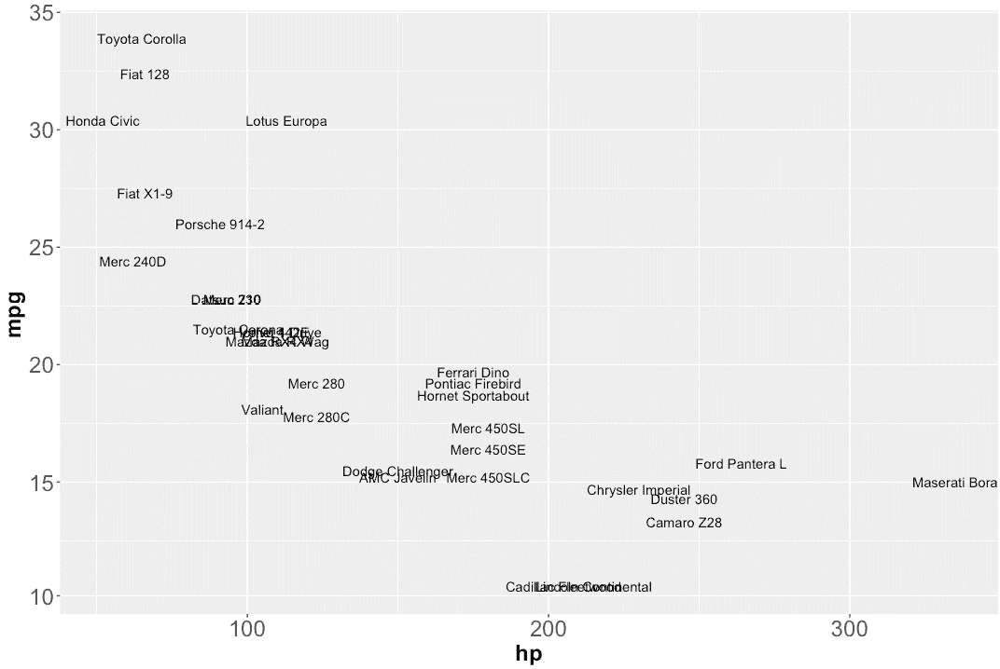

图 4.11 – 在散点图中显示品牌名称

1.  通过将 `position_jitter()` 函数传递给 `geom_text()` 函数的 `position` 参数来调整重叠文本：

    ```py

    >>> ggplot(mtcars, aes(hp, mpg)) +
      geom_text(label=row.names(mtcars),
                fontface = "bold",
               position=position_jitter(width=20,height=20)) +
      theme(axis.text=element_text(size=18),
           axis.title=element_text(size=18,face="bold"))
    ```

    执行此命令将生成如图 *图 4**.12* 所示的输出，其中我们额外指定了 `fontface` 参数为 `bold` 以提高清晰度。通过更改 `position_jitter()` 函数的 `width` 和 `height` 参数并将其传递给 `geom_text()` 函数的 `position` 参数，我们成功调整了图表中文本的位置，使其现在更易于视觉理解：

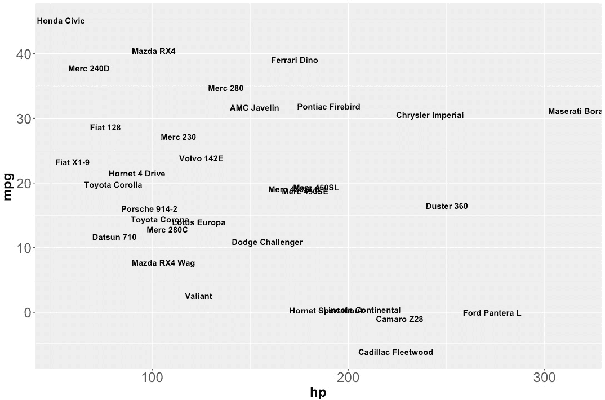

图 4.12 – 抖动文本的位置

接下来，我们将探讨如何抖动重叠点。

1.  按如下方式生成 `cyl` 因素与 `mpg` 的散点图：

    ```py

    >>> ggplot(mtcars, aes(factor(cyl), mpg)) +
      geom_point() +
      theme(axis.text=element_text(size=18),
           axis.title=element_text(size=18,face="bold"))
    ```

    执行此命令将生成如图 *图 4**.13* 所示的输出，其中我们故意使用了 `cyl` 分类型变量来显示多个点在图上重叠：


图 4.13 – 可视化具有重叠点的散点图

让我们调整重叠点的位置，使它们在视觉上可区分，从而给我们一个关于有多少这样的点排列在单个位置上的感觉。请注意，抖动意味着在这种情况下向点添加随机位置调整。

1.  使用 `geom_jitter()` 函数对点进行抖动，如下所示：

    ```py

    >>> ggplot(mtcars, aes(factor(cyl), mpg)) +
      geom_jitter() +
      theme(axis.text=element_text(size=18),
           axis.title=element_text(size=18,face="bold"))
    ```

    执行此命令将生成如图 *图 4**.14* 所示的输出，其中 `cyl` 每个类别的点现在彼此分离，而不是排列在同一条线上。添加随机抖动因此有助于通过随机扰动来视觉上分离重叠的点：

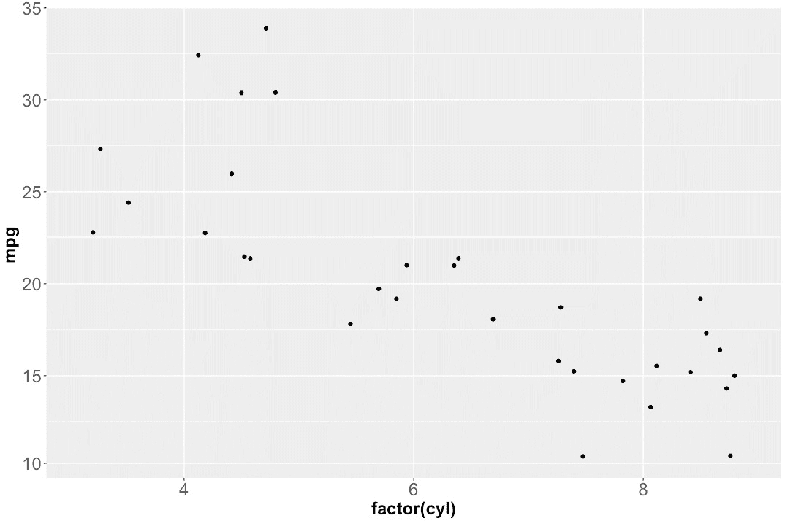

图 4.14 – 随机抖动重叠点

接下来，我们将探讨确定图中显示的视觉元素的图形几何形状。

# 图形中的几何形状

上一节主要介绍了散点图。在本节中，我们将介绍两种额外的常见图表类型：条形图和折线图。我们将讨论构建这些图表的不同方法，重点关注可以用来控制图形特定视觉属性的几何形状。

## 理解散点图中的几何关系

让我们回顾一下散点图，并放大几何层。几何层决定了图表的实际外观，这是我们视觉交流中的基本层。在撰写本文时，我们有超过 50 种几何形状可供选择，所有这些都以 `geom_` 关键字开头。

在决定使用哪种几何形状时，有一些总体指南适用。例如，以下列表包含典型散点图可能适用的几何形状类型：

+   **点**，将数据可视化表示为点

+   **抖动**，向散点图添加位置抖动

+   **拟合线**，在散点图上添加一条线

+   **平滑**，通过拟合趋势线并添加置信界限来平滑图表，以帮助识别数据中的特定模式

+   **计数**，在散点图的每个位置计数并显示观测值的数量

每个几何层都与其自己的美学配置相关联，包括强制性和可选设置。例如，`geom_point()` 函数需要 `x` 和 `y` 作为强制参数来唯一定位图表上的点，并允许可选设置，如 `alpha` 参数来控制透明度级别，以及 `color` 和 `fill` 来管理点的着色，以及它们的 `shape` 和 `size` 参数，等等。

由于几何层提供层特定控制，我们可以在美学层或几何层中设置一些视觉属性。例如，以下代码生成了与图*4.15*中显示的相同图表，其中着色可以在基本的 `ggplot()` 函数或特定于层的 `geom_point()` 函数中设置：

```py

>>> ggplot(mtcars, aes(hp, mpg, color=factor(cyl))) +
  geom_point() +
  theme(axis.text=element_text(size=18),
        axis.title=element_text(size=18,face="bold"),
        legend.text = element_text(size=20))
>>> ggplot(mtcars, aes(hp, mpg)) +
  geom_point(aes(col=factor(cyl))) +
  theme(axis.text=element_text(size=18),
        axis.title=element_text(size=18,face="bold"),
        legend.text = element_text(size=20))
```

这会产生以下图表：

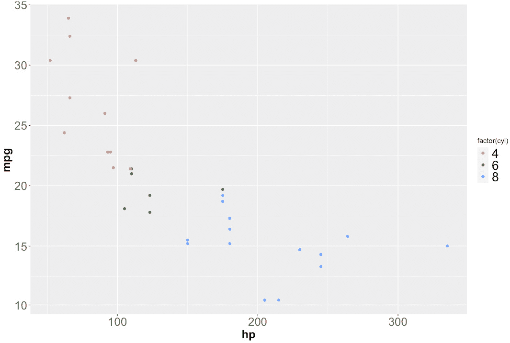

图 4.15 – 使用特定于层的几何控制生成相同的散点图

当我们在图表中显示多个层（不一定是不同类型）时，层特定控制带来的灵活性就显现出来了。在接下来的练习中，我们将看到如何一起使用多个几何层。

### 练习 4.6 – 使用多个几何层

在这个练习中，我们将在之前的散点图上显示不同 `cyl` 组的 `hp` 和 `mpg` 的平均值。一旦从原始 `mtcars` 数据集中获得，可以通过叠加另一个几何层，采用相同类型的散点图来添加额外的平均统计信息。按照以下步骤进行：

1.  使用 `dplyr` 库计算每个 `cyl` 组所有列的平均值，并将结果存储在一个名为 `tmp` 的变量中：

    ```py

    >>> library(dplyr)
    >>> tmp = mtcars %>%
      group_by(factor(cyl)) %>%
      summarise_all(mean)
    >>> tmp
    # A tibble: 3 × 12
      `factor(cyl)`   mpg   cyl  disp    hp  drat    wt  qsec
      <fct>         <dbl> <dbl> <dbl> <dbl> <dbl> <dbl> <dbl>
    1 4              26.7     4  105.  82.6  4.07  2.29  19.1
    2 6              19.7     6  183\. 122.   3.59  3.12  18.0
    3 8              15.1     8  353\. 209.   3.23  4.00  16.8
    # … with 4 more variables: vs <dbl>, am <dbl>,
    #   gear <dbl>, carb <dbl>
    ```

    我们可以看到，使用`summarize_all()`函数获取所有列的平均值的摘要统计信息，这是一个将输入函数应用于每个组的所有列的实用函数。在这里，我们传递`mean`函数来计算列的平均值。结果存储在`tmp`中的`tibble`对象包含了`cyl`三个组中所有变量的平均值。

    需要注意的是，在添加额外的几何层时，基础美学层期望每个几何层中具有相同的列名。在`ggplot()`函数中的基础美学层适用于所有几何层。让我们看看如何添加一个额外的几何层作为散点图来展示不同`cyl`组中平均`hp`和`mpg`值。

1.  添加一个额外的散点图层来展示每个`cyl`组的平均`hp`和`mpg`值作为大正方形：

    ```py

    >>> ggplot(mtcars, aes(x=hp, y=mpg, color=factor(cyl))) +
      geom_point() +
      geom_point(data=tmp, shape=15, size=6) +
      theme(axis.text=element_text(size=18),
           axis.title=element_text(size=18,face="bold"),
            legend.text = element_text(size=20))
    ```

    执行此命令将生成*图 4.16*中所示的输出，其中大正方形（通过在第二个`geom_point`层中设置`shape=15`和`size=6`获得）来源于`tmp`数据集，这是通过附加几何层中的`data`参数指定的。

    注意，平均`hp`和`mpg`值会自动左连接到现有数据集中，这显示了每个`cyl`组中不同的`hp`和`mpg`值。为了确保两个几何层在绘图时相互兼容，我们需要确保所有匹配的坐标（`x`和`y`参数）存在于相应的原始数据集中：

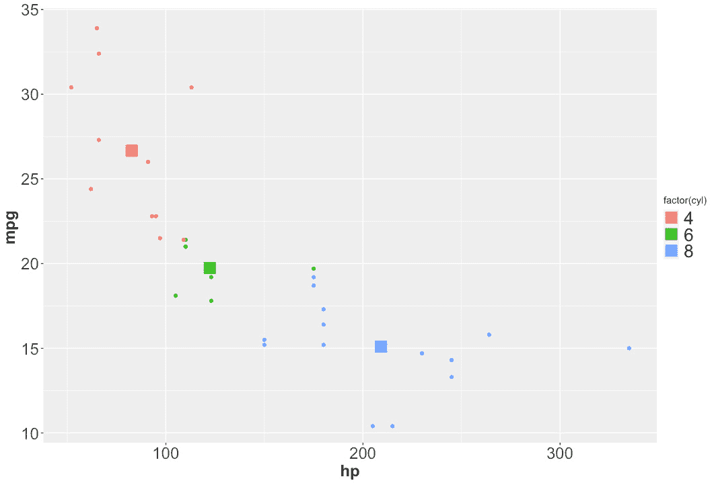

图 4.16 – 可视化每个 cyl 组的平均 hp 和 mpg 值

此图由两个几何层组成，其中第一层将每个观测值绘制为小圆圈，第二层将每个`cyl`组的`hp`和`mpg`的平均值绘制为大正方形。添加额外层遵循相同的原理，只要每个层的源数据包含基础美学层中指定的列名。

为了进一步说明多个层需要匹配坐标的需求，让我们在控制台中尝试输入以下命令，其中我们只选择传递给第二个几何层的原始数据中的`mpg`和`disp`列。如输出所示，期望有`hp`列，如果没有它将抛出错误：

```py

>>> ggplot(mtcars, aes(x=hp, y=mpg, color=factor(cyl))) +
  geom_point() +
  geom_point(data=tmp[,c("mpg","disp")], shape=15, size=6)
Error in FUN(X[[i]], ...) : object 'hp' not found
```

在下一节中，我们将探讨一种新的绘图类型：条形图，以及与其相关的几何层。

## 引入条形图

条形图以条形的形式显示分类或连续变量的某些统计信息（如频率或比例）。在多种类型的条形图中，直方图是一种特殊的条形图，它显示了单个连续变量的分箱分布。因此，绘制直方图始终涉及一个连续输入变量，使用 `geom_histogram()` 函数并仅指定 `x` 参数来实现。在内部，该函数首先将连续输入变量切割成离散的箱。然后，它使用内部计算的 `count` 变量来指示每个箱中要传递给 `y` 参数的观测数。

让我们看看如何在以下练习中构建直方图。

### 练习 4.7 – 构建直方图

在这个练习中，我们将探讨在显示直方图时应用位置调整的不同方法。按照以下步骤进行：

1.  使用 `geom_histogram()` 层构建 `hp` 变量的直方图，如下所示：

    ```py

    >>> ggplot(mtcars, aes(x=hp)) +
      geom_histogram() +
      theme(axis.text=element_text(size=18),
           axis.title=element_text(size=18,face="bold"))
    `stat_bin()` using `bins = 30`. Pick better value with `binwidth`.
    ```

    执行此命令将生成 *图 4.17* 中所示的输出，以及关于分箱的警告信息。这是因为默认的分箱值不适合，因为条形之间存在多个间隙，这使得对连续变量的解释变得困难。我们需要使用 `binwidth` 参数微调每个箱的宽度：

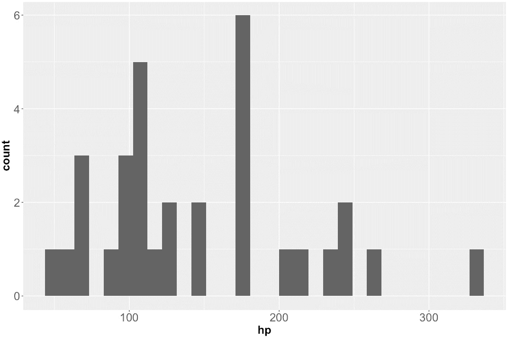

图 4.17 – 为 hp 绘制直方图

1.  调整 `binwidth` 参数以使直方图连续并移除警告信息，如下所示：

    ```py

    >>> ggplot(mtcars, aes(x=hp)) +
      geom_histogram(binwidth=40) +
      theme(axis.text=element_text(size=18),
           axis.title=element_text(size=18,face="bold"))
    ```

    这将产生以下输出：

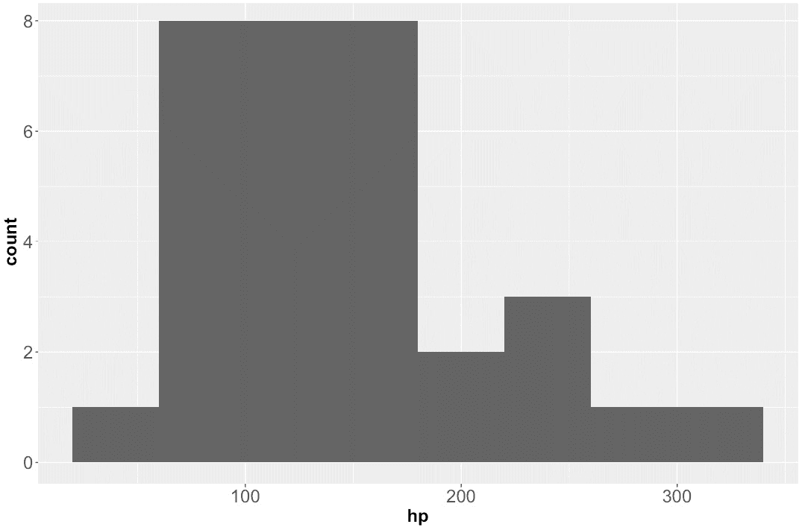

图 4.18 – 显示连续直方图

制作看起来连续的直方图取决于数据，并且需要尝试和错误。在这种情况下，设置 `binwidth=40` 似乎对我们有效。

接下来，我们将通过更改条形的着色将分组引入之前的直方图。

1.  根据因子的 `cyl` 使用 `fill` 参数以不同颜色填充条形：

    ```py

    >>> ggplot(mtcars, aes(x=hp, fill=factor(cyl))) +
      geom_histogram(binwidth=40) +
      theme(axis.text=element_text(size=18),
           axis.title=element_text(size=18,face="bold"),
            legend.text = element_text(size=20))
    ```

    执行此命令将生成 *图 4.19* 中所示的输出，其中每个条形代表不同的 `cyl` 组。然而，一个机敏的读者可能会立即发现，对于某些有两种颜色的条形，很难判断它们是重叠的还是堆叠在一起的。确实，直方图的默认设置是 `position="stack"`，这意味着条形默认是堆叠的。为了消除这种混淆，我们可以明确地显示条形并排：

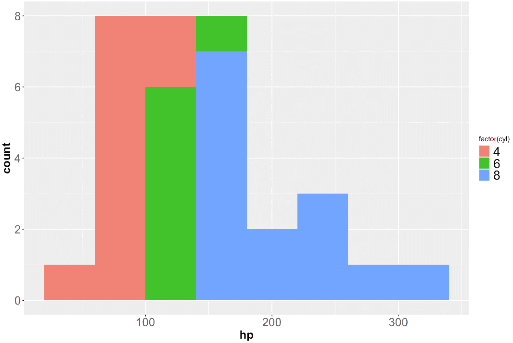

图 4.19 – 为直方图的条形着色

1.  通过设置 `position="dodge"` 来并排显示条形，如下所示：

    ```py

    >>> ggplot(mtcars, aes(x=hp, fill=factor(cyl))) +
      geom_histogram(binwidth=40, position="dodge") +
      theme(axis.text=element_text(size=18),
           axis.title=element_text(size=18,face="bold"),
            legend.text = element_text(size=20))
    ```

    执行此命令将生成 *图 4.20* 中所示的输出，其中条形现在并排显示。我们可以进一步调整 `binwidth` 参数以减少条形之间的间隙：

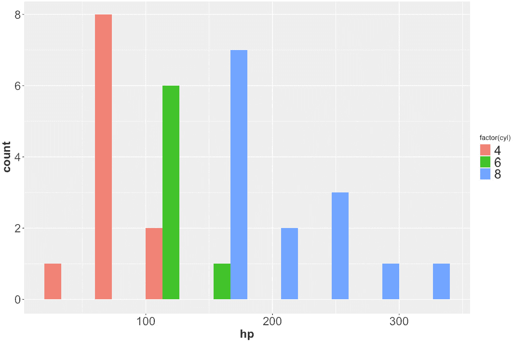

图 4.20 – 并排条形图

最后，我们还可以将统计数据以比例而不是计数的形式显示。

1.  通过执行以下代码来显示按`cyl`分类的`hp`的前一个直方图作为比例：

    ```py

    >>> ggplot(mtcars, aes(x=hp, fill=factor(cyl))) +
      geom_histogram(binwidth=40, position="fill") +
      ylab("Proportion") +
      theme(axis.text=element_text(size=18),
           axis.title=element_text(size=18,face="bold"),
            legend.text = element_text(size=20))
    ```

    执行此命令将生成*图 4.21*中所示的输出，其中`ylab()`函数用于更改*y*轴的标签。由于每个箱子的比例需要加起来等于`1`，因此图表包含等高的条形，每个条形包含一个或多个组。对于包含多个组的每个箱子，每种颜色的高度代表落在该特定`cyl`组内的观测值的比例。这种图表通常在我们只关心每个组的相对百分比而不是绝对计数时使用：

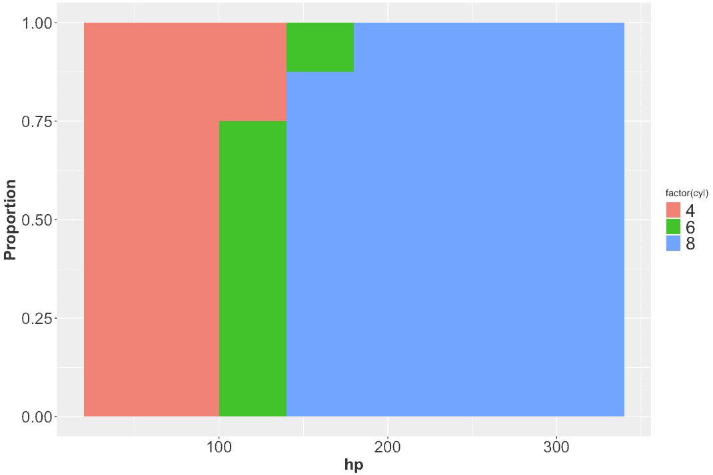

图 4.21 – 以比例显示条形图

如前所述，直方图是一种特殊的条形图。经典的条形图包含*x*轴上的分类变量，其中每个位置代表落在该特定类别中的观测数的计数。可以使用`geom_bar()`函数生成条形图，该函数允许与`geom_histogram()`相同的定位调整。让我们通过以下练习来学习其用法。

### 练习 4.8 – 构建条形图

在这个练习中，我们将通过`cyl`和`gear`来可视化观测值的计数作为条形图。按照以下步骤进行：

1.  使用`cyl`作为*x*轴，在堆叠条形图中绘制每个独特的`cyl`和`gear`组合的观测值计数。

    ```py

    >>> ggplot(mtcars, aes(x=factor(cyl), fill=factor(gear))) +
      geom_bar(position="stack") +
      theme(axis.text=element_text(size=18),
           axis.title=element_text(size=18,face="bold"),
            legend.text = element_text(size=20))
    ```

    执行此命令将生成*图 4.22*中所示的输出，其中条形的高度代表特定`cyl`和`gear`组合的观测数计数：

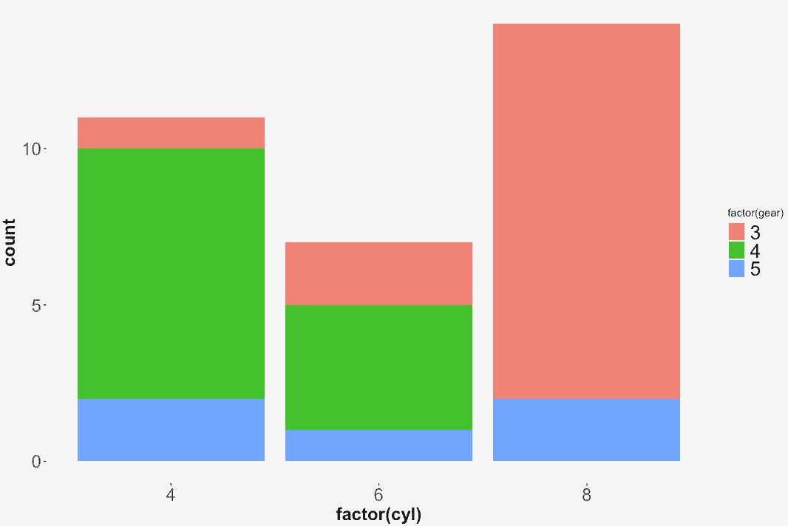

图 4.22 – 按 cyl 和 gear 堆叠的条形图

我们还可以使用各自组中观测值的比例/百分比来表示条形图。

1.  将条形图转换为基于百分比的图表，以显示每个组合的分布，如下所示：

    ```py

    >>> ggplot(mtcars, aes(x=factor(cyl), fill=factor(gear))) +
      geom_bar(position="fill") +
      theme(axis.text=element_text(size=18),
           axis.title=element_text(size=18,face="bold"),
            legend.text = element_text(size=20))
    ```

    执行此命令将生成*图 4.23*中所示的输出：

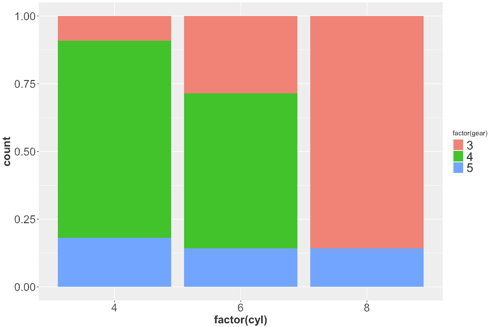

图 4.23 – 将条形图可视化成比例

如前所述，我们还可以将条形图从堆叠转换为并排。

1.  按照以下方式将之前的信息可视化成并排条形图：

    ```py

    >>> ggplot(mtcars, aes(x=factor(cyl), fill=factor(gear))) +
      geom_bar(position="dodge") +
      theme(axis.text=element_text(size=18),
           axis.title=element_text(size=18,face="bold"),
            legend.text = element_text(size=20))
    ```

    执行此命令将生成*图 4.24*中所示的输出：

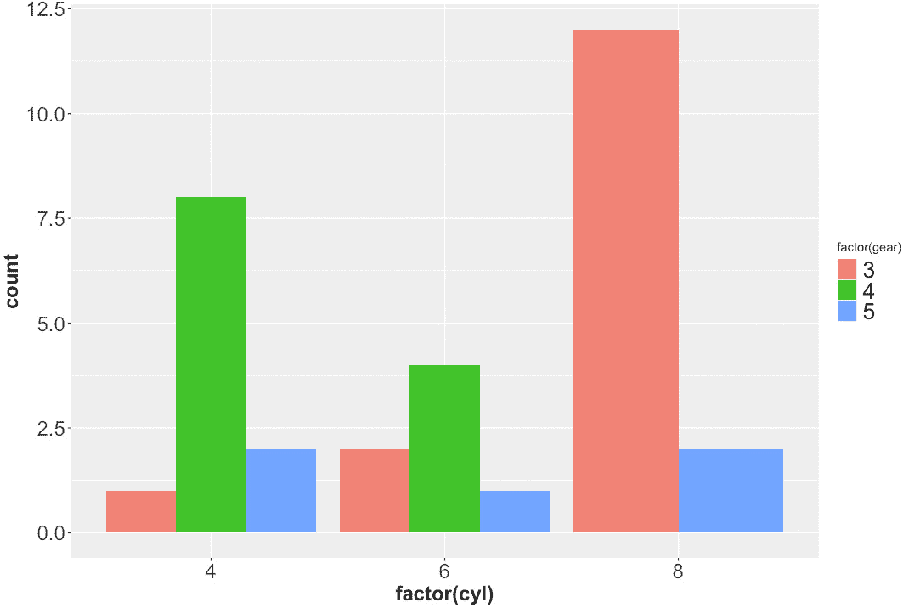

图 4.24 – 并排条形图

我们还可以自定义条形图，使条形部分重叠。这可以通过使用`position_dodge()`函数实现，如下所示，其中我们调整`width`参数以将重叠的条形抖动到一定程度：

```py

>>> ggplot(mtcars, aes(x=factor(cyl), fill=factor(gear))) +
  geom_bar(position = position_dodge(width=0.2)) +
  theme(axis.text=element_text(size=18),
        axis.title=element_text(size=18,face="bold"),
        legend.text = element_text(size=20))
```

执行此命令将生成*图 4.25*中显示的输出：

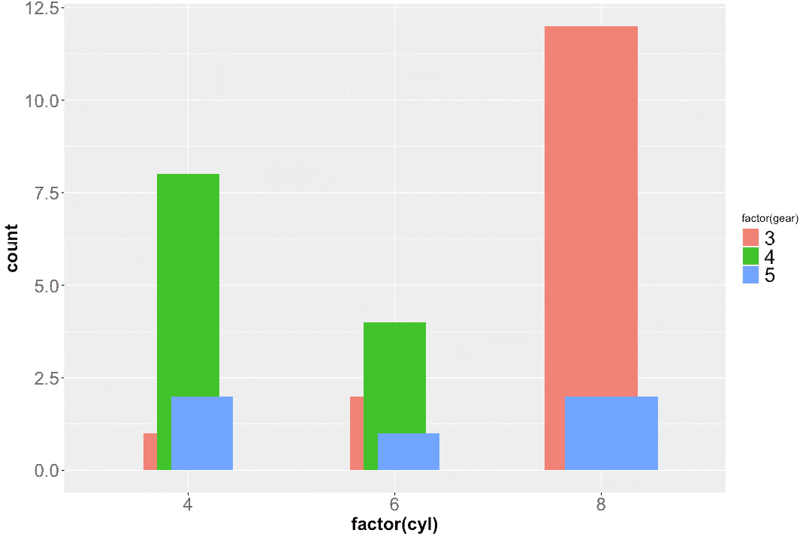

图 4.25 – 调整柱状图中重叠的条形

接下来，我们将查看另一种流行的绘图类型：线形图。

## 介绍线形图

**线形图**显示一个变量的值随着另一个变量的变化而变化。与散点图一样，线形图可以被认为是通过线连接的散点。它主要用于描述两个变量之间的关系。例如，当两个变量相互正相关时，增加一个变量会导致另一个变量似乎成比例增加。在线形图上可视化这种关系可能会在两个变量之间产生一个正斜率的趋势线。

线形图中最广泛使用的一种类型是时间序列图，其中特定指标（如股价）的值被显示为时间的函数（如每日）。在下面的练习中，我们将使用由 base R 提供的`JohnsonJohnson`数据集，查看 1960 年至 1981 年间 Johnson & Johnson 的季度收益。我们将探索不同的可视化线形图的方法，以及一些针对时间序列数据的数据处理。

### 练习 4.9 – 绘制时间序列图

在这个练习中，我们将查看将时间序列数据可视化成线形图。按照以下步骤进行：

1.  通过执行以下代码来检查`JohnsonJohnson`数据集的结构：

    ```py

    >>> str(JohnsonJohnson)
    Time-Series [1:84] from 1960 to 1981: 0.71 0.63 0.85 0.44 0.61 0.69 0.92 0.55 0.72 0.77 ...
    ```

    输出表明该数据集是一个从`1960`到`1981`的单变量（即单一变量）时间序列。打印其内容（仅显示前五行）也告诉我们，频率是季度性的，使用年-季度作为时间序列中每个数据点的唯一索引：

    ```py
    >>> JohnsonJohnson
          Qtr1  Qtr2  Qtr3  Qtr4
    1960  0.71  0.63  0.85  0.44
    1961  0.61  0.69  0.92  0.55
    1962  0.72  0.77  0.92  0.60
    1963  0.83  0.80  1.00  0.77
    1964  0.92  1.00  1.24  1.00
    ```

    让我们将它转换为熟悉的 DataFrame 格式，以便于数据操作。

1.  将其转换为名为`JohnsonJohnson2`的 DataFrame，包含两列：`qtr_earning`用于存储季度时间序列，`date`用于存储近似日期：

    ```py

    >>> library(zoo)
    >>> JohnsonJohnson2 = data.frame(qtr_earning=as.matrix(JohnsonJohnson),
               date=as.Date(as.yearmon(time(JohnsonJohnson))))
    >>> head(JohnsonJohnson2, n=3)
      qtr_earning       date
    1        0.71 1960-01-01
    2        0.63 1960-04-01
    3        0.85 1960-07-01
    ```

    `date`列是通过从`JohnsonJohnson`时间序列对象中提取`time`索引得到的，使用`as.yearmon()`显示为年月格式，然后使用`as.Date()`转换为日期格式。

    我们还将添加两个额外的指示列，用于后续的绘图。

1.  添加一个`ind`指示列，如果日期等于或晚于`1975-01-01`，则其值为`TRUE`，否则为`FALSE`。同时，从`date`变量中提取季度并存储在`qtr`变量中：

    ```py

    >>> JohnsonJohnson2 = JohnsonJohnson2 %>%
      mutate(ind = if_else(date >= as.Date("1975-01-01"), TRUE, FALSE),
             qtr = quarters(date))
    >>> head(JohnsonJohnson2, n=3)
      qtr_earning       date   ind qtr
    1        0.71 1960-01-01 FALSE  Q1
    2        0.63 1960-04-01 FALSE  Q2
    3        0.85 1960-07-01 FALSE  Q3
    ```

    在此命令中，我们使用了`quarters()`函数从一个日期格式化的字段中提取季度。接下来，我们将绘制季度收益作为时间序列。

1.  使用线形图将`qtr_earning`作为`date`的函数进行绘图，如下所示：

    ```py

    >>> ggplot(JohnsonJohnson2, aes(x=date, y=qtr_earning)) +
             geom_line() +
      theme(axis.text=element_text(size=18),
           axis.title=element_text(size=18,face="bold"))
    ```

    执行此命令将生成如图 *图 4**.26* 所示的输出，其中我们将 `date` 列指定为 *x* 轴，将 `qtr_earning` 指定为 *y* 轴，然后是 `geom_line()` 层：

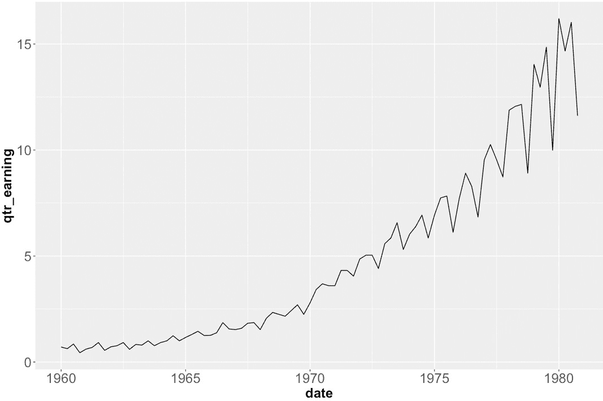

图 4.26 – 季度收益的时间序列图

季度收益的线图显示长期上升趋势和短期波动。时间序列预测的主题集中在使用这些结构组件（如趋势和季节性）来预测未来值。

此外，我们还可以对时间序列进行着色编码，以便不同的线段根据另一个分组变量显示不同的颜色。

1.  根据列 `ind` 指定线图的颜色，如下所示：

    ```py

    >>> ggplot(JohnsonJohnson2, aes(x=date, y=qtr_earning,
                                color=ind)) +
      geom_line() +
      theme(axis.text=element_text(size=18),
           axis.title=element_text(size=18,face="bold"),
            legend.text = element_text(size=20))
    ```

    执行此命令将生成如图 *图 4**.27* 所示的输出，其中我们在基础美学层中设置 `color=ind` 以更改颜色。请注意，由于这两个线段实际上是图表上分别绘制的独立时间序列，因此它们是断开的：

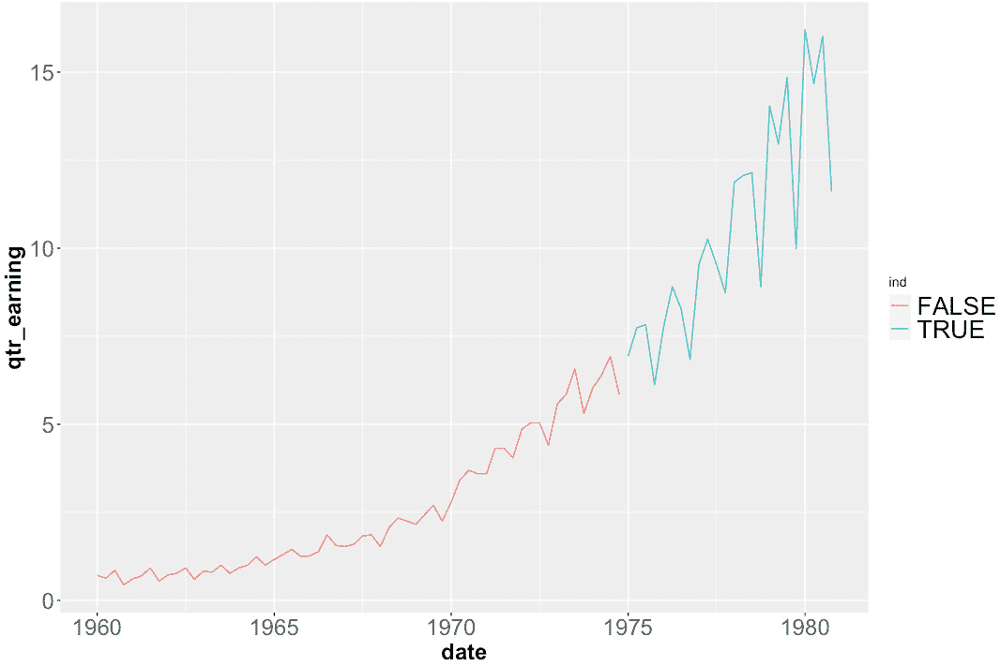

图 4.27 – 两种不同颜色的线图

当分组变量中有多个类别时，我们也可以绘制多条线，每条线将假设不同的颜色。

1.  分别绘制每个季度的时序图，如下所示：

    ```py

    >>> ggplot(JohnsonJohnson2, aes(x=date, y=qtr_earning,
                                color=qtr)) +
      geom_line() +
      theme(axis.text=element_text(size=18),
           axis.title=element_text(size=18,face="bold"),
            legend.text = element_text(size=20))
    ```

    执行前面的命令将生成如图 *图 4**.28* 所示的输出，其中 `1980`：

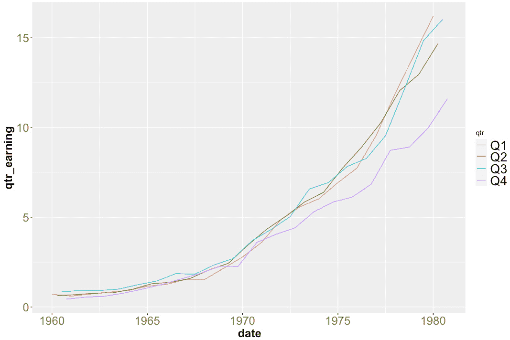

图 4.28 – 每个季度的年度时序图

在下一节中，我们将查看主题层，它控制图形的样式元素。

# 控制图形中的主题

主题层指定了图上所有非数据相关的属性，如背景、图例、轴标签等。适当控制图中的主题可以通过突出关键信息并引导用户注意我们想要传达的信息来帮助视觉沟通。

主题层控制了以下三种类型的视觉元素，如下所示：

+   **文本**，用于指定轴标签的文本显示（例如，颜色）

+   **行**，用于指定轴的视觉属性，如颜色和线型

+   **矩形**，用于控制图形的边框和背景

所有三种类型都使用以 `element_` 开头的函数指定，包括例如 `element_text()` 和 `element_line()` 的示例。我们将在下一节中介绍这些函数。

## 调整主题

主题层可以轻松地作为现有图的一个附加层应用。让我们通过一个练习来看看如何实现这一点。

### 练习 4.10 – 应用主题

在这个练习中，我们将查看如何调整之前时间序列图的与主题相关的元素，包括移动图例和更改轴的属性。按照以下步骤进行：

1.  通过叠加一个主题层，并将其`legend.position`参数指定为`"bottom"`，在底部显示前一个时间序列图的图例。同时，增大轴和图例中文字的字体大小：

    ```py

    >>> ggplot(JohnsonJohnson2, aes(x=date, y=qtr_earning,
                                color=qtr)) +
      geom_line() +
      theme(legend.position="bottom",
            axis.text=element_text(size=18),
           axis.title=element_text(size=18,face="bold"),
            legend.text = element_text(size=20))
    ```

    执行此命令将生成如图*图 4.29*所示的输出，其中图例现在被移动到图的底部：

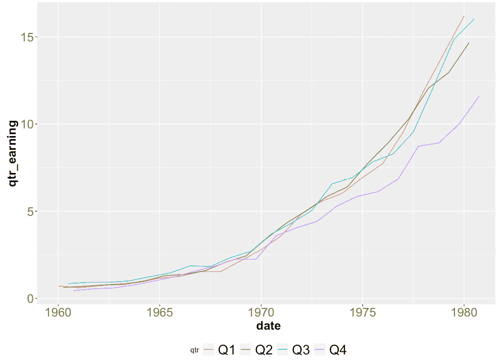

图 4.29 – 在底部显示图例

我们也可以通过向`legend.position`参数提供坐标信息来将图例放置在图的任何位置。坐标从左下角开始，值为`(0,0)`，一直延伸到右上角，值为`(1,1)`。由于图的左上部分看起来比较空旷，我们可能考虑将图例移动到那里以节省一些额外空间。

1.  通过提供一对适当的坐标来将图例移动到左上角：

    ```py

    >>> tmp = ggplot(JohnsonJohnson2, aes(x=date, y=qtr_earning,
                                color=qtr)) +
      geom_line() +
      theme(legend.position=c(0.1,0.8),
            axis.text=element_text(size=18),
           axis.title=element_text(size=18,face="bold"),
            legend.text = element_text(size=20))
    >>> tmp
    ```

    在这里，我们将图例的位置指定为`(0.1, 0.8)`。通常，使用坐标系配置适当的位置需要尝试和错误。我们还将结果保存在名为`tmp`的变量中，稍后将使用它。生成的图如图*图 4.30*所示：

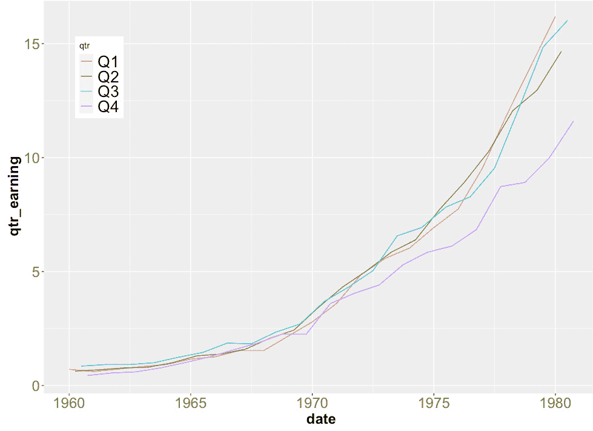

图 4.30 – 基于坐标的位置调整图例

接下来，我们将调整轴的属性。

1.  基于前一个图，使用`element_text()`函数在`axis.title`属性上更改轴标题的颜色为蓝色。同时，使用`element_line()`函数在`axis.line`属性上使轴的线条为实线黑色：

    ```py

    >>> tmp = tmp +
      theme(
        axis.title=element_text(color="blue"),
        axis.line = element_line(color = "black", linetype = "solid")
      )
    >>> tmp
    ```

    执行此命令将生成如图*图 4.31*所示的输出，其中我们使用了`element_text()`和`element_line()`函数来调整标题(`axis.title`)和轴的线条(`axis.line`)的视觉属性（`color`和`linetype`）：

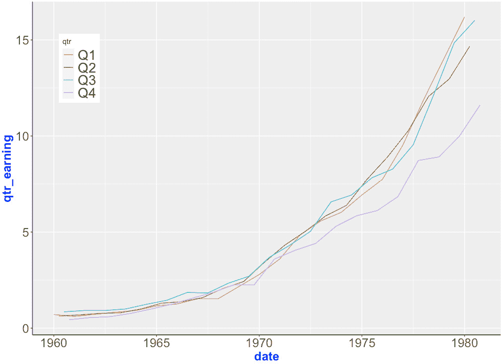

图 4.31 – 更改轴的标题和线条

最后，我们还可以更改默认的背景和网格。

1.  通过执行以下代码来移除前一个图中默认的网格和背景：

    ```py

    >>> tmp = tmp +
      theme(
        panel.grid.major = element_blank(),
        panel.grid.minor = element_blank(),
        panel.background = element_blank()
      )
    >>> tmp
    ```

    在这里，我们使用`panel.grid.major`和`panel.grid.minor`来访问网格属性，使用`panel.background`来访问图的背景属性。`element_blank()`移除所有现有配置，并指定为这三个属性。结果如图*图 4.32*所示：

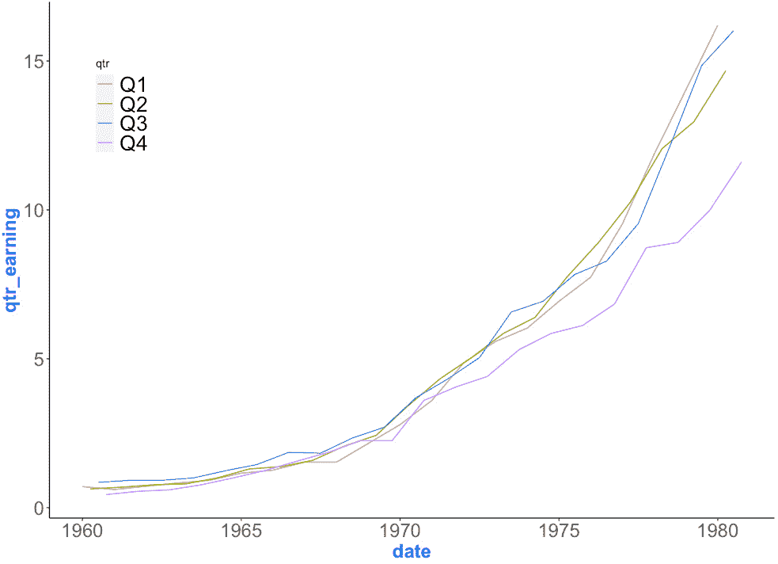

图 4.32 – 移除网格和背景设置

注意，我们还可以将主题层保存到变量中，并将其作为叠加应用到其他图中。我们将整个图或特定的图层配置作为一个变量，这使得将其扩展到多个图变得方便。

除了创建我们自己的主题之外，我们还可以利用 `ggplot2` 提供的内置主题层。如列表所示，这些内置主题提供了现成的解决方案，以简化绘图：

+   `theme_gray()`，我们之前使用的默认主题

+   `theme_classic()`，在科学绘图中最常用的传统主题

+   `theme_void()`，它移除了所有非数据相关的属性

+   `theme_bw()`，主要用于配置透明度级别时

例如，我们可以使用 `theme_classic()` 函数生成与之前相似的图表，如下面的代码片段所示：

```py

>>> ggplot(JohnsonJohnson2, aes(x=date, y=qtr_earning,
                            color=qtr)) +
  geom_line() +
  theme_classic() +
  theme(axis.text=element_text(size=18),
        axis.title=element_text(size=18,face="bold"),
        legend.text = element_text(size=20))
```

执行此命令会生成如图 *图 4**.33* 所示的输出：

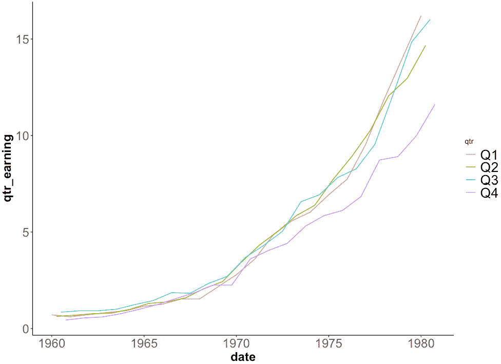

图 4.33 – 使用现成的主题设置

除了内置的主题之外，`ggthemes` 包还提供了额外的主题，进一步扩展了我们的主题选择。让我们在下一节中探索这个包。

## 探索 ggthemes

`ggthemes` 包包含多个预构建的主题。就像使用 `dplyr` 可以显著加速我们的数据处理任务一样，使用预构建的主题也可以与从头开始开发相比，简化我们的绘图工作。让我们看看这个包中可用的几个主题。

### 练习 4.11 – 探索主题

在这个练习中，我们将探索 `ggthemes` 提供的一些额外的现成主题。记住在继续下面的代码示例之前，下载并加载这个包。我们将涵盖两个主题函数。按照以下步骤进行：

1.  在上一个图表上应用 `theme_fivethirtyeight` 主题，如下所示：

    ```py

    >>> ggplot(JohnsonJohnson2, aes(x=date, y=qtr_earning,
                                color=qtr)) +
      geom_line() +
      theme_fivethirtyeight() +
      theme(axis.text=element_text(size=18),
            axis.title=element_text(size=18,face="bold"),
            legend.text = element_text(size=20))
    ```

    执行此命令会生成如图 *图 4**.34* 所示的输出，其中图例位于底部：

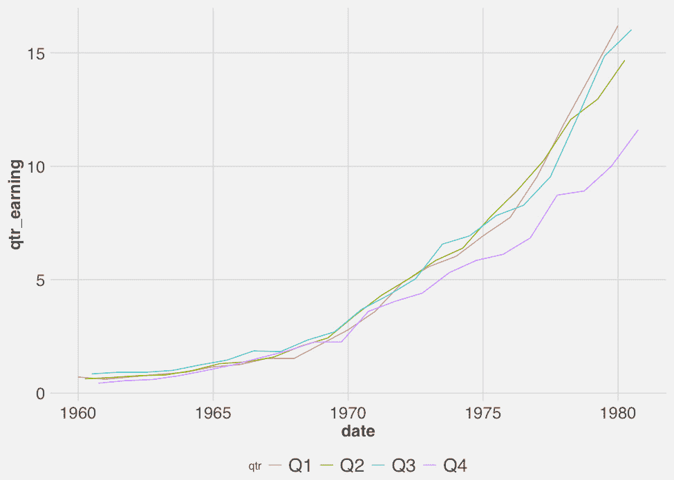

图 4.34 – 应用 theme_fivethirtyeight 主题

1.  应用 `theme_tufte()` 主题，如下所示：

    ```py

    >>> ggplot(JohnsonJohnson2, aes(x=date, y=qtr_earning,
                                color=qtr)) +
      geom_line() +
      theme_tufte() +
      theme(axis.text=element_text(size=18),
            axis.title=element_text(size=18,face="bold"),
            legend.text = element_text(size=20))
    ```

    执行此命令会生成如图 *图 4**.35* 所示的输出，这是科学论文中常用的绘图类型。请注意，学术论文中的图表建议只显示必要的信息。这意味着背景等额外配置是不被鼓励的。另一方面，现实生活中的图表则更倾向于在实用性和美观性之间保持一个合理的平衡：

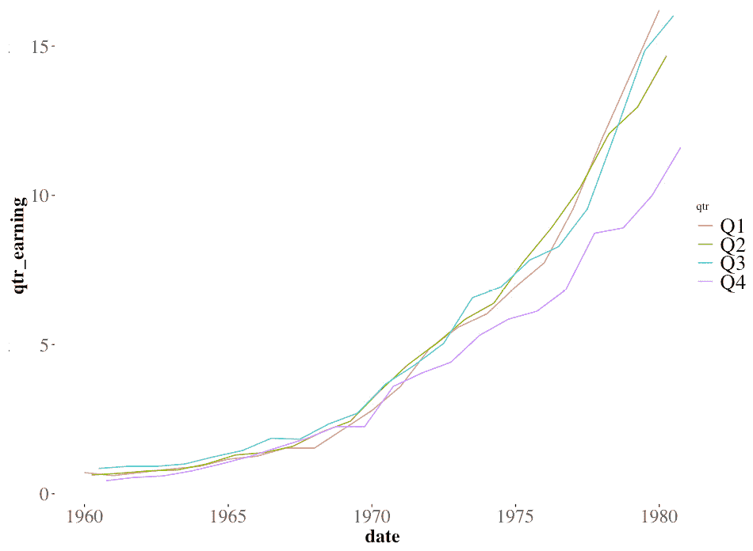

图 4.35 – 应用 theme_tufte 主题

在本节中，我们探讨了控制图表中与主题相关的元素，这在我们进行微调和自定义图表时提供了很大的灵活性。

# 概述

在本章中，我们介绍了基于`ggplot2`包的基本图形技术。我们首先回顾了基本的散点图，并学习了在图表中开发层面的语法。为了构建、编辑和改进一个图表，我们需要指定三个基本层面：数据、美学和几何。例如，用于构建散点图的`geom_point()`函数允许我们控制图表上点的尺寸、形状和颜色。我们还可以使用`geom_text()`函数将它们显示为文本，除了使用点来表示之外。

我们还介绍了由几何层提供的层特定控制，并展示了使用条形图和折线图的示例。条形图可以帮助表示分类变量的频率分布和连续变量的直方图。折线图支持时间序列数据，并且如果绘制得当，可以帮助识别趋势和模式。

最后，我们还介绍了主题层，它允许我们控制图表中所有与数据无关的视觉方面。结合基础 R 的内置主题和`ggthemes`的现成主题，我们有多种选择，可以加速绘图工作。

在下一章中，我们将介绍**探索性数据分析**（**EDA**），这是许多数据分析建模任务中常见且必要的一步。
