# 5

# 探索性数据分析

上一章介绍了使用`ggplot2`的基本绘图原则，包括各种几何形状和主题层的应用。结果证明，清理和整理原始数据（在第*第二章*和*第三章*中介绍）以及数据可视化（在第*第四章*中介绍）属于典型数据科学项目工作流程的第一阶段——即**探索性数据分析**（**EDA**）。我们将通过本章的一些案例研究来介绍这一内容。我们将学习如何应用本书前面介绍过的编码技术，并专注于通过 EDA 的视角分析数据。

在本章结束时，你将了解如何使用数值和图形技术揭示数据结构，发现变量之间的有趣关系，以及识别异常观测值。

在本章中，我们将涵盖以下主题：

+   EDA 基础

+   实践中的 EDA（探索性数据分析）

# 技术要求

要完成本章的练习，你需要具备以下条件：

+   在撰写本文时，`yfR`包的最新版本为 1.0.0

+   在撰写本文时，`corrplot`包的最新版本为 0.92

本章的代码和数据可在以下链接找到：[`github.com/PacktPublishing/The-Statistics-and-Machine-Learning-with-R-Workshop/blob/main/Chapter_5/chapter_5.R`](https://github.com/PacktPublishing/The-Statistics-and-Machine-Learning-with-R-Workshop/blob/main/Chapter_5/chapter_5.R)。

# EDA 基础

当面对以表格（DataFrame）形式存在于 Excel 中的新数据集或数据集时，EDA 帮助我们洞察数据集中变量的潜在模式和异常。这是在构建任何预测模型之前的一个重要步骤。俗话说，*垃圾输入，垃圾输出*。当用于模型开发输入变量存在问题时，如缺失值或不同尺度，所得到的模型可能会表现不佳、收敛缓慢，甚至在训练阶段出现错误。因此，理解你的数据并确保原材料是正确的，是保证模型后期表现良好的关键步骤。

这就是 EDA 发挥作用的地方。EAD（探索性数据分析）不是一种僵化的统计程序，而是一套探索性分析，它使你能够更好地理解数据中的特征和潜在关系。它作为过渡性分析，指导后续建模，涉及我们之前学到的数据操作和可视化技术。它通过各种形式的视觉辅助工具帮助总结数据的显著特征，促进重要特征的提取。

EDA 有两种主要类型：如均值、中位数、众数和四分位数范围等描述性统计，以及如密度图、直方图、箱线图等图形描述。

一个典型的 EDA 流程包括分析分类和数值变量，包括在单变量分析中独立分析以及在双变量和多变量分析中结合分析。常见做法包括分析一组给定变量的分布，并检查缺失值和异常值。在接下来的几节中，我们将首先分析不同类型的数据，包括分类和数值变量。然后，我们将通过案例研究来应用和巩固前几章中涵盖的技术，使用 `dplyr` 和 `ggplot2`。

## 分析分类数据

在本节中，我们将探讨如何通过图形和数值总结来分析两个分类变量。我们将使用来自漫威漫画宇宙的漫画角色数据集，如果你是漫威超级英雄的粉丝，这个数据集可能对你来说并不陌生。该数据集由 `read_csv()` 函数发布，该函数来自 `readr` 包，它是 `tidyverse` 宇宙的数据加载部分，如下代码片段所示：

```py

>>> library(readr)
>>> df = read_csv("https://raw.githubusercontent.com/fivethirtyeight/data/master/comic-characters/marvel-wikia-data.csv")
>>> head(df,5)
# A tibble: 16,376 × 13
   page_id name              urlslug ID    ALIGN EYE   HAIR  SEX   GSM   ALIVE APPEARANCES
     <dbl> <chr>             <chr>   <chr> <chr> <chr> <chr> <chr> <chr> <chr>       <dbl>
 1    1678 "Spider-Man (Pet… "\\/Sp… Secr… Good… Haze… Brow… Male… NA    Livi…        4043
 2    7139 "Captain America… "\\/Ca… Publ… Good… Blue… Whit… Male… NA    Livi…        3360
 3   64786 "Wolverine (Jame… "\\/Wo… Publ… Neut… Blue… Blac… Male… NA    Livi…        3061
 4    1868 "Iron Man (Antho… "\\/Ir… Publ… Good… Blue… Blac… Male… NA    Livi…        2961
 5    2460 "Thor (Thor Odin… "\\/Th… No D… Good… Blue… Blon… Male… NA    Livi…        2258
 6    2458 "Benjamin Grimm … "\\/Be… Publ… Good… Blue… No H… Male… NA    Livi…        2255
 7    2166 "Reed Richards (… "\\/Re… Publ… Good… Brow… Brow… Male… NA    Livi…        2072
 8    1833 "Hulk (Robert Br… "\\/Hu… Publ… Good… Brow… Brow… Male… NA    Livi…        2017
 9   29481 "Scott Summers (… "\\/Sc… Publ… Neut… Brow… Brow… Male… NA    Livi…        1955
10    1837 "Jonathan Storm … "\\/Jo… Publ… Good… Blue… Blon… Male… NA    Livi…        1934
# … with 16,366 more rows, and 2 more variables: `FIRST APPEARANCE` <chr>, Year <dbl>
```

打印 DataFrame 显示，该数据集包含 `16,376` 行和 `13` 列，包括角色名称、ID 等等。

在下一节中，我们将探讨如何使用计数统计量来总结两个分类变量。

## 使用计数总结分类变量

在本节中，我们将介绍分析两个分类变量的不同方法，包括使用列联表和条形图。列联表是展示两个分类变量每个唯一组合中观测值总计数的有用方式。让我们通过一个练习来了解如何实现这一点。

### 练习 5.1 – 总结两个分类变量

在这个练习中，我们将关注两个分类变量：`ALIGN`（表示角色是好人、中立还是坏人）和 `SEX`（表示角色的性别）。首先，我们将查看每个变量的唯一值，然后总结组合后的相应总计数：

1.  检查 `ALIGN` 和 `SEX` 的唯一值：

    ```py

    >>> unique(df$ALIGN)
    "Good Characters"    "Neutral Characters" "Bad Characters"     NA
    >>> unique(df$SEX)
    "Male Characters"        "Female Characters"      "Genderfluid Characters" "Agender Characters"     NA
    ```

    结果显示，这两个变量都包含 `NA` 值。让我们删除 `ALIGN` 或 `SEX` 中任一包含 `NA` 值的观测值。

1.  使用 `filter` 语句函数在 `df` 中删除 `ALIGN` 或 `SEX` 中包含 `NA` 值的观测值：

    ```py

    >>> df = df %>%
      filter(!is.na(ALIGN),
             !is.na(SEX))
    ```

    我们可以通过检查结果 DataFrame 的维度和 `ALIGN` 和 `SEX` 中 `NA` 值的计数来验证是否已成功删除包含 `NA` 值的行：

    ```py
    >>> dim(df)
    12942    13
    >>> sum(is.na(df$ALIGN))
    0
    >>> sum(is.na(df$SEX))
    0
    ```

    接下来，我们必须创建一个列联表来总结每个唯一值组合的频率。

1.  创建 `ALIGN` 和 `SEX` 之间的列联表：

    ```py

    >>> table(df$ALIGN, df$SEX)
                         Agender Characters Female Characters Genderfluid Characters Male Characters
      Bad Characters                     20               976                       0            5338
      Good Characters                    10              1537                       1            2966
      Neutral Characters                 13               640                       1            1440
    ```

    我们可以看到，大多数角色是男性且是坏的。在所有男性角色中，大多数是坏的，而女性角色中好的或中性的角色占主导地位。让我们使用条形图直观地呈现和分析比例。

1.  使用`ggplot2`在这两个变量之间创建一个条形图：

    ```py

    >>> library(ggplot2)
    >>> ggplot(df, aes(x=SEX, fill=ALIGN)) +
      geom_bar() +
      theme(axis.text=element_text(size=18),
            axis.title=element_text(size=18,face="bold"),
            legend.position = c(0.2, 0.8),
            legend.key.size = unit(2, 'cm'),
            legend.text = element_text(size=20))
    Figure 5*.1*. Here, we used the properties in the theme layer to adjust the size of labels on the graph. For example, axis.text and axis.title are used to increase the size of texts and titles along the axes, legend.position is used to move the legend to the upper-left corner, and legend.key.size and legend.text are used to enlarge the overall display of the legend:
    ```

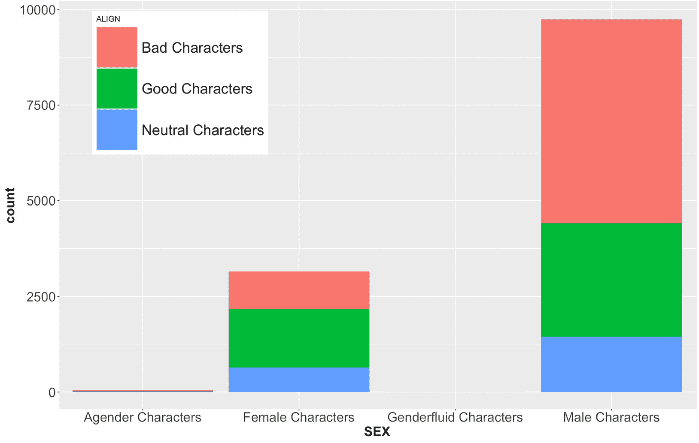

图 5.1 – ALIGN 和 SEX 的条形图

由于`Agender Characters`和`Genderfluid Characters`的总计数非常有限，我们可以在绘制条形图时移除这两个组合：

```py

>>> df %>%
  filter(!(SEX %in% c("Agender Characters", "Genderfluid Characters"))) %>%
  ggplot(aes(x=SEX, fill=ALIGN)) +
  geom_bar()
```

运行此命令生成**图 5.2**：

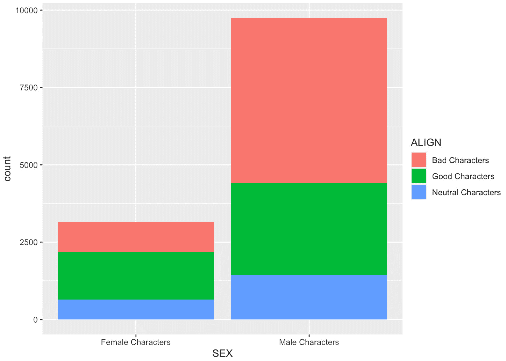

图 5.2 – 从条形图中移除低计数组合

使用计数在比较不同的组合时可能并不直观。在这种情况下，将计数转换为比例将有助于在相对尺度上呈现信息。

## 将计数转换为比例

在本节中，我们将回顾一个涵盖列联表中条件比例的练习。与之前的无条件列联表不同，在双向列联表的任一维度上进行条件处理会导致比例分布的不同。

### 练习 5.2 – 总结两个分类变量

在这个练习中，我们将学习如何使用比例表达之前的列联表，并将其转换为基于指定维度的条件分布：

1.  使用比例表达之前的列联表。避免使用科学记数法（例如，e+10）并保留三位小数：

    ```py

    >>> options(scipen=999, digits=3)
    >>> count_df = table(df$ALIGN, df$SEX)
    >>> prop.table(count_df)
                         Agender Characters Female Characters Genderfluid Characters Male Characters
      Bad Characters              0.0015454         0.0754134               0.0000000       0.4124556
      Good Characters             0.0007727         0.1187606               0.0000773       0.2291763
      Neutral Characters          0.0010045         0.0494514               0.0000773       0.1112656
    ```

    列联表中的值现在表示为比例。由于比例是通过将之前的绝对计数除以总和得到的，我们可以通过求和表中的所有值来验证比例的总和是否等于一：

    ```py
    >>> sum(prop.table(count_df))
    1
    ```

1.  在对行（此处为`ALIGN`变量）进行条件处理后，获取作为比例的列联表：

    ```py

    >>> prop.table(count_df, margin=1)
                         Agender Characters Female Characters Genderfluid Characters Male Characters
      Bad Characters               0.003158          0.154089                0.000000        0.842753
      Good Characters              0.002215          0.340496                0.000222        0.657067
      Neutral Characters           0.006208          0.305635                0.000478        0.687679
    ```

    我们可以通过计算行的求和来验证条件：

    ```py
    >>> rowSums(prop.table(count_df, margin=1))
        Bad Characters    Good Characters Neutral Characters
                     1                  1                  1
    ```

    在此代码中，设置`margin=1`表示行级条件。我们也可以通过设置`margin=2`进行列级条件练习。

1.  在对列（例如，`SEX`变量）进行条件处理后，获取作为比例的列联表：

    ```py

    >>> prop.table(count_df, margin=2)
                         Agender Characters Female Characters Genderfluid Characters Male Characters
      Bad Characters                  0.465             0.310                   0.000           0.548
      Good Characters                 0.233             0.487                   0.500           0.304
      Neutral Characters              0.302             0.203                   0.500           0.148
    ```

    同样，我们可以通过计算列的求和来验证条件：

    ```py
    >>> colSums(prop.table(count_df, margin=2))
        Agender Characters      Female Characters Genderfluid Characters        Male Characters
                         1                      1                      1                      1
    ```

1.  在对`SEX`应用相同的过滤条件后，在条形图中绘制无条件的比例。将*Y*轴的标签改为`比例`：

    ```py

    >>> df %>%
      filter(!(SEX %in% c("Agender Characters", "Genderfluid Characters"))) %>%
      ggplot(aes(x=SEX, fill=ALIGN)) +
      geom_bar(position="fill") +
      ylab("proportion") +
      theme(axis.text=element_text(size=18),
            axis.title=element_text(size=18,face="bold"),
            legend.key.size = unit(2, 'cm'),
            legend.text = element_text(size=20))
    ```

    运行此命令生成**图 5.3**，其中很明显，坏角色主要是男性角色：

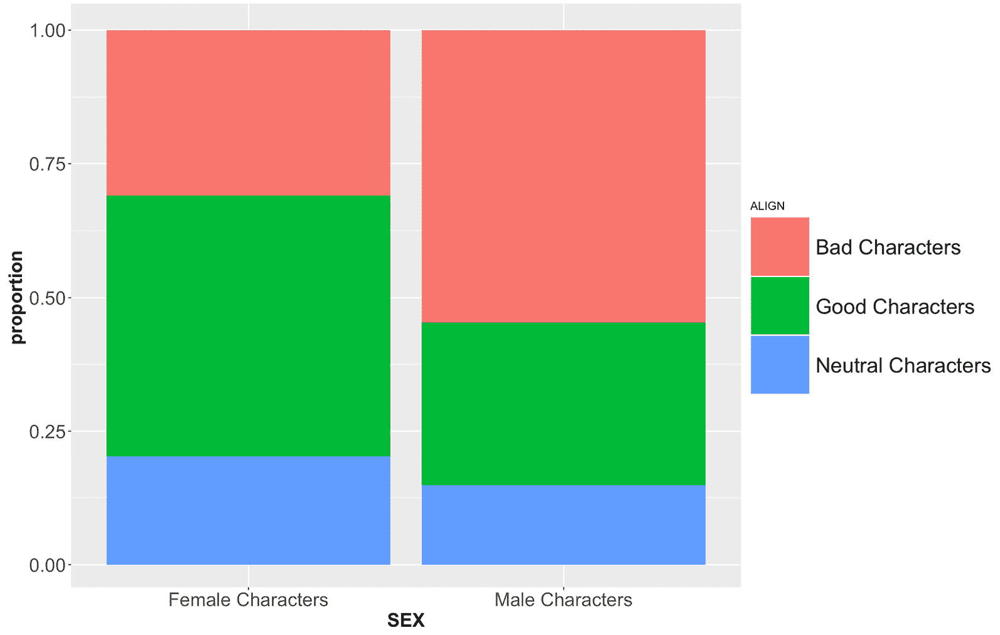

图 5.3 – 在条形图中可视化无条件的比例

我们也可以通过在条形图中切换这两个变量从不同的角度获得类似的结果：

```py

>>> df %>%
  filter(!(SEX %in% c("Agender Characters", "Genderfluid Characters"))) %>%
  ggplot(aes(x=ALIGN, fill=SEX)) +
  geom_bar(position="fill") +
  ylab("proportion") +
  theme(axis.text=element_text(size=18),
        axis.title=element_text(size=18,face="bold"),
        legend.key.size = unit(2, 'cm'),
        legend.text = element_text(size=20))
```

运行此命令会生成 *图 5**.4*，其中 `ALIGN` 被用作 *x* 轴，而 `SEX` 被用作分组变量：

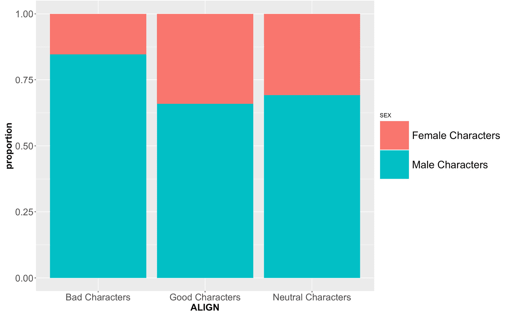

图 5.4 – 条形图中切换变量

接下来，我们将探讨使用边缘分布和分面条形图描述一个分类变量。

## 边缘分布和分面条形图

边缘分布指的是在整合其他变量后的一个变量的分布。这意味着我们感兴趣的是某个特定变量的分布，无论其他变量如何分布。

在我们之前存储在 `count_df` 中的双向列联表中，我们可以通过对所有可能的 `ALIGN` 值求和来推导出 `SEX` 的边缘分布，以频率计数的形式。也就是说，我们可以执行列求和以获得 `SEX` 的边缘计数，如下面的代码片段所示：

```py

>>> colSums(count_df)
    Agender Characters      Female Characters Genderfluid Characters         Male Characters
                    43                   3153                      2                    9744
```

这与直接获取 `SEX` 中不同类别的计数具有相同的效果：

```py

>>> table(df$SEX)
    Agender Characters      Female Characters Genderfluid Characters         Male Characters
                    43                   3153                      2                    9744
```

现在，如果我们想为另一个变量的每个类别获取一个变量的边缘分布怎么办？这可以通过 `ggplot2` 实现，如下面的代码片段所示：

```py

>>> df %>%
  filter(!(SEX %in% c("Agender Characters", "Genderfluid Characters"))) %>%
  ggplot(aes(x=SEX)) +
  geom_bar() +
  facet_wrap(~ALIGN) +
  theme(axis.text=element_text(size=15),
        axis.title=element_text(size=15,face="bold"),
        strip.text.x = element_text(size = 30))
```

运行此代码生成 *图 5**.5*，其中包含三个并排的条形图，分别表示坏、好和中性角色。这实际上是重新排列了 *图 5**.4* 中的堆叠条形图。请注意，可以通过使用 `facet_wrap` 函数添加分面，其中 `~ALIGN` 表示分面将使用 `ALIGN` 变量执行。请注意，我们使用了 `strip.text.x` 属性来调整分面网格标签的文本大小：

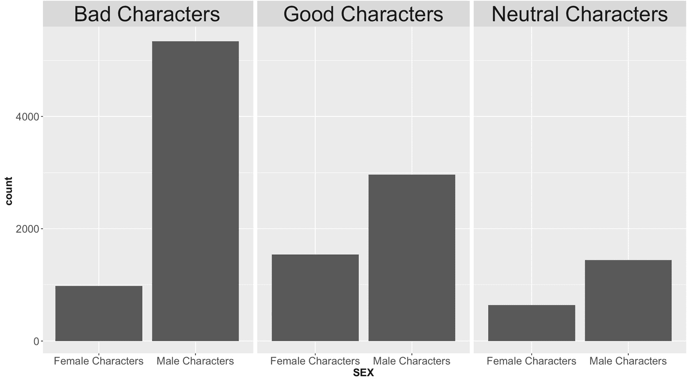

图 5.5 – 分面条形图

此外，我们还可以通过在将其转换为因子后覆盖 `ALIGN` 的级别来调整单个条形分面的顺序：

```py

>>> df$ALIGN = factor(df$ALIGN, levels = c("Bad Characters", "Neutral Characters", "Good Characters"))
```

再次运行相同的分面代码现在将生成 *图 5**.6*，其中分面的顺序是根据 `ALIGN` 中的级别确定的：

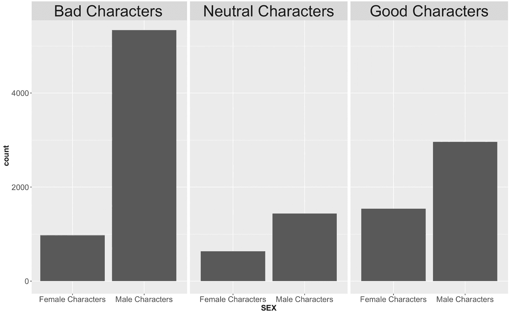

图 5.6 – 在分面条形图中排列分面的顺序

在下一节中，我们将探讨探索数值变量的不同方法。

## 分析数值数据

在本节中，我们将探讨使用不同类型的图表来总结 Marvel 数据集中的数值数据。由于数值/连续变量可以假设的值有无限多，因此之前使用的频率表不再适用。相反，我们通常将值分组到预先指定的区间中，这样我们就可以处理范围而不是单个值。

### 练习 5.3 – 探索数值变量

在这个练习中，我们将使用点图、直方图、密度图和箱线图来描述 `Year` 变量的数值变量：

1.  使用`summary()`函数获取`Year`变量的摘要：

    ```py

    >>> summary(df$Year)
       Min. 1st Qu.  Median    Mean 3rd Qu.    Max.    NA's
       1939    1973    1989    1984    2001    2013     641
    ```

1.  生成`Year`变量的点状图：

    ```py

    >>> ggplot(df, aes(x=Year)) +
      geom_dotplot(dotsize=0.2) +
      theme(axis.text=element_text(size=18),
            axis.title=element_text(size=18,face="bold"))
    ```

    执行此命令生成*图 5.7*，其中每个点代表在*x*轴对应位置上的一个观测值。相似观测值随后堆叠在顶部。需要注意的是，当观测值数量变得很大时，使用点图可能不是最佳选择，因为由于`ggplot2`的技术限制，*y*轴变得没有意义：

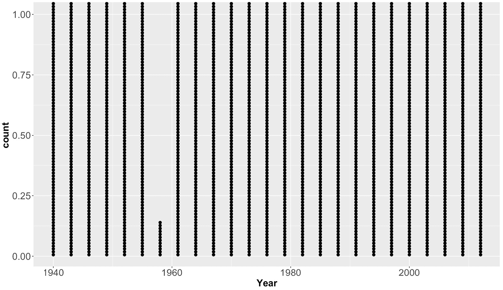

图 5.7 – 使用点图总结年份变量

1.  构建`Year`变量的直方图：

    ```py

    >>> ggplot(df, aes(x=Year)) +
      geom_histogram() +
      theme(axis.text=element_text(size=18),
            axis.title=element_text(size=18,face="bold"))
    ```

    执行此命令生成*图 5.8*，其中`Year`的每个值被分组到不同的区间，然后计算每个区间内的观测值数量以表示每个区间的宽度。请注意，默认的区间数量是 30，但可以使用`bins`参数覆盖。因此，直方图展示了底层变量的分布形状。我们还可以将其转换为密度图以平滑区间之间的步骤：

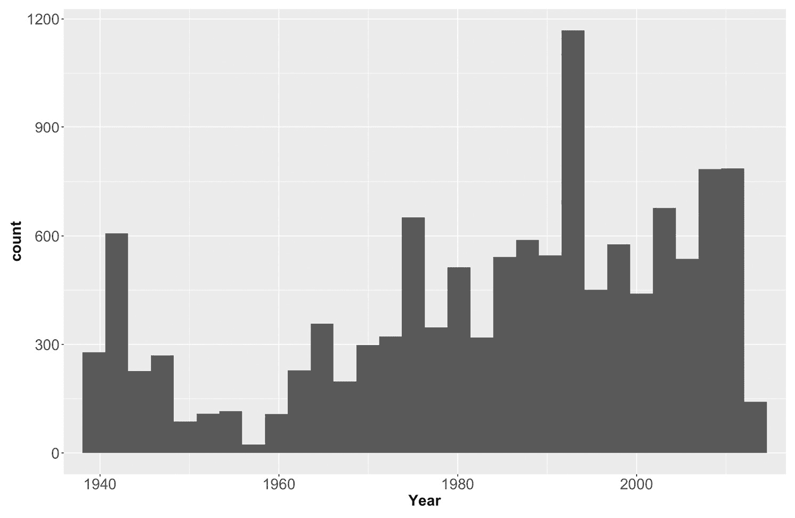

图 5.8 – 使用直方图总结年份变量

1.  构建`Year`变量的密度图：

    ```py

    >>> ggplot(df, aes(x=Year)) +
      geom_density() +
      theme(axis.text=element_text(size=18),
            axis.title=element_text(size=18,face="bold"))
    ```

    执行此命令生成*图 5.9*，其中分布以平滑的线条表示。请注意，当数据集中有大量观测值时，建议使用密度图：

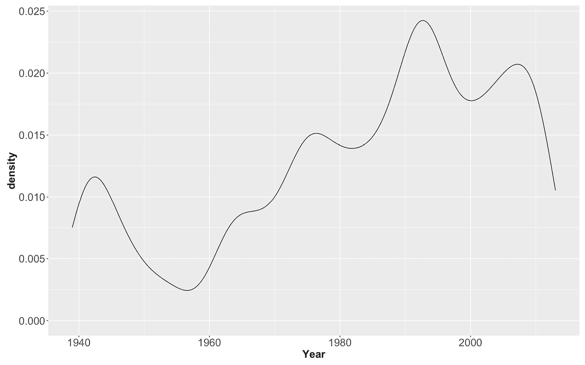

图 5.9 – 使用密度图总结年份变量

1.  构建`Year`变量的箱线图：

    ```py

    >>> ggplot(df, aes(x=Year)) +
      geom_boxplot() +
      theme(axis.text=element_text(size=18),
            axis.title=element_text(size=18,face="bold"))
    ```

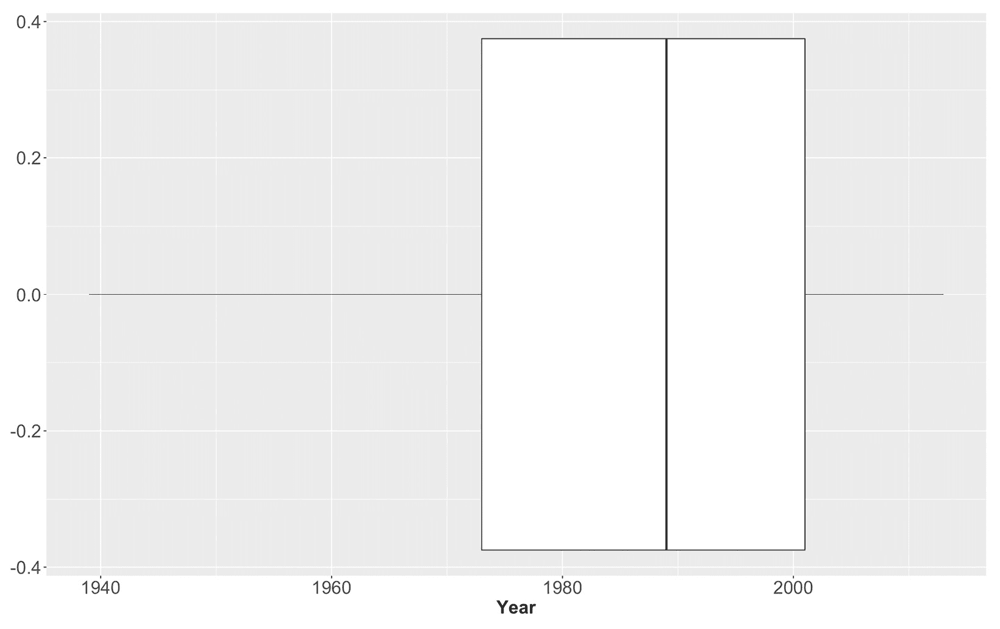

图 5.10 – 使用箱线图总结年份变量

执行此命令生成*图 5.10*，其中中间的箱体代表大多数观测值（第 25 到第 75 百分位数），箱体中的中线表示中位数（第 50 百分位数），而延伸的胡须包括几乎所有“正常”的观测值。在这个例子中，异常观测值（没有异常值）将表示为胡须范围之外的点。

我们也可以通过`SEX`添加一个分面层，并观察不同性别下箱线图的变化。

1.  在之前的箱线图中使用`SEX`变量添加一个分面层：

    ```py

    >>> ggplot(df, aes(x=Year)) +
      geom_boxplot() +
      facet_wrap(~SEX) +
      theme(axis.text=element_text(size=18),
            axis.title=element_text(size=18,face="bold"),
            strip.text.x = element_text(size = 30))
    ```

    执行此命令生成*图 5.11*。如图所示，大多数女性角色比许多男性角色晚出现，并且近年来女性角色比男性角色多：

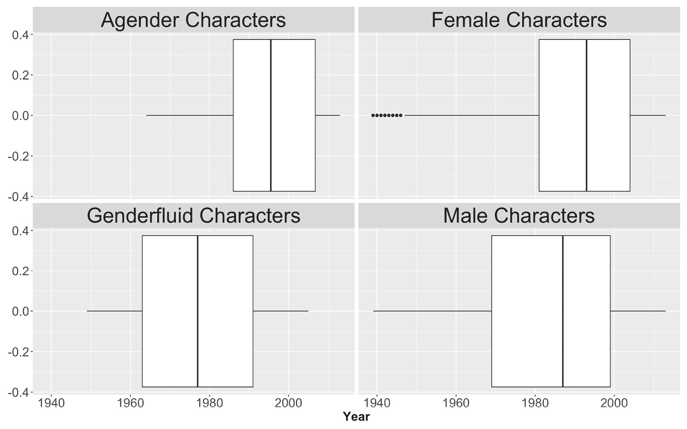

图 5.11 – 根据性别分面箱线图

在下一节中，我们将探讨如何可视化高维数据。

## 高维可视化

之前的例子使用了分面来展示数值变量在每个分类变量的唯一值中的分布。当存在多个分类变量时，我们可以应用相同的技巧并相应地扩展分面。这使我们能够在包含多个分类变量的更高维度中可视化相同的数值变量。让我们通过一个可视化`Year`按`ALIGN`和`SEX`分布的练习来了解。

### 练习 5.4 – 可视化`Year`按`ALIGN`和`SEX`

在这个练习中，我们将使用`ggplot2`中的`facet_grid()`函数，通过密度图和直方图来可视化`Year`在每个唯一的`ALIGN`和`SEX`组合中的分布：

1.  在对`SEX`应用相同的过滤条件后，构建`Year`按`ALIGN`和`SEX`的密度图：

    ```py

    >>> df %>%
      filter(!(SEX %in% c("Agender Characters", "Genderfluid Characters"))) %>%
      ggplot(aes(x=Year)) +
      geom_density() +
      facet_grid(ALIGN ~ SEX, labeller = label_both) +
      facet_grid(ALIGN ~ SEX, labeller = label_both) +
      theme(axis.text=element_text(size=18),
            axis.title=element_text(size=18,face="bold"),
            strip.text.x = element_text(size = 30),
            strip.text.y = element_text(size = 12))
    ```

    执行此命令生成*图 5.12*，我们在这里使用了`facet_grid()`函数创建了六个直方图，列由第一个参数`ALIGN`分割，行由第二个参数`SEX`分割。结果显示，对于所有不同的`ALIGN`和`SEX`组合，趋势都在上升（制作了更多的电影）。然而，由于*Y*轴只显示相对密度，我们需要切换到直方图来评估发生的绝对频率。注意，我们使用了`strip.text.y`属性来调整分面网格标签沿*Y*轴的文本大小：


图 5.12 – `Year`按`ALIGN`和`SEX`的密度图

1.  使用直方图构建相同的图表：

    ```py

    >>> df %>%
      filter(!(SEX %in% c("Agender Characters", "Genderfluid Characters"))) %>%
      ggplot(aes(x=Year)) +
      geom_histogram() +
      facet_grid(ALIGN ~ SEX, labeller = label_both) +
      theme(axis.text=element_text(size=18),
            axis.title=element_text(size=18,face="bold"),
            strip.text.x = element_text(size = 30),
            strip.text.y = element_text(size = 12))
    ```

    执行此命令生成*图 5.13*，我们可以看到近年来优秀男女角色的数量稳步上升：


图 5.13 – `Year`按`ALIGN`和`SEX`的直方图

在下一节中，我们将尝试不同的方法来测量数值变量的中心集中度。

## 测量中心集中度

测量数值变量的集中趋势或中心集中度有不同方法。根据上下文和目的，中心测度通常用来表示一个数值变量的典型观测值。

最流行的中心测度是均值，它是通过计算数字列表的平均值来得到的。换句话说，我们可以通过将所有观测值相加然后除以观测值的数量来获得均值。这可以通过在 R 中使用`mean()`函数实现。

另一个中心测度是中位数，它是将数字列表从小到大排序后的中间值。这可以通过在 R 中使用`median()`函数实现。

第三种中心度量是众数，它代表数字列表中最常见的观测值。由于没有内置的函数来计算众数，我们必须编写一个自定义函数，根据出现次数使用`table()`函数来获取最频繁的观测值。

在决定中心度量之前，观察分布的形状是很重要的。首先，请注意，平均值通常会被拉向偏斜分布的长尾，这是一个从数字列表（如之前的密度图）推断出的连续分布。换句话说，平均值对观测中的极端值很敏感。另一方面，中位数不会受到这种敏感性的影响，因为它只是将有序观测值分成两半的度量。因此，当处理偏斜的连续分布时，中位数是一个更好、更合理的中心度量候选者，除非对极端值（通常被视为异常值）进行了额外的处理。

让我们通过一个练习来看看如何获得三个中心度量。

### 练习 5.5 – 计算中心度量

在这个练习中，我们将计算`APPEARANCES`的平均值、中位数和众数，它表示每个角色的出现次数：

1.  计算`APPEARANCES`的平均值：

    ```py

    >>> mean(df$APPEARANCES)
    NA
    ```

    `NA`结果表明，`APPEARANCES`的观测值中存在`NA`值。为了验证这一点，我们可以查看这个连续变量的摘要：

    ```py
    >>> summary(df$APPEARANCES)
       Min. 1st Qu.  Median    Mean 3rd Qu.    Max.    NA's
          1       1       3      20       9    4043     749
    ```

    的确，存在相当多的`NA`值。为了在移除这些`NA`观测值后计算平均值，我们可以在`mean()`函数中启用`na.rm`参数：

    ```py
    >>> mean(df$APPEARANCES, na.rm = TRUE)
    19.8
    ```

1.  计算`APPEARANCES`的平均值：

    ```py

    >>> median(df$APPEARANCES, na.rm = TRUE)
    3
    ```

    当平均值和中位数差异很大时，这是一个明显的迹象，表明我们正在处理一个偏斜分布。在这种情况下，`APPEARANCES`变量非常偏斜，中位数角色出现三次，最受欢迎的角色出现高达 4,043 次。

1.  计算`APPEARANCES`的众数：

    ```py

    >>> mode <- function(x){
      ux <- unique(x)
      ux[which.max(tabulate(match(x, ux)))]
    }
    >>> mode(df$APPEARANCES)
    1
    ```

    在这里，我们创建了一个名为`mode()`的自定义函数来计算数值变量的众数，其中我们首先使用`unique()`函数提取一个唯一值的列表，然后使用`tabulate()`和`match()`函数计算每个唯一值出现的次数，最后使用`which.max()`函数获取最大值的索引。结果显示，大多数角色在整个漫威漫画的历史中只出现了一次。

    现在，让我们详细分析通过`ALIGN`的平均值和众数。

1.  通过每个`ALIGN`级别计算`APPEARANCES`的平均值和众数：

    ```py

    >>> df %>%
      group_by(ALIGN) %>%
      summarise(mean_appear = mean(APPEARANCES, na.rm=TRUE),
                median_appear = median(APPEARANCES, na.rm=TRUE))
      ALIGN              mean_appear median_appear
      <fct>                    <dbl>         <dbl>
    1 Bad Characters            8.64             3
    2 Neutral Characters       20.3              3
    3 Good Characters          35.6              5
    ```

    结果显示，好人角色比坏人角色出现得更频繁。

接下来，我们将探讨如何测量连续变量的变异性。

## 测量变异性

与集中趋势一样，可以使用多个指标来衡量连续变量的变异性或分散性。其中一些对异常值敏感，如方差和标准差，而其他对异常值稳健，如**四分位数间距**（**IQR**）。让我们通过一个练习来了解如何计算这些指标。

注意，在箱线图中使用的是稳健的度量，如中位数和 IQR，尽管与给定变量的完整密度相比，隐藏了更多细节。

### 练习 5.6 - 计算连续变量的变异性

在这个练习中，我们将手动和通过内置函数计算不同的变异度指标。我们将从方差开始，它是通过计算每个原始值与平均值之间的平均平方差来计算的。请注意，这就是总体方差是如何计算的。为了计算样本方差，我们需要调整平均操作，即在方差计算中使用的总观测数减去 1。

此外，方差是原始单位的平方版本，因此不易解释。为了在相同的原始尺度上衡量数据的变异性，我们可以使用标准差，它是通过对方差取平方根来计算的。让我们看看如何在实践中实现这一点：

1.  计算移除`NA`值后的`APPEARANCES`的总体方差。保留两位小数：

    ```py

    >>> tmp = df$APPEARANCES[!is.na(df$APPEARANCES)]
    >>> pop_var = sum((tmp - mean(tmp))²)/length(tmp)
    >>> formatC(pop_var, digits = 2, format = "f")
    "11534.53"
    ```

    在这里，我们首先从`APPEARANCES`中移除`NA`值，并将结果保存在`tmp`中。接下来，我们从`tmp`的每个原始值中减去`tmp`的平均值，将结果平方，求和所有值，然后除以`tmp`中的观测数。这本质上遵循方差的定义，即衡量每个观测值相对于中心趋势的平均变异性——换句话说，就是平均值。

    我们也可以计算样本方差。

1.  计算`APPEARANCES`的样本方差：

    ```py

    >>> sample_var = sum((tmp - mean(tmp))²)/(length(tmp)-1)
    >>> formatC(sample_var, digits = 2, format = "f")
    "11535.48"
    ```

    结果现在与总体方差略有不同。请注意，为了计算样本均值，我们在分母中简单地使用一个更少的观测值。这种调整是必要的，尤其是在我们处理有限的样本数据时，尽管随着样本量的增加，差异变得很小。

    我们也可以通过调用`var()`函数来计算样本方差。

1.  使用`var()`计算样本方差：

    ```py

    >>> formatC(var(tmp), digits = 2, format = "f")
    "11535.48"
    ```

    结果与我们的先前手动计算的样本方差一致。

    为了获得与原始观测值相同的单位的变异性度量，我们可以计算标准差。这可以通过使用`sd()`函数来实现。

1.  使用`sd()`计算标准差：

    ```py

    >>> sd(tmp)
    107.4
    ```

    变异性的另一个度量是四分位数间距（IQR），它是第三四分位数和第一四分位数之间的差值，并量化了大多数值的范围。

1.  使用`IQR()`计算四分位数间距：

    ```py

    >>> IQR(tmp)
    8
    ```

    我们也可以通过调用`summary()`函数来验证结果，该函数返回不同的四分位数值：

    ```py
    >>> summary(tmp)
       Min. 1st Qu.  Median    Mean 3rd Qu.    Max.
        1.0     1.0     3.0    19.8     9.0  4043.0
    ```

    如前所述，方差和标准差等度量对数据中的极端值敏感，而四分位数范围（IQR）是对异常值稳健的度量。我们可以评估从`tmp`中移除最大值后这些度量的变化。

1.  从`tmp`中移除最大值后的标准差和四分位数范围（IQR）：

    ```py

    >>> tmp2 = tmp[tmp != max(tmp)]
    >>> sd(tmp2)
    101.04
    >>> IQR(tmp2)
    8
    ```

    结果显示，移除最大值后 IQR 保持不变，因此比标准差更稳健的度量。

    我们还可以通过另一个分类变量的不同级别来计算这些度量。

1.  计算每个`ALIGN`级别的`APPEARANCES`的标准差、四分位数范围（IQR）和计数：

    ```py

    >>> df %>%
      group_by(ALIGN) %>%
      summarise(sd_appear = sd(APPEARANCES, na.rm=TRUE),
                IQR_appear = IQR(APPEARANCES, na.rm=TRUE),
                count = n())
      ALIGN              sd_appear IQR_appear count
      <fct>                  <dbl>      <dbl> <int>
    1 Bad Characters          26.4          5  6334
    2 Neutral Characters     112.           8  2094
    3 Good Characters        161.          14  4514
    ```

接下来，我们将更深入地探讨连续变量分布中的偏度。

## 处理偏斜分布

除了平均值和标准差之外，我们还可以使用模态和偏度来描述连续变量的分布。模态指的是连续分布中存在的峰的数量。例如，单峰分布，我们迄今为止最常见的形式是钟形曲线，整个分布中只有一个峰值。当有两个峰时，它可以变成双峰分布；当有三个或更多峰时，它变成多峰分布。如果没有可辨别的模态，并且分布在整个支持区域（连续变量的范围）上看起来平坦，则称为均匀分布。*图 5.14*总结了不同模态的分布：

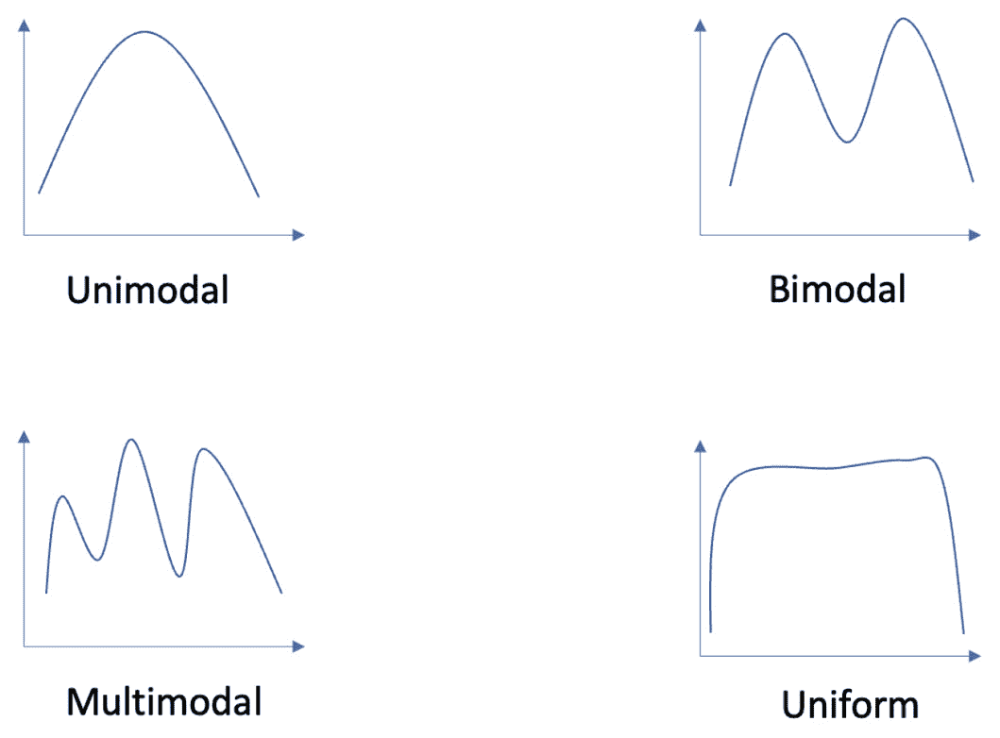

图 5.14 – 分布中不同类型的模态

另一方面，连续变量可能向左或向右偏斜，或者围绕中心趋势对称。右偏斜分布在其分布的右尾包含更多的极端值，而左偏斜分布在其左侧有长尾。*图 5.15*说明了分布中不同类型的偏度：

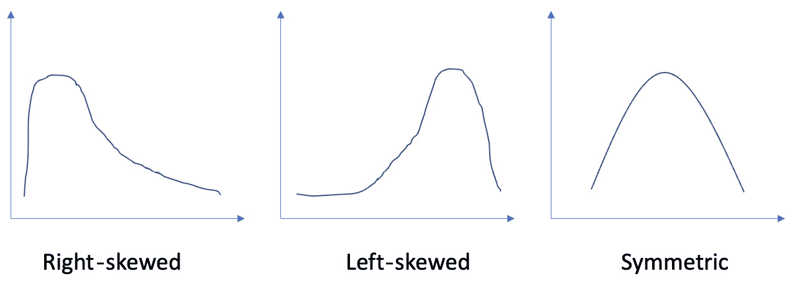

图 5.15 – 分布中的不同类型偏度

分布也可以将它的偏斜归因于连续变量中的异常值。当数据中有多个异常值时，敏感的度量如平均值和方差将变得扭曲，导致分布向异常值偏移。让我们通过一个练习来了解如何处理分布中的偏斜和异常值。

### 练习 5.7 – 处理偏斜和异常值

在这个练习中，我们将探讨如何处理包含许多极端值，特别是数据中的异常值的偏斜分布：

1.  通过`ALIGN`可视化`APPEARANCES`的密度图，对于自 2000 年以来的观测值。设置透明度为`0.2`：

    ```py

    >>> tmp = df %>%
      filter(Year >= 2000)
    >>> ggplot(tmp, aes(x=APPEARANCES, fill=ALIGN)) +
      geom_density(alpha=0.2) +
      theme(axis.text=element_text(size=18),
            axis.title=element_text(size=18,face="bold"),
            legend.position = c(0.8, 0.8),
            legend.key.size = unit(2, 'cm'),
            legend.text = element_text(size=20))
    ```

    执行此命令生成*图 5.16*，其中所有三个分布都相当右偏斜，这是数据中存在许多异常值的明显迹象：


图 5.16 – 由 ALIGN 生成的`APPEARANCES`密度图

1.  移除`APPEARANCES`值超过 90 百分位的观测值并生成相同的图表：

    ```py

    >>> tmp = tmp %>%
      filter(APPEARANCES <= quantile(APPEARANCES, 0.9, na.rm=TRUE))
    >>> ggplot(tmp, aes(x=log(APPEARANCES), fill=ALIGN)) +
      geom_density(alpha=0.2) +
      theme(axis.text=element_text(size=18),
            axis.title=element_text(size=18,face="bold"),
            legend.position = c(0.8, 0.8),
            legend.key.size = unit(2, 'cm'),
            legend.text = element_text(size=20))
    ```

    执行此命令生成*图 5.17*，其中所有三个分布都比之前更少地右偏斜。移除异常值是处理极端值的一种方法，尽管移除的观测值中的信息已经丢失。为了控制异常值的影响并同时保留它们的存在，我们可以使用`log()`函数对连续变量进行变换，将其转换为对数尺度。让我们看看这在实践中是如何工作的：


图 5.17 – 移除异常值后，由 ALIGN 生成的`APPEARANCES`密度图

1.  对`APPEARANCES`应用对数变换并重新生成相同的图表：

    ```py

    >>> ggplot(tmp, aes(x=log(APPEARANCES), fill=ALIGN)) +
      geom_density(alpha=0.2) +
      theme(axis.text=element_text(size=18),
            axis.title=element_text(size=18,face="bold"),
            legend.position = c(0.8, 0.8),
            legend.key.size = unit(2, 'cm'),
            legend.text = element_text(size=20))
    ```

    执行此命令生成*图 5.18*，其中三个密度图呈现出双峰分布，而不是之前的右偏斜。因此，使用对数函数对连续变量进行变换可以将原始值转换为更受控制的尺度：


图 5.18 – 应用对数变换后，由 ALIGN 生成的`APPEARANCES`密度图

在下一节中，我们将通过一个案例研究来提高我们在对新的数据集进行 EDA 时的技能。

# 实践中的 EDA

在本节中，我们将分析一个由 2021 年五大公司股票价格组成的数据库。首先，我们将探讨如何下载和处理这些股票指数，然后进行单变量分析和基于相关性的双变量分析。

## 获取股票价格数据

要获取特定股票代码的每日股票价格，我们可以使用`yfR`包从 Yahoo! Finance 下载数据，这是一个包含大量市场和资产金融数据的庞大仓库，在学术界和工业界都得到了广泛的应用。以下练习说明了如何使用`yfR`下载股票数据。

### 练习 5.8 – 下载股票价格

在这个练习中，我们将探讨如何指定不同的参数，以便我们可以从 Yahoo! Finance 下载股票价格，包括股票代码和日期范围：

1.  安装并加载`yfR`包：

    ```py

    >>> install.packages("yfR")
    >>> library(yfR)
    ```

    注意，在`install.packages()`函数中，我们需要将包名用一对双引号括起来。

1.  指定起始日期和结束日期参数，以及股票代码，以确保它们覆盖 Facebook（现在为`META`）、Netflix（`NFLX`）、Google（`GOOG`）、Amazon（`AMZN`）和 Microsoft（`MSFT`）：

    ```py

    >>> first_date = as.Date("2021-01-01")
    >>> last_date = as.Date("2022-01-01")
    >>> my_ticker <- c('META', 'NFLX', 'GOOG', 'AMZN', 'MSFT')
    ```

    这里，起始日期和结束日期格式化为 `Date` 类型，股票名称连接成一个向量。

1.  使用 `yf_get()` 函数下载股票价格并将结果存储在 `df` 中：

    ```py

    >>> df <- yf_get(tickers = my_ticker,
                             first_date = first_date,
                             last_date = last_date)
    ```

    执行此命令会生成以下消息，显示已成功下载所有五只股票的数据。由于一年中有 252 个交易日，每只股票在 2021 年有 252 行数据：

    ```py
    ── Running yfR for 5 stocks | 2021-01-01 --> 2022-01-01 (365 days) ──
    ℹ Downloading data for benchmark ticker ^GSPC
    ℹ (1/5) Fetching data for AMZN
       - found cache file (2021-01-04 --> 2021-12-31)
       - got 252 valid rows (2021-01-04 --> 2021-12-31)
       - got 100% of valid prices -- Got it!
    ℹ (2/5) Fetching data for GOOG
       - found cache file (2021-01-04 --> 2021-12-31)
       - got 252 valid rows (2021-01-04 --> 2021-12-31)
       - got 100% of valid prices -- Good stuff!
    ℹ (3/5) Fetching data for META
    !   - not cached
       - cache saved successfully
       - got 252 valid rows (2021-01-04 --> 2021-12-31)
       - got 100% of valid prices -- Mais contente que cusco de cozinheira!
    ℹ (4/5) Fetching data for MSFT
       - found cache file (2021-01-04 --> 2021-12-31)
       - got 252 valid rows (2021-01-04 --> 2021-12-31)
       - got 100% of valid prices -- All OK!
    ℹ (5/5) Fetching data for NFLX
       - found cache file (2021-01-04 --> 2021-12-31)
       - got 252 valid rows (2021-01-04 --> 2021-12-31)
       - got 100% of valid prices -- Youre doing good!
    ℹ Binding price data
    ── Diagnostics ───────────────────────────────────────
     Returned dataframe with 1260 rows -- Time for some tea?
    ℹ Using 156.6 kB at /var/folders/zf/d5cczq0571n0_x7_7rdn0r640000gn/T//Rtmp7hl9eR/yf_cache for 1 cache files
    ℹ Out of 5 requested tickers, you got 5 (100%)
    ```

    让我们检查数据集的结构：

    ```py
    >>> str(df)
    tibble [1,260 × 11] (S3: tbl_df/tbl/data.frame)
     $ ticker                : chr [1:1260] "AMZN" "AMZN" "AMZN" "AMZN" ...
     $ ref_date              : Date[1:1260], format: "2021-01-04" ...
     $ price_open            : num [1:1260] 164 158 157 158 159 ...
     $ price_high            : num [1:1260] 164 161 160 160 160 ...
     $ price_low             : num [1:1260] 157 158 157 158 157 ...
     $ price_close           : num [1:1260] 159 161 157 158 159 ...
     $ volume                : num [1:1260] 88228000 53110000 87896000 70290000 70754000 ...
     $ price_adjusted        : num [1:1260] 159 161 157 158 159 ...
     $ ret_adjusted_prices   : num [1:1260] NA 0.01 -0.0249 0.00758 0.0065 ...
     $ ret_closing_prices    : num [1:1260] NA 0.01 -0.0249 0.00758 0.0065 ...
     $ cumret_adjusted_prices: num [1:1260] 1 1.01 0.985 0.992 0.999 ...
     - attr(*, "df_control")= tibble [5 × 5] (S3: tbl_df/tbl/data.frame)
      ..$ ticker              : chr [1:5] "AMZN" "GOOG" "META" "MSFT" ...
      ..$ dl_status           : chr [1:5] „OK" „OK" „OK" „OK" ...
      ..$ n_rows              : int [1:5] 252 252 252 252 252
      ..$ perc_benchmark_dates: num [1:5] 1 1 1 1 1
      ..$ threshold_decision  : chr [1:5] "KEEP" "KEEP" "KEEP" "KEEP" ...
    ```

    下载的数据包括每日开盘价、收盘价、最高价和最低价等信息。

在以下章节中，我们将使用调整后的价格字段 `price_adjusted`，该字段已调整公司事件，如拆股、股息等。通常，我们在分析股票时使用它，因为它代表了股东的实际财务表现。

## 单变量分析个别股票价格

在本节中，我们将基于股票价格进行图形分析。由于股票价格是数值型的时间序列数据，我们将使用直方图、密度图和箱线图等图表进行可视化。

### 练习 5.9 – 下载股票价格

在本练习中，我们将从五只股票的时间序列图开始，然后生成适合连续变量的其他类型图表：

1.  为五只股票生成时间序列图：

    ```py

    >>> ggplot(df,
           aes(x = ref_date, y = price_adjusted,
               color = ticker)) +
      geom_line() +
      theme(axis.text=element_text(size=18),
            axis.title=element_text(size=18,face="bold"),
            legend.text = element_text(size=20))
    ```

    执行此命令生成 *图 5.19*，其中 Netflix 在股票价值方面领先。然而，它也遭受了巨大的波动，尤其是在 2021 年 11 月左右：

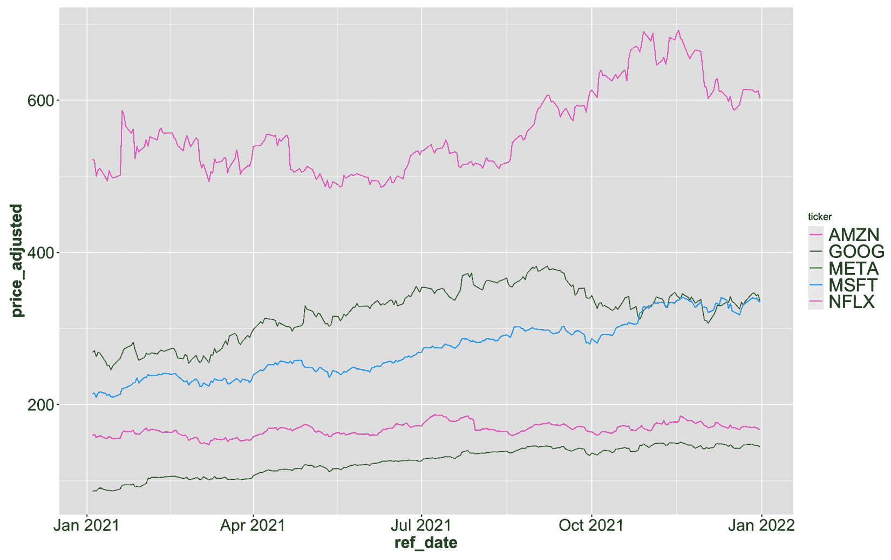

图 5.19 – 五只股票的时间序列图

1.  为五只股票中的每一只生成一个直方图，每个直方图有 100 个区间：

    ```py

    >>> ggplot(df, aes(x=price_adjusted, fill=ticker)) +
      geom_histogram(bins=100) +
      theme(axis.text=element_text(size=18),
            axis.title=element_text(size=18,face="bold"),
            legend.text = element_text(size=20))
    ```

    执行此命令生成 *图 5.20*，显示 Netflix 在股票价值方面具有最大的平均值和方差。Google 和 Amazon 似乎具有相似的分布，Facebook 和 Microsoft 也是如此：

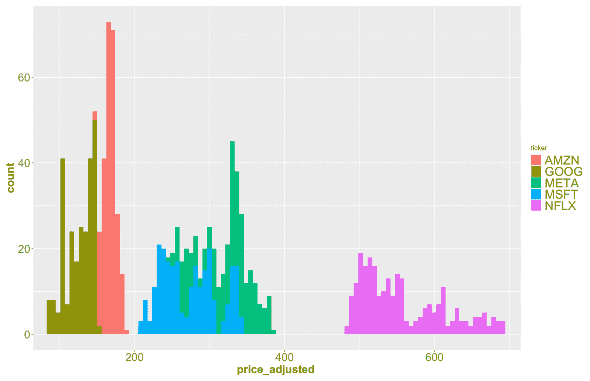

图 5.20 – 五只股票的直方图

1.  为五只股票中的每一只生成一个密度图。将透明度设置为 `0.2`：

    ```py

    >>> ggplot(df, aes(x=price_adjusted, fill=ticker)) +
      geom_density(alpha=0.2) +
      theme(axis.text=element_text(size=18),
            axis.title=element_text(size=18,face="bold"),
            legend.text = element_text(size=20))
    ```

    执行此命令生成 *图 5.21*，与直方图相比，这些图现在在视觉上更清晰：

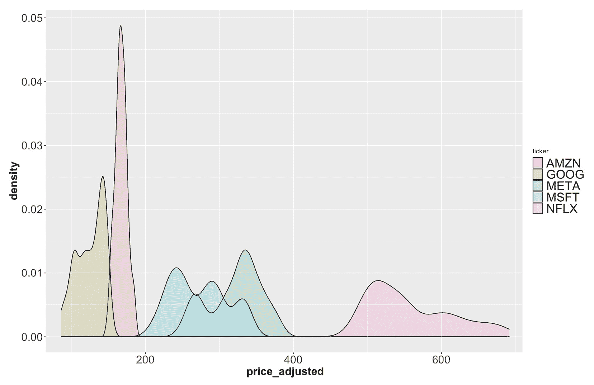

图 5.21 – 五只股票的密度图

1.  为五只股票中的每一只生成一个箱线图：

    ```py

    >>> ggplot(df, aes(ticker, price_adjusted, fill=ticker)) +
      geom_boxplot() +
      theme(axis.text=element_text(size=18),
            axis.title=element_text(size=18,face="bold"),
            legend.text = element_text(size=20))
    ```

    执行此命令生成 *图 5.22*。箱线图擅长显示每只股票的中心趋势和变异。例如，Netflix 在所有五只股票中具有最大的平均值和方差：

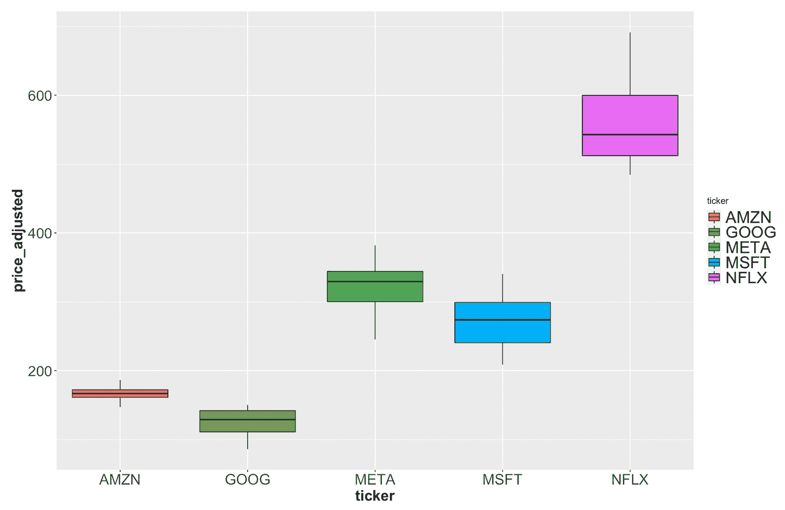

图 5.22 – 五只股票的箱线图

1.  获取每只股票的平均值、标准差、四分位数范围和计数：

    ```py

    >>> df %>%
      group_by(ticker) %>%
      summarise(mean = mean(price_adjusted, na.rm=TRUE),
                sd = sd(price_adjusted, na.rm=TRUE),
                IQR = IQR(price_adjusted, na.rm=TRUE),
                count = n())
    # A tibble: 5 × 5
      ticker  mean    sd   IQR count
      <chr>  <dbl> <dbl> <dbl> <int>
    1 AMZN    167.  8.00  10.7   252
    2 GOOG    126\. 18.4   31.1   252
    3 META    321\. 34.9   44.2   252
    4 MSFT    273\. 37.2   58.5   252
    5 NFLX    558\. 56.0   87.5   252
    ```

在下一节中，我们将查看每对股票之间的成对相关性。

## 相关性分析

相关性衡量两个变量之间协变的强度。有几种方法可以计算相关性的具体值，其中皮尔逊相关是最广泛使用的。皮尔逊相关是一个介于 -1 到 1 之间的值，其中 1 表示两个完全且正相关的变量，-1 表示完美的负相关性。完美的相关性意味着一个变量的值的变化总是与另一个变量的值的变化成比例。例如，当 y = 2x 时，变量 x 和 y 之间的相关性为 1，因为 y 总是正比于 x 而变化。

我们不必手动计算所有变量之间的成对相关性，可以使用 `corrplot` 包自动计算和可视化成对相关性。让我们通过一个练习来看看如何实现这一点。

### 练习 5.10 – 下载股票价格

在这个练习中，我们首先将之前的 DataFrame 从长格式转换为宽格式，以便每个股票都有一个单独的列，表示不同日期/行之间的调整价格。然后，将使用宽格式数据集生成成对相关性图：

1.  使用 `tidyr` 包中的 `spread()` 函数将之前的数据集转换为宽格式，并将结果保存在 `wide_df` 中：

    ```py

    >>> library(tidyr)
    >>> wide_df <- df %>%
      select(ref_date, ticker, price_adjusted) %>%
      spread(ticker, price_adjusted)
    ```

    在这里，我们首先选择三个变量，其中 `ref_date` 作为行级日期索引，`ticker` 的唯一值作为要分散在 DataFrame 中的列，`price_adjusted` 用于填充宽 DataFrame 的单元格。有了这些，我们可以检查新数据集的前几行：

    ```py
    >>> head(wide_df)
    # A tibble: 6 × 6
      ref_date    AMZN  GOOG  META  MSFT  NFLX
      <date>     <dbl> <dbl> <dbl> <dbl> <dbl>
    1 2021-01-04  159.  86.4  269.  214.  523.
    2 2021-01-05  161.  87.0  271.  215.  521.
    3 2021-01-06  157.  86.8  263.  209.  500.
    4 2021-01-07  158.  89.4  269.  215.  509.
    5 2021-01-08  159.  90.4  268.  216.  510.
    6 2021-01-11  156.  88.3  257.  214.  499.
    ```

    现在，DataFrame 已经从长格式转换为宽格式，这将有助于稍后创建相关性图。

1.  使用 `corrplot` 包中的 `corrplot()` 函数生成相关性图（如果尚未安装，请先安装）：

    ```py

    >>> install.packages("corrplot")
    >>> library(corrplot)
    >>> cor_table = cor(wide_df[,-1])
    >>> corrplot(cor_table, method = "circle")
    ```

    执行这些命令会生成 *图 5**.23*。每个圆圈代表对应股票之间相关性的强度，其中更大、更暗的圆圈表示更强的相关性：

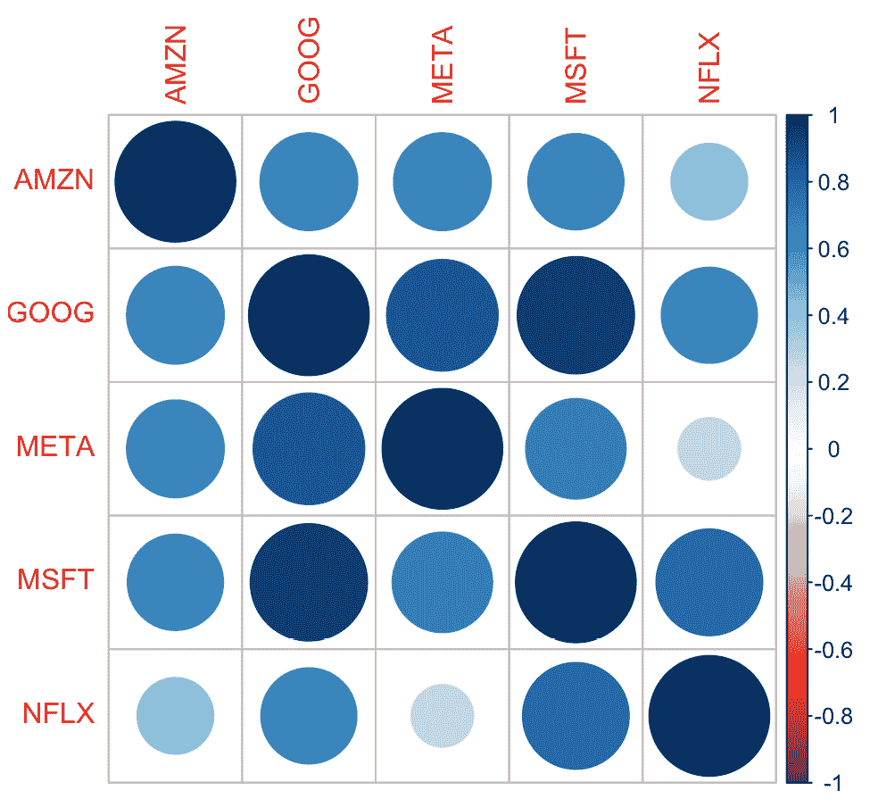

图 5.23 – 每对股票之间的相关性图

注意，相关性图依赖于 `cor_table` 变量，该变量存储成对相关性作为表格，如下所示：

```py

>>> cor_table
      AMZN  GOOG  META  MSFT  NFLX
AMZN 1.000 0.655 0.655 0.635 0.402
GOOG 0.655 1.000 0.855 0.945 0.633
META 0.655 0.855 1.000 0.692 0.267
MSFT 0.635 0.945 0.692 1.000 0.782
NFLX 0.402 0.633 0.267 0.782 1.000
```

变量之间的高度相关性可能好也可能不好。当需要预测的因变量（也称为目标结果）与自变量（也称为预测变量、特征或协变量）高度相关时，我们更愿意将这个特征包含在预测模型中，因为它与目标变量的协变很高。另一方面，当两个特征高度相关时，我们倾向于忽略其中一个并选择另一个，或者应用某种正则化和特征选择方法来减少相关特征的影响。

# 摘要

在本章中，我们介绍了进行 EDA 的基本技术。我们首先回顾了分析和管理分类数据的常见方法，包括频率计数和条形图。然后，当我们处理多个分类变量时，我们介绍了边缘分布和分面条形图。

接下来，我们转向分析数值变量，并涵盖了敏感度量，如集中趋势（均值）和变异（方差），以及稳健度量，如中位数和四分位数间距。有几种图表可用于可视化数值变量，包括直方图、密度图和箱线图，所有这些都可以与另一个分类变量结合使用。

最后，我们通过使用股票价格数据进行了案例研究。我们首先从 Yahoo! Finance 下载了真实数据，并应用所有 EDA 技术来分析数据，然后创建了一个相关性图来指示每对变量之间协变的强度。这使我们能够对变量之间的关系有一个有帮助的理解，并启动预测建模阶段。

在下一章中，我们将介绍 r markdown，这是一个广泛使用的 R 包，用于生成交互式报告。
