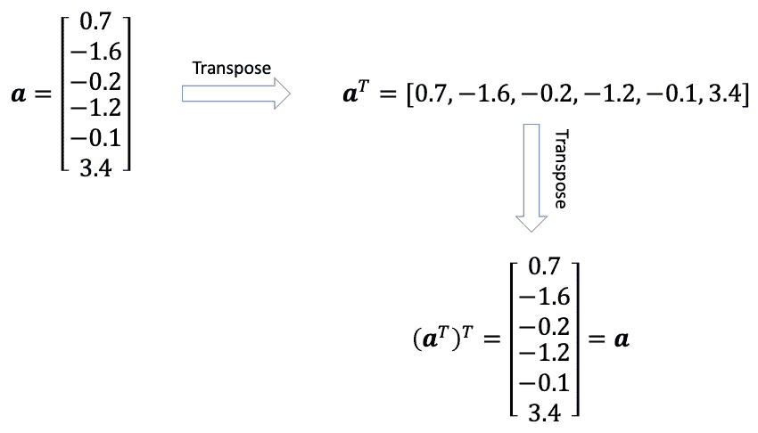
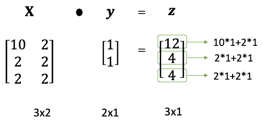
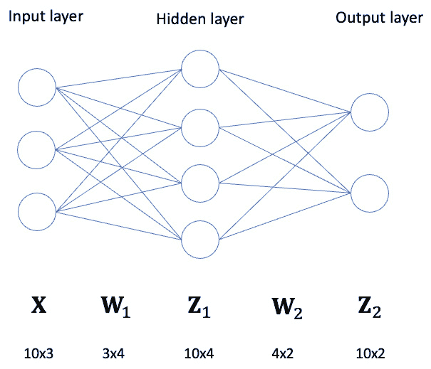
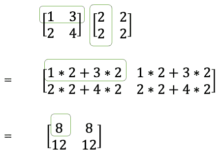
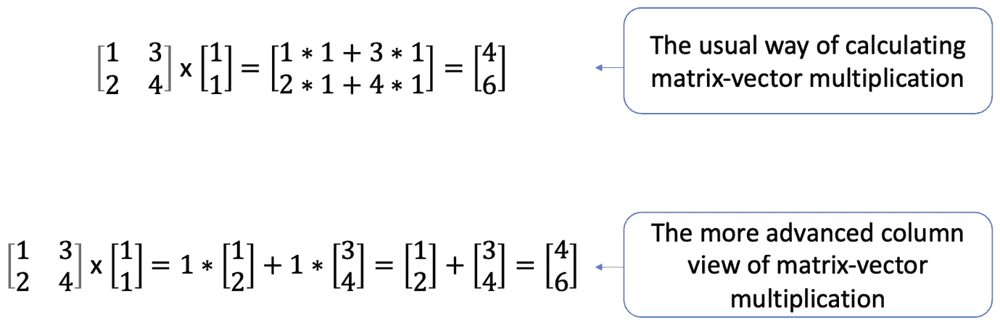
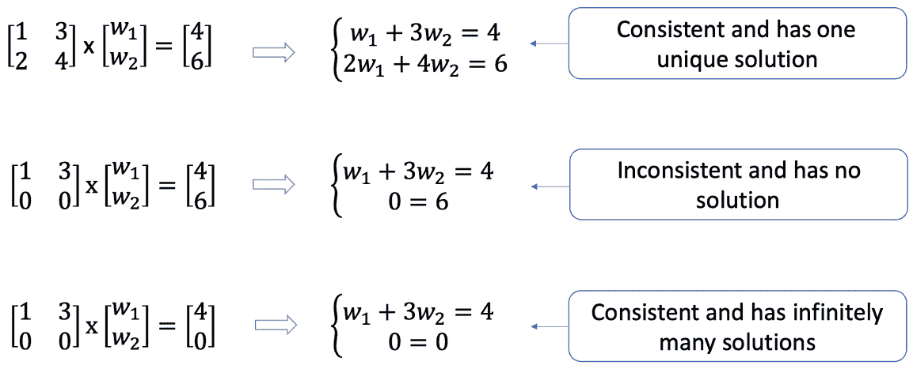
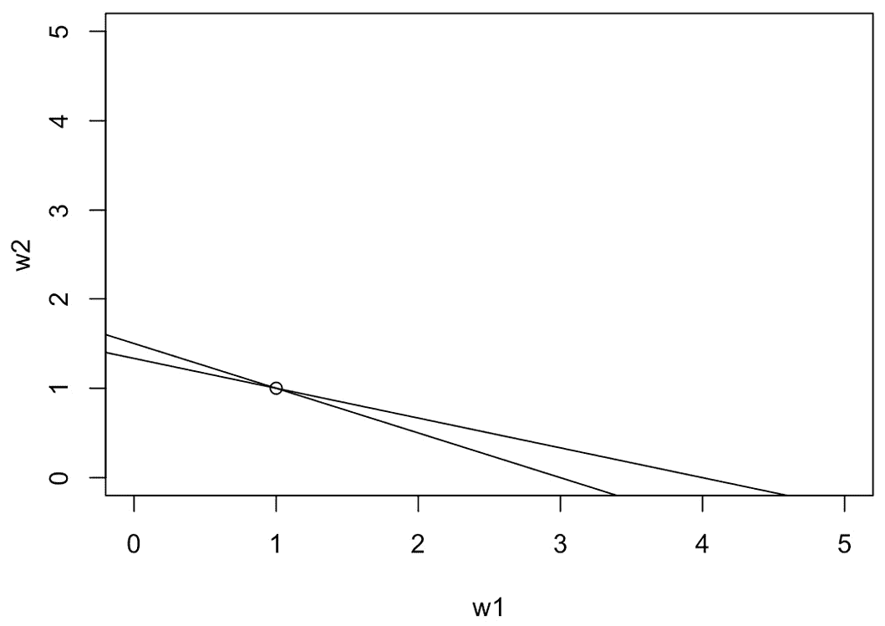
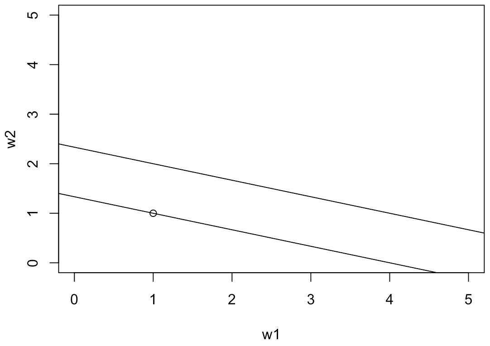
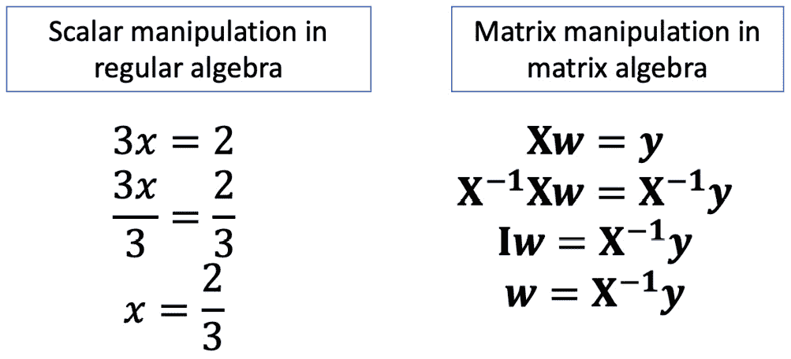
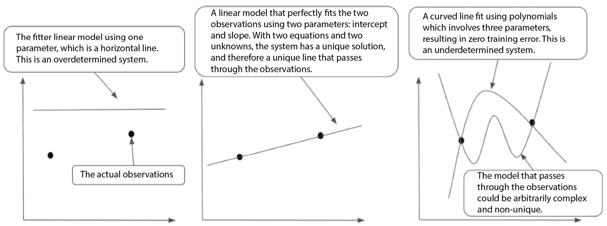

# 7

# R 中的线性代数

上一章介绍了使用 R Markdown 的高效有效的报告方法。本书的*第一部分*主要涵盖了使用 R 完成实际工作的各个方面。本书的*第二部分*回归到基础，涵盖了数学的两个基本支柱：线性代数和微积分。理解这些基础知识将更好地为我们欣赏和操作常见的数学运算做好准备，使这些运算对我们来说变得自然。*第二部分*的目标是通过本章对线性代数的根本性回顾，开始培养这种水平的素养。

到本章结束时，你将了解线性代数的基本概念，包括向量、矩阵和方程组系统。你还将能够解释线性代数中的基本符号，并使用 R 处理常见的矩阵。

在本章中，我们将涵盖以下主题：

+   介绍线性代数

+   常见矩阵运算和属性

+   解线性方程组

# 技术要求

本章的所有代码和数据均可在[`github.com/PacktPublishing/The-Statistics-and-Machine-Learning-with-R-Workshop/blob/main/Chapter_7/working.R`](https://github.com/PacktPublishing/The-Statistics-and-Machine-Learning-with-R-Workshop/blob/main/Chapter_7/working.R)找到。

# 介绍线性代数

本章深入探讨了数学最重要的分支之一：**线性代数**。线性代数处理数学对象的线性运算，包括向量、矩阵和张量（高维矩阵），这些是最常见的数据形式。例如，我们通常在 Excel 中用来存储数据的典型表格由一系列列组成。每一列被称为一个向量，它存储一定数量的元素，默认情况下以列的形式存在而不是行。这些列向量的集合形成一个矩阵，一个二维的 Excel 表格或 DataFrame，正如我们在前几章中所称呼的。我们也可以将同一表格视为行向量的集合，其中每个向量以行的形式存在。

让我们将这些内容置于上下文中。以下代码片段加载了睡眠数据集，并打印出前六行和三列。我们在以下阐述中使用 A 表示这个 6x3 矩阵：

```py

>>> data(sleep)
>>> head(sleep)
  extra group ID
1   0.7     1  1
2  -1.6     1  2
3  -0.2     1  3
4  -1.2     1  4
5  -0.1     1  5
6   3.4     1  6
```

让我们在这里引入一些符号。我们使用粗体小写字母 a 来表示一个列向量，例如`extra`变量，它由六个元素组成。换句话说，a 是一个六维向量。列向量 a 可以*转置*成一个行向量，表示为 a T。由于 a T 是一个行向量，我们可以写成 a T = [0.7, − 1.6, − 0.2, − 1.2, − 0.1, 3.4]，这也是许多书中书写行向量（或转置的列向量）的典型方式。同样，一个行向量可以转置回（原始的）列向量，给我们(a T) T = a。

一个图形说明将有助于理解。*图 7**.1*展示了将列向量 a 转换为行向量 a T，然后再将其转换回原始列向量(a T) T = a 的过程。因此，我们可以将矩阵 A 视为水平连接的列向量集合，或者垂直连接的行向量集合：



图 7.1 – 将列向量转换为行向量，然后再将其转换回原始列向量

注意，行也被称为观测值，而列被称为特征或属性。

在下一节中，我们将从处理向量开始。

## 处理向量

R 中的向量将相同类型的数据元素连接在一起。多个向量携手，通常是并排，形成一个矩阵。因此，它是线性代数的基石，我们必须从这里开始。

创建向量的方法有多种。在接下来的练习中，我们将探索其中的一些选项。

### 练习 7.1 – 创建向量

这个练习将介绍创建向量的三种常见方法。让我们开始吧：

1.  使用`c()`函数从 1 到 6 创建一个整数向量，其中`c`代表连接：

    ```py

    x = c(1, 2, 3, 4, 5, 6)
    >>> x
    [1] 1 2 3 4 5 6
    x = c(1:6)
    ```

    我们还可以使用`seq()`函数来创建一个整数序列，该函数根据`by`参数生成等间距的数字序列。

1.  使用`seq()`创建相同的向量：

    ```py

    x = seq(1, 6, by=1)
    ```

    这三种实现方式创建的是相同的向量。

    此外，我们还可以使用`rep()`函数来创建重复数字的列表。以下代码片段生成一个包含所有元素都是 1 的 6 元素向量：

    ```py
    y = rep(1, 6)
    >>> y
    [1] 1 1 1 1 1 1
    ```

R 中的向量是可变的，这意味着我们可以更改向量中特定位置的数据。让我们看看如何实现这一点。

### 练习 7.2 – 修改向量

修改向量的内容是一个常见的操作，尤其是在使用列过滤条件处理 DataFrame 的上下文中。向量的代数主要遵循与标量相同的原理。为了看到这一点，我们必须首先在向量中索引所需的元素，然后使用赋值操作来覆盖特定元素的值。让我们看看：

1.  将向量`x`中第二个元素的值改为`20`：

    ```py

    x[2] = 20
    >>> x
    [1]  1 20  3  4  5  6
    ```

    因此，我们可以通过将位置包裹在方括号中来访问向量中的元素。我们还可以执行对向量中所有元素产生相同效果的批量操作。

1.  将向量`x`中的所有元素都乘以二：

    ```py

    >>> x*2
    [1]  2 40  6  8 10 12
    ```

    在这里，乘数`2`被广播到向量的每个元素上，以执行相应的乘法。相同的广播机制也适用于加法操作等。

1.  将`x`中的所有元素增加一：

    ```py

    >>> x + 1
    [1]  2 21  4  5  6  7
    ```

    当然，我们可以通过将`x`加到`y`上，一个长度相同的全一向量，来获得相同的结果：

    ```py
    >>> x + y
    [1]  2 21  4  5  6  7
    ```

现在我们已经回顾了向量操作的基础，我们可以进入矩阵的领域。

## 矩阵操作

矩阵是一系列向量叠加而成的。一个 m x n 矩阵可以被认为是水平堆叠的 n 个 m 维列向量，或者垂直堆叠的 m 个 n 维行向量。对于我们所处理的每个 DataFrame，每一行是一个观察值，每一列代表一个特征。

让我们通过完成一个练习来看看如何创建矩阵。

### 练习 7.3 – 创建矩阵

我们可以使用`matrix()`函数来创建矩阵。这个函数接受三个参数：通过`data`传递到矩阵中的数据，通过`nrow`传递的行数，以及通过`ncol`传递的列数：

1.  创建一个填充数字`2`的 3x2 矩阵`X`：

    ```py

    X = matrix(data=2, nrow=3, ncol=2)
    >>> X
         [,1] [,2]
    [1,]    2    2
    [2,]    2    2
    [3,]    2    2
    ```

    注意这里使用了广播机制。因为我们只传递了一个数字，它被复制到矩阵的所有单元格中。同时，观察结果中的索引模式。逗号左侧的位置索引每个行，逗号右侧的位置索引每个列。我们可以通过索引第二行第一列的元素来验证这个观察：

    ```py
    >>> X[1,2]
    2
    ```

    让我们验证这个对象的类别：

    ```py
    >>> class(X)
    [1] "matrix" "array"
    ```

    结果显示`X`既是矩阵也是（多维）数组。

    我们也可以基于向量创建矩阵。

1.  使用变量`x`创建一个 3x2 矩阵。按行填充矩阵：

    ```py

    >>> matrix(x, nrow=3, ncol=2, byrow=TRUE)
         [,1] [,2]
    [1,]    1   20
    [2,]    3    4
    [3,]    5    6
    ```

    在这里，按行填充意味着按顺序将原始向量`x`中的每个元素按行放置，从左到右的第一行开始，当达到当前行的末尾时跳到下一行。我们也可以设计按列填充。

1.  改为按列填充矩阵：

    ```py

    >>> matrix(x, nrow=3, ncol=2, byrow=FALSE)
         [,1] [,2]
    [1,]    1    4
    [2,]   20    5
    [3,]    3    6
    ```

    与向量一样，我们可以通过索引定位矩阵中的特定元素，并分配新值来更改矩阵中的元素，如下所示：

    ```py
    X[1,1] = 10
    >>> X
         [,1] [,2]
    [1,]   10    2
    [2,]    2    2
    [3,]    2    2
    ```

线性代数中的一种常见操作是将矩阵与向量相乘。这种操作产生了许多关于矩阵操作的有趣和重要的解释。我们将在下一节中查看这个操作。

## 矩阵向量乘法

当将矩阵与向量相乘时，一个总的规则是内维度的相等。换句话说，矩阵的列维度（即列数）乘以右侧的向量时，必须等于乘法向量的行维度。例如，给定一个 m x n 矩阵，它只能乘以一个大小为 n x 1 的列向量，这样的乘法结果将是一个大小为 m x 1 的向量。

在这里，让我们看一个具体的例子。回想一下，X 是一个 3x2 的矩阵。将其乘以一个 2x1 的向量 y，应该产生一个 3x1 的向量 z。从原始向量 y 到新向量 z 的转变在这里有额外的意义：y 改变了空间，现在生活在一个三维世界中而不是二维！我们也可以说，旧的向量 y 由于投影矩阵 X 而被投影和拉伸到新的向量 z。这种投影或变换构成了现代神经网络中大多数操作。通过在不同层之间投影矩阵（也称为表示），神经网络可以*学习*不同层次的概念抽象。

假设 y 是一个全为 1 的向量。矩阵-向量乘法的规则表明，结果向量 z 中的每个元素都是对应向量的内积。两个向量之间的内积，也称为点积，是每个向量中对应元素乘积的总和。例如，z 中的第一个元素是 12。它的位置索引[1,1]表示它需要 X 矩阵的第一行[10, 2]和 y 矩阵的第一列[1, 1]来进行内积操作。将每个向量中对应元素相乘并求和，我们得到 10*1+2*1=12。同样，第二个元素的计算为 2*1+2*1=4。*图 7.2*总结了这种矩阵-向量乘法：



图 7.2 – 矩阵-向量乘法过程示意图

现在，让我们看看如何在 R 中执行矩阵-向量乘法。

### 练习 7.4 – 应用矩阵-向量乘法

在 R 中，矩阵-向量乘法操作是通过`%*%`符号实现的。`%*%`符号与单独的`*`符号非常不同，后者代表逐元素乘法。以下练习说明了这种差异：

1.  将之前的矩阵 X 乘以一个 2x1 的全为 1 的向量：

    ```py

    >>> X %*% c(1,1)
         [,1]
    [1,]   12
    [2,]    4
    [3,]    4
    ```

    结果显示生成的向量是 3x1。请注意，如果维度不匹配，乘法将无法进行：

    ```py
    >>> X %*% c(1,1,1)
    Error in X %*% c(1, 1, 1) : non-conformable arguments
    ```

    错误信息表明向量`c(1,1,1)`的维度与`X`矩阵中的维度不匹配。

    我们可以验证结果向量中每个单元格的计算。

1.  分别计算结果向量中的第一个元素：

    ```py

    >>> X[1,] %*% c(1,1)
         [,1]
    [1,]   12
    ```

    结果显示，第一个元素是第一行`X[1,]`和第一列（也是唯一的一列）`c(1,1)`的点积。我们也可以将点积重新表达为显式的逐元素乘法和求和。

1.  将之前的点积重新表达为显式的逐元素乘法和求和：

    ```py

    >>> sum(X[1,] * c(1,1))
    [1] 12
    ```

    注意，两个结果返回相同的值，但假设不同的数据结构：点积操作返回一个矩阵，而重新表达的操作返回一个向量。

1.  让我们使用结果向量的第二个元素来验证相同的计算：

    ```py

    >>> X[2,] %*% c(1,1)
         [,1]
    [1,]    4
    >>> sum(X[2,] * c(1,1))
    [1] 4
    ```

    我们还可以检查矩阵与标量相乘的行为。

1.  将矩阵 X 中的每个元素加倍：

    ```py

    >>> X * 2
         [,1] [,2]
    [1,]   20    4
    [2,]    4    4
    [3,]    4    4
    ```

    注意，当切换到逐元素乘法符号`*`时，结果矩阵的维度保持不变。此外，这里还涉及广播机制，其中 2 这个标量乘以矩阵 X 中的每个元素。效果就像我们用另一个相同维度的矩阵乘以 X 一样：

    ```py
    >>> X * matrix(2, 3, 2)
         [,1] [,2]
    [1,]   20    4
    [2,]    4    4
    [3,]    4    4
    ```

现在，让我们来讨论矩阵-矩阵乘法。我们将简称为矩阵乘法。

## 矩阵乘法

矩阵乘法在许多领域中被广泛使用。以神经网络模型为例。*图 7.3*展示了简单网络架构，称为全连接神经网络，其中所有神经元都是完全连接的。表示为 10 行 3 列的输入数据将进入一系列矩阵乘法（加上这里忽略的非线性变换）来学习有用的表示（Z1）和，因此，准确的预测（Z2）。这里有两个矩阵乘法。第一个矩阵乘法发生在 10x3 的输入数据 X 和权重矩阵 W1 之间，在隐藏层中产生一个 10x4 的隐藏表示 Z1。第二个矩阵乘法使用另一个 4x2 的权重矩阵 W2 将 Z1 转换为最终的 10x2 输出 Z2。我们也可以将一系列矩阵乘法解释为将输入数据 X 转换/投影到隐藏表示 Z1，然后到输出 Z2：



图 7.3 – 简单两层全连接神经网络的示意图

如*图 7.3*所示，输入数据，由 10 行 3 列的输入层表示，将进入一系列矩阵乘法（加上这里忽略的非线性变换）来学习有用的表示（Z1）和，因此，准确的预测（Z2）。第一个矩阵乘法发生在 10x3 的输入数据 X 和权重矩阵 W1 之间，产生一个 10x4 的隐藏表示 Z1。第二个矩阵乘法使用另一个 4x2 的权重矩阵 W2 将 Z1 转换为最终的 10x2 输出 Z2。

这些矩阵乘法不仅仅是这样。假设输入数据具有许多特征。通过应用这些矩阵乘法与自动学习的权重矩阵，这些特征可以相应地加权，以在输出层产生准确的预测。自动特征学习，包括隐藏层中的那些节点，是现代神经网络与传统手动特征学习相比的一个显著特点。

让我们更详细地看看单个矩阵乘法。*图 7.4*说明了将 2x2 矩阵[1 3 2 4]与另一个 2x2 矩阵[2 2 2 2]相乘的计算过程。我们还可以将结果矩阵中的每一列视为前面提到的矩阵-向量乘法的结果；然后这些列被连接起来形成新的输出矩阵：



图 7.4 – 矩阵乘法过程的分解

让我们通过一个练习来将实际部分的内容置于上下文中。

### 练习 7.5 – 矩阵乘法操作

在 R 中，矩阵乘法仍然依赖于`%*%`符号。在这个练习中，我们将重新生成*图 7.4*中的示例，在乘法顺序上略有扩展：

1.  重新生成之前的矩阵乘法示例：

    ```py

    >>> matrix(1:4, 2, 2) %*% matrix(2, 2, 2)
         [,1] [,2]
    [1,]    8    8
    [2,]   12   12
    ```

    在这里，我们使用`matrix()`函数创建了两个矩阵，第一个是通过转换向量生成的，第二个是通过广播重复标量值生成的。

    在矩阵代数中，乘法的顺序至关重要；改变顺序在大多数情况下会产生不同的结果。让我交换这两个矩阵。

1.  交换这两个矩阵的乘法顺序：

    ```py

    >>> matrix(2, 2, 2) %*% matrix(1:4, 2, 2)
         [,1] [,2]
    [1,]    6   14
    [2,]    6   14
    ```

    请验证矩阵乘法的结果，并欣赏乘法顺序在两个矩阵乘法中的重要性：矩阵乘法*不是*交换的。

    此外，元素级联乘法是通过`*`运算符进行的。

1.  将左侧前一个矩阵中的每个元素都乘以 2：

    ```py

    >>> matrix(1:4, 2, 2) * matrix(2, 2, 2)
         [,1] [,2]
    [1,]    2    6
    [2,]    4    8
    ```

几种特殊的矩阵特别引人关注。我们将在下一节中回顾它们。

## 单位矩阵

矩阵有很多特殊类型。第一种特殊矩阵是**单位矩阵**，其对角线位置上的值为 1，其他位置为 0。单位矩阵的最大特点是保持原始乘法矩阵的恒等性——也就是说，任何能够成功与单位矩阵相乘的矩阵都会得到与自身相同的结果。这听起来像是乘以 1，而当我们处理 1x1 的单位矩阵时，我们确实是这样做的。

### 练习 7.6 – 单位矩阵操作

让我们通过一个练习来看看单位矩阵是如何工作的：

1.  使用`diag()`函数创建一个 2x2 的单位矩阵：

    ```py

    >>> diag(2)
         [,1] [,2]
    [1,]    1    0
    [2,]    0    1
    ```

    要创建一个单位矩阵，我们只需要传递矩阵对角线上的 1 的数量。对角矩阵也可以从一个向量中创建：

    ```py
    >>> diag(c(1,2,3), nrow=3, ncol=3)
         [,1] [,2] [,3]
    [1,]    1    0    0
    [2,]    0    2    0
    [3,]    0    0    3
    ```

    在这里，向量中的元素用于填充对角矩阵的对角线位置，而将所有其他单元格保留为 0。

    让我们将 2x2 的单位矩阵与之前的运行矩阵相乘。

1.  将这个单位矩阵与之前编号为 1 到 4 的 2x2 矩阵相乘：

    ```py

    >>> matrix(1:4, 2, 2) %*% diag(2)
         [,1] [,2]
    [1,]    1    3
    [2,]    2    4
    ```

    我们可以看到结果矩阵没有发生变化。让我们再次验证这一点：

    ```py
    >>> matrix(1:4, 2, 2)
         [,1] [,2]
    [1,]    1    3
    [2,]    2    4
    ```

    最后，让我们验证在交换乘法顺序后结果是否仍然相同。

1.  将乘法单位矩阵移到左边并执行矩阵乘法：

    ```py

    >>> diag(2) %*% matrix(1:4, 2, 2)
         [,1] [,2]
    [1,]    1    3
    [2,]    2    4
    ```

    结果显示原始矩阵没有变化。如果我们用 X 表示原始矩阵，用 I 表示单位矩阵，我们将得到 XI = IX = X。

其他操作可以根据原始矩阵派生出新的矩阵，例如转置或求逆。

## 转置一个矩阵

我们已经有一些转置向量的经验，这是转置矩阵的特殊情况。转置矩阵意味着翻转原始矩阵 X，生成一个新的矩阵 Xᵀ，其列和行现在是交换的。转置一个转置矩阵 Xᵀ 会返回原始矩阵，(Xᵀ)ᵀ = X。

一种特殊的矩阵称为**对称矩阵**，即 Xᵀ = X。对称矩阵也是一个**方阵**；否则，转置的维度将不会匹配。

让我们看看实际操作。

### 练习 7.7 – 转置矩阵

在这个练习中，我们将使用 `t()` 函数转置一个矩阵，然后再转置一次，看看它是否与原始矩阵匹配：

1.  创建一个元素从一到四按列填充的方阵 `X`：

    ```py

    X = matrix(1:4, 2, 2)
    >>> X
         [,1] [,2]
    [1,]    1    3
    [2,]    2    4
    ```

1.  使用 `t()` 转置矩阵：

    ```py

    >>> t(X)
         [,1] [,2]
    [1,]    1    2
    [2,]    3    4
    ```

    在这里，我们可以看到转置矩阵的行和列与原始矩阵相反。尽管如此，对角元素保持不变。

1.  再次转置转置的矩阵并验证它是否等于原始矩阵：

    ```py

    >>> t(t(X))
         [,1] [,2]
    [1,]    1    3
    [2,]    2    4
    ```

    视觉检查显示它确实是同一个原始矩阵。然而，我们也可以使用内置的 `all.equal()` 函数进行系统检查：

    ```py
    >>> all.equal(X, t(t(X)))
    [1] TRUE
    ```

    结果显示这两个矩阵彼此相等，因此是同一个矩阵。

让我们回顾最后一种操作：逆一个矩阵。

## 求逆矩阵

逆一个标量数是直观的。对于任何数 x，其逆（或倒数）是 1/x，如果 x ≠ 0。这个条件确保 x 是可逆的。同样，并非所有矩阵都是可逆的。

形式上，我们说一个矩阵 X 是可逆的，如果它可以乘以其逆矩阵 X⁻¹，从而产生一个单位矩阵 I。换句话说，XX⁻¹ = X⁻¹X = I。

可逆矩阵也有一些有趣的性质。例如，逆一个逆矩阵会给我们原始矩阵：(X⁻¹)⁻¹ = X。另外，由于单位矩阵与自身的乘积是一个单位矩阵，因此单位矩阵的逆就是单位矩阵本身，这是一个与其他情况不同的特殊情况。

矩阵的逆可以使用 R 中的 `solve()` 函数获得，如果矩阵不可逆，它将给出错误。让我们通过以下练习来练习这个。

### 练习 7.8 – 求逆矩阵

在这个练习中，我们将使用 `solve()` 函数逆一个单位矩阵和一个标准方阵：

1.  逆一个二维单位矩阵：

    ```py

    >>> solve(diag(2))
         [,1] [,2]
    [1,]    1    0
    [2,]    0    1
    ```

    结果显示单位矩阵的逆就是它自己。

1.  从上一个例子中逆矩阵 X：

    ```py

    Xinv = solve(X)
    >>> Xinv
         [,1] [,2]
    [1,]   -2  1.5
    [2,]    1 -0.5
    ```

    我们可以通过将这个逆矩阵乘以原始矩阵并检查它是否给出单位矩阵来验证这个逆矩阵的有效性。

1.  根据矩阵逆的定义，通过乘以原始矩阵来验证它：

    ```py

    >>> Xinv %*% X
         [,1] [,2]
    [1,]    1    0
    [2,]    0    1
    >>> X %*% Xinv
         [,1] [,2]
    [1,]    1    0
    [2,]    0    1
    ```

    结果表明 `Xinv` 确实是 `X` 的逆矩阵。

在下一节中，我们将从解线性方程组的视角来探讨矩阵-向量乘法，这在许多机器学习算法中是一个基本任务。

# 解线性方程组

矩阵-向量乘法操作产生了一个方程组。在典型的机器学习算法中，数据以矩阵 X 的形式出现，目标结果是向量 y。当使用的模型是一个简单的线性模型时，我们假设输入-输出关系为 Xw = y，其中 w 代表特征/系数向量。一个 n x p 的输入数据矩阵乘以一个 p x 1 的特征向量 w，将产生一个预期的 n x 1 输出向量 y。因此，线性回归的本质就是求解 w 的确切值，使得 Xw = y 中的线性方程组得到满足。

矩阵-向量乘法与线性方程组之间的等价性可能需要一段时间才能变得明显。让我们暂停一下，看看这种等价性。

## 线性方程组

我们已经熟悉了计算矩阵-向量乘法操作的过程。一个 2x2 的矩阵 X，当乘以一个 2x1 的向量 w 时，将得到一个 2x1 的向量 y。y 中的第一个元素，位于 (1, 1) 位置，来自 X 的第一行与 y 的第一列之间的点积（加权求和）。同样，y 中的第二个元素，位于 (2, 1) 位置，来自 X 的第二行与 y 的第一列之间的点积。y 中每个元素的位置索引决定了相应点积操作中使用的成分。

然而，这种解释是原始和低级的。一个更高级的解释在于 X 的列空间以及 X 中列向量的相关线性组合，这些列向量在相同的矩阵-向量乘法中由 w 中的权重加权。一个具体的例子将有助于说明这一点。

假设我们有一个简单的矩阵，X = [1 3 2 4]，以及一个向量，w T = [1,1]。根据通常的计算方法，输出向量 y = [1 * 1 + 3 * 1 2 * 1 + 4 * 1] = [4 6]。从列的角度看，给出了另一种计算过程：y = 1 *[1 2] + 1 *[3 4] = [1 2] + [3 4] = [4 6]。在这里，这两个列，[1 2] 和 [3 4]，分别由 w 中的每个元素加权。换句话说，这两个列通过线性组合产生输出列向量 y。这构成了线性方程组的基础。*图 7**.5* 总结了本例中矩阵-向量乘法的这两种不同视角：



图 7.5 – 阐述矩阵-向量乘法的两种不同计算方式

现在，假设权重向量 w 是未知的，有两个未知元素，w1 和 w2——换句话说，wT = [w1, w2]。同时假设输入矩阵 X 和输出向量 y 是已知的。这是一个常见的情况，我们被给出输入-输出数据对，并要求估计线性模型的系数，使得 Xw = y。现在出现了线性方程组。将之前的列向量加权组合插入其中，我们得到

w1 * [1 2] + w2 * [3 4] = [w1 2 w1] + [3 w2 4 w2] = [w1 + 3 w2 2 w1 + 4 w2] = [4 6]。我们有一个方程组，如下所示：

{w1 + 3w2 = 4  2w1 + 4w2 = 6

解这个线性方程组得到 w1 = w2 = 1。矩阵-向量乘法和线性方程组的等价性在这里得到了体现。

让我们通过一个练习来欣赏代码中的等价性。

### 练习 7.9 – 理解线性方程组

在这个练习中，我们将首先使用常规的矩阵-向量乘法过程来计算结果，然后提供一个详细的、手动的列视图实现相同的操作。我们将看到两者给出相同的结果：

1.  创建一个由四个数字 1 到 4 组成的 2x2 矩阵`X`，按列填充：

    ```py

    X = matrix(c(1:4), nrow=2, ncol=2)
    >>> X
         [,1] [,2]
    [1,]    1    3
    [2,]    2    4
    ```

1.  创建一个长度为 2 的向量`w`，两个元素都填充值为 1：

    ```py

    w = c(1,1)
    >>> w
    [1] 1 1
    ```

    注意，默认情况下向量是列向量。当 2x2 矩阵`X`与 2x1 向量`w`相乘，如下面的代码所示时，向量`w`在乘法操作之前被表示为列向量。

1.  将`X`和`w`相乘并将结果保存在`y`中：

    ```py

    y = X %*% w
    >>> y
         [,1]
    [1,]    4
    [2,]    6
    ```

    现在，`y`向量以显式的列向量形式显示。最后，让我们使用列视图验证计算。

1.  使用列视图执行相同的矩阵-向量乘法，即列向量的加权求和：

    ```py

    >>> w[1] * X[,1] + w[2] * X[,2]
    [1] 4 6
    ```

    在这里，我们使用`X[,1]`和`X[,2]`分别访问第一列和第二列。结果与之前的一致，尽管现在以行向量的格式显示，格式不同。

矩阵-向量乘法产生一个线性方程组。然而，这个线性方程组可能有解也可能没有解。即使有解，也可能不是唯一的。在下一节中，我们将检查矩阵-向量方程的潜在解。

## 矩阵-向量方程的解

让我们继续一个例子，其中 2x2 矩阵 X 与 2x1 权重向量 w 相乘，生成一个 2x1 输出向量 y。在这里我们将讨论三种情况：无解、有唯一解和有无穷多解。

我们将从第二种情况开始。回想一下我们之前在 X、w 和 y 中的值。在[1 3 2 4] x [1 1] = [4 6]中，我们将前两个（X 和 w）相乘以产生第三个（y），并展示了如何通过在[1 3 2 4] x [w 1 w 2] = [4 6]中解线性方程组来得到 w 的值。换句话说，解是唯一的，我们可以通过写出显式的线性方程组并求解未知数来解析地解决它。当我们有更多的未知数要解决时，这个过程会更复杂，但过程是相同的。在一个典型的线性回归设置中，当未知数的数量（权重向量 w 的长度）与方程的数量（X 的行数）相同时，并且输入矩阵 X 是一个好的矩阵（例如，如果其列是不相关的），我们可以找到线性方程组的唯一解。

现在，让我们调整输入矩阵 X，使得无法找到任何解。一种方法是将 X 的第二行向量设为零，得到 X = [1 3 0 0]。因此，我们有以下情况：

[1 3 0 0]x[w 1 w 2] = [4 6]

{w 1 + 3 w 2 = 4 0 = 6

显然，第二个方程失败了，因此这个线性方程组没有解。这被称为*不一致*系统，因为 0 不能等于 6。请注意，在第一个方程中，有无数对( w 1, w 2)满足该方程。这也导致了我们的第三种情况。

现在，假设我们稍微改变输出向量，使 y 的第二个元素为零，得到 y = [4 0]。因此，我们有以下情况：

[1 3 0 0]x[w 1 w 2] = [4 0]

{w 1 + 3 w 2 = 4 0 = 0

现在，这个线性方程组至少有一个解，并且是一致的，但有无穷多个解。从解这个方程组中我们无法得到太多信息；由于有无穷多个解，我们无法评估哪个是最好的报告。现实世界的优化问题通常关注于找到*唯一的*最优化解或最接近经验上无法达到的最优解的最佳次优解。

*图 7**.6*总结了这三个情况：



图 7.6 – 解线性方程组的三个不同情况

事实上，我们也可以从几何的角度来看解线性方程组的过程。让我们深入探讨。

## 解线性方程组的几何解释

再次，让我们从具有两个未知数（w 1 和 w 2）和两个方程的线性方程组的唯一解的情况开始：

[1 3 2 4] x [w 1 w 2] = [4 6]

{ w 1 + 3 w 2 = 4  2 w 1 + 4 w 2 = 6

如果我们引入一个二维坐标系，并将 w₁和 w₂分别放在*x*轴和*y*轴上，我们将在坐标系上看到两条线，每条线代表系统中的一个线性方程。现在，我们可以将之前的方程组重新表达如下：

{w₂ = −w₁ * 3 + 4 * 3   w₂ = −w₁ * 2 + 3 * 2

因此，解线性方程组相当于找到这两条线的交点，因为只有在这个交点处，两个方程都得到了满足。以下代码帮助我们绘制这两条线：

```py

plot(x=1, y=1, xlab="w1", ylab="w2", xlim=c(0, 5), ylim=c(0, 5))
abline(a=4/3, b=-1/3)
abline(a=3/2, b=-1/2)
```

在这里，我们使用`plot()`函数绘制一个二维坐标系，其中用圆表示点(1,1)。我们还使用`abline()`函数添加了两条线，该函数接受线的截距和斜率作为输入参数。

运行此代码生成**图 7.7**。我们可以看到这两条线恰好相交于点(1,1)，这并非巧合！



图 7.7 – 将线性方程组绘制为相交线

现在，我们将探讨方程组无解的情况。前面的例子显示了一个不一致的方程组，其中第二个方程根本不成立。在坐标系的几何解释中，我们可以画出一条与第一条线平行的线，例如通过将线向上移动一个单位，来产生一个无解的情况。具体来说，我们可以有以下方程组：

{w₁ + 3w₂ = 4   w₁ + 3(w₂ − 1) = 4

在这里，我们从 w₂中减去 1，将线向上移动一个单位。同样，我们可以将这些方程表达为 w₁的函数：

{w² = −w₁ * 3 + 4 * 3   w² = −w₁ * 3 + 7 * 3

让我们通过以下代码在坐标系上绘制这两条线。唯一的变化是第二条线的截距比第一条线大：

```py

plot(x=1, y=1, xlab="w1", ylab="w2", xlim=c(0, 5), ylim=c(0, 5))
abline(a=4/3, b=-1/3)
abline(a=7/3, b=-1/3)
```

运行此代码生成**图 7.8**。由于这两条线是平行的，它们之间不会有交点，因此线性方程组将没有解：



图 7.8 – 绘制两条平行线

现在，让我们继续讨论有无穷多个解的情况。正如你可能猜到的，我们只需要将第二个方程与第一个方程相同，从而在坐标系中创建两条重叠的线。这两条重叠线上的任何点都是有效的解，并且在线上存在无限多个这样的点。

与线性方程组一起工作并不保证有解。即使未知变量的数量与系统中的行数相同，这也并不能保证我们得到一个解。在下一节中，我们将探讨在什么条件下我们保证得到一个唯一解。

## 获取线性方程组的唯一解

回顾我们的分析框架：Xw = y，其中我们给出了输入输出对(X, y)，并希望求解未知向量 w。如果事情很简单，并且所有这些变量都是标量，我们就会简单地两边除以 X，得到解 w = X⁻¹y，前提是 X 是可逆的。注意，我们会将两边都乘以 X⁻¹的左边来进行除法。这使我们来到了第一个条件：矩阵 X 需要有一个相应的逆矩阵；也就是说，它是可逆的。

1.  *图 7.9*说明了常规代数中的简单标量计算与矩阵代数中的矩阵操作之间的对应关系。注意，根据矩阵逆的定义，我们有 X⁻¹X = I。我们在推导中使用了这个结果。单位矩阵是特殊的；任何矩阵乘以单位矩阵都将保持不变。因此，我们有 Iw = w。再次，我们假设矩阵 X 是可逆的：



图 7.9 – 比较解线性方程组时标量和矩阵操作

第二个条件是矩阵 X 的**行列式**不能为零。行列式是矩阵大小的总结性度量；我们将在下一章中更详细地讨论这个问题。第三个条件是我们之前提到的：矩阵 X 的行和列可以形成对应行和列空间的**基**。矩阵中不应存在相关的行或列。向量空间的基是一组向量，可以通过线性组合唯一地生成同一向量空间中的所有其他向量。

此外，我们还需要一个相对简单的条件：当 Xw = 0 时，我们有 w = 0。

在 R 中计算矩阵的逆和行列式很简单。在下面的代码中，我们使用`solve()`函数计算矩阵 X 的逆，使用`det()`函数计算其行列式：

```py

>>> solve(X)
     [,1] [,2]
[1,]   -2  1.5
[2,]    1 -0.5
>>> det(X)
[1] -2
```

下一章将更详细地讨论矩阵行列式、范数、迹和其他特殊性质。

现在我们已经能够计算矩阵的逆，让我们学习如何使用输入矩阵 X 和输出向量 y 的逆来获得线性方程组的解。

### 练习 7.10 – 获得线性方程组的唯一解

在这个练习中，我们将利用矩阵逆来获得线性方程组的解：

1.  根据前面的示例构建输入矩阵`X`和输出向量`y`：

    ```py

    X = matrix(c(1:4), nrow=2, ncol=2)
    >>> X
         [,1] [,2]
    [1,]    1    3
    [2,]    2    4
    y = c(4, 6)
    >>> y
    [1] 4 6
    ```

    注意，我们这里选择的数据是基于之前的运行示例，其中未知变量的解是 w = [1,1]。

1.  计算线性方程组的解：

    ```py

    w_hat = solve(X) %*% y
    >>> w_hat
         [,1]
    [1,]    1
    [2,]    1
    ```

    如我们所见，解，可以称为系数向量，与真实结果完全匹配。我们还可以将输入矩阵乘以这个解，以获得一个估计的输出，并检查它是否与给定的输出向量相同。

1.  通过输入矩阵和估计的系数向量之间的矩阵-向量乘法来计算输出：

    ```py

    >>> X %*% w_hat
         [,1]
    [1,]    4
    [2,]    6
    ```

    结果与给定的输出向量匹配。

使用平方输入矩阵求解线性方程组是一个简单的情况。当处理实际数据时，输入矩阵很可能是非方阵，拥有更多的行或列。当行数多于列数时，我们面临的是一个需要满足更多方程的有限未知变量，这种情况称为**超定系统**。另一方面，当需要满足的未知变量多于方程时，我们有一个**欠定系统**。我们将在下一节讨论这两种情况。

## 线性方程组的超定和欠定系统

我们之前讨论的例子，由两个方程和两个未知变量组成，给出了一个通过坐标系统上两条线的解。这被称为**插值**，其中解完美地满足两个方程，没有任何误差。在机器学习的语言中，插值意味着训练好的模型可以在训练数据集上获得 100%的分数。这并不一定是一件好事，因为模型可能会遇到过拟合的风险——也就是说，它在训练集上表现得很好，但在测试集上表现不佳。

复杂模型，如神经网络和其他非线性模型，往往具有非常低甚至为零的训练误差——这意味着它们很可能会插值训练数据。当模型变得足够复杂以至于可以插值训练数据时，就会发生零训练成本。当模型使用的系数数量，p，等于或大于训练输入中的观测数量，n，时，训练数据中的完美预测很可能会发生。在线性回归的情况下，当 p = n 时，我们解决一个线性方程组，其中自由变量的数量，即我们正在求解其最优值的数量，等于系统中的线性方程数量。

一个简单的例子是二维训练集，在坐标系统上有两个观测点，正如我们之前看到的。当只有一个参数可用时，模型在坐标系统中表现为一条水平的直线。这种单变量模型太简单，无法拟合这两个点，除非它们恰好位于拟合线上。由此产生的方程组被称为超定和欠参数化，因为我们有比系统中的未知变量更多的线性方程。

当我们有两个参数来拟合模型时，问题可以用精确解来解决：两个线性方程和两个未知数，这是一个直接的练习。我们可以通过调整其截距和斜率在任何坐标系中拟合一条直线。因此，问题变成了拟合通过两个点的直线。我们可以训练一个通过这两个点并产生零训练误差的模型，从而在这两点之间进行插值。

当存在超过两个未知变量时——比如说模型中有三个权重——问题变为欠定和过参数化。当可解时，解将是无限的。超过两个参数对应于用曲线拟合两个点。任何通过这两个点的曲线都会产生零训练误差，但曲线可以任意扭曲和复杂，这取决于使用的参数数量。*图 7.10* 总结了这三种情况：



图 7.10 – 模型复杂性的三种情况

*图 7.10* 显示了使用不同的模型复杂度拟合两个二维观测值。左图包含一个 0 次多项式模型，它只包含一个参数，因此是一条水平线。中间的图具有与观测数量相等的参数数量，使得解是唯一和精确的。右图包含具有超过两个参数的模型，由于是欠定系统，解是非唯一的。

当 p = n 时，即特征数量等于观测数量时，发生完美插值。当方程组变为欠定和过参数化时，即 p > n，完美插值继续进行，导致无限多个解，这些解对应于任意形状的模型。所有这些模型都通过观测数据点，因此给出零训练误差。

# 摘要

在本章中，我们介绍了线性代数的基础知识，包括处理向量和矩阵以及执行矩阵-向量乘法。我们强调了几个特殊的矩阵，例如单位矩阵，以及一些常见的操作，例如矩阵的转置和求逆。

接下来，我们使用矩阵-向量乘法在不同的设置下解决线性方程组。我们介绍了与线性方程组相对应的几何解释，以及如何使用矩阵逆和乘法运算来获得解。

最后，我们简要介绍了机器学习环境中输入矩阵的常见设置，包括欠定和过定系统。当我们深入到本书第三部分的统计建模和机器学习时，这种理解将至关重要。

在下一章中，我们将讨论矩阵代数中的一些更高级的概念以及在 R 中的实现。
