# 9

# R 中的微积分

**微积分**是数学的一个分支，研究两个量之间的关系，这两个量通过一个函数连接，从微观或宏观的角度来看。从微观的角度来看，这种关系（通常表示为 y = f(x)）表现为输出 y 的一个非常小的变化，给定输入 x 的无穷小变化。当切换到宏观视角时，关系变为 y 随 x 变化的累积变化。微观视角对应于微分学，宏观视角对应于积分学，这两者都在本章中介绍。

在 R 中使用积分

本章的所有代码和数据均可在[`github.com/PacktPublishing/The-Statistics-and-Machine-Learning-with-R-Workshop/blob/main/Chapter_9/working.R`](https://github.com/PacktPublishing/The-Statistics-and-Machine-Learning-with-R-Workshop/blob/main/Chapter_9/working.R)找到。

+   介绍微积分

+   在本章中，我们将涵盖以下主题：

+   在 R 中使用微积分

# 技术要求

与使用加法或减法等运算的基本数学相比，微积分应用函数和积分来研究变化率。在这里，变化率可以被视为速度，衡量 x 变化时 f(x) 的变化速度。这些变化也有一个方向，意味着当 x 增加时，f(x) 是增加还是减少。

要运行本章中的代码，您需要拥有最新版本的 `mosaicCalc` 包，写作时为 0.6.0。

# 介绍微积分

微积分是数学的一个分支，研究变化率，例如曲线在任何点的斜率。它是广泛应用于许多领域的一个基本学科，包括物理、经济学、金融、优化、**人工智能**（**AI**）等。微积分最初由两位先生在 17 世纪末开发：戈特弗里德·莱布尼茨和艾萨克·牛顿。牛顿首先发展微积分来分析物理系统，而莱布尼茨独立开发了我们今天使用的符号。

同样，我们可以测量当 x 变化时，f(x) 的变化率如何变化。这样的度量称为加速度，它评估当 x 增加时，f(x) 是否以增加或减少的速率增加或减少。

## 到本章结束时，您将掌握微分和积分微积分的基本概念。还将介绍 R 的自动微分和积分功能在实际应用中的实现。

微积分的两个主要分支是**微分微积分**和**积分微积分**。微分微积分研究特定量的变化率。它检查斜率和曲线的变化率，并研究结果变量 y 对输入变量 x 的微小变化的敏感性。另一方面，积分微积分研究体积或**曲线下的****面积**（**AUC**）。

如*图 9**.1*所示，我们绘制了一个样本函数 y = f(x)并在 x = x 0 处选择了一个任意点。然后我们向 x 0 添加了一个非常小的变化∆ x。这个变化如此之小，以至于在极限情况下会趋向于 0——也就是说，∆ x → 0。当 x 改变时，因变量 y 也会改变，产生一个结果变化∆ y。将这两个项相除给出了 y 在点 x 0 处相对于 x 的敏感性的指示。当∆ x → 0 时，我们称这种敏感性为当 x = x 0 时 y 相对于 x 的导数。用数学表达式表示，我们有 f ′ (x 0) = ∆ y / ∆ x，当∆ x → 0，或者简单地，f ′ (x 0) = lim(∆x→0) ∆ y / ∆ x：

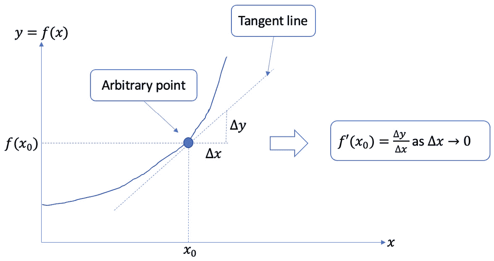

图 9.1 – 展示研究任意点变化率的微分微积分的图形

在点 x 0 处的变化率，或函数 y = f(x)在点 x = x 0 处的敏感性，可以表示为 f ′ (x 0) = ∆ y / ∆ x，当∆ x 无限小的时候——也就是说，∆ x → 0。另一方面，积分微积分表明特定范围 x ∈ [a, b]的 AUC f(x)，如图*图 9**.2*所示：

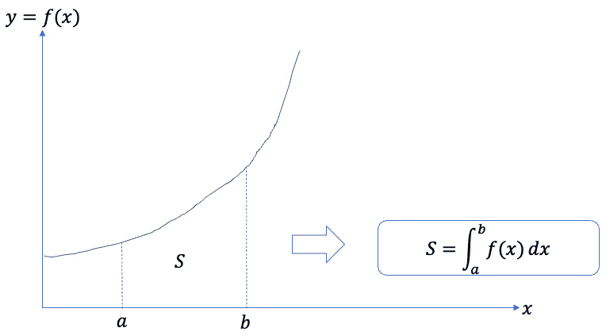

图 9.2 – 展示积分微积分作为总 AUC 的图形

我们将积分的结果表示为 S = ∫ a b f(x)dx，在这种情况下报告一个正量。这意味着积分的结果也可以是负的，如果曲线位于*x*轴下方。

## 更多关于函数的内容

注意，函数是两个元素集合之间的映射机器。对于输入集中的每个元素，输出集中只有一个对应的元素。输入集中所有可能元素的集合称为定义域，所有对应元素的集合称为值域。*图 9**.3*显示了四种不同的映射场景。前三个是根据函数的定义有效的映射，而最后一个由于一对一多映射关系而失败：

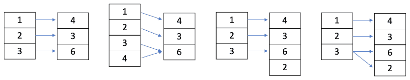

图 9.3 – 四种不同的映射场景

前三个映射是有效的函数，而最后一个由于最后一个元素中的一对多映射（3->6 和 3->2）而无效。

对于函数 y = f(x) = x 2，我们经常使用多个名称，如下所示：

+   变量 x 可以称为**自变量**、**特征**、**协变量**或**输入**。

+   变量 y 可以称为**因变量**、**结果**、**目标**、**响应**或**输出**。

+   映射函数 f(x) = x² 可以称为**函数**、**映射**、**投影**或**假设**。

*图 9**.4*总结了这些术语，并提供了一组输入-输出样本及其相应的图形。注意，输入可以是任何数字或表示为一般变量：

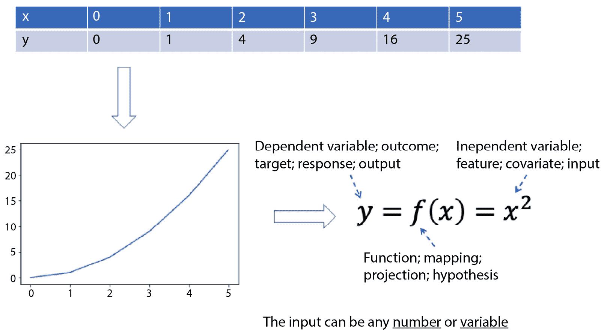

图 9.4 – 示例映射函数 y = f(x) = x²

## 垂直线测试

评估一个映射或曲线是否为函数的一种技术是垂直线测试。特别是，平面上的任何垂直线最多只能与一个函数的图形相交一次。也就是说，对于任何函数 f : A → B，每个元素 x ∈ A 最多映射到 B 中的一个值 f(x) ∈ B。*图 9**.5*说明了两个曲线，其中第一个曲线只与垂直线相交一次，因此是一个有效的函数，而第二个曲线与垂直线相交两次，因此不满足函数的定义：

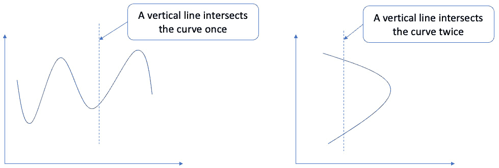

图 9.5 – 使用垂直线测试评估曲线是否为函数

## 函数对称性

函数可能具有许多特殊性质，函数对称性是其中之一。例如，如果 f(x) = f(-x)，则函数被称为偶函数，例如 f(x) = |x|，f(x) = x²，f(x) = cos(x)。如果 f(-x) = -f(x)，则函数被称为奇函数，例如 f(x) = x³。

## 增减函数

函数也可以是增函数或减函数。如果对于任何 x_1 > x_2，f(x_1) > f(x_2)，则函数在区间[a, b]上是增函数；如果对于任何 x_1 > x_2，f(x_1) < f(x_2)，则函数在区间[a, b]上是减函数。

## 函数的斜率

一条直线的斜率 m 可以根据任意两点(x_1, y_1)和(x_2, y_2)使用以下定义来计算：

m = (y_2 - y_1) / (x_2 - x_1)

与*图 9**.1*中的导数定义相联系，导数本质上是在点 x = x⁰ 处的切线斜率。

## 函数复合

函数复合指的是一个函数由多个嵌套函数组成的情况，表示为 f(g(x)) = (f ∘ g)(x)。映射序列如下：输入变量 x 首先通过函数 g(x)进行转换，然后通过函数 f(x)进行转换。在 f(g(x))中，g(x)是内部函数，f(x)是外部函数。

例如，给定 f(x) = 2x - 1，g(x) = x³，我们可以得到 f(g(x))如下：

f(g(x)) = 2x³ - 1

注意，函数复合不是可交换的——也就是说，f(g(x)) ≠ g(f(x))。

## 常见函数

让我们来看看几种常见的函数类型。

#### 幂函数

**幂函数**，f(x) = k x^p，其中 k 和 p 是常数，x 是变量。k 也称为系数。以下是一些例子：

+   立方函数：f(x) = x³

+   平方根函数：f(x) = √x

+   立方根函数：f(x) = 3√x

+   线性函数：f(x) = x

+   绝对值函数：f(x) = |x|

+   平方函数：f(x) = x²

#### 多项式函数

**多项式函数**，f(x) = a_n x^n + a_{n−1} x^{n−1} + … + a_1 x + a_0，其中 a_n 是首项系数。n 是一个非负整数，称为多项式的次数，系数 a_0, … , a_n 是实数，且 a_n ≠ 0。

#### 有理函数

**有理函数**，f(x) = n(x)/(d(x))，其中 n(x) 和 d(x) 都是多项式，且 d(x) ≠ 0。

#### 指数函数

**指数函数**，f(x) = b^x，其中 b > 0 且 b ≠ 1。

#### 对数函数

**对数函数**：f(x) = log_bx，其中 b > 0 且 b ≠ 1。注意，当 y = log_bx 时，我们有等价形式 x = b^y。

在快速了解了许多函数及其性质之后，让我们看看极限的概念，它与导数相关。

## 理解极限

函数 f(x) 的极限表示，当输入 x 接近但不等于一个数 c 时，f(x = c) 的值将接近一个实数 L。数学上，我们可以表示如下：

lim x→c f(x) = L

或者，它也可以表示为 f(x) → L 当 x → c。注意，极限 lim x→c f(x) 的值可能不一定等于函数在 x = c 处的值——即 f(c)。这种等式，lim x→c f(x) = f(c)，仅在 f(x) 是连续函数时发生。

## 无穷大极限

当极限 lim x→c f(x) 在 x → c 时不存在，我们说函数 f(x) 趋向于无穷大，因此当 x → c 时导致无穷大极限。我们也可以说 x = c 是函数 f(x) 的垂直渐近线。

一个例子是 f(x) = 1/(x - 1)。我们知道定义域是 x ≠ 1。当 x → 1 时，我们有 lim x→1 1/(x - 1) = ∞，这分解为从左侧接近 lim x→1− 1/(x - 1) = −∞ 和从右侧接近 lim x→1+ 1/(x - 1) = ∞。这两个结果共同导致 lim x→1 1/(x - 1) = ∞，因此 lim x→1 1/(x - 1) 不存在。垂直渐近线是 x = 1。

## 无穷大极限

无穷大极限关注的是当 x → ∞ 或 x → −∞ 时 f(x) 的值。这给出了函数的水平渐近线——即 lim x→∞ f(x) 和 lim x→−∞ f(x)。我们称 y = b 为水平渐近线，如果 lim x→∞ f(x) = b 或 lim x→−∞ f(x) = b。

让我们看看几个例子。对于平方函数 f(x) = x²，我们有 lim x→∞ x² = ∞ 和 lim x→−∞ x² = ∞。对于平方根函数 f(x) = √x，由于定义域是 x ≥ 0，我们有 lim x→∞ √x = ∞。对于自然对数函数 f(x) = lnx，由于定义域是 x > 0，我们有 lim x→∞ √x = ∞。对于一般结果，我们有 lim x→∞ x^p = ∞ 和 lim x→∞ 1/x^p = ∞。

下一个部分正式介绍了导数。

## 介绍导数

对于函数 y = f(x)，f 在 x 处的导数，记作 f′(x)，定义为以下内容：

f′(x) = lim(h→0) f(x + h) - f(x) / h，如果极限存在。

当 f′(x)在区间[a, b]内的每个 x 值上存在时，我们说函数 f 在 x ∈ [a, b]上是可导的。

导数有多种应用。除了将导数解释为切线斜率之外，最常见的应用是我们可以使用导数来确定函数在特定点上是上升/增加还是下降/减少。它还表示在给定点 x 的瞬时变化率，或速度。

一个图形说明将有助于我们的理解。*图 9.6*提供了一个 f(x)的样本曲线，其中有一条**割线**连接两个点(a, f(a))和(b, f(b))。在这里，割线是穿过函数曲线的两个或更多不同点的直线。我们通过在点(a, f(a))上加上一个小的量 h 得到第二个点(a + h, f(a + h))。连接这两个点给出通过这两个点穿过函数 f(x)的割线。当 h 趋近于 0 时，割线将逐渐接近在 x = a 处得到的切线。最终，割线将在极限中与切线重叠，割线的斜率，表示为 f(a + h) - f(a) / h，将变为它们在极限中重叠时的切线斜率：

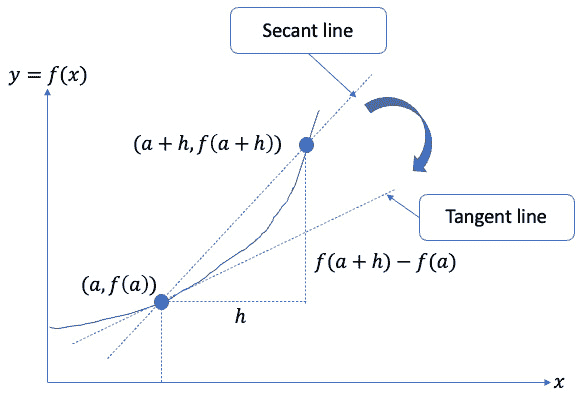

图 9.6 – 展示导数推导过程的图形

在*图 9.6*中，第二个点(a + h, f(a + h))是通过在点(a, f(a))上加上一个小的量 h 得到的。连接这两个点给出割线。当 h 趋近于 0 时，割线将逐渐接近 x = a 处的切线，最终在极限中与切线重叠。

割线的斜率，也称为平均变化率，计算如下：

f(a + h) - f(a) / (a + h) - a = f(a + h) - f(a) / h

这是在 h ≠ 0 的前提下提供的。当 h 趋近于 0 时，割线无限接近于 x = a 处的切线，给出该点的瞬时变化率（如果极限存在的话）：

当 h 趋近于 0 时，函数 f 在 a + h 处的极限为 f(a + h)减去 f(a)除以 h

通常，如果 y = f(x)，我们可以将导数表示为 f′(x)，y′，dy/dx，或者 d/dx f(x)。

以下部分介绍一些常见的导数。

## 常见导数

在这里，我们提供了一些常见函数的导数列表：

+   常数函数：d/dx(c) = 0

+   幂函数：d/dx(x^n) = nx^(n-1)

+   指数函数：d/dx(e^x) = e^x, d/dx(b^x) = (lnb)b^x, 其中 b > 0

+   对数函数：d/dx(lnx) = 1/x, d/dx(log_bx) = 1/(lnb)x, 其中 b > 0, b ≠ 1

+   正弦和余弦函数：d/dx(sinx) = cosx, d/dx(cosx) = -sinx

计算导数通常涉及多个基本函数。下一节将介绍关于导数计算的一组性质和规则。

## 导数的常见性质和规则

我们引入两个常见的性质——常数倍性质和和差性质——然后是三个常见的规则：乘法法则、除法法则和链式法则。我们假设以下列表中的所有极限都存在：

+   **常数倍性质**：对于常数 c，如果 y = f(x) = ch(x)，那么 f′(x) = ch′(x)。用不同的方式表达，我们有 y′ = ch′，并且 dy/dx = c dh/dx。

+   **和差性质**：如果 y = f(x) = h(x) ± g(x)，那么 f′(x) = h′(x) ± g′(x)。用不同的方式表达，我们有 y′ = h′ + g′，并且 dy/dx = dh/dx + dg/dx。

+   **乘法法则**：如果 y = f(x) = h(x)g(x)，那么 f′(x) = h′(x)g(x) + h(x)g′(x)。用不同的方式表达，我们有 y′ = h′g + hg′，并且 dy/dx = g dh/dx + h dg/dx。

+   **除法法则**：如果 y = f(x) = h(x) / g(x)，那么 f′(x) = g(x)h′(x) - h(x)g′(x) / [g(x)]²。用不同的方式表达，我们有 y′ = gh′ - hg′ / g²，并且 dy/dx = g dh/dx - h dg/dx / g²。

+   **链式法则**：给定一个复合函数 y = f(x) = h(g(x))，我们有 f′(x) = h′(g(x))g′(x)。等价地，如果我们有 y = h(u)和 u = g(x)，那么 dy/dx = dy/du du/dx。

在下一节中，我们将转向积分微积分。

## 介绍积分微积分

积分是微分的逆运算。例如，对距离函数 S(t)关于时间的微分给出特定时间点的速度 v(t)。我们可以通过将时间周期分为 n 个等间距的区间来计算从时间 t = a 到 t = b 的累积距离 S = ∑i=0^(n-1) v(ti)Δt，在 n 个区间数趋于无穷大时——即 n → ∞，我们得到 S = lim(n→∞) ∑i=0^(n-1) v(ti)Δt = ∫a^b v(t)dt。

积分的结果称为不定积分，它允许我们从导数重建函数。这是微分运算的逆运算。形式上，如果函数 F(x)是 f(x)的不定积分，那么 F′(x) = f(x)。

*图 9.7* 说明了积分与 AUC 之间的等价性。我们可以使用积分来找到一般函数 f(x)的 AUC。这个面积可以通过添加趋近于零宽度的矩形切片来获得。每个矩形的宽度是 dx，根据定义，它指的是 x 的无穷小变化，即 x 的微分：

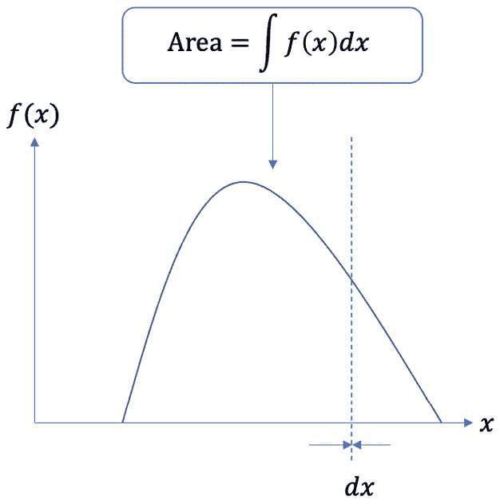

图 9.7 – 说明积分与 AUC 等价性的图表

注意，积分可以是定积分或不定积分。定积分有一个明确的积分起始点和结束点。例如，如果 x ∈ [a, b]，定积分变为∫a^b f(x)dx。另一方面，不定积分没有明确的边界，给出∫f(x)dx，它用来表示 f(x)的所有不定积分的集合。

下一节将更深入地探讨不定积分。

## 不定积分

通常，如果我们有 F′(x) = f(x)，那么我们可以将不定积分表示为 ∫ f(x)dx = F(x) + C，其中 C 是一个常数，在这里用来表示所有导数为 f(x) 的反导函数的集合。换句话说，我们有 d/dx[∫ f(x)dx] = f(x) 和 ∫ F′(x)dx = F(x) + C。

现在，让我们更深入地理解不定积分 ∫ f(x)dx 的表达式。∫ 是积分符号，f(x) 是被积函数，dx 是沿 x 的一个切片，表示反导数是在 x 上进行的。*图 9.8* 展示了命名约定：

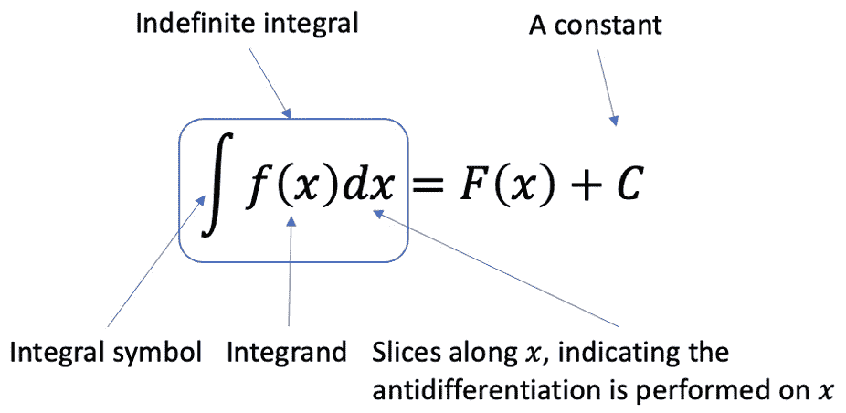

图 9.8 – 总结不定积分的命名约定

我们现在将研究常见基本函数的不定积分。

## 基本函数的不定积分

以下列表提供了基本函数的不定积分。再次注意，常数 C 用来表示所有具有相同导数的反导函数的集合：

+   ∫ x^n dx = (1/(n+1))x^(n+1) + C

+   ∫ e xdx = e x + C

+   ∫_b^xdx = (1/2)x² + C

+   ∫ 1/x dx = ln|x| + C

+   ∫ sinxdx = − cosx + C

+   ∫ cosxdx = sinx + C

## 不定积分的性质

本节涵盖了与导数函数相对应的一组性质。以下两个性质是直接的线性运算：

+   ∫ Kf(x)dx = K∫ f(x)dx

+   ∫ [f(x) ± g(x)]dx = ∫ f(x)dx ± ∫ g(x)dx

以下列表包含了一些计算不定积分的一般公式：

∫ [f(x)]^n f'(x)dx = [(f(x))]^(n+1)/(n+1) + C, n ≠ 1

∫ e^(f(x)) f'(x)dx = e^(f(x)) + C

∫ 1/f(x)f'(x)dx = ln|f(x)| + C

接下来，我们介绍最广泛使用的技术之一：分部积分。

## 分部积分

根据之前引入的乘积法则，我们知道以下内容：

d/dx[f(x)g(x)] = f′(x)g(x) + f(x)g′(x)

我们可以对方程的两边进行积分，并重新排列项，得到以下结果：

∫ f(x)g'(x)dx = f(x)g(x) − ∫ g(x)f'(x)dx

这给出了分部积分公式。更简洁地说，我们可以定义 v = g(x) 和 u = f(x)。因此，dv = g′(x)dx 和 du = f′(x)dx。前面的方程变为：

∫ udv = uv − ∫ vdu

接下来，我们将更深入地探讨定积分。

## 定积分

如果 f(x) 是 x ∈ [a, b] 上的连续函数，且 F(x) 是 f(x) 的反导数，即 F(x) = ∫ f(x)dx + C。以下公式给出了微积分的基本定理：

∫ a bf(x)dx = F(b) − F(a)

这个表达式说明，在区间 [a, b] 内的 AUC f(x) 可以通过计算反导函数 F(x) 在两个端点的评估差来得到。

定积分与不定积分具有大部分相同的性质，以下是一个额外的性质：

∫_a^cf(x)dx = ∫_a^bf(x)dx + ∫_b^cf(x)dx

下一个部分将探讨使用 R 进行微积分的实现方面。

# 在 R 中使用微积分

在本节中，我们将使用`mosaicCalc`包来执行与微积分相关的操作。我们将使用的函数大多是分析性的（有显式表达式）且性质简单。以下代码片段检查此包是否已安装，如果条件评估为`true`，则会安装该包，然后将其导入当前会话：

```py

if(!require("mosaicCalc")){
  install.packages("mosaicCalc")
}
library(mosaicCalc)
```

为了避免过多的想象，了解未知函数的一个好方法是绘制它们。让我们看看如何使用`mosaicCalc`包绘制函数。

## 绘制基本函数

在使用`mosaicCalc`包绘制函数时，我们需要指定一些输入参数。总的来说，我们需要指定函数的表达式、用于绘制函数的输入变量（s）、每个输入变量的域以及预先设置的参数值。

在绘图方面，有三个常见的绘图函数：`slice_plot()`，用于绘制只有一个输入变量的函数，`contour_plot()`，用于绘制具有两个输入变量的函数，以及`interactive_plot()`，用于绘制交互式图形。这些函数允许我们将数学表达式转换为代码，然后绘制图形。让我们通过以下练习来探索每个函数。

### 练习 9.1 – 绘制基本函数

本练习将探索前面函数的绘图功能，从`slice_plot()`开始。请按照以下步骤进行：

1.  使用`slice_plot()`函数绘制函数 y = 2x + 1，其中 x ∈ [−5, 5]，如下所示：

    ```py

    >>> slice_plot(2*x+1 ~ x, domain(x = range(-5, 5)))
    ```

    在这里，我们将函数表达式 2x + 1 放在波浪号（`~`）的左边，输入变量 x 放在右边。我们还通过传递边界给`range()`函数来指定域。运行此命令将生成如*图 9**.9*所示的输出：

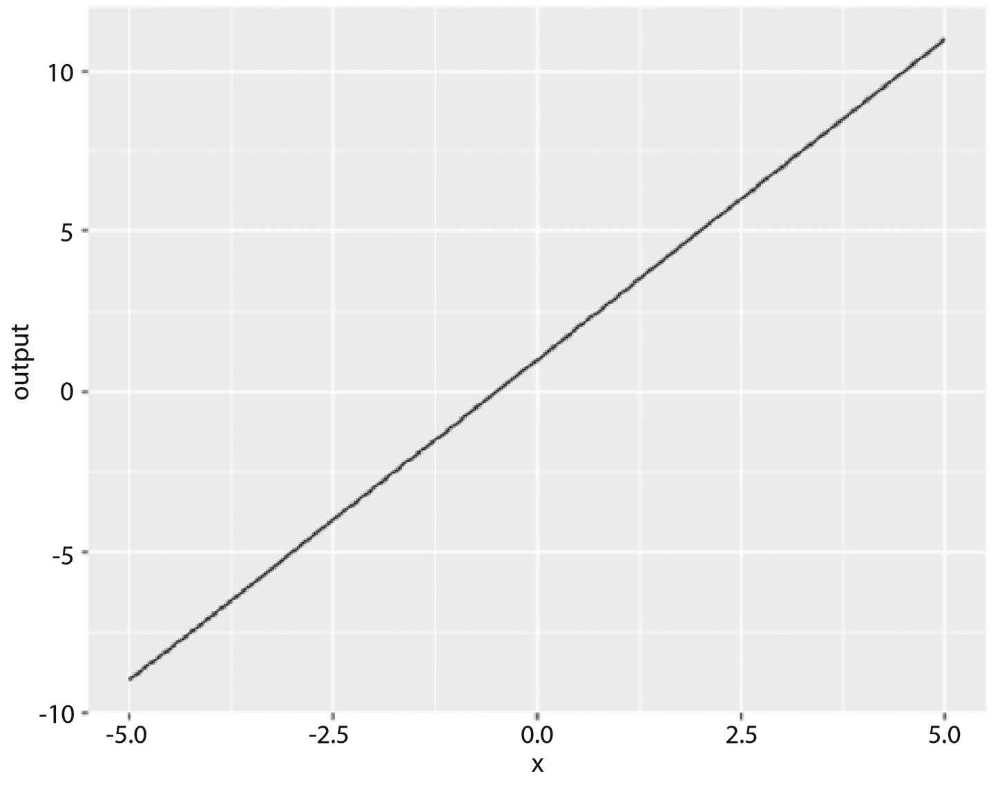

图 9.9 – 使用 slice_plot()函数绘制直线

我们还可以通过设置直线 y = mx + b 的系数 m 和截距 b 的先验参数来使函数更通用。这使得代码更通用，因为我们只需要在以下代码片段中指定`m`和`b`来绘制任何直线：

```py

m = 2
b = 1
slice_plot(m*x+b ~ x, domain(x = range(-5, 5)))
```

注意，如果没有设置输入参数的初始值，将会发生错误，如下面的代码片段所示：

```py

>>> slice_plot(a*x+b ~ x, domain(x = range(-5, 5)))
Error in slice_plot(a * x + b ~ x, domain(x = range(-5, 5))) :
  Parameter <a> without specified numerical values.
```

此外，我们可以使用`makeFun()`函数给要绘制的函数命名，如下面的代码片段所示：

```py

f = makeFun(2*x+1 ~ x)
slice_plot(f(x) ~ x, domain(x = range(-5, 5)))
```

一旦给函数命名，我们就可以传递任意输入值来评估函数。例如，设置 x = 2 将返回`5`，如下所示：

```py

>>> f(x=2)
5
```

接下来，我们来看如何为具有两个输入变量的函数生成等高线图。

1.  使用`contour_plot()`函数绘制方程 z = 2x + 3y 的等高线图，如下所示：

    ```py

    >>> contour_plot(2*x + 3*y ~ x & y, domain(x=-5:5, y=-5:5))
    ```

    在这里，我们使用 `&` 符号来表示多个输入变量，并为两个变量设置相应的范围。运行此命令将生成如图 *9**.10* 所示的输出：

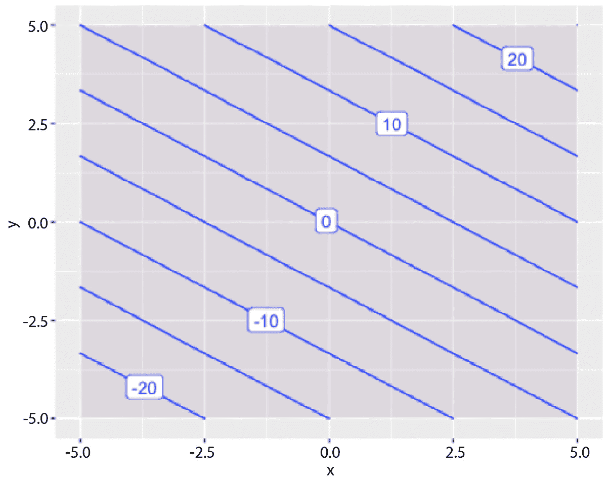

图 9.10 – 使用 contour_plot() 函数生成 z = 2x + 3y 的等高线图

接下来，我们看看如何使用 `interactive_plot()` 函数生成交互式绘图。

1.  使用 `interactive_plot()` 函数为相同的表达式生成交互式 3D 图，如下所示：

    ```py

    >>> interactive_plot(2*x + 3*y ~ x & y, domain(x=-5:5, y=-5:5))
    ```

    运行此命令将生成如图 *9**.11* 所示的输出。请注意，生成的图形是一个交互式 HTML 小部件，允许我们移动并当鼠标悬停时显示辅助信息：

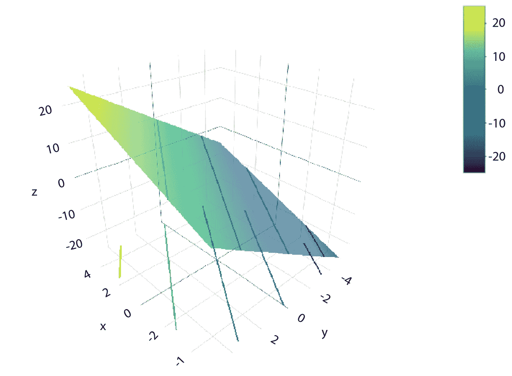

图 9.11 – 使用 interactive_plot() 函数生成 z = 2x + 3y 的交互式 3D 图

下一节将介绍通过使用 `D()` 函数进行微分操作来处理导数。

## 处理导数

在 R 中，通过 `D()` 微分操作符完成微分操作，它输入单个表达式并输出导数函数。输入指定与之前绘图函数所需的相同表达式。例如，要指定函数 y = x² + 1，我们可以将 `x²+1 ~ x` 传递给 `D()` 函数，然后它将自动计算导数函数 y′ = 2x。然后我们可以将结果分配给另一个变量，该变量作为导数函数，并可用于在定义域中的任何点评估导数值。

以下代码片段说明了获取导数函数的过程。`D()` 操作符的返回值是导数函数，打印出来后为 y′ = 2x：

```py

f_prime = D(x²+1 ~ x)
>>> f_prime
function (x)
2 * x
<bytecode: 0x144378300>
```

以下代码片段评估了两个输入值。结果显示，`D()` 函数能够正确计算导数函数并在任意输入位置进行评估：

```py

>>> f_prime(1)
a
>>> f_prime(2)
4
```

注意，`D()` 函数可以在计算导数函数时执行之前提到的规则。例如，要获得 y = sin( x² − 5) 的导数，我们会调用链式法则并计算导数为 y' = 2x cos( x² − 5)。`D()` 函数为我们完成了这项工作，如下面的代码片段所示：

```py

f_prime = D(sin(x²-5) ~ x)
>>> f_prime
function (x)
2 * x * cos(x² - 5)
```

让我们也验证商法则。在以下代码片段中，我们将函数 y = 2x² + x + 1 传递给 `D()`，理想情况下它应该返回导数函数 y' = 2(x + 1) − 2x(x + 1)²。结果显示这确实是正确的：

```py

f_prime = D(2*x/(x+1) ~ x)
>>> f_prime
function (x)
{
    .e1 <- 1 + x
    (2 - 2 * (x/.e1))/.e1
}
```

下一节将介绍在函数中使用符号参数。

## 使用符号参数

符号参数在构建函数时提供了通用性。与之前一样，我们可以在将参数的先前值传递给函数表达式之前对其进行编码。以下练习说明了这一点。

### 练习 9.2 – 使用符号参数

在这个练习中，我们将研究一个一般函数 y = A x³ + Bx + 3，其中 A 和 B 是常数，x 是唯一的随机输入变量。导数函数将是 y′ = 3A x² + B。按照以下步骤进行：

1.  按如下方式计算函数 y = A x³ + Bx + 3 的导数：

    ```py

    f_prime = D(A*x³+B*x+3 ~ x)
    >>> f_prime
    function (x, A, B)
    3 * A * x² + B
    ```

    我们看到导数函数计算正确。

1.  当 x = 2，A = 2，B = 3 时，按如下方式评估导数函数：

    ```py

    >>> f_prime(x=2, A=2, B=3)
    27
    ```

    我们也可以通过多个点来评估函数，这相当于在特定范围内绘制导数函数。

1.  在 x ∈ [−5, 5] 的范围内，以 A = 2 和 B = 3 为条件绘制导数函数，如下所示：

    ```py

    >>> slice_plot(f_prime(x, A=2, B=3) ~ x, domain(x=range(-5,5)))
    ```

    执行此命令将生成 *图 9*.12 中所示的输出：

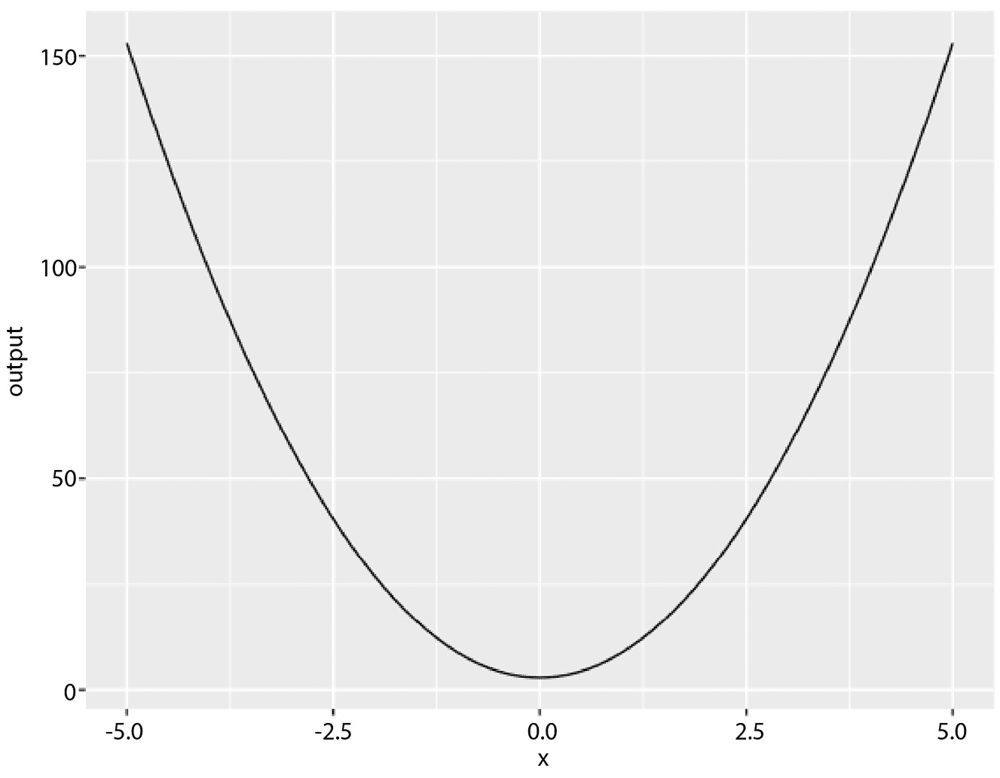

图 9.12 – 可视化导数函数 y′ = 6x² + 3

下一个部分将介绍二阶导数。

## 处理二阶导数

二阶导数，表示为 f″(x)，就是原始函数 f(x) 的一阶导数的导数。在先前的例子中，当 y = A x³ + Bx + 3 时，我们有 y′ = 2A x² + B。再求一次导数得到 y″ = 4Ax。

让我们通过以下练习看看如何获得二阶导数。

#### 练习 9.3 – 计算二阶导数

在这个练习中，我们将计算原始函数 f(x) 的二阶导数。二阶导数可以看作是对 f(x) 关于 x 进行两次求导，得到 f″(x) = y″ = d²/dx² f(x)。双重求导是通过在波浪号右侧有两个 x 来实现的。按照以下步骤进行：

1.  按如下方式计算二阶导数 f″(x)：

    ```py

    f_pprime = D(A*x³+B*x+3 ~ x & x)
    >>> f_pprime
    function (x, A, B)
    6 * A * x
    ```

    结果显示，绘制函数的二阶导数计算正确。

1.  当 x = 2，A = 2，B = 3 时，按如下方式评估二阶导数函数：

    ```py

    >>> f_pprime(x=2, A=2, B=3)
    24
    ```

    实际上，由于二阶导数函数与参数 B 无关，B 的任何值都会得到相同的结果。例如，以下代码即使在 B = 1 时也会返回相同的结果：

    ```py
    >>> f_pprime(x=2, A=2, B=1)
    24
    ```

1.  在 x ∈ [−5, 5] 的范围内，以 A = 2 为条件绘制二阶导数函数，如下所示：

    ```py

    >>> slice_plot(f_pprime(x, A=2) ~ x, domain(x=range(-5,5)))
    ```

    执行此命令将生成 *图 9*.13 中所示的输出。在这里，我们注意到，与一阶导数函数的钟形曲线相比，二阶导数函数是一条直线。这条直线表示一阶导数函数变化的速率：

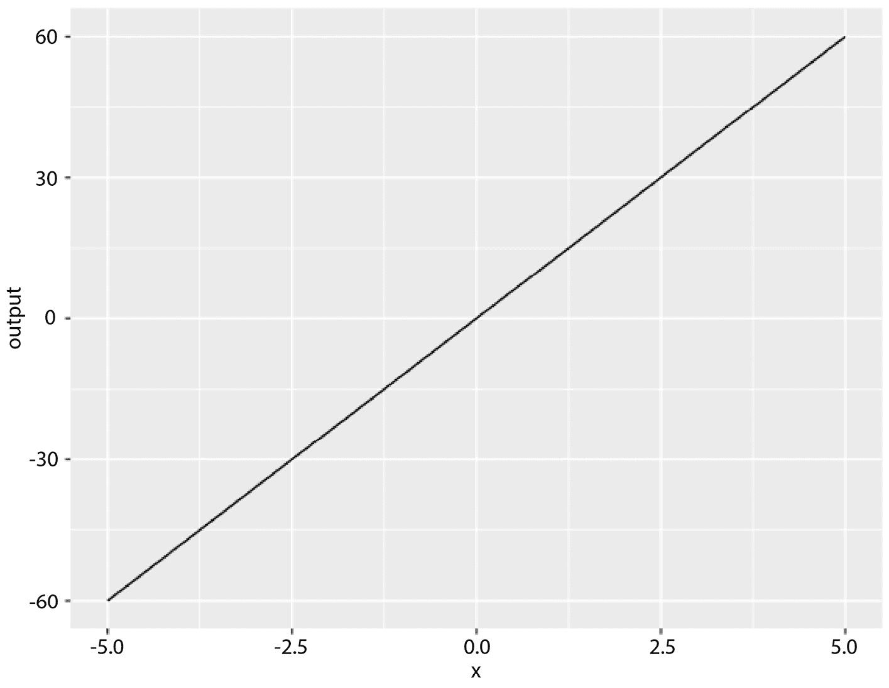

图 9.13 – 可视化二阶导数函数 y″ = 12x

下一个部分将介绍更一般的偏导数函数。

## 处理偏导数

二次导数函数可以看作是偏导数函数的一种特殊情况。假设一个二维函数 z = f(x, y)。通过两次对 x 求导得到 x 的二次导数。我们也可以先对 x 求导，然后对 y 求导，得到 d²/dxdy z 或等价地，d²/dydx z。让我们通过以下练习看看这是如何工作的。

### 练习 9.4 – 计算偏导数

在这个练习中，我们将基于原始函数 z = A x² + Bxy + C y² 计算三个不同的偏导数：d²/dx² z，d²/dxdy z（或 d²/dydx z），以及 d²/dy² z。按照以下步骤进行：

1.  计算 z 关于 x 的二次导数。检查结果是否为 d²/dx² z = 2A：

    ```py

    f_pprime = D(A*x² + B*x*y + C*y² ~ x & x)
    >>> f_pprime
    function (x, y, A, B, C)
    2 * A
    ```

    结果显示计算是正确的。

1.  计算 z 关于 x 的偏导数，然后是 y。检查结果是否为 d²/dxdy z = B：

    ```py

    f_pprime = D(A*x² + B*x*y + C*y² ~ x & y)
    >>> f_pprime
    function (x, y, A, B, C)
    B
    ```

    结果显示计算是正确的。我们也可以先对 y 求导，然后对 x 求导。如下代码片段所示，这给出了相同的结果：

    ```py
    f_pprime = D(A*x² + B*x*y + C*y² ~ y & x)
    >>> f_pprime
    B
    ```

1.  计算 z 关于 x 的偏导数，然后是 y。检查结果是否为 d²/dy² z = 2C：

    ```py

    f_pprime = D(A*x² + B*x*y + C*y² ~ y & y)
    >>> f_pprime
    function (x, y, A, B, C)
    2 * C
    ```

    结果显示计算是正确的。

下一节将介绍如何使用 R 计算积分或不定积分。

# 在 R 中处理积分

回想一下，微分是通过 `D()` 函数进行的。假设 y = A x² + Bx + 3，我们有 y′ = f′(x) = 2Ax + B。我们可以绘制原始函数 f(x) 和其导数函数 f′(x)，以方便比较。

在以下代码片段中，我们使用 `makeFun()` 函数创建这个表达式，并将其命名为 `f`：

```py

f = makeFun( A*x² + B*x + 3 ~ x)
>>> f
function (x, A, B)
A * x² + B * x + 3
```

我们可以进行如下简单评估：

```py

>>> f(1, A=1, B=1)
5
```

现在，我们得到了导数函数并将其存储在 `f_prime` 中：

```py

f_prime = D(f(x) ~ x)
>>> f_prime
function (x, A, B)
2 * A * x + B
```

这是一个从原始函数导出的新函数。我们对此函数也进行了简单的评估，如下所示：

```py

>>> f_prime(x=1, A=1, B=1)
3
```

现在，让我们绘制原始函数 f(x) = x² + x + 3：

```py

>>> slice_plot(f(x) ~ x, domain(x = -1:1)) %>%
  gf_labs(title = "Original function f(x)")
```

运行命令生成了如图 *9**.14* 所示的输出。在这里，我们使用了 `gf_labs()` 函数来设置图表的标题：

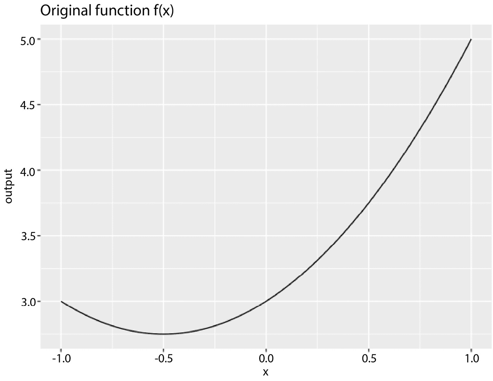

图 9.14 – 可视化原始函数 f(x) = x² + x + 3

我们还可以如下绘制导数函数 f′(x) = 2x + 1：

```py

>>> slice_plot(f_prime(x, A=1, B=1) ~ x, domain(x =-1:1), color = "red") %>%
  gf_labs(title = "Derivative function f'(x)")
```

运行命令生成了如图 *9**.15* 所示的输出：

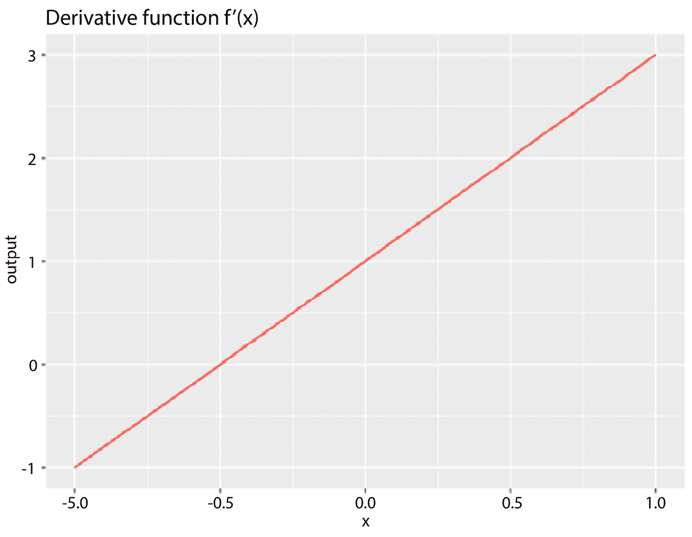

图 9.15 – 可视化导数函数 f′(x) = 2x + 1

在有了导数函数之后，我们可以使用 `antiD()` 函数来获取其不定积分，如下所示：

```py

F_integral <- antiD(f_prime(x) ~ x)
>>> F_integral
function (x, A, B, C = 0)
A * x² + x * B + C
```

注意，除了作为不定积分函数的额外输入参数添加的附加常数 `C`（默认值为 0）外，原始函数的正确形式得到了恢复。

我们也可以评估不定积分函数，如下所示：

```py

>>> F_integral(1, A=1, B=1)
2
```

将 `A=1`, `B=1`, 和 `C=0` 代入，不定积分函数 F(x) = x² + x 的可视化如下：

```py

>>> slice_plot(F_integral(x, A=1, B=1) ~ x, domain(x=-1:1)) %>%
  gf_labs(title = "Antiderivative function F_integral(x)")
```

运行命令会生成如图 **9**.16 所示的输出：

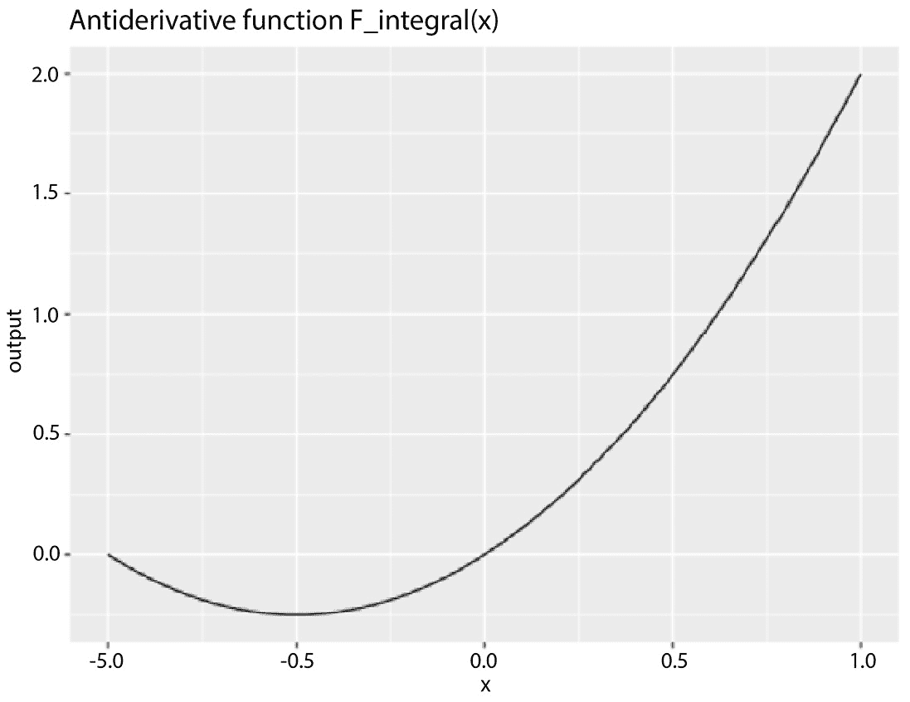

图 9.16 – 可视化导数函数 f′(x) = 2x + 1

现在，如果我们再次对反导数函数 F(x) = A x² + Bx + C 求导，我们预计会得到相同的导数函数 f(x) = 2Ax + B。下面的代码片段验证了这一结果：

```py

f_prime2 = D(F_integral(x) ~ x)
>>> f_prime2
function (x, A, B, C = 0)
2 * A * x + B
```

让我们暂停一下，看看导数函数和它们的原函数之间的关系。

## 更多关于反导数的内容

产生 F(x) = ∫ f'(x)dx + C 的反导数操作是生成 f'(x) 的导数的逆过程。它代表一个函数族，包括原始函数 f(x)。这些函数彼此之间非常相关。具体来说，导数函数 f'(x)，作为一个导出函数，告诉了原始函数 f(x) 在任意输入点 x 的变化率。它给出了 f(x) 在微观镜头中的局部性质，测量了 f(x) 在当前点的敏感性。

然而，我们并不总是在每种情况下都需要导出 f'(x)。有时，我们将从导数函数 f'(x) 开始工作，并会对导出原始函数——即反导数函数 F(x) 感兴趣。这给出了原始函数 f(x) 的全局性质，表示在特定范围内的累积值。

获得未知原始函数的过程称为反导数，或积分。结果是积分。根据积分是否在特定边界上计算，我们有一个不定积分和一个定积分。

积分操作生成一个反导数函数族。与前面的例子一样，反导数函数是 F(x) = A x² + Bx + C。将 `A=1` 和 `B=1` 设置，对于不同的 C 值，我们将在相同的输入位置获得不同的结果，如下面的代码片段所示：

```py

>>> F_integral(x=1, A=1, B=1, C=0)
2
>>> F_integral(x=1, A=1, B=1, C=1)
3
>>> F_integral(x=1, A=1, B=1, C=2)
4
```

虽然这些是不同的原始函数，但它们都共享相同的导数函数，如下面的代码片段所示：

```py

>>> D(F_integral(x, A=1, B=1, C=0) ~ x)
function (x)
2 * x + 1
>>> D(F_integral(x, A=1, B=1, C=1) ~ x)
function (x)
2 * x + 1
>>> D(F_integral(x, A=1, B=1, C=2) ~ x)
function (x)
2 * x + 1
```

以 F(x) = ∫ f′(x)dx + C 表示的反导数函数族，因此对应于无限多个函数，包括原始函数 f(x)。这些无限多个反导数函数实际上是 f(x) 的垂直平移，给出 F(x) = f(x) + C。

此外，请注意，导数函数与原始函数共享相同的输入参数集，如下面的代码片段所验证：

```py

>>> f
function (x, A, B)
A * x² + B * x + 3
<bytecode: 0x128185eb0>
>>> f_prime
function (x, A, B)
2 * A * x + B
<bytecode: 0x11fbc6628>
```

然而，反导数函数需要一个额外的参数——常数 `C`，如下所示：

```py

>>> F_integral
function (x, A, B, C = 0)
A * x² + x * B + C
<bytecode: 0x128303540>
```

下一节将探讨如何计算定积分。

## 计算定积分

计算定积分需要两次评估不定积分：一次在积分的起点，一次在积分的终点。

例如，假设不定积分函数为 F(x) = x² + x + C，对于 A=1 和 B=1。要计算不定积分 ∫₂³ f′(x)dx，我们需要在 x = 2 和 x = 3 处评估 F(x)，然后取它们的差，得到 F(3) − F(2)。以下代码片段显示了结果：

```py

>>> F_integral(x=3, A=1, B=1) - F_integral(x=2, A=1, B=1)
6
```

这里需要注意的是，在两次评估中，常数 `C` 假设为 `0`。实际上，它假设的值并不重要，因为两次评估中的常数总会相互抵消。换句话说，我们总会得到一个固定的定积分，尽管在特定的输入点，不定积分对应着无限多个值。

# 摘要

在本章中，我们介绍了微积分的基础，包括微分学和积分学。在第一部分，我们介绍了这两个微积分分支的直观理解，并涵盖了常见函数及其性质的基础。我们开始介绍极限的概念及其与导数定义的联系，随后介绍了常见的导数规则和性质。我们还讨论了积分学，包括不定积分和定积分，以及它们的规则和性质。

第二部分和第三部分简要介绍了 R 语言中的实现。我们介绍了如何使用 `D()` 和 `antiD()` 函数进行常见的微分和积分操作，并通过几个示例说明了它们的用法以及导数函数与其反导数之间的转换。

在下一章中，我们将进入数学统计学的领域，从概率的基础开始。
