# 11

# 统计估计

在本章中，我们将向您介绍一系列统计技术，这些技术使您能够使用数值和分类数据来进行推断和估计。我们将探讨关键概念和方法，如假设检验、置信区间和估计技术，这些技术使我们能够从给定的样本中对总体进行概括。

到本章结束时，您将掌握统计推断的核心概念，并能够在不同场景下进行假设检验。

本章将涵盖以下主要内容：

+   分类数据的统计推断

+   数值数据的统计推断

+   构建自助法置信区间

+   介绍 t 分布中使用的中心极限定理

+   使用 t 分布构建总体均值的置信区间

+   对两个均值进行假设检验

+   介绍方差分析（ANOVA）

要运行本章中的代码，您需要以下软件包的最新版本：

+   `dplyr`，1.0.10

+   `ggplot2`，3.4.0

+   `socviz`，1.2

+   `infer`，1.0.4

请注意，前面提到的版本是在我撰写本书时的最新版本。本章的所有代码和数据均可在[`github.com/PacktPublishing/The-Statistics-and-Machine-Learning-with-R-Workshop/blob/main/Chapter_11/working.R`](https://github.com/PacktPublishing/The-Statistics-and-Machine-Learning-with-R-Workshop/blob/main/Chapter_11/working.R)找到。

# 分类数据的统计推断

一个分类变量具有不同的类别或水平，而不是数值。分类数据在我们的日常生活中很常见，例如性别（男性或女性，尽管现代观点可能不同）、房产销售类型（新房或二手房）和行业。因此，对这些变量进行合理推断的能力对于在多种情境下得出有意义的结论和做出明智的决策至关重要。

作为分类变量，通常意味着我们无法将其传递给模型中的字符串值（如 `"finance"` 或 `"technology"`），一种常见的方法是将变量一热编码成多个列，每列对应一个特定行业，表示二进制值 `0` 或 `1`。

在本节中，我们将探讨专门用于处理分类数据的各种统计技术，使我们能够根据可用的样本得出有价值的见解并对总体进行推断。我们还将讨论重要概念，如比例、独立性和拟合优度，这些概念是理解和处理分类变量的基础，包括单参数和多参数的情况。

让我们从单个参数的推断开始讨论。

## 单个参数的统计推断

一个总体参数，我们感兴趣并要推断的主题，是一个描述总体特定统计属性的固定数量，包括均值、比例或标准差。这个数量通常对我们来说是隐藏的。例如，为了得到大学中最受欢迎的专业，我们需要计算整个大学每个专业注册的学生数量，然后返回计数最大的专业。

在单参数统计推断的背景下，我们的目标是估计这个未知参数或基于从样本收集的信息来测试其值的相关假设。换句话说，我们会使用统计推断工具，根据已知的样本来推断未知的人口参数。在前一个例子中，我们会通过特定学术年度注册的学生有限样本来推断整个大学最受欢迎的专业。

让我们先探索 **一般社会调查**（**GSS**）数据集。

## 介绍一般社会调查数据集

GSS 是一个综合数据集，被研究人员和政策制定者广泛用于理解美国的社会、文化和政治趋势。自 1972 年以来，GSS 由芝加哥大学的 **国家民意研究中心**（**NORC**）持续进行，目的是收集关于广泛主题的数据，包括态度、行为和对各种问题的观点。

让我们从 `socviz` 包中加载 GSS 数据集（请记住通过 `install.packages("socviz")` 安装此包）：

```py

library(socviz)
data(gss_lon)
```

GSS 数据集现在存储在 `gss_lon` 变量中，包含总共 62,466 行和 25 列，如下所示：

```py

>>> dim(gss_lon)
62466    25
```

GSS 数据集包含许多变量，涵盖了各种主题，如教育、收入、家庭结构、政治信仰和宗教归属。让我们使用 `dplyr` 包中的 `glimpse()` 函数来检查数据集的结构，该函数旨在帮助您快速探索和理解数据结构：

```py

>>> glimpse(gss_lon)
```

*图 11*.1 显示了返回的前几个变量的截图。

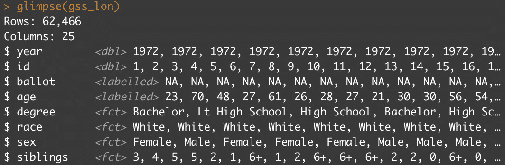

图 11.1 – 展示运行 glimpse() 函数的结果的前几行

接下来，我们将查看基于分类变量的特定统计量的计算。

## 计算样本比例

数据集中的 `siblings` 列是一个分类变量，追踪家庭中的兄弟姐妹数量。在接下来的练习中，我们希望计算在最新的一年，即 2016 年，家庭有两个兄弟姐妹的受访者比例。

### 练习 11.1 – 计算兄弟姐妹的样本比例

在这个练习中，我们首先获取`siblings`列的摘要，并对数据集进行子集化以关注 2016 年，然后将其用于计算家庭中有特定数量兄弟姐妹的调查比例：

1.  使用`summary()`函数获取`siblings`列的摘要：

    ```py

    >>> summary(gss_lon$siblings)
        0     1     2     3     4     5    6+  NA's
     3047 10152 11313  9561  7024  5066 14612  1691
    ```

    结果表明，大多数调查是在有六个或更多兄弟姐妹的家庭中进行的！

1.  对 2016 年的数据集进行子集化：

    ```py

    gss2016 = gss_lon %>% filter(year == 2016)
    Plot the count of siblings in a bar chart using ggplot().
    ggplot(gss2016, aes(x = siblings)) +
      geom_bar() +
      labs(title = "Frequency count of siblings", x = "Number of siblings", y = "Count") +
      theme(text = element_text(size = 16))
    ```

    运行代码生成图*11.2*。

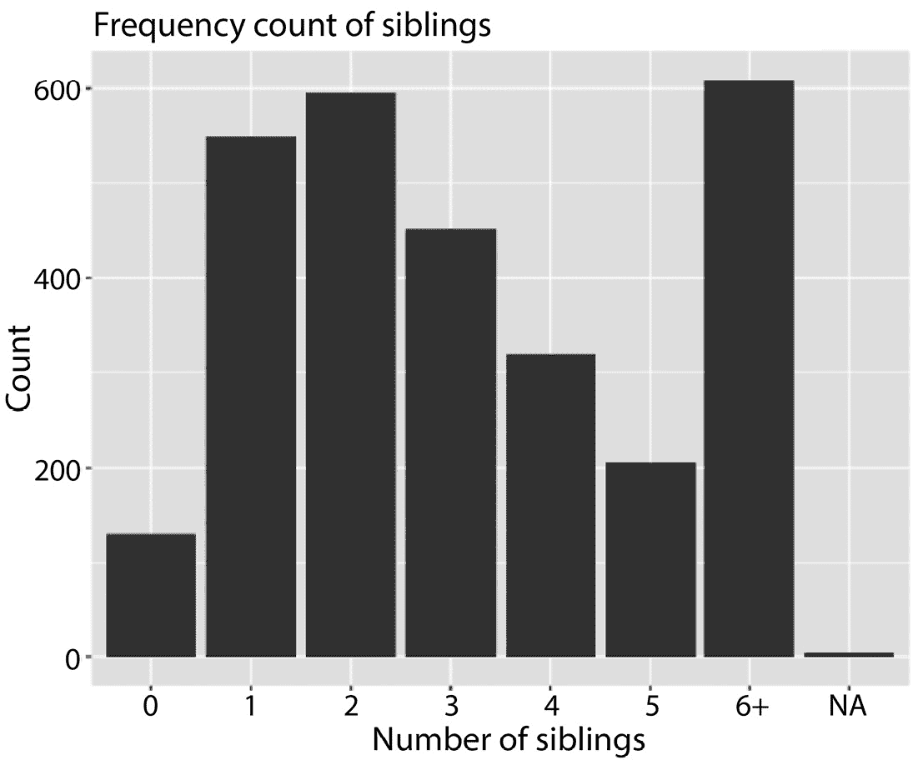

图 11.2 – 以柱状图可视化兄弟姐妹数量的频率计数

1.  计算有两个兄弟姐妹的调查比例：

    ```py

    p_hat = gss2016 %>%
      summarize(prop_2sib = mean(siblings=="2", na.rm=TRUE)) %>%
      pull()
    >>> p_hat
    0.208246
    ```

    在这里，我们使用`summarize()`函数计算一系列二元值的平均值，这对应于有两个兄弟姐妹的调查比例。然后我们使用`pull()`函数从结果 DataFrame 中获取比例。

我们使用样本比例来估计总体统计量。换句话说，我们根据可用的样本数据计算有两个兄弟姐妹的家庭比例，以近似如果我们基于总体中的所有数据计算相同的比例时对应的比例。这样的估计伴随着一个置信区间，该区间量化了总体比例的可能值列表。

下一节将展示如何计算样本比例的置信区间。

## 计算置信区间

置信区间是基于样本数据对总体参数进行推断的重要工具。置信区间提供了一个估计范围，其中包含一个总体参数，如比例，在指定的置信水平（如 95%）下可能被找到。当处理样本比例时，计算置信区间使我们能够更好地理解总体中的真实比例，并评估与总体比例估计相关的不确定性。

我们可以使用以下步骤来计算置信区间：

1.  计算样本比例，ˆp（读作 p-hat）。这是我们基于 2016 年的样本数据计算出的值。在其他情况下，ˆp 是通过将成功的数量（对于感兴趣的属性）除以总样本量来计算的。

1.  确定所需的置信水平，通常表示为(1 − α) x 100%，其中α代表显著性水平。换句话说，这是在原假设为真时拒绝零假设的概率。最常用的置信水平是 90%，95%和 99%。

1.  计算样本比例的标准误差，其公式如下：

SE = √(ˆp(1 − ˆp) / n)

在这里，标准误差也对应于样本比例的标准差，假设它遵循成功概率为ˆp 的伯努利分布（回想一下前一章中伯努利分布的介绍）。这种计算依赖于两个假设：样本中的观测值是独立的，样本中有足够的观测值。检查第二个假设的一个常见经验法则是确保 nˆp > 10 和 n(1 − ˆp) > 10。

或者，我们不必假设伯努利分布，可以使用自举过程来估计标准误差，而不做任何分布假设。自举是一种非参数方法，涉及有放回地重新抽样数据以创建新的样本，对每个重新抽样的数据集计算感兴趣的统计量（在这种情况下，是比例），并从计算统计量的变异性中估计标准误差。

4. 找到对应于预设置信水平的临界值（z 分数）。这可以通过`qnorm()`函数完成，它给出了标准正态分布的分位数。

5. 计算误差范围（ME）为标准误差与临界值的乘积：

ME = SE * z _ score

6. 通过从样本比例中加减 ME 来计算置信区间，得到以下结果：

下限 = ˆp − ME

上限 = ˆp + ME

置信区间根据特定的置信水平提供了总体比例的可能值列表。参见*图 11.3*对计算过程的总结。

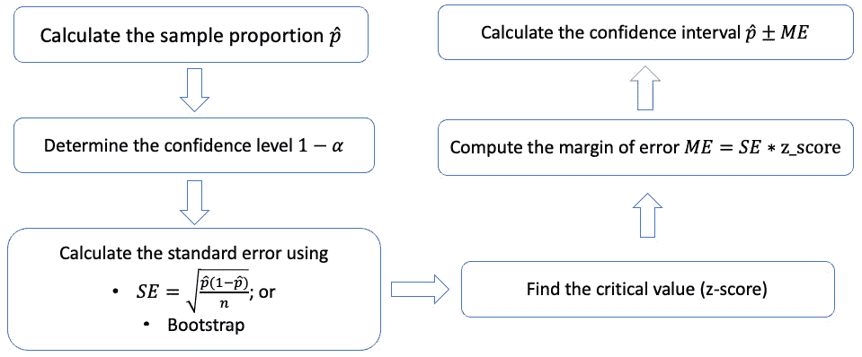

图 11.3 – 基于样本比例计算置信区间的过程总结

让我们再深入探讨一下自举过程。不假设任何特定分布，自举过程是一种灵活的方法，可以提供更准确的标准误差估计，特别是对于小样本量或数据表现不佳的情况。然而，它可能计算量很大，尤其是在大型数据集或生成许多自举复制时。

*图 11.4* 提供了自举过程的示意图。让我们回顾一下：

1.  首先，我们从整个数据集开始，并指定感兴趣的变量，在这个例子中是`兄弟姐妹`变量。这是通过`specify()`函数实现的。

1.  接下来，我们从变量中抽取样本，进行有放回抽样，其中新样本的大小与原始数据集相同。这种重抽样引入了随机性到结果数据集中。

1.  我们重复这个过程多次，使用`generate()`函数得到一系列通过自举得到的伪数据集。

1.  对于每个复制的数据集，我们将计算感兴趣的样本统计量，在这种情况下是具有两个兄弟姐妹的观察值的比例。这是通过`calculate()`函数完成的。

1.  这些通过重复抽样原始数据集得到的样本统计量将形成一个分布，称为自助法分布（通过`ggplot()`绘制），其标准差（通过`summarize()`函数提取）将是对标准误的良好近似。

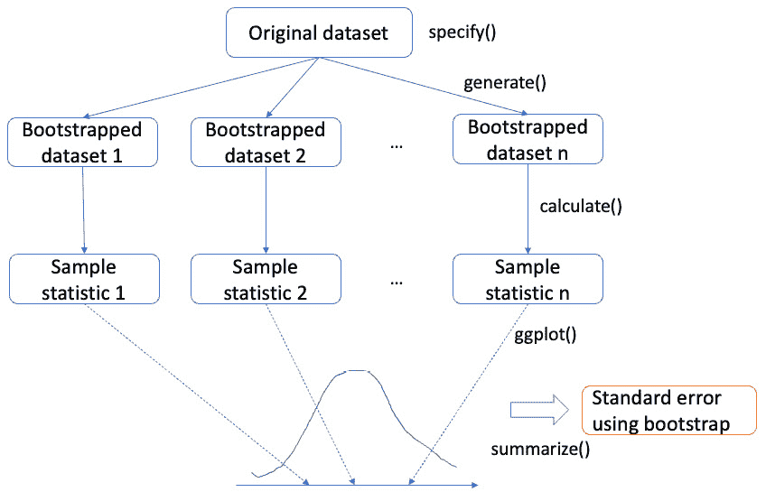

图 11.4 – 使用自助法程序获取标准误的示意图

通过自助法得到的样本传达了样本统计量不同水平的不确定性，并共同形成多个人工样本统计量的密度分布。自助法分布的标准差随后给出样本统计量的标准误。请注意，如`specify()`、`generate()`和`calculate()`等函数均来自 R 中的`infer`包。在继续以下代码之前，请记住安装此包。

让我们通过以下练习来了解计算置信区间的自助法程序。

### 练习 11.2 – 通过自助法计算置信区间

在这个练习中，我们将探索计算样本比例的置信区间。置信区间包括一系列估计值，在这些估计值中，给定观察到的样本，真实总体比例可能取值。这是基于实际观察来量化估计总体比例不确定性的方法。除了使用自助法逐步计算过程外，我们还将比较使用假设的伯努利分布的替代方法的结果：

1.  使用前面描述的`infer`包中的指定-生成-计算程序构建一组自助法样本统计量。请记住构建一个二元变量来指示具有两个兄弟姐妹的观察值的二元条件：

    ```py

    library(infer)
    gss2016 = gss2016 %>%
      mutate(siblings_two_ind = if_else(siblings=="2","Y","N")) %>%
      filter(!is.na(siblings_two_ind))
    bs = gss2016 %>%
      specify(response = siblings_two_ind,
              success = "Y") %>%
      generate(reps = 500,
               type = "bootstrap") %>%
      calculate(stat = "prop")
    ```

    在这里，我们首先使用`if_else()`函数创建一个二元指标变量，以表示当前调查中的家庭是否有两个兄弟姐妹。我们还删除了此列中具有`NA`值的行。接下来，我们使用`specify()`函数指出感兴趣的`siblings_two_ind`变量及其对应的成功级别。然后，我们使用`generate()`函数生成`500`个自助法样本，并使用`calculate()`函数通过设置`stat = "prop"`来获取每个自助法样本中相应的样本统计量（成功比例）。

    让我们观察自助法样本统计量中的内容：

    ```py
    >>> bs
    Response: siblings_two_ind (factor)
    # A tibble: 500 × 2
       replicate  stat
           <int> <dbl>
     1         1 0.205
     2         2 0.209
     3         3 0.218
     4         4 0.189
     5         5 0.207
     6         6 0.205
     7         7 0.221
     8         8 0.214
     9         9 0.212
    10        10 0.212
    # … with 490 more rows
    # i Use `print(n = ...)` to see more rows
    ```

    结果显示，`bs`对象是一个包含 500 行（对应于 bootstrap 样本的总数）和 2 列的`tibble` DataFrame。第一列（`replicate`）表示 bootstrap 样本的数量，第二列（`stat`）表示 bootstrap 样本中成功的比例（即`siblings_two_ind==2`的行数除以总行数）。

1.  在密度图中绘制 bootstrap 样本统计量：

    ```py

    >>> ggplot(bs, aes(x = stat)) +
      geom_density() +
      labs(title = "Density plot of the sample proportions", x = "Sample proportion", y = "Density") +
      theme(text = element_text(size = 16))
    ```

运行代码生成*图 11.5*的图表。这个分布的分散程度，与标准差相关，直接决定了标准误差的大小。此外，如果我们增加 bootstrap 样本的数量，我们预期密度曲线会更加平滑。

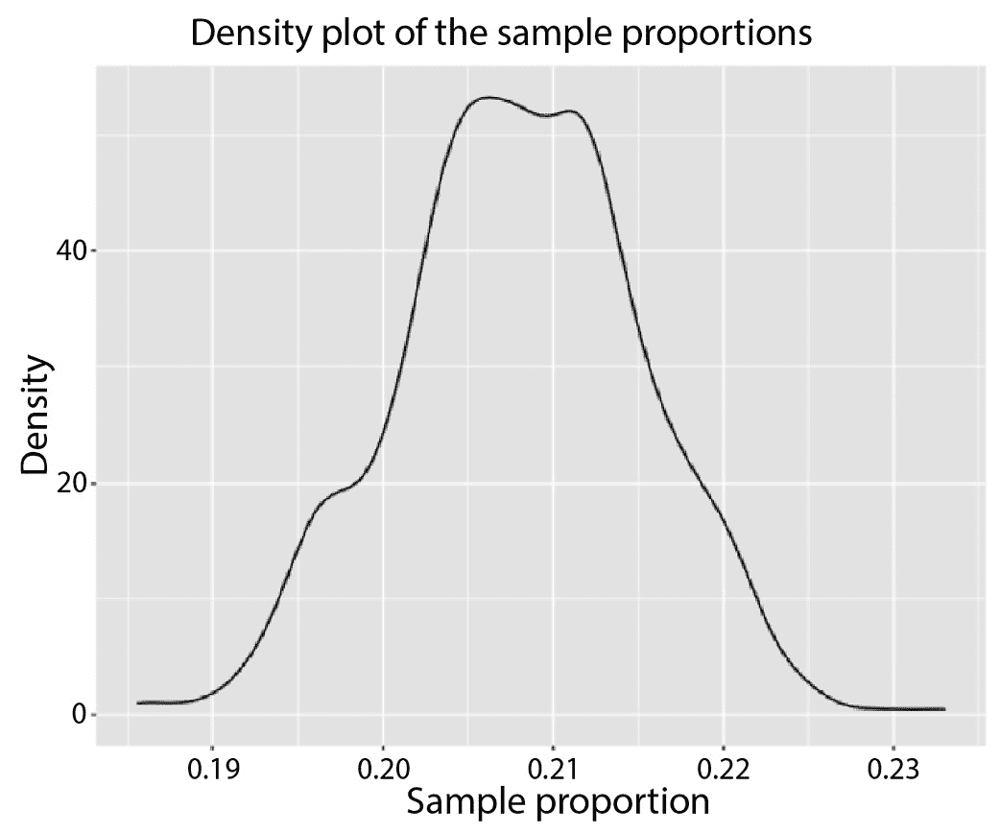

图 11.5 – 可视化所有 bootstrap 样本比例的密度图

1.  将标准误差计算为基于 bootstrap 样本比例的实证分布的标准差：

    ```py

    SE = bs %>%
      summarise(sd(stat)) %>%
      pull()
    >>> SE
    0.007181953
    ```

    在这里，我们使用`sd()`函数计算`bs`中`stat`列的标准差，然后通过`pull()`函数返回该值。然后，标准误差将根据预定的 z 分数进行缩放，并从原始样本比例（`p_hat`）中减去和加上，以获得置信区间。

1.  使用 95%置信区间计算原始样本比例的置信区间：

    ```py

    >>> c(p_hat - 2*SE, p_hat + 2*SE)
    0.1938821 0.2226099
    ```

    在这里，由于 95%置信水平对应于 z 分数 2，我们在从原始样本比例（`p_hat`）中减去和加上之前，将其与标准误差相乘以获得置信区间。

1.  假设成功的概率服从伯努利分布，使用结构信息计算置信区间：

    ```py

    SE2 = sqrt(p_hat*(1-p_hat)/nrow(gss2016))
    >>> c(p_hat - 2*SE2, p_hat + 2*SE2)
    0.193079 0.223413
    ```

    在这里，我们使用伯努利分布的方差显式形式来计算标准误差。结果显示的置信区间与使用 bootstrap 方法获得的置信区间相当相似。

置信区间为我们使用观察到的样本比例估计未知总体比例的不确定性提供了一个不确定性度量。让我们看看如何在下一节中解释置信区间。

## 解释样本比例的置信区间

解释样本比例的置信区间涉及理解区间的含义和相关的置信水平。在我们之前的例子中，bootstrap 方法报告的置信区间为`[0.1938821, 0.2226099]`。对于这个置信区间有两个层面的解释。

首先，置信区间的范围表明，具有两个兄弟姐妹的家庭的真实比例很可能在 19.39%到 22.26%之间。这个范围基于样本数据，并估计了真实比例的不确定性。

其次，95%的置信区间意味着如果我们多次进行调查（无论是 2016 年还是其他年份），我们会生成不同大小的随机样本，基于这些样本我们可以计算每个样本的 95%置信区间。在这些人工样本中，我们将获得一系列区间，其中大约 95%的区间将包含真实的总体比例。

注意，置信区间仍然是一个估计值，真实的总体比例可能落在计算出的区间之外。然而，置信区间提供了一种有用的方法来量化估计的不确定性，并基于观察到的样本给出真实总体比例的可能值的列表。

下一节将介绍对样本比例的假设检验。

## 对样本比例进行假设检验

对样本比例的假设检验与前面章节中引入的置信区间密切相关，它捕捉了基于总体数据对未知比例估计的不确定性水平。自然地，观察值较少的样本会导致置信区间较宽。对样本比例的假设检验旨在确定样本中是否有足够的证据来支持或拒绝关于总体比例的声明。这个过程从零假设（H0）开始，它代表了关于总体比例的基本假设。相应地，存在一个备择假设（H1），它代表了我们对零假设进行测试的声明或陈述。然后，假设检验将观察到的样本比例与指定的零假设进行比较，以评估我们是否有足够的证据来拒绝零假设，并支持备择假设。

让我们概述一下进行假设检验所涉及的程序：

1.  **制定假设**。在这个步骤中，我们设定零假设（H0）和备择假设（H1）。零假设通常表示没有效果，情况保持现状，如 H0 中的等号所示。另一方面，备择假设表示存在效果或差异，如 H1 中的不等号所示。例如，我们可以为 H0 和 H1 设定以下假设：

    +   H0: p = p 0（总体比例等于指定的值，p 0）

    +   H1: p ≠ p 0（总体比例不等于 p 0）

1.  **选择显著性水平（**𝜶**）**。显著性水平是我们用来在原假设为真时拒绝原假设的概率阈值。广泛使用的显著性水平包括 0.05（5%）和 0.01（1%）。

1.  **计算检验统计量**。现在我们根据实际数据观察到一个样本比例，我们可以计算在零假设为真的情况下观察到这样一个样本比例的概率。这始于使用以下公式计算样本比例的检验统计量（z 分数）：

z = ˆp − p0 * √___________ * p0(1 − p0) / n

其中ˆp 是样本比例，p0 是在零假设下的总体比例，n 是样本大小。有两点需要注意。首先，分母类似于前面提到的基于样本比例的标准差。确实，我们假设一个伯努利分布，成功概率为 p0。在总共 n 个观察值中，样本比例变量的标准差是√___________ * p0(1 − p0) / n。其次，整个项对应于将一个数值转换为特定分布的 z 分数的过程，这是前一章讨论的主题。在这里，我们假设一个均值为 p0，标准差为√___________ * p0(1 − p0) / n 的正态分布。然后我们可以将观察到的样本比例ˆp 转换为相应的 z 分数，以便于后续计算。

注意，我们还可以使用自助法在零假设下计算经验 p 值。

4. **确定 p 值**。z 分数是一个落在标准高斯分布上的度量。它是一个检验统计量，我们通常对观察到的检验统计量在此或更极端值上的概率感兴趣。这被称为 p 值，记为ˆp，当我们假设零假设为真时。换句话说，我们试图评估在零假设为真的情况下观察某些现象的可能性。如果观察到ˆp 或更极端数值的概率非常小，我们有信心零假设是错误的，我们可以拒绝 H0 并支持 H1。

注意，对于双尾检验，我们还可以使用标准正态分布并加倍单侧概率来计算 p 值：

p-value = 2P(Z > |z|)

5. **做出决定**。最后，我们将 p 值与预设的显著性水平（α）进行比较，并使用以下规则做出决定。

如果 p 值 ≤ α，则拒绝零假设，支持备择假设。这样做表明有足够的证据表明总体比例与假设比例 p0 不同。

如果 p 值 > α，则不能拒绝零假设。这意味着没有足够的证据表明总体比例与 p0 不同。

进行假设检验的过程与上述类似。唯一的区别是使用`hypothesise()`函数（位于`specify()`之后），它作为零假设。然后我们执行相同的自举过程，以获得自举样本比例的密度图，随后计算至少与零假设中指出的比例一样极端的总体比例的概率。

让我们通过一个练习来回顾对样本比例进行假设检验的过程。

### 练习 11.3 – 对样本比例进行假设检验

在这个练习中，我们将设定一个零假设中的假设总体比例，并根据观察到的样本比例来检验这个假设的有效性：

1.  在条形图中绘制 2016 年有和无双胞胎的家庭的频率计数：

    ```py

    gss2016 %>%
      ggplot(aes(x = siblings_two_ind)) +
      geom_bar() +
      labs(title = "Frequency count of families with two siblings", x = "Have two siblings", y = "Count") +
      theme(text = element_text(size = 16))
    ```

    运行代码生成图 11.6，该图显示有两个双胞胎的家庭占所有家庭的约 1/4。

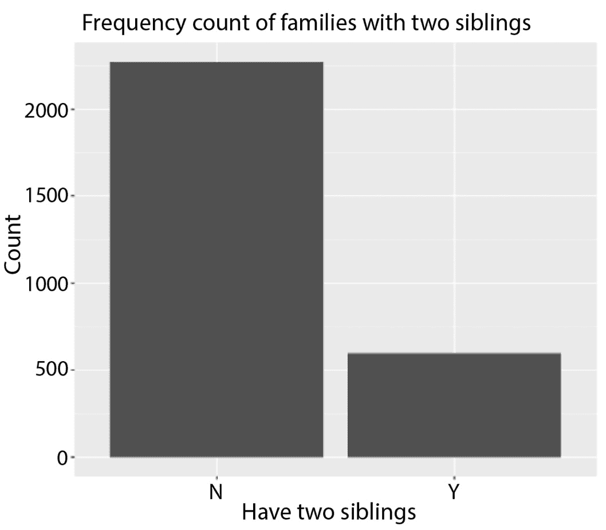

图 11.6 – 可视化有两个双胞胎的家庭的频率计数

1.  计算有两个双胞胎的家庭的样本比例：

    ```py

    p_hat = gss2016 %>%
      summarize(mean(siblings_two_ind=="Y")) %>%
      pull()
    >>> p_hat
    0.208246
    ```

    这里，我们首先使用`siblings_two_ind=="Y"`构建一系列二元结果。取该列的平均值给出`TRUE`值的比率，这在`summarize()`上下文中执行。然后我们使用`pull()`提取样本比例的值。

1.  使用指定-假设-生成-计算程序在零假设下生成一系列自举样本比例，该假设指定总体比例为`0.19`：

    ```py

    null = gss2016 %>%
      specify(response = siblings_two_ind,
              success = "Y") %>%
      hypothesise(null = "point",
                  p = 0.19) %>%
      generate(reps = 500,
               type = "draw") %>%
      calculate(stat = "prop")
    >>> null
    Response: siblings_two_ind (factor)
    Null Hypothesis: point
    # A tibble: 500 × 2
       replicate  stat
       <fct>     <dbl>
     1 1         0.179
     2 2         0.193
     3 3         0.176
     4 4         0.181
     5 5         0.181
     6 6         0.198
     7 7         0.191
     8 8         0.189
     9 9         0.194
    10 10        0.189
    # … with 490 more rows
    # i Use `print(n = ...)` to see more rows
    ```

1.  通过垂直线生成自举样本比例的密度图以及零假设建议的比例：

    ```py

    ggplot(null, aes(x = stat)) +
      geom_density() +
      geom_vline(xintercept = p_hat,
                 color = "red") +
      labs(title = "Density plot using bootstrap", x = "Sample proportion", y = "Density") +
      theme(text = element_text(size = 16))
    ```

    运行代码生成图 11.7，根据零假设，红色线（根据零假设）所示值的观察概率是密度曲线右侧的总面积。然后我们将结果加倍，以考虑相反的方向。

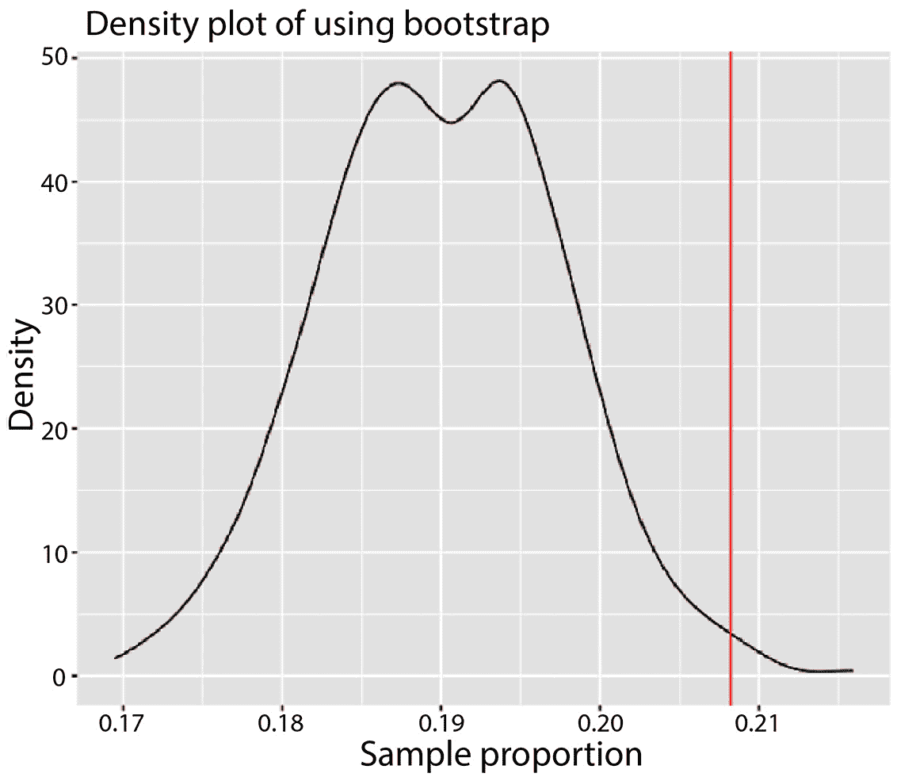

图 11.7 – 可视化假设检验中自举样本比例的密度图

1.  计算 p 值：

    ```py

    >>> null %>%
      summarise(mean(stat > p_hat)) %>%
      pull()* 2
    0.02
    ```

    由于这个结果小于预设的显著性水平 5%，我们有足够的证据支持备择假设并拒绝原假设。换句话说，假设的 19%与真实总体比例在 95%的置信水平下存在统计学上的差异。因此，我们可以得出结论，真实总体比例不是 19%。

下一个部分将探讨两个分类变量之间样本比例差异的推断。

## 样本比例差异的推断

现在的设置是我们有两个分类变量。以性别和学位为例。数据将报告女性和男性的学位持有者的比例。一个自然的问题是要问男性是否比女性更有可能获得学位。特定的数据集将报告这些比例的快照，这可能或可能不会表明学位持有者的百分比更高。假设检验的工具可以用来回答以下问题：如果数据集中男性是学位持有者的更高比例，这种差异在统计上是否显著？换句话说，男性是否比女性更有可能获得学位，反之亦然？本节试图回答这类问题。

对两个分类变量（例如，性别和学位）之间样本比例差异的推断涉及比较两个不同群体中每个级别的样本比例。这种分析通常用于实验或观察性研究，以确定两组之间比例差异的存在性。主要目标是估计群体比例之间的差异，并确定这种差异在统计上是否显著。

假设检验的程序与之前类似。我们首先提出零假设，即假设两个群体的比例之间没有差异，即 p1 = p2，或者 p1 - p2 = 0。备择假设随后表明它们的差异不是零；即 p1 - p2 ≠ 0。接下来，我们选择一个特定的显著性水平，计算样本统计量（样本比例的差异，包括两个分类变量之间的合并比例）和检验统计量（基于假设分布的闭式表达式或使用自助法）。最后，我们获得 p 值并决定在零假设下观察到的结果是否具有统计显著性。

让我们通过之前的例子进行一个具体的练习。

### 练习 11.4 – 对样本比例差异进行假设检验

在这个练习中，我们关注如何对性别和更高学位状态之间的样本比例差异进行假设检验。在这里，我们将更高学位定义为学士学位及以上。男性和女性群体中更高学位持有者的比例可能会不同，我们将测试在观察到的数据下这种差异是否显著：

1.  在之前的 DataFrame `gss2016`中添加一个名为`higher_degree`的二进制列，以指示更高学位的状态，包括学士及以上：

    ```py

    gss2016 = gss2016 %>%
      mutate(higher_degree = if_else(degree %in% c("Bachelor","Graduate"), "Y", "N"))
    ```

1.  打印`gender`和`higher_degree`两个级别的比率：

    ```py

    >>> table(gss2016$higher_degree)
       N    Y
    2008  854
    >>> table(gss2016$sex)
      Male Female
      1274   1588
    ```

1.  将这些计数在柱状图中绘制：

    ```py

    ggplot(gss2016, aes(x = sex, fill=higher_degree)) +
      geom_bar() +
      labs(title = "Frequency count for gender and degree", x = "Gender", y = "Count") +
      theme(text = element_text(size = 16))
    ```

    运行代码生成*图 11.8*。

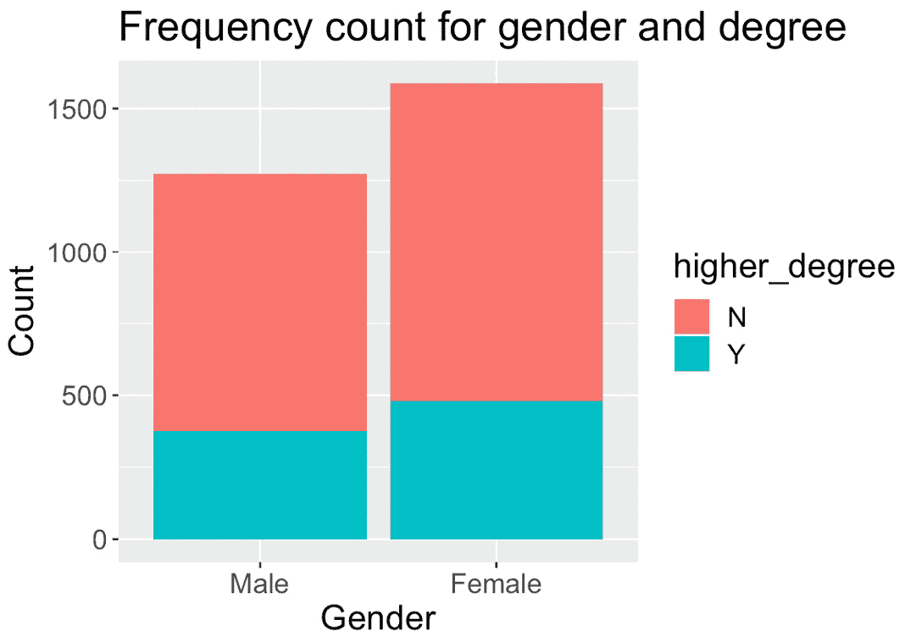

图 11.8 – 可视化性别和更高学位状态的频率计数

我们也可以通过在`geom_bar()`函数中指定`position = "fill"`来按百分比绘制它们：

```py

ggplot(gss2016, aes(x = sex, fill=higher_degree)) +
  geom_bar(position = "fill") +
  labs(title = "Sample proportions for gender and degree", x = "Gender", y = "Ratio") +
  theme(text = element_text(size = 16))
```

运行代码生成*图 11.9*，该图表明男性和女性群体之间更高学位持有者比例没有明显差异。

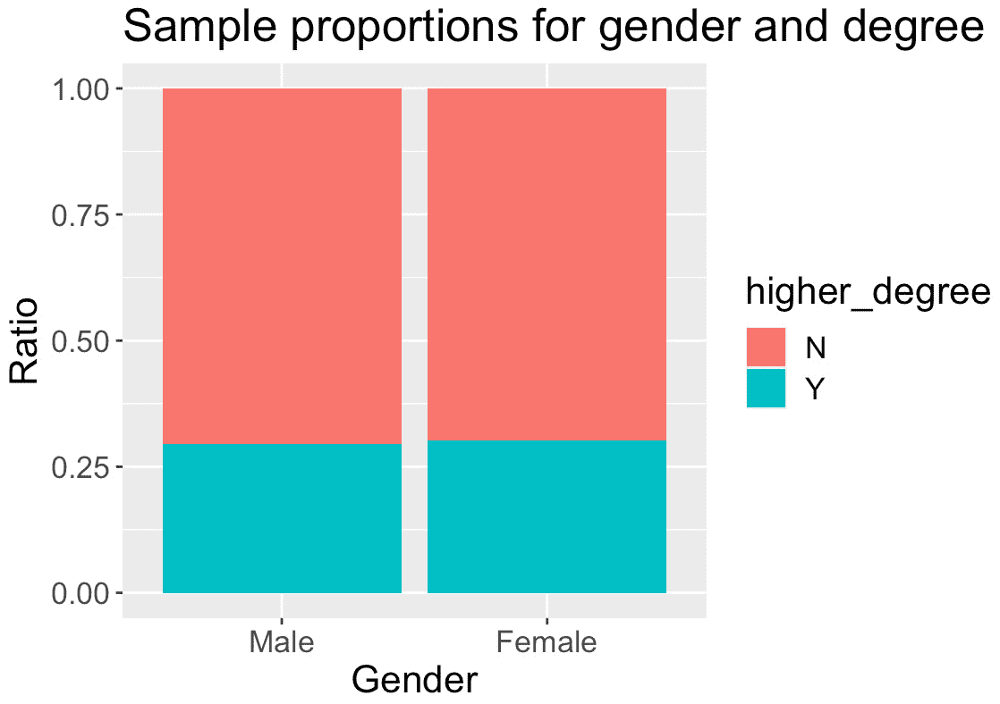

图 11.9 – 可视化性别和更高学位状态的频率计数

1.  计算男性和女性之间更高学位持有者样本比例的差异：

    ```py

    p_hats = gss2016 %>%
      group_by(sex) %>%
      summarise(mean(higher_degree=="Y", na.rm=TRUE)) %>%
      pull()
    d_hat = diff(p_hats)
    >>> d_hat
    0.007288771
    ```

    结果还显示，差异相当小，女性群体比男性群体高 0.7%（参考前一个图中女性群体略高的蓝色条形）。让我们看看这种差异是否具有统计学意义。

1.  在零假设下生成一个自助样本集，该假设表明男性和女性群体之间更高学位持有者比例没有差异：

    ```py

    gss2016 %>%
      specify(
        response = higher_degree,
        explanatory = sex,
        success = "Y"
      ) %>%
      hypothesise(null = "independence") %>%
      generate(reps = 1, type = "permute")
    Response: higher_degree (factor)
    Explanatory: sex (factor)
    Null Hypothesis: independence
    # A tibble: 2,862 × 3
    # Groups:   replicate [1]
       higher_degree sex    replicate
       <fct>         <fct>      <int>
     1 N             Male           1
     2 N             Male           1
     3 Y             Male           1
     4 N             Female         1
     5 N             Female         1
     6 N             Female         1
     7 Y             Male           1
     8 N             Female         1
     9 N             Male           1
    10 N             Male           1
    # … with 2,852 more rows
    # i Use `print(n = ...)` to see more rows
    ```

    在这里，我们将`higher_degree`作为响应变量，将`sex`作为解释变量，在逻辑回归设置中使用（将在*第十三章*中介绍）。在零假设下，我们从原始数据集中随机抽样并创建一个具有相同形状的新的人工数据集。

1.  重复相同的自助抽样过程 500 次，并计算每对自助样本中女性和男性群体之间更高学位持有者样本比例的差异（注意这里的顺序）：

    ```py

    null = gss2016 %>%
      specify(
        higher_degree ~ sex,
        success = "Y"
      ) %>%
      hypothesise(null = "independence") %>%
      generate(reps = 500, type = "permute") %>%
      calculate(stat = "diff in props", order = c("Female", "Male"))
    >>> null
    Response: higher_degree (factor)
    Explanatory: sex (factor)
    Null Hypothesis: independence
    # A tibble: 500 × 2
       replicate     stat
           <int>    <dbl>
     1         1  0.00870
     2         2  0.00587
     3         3 -0.00120
     4         4  0.0228
     5         5  0.00446
     6         6 -0.00827
     7         7 -0.0366
     8         8  0.0129
     9         9  0.0172
    10        10 -0.00261
    # … with 490 more rows
    # i Use `print(n = ...)` to see more rows
    ```

1.  将这些自助样本统计量绘制在密度曲线上，并将观察到的差异作为垂直红色线：

    ```py

    ggplot(null, aes(x = stat)) +
      geom_density() +
      geom_vline(xintercept = d_hat, color = "red") +
      labs(x = "Difference in sample proportion (female - male)", y = "Count") +
      theme(text = element_text(size = 16))
    ```

    运行代码生成*图 11.10*，该图显示红色线并不位于经验分布的极端一侧。这表明接下来要计算的 p 值可能较高。

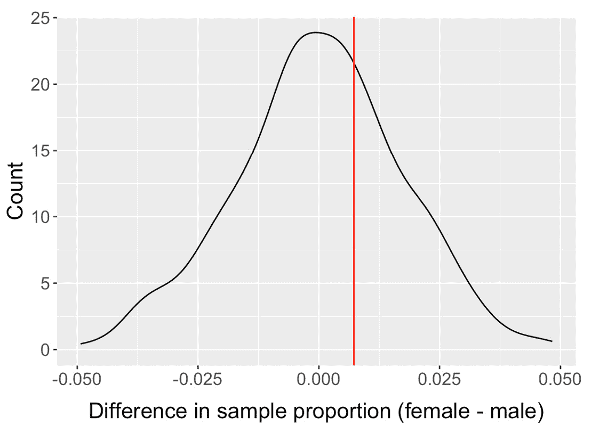

图 11.10 – 显示自助样本统计量和观察到的差异的密度图

1.  计算双尾 p 值：

    ```py

    null %>%
      summarize(pval = 2 * mean(stat > d_hat)) %>%
      pull()
    0.608
    ```

    结果显示一个相当高的 p 值，这表明我们没有足够的证据来拒绝零假设。换句话说，没有足够的信息表明男性和女性之间更高学位持有者的比例不同。

假设检验依赖于一个预定义的显著性水平。这个显著性水平，用α表示，与该过程的统计误差有关。下一节介绍了在执行假设检验时常见的两种统计误差类型。

## 一类错误和二类错误

在进行假设检验并对零假设（H0）和备择假设（H1）做出决策时，存在两种类型的错误。它们被称为第一类错误和第二类错误。

第一类错误指的是假阳性。它发生在零假设为真但错误地被拒绝时。换句话说，我们在样本数据中找到了表明存在显著效应或差异的证据，我们倾向于备择假设，尽管它实际上在总体中并不存在。我们用α表示经历第一类错误的概率。它也被称为显著性水平，在先前的例子中设置为`0.05`。5%的显著性水平意味着当零假设为真时，有 5%的概率拒绝零假设。因此，显著性水平代表犯假阳性错误的概率。

第二类错误专注于假阴性情况。它发生在我们未能拒绝一个错误的零假设时。换句话说，即使在总体中存在，我们在样本数据中也没有找到拒绝零假设的证据。犯第二类错误的概率用β表示，也被称为测试的效力。效力的补数，表示为 1 − β，代表在假设错误时拒绝零假设的概率。

第一类错误涉及错误地拒绝零假设，而第二类错误涉及在假设错误时未能拒绝零假设。在这两种类型的错误都是假设检验中的重要考虑因素，因为它们可能导致错误的结论。为了最大限度地减少这些错误的风险，我们可以谨慎地选择显著性水平（α），并确保他们的研究具有足够的效力（1 − β）。测试的效力取决于样本大小、效应量（这是一个变量之间经验关系的量度）和选择的显著性水平。较大的样本大小和较大的效应量都会增加测试的效力，从而降低第二类错误的可能性。

*图 11.11* 提供了假设检验中不同类型结果的概述。请注意，假阳性和假阴性与决策的质量有关。根据错误决策的类型，我们将错误分类为第一类或第二类错误。

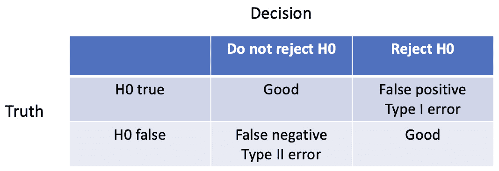

图 11.11 – 假设检验中不同类型结果概述

下一节介绍了卡方检验，该检验用于检验两个分类变量的独立性。

## 检验两个分类变量的独立性

要检查两个分类变量的独立性，涉及检查它们之间是否存在统计上显著的关系。一个常见的程序是独立性卡方检验。它通过比较列联表中的观察频率与独立性假设下的预期频率来工作。

让我们先回顾一下两个分类变量的列联表。

## 介绍列联表

列联表，也称为交叉表或 crosstab，是一种用于显示两个或更多分类变量频率分布的表格。它通过显示变量的类别如何在数据中相交或同时出现来总结变量之间的关系。它提供了分类变量之间关系的良好总结。

让我们继续以性别与学位之间的关系为例。这次，我们将查看所有类型的学位，如下面的代码所示：

```py

>>> table(gss2016$degree)
Lt High School    High School Junior College       Bachelor        Graduate
           328           1459            215            536             318
```

为了表示其与性别的关联，我们可以像之前一样，将学位与性别一起绘制在堆积条形图中：

```py

ggplot(gss2016, aes(x = sex, fill=degree)) +
  geom_bar() +
  labs(title = "Frequency count for gender and degree", x = "Gender", y = "Count") +
  theme(text = element_text(size = 16))
```

运行代码生成图*图 11.12*。

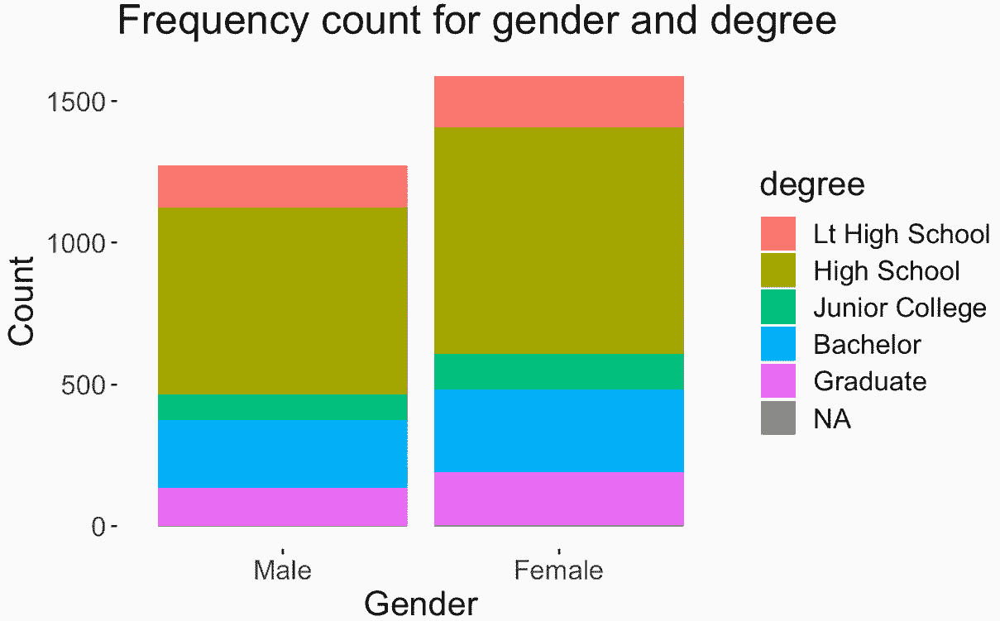

图 11.12 – 在条形图中可视化性别与学位之间的关系

然而，该图没有提供每个类别的确切计数信息。为了获得两个变量每个类别的确切频率，我们可以使用列联表：

```py

tab = gss2016 %>%
  select(sex, degree) %>%
  table()
>>> tab
        degree
sex      Lt High School High School Junior College Bachelor Graduate
  Male              147         661             89      243      132
  Female            181         798            126      293      186
```

在这里，我们使用了`table()`函数在选择了`sex`和`degree`之后生成列联表。

下一节介绍了卡方检验，用于检验这两个分类变量之间的独立性。

## 应用两个分类变量之间的独立性卡方检验

卡方检验是一种统计检验，用于决定一组观察样本中两个分类变量之间可能存在显著关系（依赖性）。它可以用来检验独立性或拟合优度。在本章中，我们主要关注两个分类变量之间的独立性检验。该检验比较列联表中观察到的频率与预期的频率，假设变量是独立的。如果观察到的频率和预期的频率有显著差异，则检验表明变量不是独立的；换句话说，它们相互依赖。

按照之前的相同方法，我们可以生成一个人工的 bootstrap 数据集以获得一个样本统计量，称为卡方统计量。该数据集是在原数据集的形状下，假设在零假设下的独立性进行排列生成的。在下面的代码中，我们生成一个与原数据集形状相同的一个排列数据集，假设在零假设下的独立性：

```py

perm_1 = gss2016 %>%
  # Specify the variables of interest
  specify(degree ~ sex) %>%
  # Set up the null hypothesis
  hypothesize(null = "independence") %>%
  # Generate a single permuted dataset
  generate(reps = 1, type = "permute")
>>> perm_1
Response: degree (factor)
Explanatory: sex (factor)
Null Hypothesis: independence
# A tibble: 2,856 × 3
# Groups:   replicate [1]
   degree         sex    replicate
   <fct>          <fct>      <int>
 1 Junior College Male           1
 2 Bachelor       Male           1
 3 High School    Male           1
 4 High School    Female         1
 5 High School    Female         1
 6 High School    Female         1
 7 Graduate       Male           1
 8 Bachelor       Female         1
 9 High School    Male           1
10 High School    Male           1
# … with 2,846 more rows
# i Use `print(n = ...)` to see more rows
```

接下来，我们创建 500 个排列数据集并提取相应的卡方统计量：

```py

null_spac = gss2016 %>%
  specify(degree ~ sex) %>%
  hypothesize(null = "independence") %>%
  generate(reps = 500, type = "permute") %>%
  calculate(stat = "Chisq")
>>> null_spac
Response: degree (factor)
Explanatory: sex (factor)
Null Hypothesis: independence
# A tibble: 500 × 2
   replicate  stat
       <int> <dbl>
 1         1  3.50
 2         2  1.11
 3         3 14.0
 4         4  4.62
 5         5  1.41
 6         6  1.41
 7         7  9.69
 8         8  4.17
 9         9  5.97
10        10  2.86
# … with 490 more rows
# i Use `print(n = ...)` to see more rows
```

为了运行测试，我们在假设分类变量之间相互独立的情况下，获取列联表中每个单元格的预期频率。单元格的预期频率计算为（*行和* *列和*） */* *总体和*：

```py

# calculate expected frequency table
row_totals = rowSums(tab)
col_totals = colSums(tab)
overall_total = sum(tab)
expected = outer(row_totals, col_totals) / overall_total
>>> expected
       Lt High School High School Junior College Bachelor Graduate
Male          146.084    649.8067        95.7563 238.7227 141.6303
Female        181.916    809.1933       119.2437 297.2773 176.3697
```

在这里，我们首先获取行和列的和以及总和。然后我们使用`outer()`函数获取这两个向量的外积，然后将其按总和缩放以获得每个单元格的预期频率计数。

现在，我们根据可用的样本计算观察到的卡方统计量：

```py

# Compute chi-square statistic
observed_chi_square = sum((tab - expected)² / expected)
>>> observed_chi_square
2.536349
```

我们可以在之前通过自助法得到的样本统计量的密度曲线中绘制观察到的卡方统计量，以了解观察到的统计量所在的位置，据此我们可以计算出相应的 p 值：

```py

ggplot(null_spac, aes(x = stat)) +
  geom_density() +
  geom_vline(xintercept = observed_chi_square, color = "red") +
  labs(title = "Density curve of bootstrapped chi-square statistic", x = "Chi-square statistic", y = "Density") +
  theme(text = element_text(size = 16))
```

运行代码生成了*图 11.13*，它显示了一个较高的 p 值。

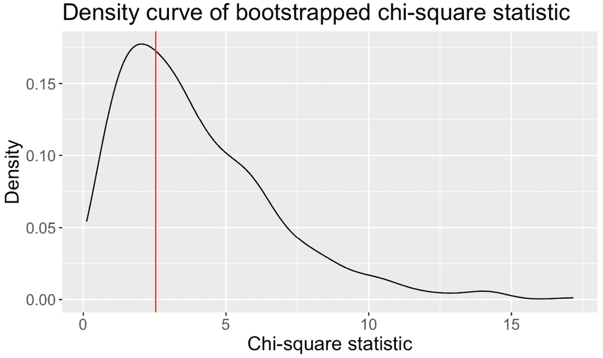

图 11.13 – 可视化自助法卡方统计量的密度曲线和观察到的统计量

现在我们可以计算 p 值。如下面的代码所示，p 值为`0.72`确实相当高，因此没有足够的证据来拒绝零假设：

```py

>>> null_spac %>%
  summarize(pval = 2 * mean(stat < observed_chi_square)) %>%
  pull()
0.72
```

在下一节中，我们将转向观察数值数据的统计推断。

# 数值数据的统计推断

在本节中，我们将转向使用数值数据进行统计推断。我们将介绍两种方法。第一种方法依赖于自助法程序，并排列原始数据集以创建额外的艺术数据集，然后可以使用这些数据集来推导置信区间。第二种方法使用对自助法样本分布的理论假设，并依赖于 t 分布来实现相同的结果。我们将学习如何进行 t 检验、推导置信区间以及进行**方差分析**（**ANOVA**）。

如前所述，自助法是一种非参数重采样方法，它允许我们估计特定统计量的抽样分布，例如均值、中位数或比例，就像上一节中那样。这是通过从原始数据中反复有放回地抽取随机样本来实现的。通过这样做，我们可以计算置信区间并执行假设检验，而不依赖于特定的分布假设。

此外，t 分布是一种概率分布，用于在样本量小且总体数据的标准差未知的情况下进行假设检验。它是一种更通用的方法，假设通过自助法得到的样本遵循特定的分布。然后我们将使用这个分布来估计置信区间并执行假设检验。

t 检验是一种广泛使用的统计检验方法，它允许我们比较两组数据的平均值，或者检验单个组数据的平均值是否等于一个特定的值。这次，我们的兴趣在于组数据的平均值，因为变量是数值型的。该检验依赖于 t 分布，并考虑样本大小、样本平均值和样本方差。

置信区间提供了一组可能的值，其中真实的总体统计量（如均值或比例）很可能位于，并且具有指定的置信水平（由显著性水平α指定）。

最后，ANOVA 在比较多于两组时扩展了 t 检验的应用。ANOVA 帮助我们通过将观察数据的总变异性分为两部分：组间变异性与组内变异性，来确定组均值之间可能存在的显著差异。它检验了所有组均值相等的零假设。如果零假设被拒绝，我们可以继续识别哪些特定的组均值彼此不同。

让我们从生成中位数自助分布开始。

## 生成中位数自助分布

如前所述，当构建单个统计量的自助分布时，我们首先通过有放回抽样生成一系列自助样本，然后记录每个分布的相关统计量（在本例中为中位数）。

让我们通过一个练习来构建自助样本集合。

### 练习 11.5 – 生成样本中位数的自助分布

在这个练习中，我们将使用`infer`包应用相同的指定-生成-计算工作流程，使用`mtcars`数据集生成样本中位数的自助分布。

加载`mtcars`数据集并查看其结构：

```py

data(mtcars)
>>> str(mtcars)
'data.frame':  32 obs. of  11 variables:
 $ mpg : num  21 21 22.8 21.4 18.7 18.1 14.3 24.4 22.8 19.2 ...
 $ cyl : num  6 6 4 6 8 6 8 4 4 6 ...
 $ disp: num  160 160 108 258 360 ...
 $ hp  : num  110 110 93 110 175 105 245 62 95 123 ...
 $ drat: num  3.9 3.9 3.85 3.08 3.15 2.76 3.21 3.69 3.92 3.92 ...
 $ wt  : num  2.62 2.88 2.32 3.21 3.44 ...
 $ qsec: num  16.5 17 18.6 19.4 17 ...
 $ vs  : num  0 0 1 1 0 1 0 1 1 1 ...
 $ am  : num  1 1 1 0 0 0 0 0 0 0 ...
 $ gear: num  4 4 4 3 3 3 3 4 4 4 ...
 $ carb: num  4 4 1 1 2 1 4 2 2 4 ...
```

结果显示，我们有一个包含 32 行和 11 列的数据集。在接下来的步骤中，我们将使用`mpg`变量并生成其中位数的自助分布：

1.  根据变量`mpg`生成 10,000 个自助样本并获取所有样本的中位数：

    ```py

    bs <- mtcars %>%
      specify(response = mpg) %>%
      generate(reps = 10000, type = "bootstrap") %>%
      calculate(stat = "median")
    >>> bs
    Response: mpg (numeric)
    # A tibble: 10,000 × 2
       replicate  stat
           <int> <dbl>
     1         1  21.4
     2         2  22.2
     3         3  20.4
     4         4  17.8
     5         5  19.2
     6         6  19.2
     7         7  18.4
     8         8  20.4
     9         9  19.0
    10        10  21.4
    # … with 9,990 more rows
    # i Use `print(n = ...)` to see more rows
    ```

在这里，我们在`calculate()`函数中指定`stat = "median"`以从每个自助样本中提取中位数。

2. 将自助分布作为自助样本统计量的密度曲线进行绘图：

```py

ggplot(bs, aes(x = stat)) +
  geom_density() +
  labs(title = "Density plot for bootstrapped median", x = "Median", y = "Probability") +
  theme(text = element_text(size = 16))
```

运行代码生成**图 11.14**.14 的图表。

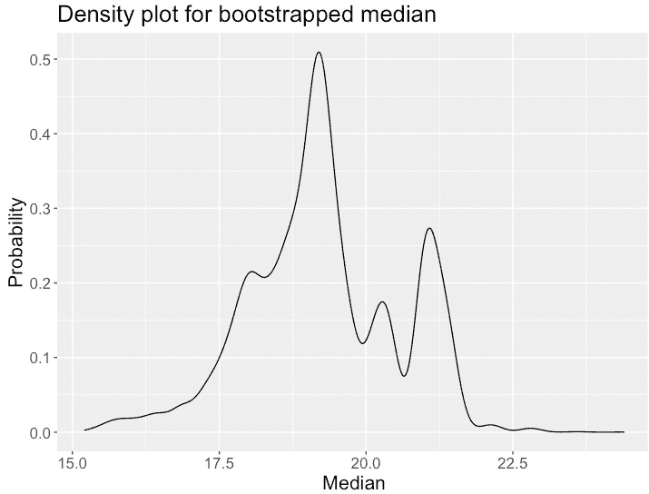

图 11.14 – 可视化自助法样本中位数的密度曲线

下一节将探讨构建自举置信区间。

# 构建自举置信区间

我们已经探讨了如何使用标准误差方法构建自举置信区间。这涉及到从观察到的样本统计量中添加和减去缩放后的标准误差。结果发现，还有一种更简单的方法，它仅使用自举分布的百分位数来获得置信区间。

让我们继续之前的例子。假设我们想要计算之前自举分布的 95%置信区间。我们可以通过计算自举分布的上限和下限分位数（分别为 97.5%和 2.5%）来实现这一点。下面的代码实现了这一点：

```py

>>> bs %>%
  summarize(
    l = quantile(stat, 0.025),
    u = quantile(stat, 0.975)
  )
# A tibble: 1 × 2
      l     u
  <dbl> <dbl>
1  16.6  21.4
```

让我们也使用标准误差方法计算自举置信区间，如下面的代码所示：

```py

SE = bs %>%
  summarise(sd(stat)) %>%
  pull()
observed_median = median(mtcars$mpg)
>>> c(observed_median - 2*SE, observed_median + 2*SE)
16.64783 21.75217
```

如预期的那样，结果是使用百分位数方法获得的结果相近。然而，标准误差方法比百分位数方法更准确。

下一节将介绍在测试零假设后重新中心化自举分布。

## 重新中心化自举分布

之前章节中的自举分布是通过随机有放回抽样原始数据集生成的。每一组自举样本保持与原始样本集相同的大小。然而，我们无法直接使用这个自举分布进行假设检验。

在引入零假设后，我们在之前的假设检验部分为两个分类变量所做的是在零假设下重新生成一个新的自举分布。然后我们将观察到的样本统计量作为一条垂直的红线沿着自举分布放置，以计算 p 值，表示至少与观察到的样本统计量一样极端的现象发生的概率。唯一的额外步骤是生成零假设下的自举分布。

在零假设下生成自举样本时，主要思想是消除我们正在测试的效果并创建样本，假设零假设为真。换句话说，我们创建的样本应该是如果没有组间差异时预期的样本。例如，当比较两组之间的均值时，我们会在进行随机有放回抽样之前，从每个观察值中减去总体均值，以将数据中心在 0 周围。

有另一种实现方式。回想一下，原始的自助分布，按照设计，是围绕观察到的样本统计量中心化的。在引入零假设后，我们可以简单地移动原始自助分布，使其围绕零假设中的统计量中心化，即零值。这个移动后的自助分布代表了如果我们从原始数据集中移除效应并再次进行自助抽样，我们将得到的相同分布。然后我们可以将观察到的样本统计量放置在移动后的自助分布上，以计算相应的 p 值，这代表了生成至少与实际样本统计量一样有利的样本统计量的模拟比例。*图 11.15* 展示了这一过程。

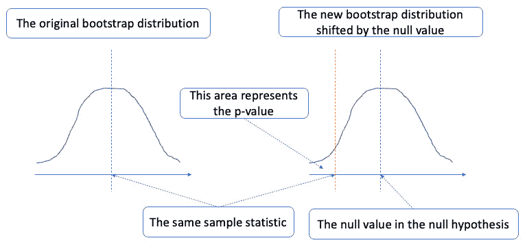

图 11.15 – 将自助分布移至围绕零值中心化

让我们为前一个示例生成假设检验的自助分布。我们想要测试`mpg`变量的总体中位数为 16 的零假设。以下代码生成了自助样本统计量，我们在`hypothesize()`函数中通过`med = 16`指定零值，并通过`null = "point"`指定点估计：

```py

bs = mtcars %>%
  specify(response = mpg) %>%
  hypothesize(null = "point", med = 16) %>%
  generate(reps = 10000, type = "bootstrap") %>%
  calculate(stat = "median")
>>> bs
Response: mpg (numeric)
Null Hypothesis: point
# A tibble: 10,000 × 2
   replicate  stat
       <int> <dbl>
 1         1  16
 2         2  16.2
 3         3  18
 4         4  16.2
 5         5  16
 6         6  16.2
 7         7  16
 8         8  16
 9         9  17.8
10        10  16
# … with 9,990 more rows
# i Use `print(n = ...)` to see more rows
```

现在，我们在密度图中绘制这些自助样本统计量，同时将观察到的样本统计量作为垂直红色线：

```py

ggplot(bs, aes(x = stat)) +
  geom_density() +
  geom_vline(xintercept = median(mtcars$mpg), color = "red") +
  labs(title = "Density curve of bootstrapped median", x = "Sample median", y = "Density") +
  theme(text = element_text(size = 16))
```

运行代码生成了*图 11.16*中的图，它显示了一个较小的 p 值。

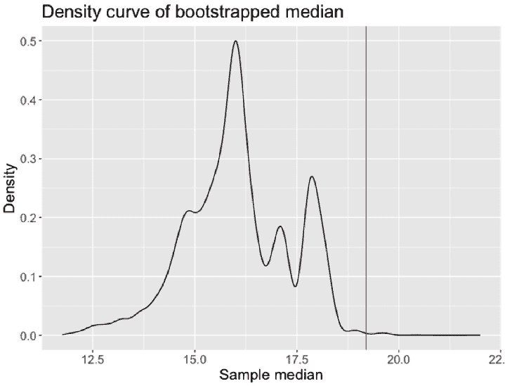

图 11.16 – 自助样本中位数和观察样本中位数的密度图（垂直红色线）

在下一节中，我们将介绍基于**中心极限定理**（**CLT**）的另一种基于分布的推断方法。

# 介绍在 t 分布中使用的中心极限定理

CLT（中心极限定理）指出，许多独立同分布的随机变量的和（或平均值）的分布将共同形成一个正态分布，无论这些个别变量的潜在分布如何。由于 CLT，正态分布常被用来近似各种统计量的抽样分布，例如样本均值和样本比例。

在统计推断的背景下，t 分布与中心极限定理（CLT）相关。当我们从样本中估计总体均值时，我们通常无法访问总体的真实标准差。相反，我们求助于样本标准差作为估计。在这种情况下，样本均值的抽样分布不遵循正态分布，而是 t 分布。换句话说，当我们从一组观察到的样本中提取样本均值，并且我们不确定总体标准差（在实际数据工作中这种情况很常见），样本均值可以建模为 t 分布的一个实现。

t 分布是一族连续概率分布，它们是对称的、钟形的，这显示了与正态分布的相似性。然而，t 分布的尾部更厚，这解释了由于从观察数据中估计总体标准差而产生的更大不确定性。也就是说，t 分布的观测值更有可能落入远离均值的尾部（例如，远离均值的两个标准差之外），而正态分布则不然。t 分布的形状依赖于**自由度**（**df**），这取决于样本大小并决定了尾部的厚度。随着收集到更多样本，df 增加，t 分布逐渐逼近正态分布。

在上一章中，我们简要介绍了用于在 t 分布下找到截断值的`qt()`函数。现在让我们通过一个练习来更熟悉与 t 分布相关的计算。

### 练习 11.6 – 理解 t 分布

在这个练习中，我们将使用`pt()`函数来找到 t 分布下的概率。对于给定的截断分位数值`q`和给定的`df`，`pt(q, df)`函数给出了`t`小于`q`的 t 分布下`df`的概率。换句话说，我们有 P(t df < T) = `pt(q = T, df)`。我们还可以使用`qt()`函数来找到 t 分布下特定概率的分位数。也就是说，如果 P(t df < T) = p，那么 T = `qt(p, df)`：

1.  找到在 t 分布下，自由度为 10 且低于`T=3`的概率：

    ```py

    x = pt(3, df = 10)
    >>> x
    0.9933282
    ```

1.  找到在 t 分布下，自由度为 10 且`T=3`以上的概率：

    ```py

    y = 1 - x
    >>> y
    0.006671828
    ```

    注意，我们首先计算在 t 分布下低于特定截断值的概率，然后取补数以找到高于阈值的概率。

1.  找到在 t 分布下，自由度为`100`且`T=3`以上的概率：

    ```py

    z = 1 - pt(3, df = 100)
    >>> z
    0.001703958
    ```

    由于`df=100`比`df=10`更接近正态分布，因此得到的概率`z`因此比`y`小。

1.  找到具有 10 个自由度的 t 分布的 95 百分位数：

    ```py

    d = qt(0.95, df = 10)
    >>> d
    1.812461
    ```

1.  找到界定中间 95 百分位数上限的 t 分布的截断值，该分布具有`10`个自由度：

    ```py

    e = qt(0.975, df = 10)
    >>> e
    2.228139
    ```

    这里，中间 95 百分位数的上限指的是 97.5 百分位数。

1.  找到用`100`自由度（df）界定 t 分布中间 95%百分位上限的截断值：

    ```py

    f = qt(0.975, df = 100)
    >>> f
    1.983972
    ```

下一节将讨论如何使用 t 分布来构建总体均值的置信区间。

# 构建使用 t 分布的总体均值置信区间

让我们回顾一下对总体均值进行统计推断的过程。我们从一个有限的样本开始，从这个样本中我们可以推导出样本均值。由于我们想要估计总体均值，我们希望基于观察到的样本均值进行统计推断，并量化总体统计量可能存在的范围。

例如，以下代码中显示的平均每加仑英里数，在`mtcars`数据集中大约是 20。

```py

>>> mean(mtcars$mpg)
20.09062
```

给出这个结果，我们不会对遇到另一个具有平均`mpg`为 19 或 21 的类似数据集感到惊讶。然而，如果值是 5、50，甚至 100，我们就会感到惊讶。在评估新的样本集合时，我们需要一种方法来量化样本均值在多个样本中的变异性。我们已经学习了两种方法来做这件事：使用自助法来模拟人工样本或使用中心极限定理来近似这种变异性。在本节中，我们将重点关注中心极限定理方法。

根据中心极限定理，任何抽样分布的样本均值将大致呈正态分布，无论原始分布如何。换句话说，我们有以下情况：

_ x  ∼ N(mean = μ, SE =  σ _ √ _ n  )

注意，这是一个我们无法获得的理论分布。例如，总体标准差σ保持未知，我们只能获得观察到的样本。相反，我们将使用样本标准差 s 来估计标准误差，如下所示：

_ x  ∼ N(mean = μ, SE =  s _ √ _ n  )

然后，我们将使用 n - 1 个自由度的 t 分布来进行对总体均值的推断，因为它由于 s 引入的额外不确定性而具有更厚的尾部。

此外，请注意，使用中心极限定理（CLT）的近似依赖于几个假设。例如，样本之间需要相互独立。当样本是随机选择的时候，或者如果样本在无替换的情况下选取且占总人口的不到 10%，这通常可以得到满足。样本大小也需要更大，以便考虑样本中可能存在的偏度。

我们可以使用`t.test()`函数来构建 95%置信区间，如下所示：

```py

# Construct 95% CI for avg mpg
>>> t.test(mtcars$mpg)
  One Sample t-test
data:  mtcars$mpg
t = 18.857, df = 31, p-value < 2.2e-16
alternative hypothesis: true mean is not equal to 0
95 percent confidence interval:
 17.91768 22.26357
sample estimates:
mean of x
 20.09062
```

在这里，我们正在进行单样本 t 检验，其中默认的零假设是总体均值为 0。结果显示一个非常小的 p 值，这表明我们可以拒绝零假设，支持备择假设；也就是说，总体均值不是 0。95%置信区间（在`17.91768`和`22.26357`之间）也是基于具有`31`个 df 和`t 统计量`为`18.857`的 t 分布构建的。

下一节回顾了使用自举模拟和 t 检验近似进行两个均值假设检验的过程。

# 对两个均值进行假设检验

在本节中，我们将探讨使用假设检验比较两个样本均值的过程。在比较两个样本均值时，我们想要确定两个不同总体或组之间是否存在显著的差异。

假设现在我们有两个样本组。这两组样本可以代表每个样本在处理前后的特定值。因此，我们的目标是比较这两组样本的样本统计量，例如样本均值，并确定治疗是否有影响。为此，我们可以通过自举模拟或 t 检验近似来执行假设检验，以比较两个独立分布的均值。

在假设检验中使用 t 检验比较两个独立样本的均值时，双样本 t 检验假设数据呈正态分布，并且两个总体的方差相等。然而，在这些假设可能不成立的情况下，可以采用替代的非参数检验或重采样方法，如自举，来对总体均值进行推断。

让我们通过一个练习来看看这两种假设检验方法是如何应用的。

### 练习 11.7 – 比较两个均值

在这个练习中，我们将探索两种方法（t 检验和自举）来比较两个样本均值并计算样本均值差异的置信区间：

1.  生成一个由两组样本组成的虚拟数据集：

    ```py

    # Define two samples
    sample1 = c(10, 12, 14, 16, 18)
    sample2 = c(15, 17, 19, 21, 23)
    # Combine samples into a data frame
    data = tibble(
      value = c(sample1, sample2),
      group = factor(rep(c("Group 1", "Group 2"), each = length(sample1)))
    )
    >>> data
    # A tibble: 10 × 2
       value group
       <dbl> <fct>
     1    10 Group 1
     2    12 Group 1
     3    14 Group 1
     4    16 Group 1
     5    18 Group 1
     6    15 Group 2
     7    17 Group 2
     8    19 Group 2
     9    21 Group 2
    10    23 Group 2
    ```

    在这里，我们创建了一个`tibble`数据框，其中`value`列表示样本观测值，`group`列表示组号。我们希望评估这两组样本之间样本均值的差异。

1.  进行 1000 次自举抽样，并在以下假设下计算自举统计量：这两个组相互独立，它们的均值没有差异：

    ```py

    bootstrap_results = data %>%
      specify(response = value, explanatory = group) %>%
      hypothesize(null = "independence") %>%
      generate(reps = 1000, type = "bootstrap") %>%
      calculate(stat = "diff in means", order = c("Group 1", "Group 2"))
    >>> bootstrap_results
    Response: value (numeric)
    Explanatory: group (factor)
    Null Hypothesis: independence
    # A tibble: 1,000 × 2
       replicate  stat
           <int> <dbl>
     1         1 -7.5
     2         2 -6.17
     3         3 -5
     4         4 -2.20
     5         5 -8.05
     6         6 -4.2
     7         7 -3.5
     8         8 -6.67
     9         9 -4.2
    10        10 -6.90
    # … with 990 more rows
    # i Use `print(n = ...)` to see more rows
    ```

    在这里，假设检验的管道首先通过指定响应变量（`value`）和解释变量（`group`），设置零假设，在零假设下生成自举样本，然后计算每个自举样本的检验统计量（在这种情况下，是均值差异）。零假设表明我们假设两组的样本均值值来自同一总体，并且任何观察到的差异仅仅是偶然的。

1.  根据自举统计量计算置信区间：

    ```py

    ci = bootstrap_results %>%
      filter(!is.na(stat)) %>%
      get_confidence_interval(level = 0.95, type = "percentile")
    >>> ci
    # A tibble: 1 × 2
      lower_ci upper_ci
         <dbl>    <dbl>
    1       -9    -1.17
    ```

1.  使用`t.test()`函数进行双样本 t 检验：

    ```py

    t_test_result = t.test(sample1, sample2)
    >>> t_test_result
       Welch Two Sample t-test
    data:  sample1 and sample2
    t = -2.5, df = 8, p-value = 0.03694
    alternative hypothesis: true difference in means is not equal to 0
    95 percent confidence interval:
     -9.6120083 -0.3879917
    sample estimates:
    mean of x mean of y
           14        19
    ```

    结果显示，基于 t 分布的 95%置信区间接近但仍然与通过自举抽样获得的结果不同。我们还可以通过传递模型形式来进行 t 检验：

    ```py
    t_test_result2 = t.test(value ~ group, data = data)
    >>> t_test_result2
        Welch Two Sample t-test
    data:  value by group
    t = -2.5, df = 8, p-value = 0.03694
    alternative hypothesis: true difference in means between group Group 1 and group Group 2 is not equal to 0
    95 percent confidence interval:
     -9.6120083 -0.3879917
    sample estimates:
    mean in group Group 1 mean in group Group 2
                       14                    19
    ```

下一节介绍了方差分析（ANOVA）。

# 介绍方差分析（ANOVA）

**ANOVA**是一种用于比较两个以上组均值的统计假设检验方法，它扩展了上一节讨论的双样本 t 检验。ANOVA 的目标是在考虑每个组内的变异性（组内变异性）的同时，测试组均值之间是否存在潜在的显著差异（组间变异性）。

ANOVA 在假设检验中依赖于 F 统计量。F 统计量是两个方差估计值的比率：组间方差和组内方差。组间方差衡量组均值之间的差异，而组内方差表示每个组内的变异性。F 统计量可以根据这两个组方差计算得出。

在假设检验中，方差分析（ANOVA）的零假设指出所有组均值相等，任何观察到的差异都是由于偶然性造成的。另一方面，备择假设则表明至少有一个组的均值与其他组不同。如果 F 统计量足够大，组间方差显著大于组内方差，这为反对零假设提供了证据。

让我们来看一个具体的例子。我们首先加载`PlantGrowth`数据集，该数据集包含植物经过三种不同处理后重量：

```py

data(PlantGrowth)
>>> str(PlantGrowth)
'data.frame':   30 obs. of  2 variables:
 $ weight: num  4.17 5.58 5.18 6.11 4.5 4.61 5.17 4.53 5.33 5.14 ...
 $ group : Factor w/ 3 levels "ctrl","trt1",..: 1 1 1 1 1 1 1 1 1 1 ...
```

接下来，我们使用相同的指定-假设-生成-计算程序执行单因素 ANOVA 测试。具体来说，我们首先指定响应变量（`重量`）和解释变量（`组别`）。然后，我们使用`hypothesize(null = "独立性")`建立零假设，即各组均值没有差异。接下来，我们使用`generate(reps = 1000, type = "permute")`生成 1,000 个排列数据集。最后，我们使用`calculate(stat = "F")`计算每个排列数据集的 F 统计量：

```py

anova_results = PlantGrowth %>%
  specify(response = weight, explanatory = group) %>%
  hypothesize(null = "independence") %>%
  generate(reps = 1000, type = "permute") %>%
  calculate(stat = "F")
>>> anova_results
Response: weight (numeric)
Explanatory: group (factor)
Null Hypothesis: independence
# A tibble: 1,000 × 2
   replicate  stat
       <int> <dbl>
 1         1 0.162
 2         2 0.198
 3         3 1.18
 4         4 0.328
 5         5 1.21
 6         6 3.00
 7         7 1.93
 8         8 0.605
 9         9 0.446
10        10 1.10
# … with 990 more rows
# i Use `print(n = ...)` to see more rows
```

最后，我们可以使用观察到的 F 统计量和从排列数据集中获得的 F 统计量分布来计算 p 值。当 p 值小于预设的显著性水平（例如，`0.05`）时，我们可以拒绝零假设，并说各组均值之间存在显著差异：

```py

p_value = anova_results %>%
  get_p_value(obs_stat = anova_results, direction = "right") %>%
  pull()
>>> p_value
0.376
```

结果表明，我们没有足够的信心拒绝零假设。

# 摘要

在本章中，我们介绍了用于假设检验的不同类型的统计推断，针对数值数据和分类数据。我们介绍了单变量、双变量和多变量的推断方法，使用比例（用于分类变量）或均值（用于数值变量）作为样本统计量。假设检验程序，包括基于模型近似的方法和基于自助法模拟的非参数方法，提供了如置信区间和 p 值等有价值的工具。这些工具使我们能够做出决定，是否可以拒绝原假设而接受备择假设。这样的决定也与第一类和第二类错误相关。

在下一章中，我们将介绍最广泛使用的统计和机器学习模型之一：线性回归。
