# 13

# R 中的逻辑回归

本章将介绍逻辑回归，包括其理论结构、与线性回归的联系以及实际应用。由于它是一个在解释性重要的领域（如信用风险建模）中广泛使用的分类模型，我们将关注其在不同情境下的建模过程，以及添加正则化到损失函数和预测多于两个类别的扩展。

到本章结束时，你将理解逻辑回归模型的基本原理及其与线性回归的比较，包括扩展概念，如`sigmoid`函数、优势比和**交叉熵损失**（**CEL**）。你还将掌握在分类设置中常用的评估指标，以及处理不平衡数据集和目标变量中多个类别的改进方法。

本章将涵盖以下内容：

+   介绍逻辑回归

+   比较逻辑回归与线性回归

+   更多关于对数优势比和优势比的内容

+   介绍交叉熵损失

+   评估逻辑回归模型

+   处理不平衡数据集

+   惩罚逻辑回归

+   扩展到多类分类

# 技术要求

要运行本章中的代码，你需要以下软件包的最新版本：

+   `caret` – 6.0.94

+   `tibble` – 3.2.1

+   `dplyr` – 1.0.10

+   `pROC` – 1.18.2

+   `nnet` – 7.3.18

+   `glmnet` – 4.1.7

上述提到的版本以及前述列表中的软件包都是我在写这本书时的最新版本。

本章的所有代码和数据均可在[`github.com/PacktPublishing/The-Statistics-and-Machine-Learning-with-R-Workshop/blob/main/Chapter_13/working.R`](https://github.com/PacktPublishing/The-Statistics-and-Machine-Learning-with-R-Workshop/blob/main/Chapter_13/working.R)找到。

# 介绍逻辑回归

逻辑回归是一种二元分类模型。它仍然是一个线性模型，但现在输出被限制为二元变量，取值为`0`或`1`，而不是像线性回归那样模拟连续结果。换句话说，我们将观察和模拟结果 y = 1 或 y = 0。例如，在信用风险建模的情况下，y = 0 表示非违约贷款申请，而 y = 1 表示违约贷款。

然而，逻辑回归模型不是直接预测二元结果，而是预测 y 取特定值的概率，例如 P(y = 1)。假设其他类别的概率 P(y = 0) = 1 − P(y = 1)，因为总概率应该始终加起来为`1`。最终的预测将是两个中的胜者，如果 P(y = 1) > P(y = 0)，则取值为`1`，否则为`0`。在信用风险示例中，P(y = 1)将被解释为贷款违约的概率。

在逻辑回归中，术语 *logistic* 与 *logit* 有关，它指的是对数几率。几率是描述概率的另一种方式；不是指定个体 P(y = 1) 和 P(y = 0)，而是指 P(y = 1) 与 P(y = 0) 的比率。因此，对数几率是通过 logP(y = 1) - P(y = 0) 计算的。因此，我们可以简单地使用术语 *odds* 来描述事件发生的概率（y = 1）与事件不发生的概率（y = 0）之间的比率。

首先，让我们看看逻辑回归模型如何将连续输出（如线性回归中的情况）转换为概率分数，这是一个介于 `0` 和 `1` 之间的数字。

## 理解 sigmoid 函数

`sigmoid` 函数是关键成分，它将任何连续数字（从负无穷大到正无穷大）映射到概率。也称为逻辑函数，`sigmoid` 函数的特点是 S 形曲线，它将任何实数作为输入，并将其映射到 `0` 和 `1` 之间的分数，这恰好是有效概率分数的范围。

标准的 `sigmoid` 函数具有以下形式：

f(x) = 1 / (1 + e^(-x))

注意，这是一个非线性函数。也就是说，当通过这个函数进行转换时，输入值将得到不成比例的缩放。它也是一个连续函数（因此可导）和单调函数（f(x) 将随着 x 的增加而增加），因此作为二分类任务中典型神经网络模型最后一层的激活函数，它享有很高的流行度。

让我们尝试可视化这个函数。在下面的代码片段中，我们使用 `seq(-10, 10, by = 0.1)` 创建一个从 -10 到 10 的等间距数字序列，步长为 `0.1`。对于每个数字，我们使用 `sigmoid` 函数计算相应的输出。在这里，我们直接传递函数的所有数字，然后以并行模式（称为向量化）计算所有输出。在这里，向量化是指同时将一个操作应用于整个向量，而不是像 `for` 循环那样逐个元素循环。最后，我们绘制函数以显示 `sigmoid` 函数的特征 S 形曲线，并使用 `grid()` 函数添加网格线：

```py

# Create a range of equally spaced numbers between -10 and 10
x = seq(-10, 10, by = 0.1)
# Calculate the output value for each number using sigmoid function
sigmoid = 1 / (1 + exp(-x))
# Plot the sigmoid function
plot(x, sigmoid, type = "l", lwd = 2,
     main = "Sigmoid Function",
     xlab = "x",
     ylab = "f(x)",
     col = "red")
# Add grid lines
grid()
```

运行前面的代码生成了 *图 13*.1 中所示的输出。该图显示了整个域内不同级别的陡峭程度，其中函数在中间区域更敏感，在两个极端处变得更加饱和。

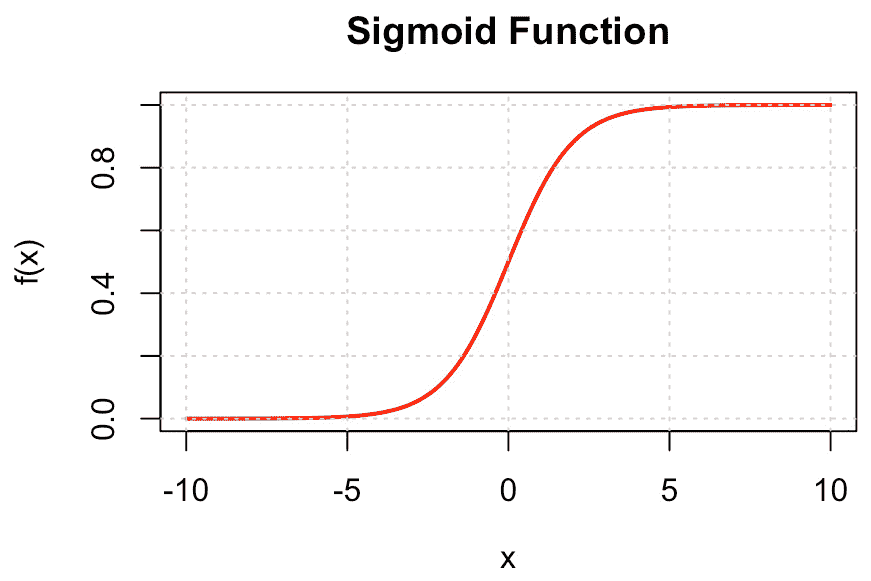

图 13.1 – sigmoid 函数的可视化

现在我们已经理解了 `sigmoid` 函数，让我们看看逻辑回归模型的数学结构。

## 理解逻辑回归模型

逻辑回归模型本质上是一种线性回归模型，它被推广到依赖结果变量为二元的设置中。换句话说，它是一个线性回归模型，用于建模事件发生概率的对数几率。

为了理解这一点，让我们首先回顾以下线性回归模型，其中我们使用总共 p 个特征来建模目标输出变量 z：

z = β0 + β1 x1 + β2 x2 + … + βp xp

在这里，z 被解释为事件 y = 1 的对数几率，或 logit。我们感兴趣的是从 β0 到 βp 的参数估计。

现在，我们知道 z 变量是无界的，这意味着它可以从负无穷大到正无穷大变化。我们需要一种方法来限制这个输出并将其转换为介于 0 和 1 之间的概率分数。这是通过使用 `sigmoid` 函数的额外转换来实现的，它恰好满足我们的所有需求。从数学上讲，我们有以下公式：

P(y = 1) = 1 / (1 + e^(-z))

将 z 的定义代入，给出完整的逻辑回归模型：

P(y = 1) = 1 / (1 + e^(-β0 - β1x1 - β2x2 - … - βpxp))

在这里，P(y = 1) 指的是 y = 1 成功的概率（这是一个一般性陈述），相应地，P(y = 0) 表示失败的概率。

注意，我们可以等效地将模型表达如下：

log P(y = 1) / P(y = 0) = β0 + β1 x1 + β2 x2 + … + βp xp

在这里，术语 log P(y = 1) / P(y = 0) 表示对数几率。

这里一个关键的变化是引入了 `sigmoid` 函数。这使得预测变量与结果概率之间的关系不再是线性的，而是 sigmoid 形式的。为了观察这里的微妙之处，我们可以查看 `sigmoid` 函数在整个定义域中的不同区域。例如，当查看 0 附近的区域时，输入的微小变化会导致结果概率输出的相对较大变化。然而，当输入位于函数的两个极端一侧时，同样的输入变化将导致输出非常小的变化。此外，随着输入变得更加极端，无论是向负方向还是正方向，结果概率将逐渐接近 0 或 1。*图 13.2* 总结了逻辑回归模型的特点。

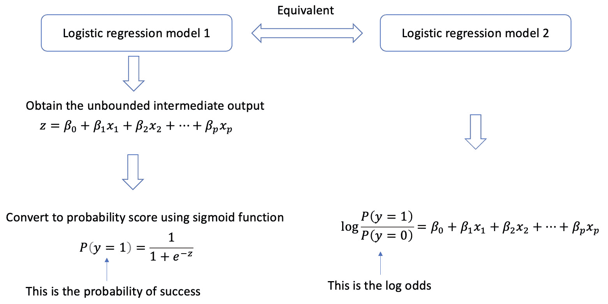

图 13.2 – 总结逻辑回归模型

注意，逻辑回归模型与线性回归模型具有相似的假设。具体来说，它假设观测值之间相互独立，并且目标结果遵循参数为 p 的伯努利分布，即 y ∼ Bernoulli(p)。鉴于这一点，我们并不假设输出变量和输入预测之间存在线性回归；相反，我们使用逻辑链接函数来转换并引入非线性到输入变量中。

以下部分进一步比较逻辑回归与线性回归。

# 比较逻辑回归与线性回归

在本节中，我们将专注于使用*German Credit*数据集的二进制信用分类任务，该数据集包含 1,000 个观测值和 20 列。每个观测值表示一位客户，该客户曾向银行申请贷款，并按信用风险被标记为好或坏。该数据集在 R 的`caret`包中可用。

对于我们的研究，我们将尝试根据`Duration`预测目标二元变量`Class`，并比较线性回归和逻辑回归在预测结果上的差异。我们特意选择一个预测变量，以便在二维图中可视化和比较结果模型的决策边界。

### 练习 13.1 – 比较线性回归与逻辑回归

在这个练习中，我们将展示使用逻辑回归模型产生概率输出的优势，与使用线性回归模型产生的无界输出相比：

1.  从`caret`包中加载*German Credit*数据集。将目标变量（`Class`）转换为数值：

    ```py

    # install the caret package if you haven't done so
    install.packages("caret")
    # load the caret package
    library(caret)
    # load the German Credit dataset
    data(GermanCredit)
    GermanCredit$Class_num = ifelse(GermanCredit$Class == "Bad", 1, 0)
    ```

    在这里，我们创建一个新的目标变量`Class_num`，将原始的`Class`变量映射到`1`，如果它取值为`"Bad"`，否则为`0`。这是必要的，因为线性回归和逻辑回归模型都不能接受基于字符串的变量作为目标（或预测变量）。

1.  建立一个线性回归模型，将`Class_num`对`Duration`进行回归：

    ```py

    lm_model = lm(Class_num ~ Duration, data=GermanCredit)
    coefs = coefficients(lm_model)
    intercept = coefs[1]
    slope = coefs[2]
    ```

    在这里，我们使用`lm()`函数构建线性回归模型，并使用`coefficients()`提取模型系数，包括截距和斜率。

1.  可视化预测和目标：

    ```py

    ggplot(GermanCredit,
           aes(Duration, Class_num)) +
      geom_point() +
      geom_abline(intercept=intercept, slope=slope) +
      theme(axis.title.x = element_text(size = 18),
            axis.title.y = element_text(size = 18))
    ```

    在这里，我们将观察到的目标变量作为散点图绘制，并使用`geom_abline()`函数根据估计的斜率和截距绘制模型为直线。

    运行前面的代码生成*图 13.3*。

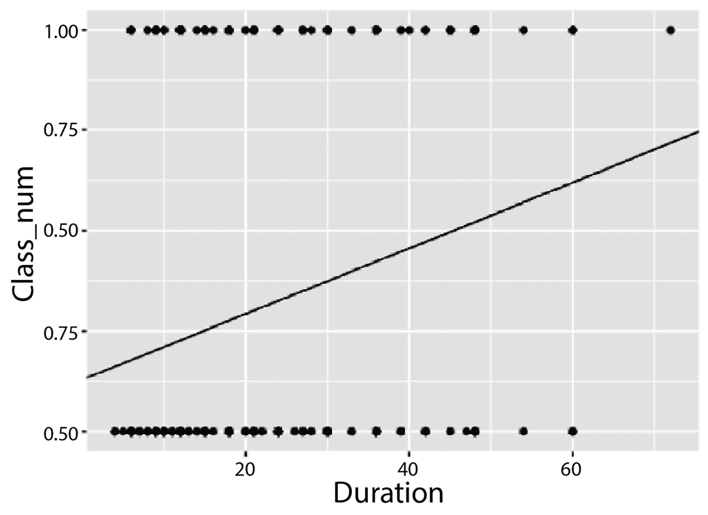

图 13.3 – 可视化线性回归模型

由于所有目标值都是`0`或`1`，我们可以将预测视为介于`0`和`1`之间的概率值。然而，当我们放大视图时，无界概率的问题就会显现出来，如下面的步骤所示。

1.  通过将*x*轴的范围扩大到`(-30, 120)`和*y*轴的范围扩大到`(-0.5, 1.5)`来重新绘制图形：

    ```py

    ggplot(GermanCredit,
           aes(Duration, Class_num)) +
      geom_point() +
      geom_abline(intercept=intercept, slope=slope) +
      xlim(-30, 120) +
      ylim(-0.5, 1.5) +
      theme(axis.title.x = element_text(size = 18),
            axis.title.y = element_text(size = 18))
    ```

    在这里，我们使用`xlim()`和`ylim()`函数扩大了*x*轴和*y*轴可能值的范围。

    运行前面的代码生成 *图 13.4* 中所示的输出，这表明当 `Duration` 的值变得极端时，预测值超出了 `[0,1]` 的范围，这种情况称为超出观察值范围的外推。这意味着预测概率将小于 0 或大于 1，这显然是一个无效的输出。这需要一种称为逻辑回归的广义线性回归模型，其中响应将根据 `sigmoid` 函数的转换遵循逻辑、S 形曲线。

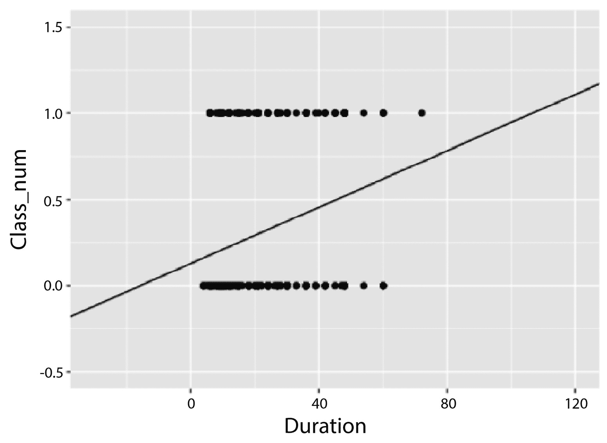

图 13.4 – 可视化扩展范围的线性回归模型

1.  使用 `glm()` 函数构建逻辑回归模型：

    ```py

    glm_model = glm(Class_num ~ Duration, data=GermanCredit, family=binomial)
    >>> glm_model
    Call:  glm(formula = Class_num ~ Duration, family = binomial, data = GermanCredit)
    Coefficients:
    (Intercept)     Duration
       -1.66635      0.03754
    Degrees of Freedom: 999 Total (i.e. Null);  998 Residual
    Null Deviance:     1222
    Residual Deviance: 1177   AIC: 1181
    ```

    结果显示了逻辑回归模型的估计截距和斜率，以及残差偏差，这是衡量模型拟合优度的一个指标。

1.  在之前的图形上绘制估计的逻辑曲线：

    ```py

    ggplot(GermanCredit,
           aes(Duration, Class_num)) +
      geom_point() +
      geom_abline(intercept=intercept, slope=slope) +
      geom_smooth(
        method = "glm",
        se = FALSE,
        method.args = list(family=binomial)
      ) +
      theme(axis.title.x = element_text(size = 18),
            axis.title.y = element_text(size = 18))
    ```

    运行前面的代码将生成 *图 13.5* 中所示的输出，这表明线性回归线和逻辑回归曲线之间存在轻微的偏差。

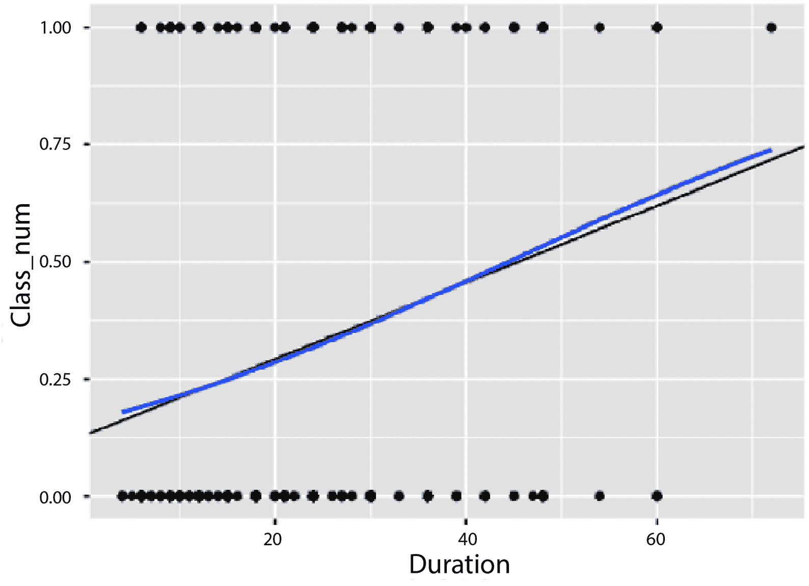

图 13.5 – 可视化逻辑回归曲线

再次，我们可以放大图形并关注当超出数据集中可能值的观察范围时的差异。

1.  在更宽的值范围内绘制逻辑曲线，超出观察值范围：

    ```py

    # Get coefficients from logistic model
    intercept_glm = coef(glm_model)[1]
    slope_glm = coef(glm_model)[2]
    # Generate sequence of x-values
    x_values = seq(from = min(GermanCredit$Duration) - 150,
                    to = max(GermanCredit$Duration) + 150,
                    by = 0.1)
    # Compute probabilities using logistic function
    y_values = 1 / (1 + exp(-(intercept_glm + slope_glm * x_values)))
    # Data frame for plot
    plot_df = data.frame(x = x_values, y = y_values)
    # Plot
    ggplot() +
      geom_point(data = GermanCredit, aes(Duration, Class_num)) +
      geom_abline(intercept=intercept, slope=slope) +
      geom_line(data = plot_df, aes(x, y), color = "blue") +
      theme_minimal() +
      xlim(-30, 120) +
      ylim(-0.5, 1.5) +
      theme(axis.title.x = element_text(size = 18),
            axis.title.y = element_text(size = 18))
    ```

    在这里，我们首先提取逻辑回归模型的系数，然后使用 `sigmoid` 函数转换生成输入值的序列及其相应的输出。最后，我们在同一图形中与观察数据一起绘制逻辑曲线和线性拟合。

    运行前面的代码生成 *图 13.6* 中所示的输出，这表明随着输入值的极端化，逻辑回归曲线逐渐饱和。此外，所有值现在都被限制在 `[0,1]` 的范围内，这使得它成为将解释为概率而不是无界值的有效候选。

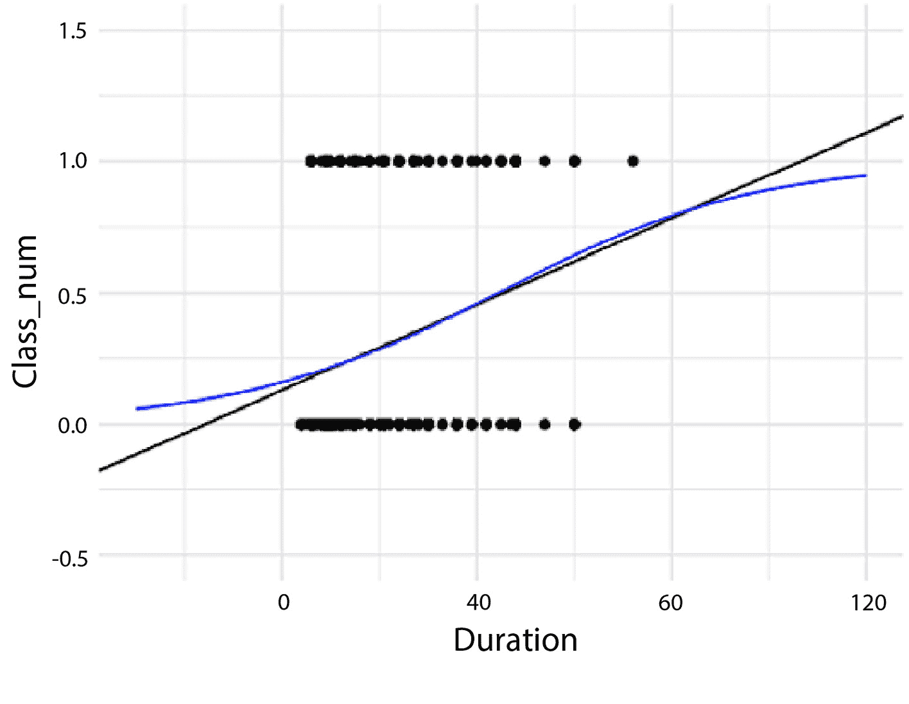

图 13.6 – 可视化扩展范围的逻辑回归模型

下一节将探讨如何使用逻辑回归模型进行预测。

## 使用逻辑回归模型进行预测

如前所述，逻辑回归模型的直接预测形式是介于`0`和`1`之间的概率。要将它们转换为二元预测，我们可以通过使用`0.5`的阈值对概率进行四舍五入来实现。例如，如果预测概率是 P(y = 1) = 0.8，四舍五入操作将导致最终的二元预测 y = 1。另一方面，如果 P(y = 1) = 0.3，四舍五入将导致 y = 0。

让我们通过以下练习来了解如何使用逻辑回归模型进行预测。

### 练习 13.2 – 使用逻辑回归模型进行预测

我们已经看到了如何通过提取逻辑回归模型的斜率和截距来执行预测。在这个练习中，我们将探索使用`predict()`函数的更便捷的方法：

1.  生成一个从`5`到`80`的`Duration`值序列，步长为`2`，并使用之前的逻辑回归模型通过`predict()`函数预测该序列的对应概率：

    ```py

    library(tibble)
    library(dplyr)
    # making predictions
    pred_df = tibble(
      Duration = seq(5, 80, 2)
    )
    pred_df = pred_df %>%
      mutate(
        pred_prob = predict(glm_model, pred_df, type="response")
      )
    ```

    这里，我们使用`seq()`函数创建等间隔向量，并将其存储在名为`pred_df`的`tibble`对象中。然后我们使用`predict()`通过指定`type="response"`来预测相应的概率。

1.  将预测概率与原始数据一起可视化：

    ```py

    ggplot() +
      geom_point(data = GermanCredit, aes(Duration, Class_num)) +
      geom_point(data = pred_df, aes(Duration, pred_prob) , color="blue") +
      theme(axis.title.x = element_text(size = 18),
            axis.title.y = element_text(size = 18))
    ```

    上述代码将生成以下输出：

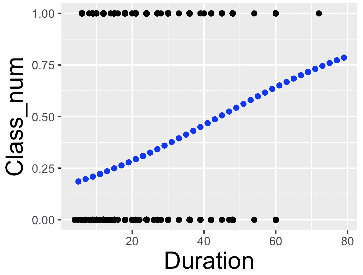

图 13.7 – 可视化预测的概率

1.  使用`round()`函数将概率转换为二元结果：

    ```py

    # getting the most likely outcome
    pred_df = pred_df %>%
      mutate(
        most_likely_outcome = round(pred_prob)
      )
    ```

    这里，我们使用默认阈值`0.5`对预测概率进行四舍五入。

1.  将二元结果作为绿色点添加到之前的图中：

    ```py

    ggplot() +
      geom_point(data = GermanCredit, aes(Duration, Class_num)) +
      geom_point(data = pred_df, aes(Duration, pred_prob) , color="blue") +
      geom_point(data = pred_df, aes(Duration, most_likely_outcome) , color="green") +
      theme(axis.title.x = element_text(size = 18),
            axis.title.y = element_text(size = 18))
    ```

    运行上述代码将生成以下输出，表明所有预测概率高于`0.5`的都被转换为`1`，而低于`0.5`的都被转换为`0`。

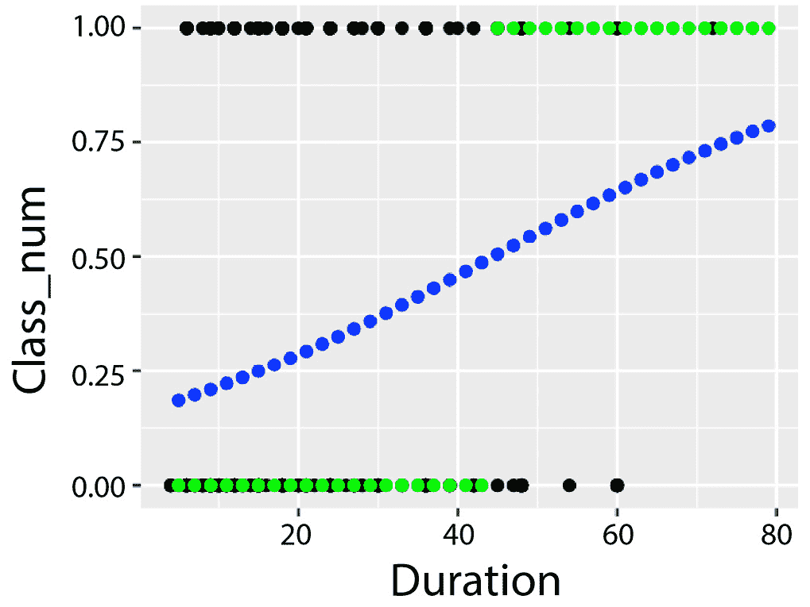

图 13.8 – 可视化预测的二元结果

下一个部分将进一步讨论对数赔率。

# 关于对数赔率和赔率比率的更多内容

记住，赔率是指事件发生的概率与其补数的比率：

odds =  事件发生的概率   ________________________   事件不发生的概率  =  p _ 1 − p  =  P(y = 1) _ P(y = 0)

这里，概率的计算如下：

p = P(y = 1) =  1 _ 1 + e −z

1 − p = 1 −  1 _ 1 + e −z  =  e −z _ 1 + e −z

将 p 和 1 − p 的定义代入，我们得到以下结果：

odds =  p _ 1 − p  = e z

我们通常不直接处理赔率，而是使用对数赔率或 logit。这个术语通常通过以下方式在逻辑回归模型中作为预测器的线性组合进行建模：

log P(y = 1) _ P(y = 0)  = z = β 0 + β 1 x 1 + … + β p x p

在这里，我们可以将每个系数 β j 解释为在保持所有其他预测变量不变的情况下，jth 预测变量 x j 单位增加时对对数优势的预期变化。这个方程本质上表明，目标值 y 为 `1` 的对数优势与输入变量呈线性关系。

现在假设 x i 是一个二元输入变量，使得 x i = 1 或 0。我们可以如下计算 x i = 1 的优势：

p 1 _ 1 − p 1  = e z 1

这衡量了 x i = 1 事件发生的概率与不发生事件的概率。同样，我们可以如下计算 x i = 0 的优势：

p 0 _ 1 − p 0  = e z 0

这衡量了 x i = 0 事件发生的概率与不发生事件的概率。

然后，我们可以计算 x i 的优势比，这是 x i = 1 的优势与 x i = 0 的优势之比：

p 1 _ 1 − p 1 _  p 0 _ 1 − p 0  =  e β 0+β 1x 1+…β i*1+…+β px p ___________ e β 0+β 1x 1+…β i*0+…+β px p  = e β i

在这里，e β i 衡量了二元输入变量 x i 对结果 y 为 `1` 的优势的量化影响，同时保持所有其他输入变量不变。这为我们提供了一种衡量逻辑回归模型中任何预测变量影响的方法，包括分类和数值输入变量。

对于分类输入变量，我们可以使用性别（男性为 `0`，女性为 `1`）来预测是否购买保险（购买为 `1`，不购买为 `0`）。我们将男性的基准类别设置为 `0`。如果性别估计系数 β gender = 0.2，其优势比计算为 e 0.2 ≈ 1.22。因此，女性客户购买保险的优势是男性客户购买保险优势的 1.22 倍，假设所有其他变量保持不变。

对于数值输入变量，我们可以使用年龄来预测是否购买保险。在这种情况下，无需设置基准类别。如果估计的系数 β age = 0.3，相应的优势比计算为 e 0.3 ≈ 1.35。这意味着客户的购买概率是比一年年轻的人高 1.35 倍，假设其他条件相同（*ceteris paribus*）。

注意，我们可以使用预测概率来计算对数优势，如下面的代码片段所示：

```py

# calculate log odds using predicted probabilities
pred_df = pred_df %>%
  mutate(
    log_odds = log(pred_prob / (1 - pred_prob))
  )
```

下一节将介绍更多关于逻辑回归模型损失函数的内容。

# 引入交叉熵损失

二元交叉熵损失，也称为 **log loss**，通常用作逻辑回归中的成本函数。这是逻辑回归模型将通过移动参数来尝试最小化的损失。这个函数将预测概率和相应的目标作为输入，并输出一个标量分数，表示拟合优度。对于具有目标 y i 和预测概率 p i 的单个观察值，损失计算如下：

Q i(y i, p i) = − [ y i logp i + (1 − y i)log(1 − p i)]

将所有个别损失相加得到总二元交叉熵损失：

Q(y, p) =  1 _ N  ∑ i N Q i =  1 _ N  ∑ i=1 N − [ y i logp i + (1 − y i)log(1 − p i)]

二元 CEL 函数是二元分类问题的合适选择，因为它对自信但错误的预测进行重罚。例如，当 p i 接近 *0* 或 *1* 时，如果预测错误，则 resulting CEL 将趋于无穷大。因此，这一特性鼓励学习过程输出接近目标真实概率的概率。

更一般地，我们使用 CEL 来模拟目标变量中有两个或更多类别的分类问题。对于第 i 个观察 *x* i，分类函数将产生一个概率输出，表示为 p i,k = f( *x* i; *w*)，以指示属于第 k 个类别的可能性。当我们有一个包含总共 C 个类别的分类任务时，*x* i 的 CEL 定义为 Q i(*w*) = − ∑ k=1 C  y i,k log(p i,k)，这实际上是对所有类别的求和。再次强调，如果第 i 个观察的目标标签属于第 k 个类别，则 y i,k = 1，否则 y i,k = 0。

求和意味着对每个类别执行类内评估（即，项 y i,k log(p i,k)），并将它们相加以产生第 i 个观察的总成本。对于每个观察，总共有 C 个预测与属于每个类别的相应概率相对应。因此，CEL 通过将它们求和成一个单一的数字来聚合预测概率矩阵。此外，结果取反以产生一个正数，因为当 x 是介于 `0` 和 `1` 之间的概率时，log(x) 是负数。

注意，CEL 计算中的目标标签需要是一维编码。这意味着单个分类标签被转换成一个包含 `1` 的二进制数字数组，表示类别标签，其他为 `0`。例如，对于一个数字 `8` 的图像，而不是传递原始类别作为目标输出，将使用结果的一维编码目标 `[0, 0, 0, 0, 0, 0, 0, 1, 0, 0]`，其中第 8 位被激活（即，热），其余被禁用。目标数组也将与概率输出数组具有相同的长度，其元素对应于每个类别。

直观上，我们希望预测的正确类别的概率接近 `1`，而错误类别的概率为 `0`。也就是说，随着预测概率偏离实际类别标签，损失应该增加。CEL 设计是为了遵循这种直觉。具体来说，我们可以查看第 i 个观察的以下四种情况：

+   当目标标签属于第 k 个类别（即，y i,k = 1）且第 k 个类别的预测概率非常强（即，p i,k ≈ 1）时，成本应该很低。

+   当目标标签属于第 k 个类别（即，y i,k = 1）且第 k 个类别的预测概率非常弱（即，p i,k ≈ 0）时，成本应该很高。

+   当目标标签不属于第 k 个类别（即 y_i,k = 0）且第 k 个类别的预测概率非常强（即 p_i,k ≈ 1）时，成本应该高。

+   当目标标签不属于第 k 个类别（即 y_i,k = 0）且第 k 个类别的预测概率非常弱（即 p_i,k ≈ 0）时，成本应该低。

要计算 CEL，我们首先计算每个观察值在所有类别中二进制标签向量与预测概率向量之间的加权求和。将所有观察值的结果相加，然后加一个负号以将成本转换为正数。CEL 的设计是为了匹配成本的感觉：当预测和目标非常接近时，成本应该低，否则高。换句话说，为了计算总成本，我们只需将单个成本相加，导致 Q(w) = − ∑_i=1^N ∑_k=1^C y_i,k log(p_i,k)。*图 13.9* 总结了关于 CEL 的前述讨论。

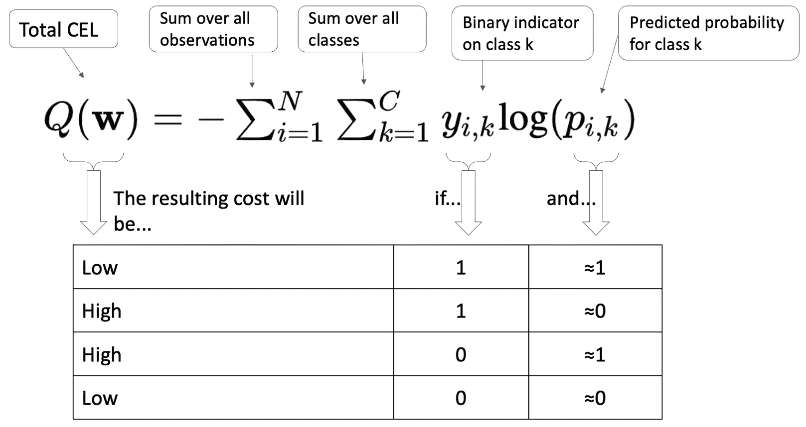

图 13.9 – 说明 CEL

注意，最后两种情况对损失计算没有任何贡献，因为目标值等于 0；任何乘以 0 的值都变为 0。此外，观察这些两个类别的特定观察值的预测概率需要加起来等于 1，这使得我们只需要关注一个类别的预测概率（通常是类别 `1`）。

下一节将介绍如何评估逻辑回归模型。

# 评估逻辑回归模型

我们可以使用多个指标来评估逻辑回归模型。这些是我们用来确定拟合优度（在测试集上）的指标，需要与我们在训练模型时使用的 CEL（在训练集上）区分开来。

以下列表提供了常用的指标：

+   **准确率**：这是模型对观察值进行正确预测的数量与观察值总数的比例。由于正确的预测可以是真正的阳性或真正的阴性，准确率是通过将真正的阳性和真正的阴性相加，然后除以观察值总数来计算的。

+   **错误率**：这是模型在总观察值中做出错误预测的比例。错误的预测可以是假阳性或假阴性。它被计算为 *1 - 准确率*；也就是说，错误率是准确率的补数。换句话说，它被计算为 *(假阳性 + 假阴性) / *总观察值*。

+   **精确度**：精确度是所有正预测中正确正预测的比例。这个指标实际上告诉我们，在所有预测为正的实例中，有多少是正确的。因此，它表明模型在预测正观察方面的准确性，并计算为*真正例 / (真正例 + 假正例)*。在分母中，我们注意到在所有正实例中，一些是真正例，其余是假正例。

+   **召回率**：召回率指的是模型正确预测的实际正实例的比例。也称为敏感性或**真正例率**（**TPR**），召回率衡量模型检测正观察的能力。它计算为*真正例 / (真正例 + 假反例)*，其中分母的公式与精确度不同。

+   **特异性**：也称为**真正例率**（**TNR**），特异性衡量模型正确预测的实际负实例的比例。这与敏感性相反，敏感性关注模型捕捉真正例的能力。换句话说，特异性衡量模型正确识别负实例或非事件的能力。它计算为*真正例 / (真正例 + 假正例)*。

+   `0` 和 `1` 表示两个类别之间分离的程度。一个完美模型，如果预测正确率达到 100%，其 AUC（曲线下面积）为`1`，而一个完全错误的模型，其 AUC 为`0`。一个随机猜测（以 50%的概率选择`0`或`1`）的模型对应于 AUC 为`0.5`，这表明没有类别分离能力。

注意，在评估两个具有同等良好评估指标的模型时，我们将遵循简约性原则。简约性原则指出，如果两个竞争模型对数据的拟合程度相似，那么应该选择输入变量更少的模型，从而更倾向于简单而非复杂。其基本假设是最准确的模型不一定是最好的模型。

*图 13**.10* 描述了构建混淆矩阵的过程，该矩阵捕捉了不同场景下的预测结果，以及计算上述评估指标的具体细节。

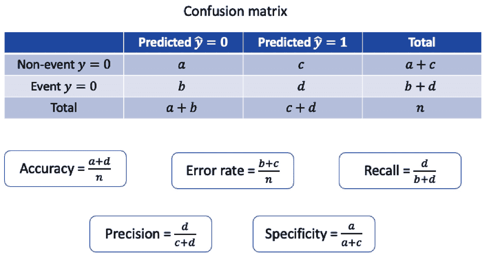

图 13.10 – 展示二元分类任务中的混淆矩阵和常见评估指标

注意，我们只能在选择一个阈值来截断预测概率之后才能计算这些指标。具体来说，预测概率大于截止阈值的观测值将被分类为正类，否则为负类。

精确率和召回率通常与分类阈值的调整呈反向关系。在目标变量值存在巨大不平衡的情况下，同时审查精确率和召回率是有用的。由于精确率和召回率是两个相关但不同的指标，我们应该优化哪一个？

要回答这个问题，我们需要评估做出错误阴性预测的相对影响。这通过错误阴性率来衡量，它是召回率的相反（或补数）。如图 13.11 所示，未能识别垃圾邮件的风险低于错过欺诈交易或阳性癌症患者。我们应该旨在优化精确度（以便模型的预测更加精确和有针对性）对于第一种情况，以及召回率（以便最小化错过潜在阳性案例的机会）对于第二种情况。

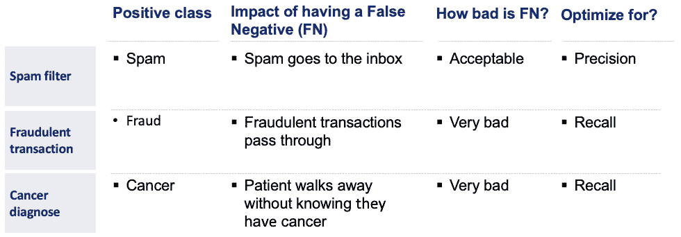

图 13.11 – 具有不同错误阴性预测影响的三个案例

至于 AUC，或 ROC 曲线下方的面积，不需要选择特定的阈值，因为它通过评估从 `0` 到 `1` 的阈值序列来计算。ROC 曲线在 *y* 轴上绘制灵敏度，在 *x* 轴上绘制 *1 - 特异性*。这也对应于绘制 TPR 与 1-TNR，或 TPR 与 FPR。随着分类阈值的上升，FPR 下降，导致曲线向左移动。

完美的二元分类器具有 AUC 得分为 `1`。这意味着 FPR，或 *1 – 特异性*，为 `0`。也就是说，没有假阳性，所有负例都没有被预测为阳性。此外，灵敏度，或 TPR，为 `1`，意味着所有正例都被正确预测为阳性。

*图 13.12* 展示了三种不同的 AUC 曲线。最上面的曲线（绿色）对应于更好的模型，因为其 AUC 值最高。两种模型，由绿色和红色曲线表示，表现优于随机猜测，如蓝色直线非对角线所示。

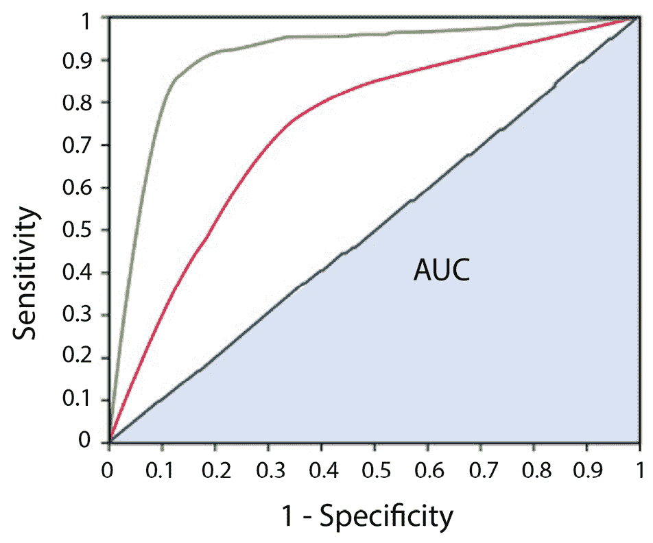

图 13.12 – 展示三种不同的 AUC 曲线

继续进行之前的练习，我们现在可以计算相应的评估指标。首先，我们使用训练好的逻辑回归模型对训练集中的所有观测值进行评分，并使用 `predict()` 函数和设置 `type="response"` 获得相应的概率，如下面的代码片段所示。请注意，我们需要传递一个包含相应特征名称的 DataFrame 作为模型的输入：

```py

# Create new data frame with all durations
new_data = data.frame(Duration = GermanCredit$Duration)
# Calculate predicted classes based on predicted probabilities
predicted_probs = predict(glm_model, new_data, type="response")
```

接下来，我们设置一个单一的截止阈值（在这种情况下为 `0.5`）使用 `ifelse()` 函数将预测概率转换为相应的二元结果：

```py

# Convert to binary outcomes
predicted_classes = ifelse(predicted_probs > 0.5, 1, 0)
```

对于二元结果和真实目标标签，我们可以通过以下方式获得混淆矩阵：

```py

# Create confusion matrix
conf_matrix = table(predicted = predicted_classes, actual = GermanCredit$Class_num)
>>> conf_matrix
         actual
predicted   0   1
        0 670 260
        1  30  40
```

在这里，混淆矩阵提供了模型正确和错误分类的细分。在混淆矩阵中，左上角的单元格表示真正的负例，右上角的单元格表示错误的正例，左下角的单元格表示错误的负例，而右下角的单元格表示真正的正例。

根据混淆矩阵，我们可以计算评估指标如下：

```py

# Accuracy
accuracy = sum(diag(conf_matrix)) / sum(conf_matrix)
>>> print(paste("Accuracy: ", accuracy))
"Accuracy:  0.71"
# Error rate
error_rate = 1 - accuracy
>>> print(paste("Error rate: ", error_rate))
"Error rate:  0.29"
# Precision
precision = conf_matrix[2,2] / sum(conf_matrix[2,])
print(paste("Precision: ", precision))
"Precision:  0.571428571428571"
# Recall / Sensitivity
recall = conf_matrix[2,2] / sum(conf_matrix[,2])
print(paste("Recall: ", recall))
>>> "Recall:  0.133333333333333"
# Specificity
specificity = conf_matrix[1,1] / sum(conf_matrix[,1])
print(paste("Specificity: ", specificity))
>>> "Specificity:  0.957142857142857"
```

在这里，我们提取混淆矩阵的相应项，并将不同评估指标的定义代入以完成计算。

我们也可以计算 AUC，从使用`pROC`包计算 ROC 曲线开始：

```py

library(pROC)
# Calculate ROC curve
roc_obj = roc(GermanCredit$Class_num, predicted_probs)
# Plot ROC curve
>>> plot(roc_obj)
```

运行代码生成*图 13.13*，这表明模型的表现略好于随机猜测。

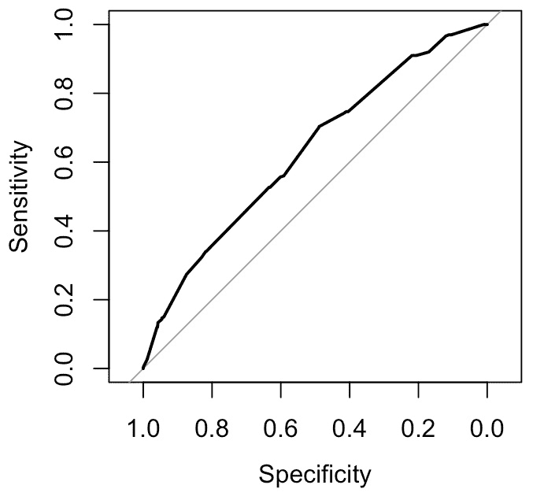

图 13.13 – 可视化 ROC 曲线

要计算 AUC，我们可以调用`auc()`函数：

```py

# Calculate AUC
auc = auc(roc_obj)
>>> print(paste(«AUC: «, auc))
«AUC:  0.628592857142857»
```

注意，当我们对精确度或召回率没有偏好时，我们可以使用 F1 分数，其定义如下：

F1 分数 = 2(精确度 × 召回率) / (精确度 + 召回率)

下一个部分讨论了一个具有挑战性的建模情况，即我们一开始就有一个不平衡的数据集。

# 处理不平衡数据集

当使用目标为二元结果的数据库构建逻辑回归模型时，目标值可能不是均匀分布的。这意味着我们会观察到比事件（y = 1）更多的非事件（y = 0），这在银行欺诈交易、企业员工的垃圾邮件/钓鱼邮件、癌症等疾病的识别以及地震等自然灾害等应用中通常是这种情况。在这些情况下，分类性能可能会被多数类主导。

这样的主导地位可能导致误导性的高准确率得分，这与较差的预测性能相对应。为了理解这一点，假设我们正在使用一个包含 1,000 个观察值的数据库来开发一个默认预测模型，其中只有 10 个（或 1%）是违约案例。一个简单的模型会简单地预测每个观察值都不是违约，从而得到 99%的准确率。

当我们遇到不平衡数据集时，我们通常对少数类更感兴趣，这代表了分类问题中要检测的结果。由于少数类的信号相对较弱，我们需要依赖良好的建模技术来识别良好的模式，以便正确检测信号。

我们可以使用多种技术来解决不平衡数据集的挑战。我们将介绍一种流行的称为数据重采样的方法，它需要原始数据集的过采样和/或欠采样，以使整体分布不那么不平衡。重采样包括对少数类进行过采样、对多数类进行欠采样，或使用它们的组合，如**合成少数过采样技术（SMOTE）**所表示。然而，这种补救措施并非没有风险。在这里，过采样可能导致过拟合，因为更多的样本被添加到原始数据集中，而欠采样可能导致信息丢失，因为一些多数观测值被从原始数据集中移除。

*图 13.14* 展示了过采样少数类（左侧面板）和欠采样多数类（右侧面板）的过程。请注意，一旦基于平衡数据集建立模型，我们还需要在新测试集上对其进行校准，以便它在新的真实数据集上也能表现良好。

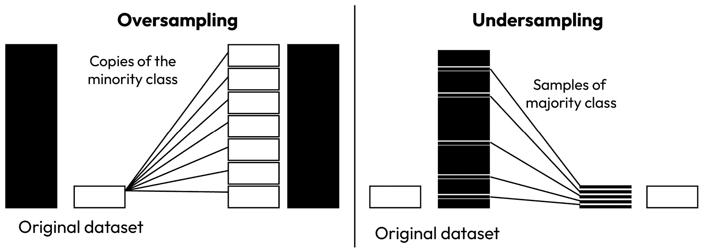

图 13.14 – 展示了过采样少数类和欠采样多数类的过程

让我们通过一个练习来了解如何在逻辑回归设置中执行欠采样或过采样。

### 练习 13.3 – 执行欠采样和过采样

在这个练习中，我们将基于欠采样和过采样创建两个人工数据集。然后，我们将使用混淆矩阵评估所得到的逻辑回归模型的表现：

1.  将原始数据集划分为训练集（70%）和测试集（30%）：

    ```py

    set.seed(2)
    index = sample(1:nrow(GermanCredit), nrow(GermanCredit)*0.7)
    train = GermanCredit[index, ]
    test = GermanCredit[-index, ]
    ```

    在这里，我们随机采样一组索引，用于选择训练集的观测值，并将剩余的分配到测试集。

1.  检查训练集中的类比例：

    ```py

    >>> table(train$Class_num)
      0   1
    504 196
    ```

    结果显示，多数类（类别 `0`）的大小是少数类（类别 `1`）的两倍多。

1.  根据类别标签将训练集划分为多数集和少数集：

    ```py

    # separate the minority and majority classes
    table(train$Class_num)
    minority_data = train[train$Class_num == 1,]
    majority_data = train[train$Class_num == 0,]
    ```

    然后，我们将使用这两个数据集来执行欠采样和过采样。

1.  对多数类进行欠采样，并将欠采样的多数类与少数类合并。检查结果类的比例：

    ```py

    # undersample the majority class
    undersampled_majority = majority_data[sample(1:nrow(majority_data), nrow(minority_data)),]
    # combine undersampled majority class and minority class
    undersampled_data = rbind(minority_data, undersampled_majority)
    >>> table(undersampled_data$Class_num)
      0   1
    196 196
    ```

    类比例现在平衡了。让我们对少数类执行过采样。

1.  对少数类进行过采样，并将过采样的少数类与多数类合并。检查结果类的比例：

    ```py

    # oversample the minority class
    oversampled_minority = minority_data[sample(1:nrow(minority_data), nrow(majority_data), replace = TRUE),]
    # combine majority class and oversampled minority class
    oversampled_data = rbind(majority_data, oversampled_minority)
    >>> table(oversampled_data$Class_num)
      0   1
    504 504
    ```

1.  在欠采样和过采样的数据集上拟合逻辑回归模型：

    ```py

    # fit logistic regression models on undersampled and oversampled data
    undersampled_model = glm(Class_num ~ Duration, family = binomial(link = 'logit'), data = undersampled_data)
    oversampled_model = glm(Class_num ~ Duration, family = binomial(link = 'logit'), data = oversampled_data)
    ```

1.  在测试集上获取预测概率：

    ```py

    # get the predicted probabilities on the test set
    undersampled_pred = predict(undersampled_model, newdata = test, type = "response")
    oversampled_pred = predict(oversampled_model, newdata = test, type = "response")
    ```

1.  应用 `0.5` 的阈值将概率转换为二进制类别：

    ```py

    # apply threshold to convert the probabilities into binary classes
    undersampled_pred_class = ifelse(undersampled_pred > 0.5, 1, 0)
    oversampled_pred_class = ifelse(oversampled_pred > 0.5, 1, 0)
    ```

1.  计算混淆矩阵：

    ```py

    # calculate the confusion matrix
    undersampled_cm = table(predicted = undersampled_pred_class, actual = test$Class_num)
    oversampled_cm = table(predicted = oversampled_pred_class, actual = test$Class_num)
    >>> undersampled_cm
             actual
    predicted   0   1
            0 117  59
            1  79  45
    >>> oversampled_cm
             actual
    predicted   0   1
            0 115  59
            1  81  45
    ```

    结果表明，使用欠采样或过采样训练数据集，这两种模型都表现出相似的性能。再次，我们会使用另一个验证数据集，它可以来自原始训练集，以进一步校准模型参数，以便在测试集上表现更好。

结果表明，我们还可以在逻辑回归模型中添加 lasso 或岭惩罚，如下一节所述。

# 惩罚逻辑回归

如其名所示，惩罚逻辑回归模型在通常逻辑回归模型的损失函数中包含一个额外的惩罚项。回想一下，标准逻辑回归模型试图最小化负对数似然函数（或等价地，最大化对数似然函数），其定义如下：

Q(𝜷) =  1 _ N  ∑ i=1 N − [ y i logp i + (1 − y i)log(1 − p i)]

在这里，p i =  1 _ 1 + e −(β 0+β 1x 1 (i)+β 2x 2 (i)+…+β px p (i)) 是输入 x (i) 的预测概率，y i 是相应的目标标签，𝜷 = { β 0, β 1, … , β p} 是要估计的模型参数。请注意，我们现在将损失表示为系数向量的函数，因为它直接由模型中使用的参数集确定。

由于惩罚项旨在缩小估计系数的幅度，因此我们会将其添加到损失函数中，以便惩罚项将相对较小（受一个调整超参数λ的限制）。对于岭惩罚的情况，我们会添加平方系数的总和，从而得到以下惩罚负对数似然函数：

Q ridge(𝜷) = Q(𝜷) + λ ||𝜷|| 2 2 = Q(𝜷) + λ∑ j=1 p β j 2

相应地，使用 lasso 正则化项的惩罚负对数似然函数具有以下形式：

Q lasso(𝜷) = Q(𝜷) + λ|𝜷| = Q(𝜷) + λ∑ j=1 p | β j|

在这两种情况下，惩罚项都有可能将系数的幅度缩小到相对于原始最大似然估计的 0。这可以通过控制模型估计过程的复杂性来帮助防止过拟合。调整超参数λ控制缩放的程度。特别是，较大的λ会给惩罚项添加更多的权重，从而导致更多的缩放效应，而较小的λ则对估计系数的整体幅度赋予较少的权重。

让我们说明惩罚逻辑回归模型的发展过程。可以使用支持 lasso 和岭惩罚的`glmnet`包来完成此任务。在下面的代码片段中，我们使用前九列作为预测变量来建模二元结果：

```py

# Create a matrix of predictors and a response vector
# For glmnet, we need to provide our data as matrices/vectors
X = GermanCredit[1:nrow(GermanCredit), 1:9]
y = GermanCredit$Class_num
# Define an alpha value: 0 for ridge, 1 for lasso, between 0 and 1 for elastic net
alpha_value = 1 # for lasso
# Run the glmnet model
fit = glmnet(X, y, family = "binomial", alpha = alpha_value)
```

在这里，我们设置 `alpha=1` 以启用 lasso 惩罚。设置 `alpha=0` 启用岭惩罚，将 alpha 设置为`0`和`1`之间对应于弹性网络惩罚。

注意，此过程将评估λ超参数的一系列值，从而让我们了解基于惩罚对结果系数的影响程度。特别是，我们可以绘制出系数路径，如下所示，表示不同λ值下的结果系数：

```py

# plot coefficient paths
>>> plot(fit, xvar = "lambda", label = TRUE)
```

运行代码生成**图 13**.15，它表明当λ值变大时，更多参数会缩小到 0。

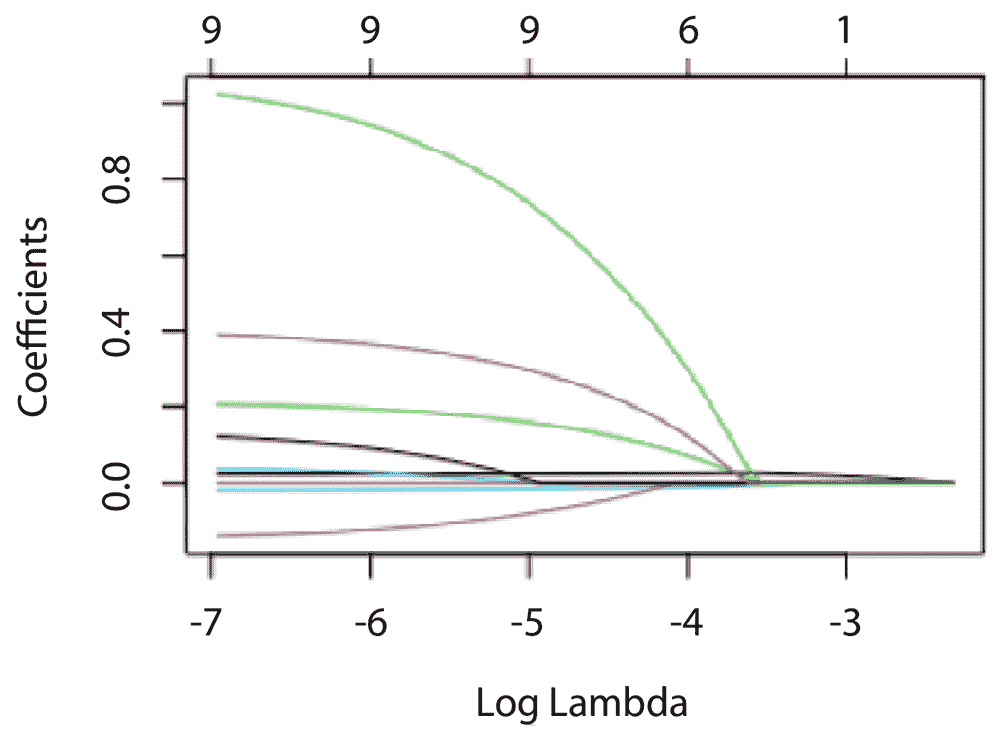

图 13.15 – 使用 lasso 惩罚逻辑回归可视化系数路径

下一节讨论一个更一般的设置：多项式逻辑回归，这是一个多类分类的模型类别。

# 扩展到多类分类

许多问题具有超过两个类别。例如，`AAA`、`AA`、`A`以及更多类似的情况。银行的企业客户账户被分类为良好信用、逾期、拖欠、可疑或损失。这种设置需要多项式逻辑回归模型，这是在多类分类背景下对二元逻辑回归模型的推广。本质上，目标变量 y 可以取超过两个可能的离散结果，并允许超过两个分类值。

假设目标变量可以取三个值，即 y ∈ {0,1, 2}。让我们选择类别`0`作为基线值。我们将建模其他类别（类别`1`和`2`）相对于这个基线的概率。换句话说，我们有以下：

p(y = 1) _ p(y = 0)  = e z 1

p(y = 2) _ p(y = 0)  = e z 2

因此，每个类别的预测概率的相对比例如下：

p(y = 2) : p(y = 1) : p(y = 0) = e z 2 : e z 1 : 1

我们知道以下内容：

p(y = 2) + p(y = 1) + p(y = 0) = 1

因此，我们有以下：

p(y = 2) =  e z 2 _ e z 2 + e z 1 + 1

p(y = 1) =  e z 1 _ e z 2 + e z 1 + 1

p(y = 0) =  1 _ e z 2 + e z 1 + 1

再次强调，多项式逻辑回归模型中的一个主要假设是，对数几率是预测变量的线性组合。这与二元逻辑回归中的假设相同。在多项式逻辑回归中，系数的解释也会略有变化。特别是，每个系数现在代表对应预测变量单位变化时，相对于基线类别的对数几率的变化，同时保持所有其他预测变量不变。

我们可以依赖`nnet`包中的`multinom()`函数来创建多项式逻辑回归模型。在下面的代码片段中，我们使用之前的`mtcars`数据集，并将`gear`变量转换为因子，这将作为目标变量：

```py

library(nnet)
# convert gear to factor
mtcars$gear = as.factor(mtcars$gear)
>>> table(mtcars$gear)
3  4  5
15 12  5
```

频率计数显示变量中有三个类别。接下来，我们使用`mpg`、`hp`和`disp`在多项式逻辑回归模型中预测`gear`：

```py

# fit the model
multinom_model = multinom(gear ~ mpg + hp + disp, data = mtcars)
# weights:  15 (8 variable)
initial  value 35.155593
iter  10 value 10.945783
iter  20 value 9.011992
iter  30 value 8.827997
iter  40 value 8.805003
iter  50 value 8.759821
iter  60 value 8.742738
iter  70 value 8.737492
iter  80 value 8.736569
final  value 8.735812
converged
```

输出信息表明，模型中共有八个变量。这是有道理的，因为我们有四个变量（`截距`、`mpg`、`hp`和`disp`）来模型一个子模型中四档和三档汽车之间的差异，另外四个变量来模型另一个子模型中五档和三档汽车之间的差异。

让我们看一下模型的摘要：

```py

# view summary of the model
>>> summary(multinom_model)
Call:
multinom(formula = gear ~ mpg + hp + disp, data = mtcars)
Coefficients:
  (Intercept)       mpg         hp        disp
4   0.3892548 0.2707320 0.02227133 -0.04428756
5 -17.6837050 0.6115097 0.15511207 -0.08815984
Std. Errors:
  (Intercept)       mpg         hp       disp
4    17.30456 0.5917790 0.05813736 0.02735148
5    15.46373 0.5754793 0.08651377 0.06060359
Residual Deviance: 17.47162
AIC: 33.47162
```

如预期，摘要包括两个子模型（分别以`4`和`5`索引）的两组系数。

最后，让我们使用多项式逻辑回归模型进行预测，并计算混淆矩阵：

```py

# make prediction
predicted_gears = predict(multinom_model, newdata = mtcars)
# view the confusion matrix
>>> table(Predicted = predicted_gears, Actual = mtcars$gear)
         Actual
Predicted  3  4  5
        3 14  0  0
        4  1 12  1
        5  0  0  4
```

结果表明，只有两个分类错误，分类性能相当不错。

# 摘要

在本章中，我们深入探讨了逻辑回归的世界，其理论基础及其实际应用。我们首先探讨了逻辑回归的基本结构及其与线性回归的比较。然后，我们介绍了 Sigmoid 变换的概念，这是逻辑回归中的一个关键元素，确保我们模型的输出被限制在`0`和`1`之间。这一部分帮助我们更好地理解逻辑回归在二元分类任务中的优势。

接下来，我们深入探讨了对数几率和几率比的概念，这两个是逻辑回归模型的关键组成部分。理解这些概念使我们能够理解模型预测的现实世界影响，并有效地解释其参数。随后章节介绍了 CEL，这是逻辑回归中使用的成本函数。具体来说，我们讨论了该损失函数如何确保我们的模型学会预测二元类别的准确概率。

当涉及到评估逻辑回归时，我们学习了各种指标，包括准确率、错误率、精确度、召回率、灵敏度、特异性和 AUC。这种理解将使我们能够准确评估我们的逻辑回归模型的表现。

重要的讨论围绕着处理不平衡数据集的问题，这是现实世界数据中常见的场景。我们理解了数据不平衡对我们模型的影响，并学习了如何通过重采样技术等策略有效地处理这种情况。此外，我们还讨论了惩罚逻辑回归，其中我们将 L1（lasso）或 L2（ridge）正则化纳入我们的逻辑回归模型。这种惩罚技术通过保持模型权重的大小，并在处理高维数据时创建更简单的模型，帮助我们防止过拟合。

最后，我们简要提到了多项逻辑回归，这是逻辑回归的扩展，用于多类分类问题。这部分内容为我们提供了处理目标变量包含两个以上类别的情况的见解。

在本章结束时，我们广泛了解了逻辑回归、其实现及其细微差别。这些知识为我们深入研究更复杂的分类方法和策略奠定了基础。

在下一章中，我们将介绍贝叶斯统计，这是统计建模的另一个主要分支。
