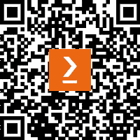

[www.packtpub.com](http://www.packtpub.com)

订阅我们的在线数字图书馆，全面访问超过 7,000 本书籍和视频，以及领先的行业工具，帮助您规划个人发展并推进职业生涯。如需更多信息，请访问我们的网站。

# 为什么订阅？

+   通过来自超过 4,000 位行业专业人士的实用电子书和视频，节省学习时间，增加编码时间

+   通过为您量身定制的技能计划提高您的学习效果

+   每月免费获得一本电子书或视频

+   完全可搜索，便于轻松访问关键信息

+   复制粘贴、打印和收藏内容

您知道 Packt 为每本书都提供电子书版本，包括 PDF 和 ePub 文件吗？您可以在[www.packtpub.com](http://www.packtpub.com)升级到电子书版本，并且作为印刷书客户，您有权获得电子书副本的折扣。如需了解更多详情，请联系我们`customercare@packtpub.com`。

在[www.packtpub.com](http://www.packtpub.com)网站上，您还可以阅读一系列免费的技术文章，注册各种免费通讯，并享受 Packt 书籍和电子书的独家折扣和优惠。

# 您可能还会喜欢的其他书籍

如果您喜欢这本书，您可能会对 Packt 的其他书籍感兴趣：

**在 Python 中构建统计模型**

Huy Hoang Nguyen, Paul N Adams, Stuart J Miller

ISBN: 978-1-80461-428-0

+   探索在不确定性下使用统计方法做决策

+   使用假设检验来回答关于数据的问题

+   理解回归模型和分类模型之间的差异

+   使用 Python 中的统计模型构建模型

+   分析时间序列数据并提供预测

+   发现生存分析和它能解决的问题

**使用贝叶斯推理增强深度学习**

Matt Benatan, Jochem Gietema, Marian Schneider

ISBN: 978-1-80324-688-8

+   理解贝叶斯推理和深度学习的优缺点

+   理解贝叶斯神经网络的基本原理

+   理解关键 BNN 实现/近似之间的差异

+   理解概率 DNN 在生产环境中的优势

+   如何在 Python 代码中实现各种 BDL 方法

+   如何将 BDL 方法应用于现实世界问题

+   理解如何评估 BDL 方法并选择给定任务的最佳方法

+   学习如何在现实世界的深度学习应用中处理意外数据

# Packt 正在寻找像您这样的作者

如果你有兴趣成为 Packt 的作者，请访问[authors.packtpub.com](http://authors.packtpub.com)并今天申请。我们与成千上万的开发者和技术专业人士合作，就像你一样，帮助他们将见解分享给全球科技社区。你可以提交一般申请，申请我们正在招募作者的特定热门话题，或者提交你自己的想法。

# 分享你的想法

现在你已经完成了《使用 R 进行统计和机器学习研讨会》，我们很乐意听听你的想法！如果你在亚马逊购买了这本书，请[点击此处直接进入该书的亚马逊评论页面](https://packt.link/r/1-803-24030-X)并分享你的反馈或在该购买网站上留下评论。

你的评论对我们和科技社区都很重要，并将帮助我们确保我们提供高质量的内容。

# 下载这本书的免费 PDF 副本

感谢您购买这本书！

你喜欢在旅途中阅读，但又无法携带你的印刷书籍到处走吗？

你的电子书购买是否与你的选择设备不兼容？

别担心，现在每购买一本 Packt 书籍，你都可以免费获得该书的 DRM 免费 PDF 版本。

在任何地方、任何地点、任何设备上阅读。直接从你最喜欢的技术书籍中搜索、复制和粘贴代码到你的应用程序中。

优惠远不止于此，你还可以获得独家折扣、时事通讯和每天收件箱中的优质免费内容

按照以下简单步骤获取福利：

1.  扫描二维码或访问以下链接

https://packt.link/free-ebook/9781803240305

2. 提交你的购买证明

3. 就这些！我们将直接将免费 PDF 和其他福利发送到你的邮箱
