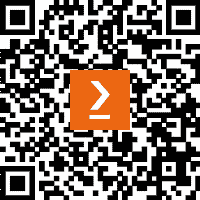

# 前言

Amazon Redshift Serverless 允许组织快速并以经济高效的方式运行 PB 级云数据仓库，使数据科学专业人士能够高效地部署云数据仓库并利用易于使用的工具来训练模型和运行预测。本实用指南将帮助与 Amazon Redshift 数据仓库一起工作的开发人员和数据专业人士将他们的 SQL 知识应用于训练和部署机器学习模型。

本书首先帮助您探索 Redshift Serverless 的内部工作原理以及数据分析的基础和数据机器学习的类型。通过逐步解释基本概念和实际示例，您将学习如何构建自己的分类和回归模型。随着您的进步，您将了解如何使用熟悉的 SQL 代码部署各种类型的机器学习项目，然后深入探讨 Redshift ML。在最后一章中，您将发现实施与 Redshift 结合的最佳实践。

在本书结束时，您将能够配置和部署 Amazon Redshift Serverless，使用 Amazon Redshift ML 训练和部署机器学习模型，并运行大规模的推理查询。

# 本书面向的对象

使用 Amazon Redshift 并希望探索其机器学习功能的数据科学家和机器学习开发者会发现这本 definitive guide 非常有帮助。需要具备对

要充分利用本书，需要具备机器学习技术和 Amazon Redshift 的实际操作知识。

# 本书涵盖的内容

*第一章**，Amazon Redshift Serverless 简介*，概述了 Amazon Redshift 和 Redshift Serverless，指导您如何在几分钟内开始使用并使用 Redshift Query Editor v2 进行连接。您将创建一个示例数据库并使用笔记本功能运行查询。

*第二章**，在 Redshift Serverless 上数据加载和分析*，帮助您学习不同的机制来高效地将数据加载到 Redshift Serverless 中。

*第三章**，在您的数据仓库中应用机器学习*，介绍了机器学习及其在数据仓库中应用的常见用例。

*第四章**，利用 Amazon Redshift 机器学习*，基于*第三章*。在这里，我们深入探讨 Amazon Redshift ML，了解其工作原理以及如何利用它来解决用例。

*第五章**，构建您的第一个机器学习模型*，让您亲自动手使用 Amazon Redshift ML 并使用简单的`CREATE` `MODEL`语法构建第一个模型。

*第六章**，构建分类模型*，涵盖了分类问题以及您可以在 Amazon Redshift ML 中使用来解决这些问题的算法，并学习如何在用户指导下创建模型。

*第七章**，构建回归模型*，帮助您确定问题是否涉及回归，并探讨了 Amazon Redshift ML 中用于训练和构建回归模型的不同方法。

*第八章**，使用 K-Means 聚类构建无监督模型*，展示了如何使用未标记的数据构建机器学习模型，并使用 K-means 聚类在观测级别进行预测。

*第九章**，使用 Redshift ML 进行深度学习*，涵盖了在 Amazon Redshift ML 中使用 MLP 模型类型对非线性可分数据进行深度学习的使用。

*第十章**，使用 XGBoost 创建自定义 ML 模型*，展示了如何使用 Amazon Redshift ML 的自动关闭选项来准备数据，以便构建自定义模型。

*第十一章**，在数据库推理中使用您自己的模型*，超越了 Redshift ML 模型。到目前为止，本书中我们将仅在 Amazon Redshift ML 中直接构建的模型上运行推理查询。本章展示了您如何利用在 Amazon Redshift ML 之外构建的模型，并在 Amazon Redshift ML 内部执行推理查询。

*第十二章**，在数据仓库中进行时间序列预测*，深入探讨了使用 Amazon Forecast 与 Amazon Redshift ML 的集成进行预测和时间序列数据。

*第十三章**，操作和优化 Amazon Redshift ML 模型*，通过展示刷新模型、创建模型版本以及优化 Amazon Redshift ML 模型的技术来结束本书。

# 为了充分利用本书

您需要访问 AWS 账户来执行本书中的代码示例。您要么需要管理员访问权限，要么需要与管理员合作创建用于本书的 Redshift Serverless 数据仓库以及 IAM 用户、角色和策略。

| **本书涵盖的软件/硬件** | **操作系统要求** |
| --- | --- |
| AWS CLI（可选） | Windows、macOS 或 Linux |

**如果您使用的是本书的电子版，我们建议您亲自输入代码或从本书的 GitHub 仓库（下一节中提供链接）获取代码。这样做将有助于您避免与代码复制和粘贴相关的任何潜在错误** **。**

# 下载示例代码文件

您可以从 GitHub 下载此书的示例代码文件[`github.com/PacktPublishing/Serverless-Machine-Learning-with-Amazon-Redshift`](https://github.com/PacktPublishing/Serverless-Machine-Learning-with-Amazon-Redshift)。如果代码有更新，它将在 GitHub 仓库中更新。

我们还有其他来自我们丰富的书籍和视频目录的代码包可供选择，请访问[`github.com/PacktPublishing/`](https://github.com/PacktPublishing/)。查看它们！

# 使用的约定

本书使用了多种文本约定。

`文本中的代码`: 表示文本中的代码单词、数据库表名、文件夹名、文件名、文件扩展名、路径名、虚拟 URL、用户输入和 Twitter 昵称。以下是一个示例：“将下载的`WebStorm-10*.dmg`磁盘映像文件作为系统中的另一个磁盘挂载。”

代码块设置如下：

```py
cnt = client.execute_statement(Database='dev',
    Sql='Select count(1) from chapter2.orders;',
    WorkgroupName=REDSHIFT_WORKGROUP)
query_id = cnt["Id"]
```

当我们希望您注意代码块中的特定部分时，相关的行或项目将以粗体显示：

```py
SHOW MODEL chapter5_buildfirstmodel.customer_churn_model;
```

任何命令行输入或输出都应如下编写：

```py
$ pip install pandas
```

**粗体**: 表示新术语、重要单词或屏幕上看到的单词。例如，菜单或对话框中的单词以粗体显示。以下是一个示例：“从**管理**面板中选择**系统信息**。”

小贴士或重要提示

看起来是这样的。

# 联系我们

我们始终欢迎读者的反馈。

**一般反馈**: 如果您对此书的任何方面有疑问，请通过 mailto:customercare@packtpub.com 发送电子邮件，并在邮件主题中提及书名。

**勘误**: 尽管我们已经尽一切努力确保内容的准确性，但错误仍然可能发生。如果您在此书中发现错误，我们将不胜感激，如果您能向我们报告，我们将不胜感激。请访问[www.packtpub.com/support/errata](http://www.packtpub.com/support/errata)并填写表格。

**盗版**: 如果您在互联网上以任何形式遇到我们作品的非法副本，如果您能提供位置地址或网站名称，我们将不胜感激。请通过 mailto:copyright@packt.com 与我们联系，并提供材料的链接。

如果您有兴趣成为作者：如果您在某个主题上具有专业知识，并且您有兴趣撰写或为书籍做出贡献，请访问[authors.packtpub.com](http://authors.packtpub.com)。

# 分享您的想法

读完《使用 Amazon Redshift ML 的无服务器机器学习》后，我们非常乐意听到您的想法！请[点击此处直接进入此书的 Amazon 评论页面](https://packt.link/r/1-804-61928-0)并分享您的反馈。

您的评论对我们和科技社区非常重要，并将帮助我们确保我们提供高质量的内容。

# 下载此书的免费 PDF 副本

感谢您购买此书！

您喜欢在路上阅读，但无法随身携带您的印刷书籍吗？您的电子书购买是否与您选择的设备不兼容？

别担心，现在，每购买一本 Packt 书籍，您都可以免费获得该书的 DRM 免费 PDF 版本。

在任何地方、任何设备上阅读。从您最喜欢的技术书籍中搜索、复制和粘贴代码到您的应用程序中。

优惠远不止这些，您还可以获得独家折扣、时事通讯和每日免费内容的每日电子邮件。

按照以下简单步骤获取优惠：

1.  扫描下面的二维码或访问以下链接



https://packt.link/free-ebook/978-1-80461-928-5

1.  提交您的购买证明

1.  就这样！我们将直接将您的免费 PDF 和其他优惠发送到您的电子邮件。

# 第一部分：Redshift 概述：开始使用 Redshift Serverless 和机器学习简介

在整个组织中获得机器学习的益处需要访问数据、易于使用的工具以及内置算法，无论个人在机器学习方面的经验水平如何，任何人都可以使用。

*第一部分*展示了开始使用 Amazon Redshift Serverless 和 Amazon Redshift ML 是多么容易，而无需管理数据仓库基础设施。

在第一部分结束时，您将了解如何使用 Query Editor v2 笔记本运行查询以及将数据加载到 Amazon Redshift Serverless 的不同技术。然后，您将介绍机器学习，并了解您如何在数据仓库中使用机器学习。

本部分包括以下章节：

+   *第一章**，Amazon Redshift Serverless 简介*

+   *第二章**，在 Redshift Serverless 上数据加载和分析*

+   *第三章**，在您的数据仓库中应用机器学习*
