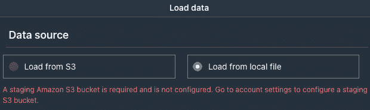

# 2

# 在 Redshift Serverless 上加载数据和分析

在上一章中，我们向您介绍了**Amazon Redshift Serverless**，并演示了如何从 Amazon Redshift 控制台创建无服务器端点。我们还解释了如何使用**Amazon Redshift 查询编辑器 v**连接和查询您的数据仓库。在本章中，我们将更深入地探讨您可以将数据加载到 Amazon Redshift Serverless 数据仓库的不同方法。

在本章中，我们将涵盖三个主要主题，以帮助您高效地将数据加载到 Redshift Serverless 中。首先，我们将演示如何使用 Amazon Redshift 查询编辑器 v 加载数据，您将学习如何使用 GUI 将数据从您的 Amazon S3 存储桶和本地数据文件加载到您的计算机上。

接下来，我们将详细探讨`COPY`命令，您将学习如何通过编写`COPY`命令来加载数据。我们将涵盖您需要了解的所有内容，以有效地使用此命令并将数据顺利加载到 Redshift Serverless 中。

最后，我们将介绍内置的本地 API 接口，使用 Jupyter Notebook 访问和将数据加载到您的 Redshift Serverless 端点。我们将指导您完成设置和使用**Redshift** **数据 API**的过程。

主题如下：

+   使用 Amazon Redshift 查询编辑器 v 加载数据

+   使用 COPY 命令从 Amazon S3 加载数据

+   使用 Redshift 数据 API 加载数据

本章的目标是让您掌握使用不同机制将数据加载到 Amazon Redshift Serverless 的知识和技能。到本章结束时，您将能够使用本章介绍的方法快速有效地将数据加载到 Redshift Serverless 中，这将使您能够对数据进行分析并提取有价值的见解。

# 技术要求

本章需要网络浏览器以及访问以下内容：

+   一个 AWS 账户

+   Amazon Redshift

+   Amazon Redshift 查询编辑器 v2

+   Amazon SageMaker for Jupyter Notebook

本章中的代码片段可在本书的 GitHub 仓库中找到：[`github.com/PacktPublishing/Serverless-Machine-Learning-with-Amazon-Redshift/tree/main/CodeFiles/chapter2`](https://github.com/PacktPublishing/Serverless-Machine-Learning-with-Amazon-Redshift/tree/main/CodeFiles/chapter2).

本章中使用的数据文件可以在本书的 GitHub 仓库中找到：[`github.com/PacktPublishing/Serverless-Machine-Learning-with-Amazon-Redshift/tree/main/DataFiles/chapter2`](https://github.com/PacktPublishing/Serverless-Machine-Learning-with-Amazon-Redshift/tree/main/DataFiles/chapter2).

# 使用 Amazon Redshift 查询编辑器 v2 加载数据

Query Editor v2 支持不同的数据库操作，包括 **数据定义语言** (**DDL**)，只需点击一下按钮即可创建架构和表，并从数据文件中加载数据。让我们看看如何执行这些任务，以便在您的数据仓库上轻松进行数据分析。登录到您的 AWS 控制台，导航到您的 Amazon Redshift Serverless 端点，并选择 **查询数据**。这将在新标签页中打开 **Redshift 查询编辑器 v2**。按照我们在 *第一章* 中遵循的步骤，登录到您的数据库并执行以下小节中概述的任务。

## 创建表

Query editor v2 提供了一个向导来执行图 *图 2**.1* 中显示的 DDL 命令。首先，让我们创建一个名为 `chapter2` 的新架构：

1.  点击 **创建** 并选择 **架构**，如图所示。


图 2.1 – 创建向导

确保您的 `chapter2`。

1.  然后，点击 **创建架构**，如图 *图 2**.2* 所示。


图 2.2 – 创建架构

一旦创建了架构，导航到 `customer` 中的 `chapter2`。使用 Query Editor v2，您可以手动输入列名及其数据类型，或者可以使用数据文件自动推断列名及其数据类型。

让我们使用数据文件创建一个表。我们将使用 `customer.csv`，该文件可在本书的 GitHub 仓库中找到，网址为 [`github.com/PacktPublishing/Serverless-Machine-Learning-with-Amazon-Redshift/tree/main/DataFiles/chapter2`](https://github.com/PacktPublishing/Serverless-Machine-Learning-with-Amazon-Redshift/tree/main/DataFiles/chapter2)。您可以将此文件本地下载以使用向导创建表。

该文件包含 `TPC-H` 数据集的子集，可在本书的 GitHub 仓库中找到：[`github.com/awslabs/amazon-redshift-utils/tree/master/src/CloudDataWarehouseBenchmark/Cloud-DWB-Derived-from-TPCH`](https://github.com/awslabs/amazon-redshift-utils/tree/master/src/CloudDataWarehouseBenchmark/Cloud-DWB-Derived-from-TPCH)。

在 **创建表** 向导中，在 **列** 选项卡下点击 **从 CSV 加载**，并提供 CSV 文件的路径。一旦选择了文件，架构将从文件中推断并自动填充，如图 *图 2**.3* 所示。可选地，您可以在 **列名**、**数据类型**和**编码**字段中修改架构，在**列选项**下，您可以选择以下选项：

+   为列选择一个默认值。

+   可选地，如果您想使列值递增，可以打开 **自动递增**。如果启用此选项，则可以指定 **自动递增种子** 和 **自动递增步长** 的值。

+   为列输入一个大小值。

+   您还可以定义约束，例如 **非空**、**主键**和**唯一键**。


图 2.3 – 创建表

此外，如图**图 2**.4 所示，在**表详情**选项卡下，您可以可选地设置表属性，例如**分布键**、**分布样式**、**排序键**和**排序类型**。当这些选项未设置时，Redshift 将为您选择默认设置，即**自动分布键**和**自动** **排序键**。


图 2.4 – 表详情

Amazon Redshift 根据表的分布样式（`DISTSTYLE`）在表中分布数据。数据行根据每个计算节点上的切片数量在各个计算节点内分布。当您对表运行查询时，计算节点的所有切片并行处理分配的行。作为一个最佳实践（[`docs.aws.amazon.com/redshift/latest/dg/c_best-practices-best-dist-key.html`](https://docs.aws.amazon.com/redshift/latest/dg/c_best-practices-best-dist-key.html)），选择表的`DISTSTYLE`参数以确保数据的均匀分布，或使用自动分布。

Amazon Redshift 使用表的排序键在每个切片内排序数据。Amazon Redshift 还允许您定义具有复合排序键、交错排序键或没有排序键的表。作为一个最佳实践（[`docs.aws.amazon.com/redshift/latest/dg/c_best-practices-sort-key.html`](https://docs.aws.amazon.com/redshift/latest/dg/c_best-practices-sort-key.html)），根据您的数据访问模式定义排序键和样式。在表上定义适当的排序键可以极大地提高您的查询性能。

最后，在**其他选项**下，您可以选择以下内容：

+   是否将您的表包含在自动和手动快照中

+   是否创建基于会话的临时表而不是永久数据库表

一旦您已输入所有详细信息，您可以通过单击**在编辑器中打开查询**来查看您表的 DDL。您可以使用它稍后或甚至与其他用户共享。

现在，让我们通过单击**创建表**按钮（*图 2**.4*）来创建我们的表。

如您所见，任何数据科学家、分析师或用户都可以使用此向导创建数据库对象（如表），而无需编写 DDL 或输入每一列的数据类型及其长度。

现在，让我们在客户表中加载数据。查询编辑器 v2 允许您从 Amazon S3 或您计算机上的本地文件加载数据。请注意，在撰写本文时，加载本地文件选项目前仅支持最大大小为 5 MB 的 CSV 文件。

## 从 Amazon S3 加载数据

查询编辑器 v2 允许您将 Amazon S3 存储桶中的数据加载到现有的 Redshift 表中。

`COPY`命令，它真正使数据分析师或数据科学家的工作变得更简单，因为他们不需要记住`COPY`命令的复杂性。您可以使用`COPY`命令支持的多种文件格式加载数据，例如 CSV、JSON、Parquet、Avro 和 Orc。有关所有支持的数据格式，请参阅此链接：[`docs.aws.amazon.com/redshift/latest/dg/copy-parameters-data-format.html#copy-format`](https://docs.aws.amazon.com/redshift/latest/dg/copy-parameters-data-format.html#copy-format)。

让我们看看如何使用`customer.csv`加载数据，该文件存储在以下 Amazon S3 位置：s3://packt-serverless-ml-redshift/chapter02/customer.csv。

注意，如果您想使用自己的 Amazon S3 存储桶来加载数据，那么请从*技术要求*部分中提到的 GitHub 位置下载数据文件。

要从 GitHub 下载数据文件，导航到您的仓库，选择文件，在文件顶部右键单击**查看原始文件**按钮，选择**另存为…**（如以下截图所示），选择您要在计算机上保存文件的路径，然后选择**保存**：


图 2.5 – 保存数据文件

在查询编辑器 v2 中，单击**加载数据**，这将打开数据加载向导。

在**数据源**下，选择**从 S3 加载**单选按钮。您可以在您的账户中浏览 S3 存储桶以选择要加载数据的文件或文件夹，或者您可以选择一个清单文件。对于这个练习，粘贴上述 S3 文件位置。

如果数据文件位于与您的 Amazon Redshift Serverless 不同的区域，您可以从 S3 文件位置下拉菜单中选择源区域。如果您想加载 Parquet 文件，向导会提供不同的选项。然后，从**文件格式**选项中选择一个选项，或者在**文件**选项下，如果您数据由不同的字符分隔，可以选择**分隔符**。如果您的文件已压缩，您可以从下拉菜单中选择适当的压缩方式，例如**gzip**、**lzop**、**zstd**或**bzip2**。

在**高级设置**下，请注意有两个选项，**数据转换参数**和**加载操作**：

+   在`TIMEFORMAT`)中将它设置为`‘MM.DD.YYYY HH:MI:SS'`。有关完整参数列表，请参阅此文档链接：[`docs.aws.amazon.com/redshift/latest/dg/copy-parameters-data-conversion.html#copy-timeformat`](https://docs.aws.amazon.com/redshift/latest/dg/copy-parameters-data-conversion.html#copy-timeformat)。

+   在`COMPROWS`)中将它设置为`1,000,000`。有关完整选项列表，请参阅此文档：[`docs.aws.amazon.com/redshift/latest/dg/copy-parameters-data-load.html`](https://docs.aws.amazon.com/redshift/latest/dg/copy-parameters-data-load.html)。

由于我们的文件包含标题行，请确保在 **高级设置** | **数据转换参数** | **常用参数** 下，**忽略标题行（作为 1）** 选项被选中。

如 **图 2**.6 所示，选择 **目标表** 参数和 **IAM 角色** 以加载数据：


图 2.6 – 加载数据

一旦您在编辑器中点击 `COPY` 命令并运行 `COPY` 语句开始加载。

现在我们已经加载数据，让我们快速验证加载并查询表来检查数据，如下所示：


图 2.7 – 查询数据

Query Editor v2 允许您在编辑器中保存查询以供以后使用。您可以通过点击 `COPY` 命令）在将来执行，假设目标表相同，但 Amazon S3 上的数据位置不同，那么您可以轻松修改此查询并快速加载数据。或者，您甚至可以将查询参数化，例如，将 S3 位置作为 `${s3_location}` 传递，如 **图 2**.8 所示：


图 2.8 – 保存查询

分享查询

使用 Query Editor v2，您可以与您的团队共享您保存的查询。这样，许多用户可以协作并共享相同的查询。内部，Query Editor 管理查询版本，因此您可以跟踪更改。有关更多信息，请参阅此 AWS 文档：[`docs.aws.amazon.com/redshift/latest/mgmt/query-editor-v2-team.html#query-editor-v2-query-share`](https://docs.aws.amazon.com/redshift/latest/mgmt/query-editor-v2-team.html#query-editor-v2-query-share)。

现在我们已经介绍了 Query Editor v2 如何通过点击几个按钮的 UI 界面轻松创建数据库对象并加载数据，让我们深入了解 Amazon Redshift 的 `COPY` 命令，以便将数据加载到您的数据仓库中。

## 从本地驱动器加载数据

Query Editor v2 允许用户从他们的计算机上的本地文件加载数据并进行快速分析。通常，数据库用户如数据分析师或数据科学家在他们的本地计算机上拥有他们想要快速加载到 Redshift 表中的数据文件，而无需将文件移动到远程位置，如 Amazon S3。

为了从本地文件加载数据，Query Editor v2 要求在您的账户中配置一个暂存 Amazon S3 存储桶。如果没有配置，您将看到类似于以下截图中的错误：



图 2.9 – 错误消息

为了避免前面的错误，用户必须进行以下配置：

1.  账户用户必须配置适当的权限，如下所示。将以下策略附加到您的 Redshift Serverless IAM 角色。替换高亮显示的资源名称：

    ```py
    {
    ```

    ```py
        "Version": "2012-10-17",
    ```

    ```py
        "Statement": [
    ```

    ```py
            {
    ```

    ```py
                "Effect": "Allow",
    ```

    ```py
                "Action": [
    ```

    ```py
                    "s3:ListBucket",
    ```

    ```py
                    "s3:GetBucketLocation"
    ```

    ```py
                ],
    ```

    ```py
                "Resource": [
    ```

    ```py
                    "arn:aws:s3:::<staging-bucket-name>"
    ```

    ```py
                ]
    ```

    ```py
            },
    ```

    ```py
            {
    ```

    ```py
                "Effect": "Allow",
    ```

    ```py
                "Action": [
    ```

    ```py
                    "s3:PutObject",
    ```

    ```py
                    "s3:GetObject",
    ```

    ```py
                    "s3:DeleteObject"
    ```

    ```py
                ],
    ```

    ```py
                "Resource": [
    ```

    ```py
                    "arn:aws:s3:::<staging-bucket-name>[/<optional-prefix>]/${aws:userid}/*"
    ```

    ```py
                ]
    ```

    ```py
            }
    ```

    ```py
        ]
    ```

    ```py
    }
    ```

1.  您的管理员必须在**账户设置**窗口中配置通用的 Amazon S3 存储桶，如图所示：

    1.  点击设置图标()并选择**账户设置**，如图下截图所示：


图 2.10 – 账户设置

1.  在**账户设置**窗口中，在**常规设置** | **S3 存储桶** | **S3 URI**下，输入将在本地文件加载期间用于暂存的 S3 存储桶的 URI，然后点击**保存**。确保您的 IAM 角色具有在 S3 存储桶上读取和写入的权限：


图 2.11 – 在常规设置下输入 S3 存储桶的 URI

请参阅此文档以获取完整信息：

[`docs.aws.amazon.com/redshift/latest/mgmt/query-editor-v2-loading.html#query-editor-v2-loading-data-local`](https://docs.aws.amazon.com/redshift/latest/mgmt/query-editor-v2-loading.html#query-editor-v2-loading-data-local)

### 创建表并从本地 CSV 文件加载数据

让我们创建一个新的表。导航到查询编辑器 v2，并使用以下 DDL 命令创建供应商表：

```py
CREATE TABLE chapter2.supplier (
    s_suppkey integer NOT NULL ENCODE raw distkey,
    s_name character(25) NOT NULL ENCODE lzo,
    s_address character varying(40) NOT NULL ENCODE lzo,
    s_nationkey integer NOT NULL ENCODE az64,
    s_phone character(15) NOT NULL ENCODE lzo,
    s_acctbal numeric(12, 2) NOT NULL ENCODE az64,
    s_comment character varying(101) NOT NULL ENCODE lzo,
    PRIMARY KEY (s_suppkey)
) DISTSTYLE KEY
SORTKEY (s_suppkey);
```

我们将从以下 GitHub 位置的数据文件(`supplier.csv`)将数据加载到我们的供应商表中：[`github.com/PacktPublishing/Serverless-Machine-Learning-with-Amazon-Redshift/blob/main/DataFiles/chapter2/supplier.csv`](https://github.com/PacktPublishing/Serverless-Machine-Learning-with-Amazon-Redshift/blob/main/DataFiles/chapter2/supplier.csv)。

要在您的本地计算机上下载文件，请右键单击**原始**并点击**另存为**。

为了从查询编辑器 v2 将数据加载到供应商表中，点击您本地驱动器上的`supplier.csv`文件。在**目标表**选项下，将**模式**设置为**chapter2**，将**表**设置为**supplier**。点击**加载数据**以开始加载：


图 2.12 – 加载数据向导

一旦数据成功加载，您将看到如下消息：


图 2.13 – 数据成功加载后的消息

通过运行以下 SQL 查询验证数据加载：

```py
select * from chapter2.supplier;
```

您应该能够看到从文件中加载的 100 行数据：


图 2.14 – 数据加载验证

我们现在已成功从下一节的查询编辑器 v2 `COPY` 命令中加载数据。

# 使用 COPY 命令从 Amazon S3 加载数据

数据仓库通常设计用于摄取和存储大量数据，任何分析过程的关键方面之一是以最有效的方式摄取这些大量数据。加载数据可能需要很长时间，同时也会消耗大量计算资源。如前所述，有几种方法可以在您的 Redshift 无服务器数据仓库中加载数据，其中最快和最可扩展的方法之一是`COPY`命令。

`COPY`命令通过并行从文件加载数据，利用 Redshift 的**大规模并行处理**（**MPP**）架构。它可以从 Amazon S3、Amazon EMR、Amazon DynamoDB 或远程主机上的文本文件加载数据。这是在 Redshift 数据仓库中加载数据最有效的方法。通过适当的 IAM 策略，您可以安全地控制谁可以访问和加载数据库中的数据。

在前面的部分，我们看到了如何使用 Query Editor v2 生成`COPY`命令从向导加载数据。在本节中，我们将深入探讨如何编写`COPY`命令并从 Amazon S3 加载数据，以及一些最佳实践。

让我们来看看如何使用`COPY`命令将数据加载到您的 Redshift 数据仓库中：

```py
COPY table-name
[ column-list ]
FROM data_source
authorization
[ [ FORMAT ] [ AS ] data_format ]
[ parameter [ argument ] [, ... ] ]
```

`COPY`命令需要三个参数：

+   `table-name`：数据库中存在的目标表名（持久或临时）

+   `data_source`：数据源位置（例如 S3 存储桶）

+   `authorization`：认证方法（例如 IAM 角色）

默认情况下，`COPY`命令的源数据格式预期为以字符分隔的 UTF-8 文本文件，默认分隔符为管道字符（`|`）。如果您的源数据是其他格式，您可以将其作为参数传递以指定数据格式。Amazon Redshift 支持不同的数据格式，如固定宽度文本文件、字符分隔文件、CSV、JSON、Parquet 和 Avro。

此外，`COPY`命令提供了可选参数来处理数据转换，例如数据格式、`null`和编码。要获取最新详细信息，请参阅此 AWS 文档：[`docs.aws.amazon.com/redshift/latest/dg/r_COPY.html#r_COPY-syntax`](https://docs.aws.amazon.com/redshift/latest/dg/r_COPY.html#r_COPY-syntax)。

## 从 Parquet 文件加载数据

在前面的部分，我们尝试将 CSV 文件加载到我们数据库中的客户表中。为此练习，让我们尝试加载一种列式数据格式文件，如 Parquet。我们将使用`TPC-H`数据的一个子集，可能在这里找到：[`github.com/awslabs/amazon-redshift-utils/tree/master/src/CloudDataWarehouseBenchmark/Cloud-DWB-Derived-from-TPCH/3TB`](https://github.com/awslabs/amazon-redshift-utils/tree/master/src/CloudDataWarehouseBenchmark/Cloud-DWB-Derived-from-TPCH/3TB)。

TPC 是一个专注于开发数据基准标准的组织。您可以在[`www.tpc.org/default5.asp`](https://www.tpc.org/default5.asp)了解更多关于 TPC 的信息。

修改后的数据（`lineitem.parquet`）可在 GitHub 上找到：[`github.com/PacktPublishing/Serverless-Machine-Learning-with-Amazon-Redshift/tree/main/DataFiles/chapter2`](https://github.com/PacktPublishing/Serverless-Machine-Learning-with-Amazon-Redshift/tree/main/DataFiles/chapter2)。

`COPY`命令所需的数据在此处可用：`s3://packt-serverless-ml-redshift/chapter02/lineitem.parquet`。

此文件包含大约 600 万行，大小约为 200 MB：

1.  让我们先从在`chapter2`模式中创建一个名为`lineitem`的表开始：

    ```py
    -- Create lineitem table
    ```

    ```py
    CREATE TABLE chapter2.lineitem
    ```

    ```py
    (l_orderkey     bigint,
    ```

    ```py
    l_partkey       bigint,
    ```

    ```py
    l_suppkey       integer,
    ```

    ```py
    l_linenumber    integer,
    ```

    ```py
    l_quantity      numeric(12,2),
    ```

    ```py
    l_extendedprice numeric(12,2),
    ```

    ```py
    l_discount      numeric(12,2),
    ```

    ```py
    l_tax           numeric(12,2),
    ```

    ```py
    l_returnflag    character(1),
    ```

    ```py
    l_linestatus    character(1),
    ```

    ```py
    l_shipdate      date,
    ```

    ```py
    l_commitdate    date,
    ```

    ```py
    l_receiptdate   date,
    ```

    ```py
    l_shipinstruct  character(25),
    ```

    ```py
    l_shipmode      character(10),
    ```

    ```py
    l_comment       varchar(44))
    ```

    ```py
    distkey(l_orderkey) compound sortkey(l_orderkey,l_shipdate);
    ```

1.  现在，让我们使用`COPY`命令从`lineitem.parquet`文件加载数据：

    ```py
    COPY chapter2.lineitem
    ```

    ```py
    FROM 's3://packt-serverless-ml-redshift/chapter02/lineitem.parquet'
    ```

    ```py
    IAM_ROLE default
    ```

    ```py
    FORMAT AS PARQUET;
    ```

现在我们已经加载数据，让我们快速验证加载并查询表来检查数据，如下面的截图所示：


图 2.15 – 查询表

在本节中，我们讨论了`COPY`命令如何帮助您从 Amazon S3 存储桶加载数据，例如 CSV、Parquet 和 JSON 格式。让我们看看您如何自动化`COPY`命令，以便在 Amazon S3 存储桶中数据可用时立即加载数据。撰写本文时，自动化`COPY`作业的下一节正处于公开预览阶段。

## 使用`COPY`作业自动化文件摄取

在您的数据仓库中，数据持续从 Amazon S3 摄取。之前，您通过外部或本地编写自定义代码，并使用调度工具来实现这种持续的数据摄取。借助 Amazon Redshift 的自动复制功能，用户可以轻松自动化从 Amazon S3 到 Amazon Redshift 的数据摄取。为此，您将编写一个简单的 SQL 命令来创建`COPY`作业（[`docs.aws.amazon.com/redshift/latest/dg/r_COPY-JOB.html`](https://docs.aws.amazon.com/redshift/latest/dg/r_COPY-JOB.html)），并且当它检测到源 Amazon S3 路径中的新文件时，`COPY`命令将自动触发。这将确保用户在数据到达 S3 路径后不久即可获得最新数据以进行处理，而无需构建外部自定义框架。

要开始，您可以设置一个`COPY`作业，如下所示，或者通过添加`JOB CREATE`参数来修改现有的`COPY`命令：

```py
COPY <table-name>
FROM 's3://<s3-object-path>'
[COPY PARAMETERS...]
JOB CREATE <job-name> [AUTO ON | OFF];
```

让我们分解一下：

+   `job-name`是作业的名称

+   `AUTO ON | OFF`表示从 Amazon S3 加载数据是否自动加载到 Amazon Redshift 表中

如您所见，`COPY`作业是`COPY`命令的扩展，并且默认启用了`COPY`作业的自动摄取。

如果你想运行一个`COPY`作业，你可以通过运行以下命令来完成：

```py
COPY JOB RUN job-name
```

对于最新详情，请参阅此 AWS 文档：[`docs.aws.amazon.com/redshift/latest/dg/loading-data-copy-job.html`](https://docs.aws.amazon.com/redshift/latest/dg/loading-data-copy-job.html)。

## `COPY`命令的最佳实践

以下最佳实践将帮助您充分利用`COPY`命令：

+   通过将数据分割成多个压缩文件或在目标表上定义分布键来充分利用并行处理，就像我们在示例中所做的那样。

+   使用单个 `COPY` 命令从多个文件加载数据。如果你使用多个并发 `COPY` 命令从多个文件加载数据到同一个目标表，那么加载数据是串行的，这比单个 `COPY` 命令慢得多。

+   如果你的数据文件包含不均匀或匹配的列数，请提供列的逗号分隔值列表。

+   当你想从多个数据文件加载数据到单个目标表，并且你的数据文件具有相似的结构但不同的命名约定，或者位于 Amazon S3 桶的不同文件夹中时，请使用清单文件。你可以在一个 JSON 格式的文本文件中提供要加载的文件的完整路径。以下是如何使用清单文件的语法：

    ```py
    copy <table_name> from 's3://<bucket_name>/<manifest_file>'
    ```

    ```py
    authorization
    ```

    ```py
    manifest;
    ```

+   对于 `COPY` 作业，为每个要加载的文件使用唯一的文件名。如果文件已经被处理，并且在此之后进行了任何更改，那么 `COPY` 作业将不会处理该文件，所以请记住重命名更新后的文件。

到目前为止，我们已经看到了在 Amazon Redshift 数据仓库中加载数据的两种方法——使用 Query Editor v2 向导和编写单个 `COPY` 命令来触发临时数据加载。现在让我们看看如何使用 AWS SDK 通过 Redshift 数据 API 加载数据。

# 使用 Redshift 数据 API 加载数据

Amazon Redshift 数据 API 是一个内置的本地 API 接口，用于访问你的 Amazon Redshift 数据库，无需配置任何 **Java 数据库连接** (**JDBC**) 或 **开放数据库连接** (**ODBC**) 驱动程序。你可以通过简单的 API 端点进行数据摄取或查询，无需管理持久连接。数据 API 通过使用 IAM 临时凭证或 AWS Secrets Manager 提供了一种安全的方式来访问你的数据库。它提供了一个安全的 HTTP 端点来异步运行 SQL 语句，这意味着你可以稍后检索结果。默认情况下，你的查询结果会存储 24 小时。Redshift 数据 API 与不同的 AWS SDK 无缝集成，例如 Python、Go、Java、Node.js、PHP、Ruby 和 C++。你还可以将 API 与 AWS Glue 集成以创建 ETL 数据管道，或者使用 AWS Lambda 调用不同的 SQL 语句。

你可以利用 Redshift 数据 API 的许多用例，例如与 AWS Step Functions 的 ETL 调度、基于 Web 服务的应用程序、事件驱动应用程序，以及使用 Jupyter notebooks 访问你的 Amazon Redshift 数据库。如果你只想运行单个 SQL 语句，则可以使用 **AWS 命令行界面** (**AWS CLI**) 或任何编程语言。以下是从 AWS CLI 在 Amazon Redshift Serverless 中执行单个 SQL 语句的示例：

```py
aws redshift-data execute-statement
--WorkgroupName redshift-workgroup-name
--database dev
--sql 'select * from redshift_table';
```

注意，对于 Redshift Serverless，您只需要提供工作组名称和数据库名称。临时用户凭证从 IAM 授权中获取。对于 Redshift Serverless，请将以下权限添加到附加到您的集群 IAM 角色的 IAM 策略中，以访问 Redshift Data API：

```py
redshift-serverless:GetCredentials
```

为了展示您如何使用 Redshift Data API 摄入数据，我们将使用 Jupyter Notebook 执行以下步骤。让我们在我们的 AWS 账户中创建一个笔记本实例。

在控制台主页上，搜索 `Amazon SageMaker`。点击左上角的汉堡图标 ()，然后 **笔记本**，然后 **笔记本实例**。点击 **创建笔记本实例** 并提供必要的输入。一旦笔记本实例投入使用，点击 **打开 Jupyter**。

以下截图显示了一个创建的笔记本实例：


图 2.16 – 创建笔记本实例

本练习的 Jupyter 笔记本可在以下 GitHub 位置找到：[`github.com/PacktPublishing/Serverless-Machine-Learning-with-Amazon-Redshift/blob/main/Chapter2.ipynb`](https://github.com/PacktPublishing/Serverless-Machine-Learning-with-Amazon-Redshift/blob/main/Chapter2.ipynb)。请将此笔记本下载到您的本地计算机并在文件夹中保存。

本练习的数据 (`orders.parquet`) 可在 GitHub 上找到：[`github.com/PacktPublishing/Serverless-Machine-Learning-with-Amazon-Redshift/tree/main/DataFiles/chapter2`](https://github.com/PacktPublishing/Serverless-Machine-Learning-with-Amazon-Redshift/tree/main/DataFiles/chapter2)，以及此 Amazon S3 位置：`s3://packt-serverless-ml-redshift/chapter2/orders.parquet`。

我们将使用 `orders` 数据的一个子集，该数据来自以下位置的 `TPC-H` 数据集：[`github.com/awslabs/amazon-redshift-utils/tree/master/src/CloudDataWarehouseBenchmark/Cloud-DWB-Derived-from-TPCH`](https://github.com/awslabs/amazon-redshift-utils/tree/master/src/CloudDataWarehouseBenchmark/Cloud-DWB-Derived-from-TPCH)。

让我们先按照以下步骤打开下载的笔记本 (`Chapter2.ipynb`)：

1.  在 Jupyter Notebook 登录页面，点击 **上传** 并打开之前下载的笔记本。

1.  笔记本上传后，选择内核 (`conda_python3`)。

注意

Redshift Serverless 需要您的 `boto3` 版本高于 1.24.32。

1.  让我们检查我们的 `boto3` 库版本，如图 *图 2.17* 所示。


图 2.17 – 检查 boto3 版本

如果您想安装一个高于 1.24.32 的特定版本，请参考以下示例：

```py
pip install boto3==1.26.35
```

## 创建表

正如您在 `chapter2.ipynb` 笔记本中看到的，我们提供了逐步说明，以连接到您的 Redshift Serverless 端点并执行必要的操作：

1.  让我们先设置参数并导入此练习所需的必要库。我们将设置以下两个参数：

    +   `REDSHIFT_WORKGROUP`：Redshift Serverless 工作组的名称

    +   `S3_DATA_FILE`：加载数据的源数据文件：

        ```py
        import boto3
        ```

        ```py
        import time
        ```

        ```py
        import pandas as pd
        ```

        ```py
        import numpy as np
        ```

        ```py
        session = boto3.session.Session()
        ```

        ```py
        region = session.region_name
        ```

        ```py
        REDSHIFT_WORKGROUP = '<workgroup name>'
        ```

        ```py
        S3_DATA_FILE='s3://packt-serverless-ml-redshift/chapter2/orders.parquet'
        ```

注意

记住根据 Jupyter 笔记本中的设置设置参数。

1.  为了创建表，我们首先准备我们的 DDL 并将其分配给`table_ddl`变量：

    ```py
    table_ddl = """
    ```

    ```py
    DROP TABLE IF EXISTS chapter2.orders CASCADE;
    ```

    ```py
    CREATE TABLE chapter2.orders
    ```

    ```py
    (o_orderkey     bigint NOT NULL,
    ```

    ```py
    o_custkey       bigint NOT NULL encode az64,
    ```

    ```py
    o_orderstatus   character(1) NOT NULL encode lzo,
    ```

    ```py
    o_totalprice    numeric(12,2) NOT NULL encode az64,
    ```

    ```py
    o_orderdate     date NOT NULL,
    ```

    ```py
    o_orderpriority character(15) NOT NULL encode lzo,
    ```

    ```py
    o_clerk         character(15) NOT NULL encode lzo,
    ```

    ```py
    o_shippriority  integer NOT NULL encode az64,
    ```

    ```py
    o_comment       character varying(79) NOT NULL encode lzo
    ```

    ```py
    )
    ```

    ```py
    distkey(o_orderkey) compound sortkey(o_orderkey,o_orderdate);"""
    ```

1.  使用`boto3`库，我们将连接到 Redshift Serverless 工作组：

    ```py
    client = boto3.client("redshift-data")
    ```

有不同的方法可用于在 Redshift Serverless 端点上执行不同的操作。请在此文档中查看整个列表：[`boto3.amazonaws.com/v1/documentation/api/latest/reference/services/redshift-data.html`](https://boto3.amazonaws.com/v1/documentation/api/latest/reference/services/redshift-data.html)。

1.  我们将使用`execute_statement`方法运行一个 SQL 语句，该语句可以是`BatchExecuteStatement`中的。要获取不同方法和如何使用它们的完整列表，请参阅此 AWS 文档：[`docs.aws.amazon.com/redshift-data/latest/APIReference/Welcome.html`](https://docs.aws.amazon.com/redshift-data/latest/APIReference/Welcome.html)：

    ```py
    client = boto3.client("redshift-data")
    ```

    ```py
    res = client.execute_statement(Database='dev', Sql=table_ddl,                                   WorkgroupName=REDSHIFT_WORKGROUP)
    ```

如前面的代码块所示，我们首先将客户端设置为`redshift-data`，然后调用`execute_statement`连接到 Serverless 端点，使用`Database`名称和`WorkgroupName`。此方法使用临时凭证连接到你的 Serverless 工作组。

我们还将`table_ddl`作为参数传递以创建表。我们将在`chapter2`模式中创建`Orders`表。

1.  当操作成功时，Redshift Data API 会返回一个响应元素，以 JSON 格式作为字典对象。响应元素之一是 SQL 语句标识符。此值是全局唯一的，由 Amazon Redshift Data API 生成。如以下代码所示，我们已经从输出对象`res`中捕获了响应元素`Id`：

    ```py
    query_id = res["Id"]
    ```

    ```py
    print(query_id)
    ```

1.  为了确保你的查询已完成，你可以使用`describe_statement`方法并传递你的`id`语句作为参数。此方法发送响应，其中包含包括查询开始时间、完成时间、查询状态、返回的行数和 SQL 语句的信息。


图 2.18 – 检查查询状态

如*图 2**.18*所示，我们已经捕获了我们运行的语句的状态，并且它发送出状态为`FINISHED`。这意味着我们已经创建了数据库中的表，你可以通过针对该表编写一个简单的`SELECT`语句来验证这一点。

## 使用 Redshift Data API 加载数据

现在，让我们继续将数据加载到这个新创建的表中。你可以使用之前提到的 S3 位置作为源数据。如果你使用不同的 S3 位置，那么请记住替换参数中的路径（`S3_DATA_FILE`）：

1.  让我们编写一个`COPY`命令，如下面的代码块所示。我们将在`load_data`变量中创建`COPY`命令，使用 S3 路径作为参数：

    ```py
    load_data = f"""COPY chapter2.orders
    ```

    ```py
    FROM '{S3_DATA_FILE}'
    ```

    ```py
    IAM_ROLE default
    ```

    ```py
    FORMAT AS PARQUET;"""
    ```

1.  接下来，我们将使用`execute_statement`方法来运行这个`COPY`命令并捕获`id`语句：

    ```py
    res = client.execute_statement(Database='dev', Sql=load_data,
    ```

    ```py
                                  WorkgroupName=REDSHIFT WORKGROUP)
    ```

    ```py
    query_id = res["Id"]
    ```

    ```py
    print(query_id)
    ```

请确保检查查询的状态是否为`FINISHED`。

1.  一旦将状态定义为`FINISHED`，我们将通过运行一个计数查询来验证我们的数据加载，如下所示：

    ```py
    cnt = client.execute_statement(Database='dev', Sql='Select count(1) from chapter2.orders ;', WorkgroupName=REDSHIFT_WORKGROUP)
    ```

    ```py
    query_id = cnt["Id"]
    ```

我们现在将打印结果：


图 2.19 – 计数查询结果

正如你在*图 2**.19*中看到的，我们已经成功加载了 150 万行。

在笔记本中，我们提供了一个组合代码块，展示了如何将这些步骤转换成一个函数，并在需要时调用它来将数据加载到新表中。

我们还有一个 GitHub 仓库([`github.com/aws-samples/getting-started-with-amazon-redshift-data-api/`](https://github.com/aws-samples/getting-started-with-amazon-redshift-data-api/))，展示了如何在不同语言中开始使用 Amazon Redshift Data API，例如 Go、Java、JavaScript、Python 和 TypeScript。你可以通过仓库中解释的逐步过程，使用 Redshift Data API 在这些所有语言中构建你的自定义应用程序。

# 摘要

在本章中，我们展示了如何使用三种不同的工具和方法将数据加载到你的 Amazon Redshift Serverless 数据库中，通过使用查询编辑器 v GUI 界面，Redshift `COPY`命令来加载数据，以及使用 Python 在 Jupyter 笔记本中调用 Redshift Data API。所有三种方法都高效且易于使用，适用于你的不同用例。

我们还讨论了一些关于`COPY`命令的最佳实践，以使其更有效地使用。

在下一章中，我们将从关于 Amazon Redshift 机器学习的第一个主题开始，你将看到如何在你的 Amazon Redshift Serverless 数据仓库中利用它。
