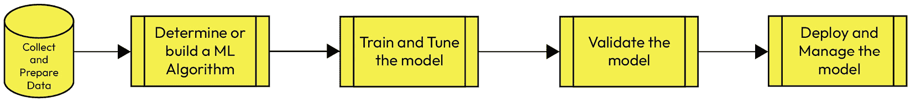

# 3

# 在您的数据仓库中应用机器学习

**机器学习**（**ML**）是当今现代商业世界中组织的一个常规和必要部分。机器学习的起源可以追溯到 20 世纪 40 年代，当时逻辑学家沃尔特·皮茨和神经科学家沃伦·麦克库洛赫试图创建一个能够描绘人类思维过程的神经网络。

组织可以利用他们的数据和机器学习算法来构建一个数学模型，以便做出更快、更明智的决定，而数据对组织今天的价值是无法低估的。数据量将继续快速增长，那些能够最有效地管理其数据进行预测分析和识别趋势的组织将拥有竞争优势、降低成本和增加收入。但为了真正释放这种能力，你必须将机器学习更接近数据，提供不需要深厚数据科学背景的自助工具，并消除不必要的数据处理，以加快将机器学习模型投入管道的时间。

本章将向您介绍机器学习，并讨论在您的数据仓库中应用机器学习的常见用例。您将开始看到*可能的技艺*，并想象如何通过使用 Amazon Redshift ML 更快、更轻松地实现业务成果。我们将引导您了解以下主题：

+   理解机器学习算法的基本知识

+   实施机器学习的传统步骤

+   克服实施机器学习的挑战

+   探索机器学习的益处

# 理解机器学习的基本知识

在本节中，我们将更详细地介绍机器学习，以便你对以下领域有一个一般性的了解：

+   监督学习与无监督学习

+   分类问题

+   回归问题

让我们从监督学习和无监督学习开始。

## 比较监督学习和无监督学习

**监督学习算法**由包含你想要预测的已知结果的数据进行**监督**。机器学习模型从这些已知结果中学习，然后使用这些学习来预测新数据的输出。

数据中的这个已知结果也被称为标签或目标。例如，如果你有一个包含房屋销售信息的数据集，销售价格通常会作为*目标*。

监督学习可以进一步细分为**分类**或**回归**问题。

在**无监督学习**中，机器学习模型必须通过根据相似性、差异和其他模式对数据进行分组来从数据结果中学习，而不需要任何指导或已知结果。

您可以使用无监督算法在数据中找到模式。例如，您可以使用无监督学习进行客户细分，以更有效地针对客户群体。其他用例包括以下：

+   检测异常传感器读数

+   文档标记

利用数据仓库中丰富的数据，你可以轻松开始使用监督学习和无监督学习来训练模型。

让我们深入了解分类和回归问题类型。

## 分类

分类问题是预测类别标签的任务，可以是二分类或多分类：

+   **二分类** – 结果可以是两个可能类别中的一个，例如，预测客户是否会流失，一封电子邮件是否为垃圾邮件，或者感染 COVID-19 后患者是否可能住院。

+   **多分类** – 结果可以是三个或更多可能类别中的一个 – 例如，预测植物物种或新闻文章属于哪个类别。其他多分类用例包括以下内容：

    +   销售预测

    +   智能呼叫路由

    +   广告优化

## 回归

当你有连续值的目标并希望根据输入变量预测一个值时，会使用回归问题。

回归问题是预测连续数值的任务：

+   **线性回归**：使用线性回归，我们可以预测一个数值结果，例如预测一个客户将花费多少或即将到来的音乐会或体育赛事的预测收入。有关更多详细信息，请参阅*第七章*，*构建回归模型*。

+   **逻辑回归**：逻辑回归是解决二分类问题的另一种选择。我们将在*第六章*，*构建分类模型*中展示一些该技术的示例。

回归用例示例包括以下内容：

+   价格和收入预测

+   客户终身价值预测

+   检测客户是否会违约贷款

现在我们将介绍实现机器学习的步骤。

# 实现机器学习的传统步骤

在本节中，你将更好地了解产生最佳机器学习模型所需的关键步骤：

+   数据准备

+   机器学习模型评估

## 数据准备

机器学习中的一个典型步骤是将原始数据转换为训练模型，以便数据科学家和数据分析师可以将机器学习算法应用于数据。你也可能听到**数据清洗**或**特征工程**这些术语。

此步骤是必要的，因为机器学习算法需要输入编号。例如，你可能需要从数据中移除异常值或异常。此外，你可能需要填补缺失的数据值，例如节假日缺失的记录。这有助于提高模型的准确性。

此外，确保你的训练数据集无偏见也很重要。机器学习模型从数据中学习，因此你的训练数据集需要有足够的代表性，以反映人口统计群体。

这里有一些数据准备步骤的示例：

+   **确定模型所需的输入** - 这是识别对机器学习模型结果影响最大的属性的过程。

+   **清理数据** - 纠正数据质量错误，消除重复行和异常数据。您需要调查数据并寻找异常值 - 这需要了解领域知识和业务逻辑的应用。

+   **转换输入特征** - 机器模型需要输入为数值型。例如，当您有非有序数据（如国家或性别数据）时，您将使用一种称为独热编码的技术。这将把分类值转换为二进制值，从而创建更好的分类器，因此模型也更好。但如您稍后所见，当您使用 Redshift ML 的 Auto ML 功能时，这已经为您处理好了。

+   `num_class`（用于多分类）和 XGBoost 模型中的轮数（`num_rounds`）。请注意，Amazon Redshift ML 会自动调整您的模型。

+   **测试数据集** - 这是训练和调整模型后用于评估模型性能的剩余 10%的数据。

传统上，数据准备是一个非常耗时的步骤，也是机器学习复杂的一个原因。如您稍后所见，Amazon Redshift ML 自动化了许多数据准备步骤，以便您可以专注于创建模型。

## 评估机器学习模型

在您创建模型后，您需要计算模型的准确率。当使用 Amazon Redshift ML 时，您将获得一个量化模型准确率的指标。

这里有一些常用的确定模型准确率的方法：

+   **均方误差**（**MSE**）：MSE 是预测值与实际值之间平方差的平均值。它用于衡量回归模型的有效性。MSE 值始终为正：模型在预测实际值方面越好，MSE 值越小。当数据包含异常值时，它们往往会主导 MSE，这可能会造成预测性能不佳。

+   **准确率**：正确分类的项目数与总分类项目数（正确和错误分类）的比例。它用于二分类和多分类。它衡量预测类别值与实际值之间的接近程度。准确率值介于零和一之间：一表示完美准确，零表示完美不准确。

+   **F1 分数**：F1 分数是精确率和召回率的调和平均数。它用于将二分类别（通常称为正类和负类）进行分类。当预测与实际（正确）类别匹配时，称为真预测；当不匹配时，称为假预测。精确率是所有正预测（包括假正例）中真正例的比例，它衡量了预测正类时的预测质量。

+   **F1_Macro** – F1 宏分数将 F1 评分应用于多类分类。在这种情况下，您需要预测多个类别。您只需像在二元分类中对正类那样计算每个类的精确率和召回率。F1 宏分数介于零和一之间：一表示最佳性能，零表示最差。

+   **曲线下面积**（AUC）：AUC 指标用于比较和评估二元分类，例如逻辑回归等返回概率的算法。需要一个阈值将概率映射到分类。相关的曲线是接收者操作特征曲线，该曲线绘制了预测的**真阳性率**（TPR）或召回率与**假阳性率**（FPR）作为阈值值的函数，高于该阈值值，预测被认为是正的。

现在我们更详细地看看这些评估技术中的几个。

### 回归模型评估示例

回归模型的准确率由**均方误差**（MSE）和**均方根误差**（RMSE）来衡量。MSE 是模型数据集中预测值与实际值之间平均平方差的平均值，也称为*真实值*。您可以通过平方实际和预测答案之间的差异，然后取平均值来计算 MSE。MSE 的平方根计算 RMSE。低 MSE 和 RMSE 分数表明模型表现良好。

这里提供了一个简单的方法来计算均方误差（MSE）和均方根误差（RMSE），以便您可以将其与模型生成的 MSE 分数进行比较。假设我们有一个回归模型，预测客户下一个月的酒店预订数量。

按以下方式计算 MSE 和 RMSE：

```py
MSE = (AVG(POWER(( actual_bookings - predicted_bookings)
RMSE = (SQRT(AVG(POWER(( actual_bookings  - predicted_bookings
```

您将在*第七章*中的一个练习中计算回归模型的 MSE 和 RMSE。

一个分类模型可以根据准确率进行评估。准确率方法相当直接，可以通过将预测总数与正确预测总数的百分比来衡量。

### 二元分类评估示例

混淆矩阵对于理解分类模型的性能非常有用，是评估分类模型的一种推荐方法。如果您想了解更多关于这个话题的信息，我们提供了以下详细信息。我们还在*第十章*中提供了一个详细的示例。

混淆矩阵以表格格式呈现，包含四个单元格 – **实际值**构成*x*轴，**预测值**构成*y*轴，单元格表示**真阳性**、**假阳性**、**假阴性**和**真阴性**。这有助于衡量精确率、召回率和**曲线下面积**（AUC）。*图 3.1*显示了简单的混淆矩阵：

|  | **实际值** |  |
| --- | --- | --- |
|  | 真阳性 | 假阳性 |
| **预测值** | 假阴性 | 真阴性 |

图 3.1 – 简单混淆矩阵

在**图 3.2**中，我们的数据集中有 100 条记录用于我们的二元分类模型，我们试图预测客户流失：

|  | 实际值 |  |
| --- | --- | --- |
|  | 10 | 4 |
| 预测值 | 6 | 80 |

图 3.2 – 混淆矩阵

我们可以这样解释模型预测的质量：

+   正确预测了 10 个客户将会流失

+   正确预测了 80 个客户不会流失

+   错误地预测了 4 个客户将会流失

+   错误地预测了 6 个客户不会流失

F1 分数是最重要的评估指标之一，因为它考虑了模型的精确度和回收率。例如，F1 分数为*.92*意味着模型正确预测了 92%的时间。这种方法确保了对两个类别的预测都是好的，并且*不是*只偏向一个类别。

使用我们来自**图 3.2**的混淆矩阵示例，我们可以计算精确度：

精确度 = 10 / (10 + 4)

这也可以写成以下形式：

精确度 = 真阳性  _______________________   (真阳性 + 假阳性)

我们也可以以类似的方式计算回收率：

回收率 = 10 / (10 + 6)

这也可以写成以下形式：

回收率 = 真阳性  _______________________   (真阳性 + 假阴性)

F1 分数结合了精确度和回收率——它可以按以下方式计算：

2 × (精确度 × 回收率 / 精确度 + 回收率)

我们已经向您展示了评估机器学习模型的常用技术。随着我们继续阅读本书，您将看到可以应用于您机器学习评估流程的这些技术示例。

现在您已经学习了机器学习的基础知识，我们将讨论一些实施机器学习时常见的挑战以及如何克服这些挑战。

# 克服实施机器学习当前的挑战

数据增长既是机遇也是挑战，组织正在寻求从他们的数据中提取更多价值。业务线用户、数据分析师和开发者被要求使用这些数据来交付业务成果。这些用户需要易于使用的工具，通常不具备典型数据科学家的技能组合，也没有学习这些技能和成为数据管理专家的充裕时间。中央 IT 部门被分析和数据需求压得喘不过气来，正在寻找解决方案，以提供在易于使用的强大系统之上交付的自服务工具。以下是一些主要挑战：

+   数据更加多样化和快速增长。我们已经从分析千兆字节的数据发展到分析太字节和艾字节的数据。这些数据通常分布在组织中的许多不同的数据存储中。这意味着数据必须导出并转移到另一个平台以训练机器学习模型。Amazon Redshift ML 让您能够使用现有数据训练模型，而无需移动它。

+   数据管理方面的缺乏专业知识影响了有效扩展以跟上数据量和使用量增加的能力。

+   由于数据孤岛和训练模型以及使其可用于预测所需的时间，缺乏敏捷性来快速响应事件和客户升级。

+   缺乏合格的数据科学家来满足今天对机器学习的需求。需求是由改善客户体验、预测未来收入、检测欺诈和提供更好的患者护理等需求驱动的。

考虑以下创建 ML 模型的流程：



图 3.3 – 典型的机器学习工作流程

以下是在 *图 3.3* 中展示的创建 ML 模型的步骤：

1.  首先，我们从数据准备开始。这可能是一个非常耗时的过程，数据可能来自许多不同的来源。这些数据必须被清洗、整理，并分成训练集和测试集。然后，需要将其导出并加载到训练环境中。

1.  然后，您必须知道应该使用哪种 ML 算法，或者您需要训练您的模型。这需要一个熟练使用 R 或 Python 等工具的数据科学家，并具有了解特定问题哪种算法最佳的经验。正如您将在后面的章节中看到的那样，Amazon Redshift ML 可以自动为您确定算法。

1.  然后，您将通过训练、调整和验证模型多次迭代，直到找到最适合您用例的最佳模型。

1.  然后，在部署模型后，您需要持续监控模型的质量，并管理环境，包括扩展硬件以及根据需要应用补丁和升级。

为了减少构建机器学习数据管道所需的时间，我们必须将机器学习与数据更接近，并减少不必要的数据移动。您可以使用我们之前在*第一章*中讨论的数据架构，即以数据仓库为中心的架构。这还包括您的数据湖和其他操作数据存储，这些存储在一起，提供了一个统一视图，您的所有数据都组织有序，并以安全的方式轻松可用。

你可以基于你已构建的分析栈，并让你的数据分析师构建和训练他们自己的模型。所有数据仓库用户都可以在没有数据科学经验的情况下利用机器学习的力量。数据仓库用户可以使用熟悉的 SQL 命令创建、训练和部署机器学习模型。然后，使用 SQL，他们可以使用这些模型来分析来自 Amazon Redshift 的数据。你还可以利用你现有的 Amazon SageMaker 模型，并在 Amazon Redshift 的数据存储上进行推理。数据科学家可以利用 Redshift ML 通过直接通过 Redshift 基准模型来加速迭代。BI 专业人士现在可以直接通过工具如 Amazon QuickSight 运行推理查询。

一旦你在组织中实施机器学习，你将开始获得许多好处，我们将在下一节中进一步探讨。

# 探索机器学习的益处

商业在三个主要领域可以看到机器学习的益处：

+   **增加收入** – 使用机器学习，你可以利用你的数据快速测试新想法，以改善客户体验。例如，使用无监督学习，你可以细分你的客户并发现以前未知的购买模式，这可以推动针对特定产品或订阅提供的针对性营销活动。

+   **提高运营和财务效率** – 机器学习可以增加你业务中的自动化和敏捷性，以便你能更快地应对市场变化。一个例子是更准确地预测产品需求。通过更好地管理库存，组织可以看到巨大的成本节约。

+   **提高应对业务风险的能力** – 使用机器学习，你可以比以前更快地做出决策。通过使用机器学习来检测异常，当你的供应链、产品质量和其他业务领域面临风险时，你可以迅速采取行动。

## 机器学习在数据仓库中的应用

让我们从高层次上看看几个用例，以说明一些这些益处。随后的章节将深入探讨细节：

+   **提升客户体验**：机器学习可以用来减少客户因长时间等待而产生的挫败感。聊天机器人可以快速回答许多客户问题，在某些情况下，甚至可以回答他们所有的问题：

    +   **个性化**：机器学习可以用来更好地理解客户的行为和购买历史，以便根据他们的兴趣向客户提供更相关的产品。

    +   **情感分析**：机器学习可以用来理解来自社交媒体平台的客户情绪。这种分析可以用于营销活动和客户保留工作。

+   **预测设备维护**：考虑任何拥有车队或设备的公司。这可能是一家包裹递送公司或必须适当维护的服务提供商公司。没有机器学习，设备可能被过早或过于频繁地维修，这会导致更高的成本，或者设备可能被过晚维修，导致设备无法使用。

您可以使用机器学习来预测每辆车或设备需要维护的最佳时间，以最大化运营效率。

+   **金融分析**：银行和投资公司使用机器学习进行自动化、风险评估、投资组合分配等等：

    +   **计算信用评分** – 机器学习可以快速计算信用评分并批准贷款，从而降低风险。

    +   **欺诈检测** – 机器学习可以快速扫描大量数据集以检测异常，标记交易并自动拒绝或批准交易。根据交易的性质，系统可以自动拒绝提款或购买，直到人类做出决定。

+   **体育产业**：赛车队可以使用模型来预测成功的最佳策略和最有效的维修站策略：

    +   通过预测未来表现来构建更强大的团队阵容

    +   通过预测未来伤害来提高球员安全

+   **医疗保健行业**：通过结合机器学习与历史患者和治疗记录，以及预测成功率最高的治疗方案来早期检测健康状况。

这些只是机器学习的一些益处。可能性是无限的，而且进步正在不断进行。随着我们进入后续章节，您将看到一些实际的应用案例，您可以在自己的环境中尝试，并开始构建您的机器学习技能集。

# 摘要

在本章中，我们向您介绍了如何将机器学习应用于数据仓库，并解释了机器学习的基本概念。我们还讨论了如何克服实施机器学习所面临的挑战，以便您能在组织中享受到机器学习的益处。

这些益处有助于增加收入、提高运营效率以及更好地应对不断变化的企业环境。在本章之后，您现在对在数据仓库中可以部署的使用案例和模型类型有了基础的了解。

在下一章中，我们将向您介绍 Amazon Redshift ML 以及如何开始实现业务成果。

# 第二部分：开始使用 Redshift ML

*第二部分*从 Amazon Redshift ML 的概述开始，然后深入探讨如何使用 Amazon Redshift ML 创建各种机器学习模型。

在第二部分结束时，您将了解如何通过简单地运行 SQL 命令来创建模型，了解监督学习和无监督学习之间的区别，以及如何解决分类、回归和聚类问题。

本部分包括以下章节：

+   *第四章*，*利用 Amazon Redshift 机器学习*

+   *第五章*，*构建您的第一个机器学习模型*

+   *第六章*，*构建分类模型*

+   *第七章*，*构建回归模型*

+   *第八章*，*使用 K-Means 聚类构建无监督模型*
