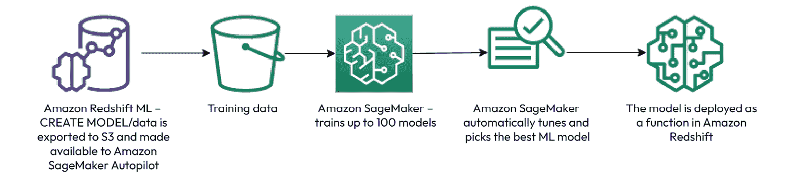
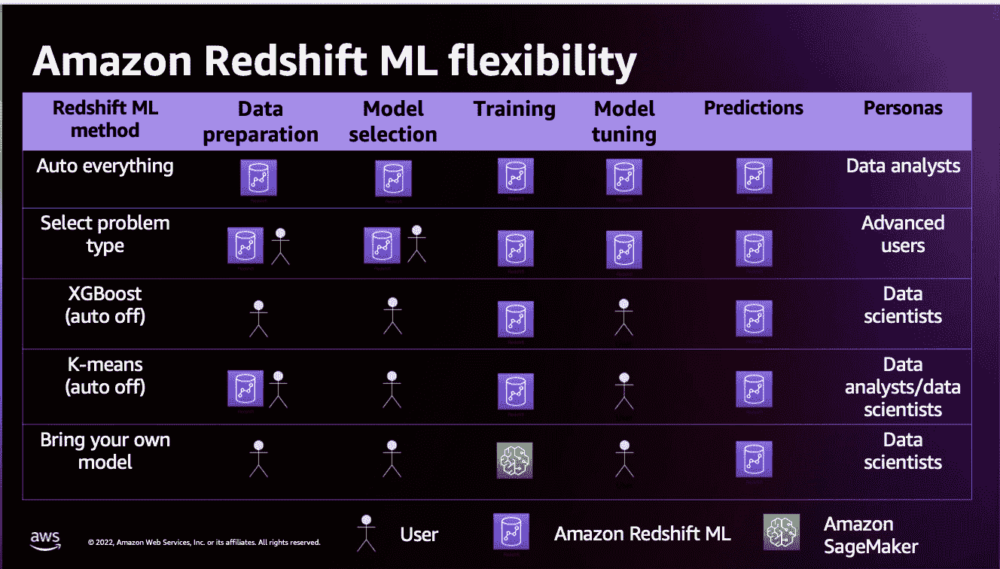
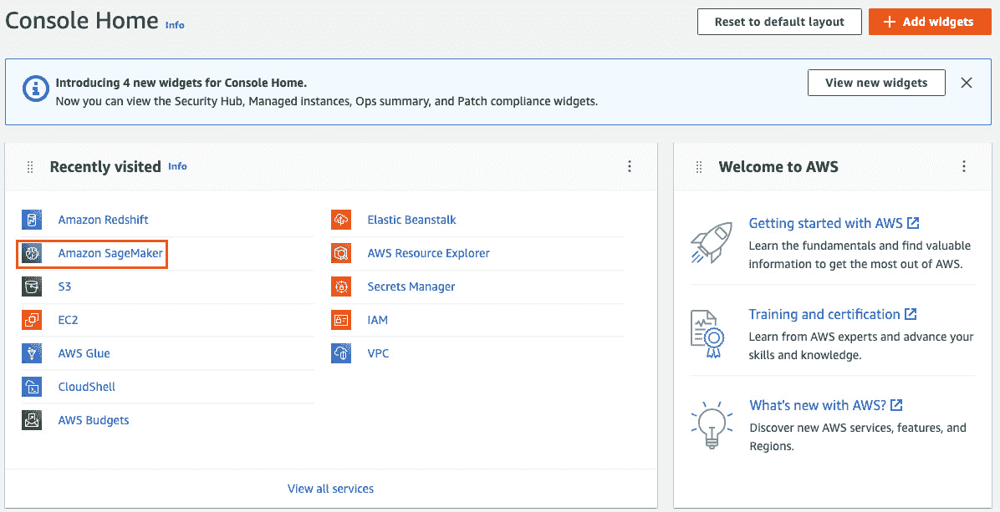
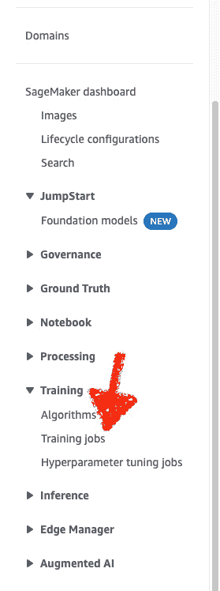
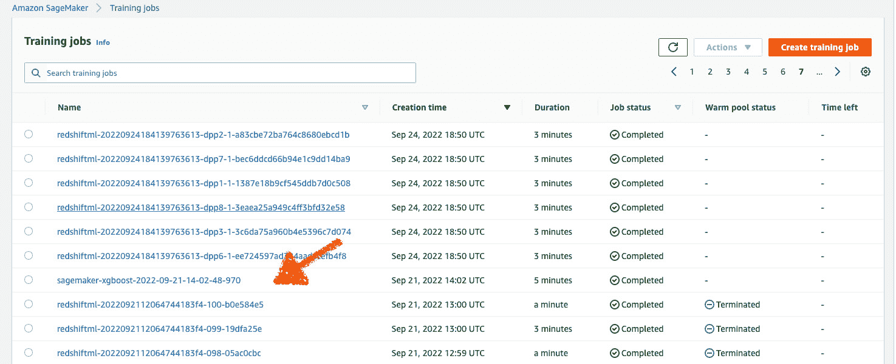
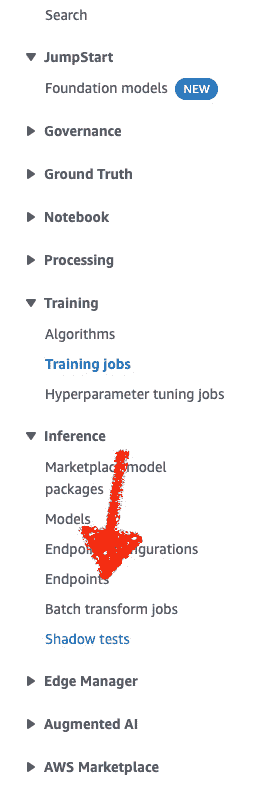
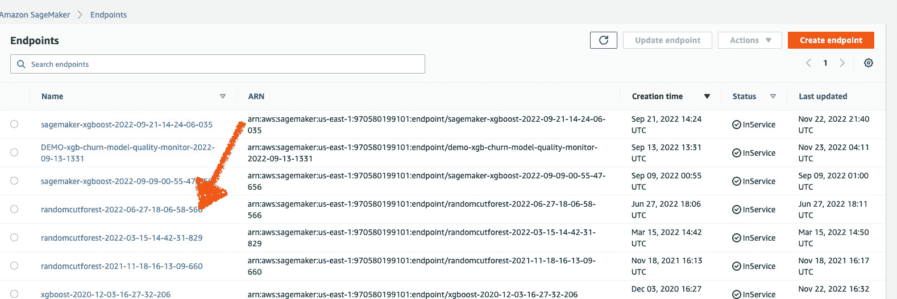

# 利用 Amazon Redshift ML

在上一章中，我们讨论了**机器学习**（ML）的整体优势以及它如何融入您的数据仓库。

在本章中，我们将专门探讨如何利用**Amazon Redshift ML**来解决各种用例。这些示例旨在为您在从*第五章*开始的实际训练模型过程中提供所需的基础。我们将展示 Redshift ML 的优势，例如消除数据移动、能够使用简单的 SQL 创建模型，以及大幅减少训练新模型和使其可用于推理所需的时间。此外，您还将了解 Amazon Redshift ML 如何通过以下主要主题在幕后利用**Amazon SageMaker**自动训练您的模型：

+   为什么选择 Amazon Redshift ML？

+   Amazon Redshift ML 简介

+   创建模型概述

# 为什么选择 Amazon Redshift ML？

Amazon Redshift ML 让您能够通过简单的 SQL 命令创建和训练 ML 模型，无需构建专门的技能。这意味着您的数据分析师、数据工程师和 BI 分析师现在可以利用他们的 SQL 技能进行 ML，这增加了敏捷性，因为他们不再需要等待 ML 专家来训练他们的模型。

此外，由于您在数据仓库中使用模型，您不再需要将数据导出用于训练，或者在使用模型进行预测后将数据导入仓库。

您无需担心数据治理的管理。当您导出数据用于训练时，数据永远不会离开您的 VPC。

您可以控制谁可以创建模型以及谁可以在这些模型上运行推理查询。

Amazon Redshift ML 为训练和使用模型提供了一个非常经济高效的解决方案。Amazon SageMaker 资源的成本基于您的训练数据集中的单元格数，这是训练集行数和列数的乘积。

使用 Amazon Redshift Serverless 运行预测查询的成本基于您的查询使用的计算能力。

要了解更多关于 Amazon Redshift Serverless 成本的信息，请参阅此处[`docs.aws.amazon.com/redshift/latest/mgmt/serverless-billing.html`](https://docs.aws.amazon.com/redshift/latest/mgmt/serverless-billing.html)。

您可以通过限制用于训练模型的数据量以及控制训练时间来控制模型训练的成本。我们将在*创建模型*概述部分稍后展示这一示例。

当您运行预测查询时，所有预测都在您的 Redshift 数据仓库中本地计算。这使得您能够实现非常高的吞吐量和低延迟。

# Amazon Redshift ML 简介

通过利用 Amazon Redshift ML，你的组织可以实现许多好处。首先，你可以消除不必要的数据移动，用户可以使用熟悉的 SQL 命令，并且与 Amazon SageMaker 的集成是透明的。

让我们定义一些你将在剩余章节中看到的术语：

+   **创建模型**：这是一个将包含用于将数据导出以用于训练你的模型的 SQL 命令的命令。

+   **特征**：这些是在你的数据集中用作训练模型输入的属性。

+   **目标**：这是你数据集中你想要预测的属性。这有时也被称为**标签**。

+   **推理**：这也被称为**预测**。在 Amazon Redshift ML 中，这是执行查询以获取由你的模型生成的预测值的流程。

为了能够创建和访问你的 ML 模型在 Amazon Redshift 中运行预测查询，你需要对模型对象授予权限，就像你在其他数据库对象（如表、视图或函数）上所做的那样。

假设你已经创建了一个名为`analyst_cm_role`的角色，允许一组用户创建模型。超级用户可以按照以下方式授予此角色的权限：

```py
GRANT CREATE MODEL to role analyst_cm_role
```

拥有`CREATE MODEL`权限的用户/组/角色可以在你的服务器端点或 Redshift 集群中的任何模式中创建模型，如果用户有该模式的`CREATE`权限。Redshift ML 模型是模式层次结构的一部分，类似于表、视图、存储过程和用户定义的函数。假设我们有一个名为`demo_ml`的模式。你可以使用以下`GRANT`语句授予`demo_ml`模式上的`CREATE`和`USAGE`权限给分析师角色：

```py
GRANT CREATE, USAGE ON SCHEMA demo_ml TO role analyst_cm_role
```

现在，假设我们有一个名为`analyst_prediction_role`的角色，允许一组用户运行预测查询。你可以使用以下方式授予在模型上运行预测的访问权限：

```py
GRANT EXECUTE ON MODEL demo_ml.customer_churn_auto_model TO role analyts_prediction_role
```

创建模型的数据源可以是 Redshift 或任何其他你可以从 Redshift 访问的源，包括通过 Spectrum 或其他使用 Redshift 联合查询功能的源访问的**Amazon Simple Storage Service**（**Amazon S3**）S3 数据湖。在撰写本文时，支持 Amazon Aurora 和 Amazon RDS for PostgreSQL 和 MySQL。更多详细信息请参阅[`docs.aws.amazon.com/redshift/latest/dg/federated-overview.html`](https://docs.aws.amazon.com/redshift/latest/dg/federated-overview.html)。

Amazon Redshift ML 和 Amazon SageMaker 管理所有数据转换、权限和资源使用。然后，由 SageMaker Neo 编译训练好的模型，并在 Amazon Redshift 中以用户定义的函数的形式提供，以便用户可以使用简单的 SQL 进行预测。

一旦你的模型经过训练并作为 Amazon Redshift 中的函数可用，你就可以大规模和高效地运行预测查询，本地在 Amazon Redshift 中。

请参见*图 4*.1 中的流程图：



图 4.1 – Redshift ML 创建模型流程

现在，让我们更详细地介绍如何使用`CREATE` `MODEL`语句。

# 创建模型的概述

`CREATE MODEL`语句在处理您可能需要的各种用例时提供了灵活性。主要有四种类型的`CREATE` `MODEL`语句：

+   自动化一切

+   `AUTO`与用户指导，用户可以提供问题类型

+   `AUTO OFF`，用户提供了定制选项

+   **自带** **模型** (**BYOM**)

*图 4**.2*展示了使用 Amazon Redshift ML 训练模型时的灵活性：



图 4.2 – Amazon Redshift ML 的灵活性

在本章中，我们将概述各种类型的`CREATE MODEL`语句。后续章节将提供如何创建所有不同类型模型的深入示例，如何将数据加载到 Redshift，以及如何将您的数据分割成训练集和测试集。

在本节中，我们将向您介绍创建模型时可用的选项以及您可以指定的可选参数。本章中的所有示例都是信息性的，旨在为您准备后续章节。您将在*第五章*中创建您的第一个模型。

## 自动化一切

当您执行`CREATE MODEL`命令以使用`AUTO`一切来解决监督学习问题时，Amazon Redshift ML 和 Amazon SageMaker 将为您管理所有数据预处理、模型训练和模型调优。数据将从 Amazon Redshift 导出到 Amazon S3，在那里 SageMaker 将训练和调整多达 100 个模型。**SageMaker Autopilot**将自动确定算法和问题类型。然后，最佳训练模型将由 SageMaker Neo 编译，并在 Amazon Redshift 中作为用户定义的函数提供，以便用户可以使用简单的 SQL 进行预测。

以下是一个`AUTO`一切模型语法的示例：

```py
CREATE MODEL model_name
    FROM { table_name | ( select_query ) }
    TARGET column_name
    FUNCTION prediction_function_name
    IAM_ROLE { default }
    SETTINGS (
      S3_BUCKET 'bucket',
      [ MAX_CELLS integer ]
    )
```

您只需提供要用于训练的数据的表名或 SQL 语句，以及您试图预测的`TARGET`列。

让我们用一个简单的例子来应用这个方法。假设我们有一个名为`reservation_history`的表，其中包含酒店预订数据，我们想要确定客人是否有可能取消即将到来的预订：

```py
CREATE TABLE reservation_history (
customerid bigint ,
city character varying(50),
reservation_date timestamp without time zone,
loyalty_program character (1),
age bigint,
marital_status character (1),
cancelled character (1)
)
DISTSTYLE AUTO;
```

`CREATE MODEL`语句将看起来像这样（请注意，这仅用于信息；您不需要运行此命令）：

```py
CREATE MODEL predict_guest_cancellation
    FROM reservation_history
    TARGET cancelled
    FUNCTION predict_cancelled_reservation
    IAM_ROLE default
    SETTINGS (
      S3_BUCKET '<<your-s3-bucket>>'
)
```

在这个`CREATE MODEL`语句中，我们只提供了所需的最小参数，即`IAM_ROLE`和`S3_BUCKET`。`TARGET`参数被标记为`cancelled`，这是我们根据发送给`CREATE MODEL`语句的输入尝试预测的内容。在这个例子中，我们发送了`reservation_history`表中的所有内容。`FUNCTION`名称是描述将用于后续预测的函数的描述。`IAM_ROLE`参数将附加到您的无服务器端点，并提供对 SageMaker 和`CREATE MODEL`语句的访问。请参阅*第二章*，其中我们展示了如何设置 IAM 角色。

Amazon SageMaker 将自动确定这是一个二元分类模型，因为我们的`TARGET`只能有两个可能的值。Amazon SageMaker 还将选择最佳模型类型。在撰写本文时，支持监督学习的模型类型如下：

+   `XGBoost`：基于梯度提升树算法

+   `Linear Learner`：提供提高解决分类或回归问题速度的能力

+   `MLP`：使用多层感知器的深度学习算法

您将在后续章节中使用这些模型中的每一个来创建模型。

## 自动加用户指导

对于对机器学习有良好理解的更高级用户，可能希望向模型提供更多输入，例如`model_type`、`problem_type`、`preprocessors`和`objective`。

使用我们的预订示例，我们将利用`AUTO`功能并指定一些额外的参数：

+   `MODEL_TYPE`: `XGBoost`

+   `PROBLEM_TYPE`: `binary_classification`

+   `Objective`: `F1`

+   `S3_GARBAGE_COLLECT` – `OFF`：如果设置为`OFF`，用于训练模型的生成的数据集将保留在 Amazon S3 中，并可被用于其他目的，例如故障排除

+   `MAX_RUNTIME` – `1800`：这是通过将训练时间限制为`1800`秒来控制模型训练成本的一种方式；默认值为`5400`秒

通过指定`MODEL_TYPE`和/或`PROBLEM_TYPE`以及`Objective`参数，您可以缩短训练模型所需的时间，因为 SageMaker 不需要确定这些参数。以下是一个`CREATE MODEL`语句的示例：

```py
CREATE MODEL predict_guest_cancellation
    FROM reservation_history
    TARGET cancelled
    FUNCTION predict_cancelled_reservation
    IAM_ROLE default
    MODEL_TYPE XGBoost
    PROBLEM_TYPE BINARY CLASSIFICATION
    OBJECTIVE 'F1'
    SETTINGS (
      S3_BUCKET '<<your-S3-bucket>>',
      MAX_RUNTIME 1800
);
```

注意

增加最大运行时间`MAX_RUNTIME`和最大单元格数`MAX_CELLS`通常可以通过让 SageMaker 探索更多候选者来提高模型质量。如果您希望加快数据集的迭代或探索速度，请减少`MAX_RUNTIME`和`MAX_CELLS`。如果您希望提高模型的准确性，请增加`MAX_RUNTIME`和`MAX_CELLS`。

如果已知，指定问题类型和目标是一个好习惯，可以缩短训练时间。为了提高模型准确性，如果可能的话，提供更多数据，并包括任何可能影响目标变量的特征（输入）。

此外，您可以通过指定转换器来添加自己的预处理器。截至编写本文时，Amazon Redshift ML 支持 10 个转换器，包括 `OneHotEncoder`、`Ordinal Encoder` 和 `StandardScaler`。您可以在以下位置找到完整的列表：[`docs.aws.amazon.com/redshift/latest/dg/r_create_model_use_cases.html#r_user_guidance_create_model`](https://docs.aws.amazon.com/redshift/latest/dg/r_create_model_use_cases.html#r_user_guidance_create_model)。

Amazon Redshift ML 存储训练好的转换器，并将其作为预测查询的一部分自动应用。在从您的模型生成预测时，您无需指定它们。

以 `OneHotEncoder` 为例，它用于将诸如 `country` 或 `gender` 这样的分类值转换为数值（二进制向量），以便机器学习算法可以更好地进行预测。让我们创建一个模型，使用独热编码对输入列 `marital_status` 和 `loyalty_program` 进行编码。请注意，此模型仅作为示例，您无需运行此语句：

```py
 CREATE MODEL predict_guest_cancellation
    FROM reservation_history
    TARGET cancelled
    FUNCTION predict_cancelled_reservation
    IAM_ROLE default
    MODEL_TYPE XGBoost
    PROBLEM_TYPE BINARY CLASSIFICATION
    OBJECTIVE 'F1'
    PREPROCESSORS '[
      {"ColumnSet": [
        "loyalty_program",
        "marital_status"
        ],
        "Transformers" :[
           "OneHotEncoder"
            ]
         ]
        }
     ]'
    SETTINGS (
      S3_BUCKET '<<your-S3-bucket>>',
      MAX_RUNTIME 1800
);
```

到目前为止，我们展示的所有 `CREATE MODEL` 示例都使用了 `AUTO ON`。如果您未指定此参数，则这是默认设置。现在，让我们继续了解如何使用 `AUTO OFF` 和 XGBoost 进行自己的模型调整。

## XGBoost (AUTO OFF)

作为一名机器学习专家，您有使用 `CREATE MODEL` 语句的 `AUTO OFF` 选项进行超参数调整的选项。这使您拥有完全控制权，Amazon Redshift ML 不会尝试发现最佳预处理器、算法和超参数。

让我们看看使用我们的示例预订数据集的 `CREATE MODEL` 语法是什么样的。

我们将指定以下参数：

+   `AUTO OFF`：关闭自动发现预处理器、算法和超参数

+   `MODEL_TYPE`:- `xgboost`

+   `OBJECTIVE`: `'binary:logistic'`

+   `PREPROCESSORS`: `'none'`

+   `HYPERPARAMETERS`: `DEFAULT` `EXCEPT(NUM_ROUND '100'/)`

请参考以下链接以获取 XGBoost 的超参数列表：[`docs.amazonaws.cn/en_us/redshift/latest/dg/`](https://docs.amazonaws.cn/en_us/redshift/latest/dg/)。

```py
r_create_model_use_cases.html#r_auto_off_create_model
```

就本文所述，`'none'` 是使用 `AUTO OFF` 时为 `PREPROCESSORS` 指定的唯一可用选项。由于我们无法指定独热编码，我们可以使用 SQL 中的 case 语句来应用此选项：

```py
CREATE MODEL predict guest_cancellation
    FROM
        (Select customerid,
       city,
       reservation_date,
       case when loyalty_program = 'Y' then 1 else 0 end as loyalty_program_y,
       case when loyalty_program = 'N' then 1 else 0 end as loyalty_program_n,
       age,
       case when marital_status = 'Y' then 1 else 0 end as married,
       case when marital_status = 'N' then 1 else 0 end as not_married,
       cancelled
       from reservation_hitory)
    TARGET cancelled
    FUNCTION predict_cancelled_reservation
    IAM_ROLE default
    AUTO OFF
    MODEL_TYPE XGBoost
    OBJECTIVE 'binary:logistic'
    PREPROCESSORS 'none'
    HYPERPARAMETERS DEFAULT EXCEPT (NUM_ROUND '100')
    SETTINGS (
      S3_BUCKET 'bucket',
      MAX_RUNTIME 1800
);
```

在 *第十章* 中，您将使用 `AUTO OFF` 构建 XGBoost 模型，并更好地理解此选项。

现在，让我们看看使用 K-means 算法的另一个 `AUTO OFF` 选项。

## K-means (AUTO OFF)

K-means 算法用于将未标记的数据分组在一起。由于此算法在您的数据中发现了分组，因此它解决了一个“*无监督*”学习问题。

如果我们想要对 `reservation_history` 数据进行分组，让我们看看一个示例 `CREATE MODEL` 是什么样的：

+   `AUTO OFF`：关闭自动发现预处理器、算法和超参数

+   `MODEL_TYPE`: `KMEANS`

+   `PREPROCESSORS`: `OPTIONAL`（在撰写本文时，Amazon Redshift 支持 `StandScaler`、`MinMax` 和 `NumericPassthrough` 用于 `KMEANS`）

+   `HYPERPARAMETERS`: `DEFAULT EXCEPT (K 'N')`，其中 `N` 是您想要创建的集群数量

这里是一个 `CREATE MODE``L` 语句的示例。请注意，您不会运行此语句：

```py
CREATE MODEL guest_clusters
    FROM
        (Select
        city,
        reservation_date,
        loyalty_program,
        age,
        marital_status
        from reservation_hitory)
    FUNCTION get_guest_clusters
    IAM_ROLE default
    AUTO OFF
    MODEL_TYPE KMEANS
    PREPROCESSORS 'none'
    HYPERPARAMETERS DEFAULT
    EXCEPT (K '5')
    SETTINGS (
      S3_BUCKET '<<your-S3-bucket>>'
);
```

注意，我们使用此模型创建了五个集群。在使用 K-means 算法时，尝试不同的集群数量很重要。在 *第八章* 中，您将深入了解创建 K-means 模型以及如何验证最佳集群。

现在，让我们看看如何使用在 Amazon Redshift ML 之外构建的模型运行预测查询。

## BYOM

此外，您还可以使用在 Amazon Redshift 之外训练的模型，通过 Amazon SageMaker 在 Amazon Redshift 中进行本地或远程推理。

### 本地推理

当模型在 Amazon SageMaker 之外训练时，使用本地推理。这允许您在 Amazon Redshift 内运行推理查询，而无需重新训练模型。

假设我们之前的示例是构建一个用于预测客户是否会取消预订的模型，该模型是在 Amazon Redshift 之外训练的。我们可以将该模型带到 Redshift，然后运行推理查询。

我们的 `CREATE MODEL` 示例将如下所示：

+   `model_name`: 这是您希望在 Redshift 中为本地模型指定的名称

+   `FROM`: 这是来自 Amazon SageMaker 的 `job_name` – 您可以在 Amazon SageMaker 下的 **训练作业** 中找到它

+   `FUNCTION`: 要创建的函数的名称以及输入数据类型

+   `RETURNS`: 函数返回值的类型：

    ```py
    CREATE MODEL predict_guest_cancellation_local_inf
    ```

    ```py
        FROM 'sagemaker_job_name'
    ```

    ```py
        FUNCTION predict_cancelled_reservation_local(bigint, varchar, timestamp, char, bigint, char)
    ```

    ```py
        RETURNS char
    ```

    ```py
        IAM_ROLE default
    ```

    ```py
        SETTINGS (
    ```

    ```py
          S3_BUCKET '<<your-S3-bucket>>' );
    ```

注意，`FUNCTION` 中的数据类型与我们的 `reservation_history` 表中的数据类型匹配，而 `RETURNS` 与我们的 `TARGET` 变量的数据类型匹配，该变量为 `cancelled`。

您可以通过访问 AWS 管理控制台并进入 SageMaker 来获取 SageMaker 的 `JobName`：



图 4.3 – 控制台首页

点击 **Amazon SageMaker** 后，点击 **训练作业**，如图 *图 4**.4* 所示：



图 4.4 – 训练作业

接下来，请注意您希望用于本地推理的模型的工作名称，这就是您将在 `CREATE MODEL` 语句中放入的内容（见 *图 4**.5*）：



图 4.5 – 训练作业名称

### 远程推理

如果您在 SageMaker 中创建了一个算法模型，而该算法在 Amazon Redshift ML 中不可用，则远程推理很有用。例如，可以使用 SageMaker 中的随机切割森林算法进行异常检测。您可以创建一个引用 SageMaker 模型端点的模型，然后在 Amazon Redshift 中运行异常检测。

我们的 `CREATE MODEL` 示例将如下所示：

+   `model_name`: 你希望在 Redshift 中为本地模型提供的名称

+   `FUNCTION`: 要创建的函数名称以及输入数据类型

+   `RETURNS`: 函数返回值的类型

+   `SAGEMAKER`: Amazon SageMaker 端点的名称：

```py
CREATE MODEL random_cut_forest
FUNCTION remote_fn_rcf(int)
RETURNS decimal(10,6)
SAGEMAKER 'sagemaker_endpoint'
IAM_ROLE  default;
```

注意，`FUNCTION` 中的数据类型是我们发送的输入类型，而 `RETURNS` 是调用函数时接收到的数据类型。

你可以通过导航到 AWS 管理控制台，转到 SageMaker，然后点击 **端点** 来获取 SageMaker 端点：



图 4.6 – 端点

在点击 **端点** 后，如图 *图 4**.6* 所示，你可以看到端点名称，如图 *图 4**.7* 所示：



图 4.7 – 端点名称

然后，注意你希望用于远程推理的模型端点名称，并将其放入你的 `CREATE` `MODEL` 语句中。

你将在 *第十一章* 中深入了解 BYOM，并获得创建用于本地和远程推理的模型的实践经验。

# 摘要

在本章中，我们讨论了为什么 Amazon Redshift ML 是在数据仓库中使用数据进行预测的好选择。

通过将机器学习（ML）引入你的数据仓库，Amazon Redshift ML 使你能够通过将 ML 的力量直接交到你的开发者、数据分析师和 BI 专业人员手中，大大缩短创建和训练模型所需的时间。

你的数据保持安全；它永远不会离开你的 VPC。此外，你可以轻松控制对创建和使用模型的访问。

最后，我们向你展示了在 Redshift ML 中创建模型的不同方法，例如使用 `AUTO`，如何指导模型训练，以及提供超参数的高级方法。

现在，你了解了机器学习如何融入你的数据仓库，如何使用 Redshift ML 的适当安全性和配置指南，以及如何在 Amazon SageMaker 中训练模型。

在下一章中，你将亲自动手，使用 Amazon Redshift ML 创建你的第一个模型，学习如何验证模型，以及如何运行推理查询。
