# 第五章：构建您的第一个机器学习模型

在上一章中，您学习了**Redshift 机器学习**（**ML**）的好处，例如消除数据移动，以及如何使用简单的**结构化查询语言**（**SQL**）命令创建模型。

在本章中，您将使用标准 SQL 方言构建您的第一个机器学习模型。Amazon Redshift 使得使用熟悉的 SQL 方言来训练、部署和运行机器学习模型变得非常容易。这种方法使得不同的数据角色，例如，数据库开发者、数据库工程师和公民数据科学家，能够在不将数据移出他们的数据仓库平台的情况下，并且无需学习新的编程语言的情况下，训练和构建机器学习模型变得容易。

在本章中，您将了解使用 Amazon Redshift ML 简单 CREATE MODEL，它使用`CREATE MODEL`命令和用于评估您的 ML 模型的不同方法。

在本章中，为了构建您的第一个机器学习模型，我们将探讨以下主要主题：

+   Redshift ML 简单 CREATE MODEL

+   评估模型性能

# 技术要求

本章需要网络浏览器和以下内容：

+   一个 AWS 账户。

+   一个 Amazon Redshift Serverless 端点。

+   Amazon Redshift 查询编辑器 v2。

+   完成在*第一章*中的“Amazon Redshift Serverless 入门”部分。

您可以在此处找到本章中使用的代码：[`github.com/PacktPublishing/Serverless-Machine-Learning-with-Amazon-Redshift/`](https://github.com/PacktPublishing/Serverless-Machine-Learning-with-Amazon-Redshift/)

)

本章所需的数据文件位于公共 S3 存储桶中：[s3://packt-serverless-ml-redshift/](https://s3://packt-serverless-ml-redshift/)

)

让我们开始吧！

# Redshift ML 简单 CREATE MODEL

Redshift ML 简单 CREATE MODEL 是 Amazon Redshift 中的一个功能，允许用户使用 SQL 命令创建机器学习模型，无需专业技能或软件。它通过允许用户使用熟悉的 SQL 语法来定义模型结构和输入数据，然后自动生成并使用 Amazon SageMaker 训练模型，从而简化了创建和部署机器学习模型的过程。此功能可用于各种机器学习任务，包括回归、分类和聚类。

在我们深入构建第一个 ML 模型之前，让我们通过定义一个将构成我们模型构建解决方案基础的问题陈述来设定场景。

我们将使用客户销售数据集来构建第一个机器学习模型。虚构的*ABC 公司*的商务领导正面临着销售下降的问题。*ABC 公司*的数据团队已执行描述性和诊断分析，并确定销售下降的原因是客户流失。为了解决这个问题，熟悉 SQL 语言和一些机器学习概念的数据分析师利用了 Redshift ML。商务用户记录了哪些客户已经流失和未流失，并与数据分析师团队合作。

为了解决业务问题，数据分析师首先分析销售数据集。他们将通过 Redshift SQL 命令编写 SQL 聚合查询并创建可视化来了解趋势。然后，数据分析师团队使用 Redshift ML 的简单`CREATE MODEL`命令创建机器学习模型。最后，数据分析师评估模型性能以确保模型有用。

## 上传和分析数据

本章节所使用的数据集位于此处：[s3://packt-serverless-ml-redshift/](https://s3://packt-serverless-ml-redshift/)。我们已修改数据集以更好地满足章节要求。

数据集引用

此数据集归功于加州大学欧文分校机器学习数据集存储库（Jafari-Marandi, R., Denton, J., Idris, A., Smith, B. K., & Keramati, A. (2020). *Optimum Profit-Driven Churn Decision Making: Innovative Artificial Neural Networks in Telecom Industry. Neural Computing* *and Applications*）。

此数据集包含客户流失信息。以下表格列出了数据集的元数据：

| **名称** | **数据类型** | **定义** |
| --- | --- | --- |
| `state` | `varchar(2)` | 客户所在的美国州 |
| `account_length` | `int` | 客户账户长度 |
| `area_code` | `int` | 客户的地区代码或邮政编码 |
| `phone` | `varchar(8)` | 客户的电话号码 |
| `intl_plan` | `varchar(3)` | 国际计划订阅者 |
| `vMail_plan` | `varchar(3)` | 语音邮件计划订阅者 |
| `vMail_message` | `int` | 语音邮件消息订阅者 |
| `day_mins` | `float` | 每日累计分钟数 |
| `day_calls` | `int` | 每日累计通话次数 |
| `day_charge` | `float` | 每日累计费用 |
| `total_charge` | `float` | 总费用 |
| `eve_mins` | `float` | 晚间分钟数 |
| `eve_calls` | `int` | 晚间通话次数 |
| `eve_charge` | `float` | 晚间费用 |
| `night_mins` | `float` | 夜间分钟数 |
| `night_calls` | `int` | 夜间通话次数 |
| `night_charge` | `float` | 夜间费用 |
| `intl_mins` | `float` | 国际分钟数 |
| `intl_calls` | `int` | 国际通话次数 |
| `intl_charge` | `float` | 国际费用 |
| `cust_serv_calls` | `int` | 客户服务通话次数 |
| `churn` | `varchar(6)` | 客户是否流失 |
| `record_date` | `date` | 记录更新日期 |

表 5.1 – 客户通话数据

在成功连接到 Redshift 作为管理员或数据库开发者后，创建架构并将数据加载到 Amazon Redshift 中，如下所示：

1.  导航到 **Redshift 查询编辑器 v2**，连接到 **Serverless:default** 端点，并连接到 **dev** 数据库。

创建一个新的编辑器，并将未命名的查询编辑器保存为 `Chapter5`，如图 *图 5**.1* 所示：

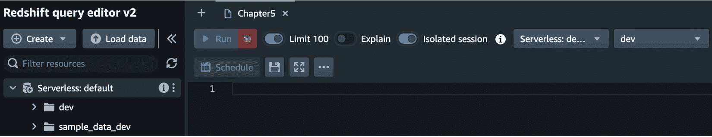

图 5.1 – 连接到查询编辑器 v2

1.  创建一个名为 `Chapter5_buildfirstmodel` 的 Redshift 架构。Redshift 架构包含表、视图和其他命名对象。对于本章，将在该架构中创建表和机器学习模型：

    ```py
    Create schema chapter5_buildfirstmodel;
    ```

1.  创建一个名为 `customer_calls_fact` 的 Redshift 表。此表用于加载包含客户通话信息的数据集。此表在 Redshift 中原生创建，用于训练和验证 Redshift ML 模型：

    ```py
    CREATE TABLE IF NOT EXISTS chapter5_buildfirstmodel.customer_calls_fact (
    ```

    ```py
    state varchar(2),
    ```

    ```py
    account_length int,
    ```

    ```py
    area_code int,
    ```

    ```py
    phone varchar(8),
    ```

    ```py
    intl_plan varchar(3),
    ```

    ```py
    vMail_plan varchar(3),
    ```

    ```py
    vMail_message int,
    ```

    ```py
    day_mins float,
    ```

    ```py
    day_calls int,
    ```

    ```py
    day_charge float,
    ```

    ```py
    total_charge float,
    ```

    ```py
    eve_mins float,
    ```

    ```py
    eve_calls int,
    ```

    ```py
    eve_charge float,
    ```

    ```py
    night_mins float,
    ```

    ```py
    night_calls int,
    ```

    ```py
    night_charge float,
    ```

    ```py
    intl_mins float,
    ```

    ```py
    intl_calls int,
    ```

    ```py
    intl_charge float,
    ```

    ```py
    cust_serv_calls int,
    ```

    ```py
    churn varchar(6),
    ```

    ```py
    record_date date)
    ```

    ```py
    Diststyle AUTO;
    ```

1.  使用以下命令将客户通话数据加载到 Redshift 表中：

    ```py
            COPY  chapter5_buildfirstmodel.customer_calls_fact
    ```

    ```py
    FROM 's3://packt-serverless-ml-redshift/chapter05/customerdime/'
    ```

    ```py
    IAM_ROLE default
    ```

    ```py
    delimiter ',' IGNOREHEADER 1
    ```

    ```py
    region 'eu-west-1';
    ```

我们使用 Redshift `COPY` 命令将数据加载到我们的表中。`COPY` 命令将数据并行加载到 Redshift 表中。你可以使用 `COPY` 命令加载数以千计的数据。

1.  在最后一步，我们将通过创建客户流失直方图来分析客户流失事实表。为此，让我们使用查询编辑器 v2 图表功能来创建直方图图表。为了创建直方图，我们需要统计流失和未流失的客户数量。要获取这些信息，首先，运行以下命令：

    ```py
    SELECT churn, count(*) Customer_Count FROM chapter5_buildfirstmodel.customer_calls_fact
    ```

    ```py
    GROUP BY churn
    ```

    ```py
    ;
    ```

现在，点击 **结果** 窗格右侧的 **图表** 选项，以查看直方图：

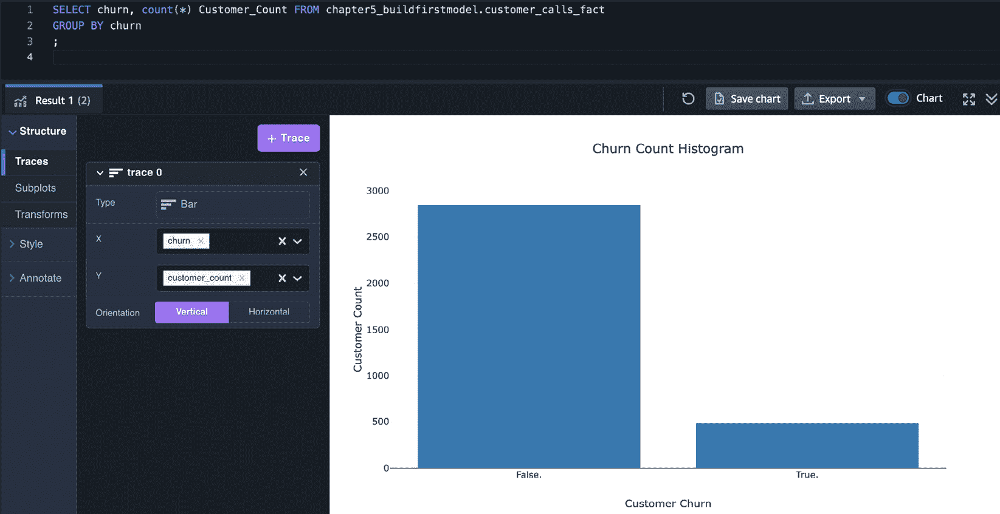

图 5.2 – 流失客户与未流失客户直方图

从前面的图表中，你可以看到 `customer_calls_fact` 表有 **3333** 名客户，其中 **483** 名已经流失。

现在，我们已经分析了数据集，并发现有一些客户已经流失。下一步是创建一个机器学习模型。为此，我们将使用 Redshift ML 简单的 `CREATE` `MODEL` 方法。

# 深入探讨 Redshift ML `CREATE MODEL` 语法

由于这是你第一次使用 `CREATE MODEL` 语法，让我们在这里刷新一下命令的基本结构。

Redshift ML 提供了易于使用的 `CREATE MODEL` 语法来创建机器学习模型。在本节中，我们将重点介绍 `CREATE MODEL` 命令的简单形式。在后面的章节中，你将学习到其他形式的创建模型语句。

简单 `CREATE MODEL` 是 Redshift `CREATE MODEL` 语句的最基本形式。它面向尚未准备好处理机器学习过程所有复杂性的用户。这种模型创建形式也由经验丰富的用户，如公民数据科学家，用于其创建机器学习模型的简单性。数据清洗是任何机器学习问题的一个基本步骤，否则，它遵循“垃圾输入，垃圾输出”的原则。然而，数据清洗仍然是必要的任务，但在 Redshift ML 数据转换、标准化和模型选择将不再必要。

我们使用以下命令进行简单模型创建：

```py
CREATE MODEL model_name
    FROM { table_name | ( select_query ) }
    TARGET column_name
    FUNCTION prediction_function_name
    IAM_ROLE { default }
    SETTINGS (
      S3_BUCKET 'bucket',
      [ MAX_CELLS integer ]
    )
```

在前面的 `CREATE MODEL` 语法中，作为用户，你指定你的数据集 – 在我们的案例中，`customer_calls_fact` – 在 `FROM` 子句中。我们将我们想要预测的目标变量设置为 `churn`，在 `TARGET` 参数中。作为用户，你还需要为该函数命名，你将在选择查询中运行预测时使用该函数。

更多关于简单 `CREATE MODEL` 参数的信息，请参阅以下 Redshift 公共文档：[`docs.aws.amazon.com/redshift/latest/dg/r_create_model_use_cases.html#r_simple_create_model`](https://docs.aws.amazon.com/redshift/latest/dg/r_create_model_use_cases.html#r_simple_create_model

)

我们已经了解了通用的简单 `CREATE MODEL` 语法。现在，让我们为我们的数据集创建语法并运行它。

# 创建你的第一个机器学习模型

最后，我们将构建我们的第一个机器学习模型来预测客户流失事件。由于这是我们第一个机器学习模型，让我们使用简单的 `CREATE MODEL` 命令。此选项使用 Amazon SageMaker Autopilot，这意味着，无需进行构建机器学习模型的繁重工作，你只需提供一个表格数据集并选择要预测的目标列，SageMaker Autopilot 将自动探索不同的解决方案以找到最佳模型。这包括数据预处理、模型训练、模型选择和部署。AutoMode 是默认模式：

1.  Redshift ML 通过 S3 存储桶在 Amazon Redshift 和 SageMaker 之间共享训练数据和工件。如果你还没有，你需要创建一个 S3 存储桶。为此，导航到 Amazon S3 控制台并点击 **创建** **存储桶** 按钮：

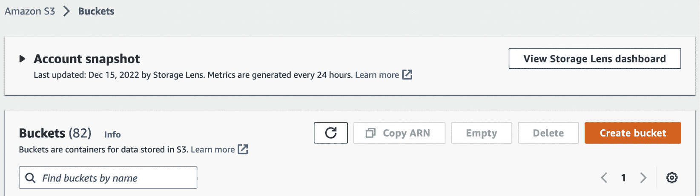

图 5.3 – S3 控制台

1.  在 `serverlessmachinelearningwithredshift-<your account id>` 上，其中 `<your account id>` 是你的 AWS 账号。

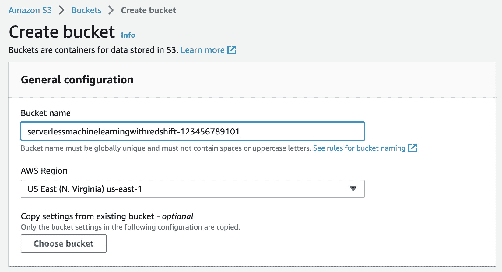

图 5.4 – 创建 S3 存储桶

1.  在我们将数据集发送到 `CREATE MODEL` 命令之前，我们将数据集分成两部分——一部分是训练数据集，用于训练机器学习模型，另一部分是在模型创建后用于测试模型。我们通过过滤 `record_date` 小于 `'2020-08-01'` 的客户记录进行训练，以及 `record_date` 大于 `'2020-07-31'` 的记录进行测试。运行以下查询以检查我们的记录拆分：

    ```py
    select sum(case when record_date <'2020-08-01' then 1 else 0 end) as Training_Data_Set,
    ```

    ```py
    sum(case when record_date >'2020-07-31' then 1 else 0 end) as Test_Data_Set
    ```

    ```py
    from chapter5_buildfirstmodel.customer_calls_fact
    ```

在 *图 5.5* 中，我们可以看到训练集中有 **2714** 条记录，测试集中有 **619** 条记录。

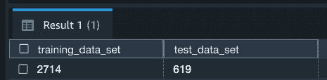

图 5.5 – 训练和测试数据集记录数

我们在训练和测试我们的数据集时应用过滤条件。在下一步中，我们将使用数据集上的这个过滤条件来创建模型。

1.  现在运行以下代码以创建 `customer_churn_model`。请确保将 `<your account id>` 替换为正确的 AWS 账号。请注意，由于我们将使用简单的 `CREATE MODEL`，我们通过 `MAX_RUNTIME` 参数设置了最大允许时间。这是 Autopilot 将花费的最大训练时间。我们将其设置为 1,800 秒，即 30 分钟。如果您未指定 `MAX_RUNTIME` 的值，它将使用默认值 5,400 秒（90 分钟）：

    ```py
    CREATE MODEL chapter5_buildfirstmodel.customer_churn_model
    ```

    ```py
    FROM (SELECT state,
    ```

    ```py
                  account_length,
    ```

    ```py
                  area_code,
    ```

    ```py
                  phone,
    ```

    ```py
                  intl_plan,
    ```

    ```py
                  vMail_plan,
    ```

    ```py
                  vMail_message,
    ```

    ```py
                  day_mins,
    ```

    ```py
                  day_calls,
    ```

    ```py
                  day_charge,
    ```

    ```py
                  total_charge,
    ```

    ```py
                  eve_mins,
    ```

    ```py
                  eve_calls,
    ```

    ```py
                  eve_charge,
    ```

    ```py
                  night_mins,
    ```

    ```py
                  night_calls,
    ```

    ```py
                  night_charge,
    ```

    ```py
                  intl_mins,
    ```

    ```py
                  intl_calls,
    ```

    ```py
                  intl_charge,
    ```

    ```py
                  cust_serv_calls,
    ```

    ```py
                 replace(churn,'.','') as churn
    ```

    ```py
          FROM chapter5_buildfirstmodel.customer_calls_fact
    ```

    ```py
             WHERE record_date < '2020-08-01'
    ```

    ```py
         )
    ```

    ```py
    TARGET churn
    ```

    ```py
    FUNCTION predict_customer_churn
    ```

    ```py
    IAM_ROLE default
    ```

    ```py
    SETTINGS (
    ```

    ```py
      S3_BUCKET 'serverlessmachinelearningwithredshift-<your account id>',
    ```

    ```py
      MAX_RUNTIME 1800
    ```

    ```py
    )
    ```

    ```py
    ;
    ```

让我们更深入地了解前面的命令：

+   `FROM` 子句中的 `SELECT` 查询指定了训练数据

+   `TARGET` 子句指定了 `CREATE MODEL` 语句构建模型以预测的标签所在的列

+   训练查询中的其他列是用于预测流失变量的特征（输入）

+   `predict_customer_churn` 函数是在 `SELECT` 查询中使用的推理函数的名称，用于生成预测

+   `S3_Bucket` 是 Redshift ML 在与 SageMaker 一起工作时保存工件的位置

+   将 `MAX_RUNTIME` 设置为 1,800 秒指定了 SageMaker 训练我们的模型的最大时间

在您运行 `CREATE MODEL` 命令后，运行以下命令以检查模型的状态：

```py
SHOW MODEL chapter5_buildfirstmodel.customer_churn_model;
```

Redshift ML 的 `CREATE MODEL` 语句是异步的，这意味着当模型处于训练状态时，查询显示已完成，而训练正在 Amazon SageMaker 中进行。要了解模型的状态，请运行 `SHOW MODEL` 命令。

在以下屏幕截图中，您可以看到 `SHOW MODEL` 输出显示 **模型状态** 为 **训练**：

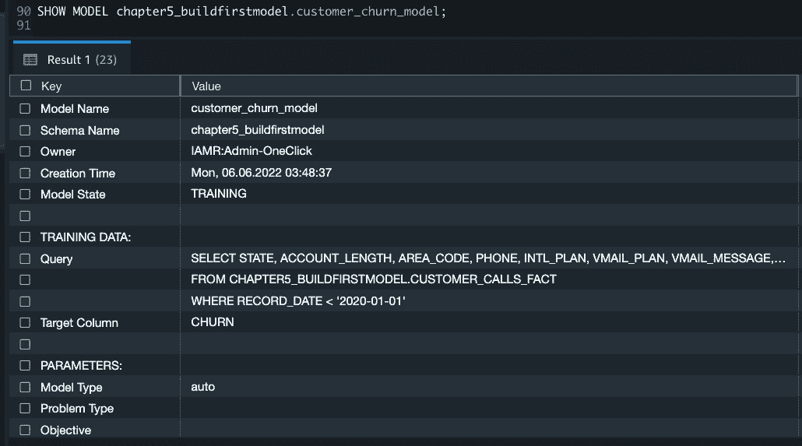

图 5.6 – 模型状态训练

在一段时间后运行相同的`SHOW MODEL`命令后，**模型状态**显示为**READY**，这意味着数据处理、模型训练、模型选择和模型部署到 Redshift 已成功完成。从以下屏幕截图，您可以看到**模型状态**现在显示为**READY**。您还可以看到**预估成本**值，这代表 Amazon SageMaker 训练小时数。这个值不等于已过训练时间，因为它是在 SageMaker 实例上累积的训练时间。

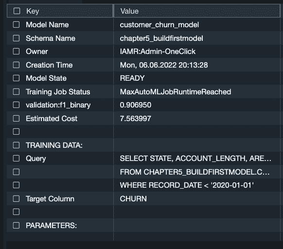

图 5.7 – 模型状态为 READY

除了`SHOW MODEL`命令提供有关模型的其它有用信息外，例如，查询使用情况、**目标列**、**模型类型**和预测时使用的**函数名称**。您可以看到，在我们的示例中**模型类型**是**xgboost**，这表明 Amazon SageMaker 已选择 XGBoost 算法来构建二元分类模型：

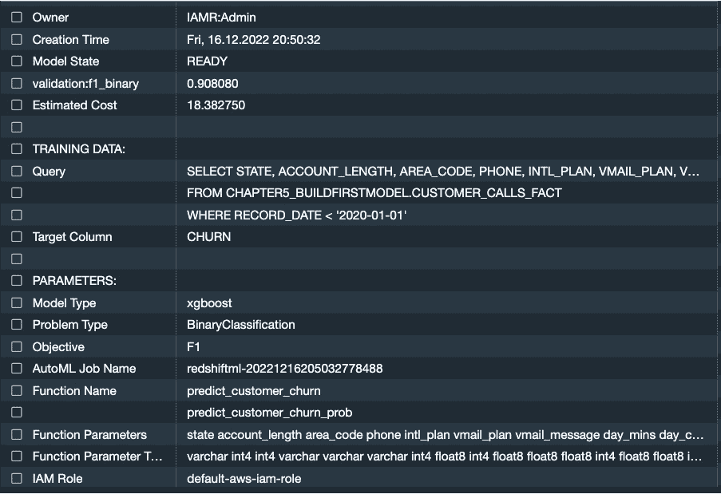

图 5.8 – 模型状态为 READY 的延续

如果您进一步阅读输出，Redshift ML 已经为您做了大部分工作，例如，它已选择并设置了以下参数：

+   **问题类型**设置为**二元分类**。这是真的，因为我们的目标变量中有两个不同的值，即 true 和 false。因此，这是一个二元分类问题。

+   **验证**和**目标**设置为**F1**。F1 分数是评估二元分数时推荐的方法，因为它考虑了精确度和召回率。SageMaker Autopilot 可能为二元分类模型选择的其它目标还包括**准确率**和**曲线下面积**（**AUC**）。

我们已成功创建模型，作为`SELECT`查询。下一节将展示如何做到这一点。

# 评估模型性能

现在我们已经创建了模型，让我们深入了解其性能细节。

在构建机器学习模型时，了解模型性能非常重要。您这样做是为了确保您的模型是有用的，并且不会对某一类有偏见，以及确保模型不是欠训练或过训练，这意味着模型要么没有正确预测类别，要么只预测了一些实例而没有预测其他实例。

为了解决这个问题，Redshift ML 提供了各种目标来衡量模型的性能。我们明智的做法是使用上一节中预留的测试数据集来测试模型性能。本节将解释如何审查 Redshift ML 目标，并使用我们的测试数据验证模型性能。

Redshift ML 使用几种目标方法来衡量机器学习模型的预测质量。

## 检查 Redshift ML 目标

*图 5.9* 显示了 `SHOW MODEL` 的输出。它显示了两个对我们来说有趣的价值。一个是 **Objective**，另一个是 **validation:f1_binary**。首先需要查看的是 **Objective**。它被设置为 **F1**。F1 或 F-score 是分类模型中最常用的性能评估指标。它是验证数据集准确性的一个度量。它是从验证的精确度和召回率计算得出的，其中精确度是真实阳性结果的数量除以所有阳性结果的数量，召回率是真实阳性结果的数量除以所有应被识别为阳性的记录的数量。您可以在这里了解更多关于 F-score 的信息：[`en.wikipedia.org/wiki/F-score`](https://en.wikipedia.org/wiki/F-score)。

在查询编辑器 v2 中运行以下命令：

```py
SHOW MODEL chapter5_buildfirstmodel.customer_churn_model;
```

*图 5.9* 中的输出显示了 F1 的值位于 **validation:****f****1_binary** 中，其值为 **0.90**。F1 分数的最高可能值为 1，最低为 0。得分为 1 表示模型具有完美的精确度和召回率。在我们的情况下，它是 90%，这非常好。

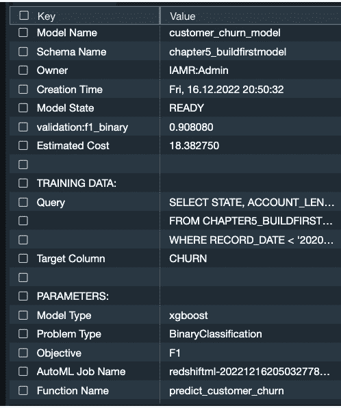

图 5.9 – 模型目标值

我们已经看到，由 Autopilot 创建的模型具有很好的 F-score，并且可以用来预测客户是否会流失。在下一节中，我们将使用预测函数来生成预测值以及概率分数。

## 运行预测

现在，让我们通过 `SELECT` 命令调用我们的 `predict_customer_churn` 和 `predict_customer_churn_prob` 预测函数。Redshift ML 为我们创建了两个函数来使用：

+   其中一个与我们在创建模型时给出的名称相同，在本例中为 `predict_customer_churn`，它返回类别标签或预测值，例如，`0` 或 `1`。

+   另一个函数 `predict_customer_churn_prob`，除了返回类别标签或预测值外，还返回预测值正确的概率。

要测试这些函数，请运行以下查询。在以下查询中，您会注意到我们在 `SELECT` 命令中使用两个预测函数，并传递创建 ML 模型时传递的所有输入列。这两个函数将返回标签和概率分数作为输出。我们还通过过滤 `record_date` 大于 `'2022-07-31'` 的行来测试预测函数。由于这是一个未见过的数据集，它应该作为对我们 ML 模型具有挑战性的数据集。

还需要注意的是，所有预测都是在 Redshift 集群上本地进行的。当运行 `SELECT` 查询时，没有调用 Amazon SageMaker。这使得所有预测都是免费的：

```py
SELECT area_code ||phone  accountid, replace(churn,'.','') as Actual_churn_class,
    chapter5_buildfirstmodel.predict_customer_churn(
      state,account_length,area_code, phone,intl_plan,
      vMail_plan, vMail_message, day_mins, day_calls,
      day_charge, total_charge, eve_mins, eve_calls,
      eve_charge, night_mins, night_calls,
      night_charge, intl_mins, intl_calls, intl_charge,
      cust_serv_calls) AS predicted_class,
      chapter5_buildfirstmodel.predict_customer_churn_prob(
      state, account_length, area_code, phone, intl_plan,
      vMail_plan, vMail_message, day_mins, day_calls,
      day_charge, total_charge, eve_mins, eve_calls,
      eve_charge, night_mins, night_calls,night_charge,
      intl_mins, intl_calls, intl_charge, cust_serv_calls)
      AS probability_score
  FROM chapter5_buildfirstmodel.customer_calls_fact
WHERE record_date > '2020-07-31'
;
```

您可以在以下屏幕截图中查看输出：

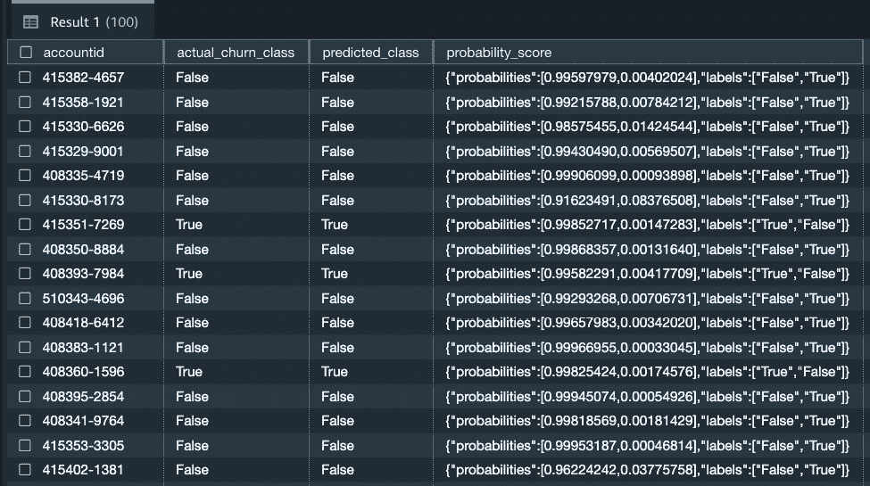

图 5.10 – 运行预测

在前面的屏幕截图中，请注意，每个客户的`predicted_class`值和`probability_score`值都显示出来。从`predicted_class`列中，您可以理解我们的模型正在预测客户是否会流失，而从`probability_score`列中，您可以理解模型，例如，对于第一行，模型有 99%的信心认为账户 ID 为**415382-4657**的客户不会流失。

我们已经见证了预测工作没有出现任何问题。在下一节中，我们将检查模型与真实值相比的表现。

## 比较真实值与预测值

运行以下查询以比较实际与预测的客户流失：

```py
WITH infer_data AS (
  SELECT area_code ||phone  accounted,
    replace(churn,'.','') as churn,
    chapter5_buildfirstmodel.predict_customer_churn(
              state,
              account_length,
              area_code,
              phone,
              intl_plan,
              vMail_plan,
              vMail_message,
              day_mins,
              day_calls,
              day_charge,
              total_charge,
              eve_mins,
              eve_calls,
              eve_charge,
              night_mins,
              night_calls,
              night_charge,
              intl_mins,
              intl_calls,
              intl_charge,
              cust_serv_calls) AS predicted
  FROM chapter5_buildfirstmodel.customer_calls_fact
WHERE record_date > '2020-07-31'
)
SELECT *  FROM infer_data where churn!=predicted;
```

以下屏幕截图显示了 ML 模型犯错的客户：

注意

结果将因每个训练模型略有不同而有所变化。

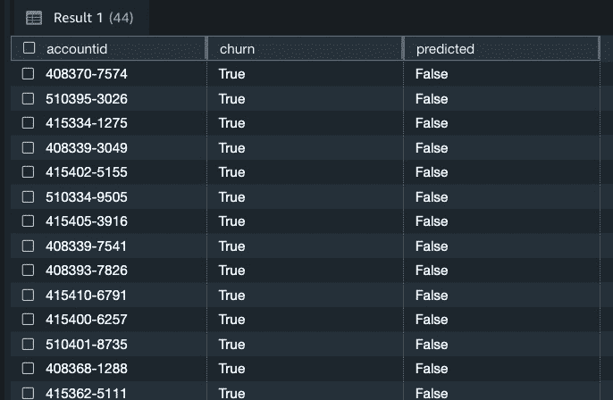

图 5.11 – 错误预测

我们已经看到了模型预测，并与真实值进行了比较。在下一节中，我们将学习关于特征重要性的内容。

## 特征重要性

`explain_model`函数用于检索特征重要性。这将帮助您了解哪些特征与目标变量高度相关，哪些特征对模型很重要，哪些则不是，从而您可以减少输入到机器学习模型中的维度数量。

以下是可以运行的 SQL 代码，用于检索我们模型的特征重要性：

```py
Select jsondata.featureimp.explanations.kernel_shap.label0.global_shap_values as value
from ( select explain_model( 'chapter5_buildfirstmodel.customer_churn_model')as featureimp) jsondata ;
```

以下是特征重要性的 JSON 格式输出。您可以阅读和理解每个特征的重要性。

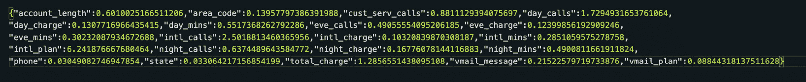

图 5.12 – 特征重要性原始输出

为了更好地阅读特征重要性，您可以执行以下 SQL 代码：

```py
select t1.feature_imp, t1.value from
(
Select
'account_length' as feature_imp,
jsondata.featureimp.explanations.kernel_shap.label0.global_shap_values.account_length as value
from ( select explain_model( 'chapter5_buildfirstmodel.customer_churn_model')as featureimp) jsondata
union
select 'area_code' as feature_imp ,
jsondata.featureimp.explanations.kernel_shap.label0.global_shap_values.area_code as value
from ( select explain_model( 'chapter5_buildfirstmodel.customer_churn_model')as featureimp) jsondata
union
select 'cust_serv_calls' as feature_imp ,
jsondata.featureimp.explanations.kernel_shap.label0.global_shap_values.cust_serv_calls as value
from ( select explain_model( 'chapter5_buildfirstmodel.customer_churn_model')as featureimp) jsondata
union
select 'day_calls' as feature_imp ,
jsondata.featureimp.explanations.kernel_shap.label0.global_shap_values.day_calls as value
from ( select explain_model( 'chapter5_buildfirstmodel.customer_churn_model')as featureimp) jsondata
union
select 'day_charge' as feature_imp ,
jsondata.featureimp.explanations.kernel_shap.label0.global_shap_values.day_charge as value
from ( select explain_model( 'chapter5_buildfirstmodel.customer_churn_model')as featureimp) jsondata 
union
select 'day_mins' as feature_imp ,
jsondata.featureimp.explanations.kernel_shap.label0.global_shap_values.day_mins as value
from ( select explain_model( 'chapter5_buildfirstmodel.customer_churn_model')as featureimp) jsondata
union
select 'eve_calls' as feature_imp ,
jsondata.featureimp.explanations.kernel_shap.label0.global_shap_values.eve_calls  as value
from ( select explain_model( 'chapter5_buildfirstmodel.customer_churn_model')as featureimp) jsondata
union
select 'eve_charge' as feature_imp ,
jsondata.featureimp.explanations.kernel_shap.label0.global_shap_values.eve_charge  as value
from ( select explain_model( 'chapter5_buildfirstmodel.customer_churn_model')as featureimp) jsondata
union
select 'eve_mins' as feature_imp ,
jsondata.featureimp.explanations.kernel_shap.label0.global_shap_values.eve_mins  as value
from ( select explain_model( 'chapter5_buildfirstmodel.customer_churn_model')as featureimp) jsondata
union
select 'intl_calls' as feature_imp ,
jsondata.featureimp.explanations.kernel_shap.label0.global_shap_values.intl_calls   as value
from ( select explain_model( 'chapter5_buildfirstmodel.customer_churn_model')as featureimp) jsondata
union
select 'intl_charge' as feature_imp ,
jsondata.featureimp.explanations.kernel_shap.label0.global_shap_values.intl_charge   as value
from ( select explain_model( 'chapter5_buildfirstmodel.customer_churn_model')as featureimp) jsondata
union
select 'intl_mins' as feature_imp ,
jsondata.featureimp.explanations.kernel_shap.label0.global_shap_values.intl_mins    as value
from ( select explain_model( 'chapter5_buildfirstmodel.customer_churn_model')as featureimp) jsondata
union
select 'intl_plan' as feature_imp ,
jsondata.featureimp.explanations.kernel_shap.label0.global_shap_values.intl_plan     as value
from ( select explain_model( 'chapter5_buildfirstmodel.customer_churn_model')as featureimp) jsondata
union
select 'inight_calls' as feature_imp ,
jsondata.featureimp.explanations.kernel_shap.label0.global_shap_values.night_calls     as value
from ( select explain_model( 'chapter5_buildfirstmodel.customer_churn_model')as featureimp) jsondata
union
select 'night_charge' as feature_imp ,
jsondata.featureimp.explanations.kernel_shap.label0.global_shap_values.night_charge    as value
from ( select explain_model( 'chapter5_buildfirstmodel.customer_churn_model')as featureimp) jsondata
union
select 'night_mins' as feature_imp ,
jsondata.featureimp.explanations.kernel_shap.label0.global_shap_values.night_mins   as value
from ( select explain_model( 'chapter5_buildfirstmodel.customer_churn_model')as featureimp) jsondata
union
select 'phone' as feature_imp ,
jsondata.featureimp.explanations.kernel_shap.label0.global_shap_values.phone   as value
from ( select explain_model( 'chapter5_buildfirstmodel.customer_churn_model')as featureimp) jsondata
union
select 'state' as feature_imp ,
jsondata.featureimp.explanations.kernel_shap.label0.global_shap_values.state   as value
from ( select explain_model( 'chapter5_buildfirstmodel.customer_churn_model')as featureimp) jsondata
union
select 'total_charge' as feature_imp ,
jsondata.featureimp.explanations.kernel_shap.label0.global_shap_values.total_charge   as value
from ( select explain_model( 'chapter5_buildfirstmodel.customer_churn_model')as featureimp) jsondata
union
select 'vmail_message' as feature_imp ,
jsondata.featureimp.explanations.kernel_shap.label0.global_shap_values.vmail_message   as value
from ( select explain_model( 'chapter5_buildfirstmodel.customer_churn_model')as featureimp) jsondata
union
select 'vmail_plan' as feature_imp ,
jsondata.featureimp.explanations.kernel_shap.label0.global_shap_values.vmail_plan  as value
from ( select explain_model( 'chapter5_buildfirstmodel.customer_churn_model')as featureimp) jsondata
) t1
order by value desc
```

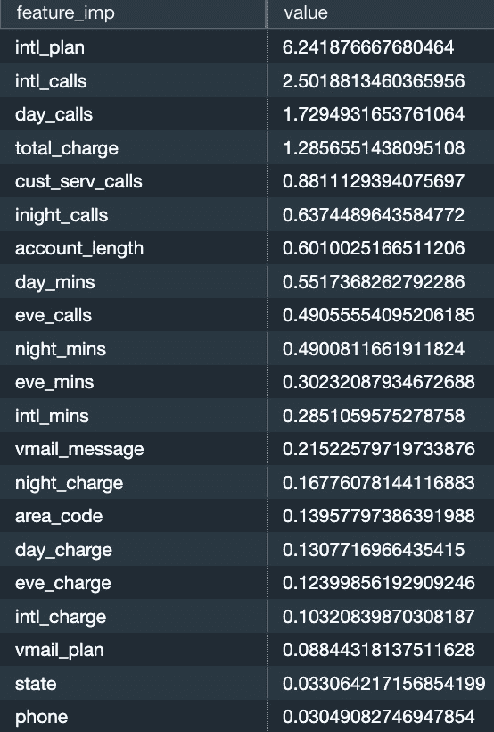

图 5.13 – 特征重要性

您可以使用特征重要性来理解每个特征与目标变量之间的关系，以及哪些特征不重要。

我们已经看到了对模型贡献很大的特征，现在让我们看看模型性能指标是如何在我们的测试数据集上计算的。

# 模型性能

让我们使用 Redshift SQL 计算一个**混淆矩阵**来评估分类模型的表现。使用混淆矩阵，您可以识别真实正例、真实负例、假正例和假负例，基于这些，可以计算出各种统计指标，如准确率、精确率、召回率、灵敏度、特异性和最终，F1 分数。您可以在此处了解更多关于混淆矩阵的概念：[`en.wikipedia.org/wiki/Confusion_matrix`](https://en.wikipedia.org/wiki/Confusion_matrix)。

以下查询使用了`WITH`子句，这在 Redshift 中实现了公共表表达式。此查询包含以下三个部分：

+   第一部分是关于`WITH`子句中的`SELECT`语句，在这里我们预测客户流失并保存在内存中。这个数据集被命名为`infer_data`。

+   第二部分位于第一个`SELECT`语句下方，读取`infer_data`并构建混淆矩阵，这些详细信息存储在名为`confusionmatrix`的数据集中。

+   在语句的第三部分，请注意，`SELECT`语句构建了模型性能指标，如 F1 分数、准确率、召回率等。

运行以下查询以构建测试数据集的混淆矩阵：

```py
WITH infer_data AS (
  SELECT area_code ||phone  accountid, replace(churn,'.','') as churn,
    chapter5_buildfirstmodel.predict_customer_churn(
          state,  account_length, area_code, phone,
          intl_plan, vMail_plan, vMail_message, day_mins,
          day_calls,  day_charge, total_charge, eve_mins,
          eve_calls, eve_charge, night_mins, night_calls,
          night_charge, intl_mins, intl_calls,
          intl_charge,   cust_serv_calls) AS predicted
  FROM chapter5_buildfirstmodel.customer_calls_fact
WHERE record_date > '2020-07-31'),
confusionmatrix as
(
SELECT case when churn  ='True' and predicted = 'True' then 1 else 0 end TruePositives,
case when churn ='False' and predicted = 'False' then 1 else 0 end TrueNegatives,
case when churn ='False' and predicted = 'True' then 1 else 0 end FalsePositives,
case when churn ='True' and predicted = 'False' then 1 else 0 end FalseNegatives
  FROM infer_data
 )
select
sum(TruePositives+TrueNegatives)*1.00/(count(*)*1.00) as Accuracy,--accuracy of the model,
sum(FalsePositives+FalseNegatives)*1.00/count(*)*1.00 as Error_Rate, --how often model is wrong,
sum(TruePositives)*1.00/sum (TruePositives+FalseNegatives) *1.00 as True_Positive_Rate, --or recall how often corrects are rights,
sum(FalsePositives)*1.00/sum (FalsePositives+TrueNegatives )*1.00 False_Positive_Rate, --or fall-out how often model said yes when it is no,
sum(TrueNegatives)*1.00/sum (FalsePositives+TrueNegatives)*1.00 True_Negative_Rate, --or specificity, how often model said no when it is yes,
sum(TruePositives)*1.00 / (sum (TruePositives+FalsePositives)*1.00) as Precision, -- when said yes how it is correct,
2*((True_Positive_Rate*Precision)/ (True_Positive_Rate+Precision) ) as F_Score --weighted avg of TPR & FPR
From confusionmatrix
;
```

我们得到以下输出：

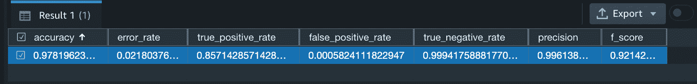

图 5.14 – 测试数据集的混淆矩阵

通过查看`record_date` > `'2020-07-31'`)）。这些记录之前没有被模型看到，但 97%的时间，模型能够正确预测类值。这证明了模型是有用的，并且能够正确预测两个类别——流失和非流失。现在可以将这个模型交给业务部门，以便它可以主动预测即将流失的客户并为他们制定营销活动。

# 摘要

在本章中，你学习了如何使用简单的`CREATE MODEL`语句创建你的第一个机器学习模型。在这个过程中，你使用了查询编辑器 v2 来探索`customer_calls_fact`表数据，了解了`CREATE MODEL`语句的基本语法，创建了一个简单的 ML 模型，学习了如何读取模型的输出，并最终使用 Redshift SQL 自己计算了一些模型评估指标。

在下一章中，你将使用本章学到的基本知识来使用 Redshift ML 构建各种分类模型。
