# 构建分类模型

在本章中，你将了解在 **机器学习**（**ML**）中使用的分类算法。你将了解 Redshift 在创建分类模型时提供的各种方法。本章将提供二元和**多类别分类模型**的详细示例，并展示如何使用这些建模技术解决业务问题。到本章结束时，你将能够确定一个业务问题是否为分类问题，确定 Redshift 在训练中提供的正确方法，并构建模型。

在本章中，我们将讨论以下主要内容：

+   分类算法简介

+   创建带有用户指导的模型语法

+   使用 XGBoost 算法训练二元分类模型

+   使用线性学习器模型类型训练多类别分类模型

# 技术要求

本章需要网络浏览器以及访问以下内容：

+   一个 AWS 账户

+   一个 Amazon Redshift 无服务器端点

+   Amazon Redshift 查询编辑器 v2

+   完成 *第一章* 中的 *Amazon Redshift 无服务器入门* 部分

你可以在此处找到本章使用的代码：[`github.com/PacktPublishing/Serverless-Machine-Learning-with-Amazon-Redshift/`](https://github.com/PacktPublishing/Serverless-Machine-Learning-with-Amazon-Redshift/).

# 分类算法简介

**分类**是将任何实体或类别进行分类的过程，以便更好地理解和分析。分类过程通常作为预设置的业务流程的一部分发生（例如，在观察产品后将其标记为有缺陷或良好），或通过退货流程（例如，在客户将产品退回为有缺陷后将其标记为有缺陷）。在任何情况下，重要的是对实体进行分类——在这种情况下，将产品分类到类别中（即，有缺陷或无缺陷）。

*图 6.1* 展示了使用三个输入变量被分类到两个类别的数据。该图显示了**输入**和**输出**数据点被分类到两个类别的情况。当输出标签只包含两个类别时，它被称为**二元** **分类**问题：

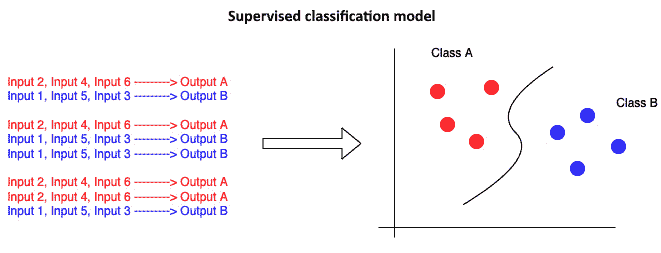

图 6.1 – 二元分类

如果输出变量包含两个以上的类别——例如，预测一个水果是苹果、橙子还是梨——那么它被称为**多类别分类**。*图 6.2* 展示了基于三个输入变量被分类到多个类别的数据。该图显示了一个多类别分类图，说明了输入和输出对如何被分类到三个类别：

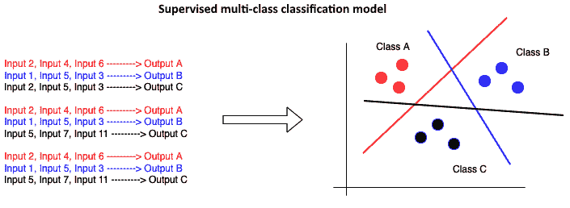

图 6.2 – 多类别分类

分类过程也可以发生在尚未定义类别的数据上。让我们继续了解这是如何可能的。

并非总是您的实体以某种方式分组或分类。例如，如果您想分析客户的购买历史或点击流活动，或者如果您想根据人口统计或购物行为将类似客户分组，那么分类算法就派上用场，用于分析数据并将相似数据点聚类。这种类型的分类建模称为 **无监督学习**。

建立类别有助于分析过程——例如，一旦产品被标记为某个类别标签，您就可以轻松检索出退货的次品产品列表，然后进一步研究其特征，例如商店位置、退货产品的客户的 demographics 以及产品退货最多的季节。如何以及何时定义和建立类别，使企业能够进行深入分析，不仅回答诸如在哪里和什么的问题，而且还在历史数据和类别上训练 ML 模型，并预测实体将落入哪个类别。

常见的分类模型有用武之地的场景包括以下几种：

+   客户行为预测

+   文档或图像分类

+   防垃圾邮件过滤

在本章中，我们将向您展示如何创建 Redshift 提供的不同分类模型。Amazon Redshift 提供了 **XGBoost**、**多层感知器**（**MLP**）和 **线性学习器算法**来训练和构建分类模型。

在本章中，您将通过构建二元分类模型开始学习监督分类模型，使用 XGBoost 和使用线性学习器的多类别分类模型。MLP 模型将在 *第九章* 中介绍，而无监督分类建模将在 *第八章* 中介绍。

现在，我们将向您详细介绍使用 Redshift ML 创建模型的详细语法。

## 深入了解 Redshift 的 CREATE MODEL 语法

在 *第四章* 中，我们看到了 Redshift `CREATE MODEL` 命令的不同变体以及数据分析师、公民数据科学家或数据科学家如何以不同复杂度操作 `CREATE MODEL` 命令。在本节中，我们将向您介绍一个公民数据科学家角色，他并不完全了解统计学，但对识别要使用的算法和可以将哪种问题类型应用于业务问题有很好的了解。在 Redshift ML 世界中，这种类型的模型创建被称为 **带有用户指导的** **CREATE MODEL**。

正如前文所述，我们将探索`CREATE MODEL`语句中的模型类型和问题类型参数。作为`CREATE MODEL with user guidance`的一部分，您还可以选择设置一个预处理程序，但我们将把这个话题留到*第十章*中。

作为 ML 模型创建者，您将决定使用哪种算法以及解决哪种问题类型。Redshift ML 仍然在幕后执行独立变量的特征工程。例如，在 20 个特征中，Redshift ML 将自动识别分类变量和数值变量，并在适用的情况下创建单热编码值或数值变量的标准化，以及完成模型训练所需的各种其他任务。

总结来说，您让 Redshift ML 处理大部分数据准备任务。作为模型创建者，您提出要使用的算法和要解决的问题类型。通过预选算法类型和问题类型，Redshift ML 将减少训练类型，因为它将在其他算法和问题类型上训练模型。与我们在*第五章*中创建的完整`AUTO` `CREATE MODEL`语句相比，*带有用户指导的 CREATE MODEL*需要更少的时间。

如前文所述，我们将使用 XGBoost 算法进行二元分类，使用线性学习器算法进行多类分类。

您可以在以下链接中了解更多关于 XGBoost 的信息：[`docs.aws.amazon.com/sagemaker/latest/dg/XGBoost.html`](https://docs.aws.amazon.com/sagemaker/latest/dg/XGBoost.html)。

您还可以在以下链接中了解更多关于 Linear Learner 的信息：[`docs.aws.amazon.com/sagemaker/latest/dg/linear-learner.html`](https://docs.aws.amazon.com/sagemaker/latest/dg/linear-learner.html)。

使用简单的`CREATE MODEL`语句，Redshift ML 将使用 SageMaker Autopilot 自动确定问题类型、算法以及最佳模型类型。

使用 Redshift ML，您可以通过提供用户指导来影响模型。当您发出`CREATE MODEL`语句时，您可以选择`model_type`、`problem_type`和`objective`。您可以在以下链接中找到关于语法和选项的更多详细信息：[`docs.aws.amazon.com/redshift/latest/dg/r_create_model_use_cases.html`](https://docs.aws.amazon.com/redshift/latest/dg/r_create_model_use_cases.html)。

到目前为止，我们已经讨论了 Redshift ML `CREATE MODEL`语法的基础知识以及您如何提供指导，例如模型类型和目标，或者选择让 Redshift ML 自动为您选择这些。

现在，您将学习如何创建一个二元分类模型并指定 XGBoost 算法。

# 使用 XGBoost 算法训练二元分类模型

二分类模型用于解决预测两个可能类别中的一个类别的问题——例如，预测是否会下雨。目标是了解过去的数据点，并确定特定数据点将落入哪个目标桶中。二分类模型的典型用例如下：

+   预测患者是否患有疾病

+   预测客户是否会流失

+   预测行为——例如，客户是否会提出上诉

在接下来的几节中，我们将通过以下步骤来实现创建用于运行推理查询的二分类模型的目标：

1.  定义业务问题

1.  上传和分析数据

1.  创建模型

1.  对模型运行预测查询

## 确立业务问题

为了构建我们的二分类问题，我们将研究一个银行营销问题。银行在针对客户的营销活动中投入了大量资金，以便他们订阅其产品。银行在营销活动中建立效率非常重要，这可以通过学习最后的市场营销数据集并预测未来的营销结果来实现。我们将致力于预测银行客户是否会订阅银行产品的定期存款优惠。

## 上传和分析数据

在本节中，我们将研究一个银行营销数据集。这些数据与葡萄牙一家银行的直接营销活动相关。想象一下，你是一名营销分析师，你的目标是通过对客户提供定期存款来增加存款额。确保营销活动针对适当的客户是非常重要的。你将使用 Redshift ML 创建一个模型，以预测客户是否可能接受定期存款的优惠。此数据集来源于[`archive.ics.uci.edu/ml/datasets/bank+marketing`](https://archive.ics.uci.edu/ml/datasets/bank+marketing)。

数据集引用

[Moro 等人，2014] S. Moro, P. Cortez 和 P. Rita. *基于数据驱动的银行电话营销成功率预测方法*，《决策支持系统》，Elsevier，62:22–31，2014 年 6 月

分类目标是预测客户是否会（是/否）订阅定期存款（*y*变量）。

数据集包含诸如年龄、工作、婚姻状况、教育水平和就业状况等列。

这些列的元数据也可以在 UCI ML 仓库网站上找到：[`archive.ics.uci.edu/ml/datasets/bank+marketing`](https://archive.ics.uci.edu/ml/datasets/bank+marketing)。

如前述链接所示，有 20 个独立变量和 1 个因变量（*y*）。我们可以将这些独立变量中的任何一个或全部作为`CREATE MODEL`语句的输入，以便预测结果，*y*表示客户是否可能接受该优惠。

在成功连接到 Redshift 作为管理员或数据库开发者后，按照以下步骤创建模式并将数据加载到 Amazon Redshift 中：

1.  导航到 Redshift **查询编辑器 v2**，并连接到 **无服务器** 端点和 **dev** 数据库。

1.  重命名 `Chap6`。

以下截图显示了无服务器连接，数据库设置为 **dev**，查询编辑器页面保存为 **Chap6**：

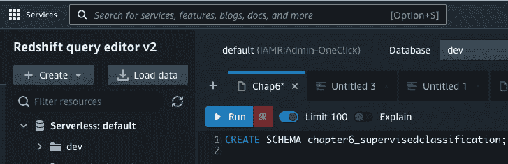

图 6.3 – Query Editor v2

1.  现在，使用以下代码行创建模式。此模式是创建和维持本章所需的所有表和数据的地方：

    ```py
    Create schema chapter6_supervisedclassification;
    ```

你将看到如下输出，表示你的模式已创建：

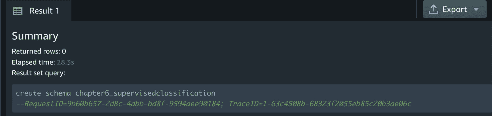

图 6.4 – 创建的模式

以下代码将创建 `bank_details_training` 表以存储用于训练模型的数据，以及 `bank_details_inference` 表以存储用于运行推理查询的数据。请注意，我们已经将我们的输入数据集分割成这两个数据集供你使用。本章中使用的所有 SQL 命令都可以在这里找到：[`github.com/PacktPublishing/Serverless-Machine-Learning-with-Amazon-Redshift/blob/main/CodeFiles/chapter6/chapter6.sql`](https://github.com/PacktPublishing/Serverless-Machine-Learning-with-Amazon-Redshift/blob/main/CodeFiles/chapter6/chapter6.sql)。

1.  从 GitHub 运行以下代码以在 Query Editor v2 中创建训练和推理表：

    ```py
    CREATE TABLE chapter6_supervisedclassification.bank_details_training(
    ```

    ```py
       age numeric, "job" varchar marital varchar, education varchar,
    ```

    ```py
       "default" varchar, housing varchar, loan varchar,
    ```

    ```py
       contact varchar, month varchar, day_of_week varchar,
    ```

    ```py
       …,
    ```

    ```py
       y boolean ) ;
    ```

    ```py
    --create table to store data for running predictions
    ```

    ```py
    CREATE TABLE chapter6_supervisedclassification.bank_details_inference(
    ```

    ```py
       age numeric, "job" varchar marital varchar, education varchar,
    ```

    ```py
       "default" varchar, housing varchar, loan varchar,
    ```

    ```py
       contact varchar, month varchar, day_of_week varchar,
    ```

    ```py
       …,
    ```

    ```py
       y boolean ) ;
    ```

你将看到如下输出以验证你的表已成功创建：

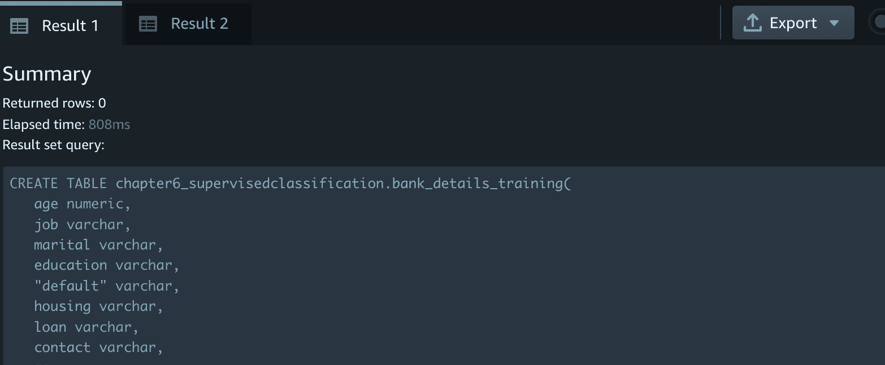

图 6.5 – 成功创建的表

现在你已经创建了表，请使用 Query Editor v2 运行 *步骤 5* 中的命令来加载数据，使用提供的 S3 存储桶。

1.  使用以下命令将样本数据加载到在 *步骤 4* 中创建的表中，该命令可在 GitHub 上找到。请注意，我们使用 `COPY` 命令从 Amazon S3 加载数据：

    ```py
    --load data into  bank_details_inference
    ```

    ```py
    TRUNCATE chapter6_supervisedclassification.bank_details_inference;
    ```

    ```py
     COPY chapter6_supervisedclassification.bank_details_inference from 's3://packt-serverless-ml-redshift/chapter06/bank-marketing-data/inference-data/inference.csv' REGION 'eu-west-1' IAM_ROLE default CSV IGNOREHEADER 1 delimiter ';';
    ```

    ```py
    -- load data into bank_details_training
    ```

    ```py
    TRUNCATE chapter6_supervisedclassification.bank_details_training;
    ```

    ```py
     COPY chapter6_supervisedclassification.bank_details_training from 's3://packt-serverless-ml-redshift/chapter06/bank-marketing-data/training-data/training.csv' REGION 'eu-west-1' IAM_ROLE default CSV IGNOREHEADER 1 delimiter ';';
    ```

1.  通过创建直方图图表分析客户定期存款订阅表。首先，再次使用 Query Editor v2 运行以下命令：

    ```py
    SELECT y, COUNT(*) Customer_Count FROM chapter6_supervisedclassification.bank_details_training
    ```

    ```py
    GROUP BY y
    ```

    ```py
    ;
    ```

你可以在结果集中看到，**36548** 名客户没有选择银行的优惠，而 **4640** 名客户接受了。你还可以使用 Query Editor v2 中的图表功能创建条形图。在 **结果** 面板右侧点击 **图表** 选项：

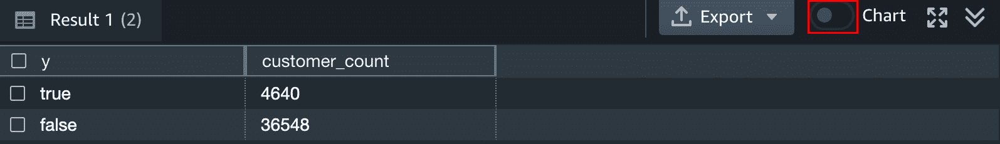

图 6.6 – 订阅结果和图表选项

选择 **类型** 为 **条形图**，**X** 值为 **y**，**Y** 值为 **customer_count** 后，你将得到以下结果：

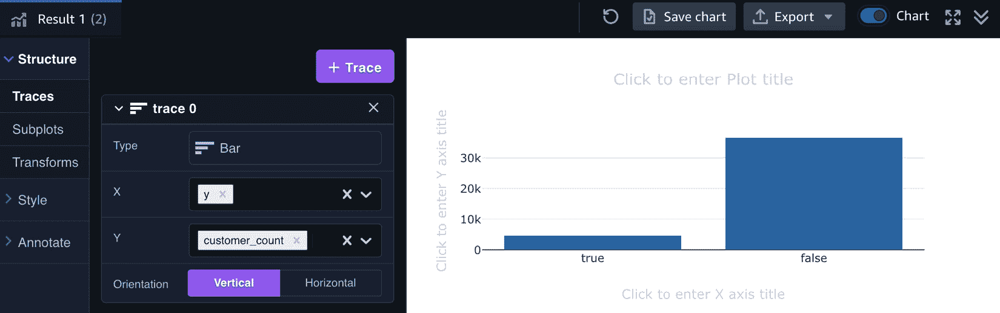

图 6.7 – 客户接受度图表

现在我们已经加载数据，我们可以创建我们的模型。

## 使用 XGBoost 训练二元分类模型

在本节中，您将指定`MODEL_TYPE`和`PROBLEM_TYPE`以使用 XGBoost 算法创建一个二元分类模型。我们现在将讨论银行营销活动问题。该模型的目标是预测客户是否会订阅定期存款。

我们将`MODEL_TYPE`设置为`XGBoost`，将`PROBLEM_TYPE`设置为`BINARY_CLASSIFICATION`。我们将使用默认的`IAM_ROLE`。此外，我们还需要指定模型工件将存储的 S3 桶，并且另外设置`MAX_RUNTIME`为`3600`（秒）。

以下是为创建模型编写的代码。您将在[`github.com/PacktPublishing/Serverless-Machine-Learning-with-Amazon-Redshift/blob/main/chapter6.sql`](https://github.com/PacktPublishing/Serverless-Machine-Learning-with-Amazon-Redshift/blob/main/chapter6.sql)找到完整的代码以及本章所需的全部 SQL 命令：

```py
DROP MODEL chapter6_supervisedclassification.banking_termdeposit;
CREATE  MODEL chapter6_supervisedclassification.banking_termdeposit
FROM (
SELECT
   age ,
   "job" ,
   marital ,
   education ,
   "default" ,
   housing ,
   loan ,
   contact ,
   month ,
   day_of_week ,
   duration,
   campaign ,
   pdays ,
   previous ,
   poutcome ,
   emp_var_rate ,
   cons_price_idx ,
   cons_conf_idx ,
   euribor3m ,
   nr_employed ,
   y
FROM
    chapter6_supervisedclassification.bank_details_training )
    TARGET y
FUNCTION predict_term_deposit
IAM_ROLE default
MODEL_TYPE XGBoost
PROBLEM_TYPE BINARY_CLASSIFICATION
SETTINGS (
  S3_BUCKET '<<your-S3-Bucket',
  MAX_RUNTIME 9600
  )
;
```

通过将`MODEL_TYPE`设置为`XGBoost`并将`PROBLEM_TYPE`设置为`BINARY_CLASSIFICATION`，我们指导 Redshift ML 仅在这次训练运行中搜索最佳的 XGBoost 模型。如果保留为默认值，Redshift ML 将检查是否可以将其他分类模型应用于数据集。

由于**SageMaker AutoPilot 算法**无需测试其他模型类型或确定问题类型，因此最终结果将减少训练时间。在本例中，SageMaker Autopilot 负责选择目标类型、调整超参数和处理数据预处理步骤。

要检查模型的状态，请运行以下命令：

```py
SHOW MODEL chapter6_supervisedclassification.banking_termdeposit;
```

您将得到以下结果：

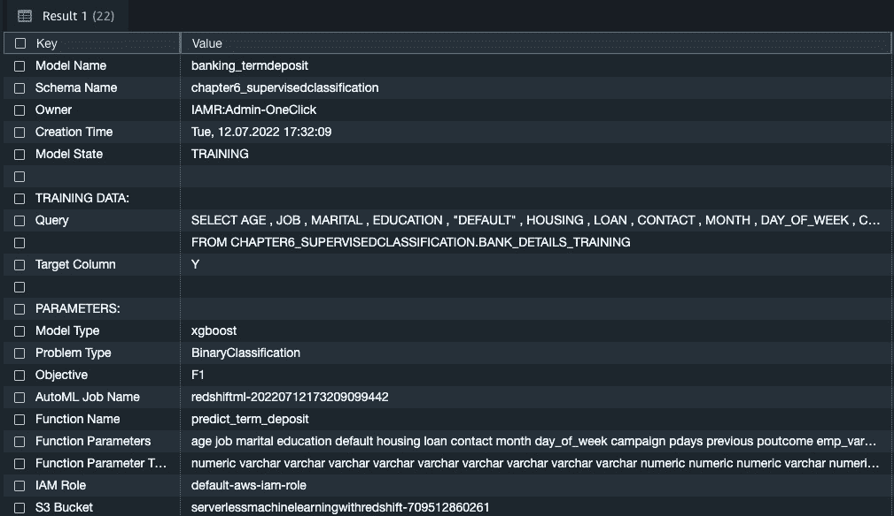

图 6.8 – 显示模型输出

从前面的屏幕截图可以看出，模型仍在训练中。此外，请注意 Redshift ML 拾取了`CREATE MODEL`语句。其他参数，如目标、超参数和预处理，仍然由 Redshift ML 自动处理。

在**函数名称**下的**predict_term_deposit**参数用于生成预测，我们将在下一节中使用它。

在一段时间后再次运行`SHOW MODEL`命令，以检查模型训练是否完成。从以下屏幕截图可以看出，**模型状态**为**就绪**，并且**F1**已被选为模型评估的目标。**F1**分数为**0.646200**，或 64%。这个数字越接近 1，模型分数就越好：

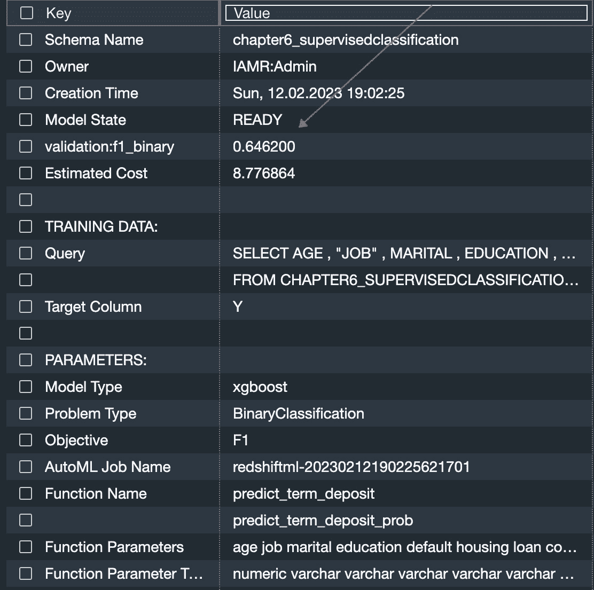

图 6.9 – 显示模型输出

让我们针对我们的训练数据运行以下查询以验证 F1 分数：

```py
WITH infer_data
 AS (
    SELECT  y as actual, chapter6_supervisedclassification.predict_term_deposit(
   age ,   "job" ,   marital ,   education ,   "default" ,   housing ,   loan ,   contact ,   month ,   day_of_week ,   duration ,   campaign ,   pdays ,   previous ,   poutcome ,   emp_var_rate ,   cons_price_idx ,        cons_conf_idx ,        euribor3m ,   nr_employed
) AS predicted,
     CASE WHEN actual = predicted THEN 1::INT
         ELSE 0::INT END AS correct
    FROM chapter6_supervisedclassification.bank_details_training
    ),
 aggr_data AS (
     SELECT SUM(correct) as num_correct, COUNT(*) as total FROM infer_data
 )
 SELECT (num_correct::float/total::float) AS accuracy FROM aggr_data;
```

您可以在以下输出中看到，我们的准确度非常好，接近 94%：

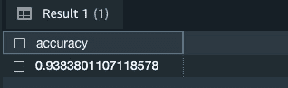

图 6.10 – 准确度结果

现在模型训练已完成，我们将使用创建的函数来运行预测查询。

## 运行预测

让我们在我们的推理数据集上运行一些预测，以查看有多少客户被预测为订阅定期存款。在 Query Editor v2 中运行以下 SQL 语句：

```py
WITH term_data AS ( SELECT chapter6_supervisedclassification.predict_term_deposit( age,"job" ,marital,education,"default",housing,loan,contact,month,day_of_week,duration,campaign,pdays,previous,poutcome,emp_var_rate,cons_price_idx,cons_conf_idx,euribor3m,nr_employed) AS predicted
FROM chapter6_supervisedclassification.bank_details_inference )
SELECT
CASE WHEN predicted = 'Y'  THEN 'Yes-will-do-a-term-deposit'
     WHEN predicted = 'N'  THEN 'No-term-deposit'
     ELSE 'Neither' END as deposit_prediction,
COUNT(1) AS count
from term_data GROUP BY 1;
```

您应该得到以下输出：

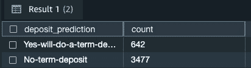

图 6.11 – 预测结果

我们可以看到**642**名客户被预测为会接受定期存款订阅的报价，而**3477**名客户被预测为不会接受报价。

## 预测概率

Amazon Redshift ML 现在提供了获取二元和多类分类问题预测概率的能力。请注意，在*图 6*.9 的`SHOW MODEL`命令输出中，已创建一个名为`predict_term_deposit_prob`的附加函数名。运行以下查询以检查已婚且从事管理工作且年龄在 35 至 45 岁之间的客户接受定期存款报价的概率：

```py
SELECT
age,"job" ,marital ,
chapter6_supervisedclassification.predict_term_deposit_prob( age,"job" ,marital,education,"default",housing,loan,contact,month,day_of_week,duration,campaign,pdays,previous,poutcome,emp_var_rate,cons_price_idx,cons_conf_idx,euribor3m,nr_employed) AS predicted
FROM chapter6_supervisedclassification.bank_details_inference
where marital = 'married'
  and "job" = 'management'
  and age between 35 and 40;
```

您将看到以下结果：

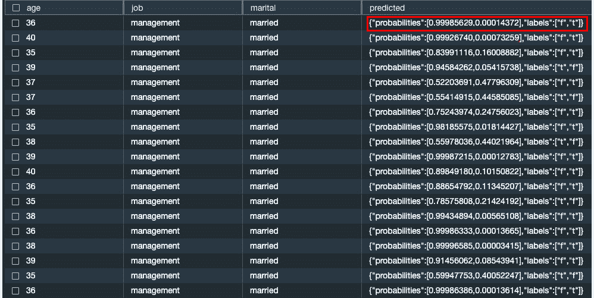

图 6.12 – 概率结果

您可以看到第一行有一个**0.99985629**的**错误**预测概率，以及只有**0.00014372**的**正确**预测概率。

您还可以修改前面的查询以查看被预测为接受定期存款报价的客户概率。在 Query Editor v2 中运行以下 SQL 命令：

```py
SELECT age, "job", marital, predicted.labels[0], predicted.probabilities[0]
from
 (select
age,"job" ,marital ,
chapter6_supervisedclassification.predict_term_deposit_prob( age,"job" ,marital,education,"default",housing,loan,contact,month,day_of_week,duration,campaign,pdays,previous,poutcome,emp_var_rate,cons_price_idx,cons_conf_idx,euribor3m,nr_employed) AS predicted
FROM chapter6_supervisedclassification.bank_details_inference
where marital = 'married'
  and "job" = 'management'
  and age between 35 and 40) t1
where predicted.labels[0] = 't';
```

您将看到以下类似的结果：

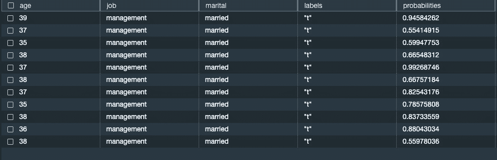

图 6.13 – 客户接受条款报价的概率结果

在*第五章*中，您学习了如何通过运行可解释性报告来确定特征重要性。运行以下查询以查看哪些输入对模型预测贡献最大：

```py
select json_table.report.explanations.kernel_shap.label0.global_shap_values from
 (select explain_model('chapter6_supervisedclassification.banking_termdeposit') as report) as json_table;
```

将结果复制到编辑器中，以便更容易阅读，如图*6*.14 所示：

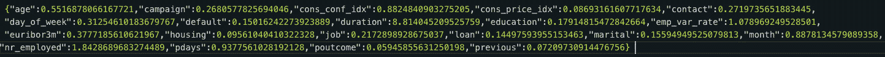

图 6.14 – 可解释性报告

这表明`pdays`的重要性最高，而`poutcome`的重要性最低。

现在您已经构建了一个二元分类模型，让我们继续尝试构建一个多类分类模型。

# 使用线性学习模型类型训练多类分类模型

在本节中，您将学习如何使用线性学习算法在 Amazon Redshift ML 中构建多类分类模型。

要做到这一点，我们将使用来自 Kaggle 的客户细分数据集：[`www.kaggle.com/datasets/vetrirah/customer`](https://www.kaggle.com/datasets/vetrirah/customer)。

您将使用此数据集来训练一个模型，将客户分类到四个细分市场之一（`A`、`B`、`C`或`D`）。通过细分客户，您可以更好地了解客户，并对他们进行有针对性的营销，提供与他们相关的产品。

我们的数据已经分为训练集和测试集，并存储在以下 S3 位置：

+   `s3://packt-serverless-ml-redshift/chapter06/segmentation/train.csv`

+   `s3://packt-serverless-ml-redshift/chapter06/segmentation/test.csv`

在成功连接到 Redshift 作为管理员或数据库开发者后，按照以下方式将数据加载到 Amazon Redshift 中：

1.  导航到 Redshift **查询编辑器 v2**，并连接到 **无服务器** 端点和 **dev** 数据库。

1.  使用为二进制分类练习创建的相同模式和查询编辑器页面（见 *上传和分析数据* 部分）。

使用以下 SQL 命令在 Query Editor v2 中创建训练表和测试表并加载数据。这些 SQL 命令可以在

[`github.com/PacktPublishing/Serverless-Machine-Learning-with-Amazon-Redshift/blob/main/CodeFiles/chapter6/chapter6.sql`](https://github.com/PacktPublishing/Serverless-Machine-Learning-with-Amazon-Redshift/blob/main/CodeFiles/chapter6/chapter6.sql):

```py
CREATE TABLE chapter6_supervisedclassification.cust_segmentation_train (
    id numeric,
    gender varchar,
    ever_married  varchar,
    age numeric,
    graduated varchar,
    profession varchar,
    work_experience numeric,
    spending_score  varchar,
    family_size numeric,
    var_1 varchar,
    segmentation varchar
)
DISTSTYLE AUTO;
COPY chapter6_supervisedclassification.cust_segmentation_train FROM 's3://packt-serverless-ml-redshift/chapter06/Train.csv' IAM_ROLE DEFAULT FORMAT AS CSV DELIMITER ',' QUOTE '"' IGNOREHEADER 1 REGION AS 'eu-west-1';
CREATE TABLE chapter6_supervisedclassification.cust_segmentation_test (
    id numeric,
    gender varchar,
    ever_married  varchar,
    age numeric,
    graduated varchar,
    profession varchar,
    work_experience numeric,
    spending_score  varchar,
    family_size numeric,
    var_1 varchar
)
DISTSTYLE AUTO;
COPY chapter6_supervisedclassification.cust_segmentation_test FROM 's3://packt-serverless-ml-redshift/chapter06/Test.csv' IAM_ROLE DEFAULT FORMAT AS CSV DELIMITER ',' QUOTE '"' IGNOREHEADER 1 REGION AS 'eu-west-1';
```

现在数据已经加载，让我们对我们的训练数据进行一些分析。

1.  通过执行以下 SQL 命令分析训练数据：

    ```py
    select segmentation, count(*)  from chapter6_supervisedclassification.cust_segmentation_train
    ```

    ```py
    group by 1;
    ```

您应该得到以下输出：

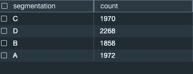

图 6.15 – 分割

我们的训练数据集总共有 8,068 条客户记录。从这个样本中，我们可以看到细分 **C**、**B** 和 **A** 非常相似，并且更多客户位于细分 **D** 中。

我们将使用训练数据集的输入来预测客户细分，使用线性学习器算法。

## 使用线性学习器预测客户细分

**线性学习器**是一种监督学习算法，是您可以使用来解决分类或回归问题的模型类型之一。

对于多类分类问题，与二进制分类问题的确切两个标签相比，我们将尝试预测的标签（或目标）超过两个。我们将向您展示如何使用线性学习器在 *第七章* 中解决回归问题。

使用线性学习器，与传统的超参数优化技术相比，你可以实现速度的显著提升，这使得它非常方便。

我们将提供一个包含我们的输入或关于数据的观察以及代表我们想要预测的值的标签的训练集。我们可以选择性地为某些列的组合提供预处理器。

在本节中，您将通过提供 `MODEL_TYPE`、`PROBLEM_TYPE` 和 `OBJECTIVE` 来应用用户指导技术，使用线性学习器算法创建一个多类分类模型。该模型的目标是预测每个客户的细分。

我们将设置 `MODEL_TYPE` 为 `LINEAR_LEARNER` 和 `PROBLEM_TYPE` 为 `MULTICLASS_CLASSIFICATION`。我们将其他选项保留为默认设置。

让我们在 Query Editor v2 中执行以下代码来训练模型：

```py
CREATE  MODEL chapter6_supervisedclassification.cust_segmentation_model_ll
FROM (
SELECT
    id, gender, ever_married, age, graduated,profession,
    work_experience, spending_score,family_size,
    var_1,segmentation
FROM chapter6_supervisedclassification.cust_segmentation_train
)
TARGET segmentation
FUNCTION predict_cust_segment_ll   IAM_ROLE default
MODEL_TYPE LINEAR_LEARNER
PROBLEM_TYPE MULTICLASS_CLASSIFICATION
OBJECTIVE 'accuracy'
SETTINGS (
  S3_BUCKET '<<your-s3-bucket>>',
  S3_GARBAGE_COLLECT OFF,
  MAX_RUNTIME 9600
  );
```

要检查模型的状态，请在 Query Editor v2 中运行以下命令：

```py
SHOW MODEL chapter6_supervisedclassification.cust_segmentation_model_ll;
```

你应该得到以下输出：

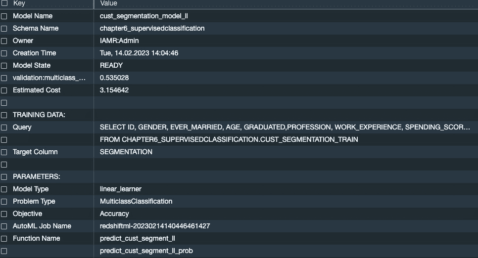

图 6.16 – 显示模型输出

你可以看到模型现在在`CREATE` `MODEL`语句中。

现在模型已经训练好了，是时候评估其质量了。

## 评估模型质量

当你发出`CREATE MODEL`命令时，Amazon SageMaker 会自动在后台将你的数据分为测试和训练，以便确定模型的准确度。如果你查看`SHOW MODEL`输出的`validation:multiclass_accuracy`键，你会看到一个值为**0.535028**，这意味着我们的模型可以在 53%的时间内正确选择细分市场。理想情况下，我们更喜欢接近 1 的值。

我们还可以运行一个验证查询来检查我们的准确率。在以下查询中，请注意我们选择了实际的细分，然后我们使用由我们的`CREATE MODEL`命令生成的函数来获取预测的细分以进行比较：

```py
 select
 cast(sum(t1.match)as decimal(7,2)) as predicted_matches
,cast(sum(t1.nonmatch) as decimal(7,2)) as predicted_non_matches
,cast(sum(t1.match + t1.nonmatch) as decimal(7,2))  as total_predictions
,predicted_matches / total_predictions as pct_accuracy
from
(SELECT
    id,
    gender,
    ever_married,
    age,
    graduated,
    profession,
    work_experience,
    spending_score,
    family_size,
    var_1,
    segmentation as actual_segmentation,
    chapter6_supervisedclassification.predict_cust_segment_ll
(id,gender,ever_married,age,graduated,profession,work_experience,
spending_score,family_size,var_1) as predicted_segmentation,
    case when actual_segmentation = predicted_segmentation then 1
      else 0 end as match,
  case when actual_segmentation <> predicted_segmentation then 1
    else 0 end as nonmatch
    FROM chapter6_supervisedclassification.cust_segmentation_train
) t1;
```

我们得到以下输出：

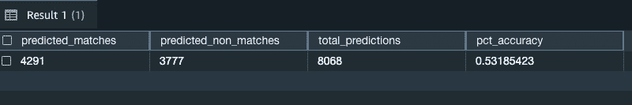

图 6.17 – 模型准确度

这个输出显示，当我们比较模型正确预测细分市场的次数与总输入记录数时，我们非常接近**.535028**的分数。

现在我们已经检查了模型准确度，我们就可以运行针对测试数据集的预测查询了。

## 运行预测查询

现在我们有了模型并进行了验证，我们可以运行预测查询来测试集，以便根据客户 ID 对潜在客户进行细分。你可以看到我们现在使用我们的函数对测试表进行操作以获取预测的细分：

```py
SELECT
id,
chapter6_supervisedclassification.predict_cust_segment_ll
(id,gender,ever_married,age,graduated,profession,work_experience,spending_score,family_size,var_1) as  segmentation
FROM chapter6_supervisedclassification.cust_segmentation_test;
```

这里显示了前 10 位客户：

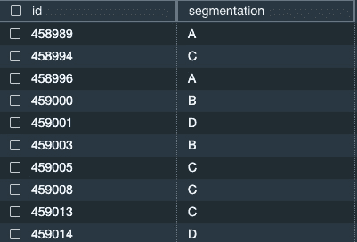

图 6.18 – 预测的细分市场

让我们看看新潜在客户是如何分布在各个细分市场中的：

```py
SELECT
    chapter6_supervisedclassification.predict_cust_segment_ll
    (id,gender,ever_married,age,graduated,profession,work_experience,spending_score,family_size,var_1) as  segmentation,
    count(*)
    FROM chapter6_supervisedclassification.cust_segmentation_test
   group by 1;
```

我们可以看到每个细分市场中有多少潜在客户：

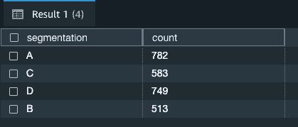

图 6.19 – 按细分市场的客户数量

现在你有了这些信息，你的营销团队就可以开始针对这些潜在客户进行努力了。

现在我们来看看你可以使用的一些其他选项来解决这个多类分类问题。

## 探索其他 CREATE MODEL 选项

我们还可以以几种不同的方式创建此模型，我们将在以下章节中探讨。了解可用的不同选项非常重要，这样你就可以进行实验并选择给你带来最佳模型的方案。

在第一个例子中，我们不会提供任何用户指导，例如指定`MODEL_TYPE`、`PROBLEM_TYPE`或`OBJECTIVE`。如果你是机器学习的新手，希望让 SageMaker Autopilot 为你确定这些，请使用这种方法。

然后，在下一个示例中，您可以看到如何提供`PROBLEM_TYPE`和`OBJECTIVE`。作为一个更有经验的机器学习用户，您现在应该能够识别出哪些`PROBLEM_TYPE`和`OBJECTIVE`实例最适合您的用例。当您提供这些输入时，将加速模型训练过程，因为 SageMaker Autopilot 将仅使用提供的用户指导进行训练。

### 创建无用户指导的模型

在这种方法中，我们让 SageMaker Autopilot 选择`MODEL_TYPE`、`PROBLEM_TYPE`和`OBJECTIVE`：

```py
CREATE MODEL chapter6_supervisedclassification.cust_segmentation_model
FROM (
SELECT
    id,
    gender,
    ever_married,
    age,
    graduated,
    profession,
    work_experience,
    spending_score,
    family_size,
    var_1,
    segmentation
FROM chapter6_supervisedclassification.cust_segmentation_train
)
TARGET segmentation
FUNCTION predict_cust_segment  IAM_ROLE default
SETTINGS (
  S3_BUCKET '<<your S3 Bucket>>',
  S3_GARBAGE_COLLECT OFF,
  MAX_RUNTIME 9600
);
```

注意，我们只提供了基本设置。我们没有指定`MODEL_TYPE`、`PROBLEM_TYPE`或`OBJECTIVE`。Amazon Redshift ML 和 SageMaker 将自动确定这是一个多类分类问题，并使用最佳模型类型。作为额外的练习，运行这个`CREATE MODEL`命令，然后运行`SHOW MODEL`命令。它将显示 Amazon SageMaker 用于训练模型的`MODEL_TYPE`参数。

### 创建具有一些用户指导的模型

在这个示例中，我们将提供`PROBLEM_TYPE`和`OBJECTIVE`，但我们将让 Amazon SageMaker 确定`MODEL_TYPE`：

```py
CREATE MODEL chapter6_supervisedclassification.cust_segmentation_model_ug
FROM (
SELECT
    id,
    gender,
    ever_married,
    age,
    graduated,
    profession,
    work_experience,
    spending_score,
    family_size,
    var_1,
    segmentation
FROM chapter6_supervisedclassification.cust_segmentation_train
)
TARGET segmentation
FUNCTION predict_cust_segment_ug  IAM_ROLE default
PROBLEM_TYPE MULTICLASS_CLASSIFICATION
OBJECTIVE 'accuracy'
SETTINGS (
  S3_BUCKET '<<your S3 Bucket>>',
  S3_GARBAGE_COLLECT OFF,
  MAX_RUNTIME 9600
  );
```

在这个示例中，我们让 Amazon Redshift ML 和 Amazon SageMaker 确定`MODEL_TYPE`，并传入`PROBLEM_TYPE`和`OBJECTIVE`。当您有空闲时间时，尝试不同的模型创建方法，并注意您在模型训练时间上看到的不同，以及比较`SHOW` `MODEL`命令的准确性和其他输出。

您还可以使用 XGBoost 创建多类分类模型，我们将在*第十章*中介绍。

# 摘要

在本章中，我们详细讨论了分类模型，并探讨了它们的常见用例。我们还解释了分类模型的`CREATE MODEL`语法，其中您通过提供模型类型和目标来指导训练模型。

您学习了如何使用 Amazon Redshift ML 进行二分类和多类分类，以及如何使用 XGBoost 和线性学习算法。我们还向您展示了如何检查模型状态，验证其准确性，并编写 SQL 查询在测试数据集上运行预测。

在下一章中，我们将向您展示如何使用 Amazon Redshift ML 构建回归模型。
