# 7

# 构建回归模型

在上一章中，我们学习了关于分类模型的内容。在本章中，我们将学习构建**线性回归**模型，其中我们预测数值变量。与分类模型不同，线性回归模型用于预测**连续数值**。与上一章类似，你也将学习 Redshift 提供的创建线性回归模型的多种方法。

本章将提供几个使用这些建模技术的商业问题的详细示例。在本章中，我们将介绍如何尝试不同的算法以获得最佳的回归模型。

到本章结束时，你将能够确定一个商业问题是否是线性回归，然后能够识别 Redshift 提供的正确方法来训练和构建模型。

在本章中，我们将探讨以下主要主题：

+   介绍回归算法

+   使用 XGBoost 算法创建简单的回归模型

+   创建多输入回归模型

# 技术要求

本章需要网络浏览器和访问以下内容：

+   AWS 账户

+   Amazon Redshift 无服务器端点

+   Amazon Redshift 查询编辑器 v2

你可以在此处找到本章使用的代码：

[`github.com/PacktPublishing/Serverless-Machine-Learning-with-Amazon-Redshift/blob/main/CodeFiles/chapter7/chapter7.sql`](https://github.com/PacktPublishing/Serverless-Machine-Learning-with-Amazon-Redshift/blob/main/CodeFiles/chapter7/chapter7.sql)

# 介绍回归算法

回归模型用于尝试预测数值结果，例如预测某件商品的售价。结果变量是你的目标，输入变量用于确定变量之间的关系，以便你可以在没有目标变量的数据集上预测未知的目标。

你可以有一个单一输入变量，也称为**简单线性回归**。例如，工作经验和薪水通常存在关联。

**多元线性回归**是指你有多个输入变量。例如，通过使用目标（价格）与各种输入（如面积、卧室数量、游泳池、地下室、地块大小和建造年份）之间的关系来预测特定邮编区房屋的售价。

一个好的线性回归模型在直线和数据点之间有很小的垂直距离。请参考以下图示：

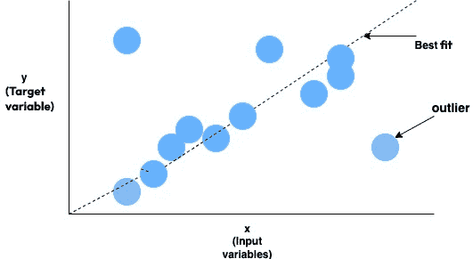

图 7.1 – 线性回归线

以下是一些回归模型有用的常见用例：

+   价格和收入预测

+   预测客户终身价值

+   预测天气

+   测量营销活动的有效性

本章将向您展示如何使用 XGBoost 和线性学习器算法在 Amazon Redshift ML 中构建回归模型，这些算法您在*第六章*中使用过。正如您将看到的，您可以在不同的机器学习问题上使用相同的算法。

我们已经研究了回归问题；现在让我们看看 Redshift 的`CREATE MODEL`命令来创建回归模型。

## 带有用户指导的 Redshift 的 CREATE MODEL

当在 Redshift 中使用`CREATE MODEL`命令时，系统将自动搜索最适合您特定数据集的预处理和模型组合。然而，在某些情况下，您可能希望对模型创建过程有更多的控制，或者希望结合领域特定的知识。

Redshift 提供了灵活性，以指导`CREATE MODEL`过程，从而减少 AutoML 作业所需的时间。

在本章中，我们将探讨`CREATE MODEL`语句的模型类型和问题类型参数。作为带有用户指导的`CREATE MODEL`的一部分，您还可以选择设置预处理程序，但我们将把这个话题留到*第十章*中。

当您指导 AutoML 作业时，作为机器学习模型创建者，您将决定使用哪种算法以及解决哪种问题类型。Redshift ML 仍然在幕后执行独立变量的特征工程——例如，在 20 个特征中，Redshift ML 将自动识别分类变量和数值变量，并在适用的情况下创建一个热编码值或数值变量的标准化，以及完成模型训练所需的各种其他任务。

总结来说，您让 Redshift ML 处理机器学习的大部分数据准备任务。作为模型创建者，您有选择在`CREATE MODEL`语句中使用哪种算法和问题类型的选项，这有助于减少训练时间，因为 SageMaker 不需要花费时间确定使用哪种算法或问题类型。

现在我们已经了解了带有用户指导的`CREATE MODEL`是什么，让我们开始创建一个简单的回归模型。

# 使用 XGBoost 创建简单的线性回归模型

为了构建我们的简单线性回归问题，我们将查看一个包括根据身高预测体重的数据集。这个数据集只有一个自变量，即英寸中的身高，用于预测磅重的体重。由于只有一个自变量，我们称这个模型为**简单线性** **回归**模型。

在本节中，我们将上传数据，分析它，为训练模型做准备，最后，我们将创建模型并使用模型创建的函数运行预测查询。

## 上传和分析数据

在本节中，我们将处理身高和体重数据集。

该数据集包含 25,000 名 18 岁参与者的合成身高和体重记录。这些数据基于 1993 年的成长调查，该调查对从出生到 18 岁的 25,000 名儿童进行了调查。参与者来自**母婴健康中心**（**MCHCs**）和学校，收集的数据被用于开发香港当前的体重、身高、体重/年龄、体重/身高和**体质指数**（**BMI**）的生长曲线。

更多关于此数据集的详细信息可以在以下链接找到：[`wiki.stat.ucla.edu/socr/index.php/SOCR_Data_Dinov_020108_HeightsWeights`](http://wiki.stat.ucla.edu/socr/index.php/SOCR_Data_Dinov_020108_HeightsWeights)。

数据集引用

Hung-Kwan So, Edmund AS Nelson, Albert M Li, Eric MC Wong, Joseph TF Lau, Georgia S Guldan, Kwok-Hang Mak, Youfa Wang, Tai-Fai Fok, 和 Rita YT Sung. (2008) *香港儿童身高、体重和体质指数的长期变化*。BMC Public Health. 2008; 8: 320\. doi: 10.1186/1471-2458-8-320\. PMCID: PMC2572616

Leung SS, Lau JT, Tse LY, Oppenheimer SJ。*香港儿童从出生到 18 岁的体重和身高参考值*。J Paediatr Child Health. 1996;32:103–109\. doi: 10.1111/j.1440-1754.1996.tb00904.x.

Leung SS, Lau JT, Xu YY, Tse LY, Huen KF, Wong GW, Law WY, Yeung VT, Yeung WK, 等人。*中国香港人站立身高、坐高和性成熟的长期变化——香港成长研究，1993*。Ann Hum Biol. 1996;23:297–306\. doi: 10.1080/03014469600004532.

在以下小节中，我们将讨论我们试图使用此数据集实现的预测目标，然后分析数据。

### 预测目标

目标是根据提供的身高作为数值预测儿童的体重。

该数据集包含以下列：

| **列** | **描述** |
| --- | --- |
| 索引 | 顺序号 |
| 英寸高的身高 | 儿童的身高数值 |
| 磅重的体重 | 儿童的体重数值 |

表 7.1 – 数据定义

### 数据分析

在成功连接到 Redshift 作为管理员或数据库开发者后，按照以下步骤创建模式和加载数据到 Amazon Redshift：

1.  导航到**Redshift 查询编辑器 v2**并连接到**无服务器**端点，然后连接到**dev**数据库。

1.  将未命名的查询编辑器保存为`Chapter7`来命名。

以下截图显示了无服务器连接，数据库设置为`Chapter7`：

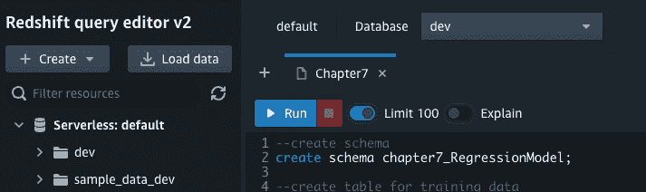

图 7.2 – 连接到无服务器端点

1.  按照以下步骤创建模式：

    ```py
    create schema chapter7_RegressionModel;
    ```

1.  使用以下代码创建一个表：

    ```py
    --create table to load data
    ```

    ```py
    DROP TABLE chapter7_RegressionModel.height_weight;
    ```

    ```py
    CREATE TABLE chapter7_RegressionModel.height_weight
    ```

    ```py
    (
    ```

    ```py
        Id integer,
    ```

    ```py
        HeightInches decimal(9,2),
    ```

    ```py
        weightPounds decimal(9,2)
    ```

    ```py
    )
    ```

    ```py
    ;
    ```

1.  使用以下命令加载数据：

    ```py
    TRUNCATE chapter7_RegressionModel.height_weight;
    ```

    ```py
    COPY chapter7_RegressionModel.height_weight
    ```

    ```py
    FROM 's3://packt-serverless-ml-redshift/chapter07/heightweight/HeightWeight.csv'
    ```

    ```py
    IAM_ROLE default
    ```

    ```py
    CSV
    ```

    ```py
    IGNOREHEADER 1
    ```

    ```py
    REGION AS 'eu-west-1';
    ```

1.  通过创建直方图来分析身高和体重数据集表。

1.  使用 Query Editor v2 的**图表**功能创建一个图表。首先，运行以下命令，然后点击**结果**窗格右侧的**图表**选项：

    ```py
    SELECT * FROM
    ```

    ```py
    chapter7_RegressionModel.height_weight
    ```

    ```py
    ORDER BY 2,3;
    ```

要生成以下图表，您需要向图表中添加两个轨迹。默认情况下，图表已加载一个轨迹，因此您需要添加一个额外的轨迹。您可以通过点击**+** **轨迹**按钮来添加它。

以下图表显示了两个变量。对于*轨迹 1*，在*y*轴上选择**heightinches**，将*x*轴留空。对于*轨迹 2*，在*y*轴上选择**weightpounds**，将*x*轴留空。生成的图表应该看起来像这样：

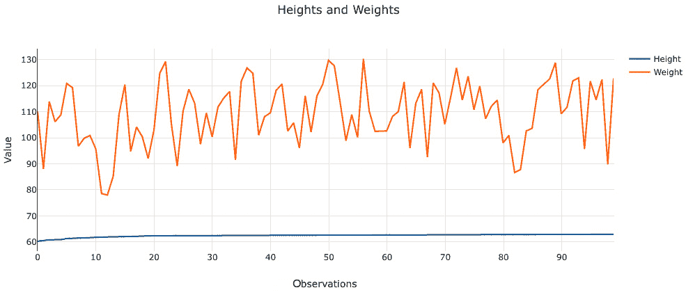

图 7.3 – 权重和身高

如您所见，随着身高的增加，权重呈现轻微的上升趋势。

现在我们已经分析了我们的数据集，我们将将其分割成训练集和验证集。训练集将用于训练我们的模型，验证集将用于评估模型的准确性。

## 将数据分割成训练集和验证集

由于我们只有一个数据集，让我们编写一个查询，将数据分割成两个逻辑集：训练集和验证集。

为了训练模型，让我们使用以下语法*where id%8 不等于 0*：

```py
SELECT * FROM
chapter7_RegressionModel.height_weight Where id%8!=0;
```

为了验证模型，让我们使用*where id%8 等于 0*：

```py
SELECT * FROM
chapter7_RegressionModel.height_weight Where id%8=0;
```

我们已经分析和准备了我们的输入数据，现在让我们创建一个机器学习模型。

## 创建一个简单的线性回归模型

在本节中，您将使用带有用户指导的`CREATE MODEL`来创建一个简单的线性回归模型，使用 XGBoost 算法。我们将通过训练机器学习模型来解决重量预测问题。该模型的目标是根据给定的高度预测重量。

我们将`MODEL_TYPE`设置为`xgboost`，将`PROBLEM_TYPE`设置为`regression`。我们将其他选项保留为默认值：

```py
DROP MODEL chapter7_RegressionModel.predict_weight;
CREATE MODEL chapter7_RegressionModel.predict_weight
FROM (select heightinches, cast(round(weightpounds,0) as integer) weightpounds from chapter7_RegressionModel.height_weight where id%8!=0 )
TARGET weightpounds
FUNCTION predict_weight
IAM_ROLE default
MODEL_TYPE xgboost
PROBLEM_TYPE regression
OBJECTIVE 'mse'
SETTINGS (s3_bucket '<<your-S3-bucket>>',
          s3_garbage_collect off,
          max_runtime 3600);
```

让我们看看我们在`CREATE MODEL`语句中提供的选项，并讨论它们如何影响 Amazon SageMaker 采取的行动。

在`CREATE MODEL`语句中，我们通过设置`MODEL_TYPE`来指导 Redshift ML 使用 XGBoost 算法。Amazon SageMaker Autopilot 作业不会使用其他支持的算法来训练模型 – 例如，**线性学习器**或**多层感知器**（**MLP**）。当此选项保留为默认值时，Amazon SageMaker 将使用 Autopilot 支持的所有算法来训练模型。

接下来，当我们把`PROBLEM_TYPE`设置为`regression`时，我们正在指导 Redshift ML 寻找一个模型来解决回归问题类型。

我们将`OBJECTIVE`设置为`mse`（**均方误差**），这是评估回归模型性能的常用方法。它是预测值与实际值之间平方差的平均值。

通过这三个指导选项，我们正在为 Amazon SageMaker Autopilot 创建边界。最终结果将是更少的训练时间，并附带 Autopilot 算法的其他好处——例如，调整超参数和数据预处理步骤，这些都是由 Amazon SageMaker Autopilot 自动处理的。

要检查模型的状态，请运行以下命令：

```py
SHOW MODEL chapter7_RegressionModel.predict_weight;
```

以下屏幕截图显示了`SHOW MODEL`命令的输出：

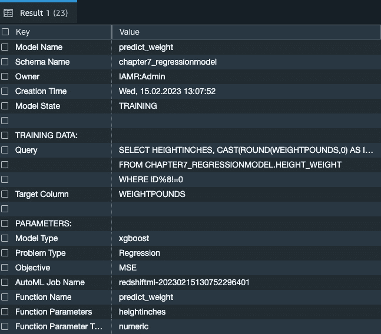

图 7.4 – 显示模型输出

模型仍在训练中，但您会注意到 Redshift ML 正在获取`CREATE MODEL`语句。

`predict_weight`用于生成预测，并在`SELECT`语句中使用，我们将在下一节中介绍。

在一段时间后再次运行`SHOW MODEL`命令，以检查模型训练是否完成。从下面的屏幕截图可以看出，模型训练已完成，MSE 已被选为模型评估的目标。这是由 Redshift ML 自动选择的，是线性回归模型的正确评估方法：

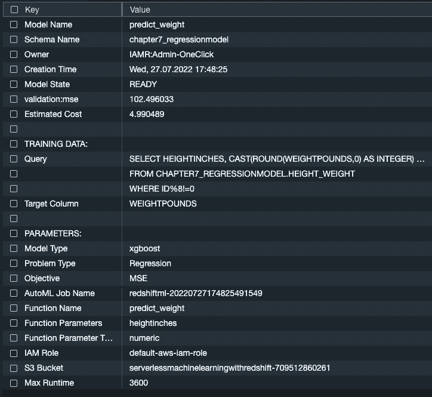

图 7.5 – 显示模型输出 – 模型就绪状态

我们已经训练并创建了模型；在下一步，我们将生成预测。

## 运行预测

由于我们的模型已经成功训练，让我们对未见过的数据集进行一些预测。

运行以下查询以找到模型精确预测英寸身高对应的磅体重记录，其中`id%8=0`。通过使用`WHERE id%8=0`，我们正在查看约 20%的数据集。这些是未包含在模型训练中的记录。如果您还记得，在`CREATE MODEL`语句中，我们指定了`WHERE id%8 !=0`：

```py
SELECT heightinches, CAST(chapter7_RegressionModel.predict_weight(CAST(ROUND(heightinches,0) as integer)) as INTEGER) as Predicted_Weightpounds,
  CAST(ROUND(weightpounds,0) as INTEGER) Original_Weightpounds ,
  Predicted_Weightpounds - Original_Weightpounds  as Difference
  FROM chapter7_RegressionModel.height_weight WHERE id%8=0
  AND Predicted_Weightpounds - Original_Weightpounds = 0;
```

下面是输出结果：

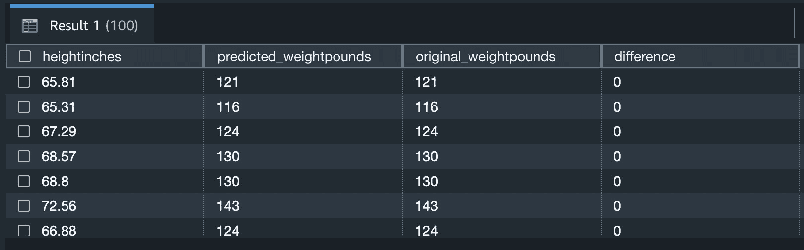

图 7.6 – 显示预测体重结果

现在，让我们检查 MSE 和**均方根** **误差**（**RMSE**）：

```py
  SELECT
   ROUND(AVG(POWER(( Original_Weightpounds - Predicted_Weightpounds ),2)),2) mse
    , ROUND(SQRT(AVG(POWER(( Original_Weightpounds - Predicted_Weightpounds ),2))),2) rmse
FROM
    ( select heightinches, cast(chapter7_RegressionModel.predict_weight(cast(round(heightinches,0) as integer)) as integer) as Predicted_Weightpounds,
  cast(round(weightpounds,0) as integer) Original_Weightpounds ,
  Predicted_Weightpounds - Original_Weightpounds as Difference
  from chapter7_RegressionModel.height_weight where id%8=0
);
```

下面是输出结果：

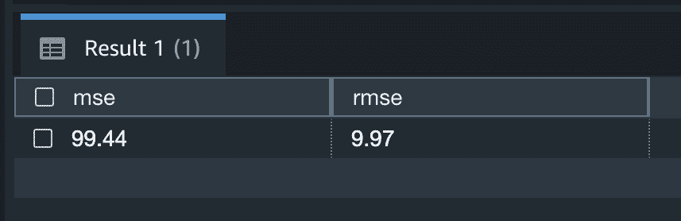

图 7.7 – MSE 和 RMSE 值

我们的多项式误差平方和（MSE）值较高；它代表可能存在异常值或我们没有足够变量的数据。例如，添加年龄和性别可能会提高预测分数。

让我们在折线图中比较预测分数和原始分数：

```py
 select heightinches, cast(chapter7_RegressionModel.predict_weight(cast(round(heightinches,0) as integer)) as integer) as Predicted_Weightpounds,
  cast(round(weightpounds,0) as integer) Original_Weightpounds ,
  Predicted_Weightpounds - Original_Weightpounds as Difference
  from chapter7_RegressionModel.height_weight where id%8=0;
```

一旦返回响应，请点击查询编辑器右侧的**图表**选项，为折线图添加一个轨迹，并选择**预测 _ 体重 _ 磅**。为折线图添加另一个轨迹并选择**原始 _ 体重 _ 磅**，然后添加第三个轨迹，但这次选择**条形图**并添加**差异**列。

在下面的图表中，您将注意到预测分数正在遵循原始分数。差异显示在图表底部，它提供了关于方差或误差的信息：

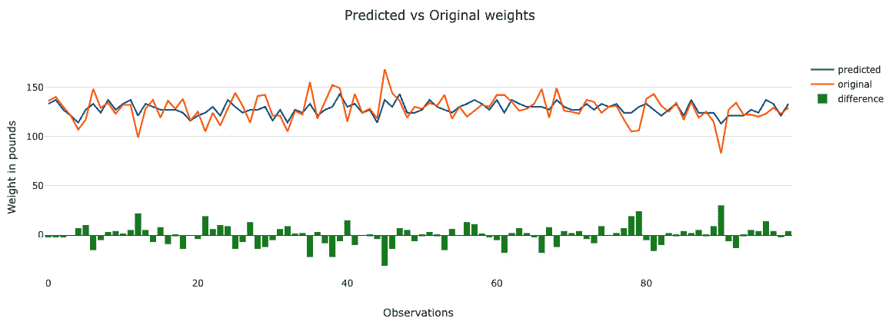

图 7.8 – 预测值与原始权重对比

我们已经学习了如何使用 Redshift ML 创建简单的回归模型。现在让我们来了解多输入回归模型。

# 创建多输入回归模型

在这个练习中，你将学习如何在 Amazon Redshift ML 中使用多个输入变量构建回归模型。

您的任务是构建和训练一个模型，以预测即将举行的活动收入，以便主动采取措施增加门票销售，确保收入数字达到公司的目标。

在成功连接到 Redshift 作为管理员或数据库开发者后，将数据加载到 Amazon Redshift。

导航到**Redshift 查询编辑器 v2**并连接到**无服务器**端点和**dev**数据库。

使用您为上一个练习创建的相同架构和**查询编辑器**页面。

使用以下 SQL 命令创建您的输入表并加载数据：

```py
CREATE TABLE chapter7_RegressionModel.sporting_event_ticket_info (
ticket_id double precision ,
event_id bigint,
sport character varying(500),
event_date_time timestamp without time zone,
home_team character varying(500),
away_team character varying(500),
location character varying(500),
city character varying(500),
seat_level bigint,
seat_section bigint,
seat_row character varying(500),
seat bigint ENCODE az64,
list_ticket_price double precision,
final_ticket_price double precision ,
ticketholder character varying(500)
)
DISTSTYLE AUTO;
COPY chapter7_RegressionModel.sporting_event_ticket_info
FROM 's3://packt-serverless-ml-redshift/chapter07/ticket_info'
IAM_ROLE default
FORMAT AS CSV DELIMITER ',' QUOTE '"'
REGION AS 'eu-west-1';
```

让我们分析我们的数据集，并获取过去几个月的票务销售历史趋势：

```py
Select extract(month from event_date_time) as month,
sum(cast (final_ticket_price as decimal(8,2))) as ticket_revenue
From chapter7_RegressionModel.sporting_event_ticket_info
where event_date_time < '2019-10-27'
group by 1
order by 1;
```

输出如下：

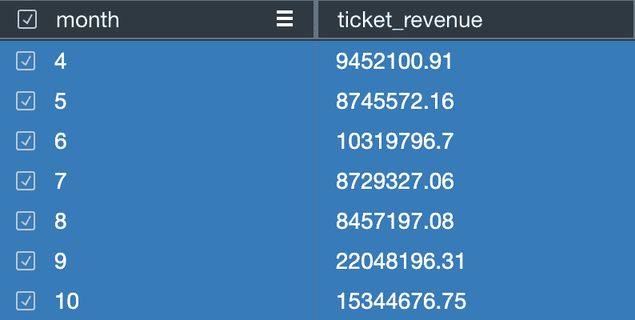

图 7.9 – 按月计算的票务收入

我们可以看到，在**7**月和**8**月，销售额呈现出峰值并急剧下降。让我们创建一个模型，以便我们可以预测那些将会有较低门票收入的团队。在创建我们的模型之前，我们需要将数据集分别划分为训练集、验证集和测试集。

1.  在查询编辑器 v2 中执行以下代码以创建 `training` 表：

    ```py
    CREATE TABLE chapter7_RegressionModel.sporting_event_ticket_info_training (
    ```

    ```py
        ticket_id double precision ,
    ```

    ```py
        event_id bigint,
    ```

    ```py
        sport character varying(500),
    ```

    ```py
        event_date_time timestamp without time zone,
    ```

    ```py
        home_team character varying(500),
    ```

    ```py
        away_team character varying(500),
    ```

    ```py
        location character varying(500),
    ```

    ```py
        city character varying(500),
    ```

    ```py
        seat_level bigint,
    ```

    ```py
        seat_section bigint,
    ```

    ```py
        seat_row character varying(500),
    ```

    ```py
        seat bigint ENCODE az64,
    ```

    ```py
        list_ticket_price double precision,
    ```

    ```py
        final_ticket_price double precision ,
    ```

    ```py
        ticketholder character varying(500)
    ```

    ```py
    )
    ```

    ```py
    DISTSTYLE AUTO;
    ```

1.  下一步是将 ~70% 的数据插入到 `训练` 表中：

    ```py
    --insert ~70% of data into training_set
    ```

    ```py
    insert into   chapter7_RegressionModel.sporting_event_ticket_info_training
    ```

    ```py
    (  ticket_id ,event_id ,sport , event_date_time,  home_team , away_team , location , city , seat_level, seat_section,
    ```

    ```py
        seat_row ,  seat, list_ticket_price, final_ticket_price, ticketholder )
    ```

    ```py
     select
    ```

    ```py
     ticket_id ,event_id ,sport , event_date_time,  home_team , away_team , location , city , seat_level, seat_section,
    ```

    ```py
        seat_row ,  seat, list_ticket_price, final_ticket_price, ticketholder
    ```

    ```py
     from chapter7_RegressionModel.sporting_event_ticket_info
    ```

    ```py
     where event_date_time < '2019-10-20';
    ```

1.  接下来，你将创建`验证`表：

    ```py
    CREATE TABLE chapter7_RegressionModel.sporting_event_ticket_info_validation (
    ```

    ```py
        ticket_id double precision ,
    ```

    ```py
        event_id bigint,
    ```

    ```py
        sport character varying(500),
    ```

    ```py
        event_date_time timestamp without time zone,
    ```

    ```py
        home_team character varying(500),
    ```

    ```py
        away_team character varying(500),
    ```

    ```py
        location character varying(500),
    ```

    ```py
        city character varying(500),
    ```

    ```py
        seat_level bigint,
    ```

    ```py
        seat_section bigint,
    ```

    ```py
        seat_row character varying(500),
    ```

    ```py
        seat bigint ENCODE az64,
    ```

    ```py
        list_ticket_price double precision,
    ```

    ```py
        final_ticket_price double precision ,
    ```

    ```py
        ticketholder character varying(500)
    ```

    ```py
    )
    ```

    ```py
    DISTSTYLE AUTO;
    ```

1.  接下来，将 ~10% 的数据插入到 `验证` 表中：

    ```py
    insert into  chapter7_RegressionModel.sporting_event_ticket_info_validation
    ```

    ```py
    (  ticket_id ,event_id ,sport , event_date_time,  home_team , away_team , location , city , seat_level, seat_section,
    ```

    ```py
        seat_row ,  seat, list_ticket_price, final_ticket_price, ticketholder )
    ```

    ```py
     select
    ```

    ```py
     ticket_id ,event_id ,sport , event_date_time,  home_team , away_team , location , city , seat_level, seat_section,
    ```

    ```py
        seat_row ,  seat, list_ticket_price, final_ticket_price, ticketholder
    ```

    ```py
     from chapter7_RegressionModel.sporting_event_ticket_info
    ```

    ```py
     where event_date_time between '2019-10-20' and '2019-10-22' ;
    ```

1.  最后，创建`测试`表：

    ```py
    CREATE TABLE chapter7_RegressionModel.sporting_event_ticket_info_testing (
    ```

    ```py
        ticket_id double precision ,
    ```

    ```py
        event_id bigint,
    ```

    ```py
        sport character varying(500),
    ```

    ```py
        event_date_time timestamp without time zone,
    ```

    ```py
        home_team character varying(500),
    ```

    ```py
        away_team character varying(500),
    ```

    ```py
        location character varying(500),
    ```

    ```py
        city character varying(500),
    ```

    ```py
        seat_level bigint,
    ```

    ```py
        seat_section bigint,
    ```

    ```py
        seat_row character varying(500),
    ```

    ```py
        seat bigint ENCODE az64,
    ```

    ```py
        list_ticket_price double precision,
    ```

    ```py
        final_ticket_price double precision ,
    ```

    ```py
        ticketholder character varying(500)
    ```

    ```py
    )
    ```

    ```py
    DISTSTYLE AUTO;
    ```

1.  接下来，将 ~20% 的数据插入到 `testing` 表中：

    ```py
    insert into   chapter7_RegressionModel.sporting_event_ticket_info_testing
    ```

    ```py
    (  ticket_id ,event_id ,sport , event_date_time,  home_team , away_team , location , city , seat_level, seat_section,
    ```

    ```py
        seat_row ,  seat, list_ticket_price, final_ticket_price, ticketholder )
    ```

    ```py
    select
    ```

    ```py
     ticket_id ,event_id ,sport , event_date_time,  home_team , away_team , location , city , seat_level, seat_section,
    ```

    ```py
        seat_row ,  seat, list_ticket_price, final_ticket_price, ticketholder
    ```

    ```py
     from chapter7_RegressionModel.sporting_event_ticket_info
    ```

    ```py
     where event_date_time >  '2019-10-22'
    ```

    ```py
     ;
    ```

我们已经准备好了用于训练和测试机器学习模型的数据库；现在让我们使用线性学习器算法创建一个回归模型。

## 线性学习算法

如我们在*第六章*中看到的，您可以使用线性学习器模型类型来解决分类或回归问题。这是一个监督学习算法。对于回归问题，我们试图预测一个数值结果，在这个练习中，我们将使用多个输入；SageMaker 将根据连续目标使用均方误差（MSE）来选择最佳模式。

我们提供了一个包含我们的输入或关于数据的观察以及标签的训练集，标签代表我们想要预测的值。我们的目标是准确预测未来的票务销售。

我们将 `MODEL_TYPE` 设置为 `LINEAR_LEARNER`，`PROBLEM_TYPE` 设置为 `regression`，`OBJECTIVE` 设置为 `mse`。我们保留其他选项为默认值。

在查询编辑器 v2 中执行此代码以训练模型。请确保使用你之前创建的存储桶替换以下 S3 桶。你需要输入你之前创建的 S3 桶来存储 Redshift ML 工件。

运行以下命令来训练回归模型：

```py
CREATE MODEL chapter7_RegressionModel.predict_ticket_price_linlearn from
chapter7_RegressionModel.sporting_event_ticket_info_training
TARGET final_ticket_price
FUNCTION predict_ticket_price_linlearn
IAM_ROLE default
MODEL_TYPE LINEAR_LEARNER
PROBLEM_TYPE regression
OBJECTIVE 'mse'
SETTINGS (s3_bucket '<<your-S3-Bucket>>',
s3_garbage_collect off,
max_runtime 9600);
```

一旦模型状态为 **READY**，你就可以继续了。要检查模型状态，请运行以下命令：

```py
SHOW MODEL chapter7_RegressionModel.predict_ticket_price_linlearn;
```

注意你看到的 MSE 分数；它将与 *图 7.10* 中的输出相似：

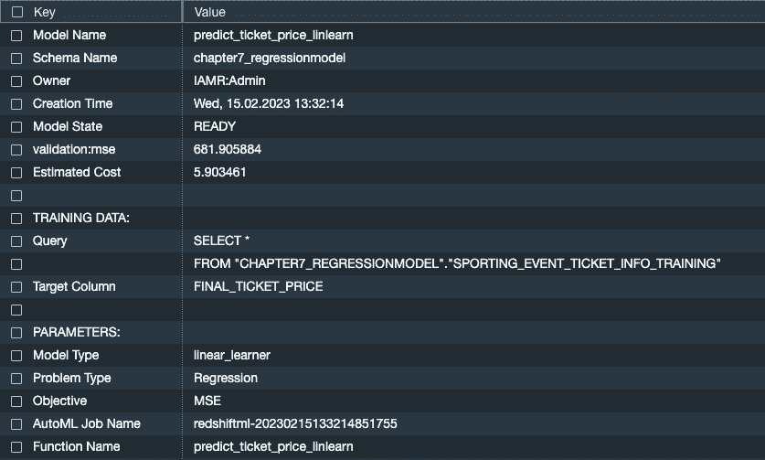

图 7.10 – SHOW MODEL 输出

我们现在已经创建了机器学习模型；让我们验证其性能。

## 理解模型评估

你通过 MSE 和/或 RMSE 来衡量回归问题的模型性能。这是预测数值目标和实际数值答案之间的距离，也称为 `SHOW MODEL` 输出，我们看到 MSE。我们也可以通过平方实际值和预测值之间的差异然后取平均值来自己计算这个值。然后，取 MSE 的平方根得到 RMSE。MSE 和 RMSE 分数越低，表示越好。

如我们从 `SHOW MODEL` 输出中看到，我们的 MSE 分数超过 681 - 让我们通过运行以下 SQL 命令来检查这个和 RMSE 分数与我们的验证：

```py
SELECT
      ROUND(AVG(POWER(( actual_price_revenue - predicted_price_revenue ),2)),2) mse
    , ROUND(SQRT(AVG(POWER(( actual_price_revenue - predicted_price_revenue ),2))),2) rmse
FROM
    (select home_team, chapter7_RegressionModel.predict_ticket_price_linlearn (ticket_id, event_id, sport, event_date_time, home_team, away_team,
Location, city, seat_level, seat_section, seat_row, seat,
list_ticket_price ,ticketholder ) as predicted_price_revenue,
 final_ticket_price  as actual_price_revenue
From chapter7_RegressionModel.sporting_event_ticket_info_validation
     );
```

这是查询的输出：

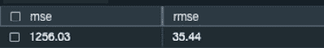

图 7.11 – MSE 和 RMSE 值

虽然 MSE 分数似乎有点高，我们也可以运行一个验证查询来检查我们的准确率。你会在下面的查询中注意到它使用了由我们的 `CREATE MODEL` 命令生成的函数来获取预测价格收入，以便与我们比较实际价格收入：

```py
Select home_team,
sum(cast(chapter7_RegressionModel.predict_ticket_price_linlearn (ticket_id, event_id, sport,
event_date_time, home_team, away_team,
Location, city, seat_level, seat_section, seat_row, seat,
list_ticket_price ,ticketholder ) as decimal(8,2) )) as predicted_price_revenue,
sum(cast (final_ticket_price as decimal(8,2))) as actual_price_revenue,
(predicted_price_revenue - actual_price_revenue) as diff,
abs((predicted_price_revenue - actual_price_revenue)/actual_price_revenue) * 100  as pct_diff
From chapter7_RegressionModel.sporting_event_ticket_info_validation
group by 1
order by 5 desc ;
```

这是查询的输出：

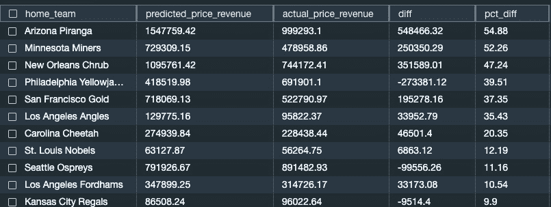

图 7.12 – 预测价格与实际价格

观察结果，模型的表现不如我们期望。你可以运行验证查询来查看训练数据，你会发现模型在训练数据上的表现也不太好——这被称为**欠拟合**。

一个解决方案是添加更多特征，但我们已经使用了所有可用的特征。

让我们再次运行模型，但这次我们将使用 `auto` 选项，让 SageMaker 选择算法：

```py
CREATE MODEL Chapter7_RegressionModel.predict_ticket_price_auto
from
chapter7_RegressionModel.sporting_event_ticket_info_training
TARGET final_ticket_price
FUNCTION predict_ticket_price_auto
IAM_ROLE default
PROBLEM_TYPE regression
OBJECTIVE 'mse'
SETTINGS (s3_bucket '<<your-S3-bucket>>',
s3_garbage_collect off,
max_runtime 9600);
```

在让模型训练一段时间后，按照以下方式检查模型的状态：

```py
SHOW MODEL Chapter7_RegressionModel.predict_ticket_price_auto;
```

这是它的样子：

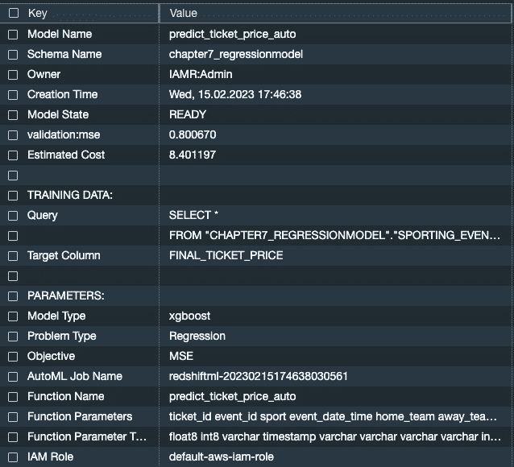

图 7.13 – SHOW MODEL 输出

从前面的图中，我们看到两个突出的事情：

+   MSE 分数要好得多

+   Amazon SageMaker 选择使用 XGBoost 算法

我们可以使用验证数据集来检查我们新模型的 MSE 和 RMSE 分数，如下所示：

```py
SELECT
      ROUND(AVG(POWER(( actual_price_revenue - predicted_price_revenue ),2)),2) mse
    , ROUND(SQRT(AVG(POWER(( actual_price_revenue - predicted_price_revenue ),2))),2) rmse
FROM
    (select home_team, chapter7_RegressionModel.predict_ticket_price_auto (ticket_id, event_id, sport, event_date_time, home_team, away_team,
Location, city, seat_level, seat_section, seat_row, seat,
list_ticket_price ,ticketholder ) as predicted_price_revenue,
 final_ticket_price  as actual_price_revenue
From chapter7_RegressionModel.sporting_event_ticket_info_validation
     );
```

这是输出：

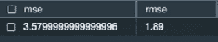

图 7.14 – MSE 和 RMSE 分数

这些 MSE 和 RMSE 值表明我们有一个很好的模型。

让我们使用新模型的`predict_ticket_price_auto`函数运行一个验证查询：

```py
Select home_team,
sum(cast(chapter7_RegressionModel.predict_ticket_price_auto (ticket_id, event_id, sport, event_date_time, home_team, away_team,
Location, city, seat_level, seat_section, seat_row, seat,
list_ticket_price ,ticketholder ) as decimal(8,2) )) as predicted_price_revenue,
sum(cast (final_ticket_price as decimal(8,2))) as actual_price_revenue,
(predicted_price_revenue - actual_price_revenue) as diff,
((predicted_price_revenue - actual_price_revenue)/actual_price_revenue) * 100  as pct_diff
From chapter7_RegressionModel.sporting_event_ticket_info_validation
group by 1
order by 5 desc;
```

以下是该查询的输出：

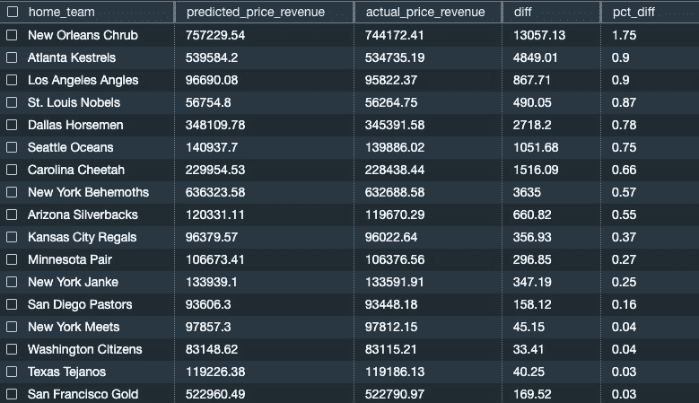

图 7.15 – 预测价格与实际价格对比

您可以看到，当我们比较实际票价收入与预测票价收入之间的差异时，我们得到了更好的结果。我们将使用这个模型来进行我们的预测查询。

运行以下查询以查看哪些输入对模型预测贡献最大：

```py
set search_path to chapter7_regressionmodel;
select json_table.report.explanations.kernel_shap.label0.global_shap_values from
 (select explain_model('predict_ticket_price_auto') as report) as json_table
```

为了使结果集更容易阅读，右键单击结果集并选择**复制行**。然后您可以将它粘贴到如图*图 7.16*所示的编辑器中：

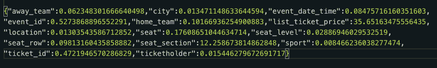

图 7.16 – 模型可解释性报告

这表明`list_ticket_price`贡献了最大的权重，而`sport`贡献了最小的权重。

我们已经使用验证数据集验证了模型，检查了 MSE 值，并确定了特征重要性。现在让我们在测试数据上运行预测查询。

## 预测查询

现在我们有了模型并完成了验证，我们可以运行我们的预测查询以测试数据集，以确定哪些团队和活动需要采取主动措施来增加票务销售。让我们检查预测收入低于 20 万的团队：

```py
select t1.home_team, predicted_price_revenue
from
(Select home_team,
sum(cast(chapter7_RegressionModel.predict_ticket_price_auto (ticket_id, event_id, sport, event_date_time, home_team, away_team,
Location, city, seat_level, seat_section, seat_row, seat,
list_ticket_price ,ticketholder ) as decimal (8,2) ) ) as predicted_price_revenue
From chapter7_RegressionModel.sporting_event_ticket_info_testing
group by 1) t1
where predicted_price_revenue < 200000;
```

这是结果：

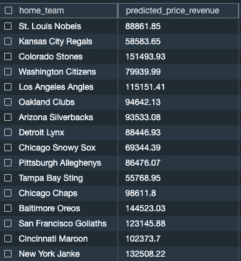

图 7.17 – 预测价格与测试数据集对比

有 16 个团队预测将减少票务收入。您可以与您的营销团队分享此信息，以创建一个专注的战略，确保票务收入可以保持稳定。

# 摘要

在本章中，我们详细讨论了回归模型，并了解了如何创建单输入和多输入回归模型。我们学习了如何轻松预测数值。我们还学习了如何验证回归模型，采取行动提高我们模型的准确性，并使用回归模型进行预测查询。我们探讨了使用 XGBoost、线性学习者和`auto`选项来训练模型的选择。

我们还了解了如何使用 Redshift 中的 SQL 命令从`SHOW MODEL`输出中检查和验证 MSE 分数。

在下一章中，我们将向您展示如何使用 K-means 算法创建无监督模型。
