# 8

# 使用 K-Means 聚类构建无监督模型

到目前为止，我们已经学习了关于构建带有标签数据的机器学习模型（**ML**）。在本章中，我们将学习如何使用**K-means 聚类算法**在没有任何标签的数据集上构建机器学习模型。与**监督模型**不同，监督模型在观察层面进行预测，而 K-means 聚类将观察结果分组到具有共同特征的簇中——例如，相似的人口统计或阅读习惯。

本章将提供使用这些建模技术的详细业务问题示例。到本章结束时，您将能够识别一个可以应用**无监督建模技术**的业务问题。您还将学习如何构建、训练和评估 K-means 模型的性能。

在本章中，我们将涵盖以下主要主题：

+   通过聚类分析分组数据

+   创建 K-means 机器学习模型

+   评估 K-means 聚类结果

# 技术要求

本章需要使用网络浏览器并访问以下内容：

+   AWS 账户

+   Amazon Redshift 无服务器端点

+   Amazon Redshift 查询编辑器 v2

+   完成第一章中的“Amazon Redshift 无服务器入门”部分

您可以在以下链接找到本章使用的代码：[`github.com/PacktPublishing/Serverless-Machine-Learning-with-Amazon-Redshift/blob/main/CodeFiles/chapter8/chapter8.sql`](https://github.com/PacktPublishing/Serverless-Machine-Learning-with-Amazon-Redshift/blob/main/CodeFiles/chapter8/chapter8.sql).

# 通过聚类分析分组数据

到目前为止，我们已经探讨了包含输入和目标变量的数据集，并使用一组输入变量和目标变量训练了一个模型。这被称为监督学习。然而，如何处理不包含标签以监督训练的数据集呢？**Amazon Redshift ML** 支持使用聚类分析方法进行无监督学习，也称为 K-means 算法。在**聚类分析**中，机器学习算法自动发现数据点的分组。例如，如果您有 1,000 人的群体，聚类算法可以根据身高、体重或年龄将他们分组。

与监督学习不同，监督学习中的机器学习模型基于标签预测结果，无监督模型使用未标记的数据。无监督学习的一种类型是聚类，其中未标记数据根据其相似性或差异分组。从关于个人人口统计信息的数据集中，你可以根据年轻、成年和老年人口，体重过轻、正常体重和超重人口等创建聚类。这些群体基于值计算——例如，如果两个人都是年轻人，那么他们会被分到一组。这些群体被称为**聚类**。在下面的图中，你可以看到输入变量（**年龄**、**身高**和**体重**）被分组到**年轻**、**成年**和**老年**：

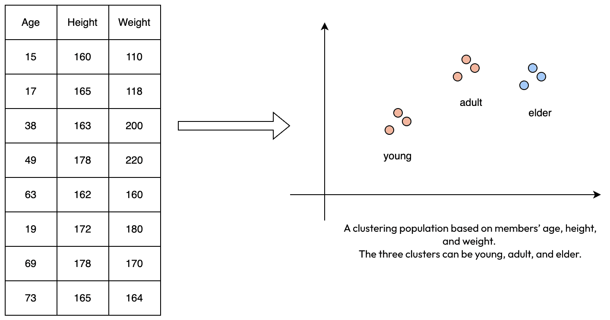

图 8.1 – 一个简单的聚类示例

在前面的图中，每个数据点根据其到聚类中心的距离被放置在聚类中，这个距离称为**质心**。每个数据点到质心的距离使用**欧几里得距离公式**计算。距离给定质心最近的数据点具有相似性，属于同一组。在现实世界中，经常遇到具有重叠聚类和大量数据点的情况。当你遇到过多的聚类时，确定数据集的正确聚类数量就成了一项挑战。

K-means 聚类的常见用例包括以下内容：

+   **电子商务**：根据购买历史分组客户

+   **医疗保健**：检测疾病模式

+   **金融**：将购买行为分为异常和正常

接下来，我们将向您展示一种常见的方法，帮助您确定应该使用多少个聚类。

# 确定最佳聚类数量

一种常用的方法是**肘部方法**。肘部方法的想法是运行具有不同 K 值的 K-means 算法——例如，从 1 个聚类到 10 个聚类——并为每个 K 值计算平方误差之和。然后，绘制**平方偏差之和**（**SSD**）值的图表。SSD 是平方差的和，用于衡量方差。如果折线图看起来像一条臂，那么臂上的**肘部**就是各种 K 值中最佳的 K 值。这种方法背后的原理是，SSD 通常随着 K 值的增加而减少，而评估方法的目的是追求更低的 SSD 或**均方偏差**（**MSD**）值。肘部代表一个起点，当 K 值增加时，SSD 开始减少回报。

在下面的图表中，你可以看到当 MSD 值在不同 K 值上绘制时，代表一条臂，而**肘部**在值**6**处。在**6**之后，MSD 值没有显著下降，因此我们可以选择**6**作为以下场景中最佳的聚类值：

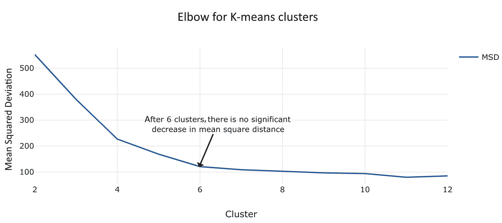

图 8.2 – 在不同的 K 值上绘制 MSD 值

接下来，让我们看看如何使用 Amazon Redshift ML 创建 K-means 聚类模型。

# 创建 K-means 机器学习模型

在本节中，我们将通过一个用例来介绍这个过程。在这个用例中，假设您是一家专注于家居改善商品的电子商务公司的数据分析师。您被要求根据收入对不同地区的经济部门进行分类，以便您可以更好地根据各种因素，如中位房价，来定位客户。我们将使用 Kaggle 上的此数据集：[`www.kaggle.com/datasets/camnugent/california-housing-prices`](https://www.kaggle.com/datasets/camnugent/california-housing-prices)。

从这个数据集中，您将使用 `median_income`、`latitude` 和 `longitude` 属性，以便可以根据 `location` 和 `income` 创建聚类。

创建 K-means 模型的语法与您迄今为止所使用的语法略有不同，所以让我们深入探讨一下。

## 创建 K-means 聚类模型的语法概述

创建 K-means 模型的基本语法如下：

```py
CREATE model model_name
FROM (Select_statement)
FUNCTION  function_name
IAM_ROLE default
AUTO OFF
MODEL_TYPE KMEANS
PREPROCESSORS (StandardScaler', 'MinMax', 'NumericPassthrough')
HYPERPARAMETERS DEFAULT EXCEPT (K '2')
SETTINGS (S3_BUCKET 'bucket name');
```

在前面的代码片段中，有几个要点需要注意，它们以粗体显示，因为它们在创建 K-means 模型时是必需的：

+   `AUTO OFF`：由于不使用 Amazon SageMaker Autopilot，因此必须关闭此选项

+   `MODEL_TYPE` `KMEANS`：您必须设置 `MODEL_TYPE`，因为 K-means 没有自动发现功能。

+   `HYPERPARAMETERS DEFAULT EXCEPT (K '2')`：这告诉 SageMaker 在此模型中创建多少个聚类

此外，请注意，K-means 有三个可选的预处理程序可用。我们将在创建模型时更详细地探讨这一点。

您可以参考此链接以获取有关可用 K-means 参数的更多详细信息：[`docs.aws.amazon.com/redshift/latest/dg/r_create_model_use_cases.html#r_k-means-create-model-parameters`](https://docs.aws.amazon.com/redshift/latest/dg/r_create_model_use_cases.html#r_k-means-create-model-parameters)。

现在，我们将加载数据集，为创建模型做准备。

## 上传和分析数据

对于此用例，我们将使用一个包含房价信息和基于人口普查数据的摘要统计信息的文件。

注意

数据存储在以下 S3 位置：`s3://packt-serverless-ml-redshift/chapter08/housinghousing_prices.csv`。

在成功连接到 Redshift 作为管理员或数据库开发者后，将数据加载到 Amazon Redshift 并遵循此处概述的步骤。

1.  导航到 Redshift **查询编辑器** **v2**，连接到 **Serverless: default** 端点，然后连接到 **dev** 数据库。

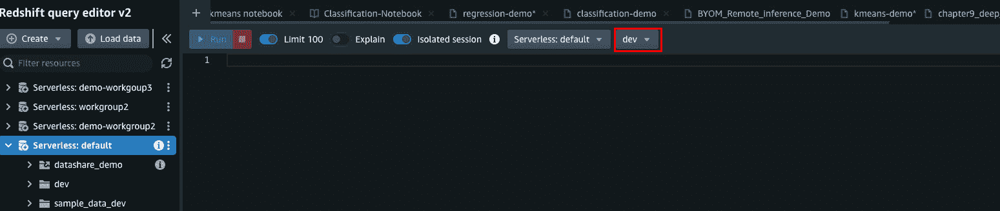

图 8.3 – 通过 Redshift 查询编辑器 v2 连接

1.  执行以下步骤以创建架构和客户表并加载数据：

    ```py
    create schema chapter8_kmeans_clustering;
    ```

    ```py
    create table chapter8_kmeans_clustering.housing_prices (
    ```

    ```py
        longitude decimal(10,2),
    ```

    ```py
        latitude decimal(10,2),
    ```

    ```py
        housing_median_age integer,
    ```

    ```py
        total_rooms integer,
    ```

    ```py
        total_bedrooms integer,
    ```

    ```py
        population integer,
    ```

    ```py
        households integer,
    ```

    ```py
        median_income decimal(10,6),
    ```

    ```py
        median_house_value integer,
    ```

    ```py
        ocean_proximity character varying (50)
    ```

    ```py
    )
    ```

    ```py
    diststyle auto;
    ```

    ```py
    copy chapter8_kmeans_clustering.housing_prices from 's3://packt-serverless-ml-redshift/chapter08/kmeans/housing_prices.csv'
    ```

    ```py
    iam_role default format as csv delimiter ',' quote '"' ignoreheader 1 region as 'eu-west-1';
    ```

此数据集包含 2,064,020,640 条记录。我们将在模型中使用 `longitude`、`latitude` 和 `median_income`。

1.  运行以下查询以检查一些样本数据：

    ```py
    select * from chapter8_kmeans_clustering.housing_prices
    ```

    ```py
    limit 10;
    ```

你应该得到以下结果：

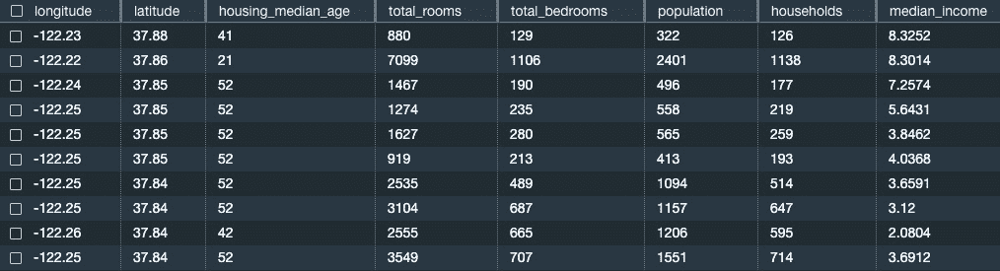

图 8.4 – 房价数据

现在数据已加载，我们准备创建模型。

## 创建 K-means 模型

让我们根据 `median_income`、`longitude` 和 `latitude` 创建我们的模型和聚类。

我们将创建一些模型，然后使用肘部方法来确定最佳聚类数量。

首先，让我们使用以下 SQL 创建我们的第一个模型，包含两个聚类。然后，你可以通过改变 K 值来创建不同的模型进行实验，并了解 MSD 值在不同 K 值下的减少情况。

### 使用 K 值为 2 创建两个聚类

让我们在查询编辑器 v2 中运行以下 SQL 以创建具有两个聚类的模型：

```py
create model chapter8_kmeans_clustering.housing_segments_k2
from(select
            median_income,
            latitude,
            longitude
from chapter8_kmeans_clustering.housing_prices)
function  get_housing_segment_k2
iam_role default
auto off
model_type kmeans
preprocessors '[
      {
        "columnset": [ "median_income", "latitude","longitude" ],
        "transformers": [ "standardscaler" ]
      }
    ]'
hyperparameters default except (k '2')
settings (s3_bucket '<your s3 bucket>');
```

你可以在这个模型中看到我们为 `preprocessors` 参数提供了值。我们选择这样做是因为 K-means 对尺度敏感，因此我们可以使用 `standardscaler` 转换器进行归一化。`standardscalar` 将均值和尺度移动到单位方差。

`hyperparameters` 参数是我们指定 `(K '2')` 来创建两个聚类的位置。请记住添加你的 S3 存储桶，其中存储了创建的模型工件。你将在 `s3: s3://<your-s3-bucket>/redshift-ml/housing_segments_k2/` 中找到模型工件。Redshift ML 将自动将 `'redshift-ml'/'your model name'` 添加到你的 S3 存储桶。现在，使用查询编辑器 v2 中的 `SHOW MODEL` 命令检查模型的状态：

```py
SHOW MODEL chapter8_kmeans_clustering.housing_segments_k2;
```

你将看到以下输出：

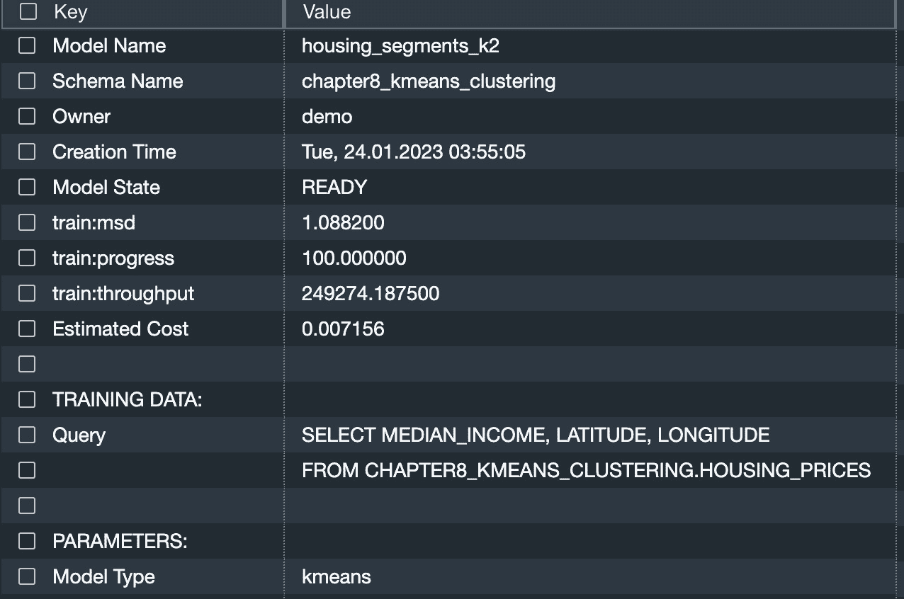

图 8.5 – 两个聚类

需要注意的关键点是 **模型状态**，它表示模型已准备好，以及 **train:msd**，这是目标指标。这代表我们输入数据集中每个记录与模型最近中心的平均平方距离。**MSD** 值为 **1.088200**，这是一个不错的分数。

让我们运行一个查询以获取每个聚类中的数据点数量：

```py
  select chapter8_kmeans_clustering.get_housing_segment_k2 (median_income, latitude, longitude) as cluster, count(*) as count from FROM chapter8_kmeans_clustering.housing_prices group byGROUP BY 1 order byORDER BY 1;
```

输出如下：

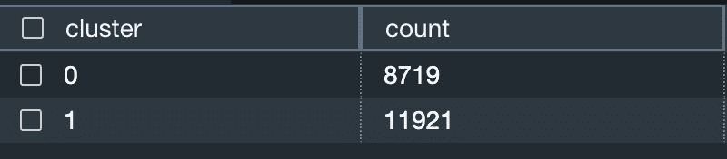

图 8.6 – 数据点

聚类从 `0` 到 `n` 编号。我们的第一个聚类有 **8719** 个数据点，第二个聚类有 **11921** 个数据点。

在我们的用例中，我们希望进一步细分我们的客户。让我们创建一些具有不同聚类数量的更多模型。然后，我们可以评估所有 SSD 值，并应用肘部方法来帮助我们选择用于分析的最佳聚类数量。

### 使用 K 值为 3 创建三个聚类

让我们在查询编辑器 v2 中运行以下 SQL 以创建具有三个聚类的模型：

```py
CREATE model chapter8_kmeans_clustering.housing_segments_k3
FROM(Select
            median_income,
            latitude,
            longitude
From chapter8_kmeans_clustering.housing_prices)
FUNCTION  get_housing_segment_k3
IAM_ROLE default
AUTO OFF
MODEL_TYPE KMEANS
PREPROCESSORS '[
      {
        "ColumnSet": [ "median_income", "latitude","longitude" ],
        "Transformers": [ "StandardScaler" ]
      }
    ]'
HYPERPARAMETERS DEFAULT EXCEPT (K '3')
SETTINGS (S3_BUCKET '<your s3 bucket>');
```

### 创建剩余的模型，包含 4、5 和 6 个聚类

将前面的代码重复 3 次以创建具有 4、5 和 6 个簇的模型。你可以在 [`github.com/PacktPublishing/Serverless-Machine-Learning-with-Amazon-Redshift/blob/main/CodeFiles/chapter8/chapter8.sql`](https://github.com/PacktPublishing/Serverless-Machine-Learning-with-Amazon-Redshift/blob/main/CodeFiles/chapter8/chapter8.sql) 找到代码。

所有模型完成训练将需要大约 15 分钟。然后，运行 `SHOW MODEL` 命令，包括 `K = 2` 的模型，如图所示：

```py
SHOW MODEL chapter8_kmeans_clustering.housing_segments_k2;
SHOW MODEL chapter8_kmeans_clustering.housing_segments_k3;
SHOW MODEL chapter8_kmeans_clustering.housing_segments_k4;
SHOW MODEL chapter8_kmeans_clustering.housing_segments_k5;
SHOW MODEL chapter8_kmeans_clustering.housing_segments_k6;
```

现在，让我们找到“肘部”吧！

### 收集输入以绘制“肘部”

现在，从每个 `SHOW MODEL` 命令的输出中，注意 `test:msd` 的值，并构建一个 `Select` 语句，如下面的代码片段所示。使用每个模型的 `test:mds` 值更改 MSD 的值。

例如，我们将使用之前看到的 `train:msd` 的值 `1.088200`，用于两个簇的模型。

我们从 `SHOW MODEL` 输出的 `train:mds` 的其他输出如下：

+   两个簇：`train:msd` – `1.088200`

+   三个簇：`train:msd` – `0.775993`

+   四个簇：`train:msd` – `0.532355`

+   五个簇：`train:msd` – `0.437294`

+   六个簇：`train:msd` – `0.373781`

注意，你的数字可能略有不同：

```py
Select 2 as K, 1.088200  as MSD
Union
Select 3 as K,  0.775993 as MSD
Union
Select 4 as K,  0.532355 as MSD
Union
Select 5 as K,  0.437294 as MSD
Union
Select 6 as K,  0.373781 as MSD;
```

在查询编辑器 v2 中运行前面的 SQL 命令。

通过观察输出，我们可以看到 MSD 值在两个簇中最高，随着簇数量的增加而逐渐降低：

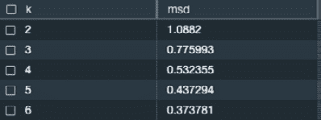

图 8.7 – msd

在 **结果** 窗口中，点击 **图表** 选项，如图所示：

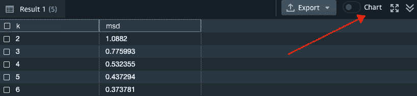

图 8.8 – 创建图表

通过选择 `k` 作为 `X` 值，`msd` 作为 `Y` 值，你将得到以下输出：

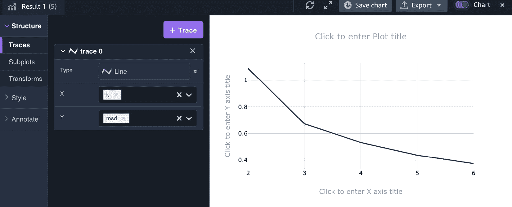

图 8.9 – 肘部方法图表

从图表中，我们可以看到当 MSD 在折线图上绘制时，形成了一个臂，肘部在 **3**。这意味着与 **3** 个簇相比，**4** 个簇的 MSD 值差异很小。我们可以看到在 **3** 之后，曲线非常平滑，与线开始时的 MSD 值差异没有剧烈变化。

让我们看看当我们使用为我们的模型部署的函数进行聚类时，数据点是如何聚类的：

```py
select chapter8_kmeans_clustering.get_housing_segment_k3 (median_income, latitude, longitude) as cluster, count(*) as count from chapter8_kmeans_clustering.housing_prices group by 1 order by 1;
```

我们可以从查询编辑器 v2 中看到以下输出。计数表示分配给每个簇的数据点数量：

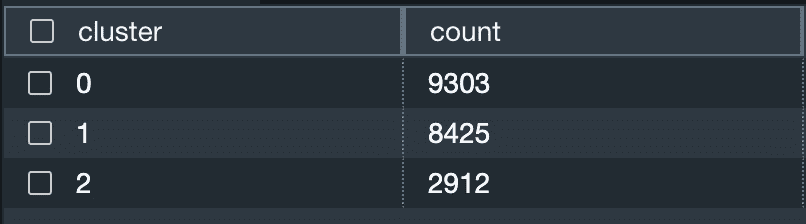

图 8.10 – 三个簇

我们也可以通过点击 **图表** 按钮并观察可视化的簇计数来绘制这个图表：

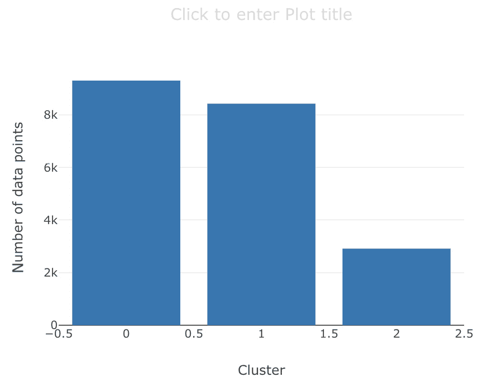

图 8.11 – 簇数据点

现在，让我们看看我们如何使用我们的模型来帮助基于簇做出业务决策。

# 评估 K-means 聚类结果

现在您已经使用 K-means 算法对聚类进行了分割，您就可以使用您创建的模型进行各种分析了。

这里是一个您可以运行的示例查询，用于按聚类获取平均中位数房屋价值：

```py
select avg(median_house_value) as avg_median_house_value,
chapter8_kmeans_clustering
.get_housing_segment_k3(median_income, latitude, longitude) as cluster
from chapter8_kmeans_clustering
.housing_prices
group by 2
order by 1;
```

输出将类似于以下内容：

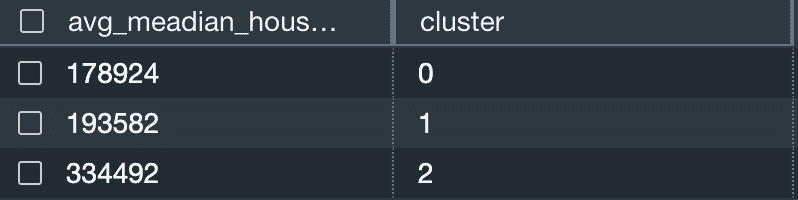

图 8.12 – 平均中位数房屋价值

您也可以运行一个查询来查看较高的中位数收入是否与具有较高房屋价值的相同聚类相对应。运行以下查询：

```py
select avg(median_income) as median_income,
chapter8_kmeans_clustering.get_housing_segment_k3(
    median_income, latitude, longitude) as cluster
from chapter8_kmeans_clustering.housing_prices
group by 2
order by 1;
```

输出将类似于以下内容：

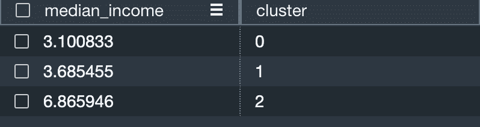

图 8.13 – 中位数收入

当我们建立用例时，我们说这是针对一个专注于家居改善产品的电子商务零售商。您还可以使用这些信息创建不同的营销活动，并根据给定聚类的房屋价值定制您的产品。

# 摘要

在本章中，我们讨论了如何使用 K-means 算法进行无监督学习。

现在，您能够解释 K-means 算法是什么以及它适用于哪些用例。您还可以使用 Amazon Redshift ML 创建 K-means 模型，确定合适的聚类数量，并通过分析聚类得出结论，以帮助做出商业决策。

在下一章中，我们将向您展示如何使用多层感知器算法使用 Amazon Redshift ML 进行深度学习。

# 第三部分：使用 Redshift ML 部署模型

*第三部分* 介绍了更多利用 Amazon Redshift ML 的方式。您将了解深度学习算法，如何训练自定义模型，以及如何使用在 Amazon Redshift 之外训练的模型在您的数据仓库中运行推理查询。

本部分以时间序列预测的介绍结束，包括如何使用 Amazon Redshift ML，以及如何优化和轻松重新训练您的模型。

本部分包括以下章节：

+   *第九章*，*使用 Redshift ML 进行深度学习*

+   *第十章*，*使用 XGBoost 创建自定义机器学习模型*

+   *第十一章*，*在数据库推理中使用您自己的模型*

+   *第十二章*，*在您的数据仓库中进行时间序列预测*

+   *第十三章*，*实施和优化 Amazon Redshift ML 模型*
