# 9

# 使用 Redshift ML 进行深度学习

我们在*第六章*和*第七章*中探讨了**监督学习**，在*第八章*中探讨了**无监督学习**模型。在本章中，我们将探讨**深度学习算法**，一个**多层感知器**（**MLP**），它是一个**前馈人工神经网络**（**ANN**），并了解它如何处理非线性可分的数据（这意味着你的数据点不能通过一条清晰的线分离）。本章将提供如何在 Amazon Redshift ML 中使用 MLP 进行深度学习的详细步骤。到本章结束时，你将能够识别出可以使用 MLP 解决的问题，并了解如何创建模型、评估模型性能以及运行预测。

在本章中，我们将探讨以下主要主题：

+   深度学习简介

+   商业问题

+   上传和分析数据

+   使用 MLP 创建多类分类模型

+   运行预测

# 技术要求

本章需要网络浏览器以及访问以下内容：

+   AWS 账户

+   Amazon Redshift 无服务器端点

+   Amazon Redshift 查询编辑器 v2

你可以在此处找到本章使用的代码：[`github.com/PacktPublishing/Serverless-Machine-Learning-with-Amazon-Redshift/blob/main/CodeFiles/chapter9/chapter9.sql`](https://github.com/PacktPublishing/Serverless-Machine-Learning-with-Amazon-Redshift/blob/main/CodeFiles/chapter9/chapter9.sql)。

# 深度学习简介

深度学习是一种使用算法分析和学习数据以产生类似人类输出的**人工智能**（**AI**）。深度学习可以利用**人工神经网络**（**ANNs**）进行监督学习和无监督学习。在深度学习中，通过一个称为 MLP 的前馈 ANN（多层感知器）从输入层生成一系列输出。MLP 利用反向传播将输出中的错误反馈到层中，一次计算一层，直到模型学会了输入数据中的模式和关系，从而得到特定的输出。

**特征学习**是一组技术，其中机器使用原始数据推导出数据中类的特征，以推导出特定任务。深度学习模型有效地使用特征学习来学习复杂、冗余和可变输入数据，并对指定任务进行分类。因此，它消除了手动特征工程来设计和选择输入特征的需求。当你的数据集不能通过一条直线（称为非线性数据）分离时，深度学习非常有用。

例如，在将金融交易分类为欺诈或合法时，两个数据类别之间可能没有明确的线性边界。在这种情况下，深度学习模型可以学习输入数据特征之间的这些可变和复杂的非线性关系，从而提高目标分类的准确性。

当处理分类问题时，确定您的数据集是否线性分离的一个简单方法是为类别绘制散点图，看看两个类别是否可以通过一条线来分离。在下面的图中，左侧图表显示两个类别是线性分离的，而右侧图表显示它们不是：

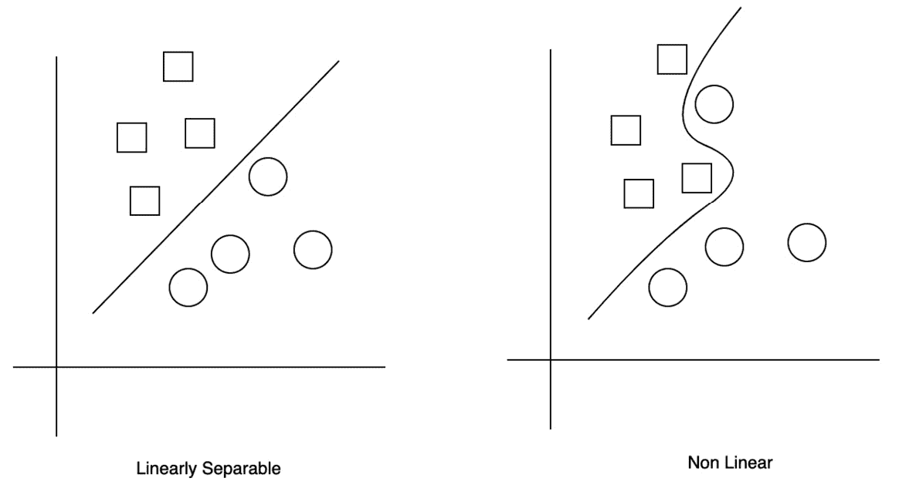

图 9.1 – 线性与非线性数据集

当您的数据集无法通过 MLP 算法线性分离时，您可以在 Redshift ML 中创建模型。MLP 算法有用的常见用例如下：

+   语音识别

+   图像识别

+   机器翻译

本章将向您展示如何使用 MLP 算法在 Amazon Redshift ML 中构建深度学习模型。

# 商业问题

我们将使用一个跟随墙壁的机器人导航数据集，使用 MLP 算法构建机器学习模型。机器人配备了超声波传感器，当机器人在顺时针方向穿过房间时，数据被收集。这里的目的是通过给出简单的指令，如*前进*、*轻微右转*、*急右转*和*轻微左转*，来引导机器人沿着墙壁行走。

由于对于一组给定的传感器读数存在要预测的类别，这将是一个多类问题。我们将使用 MLP 来正确引导机器人沿着墙壁行走。（此数据来自[`archive.ics.uci.edu/ml/datasets/Wall-Following+Robot+Navigation+Data`](https://archive.ics.uci.edu/ml/datasets/Wall-Following+Robot+Navigation+Data)，归功于 Ananda Freire、Marcus Veloso 和 Guilherme Barreto（2019）。UCI 机器学习库[[`archive.ics.uci.edu/ml`](http://archive.ics.uci.edu/ml)]。加州大学欧文分校：加州大学信息与计算机科学学院。）

请遵循页面上的详细文档以了解更多关于用例的使用。

现在，您将上传数据，分析它，并为训练模型做准备。

## 上传和分析数据

我们在以下 S3 位置存储了传感器读数数据：

`s3://packt-serverless-ml-redshift/chapter09/`

成功连接到 Redshift 作为管理员或数据库开发者后，将数据加载到 Amazon Redshift 中：

1.  导航到**Redshift 查询编辑器 v2**，连接到**Serverless: workgroup2**，然后连接到**dev**数据库：

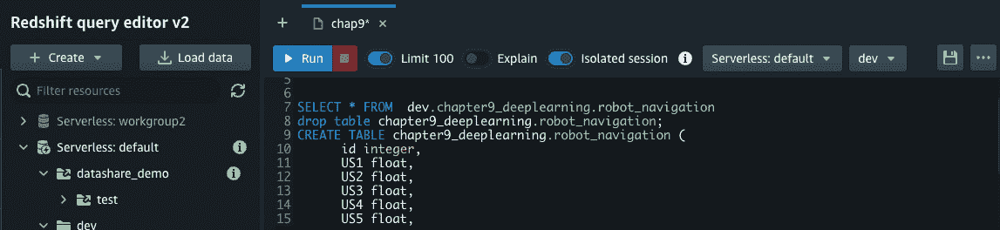

图 9.2 – 连接到开发数据库

1.  执行以下步骤以创建模式和客户表，并加载数据：

    ```py
    create schema chapter9_deeplearning;
    ```

    ```py
    create table chapter9_deeplearning.robot_navigation (
    ```

    ```py
         id bigint identity(0,1),
    ```

    ```py
    us1 float, us2 float, us3 float, us4 float, us5 float, us6 float, us7 float, us8 float, us9 float,us10 float, us11 float, us12 float, us13 float, us14 float, us15 float, us16 float, us17 float, us18 float, us19 float, us20 float, us21 float, us22 float, us23 float, us24 float, direction varchar(256)
    ```

    ```py
    )
    ```

    ```py
    diststyle auto;
    ```

    ```py
    copy chapter9_deeplearning.robot_navigation from 's3://packt-serverless-ml-redshift/chapter09/sensor_readings_24.data'
    ```

    ```py
    iam_role  default
    ```

    ```py
    format as csv
    ```

    ```py
    delimiter ','
    ```

    ```py
    quote '"'
    ```

    ```py
    region as 'eu-west-1'
    ```

    ```py
    ;
    ```

1.  运行以下查询以检查一些样本数据：

    ```py
    select * from
    ```

    ```py
    chapter9_deeplearning.robot_navigation
    ```

    ```py
    limit 10;
    ```

在*图 9*.3 中，我们可以看到我们的数据已成功加载：

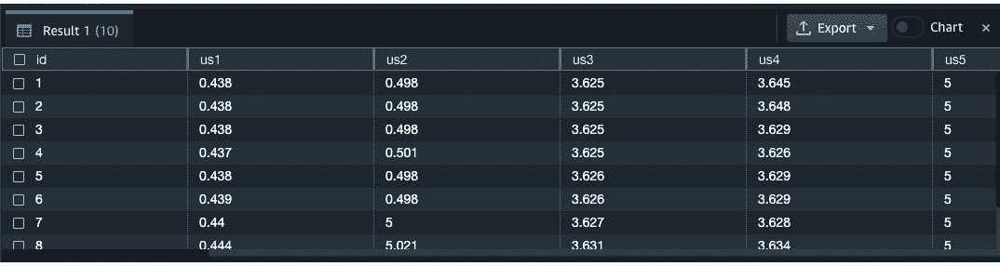

图 9.3 – 样本输出

从前面的屏幕截图，我们可以看到有几个传感器读数。运行以下查询以查看机器人运动的不同方向的分布，如图*图 9*.4 所示：

```py
select direction, count(*)
from chapter9_deeplearning.robot_navigation
group by 1;
```

要将结果以柱状图的形式查看，请点击**结果**面板上的**图表**切换按钮 ()。在**跟踪**下，点击**+ 跟踪** ()，并将**类型**设置为**柱状图**，**X 轴**设置为**方向**，**Y 轴**从下拉菜单中选择**计数**。保持**方向**为**垂直**。

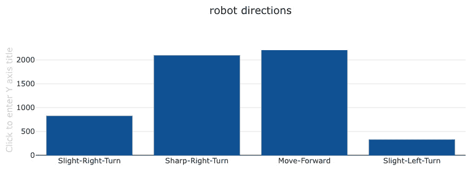

图 9.4 – 使用查询编辑器 v2 生成的图形

你可以注意到，*急转右转*和*前进*方向的数量比*轻微右转*和*轻微左转*方向的数量多。我们将使用这些输入来预测机器人的未来运动。

## 预测目标

由于这是一个多类分类问题，这个模型的目标是根据 24 个传感器读数预测机器人将采取的方向。

数据集有一个 ID 列，它唯一地标识了 24 个传感器读数，命名为`us1`、`us2`、…、`us24`，以及一个`direction`变量，其中包含 4 个值。`direction`变量是我们试图预测的类别变量。

现在我们将数据集分成训练数据集，它将被输入到我们的模型中，以及测试数据集，我们将用它来做预测。

## 将数据分割成训练集和测试集

我们将把我们的表分成两个数据集，训练集和测试集，大约 80:20 的比例。让我们在 Redshift 中使用`mod`函数来分割我们的表。`mod`函数返回两个数字的余数。我们将传入 ID 和数字`5`。

为了训练模型，让我们使用`where mod(id,5)`不等于`0`，这代表我们的 80%的训练集。在 Query Editor v2 中运行以下命令：

```py
select direction, count(*)
from chapter9_deeplearning.robot_navigation
where mod(id,5) <> 0
group by 1;
```

在*图 9*.5 中，我们看到基于大约 80%的数据的数据分布：

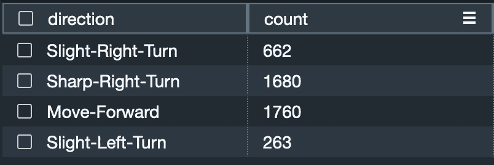

图 9.5 – 训练数据集分布

注意

你可能看到的计数与我们展示的不同。我们正在使用 Redshift 的`Identity`函数来生成`id`列的值。为了确保身份值是唯一的，Amazon Redshift 在创建身份值时会跳过一些值。身份值是唯一的，但顺序可能不匹配。因此，你可能看到不同的计数，但数据是总计数的 80%（5,456 行）。

Query Editor v2 中的**图表**函数以柱状图格式显示了这一点，如图*图 9*.6 所示：

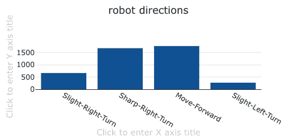

图 9.6 – 训练集柱状图

为了测试模型，让我们使用`where mod(id,5)`等于`0`，这代表我们的 20%测试数据集：

```py
select direction, count(*) from chapter9_deeplearning.robot_navigation
where mod(id,5) = 0
group by 1;
```

在*图 9*.7 中，我们看到基于~20%的数据的数据分布：

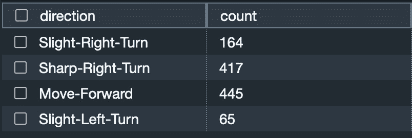

图 9.7 – 测试数据集分布

Query Editor v2 中的**Chart**函数以条形图格式显示了*图 9*.8 中的内容：

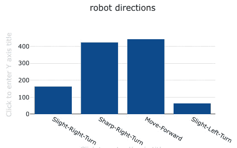

图 9.8 – 测试数据条形图

现在我们已经分析了我们的数据，并确定了如何将其分割成训练集和测试集，让我们使用 MLP 算法创建我们的模型。

# 使用 MLP 创建多类分类模型

在这个练习中，我们将指导`CREATE MODEL`语句使用 MLP 模型。您将通过将`model_type`参数设置为`MLP`来实现这一点。其余参数可以设置为默认值。

让我们创建一个预测机器人方向的模型：

```py
CREATE MODEL chapter9_deeplearning.predict_robot_direction
from  (select
us1 ,us2 , us3 , us4 , us5 , us6 ,us7 , us8 , us9 ,
us10 ,us11 ,us12 ,us13 ,us14 ,us15 ,us16 ,us17 ,
us18 ,us19 ,us20 ,us21 , us22 ,us23 ,us24 , direction
  from chapter9_deeplearning.robot_navigation
  where mod(id,5) !=0)
target direction
function predict_robot_direction_fn
iam_role default
model_type mlp
settings (s3_bucket 'replace-with-your-s3-bucket',
max_runtime 1800);
```

使用`CREATE MODEL`函数时，设置了`max_runtime`值为`1800`秒。这意味着模型训练的最大时间是 30 分钟。训练作业通常根据数据集的大小完成得更快。由于我们没有设置其他参数（例如，目标或问题类型），Amazon SageMaker Autopilot 将为我们识别参数的大部分工作。

运行`SHOW MODEL`命令以检查模型训练是否完成：

```py
SHOW MODEL chapter9_deeplearning.predict_robot_direction;
```

在*图 9*.9 中检查**模型状态**：

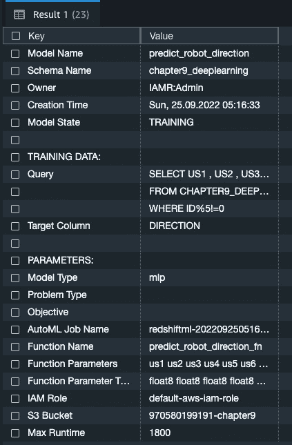

图 9.9 – SHOW MODEL 输出

从前面的屏幕截图可以看出，**模型状态**字段显示状态为**训练中**，这意味着模型仍在训练中。但请注意，Redshift ML 已将**模型类型**识别为**mlp**；其他参数，如**问题类型**和**目标**现在为空，但在模型训练完成后，我们将看到这些值。

在一段时间后再次运行`SHOW MODEL`命令以检查模型训练是否完成。从下面的屏幕截图可以看出，模型训练已完成，**准确率**已被选为模型评估的目标。这是由 Redshift ML 自动选择的。同时请注意，Redshift ML 正确地将此识别为多类分类问题：

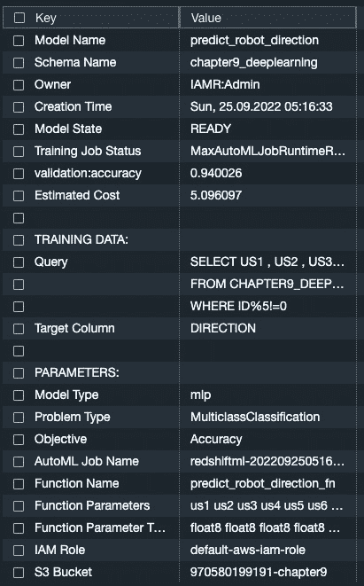

图 9.10 – SHOW MODEL 输出

现在我们已经完成了模型的训练，让我们使用创建的函数进行预测。在*图 9*.10 中，`predict_robot_direction_fn`，我们将在预测查询中引用它。

还请注意*图 9*.10 中的`validation:accuracy`值为`.940026`。这意味着我们的模型准确率超过 94%，这非常好。

注意

由于在后台算法中选择了不同的超参数，您可能会得到不同的准确率值，这可能会略微影响准确率。

由于我们的模型已经成功训练，让我们在我们的测试数据集上运行一些预测。

## 运行预测

在这个第一个查询中，我们将使用`CREATE MODEL`命令返回的函数来比较实际方向与我们的预测方向。在 Query Editor v2 中运行以下查询以查看我们预测正确的次数：

```py
select correct, count(*)
from
(select  DIRECTION as actual, chapter9_deeplearning.predict_robot_direction_fn (
US1,US2,US3,US4,US5,US6,US7,US8,US9,US10,US11,US12,
US13,US14,US15,US16,US17,US18,US19,US20,US21,US22,US23,US24
 ) as  predicted,
  CASE WHEN actual = predicted THEN 1::INT
         ELSE 0::INT END AS correct
from chapter9_deeplearning.robot_navigation
where MOD(id,5) =0
) t1
group by 1;
```

在*图 9**.11 中，我们看到我们的模型正确预测了机器人方向 1,033 次。

请注意，您的计数可能会有所不同：

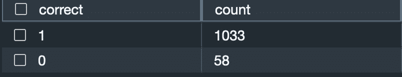

图 9.11 – 实际方向与预测方向

现在，让我们对测试数据集运行一个查询以预测机器人将移动的方向。在 Query Editor v2 中运行以下查询以返回前 10 行：

```py
 select  id, chapter9_deeplearning.predict_robot_direction_fn (
US1,US2,US3,US4,US5,US6,US7,US8,US9,US10,US11,US12,
US13,US14,US15,US16,US17,US18,US19,US20,US21,US22,US23,US24
 ) as  predicted_direction
from chapter9_deeplearning.robot_navigation
where MOD(id,5) <> 0
limit 10;
```

在*图 9**.12*中，我们展示了基于 ID 的前 10 行和方向：

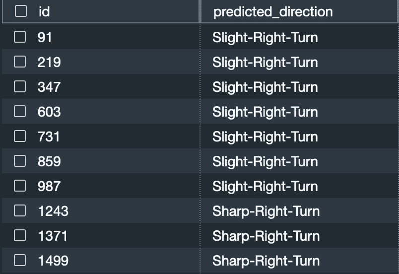

图 9.12 – 根据 ID 预测的方向

现在，让我们修改查询以总结我们预测的机器人运动。在 Query Editor v2 中运行以下命令：

```py
select chapter9_deeplearning.predict_robot_direction_fn (
US1,US2,US3,US4,US5,US6,US7,US8,US9,US10,US11,US12,
US13,US14,US15,US16,US17,US18,US19,US20,US21,US22,US23,US24
 ) as  predicted_direction, count(*)
from chapter9_deeplearning.robot_navigation
where MOD(id,5) <> 0
group by 1;
```

在*图 9**.13 中，我们可以看到**前进**是最受欢迎的方向，其次是**急右转**。请注意，您的计数可能会有所不同。

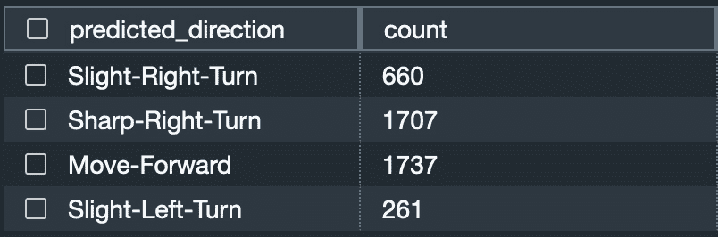

图 9.13 – 预测方向的总结

您现在已使用 MLP 算法创建了一个模型，并在测试数据集上运行了预测。

# 总结

在本章中，我们讨论了深度学习模型及其必要性，并展示了如何使用 MLP 算法在传感器读数数据上创建一个 MLP 模型来预测机器人的下一步动作。您了解到非线性数据集适合深度学习，并使用 MLP 算法创建了一个多类分类模型。

在下一章中，我们将向您展示如何使用 XGBoost 算法创建一个完全控制超调参数的模型。
