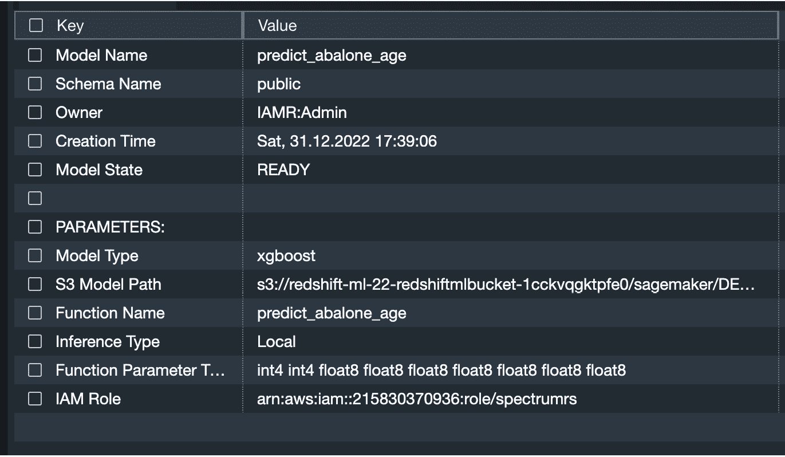
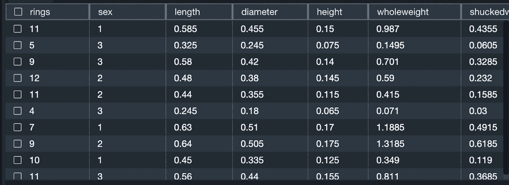
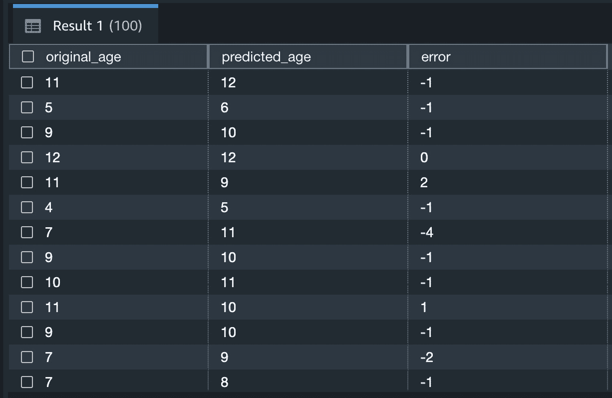
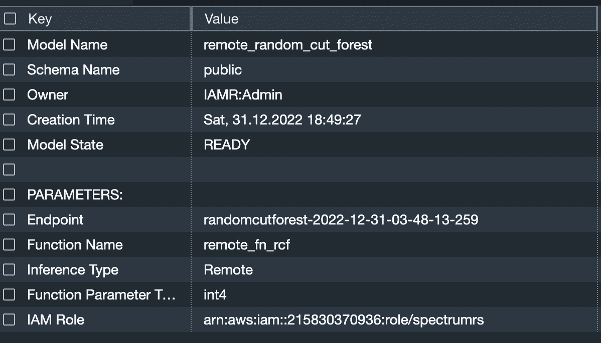
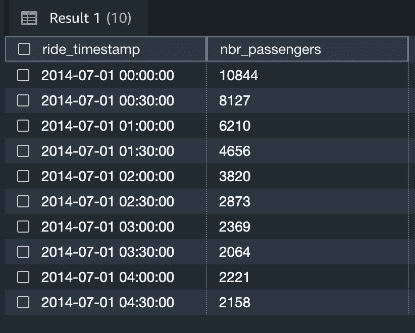
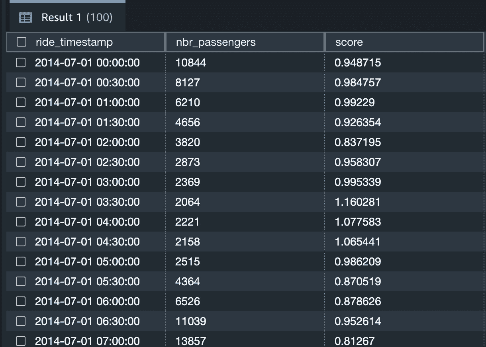
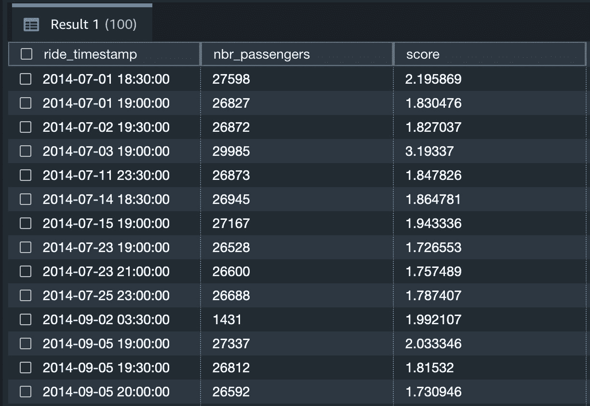

# 11

# 数据库推理的自定义模型

在本书中，我们介绍了使用**Redshift 机器学习**（**Redshift ML**）原生训练模型的过程。然而，可能存在需要利用 Redshift 外部构建的模型的情况。为了解决这个问题，Redshift ML 提供了**Bring Your Own Model**（**BYOM**）功能，允许用户将他们的 Amazon SageMaker 机器学习模型与 Amazon Redshift 集成。此功能便于在仓库中存储的数据上执行预测和其他机器学习任务，而无需数据移动。

BYOM 提供了两种方法：**本地推理**和**远程推理**。在本章中，我们将深入探讨 BYOM 的工作原理，并探索创建和集成 BYOM 的各种选项。您将指导完成在 Amazon SageMaker 中构建机器学习模型的过程，随后使用 Redshift ML 的 BYOM 功能将模型引入 Redshift。此外，您还将学习如何将这些模型应用于存储在 Redshift 数据仓库中的数据以进行预测。

到本章结束时，您将熟练地将 Amazon SageMaker 创建的模型在 Amazon Redshift 中执行预测。利用 BYOM，您可以将**XGBoost**和**多层感知器**（**MLP**）等模型部署到 Redshift ML。一旦在 Redshift ML 上部署了预训练模型，您就可以在 Redshift 上本地运行推理，而不依赖于 SageMaker 端点或 SageMaker Studio。这种简单性使数据分析师能够使用外部创建的模型对新的数据进行推理，消除了访问 SageMaker 服务的担忧。

此方法显著加快了将 Redshift 外部创建的机器学习模型交付给数据团队的速度。此外，由于 Redshift ML 与原生 Redshift SQL 交互，数据团队的用户体验与其他在数据仓库上执行的数据分析工作保持一致。

在本章中，我们将讨论以下主要主题：

+   BYOM 的好处

+   支持的模型类型

+   BYOM 用于本地推理

+   BYOM 用于远程推理

# 技术要求

本章需要网络浏览器和以下访问权限：

+   一个 AWS 账户

+   一个 Amazon Redshift Serverless 端点

+   一个 Amazon SageMaker 笔记本

+   Amazon Redshift 查询编辑器 v2

+   完成第一章中的“Amazon Redshift Serverless 入门”部分

您可以在此处找到本章节使用的代码：

[`github.com/PacktPublishing/Serverless-Machine-Learning-with-Amazon-Redshift`](https://github.com/PacktPublishing/Serverless-Machine-Learning-with-Amazon-Redshift)

本章节所需的数据文件位于一个公共的 S3 桶中：`s3://packt-serverless-ml-redshift/`。

让我们开始吧！

# BYOM 的好处

使用 Amazon Redshift ML，您可以使用在 Amazon SageMaker 中构建的现有机器学习模型，并在 Redshift 中使用它，而无需重新训练。要使用 BYOM，您需要提供模型工件或 SageMaker 端点，该端点接收一批数据并返回预测。BYOM 在机器学习模型尚未在 Redshift ML 中可用的情况下很有用，例如，在撰写本书时，随机切割森林模型尚未在 Redshift ML 中可用，因此您可以在 SageMaker 中构建此模型，并轻松将其带到 Redshift，然后使用它来处理存储在 Redshift 中的数据。

使用 Redshift ML 与您自己的机器学习模型有一些具体的优势：

+   **提高效率**：通过使用现有的机器学习模型，您可以节省在训练新模型上花费的时间和资源。

+   **易于集成**：Redshift ML 使将您的机器学习模型集成到您的数据管道变得容易，允许您用于实时预测或批量预测。

+   **可扩展性**：Redshift ML 是建立在高度可扩展且性能卓越的 Amazon Redshift 数据仓库之上的，因此你可以使用你的机器学习模型对大型数据集进行预测，而无需担心性能问题。

## 支持的模型类型

Amazon Redshift ML 通过 BYOM 功能支持广泛的机器学习模型。可以使用 BYOM 的常见模型类型包括以下几种：

+   **线性回归模型**：这些模型类似于数字预测器。它们考虑几个因素或特征，并使用它们来猜测特定的数值结果。例如，如果你想预测一栋房子的价格，线性回归模型会考虑诸如房子的面积、房间数量和位置等因素，以估计房子的价格。

+   **逻辑回归模型**：这些模型是二元结果预测器。它们不是猜测数字，而是回答“是”或“否”的问题，或者做出*0*/*1*的预测。例如，如果你想预测一个学生是否会通过或失败考试，逻辑回归模型会考虑诸如学生的学习时间、之前的考试成绩和出勤率等因素，以确定通过考试的可能性。

+   **决策树模型**：这些模型用于根据树状结构进行预测。可以将其想象为预测的决策树。你从顶部开始，根据已知特征跟随分支。在每个分支上，你根据一个特征做出决定，并继续前进，直到在叶子节点达到最终的预测。这是一个逐步的过程，用于找到最可能的结局。

+   **随机森林模型**：这些是决策树的集合。一组决策树协同工作。每棵树都在数据的不同部分上训练。为了做出预测，所有树都给出它们的答案，并将它们的预测平均以得到最终结果。这就像汇集了多棵树的看法，以做出更准确的猜测。

+   **梯度提升模型**：这些也是决策树的集成，这些是共同工作的决策树组。在这里，与随机森林模型不同，树是依次训练的，并且每一棵树都试图纠正前一棵树的错误。它们从彼此的错误中学习，并作为一个团队变得更好。这就像一个学习过程，它们不断改进，直到它们一起做出好的预测。

+   **神经网络模型**：这些是复杂的多层模型，能够学习数据中的复杂模式。这些模型能够学习数据中的复杂模式。它们通过信息分析的过程运行，发现类似于人脑中相互连接的神经元的功能。通过广泛的训练和接触多样化的数据集，模型提高了其解析复杂模式的能力，使其擅长在新数据中揭示复杂的关系。

+   **支持向量机**（**SVMs**）：SVMs 是强大的分类器，就像极其聪明的分隔器。想象一个三维空间，其中有点代表不同的事物。SVMs 确定绘制线或平面（称为超平面）的最优方式，以完美地分隔两组不同的点。这就像它们拥有一种非凡的能力来找到完美的边界，确保两组点尽可能远地分开，例如绘制一条无形但完美无瑕的线，将每一边上的事物组织得井井有条。

这些只是 Amazon Redshift 中可以使用 BYOM 的模型类型的一些示例。一般来说，任何可以表示为模型工件集和预测函数的模型都可以在 Redshift 中使用 BYOM。

我们已经了解了 Redshift ML BYOM 及其优势。在下一节中，你将创建一个 BYOM 本地推理模型。

# 创建 BYOM 本地推理模型

使用 BYOM 本地推理，机器学习模型及其依赖项被打包成一组文件，并部署到存储数据的 Amazon Redshift，使用户能够对存储的数据进行预测。当在 Amazon SageMaker 平台上训练和创建模型时，会创建模型工件及其依赖项。通过直接将模型部署到 Redshift 服务，你不需要将数据通过网络移动到另一个服务。本地推理对于数据敏感或需要低延迟预测的场景非常有用。

让我们开始创建 BYOM 本地推理模型的工作。

## 创建本地推理模型

要创建 BYOM 本地推理模型，第一步涉及在 Amazon SageMaker 上训练和验证一个 Amazon SageMaker 模型。为此，我们将在 Amazon SageMaker 上训练和验证一个 XGBoost 线性回归机器学习模型。按照以下说明创建 Amazon SageMaker 模型：

[`github.com/aws/amazon-sagemaker-examples/blob/main/introduction_to_amazon_algorithms/xgboost_abalone/xgboost_abalone.ipynb`](https://github.com/aws/amazon-sagemaker-examples/blob/main/introduction_to_amazon_algorithms/xgboost_abalone/xgboost_abalone.ipynb)

在遵循了前面 URL 提供的说明后，通过运行预测函数来验证模型。现在，让我们继续下一步。在成功生成预测后，我们将创建 Redshift ML 模型。使用相同的笔记本，让我们运行一些命令来设置一些参数。

### 在 Redshift 上创建模型并运行预测

现在通过运行预测函数来验证模型。

在 SageMaker 中训练和验证了模型后，现在是时候将其导入到 Redshift 中。在下一节中，我们将使用相同的 SageMaker 笔记本设置构建 Redshift `CREATE MODEL`语句所需的参数。你将使用此语句在 Query Editor v2 中创建你的 Redshift ML 模型，使你能够使用集成的 SageMaker 模型在 Redshift 集群中存储的数据上执行本地推理。

### 设置参数

在设置参数之前，请在 Query Editor v2 中运行以下命令以创建本章的架构：

```py
Create schema chapter11_byom;
```

此过程的第一个步骤是设置以下参数值：

+   `S3_BUCKET`用于存储 Redshift ML 工件。

+   `MODEL_PATH`是 Amazon SageMaker 模型工件在 S3 的位置。可选地，你可以使用 Python 中的`print`函数打印`model_data`并查看工件位置。

+   `REDSHIFT_IAM_ROLE`是集群角色：

```py
#provide your s3 bucket here
S3_BUCKET='Redshift ML s3 bucket name'
#provide the model path, this is coming from the model_data parameter
MODEL_PATH=model_data
#Provide Redshift cluster attached role ARN
REDSHIFT_IAM_ROLE = 'Redshift Cluster IAM Role'
```

接下来，我们将生成你将在 Redshift 上运行的`CREATE MODEL`语句。

### 生成 CREATE MODEL 语句

在 Jupyter 笔记本中执行此处提供的代码以自动生成`CREATE` `MODEL`语句：

```py
sql_text=("drop model if exists predict_abalone_age; \
 CREATE MODEL chapter11_byom.predict_abalone_age \
FROM '{}' \
FUNCTION predict_abalone_age ( int, int, float, float,float,float,float,float,float) \
RETURNS int \
IAM_ROLE '{}' \
settings( S3_BUCKET '{}') \
")
print (sql_text.format(model_data,REDSHIFT_IAM_ROLE, S3_BUCKET))
```

前述语句的输出是你要在 Query Editor v2 中运行的`CREATE MODEL`语句。请复制该语句并前往 Query Editor v2 以执行剩余步骤。

## 在 Redshift 上运行本地推理

下面是`CREATE MODEL`语句。你应该生成一个类似的语句，其中`FROM`、`IAM_ROLE`和`S3_BUCKET`有不同的值：

```py
CREATE MODEL chapter11_byom.predict_abalone_age
FROM 's3://redshift-ml-22-redshiftmlbucket-1cckvqgktpfe0/sagemaker/DEMO-xgboost-abalone-default/single-xgboost/DEMO-xgboost-regression-2022-12-31-01-45-30/output/model.tar.gz'
FUNCTION predict_abalone_age ( int, int, float, float,float,float,float,float,float) RETURNS int IAM_ROLE 'arn:aws:iam::215830312345:role/spectrumrs'
settings( S3_BUCKET 'redshift-ml-22-redshiftmlbucket-1cckvqgktpfe0') ;
```

在前面的命令中，`FROM`子句以`model_data`作为输入，其中包含 SageMaker 模型工件。当运行此命令时，Amazon Redshift ML 编译模型，将其部署到 Redshift，并创建一个`predict_abalone_age`预测函数，该函数用于 SQL 命令以在 Redshift 中本地生成预测。

一旦完成`CREATE MODEL`语句，你可以使用`show model`命令来查看模型的状态：

```py
show model chapter11_byom.predict_abalone_age;
```

下面是输出结果：



图 11.1 – 本地推理模型元数据

注意**模型状态**为**就绪**，**S3 模型路径**是我们创建模型时给出的。**推理类型**为**本地**，这意味着模型类型是本地推理。

我们已成功创建本地推理模型；现在，让我们准备一个测试数据集以测试本地推理是否运行无任何问题。

### 数据准备

将测试数据从 S3 存储桶加载到 Redshift 表以测试我们的本地推理模型。

注意

请更新`IAM_ROLE`。不要更改 S3 存储桶位置。

运行以下命令创建表并加载数据：

```py
drop table if exists chapter11_byom.abalone_test;
create table chapter11_byom.abalone_test
(Rings int, sex int,Length_ float, Diameter float, Height float, WholeWeight float, ShuckedWeight float,VisceraWeight float, ShellWeight float );
copy chapter11_byom.abalone_test
from 's3://jumpstart-cache-prod-us-east-1/1p-notebooks-datasets/abalone/text-csv/test/'
IAM_ROLE 'arn:aws:iam::212330312345:role/spectrumrs'
csv ;
```

对测试表进行采样以确保数据已加载：

```py
select * from chapter11_byom.abalone_test limit 10;
```

这里是样本数据集：



图 11.2 – 显示测试数据集的样本记录

现在我们已加载测试数据，让我们运行`SELECT`命令，该命令调用`predict_abalone_age`函数。

### 推理

现在，调用作为`CREATE` `MODEL`语句一部分创建的预测函数：

```py
Select original_age, predicted_age, original_age-predicted_age as Error
From(
select predict_abalone_age(Rings,sex,
Length_ ,
Diameter ,
Height ,
WholeWeight ,
ShuckedWeight ,
VisceraWeight ,
ShellWeight ) predicted_age, rings as original_age
from chapter11_byom.abalone_test ) a;
```

这是使用本地推理生成的预测结果的输出：



图 11.3 – 显示实际值与预测值

我们已成功训练和验证了一个 SageMaker 模型，并将其部署到 Redshift ML。我们还使用本地推理函数生成了预测。这展示了 Redshift 的 BYOM 本地推理功能。

在下一节中，您将了解 BYOM 远程推理功能。

# 使用 SageMaker 端点进行远程推理的 BYOM

在本节中，我们将探讨如何为 Amazon SageMaker Random Cut Forest 模型创建一个 BYOM 远程推理。这意味着您正在引入自己的机器学习模型，该模型在 Redshift 之外的数据上训练，并使用它通过端点对存储在 Redshift 集群中的数据进行预测。在此方法中，要使用 BYOM 进行远程推理，需要训练一个机器学习模型，在 Amazon SageMaker 中创建一个端点，然后使用 Amazon Redshift ML 扩展提供的 SQL 函数从 Redshift 查询中访问该端点。

当 Redshift ML 原生不支持模型时，此方法很有用，例如 Random Cut Forest 模型。您可以在此处了解更多关于 Random Cut Forest 的信息：[`tinyurl.com/348v8nnw`](https://tinyurl.com/348v8nnw)。

为了演示此功能，您首先需要遵循此笔记本中的说明（[`github.com/aws/amazon-sagemaker-examples/blob/main/introduction_to_amazon_algorithms/random_cut_forest/random_cut_forest.ipynb`](https://github.com/aws/amazon-sagemaker-examples/blob/main/introduction_to_amazon_algorithms/random_cut_forest/random_cut_forest.ipynb)）使用 Amazon SageMaker 创建一个用于检测异常的随机切割森林机器学习模型。请完成 Amazon SageMaker 模型训练并验证模型，以确保端点正在运行，然后继续下一部分。

## 创建 BYOM 远程推理

一旦您验证了 SageMaker 端点已部署且运行正常，让我们在 Redshift 中通过指定 SageMaker 端点定义一个 `CREATE MODEL` 参考点。使用相同的笔记本，让我们在 Jupyter 中构建 `CREATE MODEL` 语句并运行它。

### 设置参数

让我们先设置参数：

+   `S3_Bucket` 用于存储 Redshift ML 工件

+   `SAGEMAKER_ENDPOINT` 是 SageMaker 侧的模型端点，用于运行推理

+   `REDSHIFT_IAM_ROLE` 是集群角色：

```py
REDSHIFT_IAM_ROLE = 'arn:aws:iam::215830312345:role/spectrumrs'
SAGEMAKER_ENDPOINT = rcf_inference.endpoint
```

注意

请使用您的 Redshift 集群角色更新 `REDSHIFT_IAM_ROLE`。

## 生成 BYOM 远程推理命令

让我们通过运行以下代码生成 `CREATE MODEL` 语句：

```py
sql_text=("drop model if exists chapter11_byom.remote_random_cut_forest;\
CREATE MODEL chapter11_byom.remote_random_cut_forest\
 FUNCTION remote_fn_rcf (int)\
 RETURNS decimal(10,6)\
 SAGEMAKER'{}'\
 IAM_ROLE'{}'\
")
print(sql_text.format(SAGEMAKER_ENDPOINT,REDSHIFT_IAM_ROLE))
```

您已完成 Jupyter 笔记本的工作。现在您在 Amazon SageMaker 中有一个预训练模型，下一步是将它带入 Redshift ML。为此，访问查询编辑器 v2，连接到无服务器端点，并运行以下命令。

在查询编辑器 v2 中，运行以下命令：

```py
CREATE MODEL chapter11_byom.remote_random_cut_forest
FUNCTION remote_fn_rcf (int) RETURNS decimal(10,6)
SAGEMAKER'randomcutforest-2022-12-31-03-48-13-259'
IAM_ROLE'arn:aws:iam:: 215830312345:role/spectrumrs'
;
```

通过运行 `show` `model` 命令检索模型元数据：

```py
show model chapter11_byom.remote_random_cut_forest;
```

输出如下：



图 11.4 – 远程推理模型元数据

注意，在模型元数据中，**模型状态**参数设置为 **READY**，表示模型已部署。**端点**名称为 **randomcutforest-2022-12-31-03-48-13-259**。**推理类型**设置为 **远程**推理。当运行此模型时，Redshift ML 将存储在 Redshift 中的数据批量发送到 SageMaker，在那里生成推理。生成的预测值随后被发送回 Redshift，最终呈现给用户。

我们已成功部署模型。在下一节中，我们将运行预测。

### 数据预处理脚本

以下代码片段显示了您需要在 Redshift 上运行的预处理脚本。我们将创建用于运行推理的表：

```py
COPY chapter11_byom.rcf_taxi_data
FROM 's3://sagemaker-sample-files/datasets/tabular/anomaly_benchmark_taxi/NAB_nyc_taxi.csv'
IAM_ROLE 'arn:aws:iam::215830312345:role/spectrumrs' ignoreheader 1 csv delimiter ',';
```

注意

请使用您附加到 Redshift 集群的 IAM 角色更新 `IAM_ROLE` 参数。

样本数据以确保数据已加载：

```py
select * from chapter11_byom.rcf_taxi_data limit 10;
```

这是输出：



图 11.5 – 显示测试数据集的样本记录

现在我们有了远程推理端点和测试数据集，让我们调用预测函数。

### 计算异常分数

现在，让我们从整个出租车数据集中计算异常分数：

```py
select ride_timestamp, nbr_passengers, chapter11_byom.remote_fn_rcf(nbr_passengers) as score
from chapter11_byom.rcf_taxi_data;
```

下面的输出是远程推理预测的结果：



图 11.6 – 显示远程函数预测值

前面的输出显示了不同日期的异常分数和乘客数量。

在下面的代码片段中，我们将打印出任何得分大于 3 且标准差（大约是平均得分的 99.9 百分位）的数据点：

```py
with score_cutoff as
(select stddev(chapter11_byom.remote_fn_rcf(nbr_passengers)) as std, avg(chapter11_byom.remote_fn_rcf(nbr_passengers)) as mean, ( mean + 3 * std ) as score_cutoff_value
From chapter11_byom.rcf_taxi_data)
select ride_timestamp, nbr_passengers, chapter11_byom.remote_fn_rcf(nbr_passengers) as score
from chapter11_byom.3rcf_taxi_data
where score > (select score_cutoff_value from score_cutoff)
;
```

输出如下：



图 11.7 – 显示不可接受的异常分数

在前面的结果中，我们看到某些天的乘客量远远高于我们的远程推理函数，并将它们标记为异常。这标志着将远程推理模型引入 Redshift 的部分结束。

# 摘要

在本章中，我们讨论了 Amazon Redshift ML BYOM 在本地和远程推理方面的优势和用例。我们创建了两个 SageMaker 模型，然后将它们导入 Redshift ML 作为本地推理和远程推理模型类型。我们在 Redshift 中加载了测试数据集，然后运行了预测函数并验证了这两种类型。这展示了 Redshift 如何简化并赋予商业社区使用外部创建的模型进行数据推理的能力。这种方法加快了在 Redshift 外部创建的机器学习模型交付给数据仓库团队的速度。

在下一章中，你将了解 Amazon Forecast，它使你能够使用 Redshift ML 进行预测。
