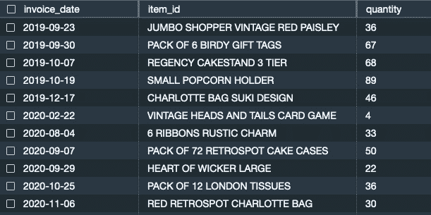

# 12

# 数据仓库中的时序预测

在前面的章节中，我们讨论了如何使用 Amazon Redshift **机器学习** (**ML**) 通过熟悉的 SQL 命令轻松创建、训练和应用 ML 模型。我们讨论了如何使用监督学习算法来解决分类或回归问题，以预测某种结果。在本章中，我们将讨论如何使用 Amazon Redshift 中的数据，通过 Amazon Forecast 预测某种未来的事件。

本章将介绍如何使用 Amazon Forecast ([`aws.amazon.com/forecast/`](https://aws.amazon.com/forecast/)) 进行 Amazon Redshift 上的时序预测，这是一个完全托管的时间序列预测服务，使用 SQL，无需移动数据或学习新技能。我们将引导你了解以下主题：

+   预测和时序数据

+   什么是 Amazon Forecast？

+   配置和安全

+   使用 Redshift ML 创建预测模型

# 技术要求

本章需要网络浏览器和以下访问权限：

+   AWS 账户

+   Amazon Redshift

+   Amazon Redshift 查询编辑器 v2

你可以在这里找到本章使用的代码：[`github.com/PacktPublishing/Serverless-Machine-Learning-with-Amazon-Redshift/blob/main/CodeFiles/chapter12/chapter-12.sql`](https://github.com/PacktPublishing/Serverless-Machine-Learning-with-Amazon-Redshift/blob/main/CodeFiles/chapter12/chapter-12.sql).

# 预测和时序数据

预测是一种估计未来事件的方法，它涉及分析历史数据和过去模式，以推导出未来的可能结果。例如，基于历史数据，企业可以预测其销售收入或确定下一个时间段将发生什么。

预测在指导企业做出关于其运营和优先事项的明智决策中发挥着重要作用。许多组织依赖如 Amazon Redshift 这样的数据仓库，对大量历史和当前数据进行深度分析，从而推动他们的业务目标并衡量未来的成功。作为规划工具，预测通过利用过去的模式帮助企业为未来的不确定性做准备，其基本原理是过去发生的事情很可能会在未来再次发生。这些预测基于在给定时间段内对观察结果的分析。

下面是一些组织如何使用预测的例子：

+   财务规划

+   供需计划

+   定时推出新产品或服务

+   资源规划

+   预测未来事件，如销售和收入收益

+   审查管理决策

通过观察趋势图可以帮助我们预测趋势，但时间序列预测可以给我们一个更好的估计，了解它可能如何继续。我们还可以对那些在时间上没有明显模式或趋势的数据进行建模。当存在模式时，我们可以查看数据的整个历史来了解它之前是如何发生的。如果没有模式，我们可以更多地依赖最近的数据进行预测。

## 预测方法的类型

预测方法有两种：定性和定量。

让我们看看定性和定量方法是什么，如[`aws.amazon.com/what-is/forecast/`](https://aws.amazon.com/what-is/forecast/)中定义的：

+   **定性预测**是主观的，依赖于市场营销专家的意见来做出预测。当没有足够的历史数据时，可以使用这些方法。定性预测方法的例子包括市场研究，如民意调查和调查，以及德尔菲法来收集有见地的意见并预测趋势。

+   **定量预测**在本质上具有客观性，用于预测长期未来趋势。它使用历史和当前数据来预测未来趋势。定量预测方法的例子包括*时间序列预测*、*计量经济学建模*和*指标方法*。

在本章中，我们将专注于使用时间序列进行定量预测，也称为时间序列预测。现在，让我们来看看时间序列预测是什么。

## 什么是时间序列预测？

**时间序列预测**是一种数据科学技术，它使用机器学习来研究历史数据并预测时间序列数据中的未来趋势或行为。时间序列数据在许多情况下都得到应用，如天气预报、金融研究、统计学、资源规划和计量经济学。在前一章中，我们探讨了回归模型，使用横截面数据来预测值，其中输入变量用于确定变量之间的关系，以便您可以在没有目标变量的数据集上预测未知的目标。

这种数据是独特的，因为它按时间顺序排列数据点。时间序列数据可以绘制在图上，这些图是可视化和分析数据的宝贵工具。在许多组织中，数据科学家或数据分析师使用这些图来识别预测数据特征或属性。让我们来看看时间序列数据特性的例子。

## 时间趋势数据

在趋势数据中，观测值是在相等的时间间隔内捕获的。在时间序列图中，*y*轴始终是时间单位，如季度、年、月、日、小时、分钟或秒。在*图 12.1*中，我们有按年计算的总订户趋势的例子：


图 12.1 – 每年总订户的趋势

## 季节性

在季节性观察中，我们可以看到随时间变化的周期性波动，这些波动是可预测的，因为我们根据历史模式理解了行为和原因。例如，零售商知道在特定的假日期间销售额会增加。在**图 12.2**中，我们看到 11 月和 12 月的销售额出现上升趋势，这是由于假日季节的预期：


图 12.2 – 由于假日季节导致的向上峰值

## 结构中断

在结构中断中，我们有一些不太可预测的波动，这些波动可能在任何时间点发生。例如，在经济衰退或地缘政治动荡期间，一个国家的经济状况可能会出现结构中断。在**图 12.3**中，我们可以看到随时间推移的经济增长可视化。下降表示在特定数据点发生的事件；例如，2009 年的那个与美国的抵押贷款危机相关。


图 12.3 – 随时间推移的经济增长

让我们来看看 Amazon Redshift ML 是如何使用 Amazon Forecast 来生成时间序列数据集的模型的。

# 亚马逊预测是什么？

**亚马逊预测**，就像 Amazon Redshift ML 一样，使用它不需要机器学习经验。时间序列预测是通过基于历史数据的各种机器学习和统计算法生成的。作为用户，你只需将数据发送到 Amazon Forecast，它将检查数据并自动识别什么是有意义的，并生成预测模型。

使用 Amazon Redshift ML，你可以利用 Amazon Forecast 从你的时间序列数据创建和训练预测模型，并使用这些模型生成预测。对于预测，我们需要一个目标时间序列数据集。在目标时间序列预测中，我们使用过去的数据或先前值来预测变量的未来值，这通常被称为单变量时间序列，因为数据在相等的时间增量上是顺序的。目前，Redshift ML 支持具有自定义域的目标时间序列数据集。你的数据仓库中的数据集必须包含你捕获数据的频率或间隔。例如，你可能每小时记录和汇总平均温度。

亚马逊预测会根据算法自动训练你的模型，该算法使用 Auto ML，并提供六个内置算法（要了解更多关于内置算法的信息，请参阅此资源：[`docs.aws.amazon.com/forecast/latest/dg/aws-forecast-choosing-recipes.html#forecast-algos`](https://docs.aws.amazon.com/forecast/latest/dg/aws-forecast-choosing-recipes.html#forecast-algos))。这些预测模型，称为预测器，是通过从 Amazon Redshift 中的时间序列数据中最佳组合这些算法创建的。

# 配置和安全

由于 Amazon Forecast 是一个独立的完全托管服务，您需要创建或修改您的 IAM 角色，以包括对您的无服务器端点或 Redshift 集群的访问权限。此外，您应该在 IAM 角色中配置 Amazon Forecast（[forecast.amazonaws.com](http://forecast.amazonaws.com)）的信任关系，以启用必要的权限。

您可以使用**AmazonForecastFullAccess**托管策略，该策略授予对 Amazon Forecast 及其所有支持的操作的完全访问权限。您可以将此策略附加到默认角色，但在您的生产环境中，您必须遵循最小权限原则。您可以使用更严格的权限，例如以下内容：

```py
 {
    "Version": "2012-10-17",
    "Statement": [
        {
            "Sid": "VisualEditor0",
            "Effect": "Allow",
            "Action": [
                "forecast:DescribeDataset",
                "forecast:DescribeDatasetGroup",
                "forecast:DescribeAutoPredictor",
                "forecast:CreateDatasetImportJob",
                "forecast:CreateForecast",
                "forecast:DescribeForecast",
                "forecast:DescribeForecastExportJob",
                "forecast:CreateMonitor",
                "forecast:CreateForecastExportJob",
                "forecast:CreateAutoPredictor",
                "forecast:DescribeDatasetImportJob",
                "forecast:CreateDatasetGroup",
                "forecast:CreateDataset",
                "forecast:TagResource",
                "forecast:UpdateDatasetGroup"
            ],
            "Resource": "*"
        } ,
    {
      "Effect": "Allow",
      "Action": [
        "iam:PassRole"
      ],
      "Resource":"arn:aws:iam::<aws_account_id>:role/service-role/<Amazon_Redshift_cluster_iam_role_name>"
    }
    ]
}
```

# 使用 Redshift ML 创建预测模型

目前，如果您需要在您的数据仓库中执行预测，您需要将数据集导出到外部系统，然后应用预测算法来创建输出数据集，然后再将它们导入数据仓库以供您的表示层或进一步分析。通过 Redshift ML 与 Amazon Forecast 的集成，您无需执行所有这些步骤。现在，您可以直接在数据仓库中的数据集上创建预测模型。

在*第五章*中，我们讨论了基本的`CREATE MODEL`语法及其结构。让我们看看预测的`CREATE MODEL`语法：

```py
CREATE MODEL forecast_model_name
FROM { table_name | ( select_query ) }
TARGET column_name
IAM_ROLE { default | 'arn:aws:iam::<AWS account-id>:role/<role-name>' }
AUTO ON MODEL_TYPE FORECAST
[ OBJECTIVE optimization_metric ]
SETTINGS (S3_BUCKET 'bucket',
          HORIZON integer,
          FREQUENCY forecast_frequency,
          [, PERCENTILES perc_comma_delim_string],
          [ S3_GARGABE_COLLECT OFF ])
```

在创建预测模型的`CREATE MODEL`语句中，有几个需要注意的事项。

首先，预测模型不会创建推理函数。这样做的原因是，当我们使用 Amazon Forecast 训练预测器时，我们在训练请求中指定了未来想要进行的预测的数量（`HORIZON`）和频率（`FREQUENCY`）。正因为如此，一个训练好的模型有一个固定的预测，所以没有物理模型可以编译和执行。一个自定义的 CTAS 命令（稍后将讨论）用于从 S3 中的训练输出位置提取预测，并将其导入到 Redshift 中的本地表中。

接下来，我们可以指定*可选*的目标或优化指标，该指标用于优化预测模型的欠预测和过预测。Amazon Forecast 提供了不同的模型准确度指标，供您评估您的预测模型强度，这些指标在此列出：

+   `AverageWeightedQuantileLoss` – 在指定的分位数上衡量模型的准确性

+   `WAPE`（加权绝对百分比误差）- 衡量预测值与观测值之间的总体偏差

+   `RMSE`（均方根误差）- 平方误差平均值的平方根

+   `MASE`（平均绝对缩放误差）- 通过将平均误差除以缩放因子来计算

+   `MAPE`（平均绝对百分比误差）- 对每个时间单位观测值与预测值之间的百分比误差取绝对值，然后平均这些值

最后，重要的是要注意，`FORECAST`不支持任何超参数。相反，任何`FORECAST`特定的训练设置将使用`SETTINGS`子句指定。目前支持的设置如下：

+   `FREQUENCY`：预测中的预测粒度。有效值是`Y`（年）、`M`（月）、`W`（周）、`D`（日）、`H`（小时）和`min`（分钟），例如，`H`表示每小时预测或`1min`表示每分钟预测）。

+   `HORIZON`：预测未来时间步数的数量（例如，`24`）。

注意

`FREQUENCY` `H`和`HORIZON` `24`表示您希望对下一天进行每小时预测。

+   `PERCENTILES`（可选）：预测类型用于训练预测器。最多可以指定五种预测类型或百分位数。这些类型可以是分位数 `[0.01 to 0.99]` 或 `mean`。在`0.50`分位数处的预测将估计 50%的时间值较低。

现在，让我们看看一个用例，我们可以使用目标时间序列数据集来预测目标预测值。

## 业务问题

对于这个用例，让我们以一个在线零售商店为例，预测商店中某些产品的未来需求。这个数据集来自 UCI ML 存储库，可在以下链接找到：[`archive.ics.uci.edu/dataset/352/online+retail`](https://archive.ics.uci.edu/dataset/352/online+retail)。为了这个练习，我们对数据进行修改，使其更接近目标时间序列数据集，包含`item_id`、`date`和`target_value`字段。数据跨度为两年，从 2018 年 12 月到 2020 年 11 月。修改后的数据包含商品名称、销售日期和销售产品总数。

数据集引用

Online Retail. (2015). UCI Machine Learning Repository. [`doi.org/10.24432/C5BW33`](https://doi.org/10.24432/C5BW33)。

## 上传和分析数据

成功连接到 Redshift 作为管理员或数据库开发者后，将数据加载到 Amazon Redshift，并遵循此处概述的步骤：

1.  导航到查询编辑器 v2，连接到**无服务器**端点，并连接到**开发**数据库：


图 12.4 – 连接到开发数据库

1.  执行以下步骤以创建模式和贸易详情表并加载数据：

    ```py
    CREATE SCHEMA chapter12_forecasting;
    ```

    ```py
    Create table chapter12_forecasting.web_retail_sales
    ```

    ```py
    (invoice_Date date, item_id varchar(500), quantity int);
    ```

    ```py
    COPY chapter12_forecasting.web_retail_sales
    ```

    ```py
    FROM 's3://packt-serverless-ml-redshift/chapter12/web_retail_sales.csv'
    ```

    ```py
    IAM_ROLE default
    ```

    ```py
    FORMAT AS CSV
    ```

    ```py
    DELIMITER ','
    ```

    ```py
    IGNOREHEADER 1
    ```

    ```py
    DATEFORMAT 'YYYY-MM-DD'
    ```

    ```py
    REGION AS 'eu-west-1';
    ```

1.  运行以下查询以检查一些样本数据：

    ```py
    select * from chapter12_forecasting.web_retail_sales;
    ```

结果将类似于以下内容：



图 12.5 – 查询结果

如您在前面的图中所见，我们有以下内容：

+   `invoice_date`（销售商品时的日期）

+   `item_id`（销售产品的名称）

+   `quantity`（每天该产品销售的数量）

使用此数据集，我们将在 Amazon Forecast 中创建一个模型，并预测给定产品的未来需求。目标是分析特定产品在接下来五天的需求将如何。为了准确性和验证，我们将使用截至 2020 年 10 月的数据创建模型。一旦我们有预测器准备就绪，我们将将其输出值与 2020 年 11 月实际值进行比较，以确定我们模型的准确性。我们还将查看不同的准确度指标，如平均**加权分位数损失**（**wQL**）、WAPE、MAPE、MASE 和 RMSE。

让我们使用我们在“使用 Redshift *ML* 创建预测模型”部分开头讨论的`CREATE MODEL`语句来创建模型。

`Objective`设置为`AverageWeightedQuantileLoss`（wQL 的平均值），这是`optimization_metric`的准确度指标。`Frequency`设置为`D`（天数），`Horizon`设置为`5`，`Percentiles`设置为`0.25`、`0.50`、`0.75`、`0.90`和`mean`。

如果您没有指定百分位数设置，那么 Forecast 将在`p10`、`p50`和`p90`（0.10、0.50 和 0.90）上生成预测。

在查询编辑器 v2 中运行以下命令以创建模型。请注意，这大约需要 90 分钟。

```py
CREATE MODEL forecast_sales_demand
FROM (select item_id, invoice_date, quantity from  chapter12_forecasting.web_retail_sales where invoice_date <  '2020-10-31')
TARGET quantity
IAM_ROLE 'arn:aws:your-IAM-Role'
AUTO ON MODEL_TYPE FORECAST
OBJECTIVE 'AverageWeightedQuantileLoss'
SETTINGS (S3_BUCKET '<<bucket name>>',
 HORIZON 5,
 FREQUENCY 'D',
 PERCENTILES '0.25,0.50,0.75,0.90,mean',
 S3_GARBAGE_COLLECT OFF);
```

运行`SHOW MODEL`命令以查看模型训练是否完成：

```py
SHOW MODEL forecast_sales_demand;
```

结果如下：


图 12.6 – 模型训练结果

您还可以使用`Amazon Forecast`的值查看预测器的状态。

点击**查看数据集组**，并通过粘贴**redshiftml_20221224001451333090**来查找数据集组名称。

点击此数据集组名称，验证**目标时间序列数据**是否为**激活**状态，如图*12.7*所示。

您还可以通过点击**查看**来查看有关您的时间序列数据的详细信息，包括数据文件中注册的数据频率、数据集导入详情等。


图 12.7 – 验证目标时间序列数据的状态

一旦激活，您可以通过点击**查看预测器**来查看预测器。**预测器**对话框将显示训练状态，如下所示：


图 12.8 – 视觉预测器的训练状态

再次运行`SHOW MODEL`命令以查看模型训练是否完成：

```py
SHOW MODEL forecast_sales_demand;
```

结果如下：


图 12.9 – 模型训练完成状态

一旦模型训练完成并准备就绪，您可以通过在您的预测上创建一个表来查看输出：

对于一家零售店，公司需要确保他们不会过度预测或低估预测所需数量，以便有效地管理库存并提高利润。如前所述，Amazon Forecast 与 Redshift ML 提供不同的优化指标，可以用来衡量在不同分位数上指定的模型的准确性。对于此用例，我们为`0.25`、`0.50`、`0.75`、`0.90`和`mean`创建了模型。如果重点是过度预测，那么对于零售商来说，选择更高的分位数（`0.90`）可以更好地捕捉高需求商品或产品的需求高峰。这表明产品满足预测需求有 90%的成功概率。现在，让我们看看如何获取我们的预测结果。

## 创建包含输出结果的表格

在模型完成训练并准备就绪后，我们现在使用简单的 CTAS 命令在我们的模式中创建一个表格来存储所有预测结果，如下所示：

```py
create table chapter12_forecasting.tbl_forecast_sales_demand as SELECT
FORECAST(forecast_sales_demand);
```

在此命令中，`forecast()`是一个伪表函数，它接受你的模型名称作为输入参数。然后，数据从你的模型结果存储在 S3 存储桶位置中提取。

通过运行以下 SQL 命令查看前一个表格的输出：

```py
select * from chapter12_forecasting.tbl_forecast_sales_demand;
```

查看图 12.10。你可以看到，对于每一天，预测为每个我们提供的分布点或分位数以及平均值生成了输出预测：


图 12.10 – 表格输出

对于需求量高的产品，零售商可以选择更高的分位数，例如`0.90`（`p90`），这能更好地捕捉需求高峰，而不是在平均值或`0.50`分位数进行预测。

现在，让我们看看一款热门产品的数据：**JUMBO BAG** **RED RETROSPOT**。

运行以下 SQL 查询：

```py
select a.item_id as product,
a.invoice_date,
a.quantity as actual_quantity ,
p90::int as p90_forecast,
p90::int - a.quantity as p90_error ,mean::int,
p50::int as p50_forecast
from chapter12_forecasting.web_retail_sales a
inner join chapter12_forecasting.tbl_forecast_sales_demand b
on upper(a.item_id) = upper(b.id)
and a.invoice_date = to_date(b.time, 'YYYY-MM-DD')
AND a.item_id = 'JUMBO BAG RED RETROSPOT'
where invoice_date > '2020-10-31'
order by 1,2;
```

这是结果：


图 12.11 – 预测数据

为了可视化数据，选择`invoice_date`属性，并在*Y*轴上选择`p90_forecast`：


图 12.12 – 预测图表

如果我们仔细查看图 12.11 中的前述数据，我们可以观察到第 1 行被低估了，而第 2 行和第 3 行非常接近实际值，第 4 行只是略微高估了。为了测试预测，你可以进一步使用不同的数据集或甚至在不同分位数上进行测试。此外，零售商可以使用这些数据为不同产品，如低需求产品，并使用其他分位数，如`p50`或`mean`。

wQL 用于计算`AverageWeightedQuantileLoss`指标。wQL 可用于管理过度预测和不足预测的成本。这些指标将在 Amazon Forecast 控制台中对您的预测器可用。通常，要计算`0.90`的 wQL，将`p90`误差字段中正值的总和乘以较小的权重`0.10`，并将`p90`误差中负值的绝对值相加，乘以`0.90`。

为了与您的业务成果保持一致，您可以在 Amazon Redshift 数据仓库中创建不同分位数（**百分位数**）的预测模型。这为您提供了灵活性，以衡量您的业务目标，并保持成本影响在较低水平。

# 摘要

在本章中，我们讨论了如何使用 Redshift ML 通过创建用于预测的`Model_Type`模型来生成 Amazon Forecast 的预测模型。您了解了预测是什么以及如何使用时间序列数据生成不同分位数的不同模型。我们还探讨了不同的分位数，并简要介绍了不同的优化指标。

我们展示了如何使用预测模型来预测零售用例的未来销售数量，以及如何使用它们来平衡过度预测和不足预测的影响。

在下一章中，我们将探讨操作和优化方面的考虑。
