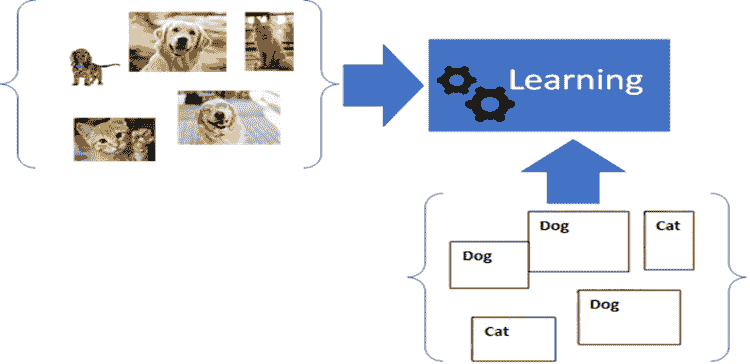
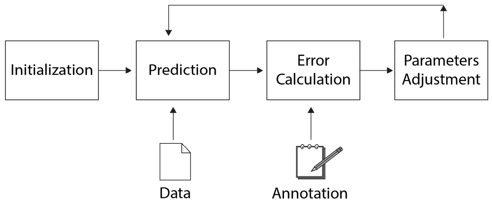
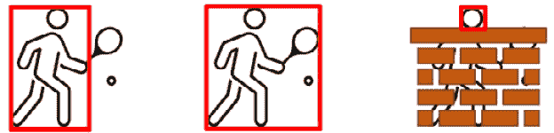
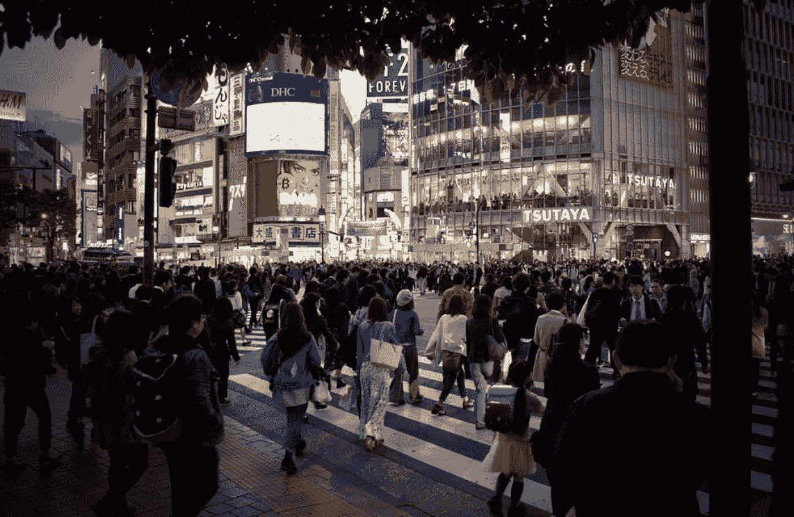

# 第二章：标注真实数据

机器学习（**ML**）引擎的燃料是数据。数据几乎存在于我们技术驱动世界的每个部分。机器学习模型通常需要在标注数据上进行训练或评估，而不仅仅是数据！因此，数据本身对机器学习来说并不很有用，但标注数据是机器学习模型所需要的。

在本章中，我们将学习为什么机器学习模型需要标注数据。我们将看到为什么标注过程成本高昂、易出错且存在偏见。同时，您将了解多个机器学习任务的标注过程，例如 **图像分类**、**语义分割** 和 **实例分割**。我们将强调主要的标注问题。同时，我们将理解为什么对于 **光流估计** 和 **深度估计** 等任务，理想的真实情况生成是不可能的或极其困难的。

在本章中，我们将涵盖以下主要内容：

+   为机器学习标注真实数据的必要性

+   标注过程中的问题

+   光流和深度估计：真实情况和标注

# 为机器学习标注数据

在本节中，您将了解为什么机器学习模型需要标注数据，而不仅仅是数据！此外，您还将被介绍到一系列标注工具。

## 从数据中学习

作为人类，我们的学习方式与机器学习模型不同。我们只需要 *隐式* 数据标注。然而，机器学习模型需要 *显式* 数据标注。例如，假设您想训练一个机器学习模型来分类猫和狗的图像；您不能仅仅向这个模型提供许多猫和狗的图像，期望模型学会区分这两类。相反，您需要描述每张图像的内容，然后您才能训练您的“猫狗”分类器（见图 *图 2**.1*）。

图 2.1 – 猫狗分类器训练数据

应当注意的是，机器学习模型的惊人能力与训练数据和真实情况的质量和数量密切相关，并受到高度影响。通常，我们需要人类对数据进行标注主要有两个原因：训练和测试机器学习模型。接下来，我们将更详细地探讨这些内容。

## 训练您的机器学习模型

训练机器学习模型有四个主要步骤。我们将在接下来逐一探讨它们（见图 *图 2**.2*）。

图 2.2 – 典型机器学习模型训练过程

### 初始化

在训练过程的开始，模型的参数应该被初始化。通常，**深度学习**（**DL**）模型的参数（权重和偏差）被设置为随机的小数，因为这是**随机优化过程**在优化过程开始时所期望的。随机优化过程是一种寻找数学问题最佳解决方案的方法，其中涉及随机性和不确定性以增强搜索过程。

### 预测

该模型利用其对任务的过去知识，并根据输入数据预测输出。我们可以想象，在训练过程中，模型通过将一个**超平面**（决策边界）拟合到训练数据上来构建自己对问题的理解，然后它将任何给定的输入投影到这个超平面上，从而给出模型对这个特定输入的预测。请记住，在这一步，我们只向模型提供*数据*，而没有提供任何真实值。如果我们回到我们的“猫狗”分类器，模型将接受猫和狗的图像，并要求预测这些图像的类别或标签。

重要提示

*训练*：ML 模型通过调整其参数并评估其性能，直到对训练数据达到令人满意的了解。

*测试*：在训练之后，ML 模型在新数据上通过使用各种指标（如 F1 分数、精确度和准确度）来评估其性能。

### 错误计算

给定模型所做的预测，我们现在需要评估这个预测的*正确性*。这正是我们需要真实值或标注的地方。在这一步，我们有两个输入：模型的预测和真实值。回到我们的“猫狗”分类器，模型可能会错误地将猫图像的类别预测为“狗”。现在，由于我们有了训练猫图像的真实类别，我们可以告诉模型，它在这次（对于这个训练样本）对猫狗问题的理解是错误的。此外，我们可以通过损失函数来计算模型接近真实值的程度，损失函数取决于问题的类型。请注意，在机器学习中，我们本质上有两种类型的问题：**分类**问题和**回归**问题。在分类问题中，ML 模型学习对训练数据进行分类。例如，“猫狗”问题是一个分类问题，错误可以是 0 或 1，因为你有两个类别：猫或狗。另一方面，在回归问题中，ML 模型学习利用输入数据来预测一个连续值。例如，假设你正在训练一个模型，根据房屋的一些信息（如位置、房间数量、年龄和其他信息）来预测房屋的价格。假设模型预测房屋的价格为 10 万英镑，但真实价格（来自真实值）为 10.5 万英镑。那么，在这种情况下，错误是 5000 英镑。

误差是机器学习学习过程中的精髓；它为训练模型提供指导——例如，它需要更新多少参数以及哪些参数。

### 反向传播

这就是学习发生的地方。给定计算出的误差，我们需要根据输入和误差更新模型的参数或权重。换句话说，模型需要“调试”预测中误差的原因。如果误差很小，模型将稍微更新其权重或对问题的理解。另一方面，如果误差很大，模型将需要对权重进行重大调整，从而改变对问题的理解。回到“猫狗”分类器，在训练过程的开始阶段，大多数预测将是错误的，因此模型将大幅更新其权重。相反，当模型接近收敛（对训练数据的最佳理解）时，理想情况下，它开始正确预测大多数预测，从而只在权重上进行轻微更新。

## 测试你的机器学习模型

为了评估你的机器学习模型的表现，你也需要标注数据。因此，标注不仅对于训练是必要的，对于测试也是必要的。通常，定性结果有助于对模型整体表现或某些个别有趣场景有一个整体的理解。然而，定量结果是理解机器学习模型鲁棒性、准确性和精度的最重要方式。

使用真实值，我们可以检查我们训练的模型在大量示例上的性能。因此，没有必要单独查看预测，因为整体平均数、标准差和其他统计数据将很好地描述这一点。在下一节中，我们将深入探讨真实数据标注中常见的常见问题。

# 标注过程中的问题

如我们所见，标注对于训练和测试都是至关重要的。因此，任何标签错误、有偏的标注或标注数据不足都将极大地影响你的机器学习模型的训练和评估过程。正如你所预期的那样，标注过程是耗时、昂贵且易出错的，这就是我们将在本节中看到的内容。

## 标注过程是昂贵的

要训练最先进的计算机视觉或**自然语言处理（NLP**）模型，你需要大规模的训练数据。例如，*BERT*（[`arxiv.org/abs/1810.04805`](https://arxiv.org/abs/1810.04805)）是在 BooksCorpos（8 亿单词）和维基百科（25 亿单词）上训练的。同样，*ViT*（[`arxiv.org/abs/2010.11929`](https://arxiv.org/abs/2010.11929)）是在 ImageNet（1400 万图像）和 JFT（3 亿图像）上训练的。标注如此庞大的数据集极其困难且具有挑战性。此外，它耗时且昂贵。需要注意的是，标注数据集所需的时间取决于三个主要因素：任务或问题、数据集大小和粒度级别。接下来，我们将更详细地探讨这些因素。

### 任务

例如，对于一个二元分类问题，标注数据集比标注语义分割数据集更容易，所需时间也更少。因此，任务的性质也对标注过程提出了明确的难度。即使是同一任务，比如语义分割，在标准天气条件和正常光照下标注单个图像，对于*Cityscapes*数据集（Marius Cordts 等人*城市场景语义理解数据集*。在 IEEE 计算机视觉和模式识别会议论文集，第 3213-3223 页，2016 年）大约需要 90 分钟。然而，在恶劣条件下（如雪、雨、雾）或低光照条件下（如夜间）进行类似的标注，对于*ACDC*数据集（Christos Sakaridis 等人*ACDC：具有对应关系的语义驾驶场景理解恶劣条件数据集*。在 IEEE/CVF 国际计算机视觉会议论文集，第 10765-10775 页，2021 年）则需要长达 3 小时。

### 数据集大小

如预期的那样，数据集越大，标注就越困难。复杂性来自于管理如此庞大的数据集并确保大量标注员遵循相同的标注和数据收集协议。这些标注员可能拥有不同的语言、背景、经验和技能。实际上，指导这样一个庞大、多样化的团队，可能分布在不同的地理位置，并不简单。

### 粒度级别

你希望你的真实标签捕捉的细节越多，标注员需要完成的工作就越多。以**视觉目标跟踪**为例。标注单目标跟踪的图像比多目标跟踪更容易。我们在语义分割中也发现了相同的情况。标注具有 3 个类别的语义分割数据集比 10 个类别的更容易。此外，类别的类型也会给标注员带来困难。换句话说，小物体可能更难与背景区分开来，因此标注起来也更困难。

接下来，我们来看一下在真实数据集中常见的噪声真实标签问题的主要原因。

## 标注过程容易出错

在本节中，我们揭示了手动标注真实数据中问题背后的关键原因。

### 人类因素

标注过程中最重要的元素是人类。然而，我们受限于对世界的感知。人类在低光照、杂乱场景或物体远离摄像头、透明等情况下的视觉内容难以用肉眼感知。同时，标注协议的误解和沟通不畅是另一个主要问题。例如，假设你要求一组标注者为视觉目标跟踪训练数据集标注图像。你的目标是只考虑*人物对象*。一些标注者会标注没有物体的人类，而其他标注者可能会将人类携带的其他物体视为感兴趣对象的一部分（参见*图 2.3*）。此外，一些标注者可能只考虑人体未被遮挡的部分。这将导致训练数据中的主要不一致性，模型将难以学习任务，并且永远不会收敛。

图 2.3 – 由于标注协议不明确导致的标注错误样本

### 记录工具

如果录制摄像头晃动，捕获的图像将变得模糊，因此标注者将无法准确识别对象从背景中的实际像素。此外，摄像头的内在和外在参数会极大地改变 3D 场景如何投影到 2D 图像中。镜头的焦距、快门速度、镜头畸变等都会在标注过程中引入一定的误差。换句话说，标注者标注的对象可能并不完全对应于原始图像或甚至 3D 世界中的同一对象。

### 场景属性

气候条件和一天中的时间等属性在标注过程中都起着重要作用。正如我们之前提到的，白天的晴朗天气可能有助于标注者比夜间不利条件更清楚地识别对象。与此平行的是，拥挤和杂乱的场景标注更加困难，更容易出错（参见*图 2.4*）。

图 2.4 – 场景属性：拥挤的场景更容易出现标注错误

### 标注工具

为了提高标注过程，有各种标注工具，例如 Labelbox、Scale AI、Dataloop、HiveData 和 LabelMe。一些标注工具集成了 AI 组件，通过协助人工标注者优化标注过程，例如 Labelbox。虽然这些 AI 辅助方法很有前景，但它们还不实用和可靠。换句话说，人工标注者仍然需要验证和纠正预测。此外，其中一些方法速度较慢，远远不能提供实时帮助。此外，如果问题是新颖的，AI 辅助可能不会按预期工作，因为 AI 模型没有在类似的场景下进行过训练。

根据任务、数据集大小和团队规范，应选择合适的标注工具。标注工具应适用于所有标注者，以确保标注者之间以及创建的基线数据的一致性。

## 标注过程存在偏见

为了理解世界并有效地进行推理，我们的大脑基于以往的经验和信念体系快速做出决策和判断。更多详情，请参阅*决策制定：影响决策制定的因素、使用的启发式方法和决策结果*([`www.inquiriesjournal.com/a?id=180`](http://www.inquiriesjournal.com/a?id=180))。机器学习模型通过训练数据学习推理和感知世界。我们试图客观地收集和标注数据。然而，无意中，我们在收集和标注的数据中反映了我们的偏见。因此，机器学习模型也变得有偏见和不公平。接下来，我们将讨论标注过程中常见的三个因素。

### 理解问题和任务

标注者可能不了解问题，可能不理解数据，或者不理解为什么收集和标注数据。因此，他们可能会做出错误的假设或误解数据。此外，鉴于标注者之间的差异，他们可能对问题的理解不同。

### 背景、意识形态和文化

这是标注过程中不一致性的一个关键因素。让我们想象一下，你要求一组 10 位标注者为**动作识别**标注数据集。你只有两个动作：确认或否定。你的标注团队成员来自英国、保加利亚和印度。保加利亚标注者会将摇头理解为“是”，点头理解为“否”。其他标注者则会相反。因此，你将得到错误的学习数据，你的模型将无法学习这个任务。还有其他场景，其中偏见并不明显，难以轻易识别，这是这个范围内最困难的问题。

### 主观性和情绪

对于某些问题，例如**文本情感分析**，这是一种用于理解文本数据的知名自然语言处理技术，人工标注者可能会对某些政党、足球队、性别和种族有偏见。因此，标注将偏向于标注者的观点。

标注过程中的常见问题

总是避免以下情况：使用错误的标注工具、模糊的标注协议、标注者之间的误解、在标注过程开始后添加新标签，以及在过程中修改标注协议。

# 光流和深度估计

在本节中，我们将探讨不同的机器学习任务及其相应的地面真实值生成过程。

## 计算机视觉的地面真实值生成

**计算机视觉**旨在使计算机能够通过数字图像进行视觉识别。知道视觉是我们大脑执行的最复杂功能之一并不奇怪。因此，模仿视觉并不简单，对于最先进的计算机视觉模型来说，这相当复杂。

计算机视觉任务包括语义分割、实例分割、光流估计、深度估计、法线图估计、视觉目标跟踪等。每个任务都有其生成相应地面真实值的独特方法。接下来，我们将看到这些任务的样本。

### 图像分类

此任务的训练图像通常只包含一个对象，即感兴趣的对象。此任务的标注只是查看每张图像并选择一个或多个描述图像中对象的类别。

### 语义和实例分割

对于语义分割和实例分割，标注者需要为图像中的每个像素分配一个类别标签。换句话说，标注者被要求将图像分割成不同的区域，其中每个区域展示语义分割中的一个类别和实例分割中的一个实例。请参阅[`github.com/mrgloom/awesome-semantic-segmentation`](https://github.com/mrgloom/awesome-semantic-segmentation)以获取语义分割方法的详尽列表，例如*U-Net*、*DeepLab*和*D2Det*。对于实例分割，请检查[`github.com/topics/instance-segmentation`](https://github.com/topics/instance-segmentation)。

### 目标检测和跟踪

在目标检测和跟踪中，注释员在图像中的每个目标周围绘制一个边界框。目标跟踪通过视频跟踪最初选择的目标在整个视频中的运动。另一方面，**目标检测**在图像上执行，以检测任务所需的对象。请参阅[`github.com/topics/object-detection`](https://github.com/topics/object-detection)获取知名和最先进的目标检测方法以及有用的 Python 库列表，例如*YOLOv5*、*Mask R-CNN*和*OpenMMLab*。对于目标跟踪，请参阅[`github.com/topics/object-tracking`](https://github.com/topics/object-tracking)获取模型列表，例如*SiamMask*、*HQTrack*和*CFNet*。

现在，我们将检查计算机视觉中两个极其难以使用标准方法生成地面真实数据的特定任务。这基本上只是真实数据限制的一个例子。

## 光流估计

**光流**是物体从一个帧到另一个帧的相对明显运动。这种运动可能是由于物体或相机运动引起的。光流在许多任务中具有许多关键应用，例如**从运动中结构**、**视频压缩**和**视频稳定**。从运动中结构在 3D 构建、机器人的导航和操作任务、增强现实和游戏中的应用非常广泛。视频压缩对于视频流、存储和传输至关重要；另一方面，视频稳定对于延时摄影视频和无人机或头戴式相机记录的视频至关重要。因此，光流在实践中有巨大的应用。有关*SKFlow*、*GMFlow*和*RAFT*等光流方法的综合列表，请参阅[`github.com/hzwer/Awesome-Optical-Flow`](https://github.com/hzwer/Awesome-Optical-Flow)。

请注意，生成光流的地面真实数据极其困难。一些方法在许多假设下应用复杂程序来实现这一点，例如室内环境和有限数量的物体和运动。

## 深度估计

**深度估计**是指测量场景中每个像素到相机的距离的任务。这对于 3D 视觉至关重要，并且有许多应用，例如 3D 场景重建、自动驾驶汽车和导航、医学成像和增强现实。通常，深度估计有两种主要方法：一种使用单目图像，另一种基于基于极线几何的立体图像。与光流类似，在现实世界中生成深度估计的地面真实数据极其困难。请参阅[`github.com/topics/depth-estimation`](https://github.com/topics/depth-estimation)获取最近深度估计方法的列表，例如*AdaBins*、*SC-Depth*和*Monodepth2*。

重要提示

对于光流和深度估计，大多数使用的标准数据集都是合成数据集。对于光流，我们可以识别出合成数据集，如 *FlyingChairs*、*FlyingThings3D* 和 *Kubric* ([`github.com/google-research/kubric`](https://github.com/google-research/kubric))。对于深度估计，我们可以提到 *Virtual KITTI*、*DENSE* ([`github.com/uzh-rpg/rpg_e2depth`](https://github.com/uzh-rpg/rpg_e2depth)) 和 *DrivingStereo* ([`drivingstereo-dataset.github.io/`](https://drivingstereo-dataset.github.io/))。

# 摘要

在本章中，我们学习了为什么机器学习模型需要标注的真实数据。同时，我们探讨了标注过程中的一些常见问题。我们的探索使我们更深入地理解了真实数据的收集和标注问题，例如这是一个耗时且容易受到标注者错误影响的过程。此外，我们还讨论了真实数据在光流和深度估计等任务中的局限性。在下一章中，我们将具体探讨真实数据带来的隐私问题。

在本书的后续章节中，我们将继续我们的激动人心的旅程，了解真实数据的局限性以及合成数据的潜在解决方案。
