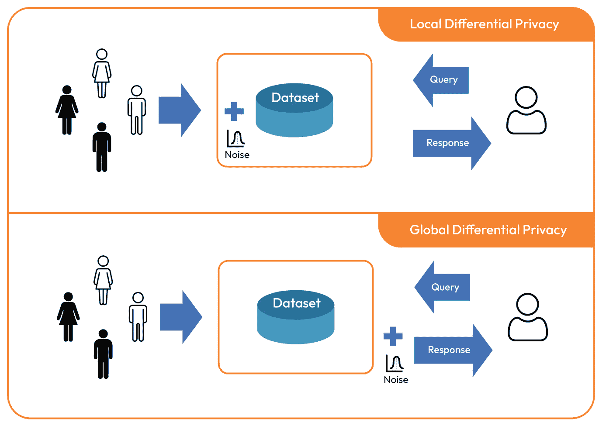
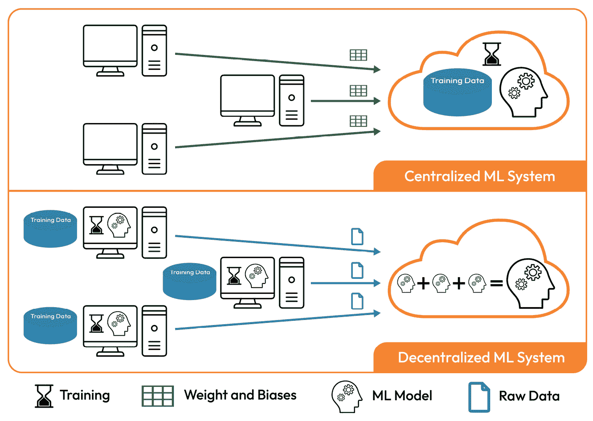

# 3

# 实际数据中的隐私问题

由于其多样化的应用，机器学习正成为我们日常生活的重要组成部分。因此，人们对机器学习中的隐私问题越来越关注。数据集和训练好的机器学习模型可能会泄露个人和敏感信息，如政治观点、生物识别数据、心理健康、性取向和其他私人信息。

在本章中，我们将学习关于隐私问题以及为什么这是机器学习（ML）中的一个关注点。此外，我们还将简要介绍隐私保护机器学习。

在本章中，我们将涵盖以下主要主题：

+   为什么隐私在机器学习中成为一个问题？

+   机器学习中的隐私问题究竟是什么？

+   隐私保护机器学习

+   实际数据挑战和问题

# 为什么隐私在机器学习中成为一个问题？

正如我们在前几章中讨论的，机器学习模型需要大规模的训练数据才能收敛和良好训练。数据可以从社交媒体、在线交易、调查、问卷或其他来源收集。因此，收集到的数据可能包含个人可能不希望与某些组织或个人分享的敏感信息。如果数据被他人共享或访问，并且因此识别出个人的身份，这可能会给他们造成个人滥用、财务问题或身份盗窃。

机器学习中隐私泄露的复杂性紧密相关于以下三个主要因素：

+   机器学习任务

+   数据集大小

+   规章制度

让我们更深入地了解一下。

## 机器学习任务

*任务*主要定义了我们需要收集和标注的训练数据的类型。因此，一些机器学习任务，如天气预报和音乐生成，与其他机器学习任务（如生物识别认证、医学图像处理和分析）相比，可能具有较少的隐私问题。

## 数据集大小

数据集越大，你将面临的隐私问题就越多。如果数据集是大规模的，那么你无法将其存储在一个设备上。因此，你可能需要一些云服务和技术来管理你的数据集，例如 MongoDB、Hadoop 和 Cassandra。因此，你可能对你的数据控制较少。因此，你需要更加关注处理或管理你的数据的技术和服务。

## 规章制度

许多国家都有明确和限制性的数据保护法规。例如，英国有《2018 年数据保护法》([`www.legislation.gov.uk/ukpga/2018/12/contents/enacted`](https://www.legislation.gov.uk/ukpga/2018/12/contents/enacted))。同时，在欧盟也可以找到类似的规定，如《通用数据保护条例》([`gdpr-info.eu`](https://gdpr-info.eu))。因此，如果你正在使用个人数据，你必须考虑数据保护原则，如透明度、用于指定的目的，以及保留特定期限。

如果你的数据集包含敏感和机密信息，那么你将受到更多的限制。你的数据集可能包含有关生物识别、性别、健康、宗教和政治观点的信息。因此，如果你重新使用你、你的组织或其他人收集的数据集，这种行为可能是非法的。

利用真实数据集的一个主要限制是隐私问题。正因为如此，我们可以看到为什么合成数据是解决这些问题的有希望解决方案。在下一节中，我们将更深入地探讨隐私问题及其相关主题，如版权和知识产权侵权，这些是在收集新数据集时的主要问题。

# 机器学习中隐私问题究竟是什么？

在机器学习隐私的范围内，有两个主要关注点。第一个是关于数据集本身——也就是说，如何收集它，如何保持其隐私，以及如何防止未经授权访问敏感信息。第二个与机器学习模型容易泄露训练数据有关，我们将在下一节中讨论。现在，让我们检查与机器学习中数据集隐私相关的问题。

## 版权和知识产权侵权

版权是一个法律术语，用于保护知识产权的所有权。它阻止或限制他人未经你许可使用你的作品。例如，如果你拍照、录像或写博客，你的作品受版权保护。因此，其他人未经许可不得分享、复制或分发你的作品。因此，我们在互联网上看到的一些图像、视频、文本或其他信息可能受到版权限制。因此，如果你想收集一个数据集，你必须仔细考虑版权问题。众所周知，有不同方法来整理真实数据集。作为一名机器学习从业者，你可以做以下事情：

+   **自己收集数据**：你可以使用相机、麦克风、传感器、问卷和其他方法收集大量数据。

+   **从互联网收集数据**：你可以使用谷歌、雅虎、百度和 DuckDuckGo 等搜索引擎来收集你的数据集，类似于*ImageNet* ([`www.image-net.org/`](https://www.image-net.org/))数据集的收集方式。

+   **从其他数据集中收集数据**：你可以结合不同的数据集，为特定应用创建一个新的数据集——例如，如果你只对特定场景（如恶劣条件）中的人类视觉对象跟踪感兴趣——在这种情况下，你可以通过排除无关类别和天气条件来结合不同的数据集。因此，你为你的特定问题创建了一个新的数据集。

使用我们的相机拍摄某人的照片或使用我们的硬件录制他们的声音并不允许我们使用他们的信息。同时，对于大规模数据集来说，请求许可并不是一个实际的解决方案。为了避免类似的问题，一些数据集，如**ImageNet**，最初是从互联网上收集的。然后，由人工标注员进行标注。需要注意的是，我们看到的互联网上的每一张图片都不一定能用来构建我们的数据集；有些图片有版权许可证，限制了它们的使用方式。因此，网络上可用的数据并不一定意味着你可以利用这些数据来解决你的问题。将不同数据集合并时也会出现相同的版权问题。

如果你的机器学习模型是在梵高的画作上训练的，学会了如何生成艺术品，那么就会产生一个问题：生成的图像的版权归谁所有：梵高、机器学习工程师，还是两者都有？在机器学习中，这是一个有争议且复杂的问题。**ChatGPT** ([`openai.com/blog/ChatGPT`](https://openai.com/blog/ChatGPT)) 和 **Imagen** (*具有深度语言理解的逼真文本到图像扩散模型*) 就是这样的模型示例。因此，在真实数据集上训练你的模型可能并不能让你充分利用机器学习模型的潜力。你仍然可能受到训练过程中使用的样本的版权和知识产权的约束。正如你所预期的，利用合成数据似乎是解决这些问题的有希望的解决方案。

## 实验的隐私和可重复性

基于机器学习的研究中，主要问题之一是实验的可重复性困难，因此无法验证研究论文中声明的结果。数据隐私是导致这一问题的关键因素之一。许多公司使用自己的数据集开发机器学习解决方案。由于与隐私问题和法规相关的许多原因，他们可能分享训练好的模型，但不会分享数据集本身。因此，其他研究人员无法重复实验和结果。这为错误、偏见、误解、伪造和操纵研究结果创造了良好的机会。这也是在某些领域，如医疗保健和金融，使用合成数据可以使研究更加透明、结果更加可信的另一个原因。

## 隐私问题和偏见

偏见是另一个与机器学习模型和真实数据中的隐私问题密切相关的问题。机器学习模型可以在有偏见的数据上训练，这可能导致有偏见的结果。例如，一些面部识别商业应用被发现对肤色较深的人、女性或 18 至 30 岁之间的人的识别准确性较低。这个问题是由于机器学习模型的训练数据中的偏见造成的。因此，当由于隐私问题而无法获得训练数据时，可能会出现某些偏见问题。因此，这可能导致基于种族、性别和其他因素的待遇不公和歧视。接下来，我们将深入探讨隐私问题的传统解决方案。

# 隐私保护机器学习

**隐私保护机器学习**是一个热门话题，因为它提出了解决机器学习领域隐私问题的解决方案。隐私保护机器学习提出的方法允许研究人员使用敏感数据来训练机器学习模型，同时防止敏感信息被第三方共享或访问，或被机器学习模型揭示。在下一小节中，我们将检查减轻数据集中隐私问题的常见方法。

## 隐私保护数据集的方法

在本节中，我们将深入探讨处理和保护数据集中敏感信息的标准方法。我们将探讨匿名化、集中式数据和差分隐私。

### 匿名化

**匿名化**可以被认为是数据集中隐私问题的最早方法之一。假设你被提供了一个包含患者地址、电话号码和邮政编码的医疗记录数据集。为了匿名化这个数据集，你可以简单地移除这些敏感数据，同时保留其他医疗记录。不幸的是，这种方法并不很有效，有两个原因。有时，你无法移除这些敏感信息，因为它们是任务的一部分。同时，匿名化可能不足以防止个人被识别，因此个人可能通过将数据集中或其他数据集中的其他信息链接和组合来被识别。例如，查看题为《威廉·韦尔德州长医疗信息的“再识别”：对健康数据识别风险和隐私保护现在与当时的批判性再审视》的论文（[`papers.ssrn.com/sol3/papers.cfm?abstract_id=2076397`](https://papers.ssrn.com/sol3/papers.cfm?abstract_id=2076397)）：

| **姓名** | **姓氏** | **有糖尿病** | **吸烟** | **性别** | **年龄** | **职业** |
| --- | --- | --- | --- | --- | --- | --- |
| 迈克 | 克里斯 | 是 | 否 | 男 | 60 | 程序员 |
| 艾玛 | 昆宁汉姆 | 是 | 是 | 女 | 40 | 律师 |
| 一月 | 万 | 否 | 否 | 男 | 32 | 博士研究生 |
| 奥利维亚 | 昆宁汉姆 | 否 | 否 | 女 | 23 | 学生 |

图 3.1 – 包含敏感信息的样本数据集

### 集中式数据

另一种方法是基于将数据保留在私有服务器上的想法，而不是共享数据本身，而是回答关于数据的问题。例如，以下是一些关于*图 3.1*中所示数据集的查询示例：

+   返回糖尿病患者的最小年龄

+   返回糖尿病女性患者的数量

+   返回糖尿病患者的平均年龄

如您所见，组织可以在保持敏感数据的同时，仍然允许其他研究人员或组织利用这些数据。然而，这种方法并不能抵御网络攻击。攻击者可以使用这些查询通过组合复杂查询和链接来自其他数据集的信息来识别个人并披露敏感信息。例如，如果您删除了**姓名**和**姓氏**列，但仍然使用关于**性别**、**年龄**和**职业**的信息，仍然可能使用这些细节来识别一些患者。

### 差分隐私

作为之前方法的补充解决方案，差分隐私似乎是一个有希望的解决方案。然而，有一些局限性，正如我们稍后将看到的那样。

这种方法的关键思想是在了解所考虑的现象的同时，保持个人信息的保密。这种方法基于对包含所有敏感数据的服务器的查询。许多公司使用差分隐私，例如 Uber、Google 和 Apple。算法可能会向数据集或查询中的信息添加随机噪声，如图*图 3.2*所示：

图 3.2 – 本地和全局差分隐私

差分隐私有两种主要方法：

+   **本地差分隐私**（**LDP**）：从用户那里获取的数据经过噪声处理，例如拉普拉斯噪声。这个过程使得数据对攻击更加安全。即使攻击者可以访问数据，他们也将得到一个噪声版本，他们将无法识别个人。

+   **全局差分隐私**（**GDP**）：从客户端获取的原始数据未经修改，直接存储在服务器上，不添加任何噪声。当收到查询时，在添加噪声后返回原始答案（准确）。这个过程生成一个保护数据隐私的私有答案。

因此，有了这些数据保护机制，我们假设现在可以在不披露个人敏感信息的情况下对机器学习模型进行训练。不幸的是，这个假设并不总是有效的，正如我们将在接下来的几节中看到的那样。

## 隐私保护机器学习的方法

**隐私保护机器学习**（**PPML**）旨在防止训练数据泄露。机器学习模型可能在训练过程中记住敏感信息，因此机密信息可能会被机器学习模型泄露。标准的 PPML 方法依赖于我们之前讨论过的差分隐私。接下来，你将了解到联邦学习。

### 联邦学习

**联邦学习**是一种新颖的策略，它允许在本地服务器或节点之外不传输数据的情况下对敏感数据进行训练。因此，组织可以在保持数据在其组织本地服务器上的同时，共享其敏感数据以训练机器学习模型。同时，这也是一种解决防止与外部方共享数据的法规的解决方案。它基于我们接下来将要看到的分布式学习范式。请参阅[`github.com/topics/federated-learning`](https://github.com/topics/federated-learning)以获取广泛的联邦学习框架和库，如*FATE*、*FedML*和*PySyft*。

首先，让我们区分集中式和分布式机器学习系统：

+   **集中式机器学习系统**：在集中式机器学习系统中，所有训练都在一个服务器上完成。这更容易实现，因此传统上应用于机器学习问题。然而，由于用户与中央服务器之间的通信，它有许多局限性。如图**3.3**所示，用户需要将信息发送到执行训练过程的中央服务器。除了延迟问题外，这种方法更容易受到攻击：

图 3.3 – 集中式和分布式机器学习系统

+   **分布式机器学习系统**：与集中式选项相反，该系统允许机器学习模型在客户端节点上而不是在集中式服务器上训练。客户端将他们训练的机器学习模型的权重和偏差发送到管理员服务器。随后，权重和偏差被用来构建最终的机器学习模型。这是解决许多隐私问题的巧妙解决方案。例如，欧盟的许多医院不能与医院外的组织或个人共享他们的患者数据。因此，使用分布式机器学习系统，其他组织可以访问患者数据，因为他们的数据不会离开医院的服务器，训练过程也将在其服务器上完成。

通常，我们可以看到分布式机器学习系统有以下优点：

+   服务器和客户端之间的通信减少

+   更好的隐私性，因为客户端不共享原始数据；相反，他们共享权重和偏差

+   更好的隐私性，因为数据存储在本地节点，并且在训练过程中不会离开组织。

在下一节中，我们将简要讨论真实数据中隐私问题的本质。

# 真实数据挑战和问题

到目前为止，在本章中，我们已经介绍了多种缓解真实数据中隐私问题的方法。正如您所看到的，这些方法显然存在局限性，并不总是实用的。一个基本问题是机器学习模型会记住训练数据。因此，给定一个训练好的机器学习模型，可能有可能检索到一些训练数据。许多研究人员最近对机器学习模型的隐私问题提出了警告，即使在应用了标准的隐私解决方案之后。更多信息，请参阅*如何破解 Netflix Prize 数据集的匿名性* ([`arxiv.org/abs/cs/0610105`](https://arxiv.org/abs/cs/0610105)) 和 *秘密分享者：评估和测试神经网络中的无意记忆* ([`arxiv.org/abs/1802.08232`](https://arxiv.org/abs/1802.08232))。

真实数据的本质是问题的核心。例如，如果您被提供了真实的人类面部数据，并对这些数据进行了一些匿名化操作，或者如果您应用了最先进的 PPML 训练方法，数据仍然存在被泄露的风险。因此，似乎我们不应该再提出更多复杂且有时不切实际的解决方案来解决真实数据中的隐私问题，而是应该考虑其他替代方案，并关注问题的本质，即真实数据。换句话说，似乎合成数据代表了一个丰富且安全的训练大规模机器学习模型的来源，从而解决了这些复杂的隐私问题。

# 摘要

在本章中，我们讨论了为什么隐私是机器学习中的一个关键问题。同时，我们学习了这个领域中隐私问题的确切内容。我们还了解了主要的标准解决方案及其局限性。

在下一章中，我们将探讨什么是合成数据。这将帮助我们打下坚实的基础，以便我们能够学习如何利用合成数据作为解决我们在前几章中考察的真实数据问题的方案。

# 第二部分：机器学习合成数据概述

在本部分，您将了解合成数据。您将了解其历史和主要类型。然后，您将探索其主要优势。您将理解为什么合成数据是解决许多复杂问题（如隐私）的潜在解决方案，这些问题阻碍了机器学习在某些领域的进步。您将学习如何利用合成数据生成方法来生成数据，这些数据通常难以用真实数据进行捕获，且成本高昂、危险。

本部分包含以下章节：

+   *第四章*，*合成数据简介*

+   *第五章*，*合成数据作为解决方案*
