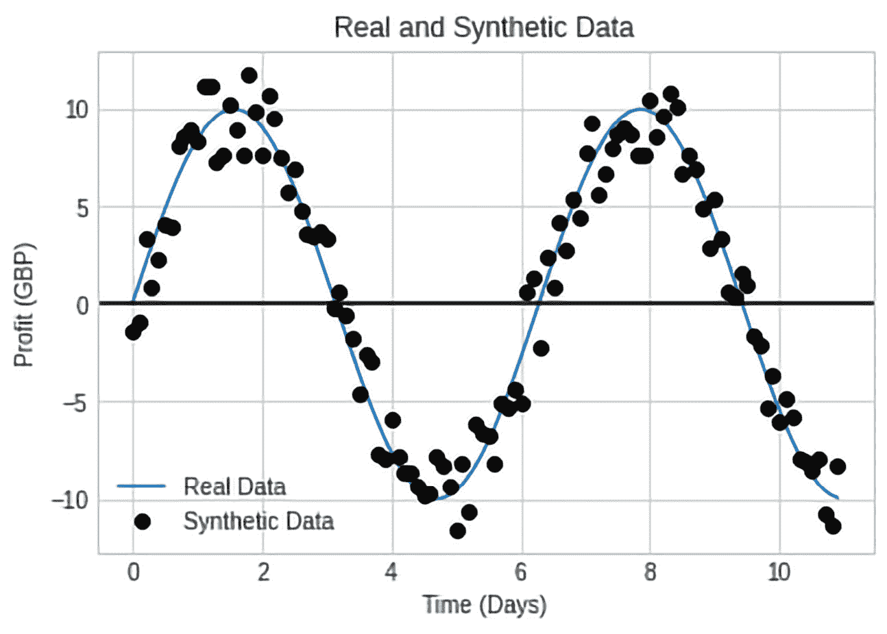
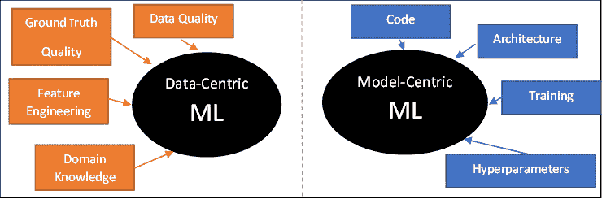
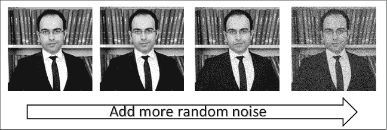
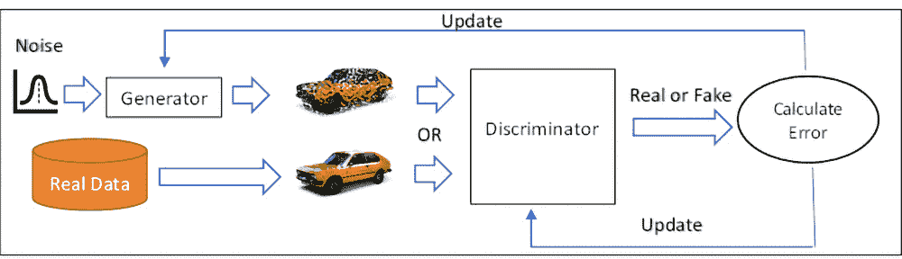
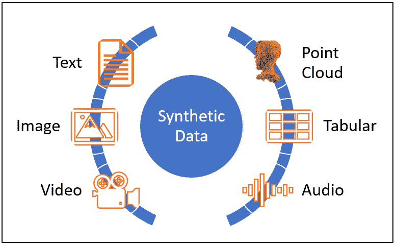
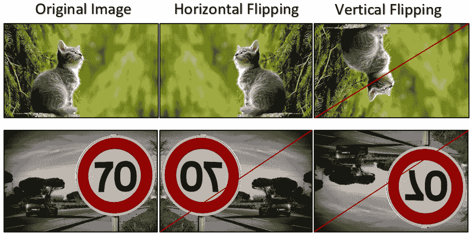
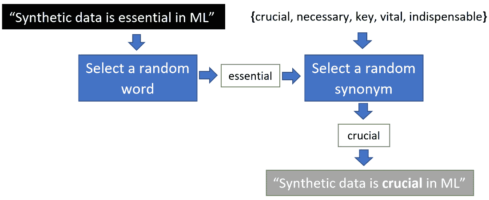

# 4

# 合成数据简介

在本章中，我们将定义并介绍合成数据。我们将简要探讨合成数据的历史和演变。然后，我们将介绍合成数据的主要类型以及基本的数据增强方法和技巧。

在本章中，我们将涵盖以下主要主题：

+   什么是合成数据？

+   合成数据的历史

+   合成数据类型

+   数据增强

# 技术要求

本章中使用的代码将在本书 GitHub 仓库的相应章节文件夹中提供：[`github.com/PacktPublishing/Synthetic-Data-for-Machine-Learning`](https://github.com/PacktPublishing/Synthetic-Data-for-Machine-Learning)。

# 什么是合成数据？

**合成数据**是人工生成数据：这些数据并非从现实世界中捕获、测量或记录。相反，使用算法或软件来创建或生成这些数据。合成数据可以通过使用数学模型模拟自然现象或应用对现实世界过程的近似来生成。生成合成数据有许多方法，例如利用游戏引擎，如 Unreal 和 Unity，或利用统计模型，如 GANs 和扩散模型。众所周知，机器学习模型需要大规模的训练数据集进行训练和评估。收集和标注这些数据集非常耗时、易出错，且存在隐私问题。请参阅*第二章*和*第三章*。合成数据是解决这些先前限制的有力解决方案。

合成数据在收集和标注数据成本高昂的场景中非常有用，但其应用范围远不止这个特定用例，正如我们稍后将会看到的。合成数据在人工智能、机器学习和数据分析领域被广泛应用，特别是在**计算机视觉**任务中，这些任务通常需要大量且难以标注的数据进行训练。因此，合成数据在这一领域得到了广泛的应用，并取得了显著的进步。

在某些通常难以在现实世界中捕捉到的条件下，可以生成合成数据来训练或评估机器学习模型。例如，让我们假设我们想要训练一个计算机视觉模型，根据一些视觉信息（如 RGB 和激光雷达图像）来预测交通事故。我们需要为我们的训练模型提供包含数千起交通事故的足够大的数据集。从现实世界中收集这个数据集可能需要我们几周、几个月甚至几年；这需要许多工程师和标注员，以及巨大的预算来实现我们的目标。同时，我们的数据集可能在其他国家或几年后不再有效。如果你在英国收集数据集，那里的人靠左行驶，这个数据集就不适用于中国，那里的人靠右行驶！与此并行的是，如果你在 2005 年收集数据集，由于例如新车型等原因，你的数据集可能不适用于 2024 年。

另一方面，如果你使用模拟器（如*CARLA* ([`carla.org`](https://carla.org)））生成合成训练数据，你可以模拟数千起交通事故。此外，你可以控制车型、场景属性、天气条件和其他属性。这仅仅是合成数据在机器学习模型的训练和评估中的优势的一个例子。

## 合成数据和真实数据

假设你想要训练你的机器学习模型来预测销售给定产品的利润。你可以获得的最高利润是 10 英镑，最大损失也是 10 英镑。在现实世界中，这个特定的财务问题可以使用一个简单的正弦波来建模，如图*图 4**.1*所示。因此，为了获得最大利润，你必须在大约从生产日（第 0 天）起第二和第八天左右销售产品。蓝色线给出了现实世界中这个问题的实际模型。然而，这个模型对我们来说是隐藏的，因为如果我们知道这个模型，那么就没有必要使用机器学习来进行预测。假设真实数据完美地代表了这个模型。那么，在这个场景中的合成数据就是黑色点。换句话说，合成数据近似真实数据，而真实数据也是对现实世界中实际过程或现象的近似。

图 4.1 – 真实和合成数据的简单示例

到目前为止，我们可能会问，为什么在真实数据可用的情况下，我们还需要使用合成数据？确实，这是一个合理的问题：如果你有足够、标注且无偏见的真实数据，且没有隐私问题，那么你不应该使用合成数据！

不幸的是，在大多数现实世界的问题中，这样的最优数据集是不可用的，极其昂贵，且有限。因此，合成数据作为最后的手段来帮助机器学习模型了解过程或任务，即使真实数据有限或不存在。正如你在 *图 4.1* 中所看到的，仅给出散点图，我们仍然可以观察到明显的模式，即一种 **正弦波**，在这组数据中。因此，一个合适的机器学习模型仍然能够学会如何预测最佳的销售时间，即使你只用合成数据进行训练。

## 机器学习中的数据中心和架构中心方法

在机器学习的领域中，有两种主要的方法：一种是以模型为中心的方法，它关注机器学习模型及其架构；另一种是以数据为中心的方法，它优先考虑数据，如图 *4.2* 所示。

图 4.2 – 以数据和模型为中心的机器学习

接下来，让我们更详细地讨论这两种方法。

+   **以模型为中心的机器学习**：直到最近，以模型为中心的方法一直是机器学习中的主要方法。这种方法假设数据集是固定的，并努力提出更好的架构、新颖的训练程序以及新的搜索和找到最佳超参数的方法。让我们关注这些要素，并更详细地讨论它们：

    +   **代码和架构**：研究人员持续开发新的架构，以更好地利用和了解训练数据。例如，在著名的 *ImageNet 大规模视觉识别挑战（ILSVRC）数据集* ([`www.image-net.org/challenges/LSVRC`](https://www.image-net.org/challenges/LSVRC)) 发布之后，提出了许多架构来提高前 5 类分类误差，如 AlexNet、*使用深度卷积神经网络进行 ImageNet 分类* ([`proceedings.neurips.cc/paper/2012/file/c399862d3b9d6b76c8436e924a68c45b-Paper.pdf`](https://proceedings.neurips.cc/paper/2012/file/c399862d3b9d6b76c8436e924a68c45b-Paper.pdf)) 和 ResNet、*用于图像识别的深度残差学习* ([`arxiv.org/abs/1512.03385`](https://arxiv.org/abs/1512.03385))。机器学习模型在层数（即深度网络）、模型参数、学习滤波器等方面都有所改进。

    +   **训练**：对于机器学习研究人员来说，训练是一个有趣的研究领域。研究人员试图找到更快的方式来训练复杂的机器学习模型，并使用更少的数据。这涉及到模型参数初始化技术及其对优化过程的影响，提出了新的优化技术，更好的泛化能力，减少过拟合，新的预训练技术，以及更好的机器学习模型微调技巧。

    +   **超参数**：如学习率、批量大小和层数等参数对整体学习过程以及模型在现实世界中的性能有重大影响。已经提出了不同的方法来高效地搜索最优超参数，以进一步改进机器学习模型。

+   **数据为中心的机器学习**：这种方法最近才开始获得更多动力。它关注数据本身，而不是架构和代码。它假设机器学习模型的架构是固定的，并试图通过仅关注数据集来提高性能。它更关注以下与数据相关的概念：

    +   数据质量

    +   真实数据质量

    +   特征工程

    +   领域知识

让我们看看合成数据是如何发展的。

# 合成数据的历史

在本节中，我们将了解合成数据的演变。基本上，我们可以将合成数据的使用分为以下几类，这些类别可能不反映时间顺序，因为很难追踪每个类别早期使用合成数据的情况。

## 随机数生成器

**随机数生成器**是合成数据最简单的形式之一。假设你正在训练一个机器学习模型来识别人脸。比如说，你只有有限数量的图像。你可以向原始图像添加随机噪声，以创建新的合成图像。随机噪声的实现可以通过使用随机数生成器来完成。这将帮助人脸识别机器学习模型学习在特定类型的噪声下人脸是如何变化的（参见*图 4*.3）。

图 4.3 – 利用随机数生成器生成合成图像

接下来，我们将了解 GANs，这是合成数据发展中的另一个步骤。

## 生成对抗网络（GANs）

GANs 是由 Ian Goodfellow 等人于 2014 年通过一篇著名的**NeurIPS**（原名**NIPS**）论文引入的，该论文题为《生成对抗网络》（*Generative Adversarial Nets*）。([`proceedings.neurips.cc/paper/2014/file/5ca3e9b122f61f8f06494c97b1afccf3-Paper.pdf`](https://proceedings.neurips.cc/paper/2014/file/5ca3e9b122f61f8f06494c97b1afccf3-Paper.pdf))。从那时起，GANs 被应用于各种应用，如生成人脸、照片修复、3D 对象生成、文本到图像的翻译等等有趣的领域。

一个典型的 GAN 由两个网络组成：一个生成器和判别器。**生成器**接收一个噪声随机输入向量并输出一个合成样本，例如，可以说，一个汽车图像。生成器的目标是使合成的数据，例如，汽车图像，与真实数据不可区分，即真实汽车图像。另一方面，**判别器**努力从真实数据中识别合成数据。判别器被提供真实或合成数据，并要求预测训练样本的数据来源。如果数据样本是从真实数据中抽取的，并且判别器正确地将数据来源识别为真实数据，则不会向判别器回传错误。另一方面，如果生成器预测了一个与真实数据集可区分的样本，则生成器会受到惩罚。同样，如果判别器未能识别图像的来源，则判别器会受到惩罚，而生成器会因为生成接近真实数据集的不可区分的合成样本而获得奖励（见*图 4.4*）。

图 4.4 – 典型的 GAN 训练过程

我们将在*第七章*中更详细地讨论 GAN。

## 用于隐私问题的合成数据

如我们在*第三章*中讨论的，真实数据中存在巨大的隐私问题，而当前解决方案只是部分解决方案。最近，合成数据被提出作为解决这些隐私问题的合法解决方案。通常，金融数据经常与隐私问题相关联，因为共享客户数据，如个人细节、交易、资产和收入是有问题的。这些信息通常存储在表格中。令人惊讶的是，已经证明可以从真实数据中学习，并可以生成合成数据。例如，撰写题为*使用条件 GAN 对表格数据进行建模*（[`arxiv.org/abs/1907.00503`](https://arxiv.org/abs/1907.00503)）的论文的研究人员证明了他们的**条件表格 GAN**（**CTGAN**）可以以复杂分布对表格真实数据的概率分布进行建模。他们的代码可以从论文的 GitHub 存储库[`github.com/sdv-dev/CTGAN`](https://github.com/sdv-dev/CTGAN)中获取。

## 计算机视觉中的合成数据

计算机视觉是机器学习领域需要大规模训练数据的主要领域之一。正如我们之前讨论的，为计算机视觉任务收集和标注数据极为昂贵，标注过程也容易出错。作为解决方案，研究人员开始利用各种方法来生成合成数据，例如游戏引擎、视频游戏、生成对抗网络（GANs）和**变分自编码器**（**VAEs**）。游戏引擎如*虚幻引擎*（[`www.unrealengine.com`](https://www.unrealengine.com)）和*Unity*（[`unity.com`](https://unity.com)）的巨大进步促进了逼真 3D 虚拟世界的创建，从而产生了高质量和大规模的合成数据。同时，小型研究组能够获得强大且价格合理的**图形处理单元**（**GPUs**），这进一步普及了这些游戏引擎。

## 合成数据与伦理考量

随着合成数据越来越受到关注并被应用于各种应用中，在过去的几个月里，许多研究人员、科学家、艺术家甚至公众开始质疑使用模型（如*Chat-GPT*（[`chat.openai.com/chat`](https://chat.openai.com/chat)）和*Stable Diffusion*（[`stablediffusionweb.com`](https://stablediffusionweb.com)））生成的文本和图像中的版权问题。同时，机器学习社区也提出了其他问题，如问责制和透明度，以采取进一步预防措施并进行更多研究。

接下来，我们将深入合成数据的世界，了解其在机器学习中的主要类型。

# 合成数据类型

合成数据类型有很多，例如文本、图像、点云和表格。根据机器学习问题和任务，需要不同类型的数据。在本节中，我们将更详细地讨论合成数据的主要类型。

图 4.5 – 合成数据类型的示例

+   **文本**：维基百科、数字书籍、词典和文本语料库是文本数据的例子。机器学习模型可以在大规模文本数据集上训练，以学习我们作为人类生成或编写的文本结构。然后，这些模型可以被用来回答问题、总结文本或从一种语言翻译到另一种语言。这些模型，如*ChatGPT*、*ChatSonic*（[`writesonic.com`](https://writesonic.com)）和*Jasper Chat*（[`www.jasper.ai`](https://www.jasper.ai)），通过预测下一个应该出现的单词来生成合成文本。

+   **视频、图像和音频**：ML 模型可以学习视频、图像或音频中的模式，然后它们可以在某些新条件下生成合成的版本。例如，可以使用*Stable Diffusion*([`github.com/CompVis/stable-diffusion#stable-diffusion-v1`](https://github.com/CompVis/stable-diffusion#stable-diffusion-v1))、*DALL·E 2*([`openai.com/dall-e-2`](https://openai.com/dall-e-2))和*Imagen*([`imagen.research.google`](https://imagen.research.google))等模型，理论上在多种条件下生成无限数量的合成图像。

+   **表格**：这指的是通常使用表格按行和列组织的数据。通常，行是观测值，列是属性。ML 模型可以用于预测表格数据中的缺失值，例如，*表格数据缺失值插补的扩散模型*([`arxiv.org/abs/2210.17128`](https://arxiv.org/abs/2210.17128))。

+   在这篇题为*SynthCity：大规模合成点云*的论文中提出了`SynthCity`数据集([`arxiv.org/pdf/1907.04758.pdf`](https://arxiv.org/pdf/1907.04758.pdf))，它提供了超过 3.6 亿个合成点云。

在下一节中，我们将深入探讨 ML 中的数据增强技术。

# 数据增强

数据增强是一种简单而强大的工具，用于缓解过拟合问题，尤其是在可用真实数据有限的情况下。数据增强技术旨在利用领域知识来丰富可用的训练数据。因此，数据增强通常仅应用于训练数据，而不是验证或测试数据。例如，假设你正在训练一个面部识别算法，而你只有每人 10 张图片。如果我们水平翻转这些图片，我们可以简单地加倍这些训练样本的数量。此外，我们可以通过应用各种变换，如平移、缩放和旋转，使用随机变量来增强我们训练数据的多样性。而不是使用这些变换的固定值，我们可以利用随机数生成器为每个训练周期生成新的值。因此，ML 模型将在每个训练周期接触到我们训练数据的新变体。这种简单的数据增强技术将有助于训练过程中的模型。有各种针对图像、音频和文本的数据增强技术。接下来，让我们讨论一些这些技术。请参阅*《深度学习中的图像数据增强：综述》*([`arxiv.org/abs/2204.08610`](https://arxiv.org/abs/2204.08610))以获取更多细节和图像数据增强的技术。

## 几何变换

当可用的训练图像有限且获取新的图像成本高昂时，我们可以对原始图像应用几何变换，例如平移、旋转、裁剪和翻转。然而，重要的是要注意在这些操作之后图像的语义意义得到保留。例如，对于猫与狗分类训练图像，水平翻转是可以接受的，但垂直翻转则不行。同样，水平和垂直翻转对于交通标志识别任务可能也不适用（参见 *图 4.6*）。

图 4.6 – 有效和无效的几何变换示例

**翻译**简单地说就是通过固定的或随机的单位数水平或垂直移动图像以避免对象偏差。例如，假设你分类数据集中的所有猫图像都位于图像的右上角。那么，ML 模型将发展出错误的关联，将猫类别与图像的右上角联系起来。**旋转**指的是以特定的角度顺时针或逆时针旋转图像。像翻转一样，对于某些应用，特定的范围可能是有效的，但其他范围可能会改变训练图像的语义意义。**裁剪**是使用虚拟裁剪窗口裁剪图像。可以使用固定或动态的裁剪窗口大小（高度和宽度）。

## 噪声注入

这种技术可以应用于几乎所有的数据类型，特别是音频和图像。噪声可以从各种概率分布中抽取，例如正态（高斯）、均匀、泊松和伯努利。正如预期的那样，使用精心增强的数据训练 ML 模型可以使模型对类似的噪声类型更加鲁棒。注入的噪声可以用来模拟相机镜头、麦克风、传输介质和其他类型的失真。当 ML 模型在训练过程中学习如何处理类似的场景时，由于不可预测的因素，如恶劣天气条件、硬件故障或其他问题，这些场景在现实世界中发生时，模型不会感到困难。

## 文本替换、删除和注入

这些技术被广泛用于在训练“`合成数据在机器学习中至关重要`”时增加文本数据集的大小。当我们想要对它应用文本增强技术时，给定一个句子，我们可以随机选择一个单词，例如在这个例子中，“`essential`”，并用随机选择的一个同义词替换它，例如，“`crucial`”。增强后的合成句子变为“`Synthetic Data is crucial in ML`”。

图 4.7 – 使用同义词进行文本增强的流程

同样，**文本删除**和**文本注入**可以被用来生成合成文本以改善 ML 模型的性能。

# 摘要

在本章中，我们探讨了合成数据及其演变。我们了解了合成数据的主要类型。在本章中，我们还讨论了关键的数据增强技术，用于丰富图像、音频和文本数据的有限真实数据集。

在下一章中，我们将揭示合成数据如何被用作解决隐私和数据稀缺等问题的一种解决方案。此外，我们还将了解为什么它在成本方面更优，以及为什么它是对稀有和有限真实数据的革命性解决方案。
