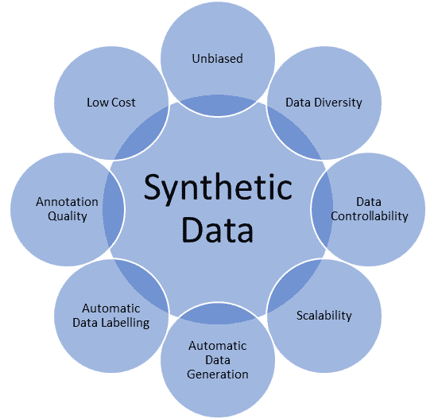
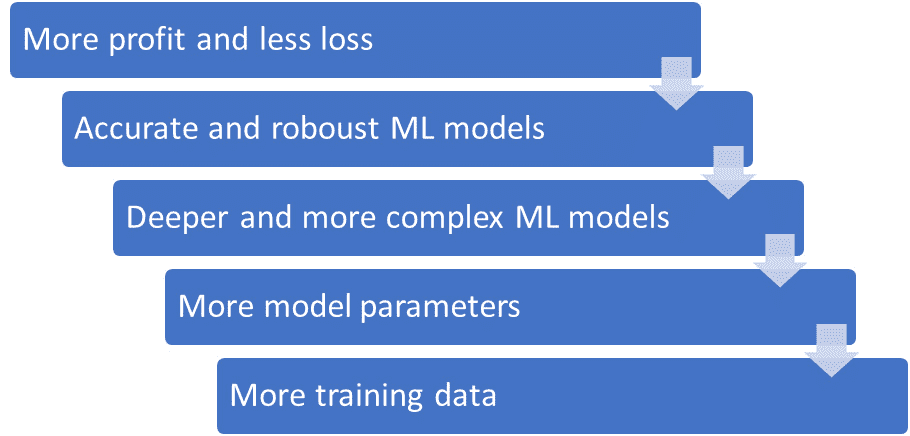
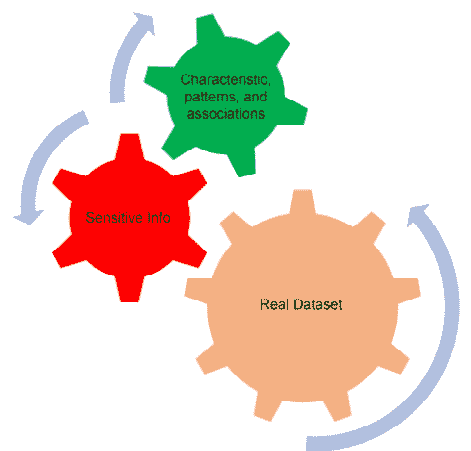

# 5

# 合成数据作为解决方案

本章重点介绍了合成数据的主要优势。您将了解为什么合成数据是解决隐私问题的有希望解决方案。同时，您将了解如何配置合成数据生成方法以覆盖在现实世界中难以捕捉且成本高昂的罕见场景。

在本章中，我们将讨论以下主要主题：

+   合成数据生成方法

+   合成数据的主要优势

+   合成数据作为解决隐私问题的革命性解决方案

+   合成数据作为解决成本和时间效率问题的革命性解决方案

+   合成数据作为解决罕见数据的革命性解决方案

# 合成数据的主要优势

如我们所见，由于具有巨大的优势，合成数据具有广泛的应用范围。让我们突出一些这些优势：

+   无偏见

+   多样性

+   数据可控性

+   可扩展性

+   自动数据生成

+   自动数据标注

+   标注质量

+   低成本

*图 5**.1* 突出了以下一些关键优势：

图 5.1 – 合成数据的主要优势

接下来，我们将深入探讨这些优势中的每一个。我们将看到真实数据的局限性以及合成数据是如何成为解决方案的。

## 无偏见

真实数据由人工标注者整理和标注。在实践中，人们有意或无意地根据某些属性（如种族、肤色、性别、年龄或政治观点）忽视或过度强调某些群体，这会导致数据集存在偏见，从而对训练和测试机器学习模型产生负面影响。因为偏见的训练数据会给出对研究现象或现实世界中发生的过程的扭曲表示。因此，机器学习模型在决策上也会存在偏见。这种偏见可能导致种族、性别或年龄歧视，给公司的声誉、客户和收入带来巨大的不良后果。

让我们以自然语言处理（NLP）中的一个例子来讨论。在标题为《仇恨言论检测中种族偏见的风险》的论文中（[`aclanthology.org/P19-1163.pdf`](https://aclanthology.org/P19-1163.pdf)），研究人员证明了非洲裔美国人的推文被自动仇恨言论检测机器学习模型标记为冒犯的可能性是其他人的两倍。他们将原因归咎于标注者的偏见。

另一个例子来自计算机视觉领域，涉及面部识别机器学习算法中的种族歧视。微软、IBM 和亚马逊开发的面部识别机器学习模型在预测某些性别和肤色方面表现出较低的准确性。这些机器学习模型被特别指出在预测较深色女性面部方面准确性较低。世界上一些最大的科技公司，如微软和 IBM，提出了立即行动，以改善他们的数据收集过程，以减轻他们机器学习模型中的偏差问题。请参阅*面部识别技术中的种族歧视*（[`sitn.hms.harvard.edu/flash/2020/racial-discrimination-in-face-recognition-technology`](https://sitn.hms.harvard.edu/flash/2020/racial-discrimination-in-face-recognition-technology)）以获取详细讨论和更多信息。

如您所预期的那样，合成数据可以自动生成和标注。因此，在数据生成和标注过程中，可以消除或最小化人为因素带来的错误。因此，预计合成数据中的人为错误较少。同时，可以生成数据，使其在人口中均匀分布。因此，可以生成无偏见的训练和测试数据，以支持各种应用和场景。此外，在数据集存在偏差问题时，合成数据生成方法可以轻松重新配置以解决这些问题，这比真实数据快得多。

## 多样性

生成合成数据的过程可以定制，以覆盖罕见的情况和场景，这些情况不常见、难以捕捉或标注成本过高。尽管可能精心整理和标注多样化的真实数据集，但这极为困难，需要更多的努力、时间和预算。例如，在恶劣天气条件下捕捉真实数据比正常天气条件下更困难。同时，在自然灾害和灾难期间，如地震、野火、飓风、龙卷风和火山爆发，捕捉数据极为困难。这限制了类似场景下机器学习模型的可用性。因此，基于机器学习模型的**生命攸关系统**或**安全攸关系统**（**SCSs**）在这些场景下可能会失败或出现故障。这种故障可能导致死亡、受伤、设备损坏和对环境的危害。此外，还有一些事件虽然发生频率较高，但难以捕捉，例如盗窃、儿童性剥削、家庭暴力、诈骗和欺诈、街头骚扰和恐怖主义。

可以设计或配置统计模型或模拟器等合成数据生成技术，以涵盖所有这些场景。因此，它使机器学习模型对类似场景具有更强的鲁棒性，从而拯救生命和财产，并保护社会。此外，它为研究人员专注于罕见条件、事件和场景打开了大门。因此，可以生成多样化的平衡合成数据集，以推进各个领域的科学研究。同时，合成数据可以增强现有的真实数据集，使它们更加多样化和均衡。

## 可控性

自然及其错综复杂的进程和现象产生了真实数据。例如，你可以收集人脸图像来训练人脸识别算法，但你无法控制数据生成过程本身。你可能选择考虑或忽略某些属性，但你无法扰动人类在现实世界中可能呈现的面貌！你可以使用过滤器或任何你想要的图像处理技术，但仍然，你只是在改变你对这些图像的感知。换句话说，当你戴上太阳镜时，你并没有使世界变得不饱和：你只是感知到世界变得更暗，颜色饱和度降低。这些是完全不同的两个概念！

合成数据允许你按照自己的意愿改变世界本身。例如，你可以创造一个所有人穿着相同衣服、以相同方式行走并持有相同物品的城市！你可能在这里提出一个好问题：*为什么机器学习研究人员或从业者一开始就想要做这件事？*

能够控制合成数据生成过程在机器学习领域极为重要。它使你能够在极为罕见的情况下训练和测试你的模型，分析算法的鲁棒性和准确性，并反复检验假设、机器学习模型的设计和训练数据。合成数据赋予你控制环境参数、元素及其相互作用的权力。因此，无需生成无关或冗余的数据，这些数据对你的机器学习模型并无帮助。因此，使用合成数据，你可以管理、控制和引导数据生成和标注过程，以实现你的目标。

## 可扩展性

机器学习模型对于众多行业至关重要，包括汽车、医疗保健、金融和娱乐行业。对更精确和鲁棒的机器学习模型的需求促使研究人员提出更深层次和更复杂的机器学习模型。这些深度模型通常由更多层和更多的神经元组成。这意味着在训练过程中需要调整大量的参数。因此，随着这些行业的演变，机器学习模型需要更多的训练数据（见图 5.2）：

图 5.2 – 为了提高盈利能力，公司需要精确且复杂的机器学习模型，这需要大量的训练数据

不幸的是，收集、清理和标注真实数据的过程非常缓慢且昂贵。公司需要迅速应对市场变化；否则，他们可能会失去客户、声誉和机会。

合成数据具有完美的可扩展性：一旦配置了数据生成和标注流程，就很容易在必要时根据新条件生成大规模数据集。例如，你可以使用**生成对抗网络**（**GANs**）、**变分自编码器**（**VAEs**）或**CARLA**等模拟器生成无限数量的训练图像（[`carla.org/`](https://carla.org/)）。

## 自动数据标注

合成数据的主要优势之一是自动数据标注。由于数据生成过程是可控的，因此可以使用合成数据进行自动标注。例如，如果你使用像**虚幻**或**Unity**这样的游戏引擎来生成和标注合成数据，就可以标记对象，从而确切地知道在给定帧中摄像头看到了哪些对象。

这就是合成数据的优势！它为你节省了大量时间、精力和金钱，这些原本需要你花费在标注真实数据上。此外，你可以在不担心标注者泄露敏感信息的情况下标注私人或机密数据。

## 标注质量

合成数据是自动标注的，与真实数据不同。人为因素错误被最小化和限制。因此，可以标注高质量和大规模的合成数据集。例如，合成数据算法可以提供到像素级别的精确真实值，这对于由于人类标注者的限制而无法使用真实数据实现语义分割来说是不可能的。在处理真实数据时，质量和数量之间往往存在权衡。使用合成数据，你可以用更少的时间和更低的预算实现这两个目标。

## 低成本

正如我们提到的，合成数据不需要你从现实世界中捕获数据，也不需要标注者进行标注。可以使用适当的算法生成和自动标注合成数据。因此，在开发生成和标注流程后，可以生成无限数量的训练示例。例如，生成包含一千张图像的训练数据集和生成包含一百万张图像的训练数据集，所需的成本几乎相同！

在下一节中，我们将探讨合成数据的一个特定优势——即使用它来解决敏感数据和应用中的隐私问题。

# 使用合成数据解决隐私问题

在某些领域，如医疗保健和金融，数据量很大，但主要障碍是标注和共享数据。即使我们有一个“完美”标注的大规模真实数据集，有时我们也不能与机器学习从业者分享它，因为它包含可能被第三方用于识别个人或揭示关于企业和组织的关键信息的敏感信息。

如我们所知，机器学习模型没有数据就无法工作，那么解决方案是什么？一个简单的解决方案是使用*真实*数据生成*合成*数据，我们可以与他人分享而不会出现任何隐私问题，同时仍然代表真实数据。我们可以利用一些合成数据生成方法，利用真实数据集生成一个合成数据集，该数据集仍然代表真实数据中变量之间的关系、隐藏模式和关联，同时不泄露敏感信息：

图 5.3 – 一些合成数据集生成方法将敏感信息从数据模式中分离出来

在这个范围内，我们可以理解合成数据生成方法将敏感信息从变量之间的关联和关系中分离出来（参见*图 5.3*）。因此，机器学习模型仍然可以在合成数据上训练，并学习原始真实数据中的隐藏模式，而无需直接在它上面进行训练。

合成数据不包含关于真实个人的信息，因此不会造成伤害。例如，假设你有一个合成的人脸数据集。你可以随意使用这些数据。此外，你也不会受到使用真实人脸时那样的法规限制。这将使你能够探索新的创意想法。然而，如果你打算使用来自真实人类的敏感信息，你将仅限于你收集数据时所用的主要目的。因此，在没有参与者的许可下，你不能调查新的想法。此外，数据不应保留超过必要的期限。所有这些规定都限制了敏感真实数据集的可使用性，这使得合成数据成为一个完美的替代品。有关更多信息，请查阅*《2018 年数据保护法案》*，这是英国对**通用数据保护条例**（**GDPR**）的实施([`www.gov.uk/data-protection`](https://www.gov.uk/data-protection))。

在下一节中，我们将讨论为什么合成数据是解决数据生成和标注中的成本和时间效率问题的解决方案。

# 使用合成数据解决时间和效率问题

合成数据的自动数据生成消除了真实数据整理和标注流程中的许多不必要的元素。收集真实数据通常需要特殊设备，如高分辨率相机、麦克风或激光雷达。同时，你需要受过使用此类设备培训的工程师和技术人员。你会在培训工程师和购买或租赁此类设备上浪费时间和金钱。通常，数据整理员需要出差并访问各种地点以收集合适的数据，这意味着你将不得不支付交通、住宿、保险等费用。

合成数据是解决这些问题的有效方法（见图*5*.4）。除了前面提到的问题之外，我们还可以得出结论，合成数据比真实数据具有更低的碳足迹。因此，它对环境来说甚至更好！

数据标注是导致真实数据集繁琐的主要问题之一。标注大规模数据集是一个极其昂贵且耗时的过程。标注大规模数据集可能需要数周、数月甚至数年。完成标注过程所需的大量时间可能会使公司落后于竞争对手，导致它们失去市场份额和客户。

如果你正在处理真实敏感数据，情况会更糟。根据法律，在存储、处理、标注或转移此类数据时必须格外小心。这意味着需要更多的预算、努力和时间。然而，使用合成数据可以消除所有这些额外的工作，并减轻你的工作负担：

|  | 真实数据 | 合成数据 |
| --- | --- | --- |
| 记录/捕获设备 | ↑ | ↓ |
| 交通/住宿 | ↑ | ↓ |
| 训练 | ↑ | ↓ |
| 保险 | ↑ | ↓ |
| 时间 | ↑ | ↓ |
| 规范 | ↑ | ↓ |
| ↑ 你需要更多和 ↓ 你需要更少 |

图 5.4 – 合成数据与真实数据的比较

在下一节中，我们将了解为什么与真实数据相比，合成数据可以覆盖罕见和特殊场景。

# 合成数据作为罕见数据的革命性解决方案

在现实世界中，由于事件或现象的罕见发生，会出现罕见数据。换句话说，这些事件发生，但频率较低。我们可以将这些事件大致分为以下类别：

+   **自然灾害**：这个类别包括洪水、小行星撞击、地震和海啸等事件

+   **人为因素**：这个类别包括工业事故、金融危机和暴力冲突等事件

这些事件在环境上造成了许多重大变化，可能导致最先进的机器学习模型失效。例如，在建筑物疏散的情况下，人脸识别系统可能无法正常工作，因为随着建筑物变得更加拥挤，移动模式可能会改变。虽然这些事件很少发生，但它们对社会的影响是巨大的。不适当的机器学习模型可能会大大增加死亡和受伤的人数。

为了使机器学习模型既稳健又准确，这些模型需要在标准和罕见条件下进行训练和测试。捕捉罕见事件的真实数据极其困难且昂贵。大多数机器学习模型假设它们将在标准条件下和场景下工作。不幸的是，这些机器学习模型通常在偏离标准场景的任何场景下都会失败或挣扎。例如，在*《在恶劣条件下进行语义分割：基于天气和夜间感知合成数据的方法》* ([`bmvc2022.mpi-inf.mpg.de/0977.pdf`](https://bmvc2022.mpi-inf.mpg.de/0977.pdf))一文中，研究人员证明了最先进的语义分割方法在标准条件下，如正常天气条件和充足照明下表现良好。然而，这些方法在恶劣条件下，如雾天、雨天和雪天或夜间，会挣扎或失败。

忽略罕见场景的关键原因是，在这些情况下收集训练数据可能需要很长时间，需要大量的训练和努力来捕捉这些罕见事件，并且可能是一个危险的过程。最后，我们应该注意，罕见数据不仅对训练目的有用——它对于理解机器学习模型在实际中的局限性是至关重要的。

如前所述，现实世界中的真实数据是不平衡的。因此，我们从现实世界中收集的数据将反映这种不平衡。不幸的是，机器学习模型对不平衡数据集很敏感。因此，不平衡的训练数据集会导致机器学习模型对问题的理解出现偏差。例如，如果我们在一个包含 30 只猫和 70 只狗的数据集上训练一个猫狗分类器，该模型将倾向于预测狗的次数是预测猫的两倍。因此，平衡的训练数据集可以使模型训练得更好，收敛得更快。

标准条件、事件和属性在现实世界中比罕见事件更有可能出现。因此，你更有可能拥有一个专注于正常条件而忽视罕见条件的特定数据集。

如你所预期，合成数据可以用来模拟这些罕见事件。因此，使用合成数据生成一个完美平衡的大规模数据集是容易实现的。合成数据生成方法可以用来从头开始生成完整的训练数据集。同时，合成数据可以被用来补充真实数据集。因此，你可以使你的机器学习模型对罕见事件和条件更加稳健。

# 合成数据生成方法

生成合成数据有不同的方法：其中一些基于统计模型，而另一些则依赖于游戏引擎和模拟器。**统计模型**是非确定性的数学模型，包括表示为概率分布的变量。根据问题，这些模型通常使用真实数据进行训练，以理解数据中的隐藏模式和相关性。然后，训练好的机器学习模型可以自动生成新的样本，如图像、文本、表格等。这些新样本可以被其他机器学习模型用于训练或测试目的。

使用**游戏引擎和模拟器**也可以生成合成数据。这些工具被用来创建 3D 虚拟世界。这些 3D 世界可以通过**程序内容生成**（**PCG**）技术来生成，以控制场景属性、场景元素之间的交互以及生成数据的多样性和质量。

需要注意的是，大多数合成数据生成方法的主要挑战是构建数据生成和标注流程，这需要仔细的设计和工程。然而，一旦流程准备就绪，通常使用起来很简单，并且可以用于极其广泛的应用。

# 摘要

在本章中，我们学习了使用合成数据的主要优势。我们讨论了合成数据易于生成、管理和标注。当涉及到我们与敏感真实数据相关的隐私问题时，利用合成数据是一个理想的解决方案。

在下一章中，我们将学习如何利用模拟器和渲染引擎生成合成数据。

# 第三部分：合成数据生成方法

在本部分，你将了解主要的合成数据生成方法。你将学习如何利用模拟器和渲染引擎、**生成对抗网络**（**GANs**）、视频游戏和扩散模型来生成合成数据。你将探索这些方法在机器学习中的潜力。此外，你将了解每种方法的挑战以及优缺点。本部分将提供实际操作示例，以学习如何在实践中生成和利用合成数据。

本部分包含以下章节：

+   *第六章*，*利用模拟器和渲染引擎生成合成数据*

+   *第七章*，*探索生成对抗网络*

+   *第八章*，*视频游戏作为合成数据的来源*

+   *第九章*，*探索用于合成数据的扩散模型*
