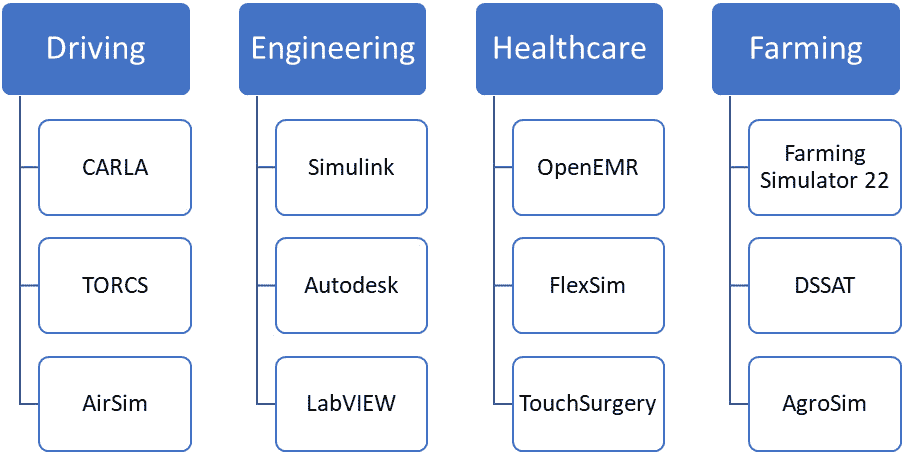
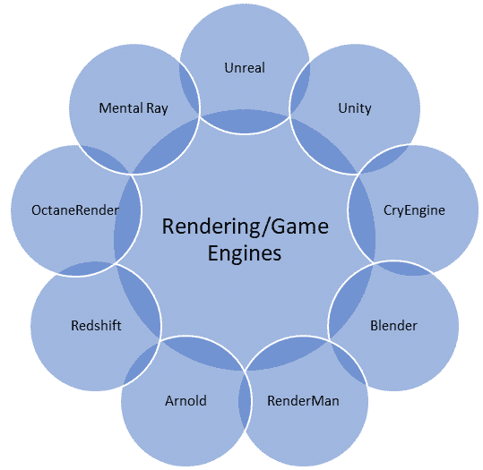
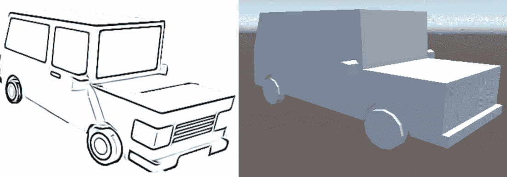
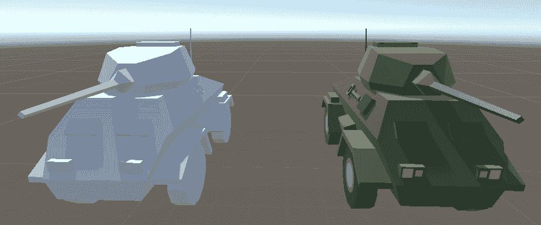
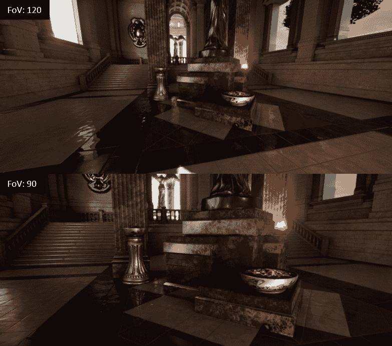

# 6

# 利用模拟器和渲染引擎生成合成数据

在本章中，我们将介绍使用模拟器和渲染引擎生成合成数据的一种知名方法。我们将探讨创建模拟器和自动生成标注合成数据的主要流程。随后，我们将重点介绍挑战，并简要讨论两个用于生成合成数据的模拟器。

在本章中，我们将涵盖以下主要主题：

+   模拟器和渲染引擎：定义、历史和演变

+   如何生成合成数据

+   挑战和限制

+   案例研究

# 模拟器和渲染引擎简介

在本节中，我们将深入探讨模拟器和渲染引擎的世界。我们将探讨这些用于生成合成数据的有力工具的历史和演变。

## 模拟器

**模拟器**是一种软件或程序，旨在模仿或模拟现实世界的某些过程或现象。模拟器通常创建一个虚拟世界，科学家、工程师和其他用户可以在其中测试他们的算法、产品和假设。同时，你可以使用这个虚拟环境来帮助你了解和实践复杂任务。这些任务通常在现实世界中执行是危险且代价高昂的。例如，驾驶模拟器教导学习者如何驾驶，以及如何应对诸如儿童突然横穿街道等意外情况，这在现实世界中是极其危险的。

模拟器被用于各种领域，如航空、医疗保健、工程、驾驶、太空、农业和游戏。在*图 6.1*中，你可以找到这些模拟器的示例。

图 6.1 – 驱动、工程、医疗保健和农业中使用的模拟器示例

接下来，我们将介绍渲染和游戏引擎。

## 渲染和游戏引擎

渲染和游戏引擎是主要用于生成图像或视频的软件。它们由各种子系统组成，负责模拟，例如物理、光照和声音。它们通常用于游戏、动画、虚拟现实、增强现实和元宇宙等领域。与模拟器不同，游戏引擎可以用来创建可能或可能不是旨在模仿现实世界的虚拟世界。游戏引擎主要用于开发游戏。然而，它们可以用于训练和模拟、电影和电视以及可视化。在*图 6.2*中，你可以看到一些现代渲染和游戏引擎的示例。

图 6.2 – 现代渲染和游戏引擎的示例

接下来，我们将更深入地了解渲染和游戏引擎的历史。

## 模拟器和游戏引擎的历史和演变

游戏引擎的大致出现始于 20 世纪 70 年代。那个时代的计算机在处理能力和内存方面有限。当时，大多数游戏都是二维游戏，如 *《乒乓》* 和 *《太空战争》*。它们局限于简单的图形、基本的照明、基本的着色和有限的视觉和声音效果。

硬件的大幅进步导致了更复杂的游戏引擎的出现。这些游戏引擎，如 *Unreal* ([`www.unrealengine.com`](https://www.unrealengine.com)) 和 *Unity* ([`unity.com`](https://unity.com))，促进了丰富、逼真的虚拟世界的创建。随着物理模拟变得更加复杂和先进，逼真图形的发展也同步进行。这使得可以模拟复杂的物理和场景元素之间的交互，例如流体动力学和布料模拟。在最近几年，许多逼真、复杂的游戏被发布，如 *《使命召唤》* ([`www.callofduty.com`](https://www.callofduty.com)) 和 *《侠盗猎车手》* ([`www.rockstargames.com/games/vicecity`](https://www.rockstargames.com/games/vicecity))。

复杂且易于使用的游戏引擎，如 Unity 的可用性，使游戏开发民主化，并使其比以往任何时候都更容易接触。因此，游戏开发不仅限于大型科技公司，也向独立公司和艺术家开放。

同时，最近手机数量的巨大突然增加使得移动游戏成为研究和工业更具吸引力的目的地。

最近，合成数据研究人员开始尝试使用游戏引擎和视频游戏来生成丰富的合成数据。这一领域的两个先驱作品是*《玩数据：计算机游戏中的真实数据》* ([`arxiv.org/abs/1608.02192`](https://arxiv.org/abs/1608.02192)) 和 *《域随机化：将深度神经网络从仿真转移到现实世界》* ([`arxiv.org/pdf/1703.06907.pdf`](https://arxiv.org/pdf/1703.06907.pdf))。

在下一节中，我们将探讨如何使用模拟器和游戏引擎生成合成数据的确切方法。

# 生成合成数据

在本节中，我们将学习如何使用现代游戏引擎，如 Unity 和 Unreal，生成合成数据。

为了生成与其对应真实数据的合成数据，建议我们遵循以下步骤：

1.  确定要生成的任务和真实数据。

1.  在游戏引擎中创建 3D 虚拟世界。

1.  设置虚拟摄像机。

1.  添加噪声和异常。

1.  设置标签流程。

1.  使用真实数据生成训练数据。

在本节中，我们将详细讨论这一过程的各个方面。

## 确定要生成的任务和真实数据。

合成数据生成过程的第一步是定义任务、数据的类型以及要生成的真实情况。例如，数据可以是图像、视频或音频。同时，你需要确定为你的问题生成哪些真实情况。例如，你可以生成语义分割、实例分割、深度图、法线图、人体姿态以及人体部位语义分割，仅举几例。

接下来，我们需要了解如何创建 3D 虚拟世界，这将在下一节中探讨。

## 在游戏引擎中创建 3D 虚拟世界

首先，我们必须定义环境、其元素以及这些元素之间的相互作用。你可能需要决定你需要的虚拟场景的 photorealism 级别、视觉复杂度程度以及变化和多样性的范围，从而确定合成数据。一般来说，对于一个典型的生成合成数据计划，我们可以遵循以下步骤：

1.  准备和概念化

1.  建模

1.  实体化和纹理化

1.  集成到游戏引擎中

1.  精炼和测试

接下来，我们将深入探讨这些方面的每一个，并提供更深入的见解。

### 准备和概念化

在创建 3D 虚拟世界之前，我们需要检查我们对要创建的虚拟世界的想法。建议绘制简单的草图和草图来可视化世界的元素以及它们将如何相互作用。你可能需要记下以下内容：要模拟的天气条件、室内或室外环境、一天中的时间以及场景的拥挤程度，仅举几例。此外，你需要决定使用哪个游戏引擎，例如**Unity**、**Unreal**或**CryEngine**。你还需要决定使用哪个渲染管线，这取决于游戏引擎本身。例如，Unity 游戏引擎有不同的渲染管线，如**内置渲染管线（BRP）**、**高清渲染管线（HDRP）**、**通用渲染管线（URP）**和**可脚本渲染管线（SRP）**。渲染管线的选择也取决于你想要达到的 photorealism 程度。此外，一些游戏引擎可能支持各种编程语言，例如支持 C++和 C#的 CryEngine。因此，你可能需要决定使用哪种语言。

在此之后，我们需要确定要使用的资产，例如对象、材料、视觉效果和声音效果。同时，你可能需要考虑预算、时间框架以及你团队的技能。

### 建模

在对 3D 虚拟世界有一个明确的概念之后，下一步是开始建模阶段。**3D 建模**是使用适当的建模软件创建 3D 对象的过程。3D 建模在游戏和娱乐行业、工程领域和建筑领域得到广泛应用。为了构建 3D 虚拟世界，我们需要创建其元素，如建筑、树木、行人和车辆。因此，我们需要决定是导入还是建模这些元素。我们可以使用如*Blender* ([`www.blender.org`](https://www.blender.org))、*ZBrush* ([`pixologic.com`](https://pixologic.com))和*3ds Max* ([`www.autodesk.co.uk/products/3ds-max`](https://www.autodesk.co.uk/products/3ds-max))等软件进行 3D 建模。正如你所预期的那样，一个简单的解决方案是从如*Adobe 3D Substance* ([`substance3d.adobe.com`](https://substance3d.adobe.com))和*Turbosquid* ([`www.turbosquid.com`](https://www.turbosquid.com))等网站导入这些元素。然而，高质量的 3D 模型通常价格昂贵。此外，需要注意的是，建模复杂的 3D 对象可能是一个具有挑战性且耗时的过程，需要技术技能、努力和时间，但这取决于要建模的对象和技术约束，如多边形数量。

图 6.3 – 从汽车草图（左）创建的 3D 汽车模型示例（右）

*图 6.3* 展示了建模阶段后的输出示例，在这个例子中是一个汽车。

### 材质化与纹理化

在创建 3D 模型或网格后，我们需要添加该对象的物理属性，如颜色、透明度和反射性。这些属性模拟了物体和表面的物质。另一方面，纹理化用于模拟表面细节，如划痕和图案，并使物体呈现出类似真实世界物体的非均匀外观。在大多数游戏引擎中，这些信息使用纹理图进行编码。*图 6.4* 展示了经过材质化和纹理化过程的 3D 对象。

图 6.4 – 材质化与纹理化前后（左）和（右）的 3D 对象

### 集成到游戏引擎中

当 3D 虚拟世界的元素准备就绪后，我们需要将它们添加到场景中。我们还需要配置和设置照明和虚拟相机：

+   **照明**：这是创建逼真场景的一个关键步骤。在虚拟世界中添加灯光以赋予深度和氛围感。通常有两种照明选项：**预渲染照明**使用光照贴图和**实时照明**。照明是基础但计算成本高昂。因此，你应该注意这一步以达到你的目标逼真度和帧率。

+   **虚拟相机**：一旦生成虚拟世界，就使用虚拟相机来捕获所需的合成数据。相机的行为通常使用脚本进行控制。相机的参数和行为可以配置以匹配现实世界场景并实现预期的行为。相机参数包括**视场角（FoV）**、**景深（DoF）**、**传感器尺寸**和**镜头位移**。

### 精炼和测试

最后一步是检查生成的合成数据，并对虚拟世界设计进行迭代。在这个阶段，你可以修复错误并优化性能。正如预期的那样，创建 3D 虚拟世界不是一个简单的过程。它需要努力、时间和技术技能。然而，一旦虚拟世界创建完成，它可以被利用来生成用于大量应用的大规模合成数据集。

## 设置虚拟相机

在虚拟世界中，相机在合成数据生成过程中起着至关重要的作用。它代表观察者，通常用于捕获图像、音频和视频。捕获的数据可能用于训练和测试机器学习模型。

正如我们之前提到的，相机属性和属性可以被自定义和配置以达到目标行为。例如，相机的视场角（FoV）控制你的观察者代理可以感知的世界部分，因此，你可以在一个生成的图像中捕获多少视觉信息。*图 6.5*显示了使用不同视场角值生成的两个图像。

图 6.5 – 使用虚幻游戏引擎中的两种不同视场角（FoV）捕获的场景

请注意，相机位置是固定的，我们只改变了视场角。此外，我们可以控制相机的运动和过渡以达到所需的行为。

相机可以在 3D 虚拟世界中采取不同的设置来模仿现实世界中的相关设置。以下是一些相机设置的示例：

+   **固定摄像机**: 在捕捉场景时，摄像机不会改变其位置或方向。这种摄像机设置可以用来从特定的视角记录场景。这是最简单的设置；它易于实现，且不需要脚本。然而，你需要注意摄像机的位置和属性。否则，动态物体可能会意外地阻挡摄像机的视线。在模拟器和游戏引擎中，可以使用固定摄像机，例如，来模拟交通监控摄像机或体育直播中使用的固定摄像机。

+   **PTZ 摄像机**: 这是一种特殊的摄像机设置，其中摄像机可以平移、倾斜和缩放。在现实世界中，这种类型通常由操作员控制，以捕捉感兴趣的物体或特定事件。因此，摄像机可以改变其方向和视野来实现这一点。在虚拟世界中，摄像机可以通过编程来实现这一点，或者可以在模拟或合成数据生成过程中由人工操作员控制。这种设置为您提供了更多的自由度来捕捉场景。然而，可能需要脚本来实现预期的摄像机行为。

+   **第一人称摄像机**: 第一人称视角是计算机视觉的一个基本领域。这种摄像机设置通过佩戴摄像机来模拟代理观察世界。它在游戏和虚拟现实、执法、医学和教育等领域有巨大的应用。例如，在第一人称数据上训练的机器学习模型可以用来协助外科医生并提高培训、决策、表现和准确性。有关详细讨论，请参阅*人工智能辅助手术指导：使用语义分割在腹腔镜胆囊切除术中识别手术解剖* ([`pubmed.ncbi.nlm.nih.gov/33196488`](https://pubmed.ncbi.nlm.nih.gov/33196488))。

+   **空中或无人机摄像机**: 这种摄像机设置对于飞行和无人机模拟器至关重要。它模拟了安装在无人机或无人机上的摄像机。通常，它用于模拟场景的鸟瞰视图。它具有广泛的应用范围，可以用来增强需要使用无人机捕获的训练图像的机器学习模型的表现。它支持各种计算机视觉任务，如目标检测、分类、跟踪和识别。

+   **立体摄像机**: 立体摄像机是一种特殊的摄像机，具有两个相距较近的镜头，可以利用它们来模拟人类感知深度的方式。两个镜头之间的距离称为**眼间距**，通常与人类眼睛之间的距离相似：大约 6.35 厘米。这个距离对于在视觉系统中创造深度感至关重要。这种类型的摄像机对于 VR 和沉浸式 3D 体验非常重要。

+   **跟踪相机**：这种类型用于跟踪感兴趣的对象。在虚拟世界中，这种相机可以被编程来跟随所需的对象，这有助于创建专注于目标对象的大规模合成数据。例如，在虚拟世界中跟踪人类进行动作识别任务是可能的。这将帮助你生成专注于你的主题（人类）的大规模训练数据。你也可以使用其他相机设置，但最终你会得到很多没有动作或你的感兴趣对象不明显的视频。此外，你也可以使用这种相机设置进行视觉目标跟踪和其他类似任务。

下一步是添加噪声。

## 添加噪声和异常

现实世界并不完美，存在异常。在图像生成的背景下，噪声和异常指的是对主要模式、过程和现象的偏离。例如，当我们观察夜晚的街灯柱时，其中一小部分可能被意外关闭，灯光可能闪烁，柱子可能略微旋转，涂上不同的颜色，或者有不同的尺寸。向虚拟世界元素的属性和行为中添加噪声和异常可以提高现实感并提高生成合成数据的使用性。关于行为异常的另一个例子可以在观察行人过马路时看到。大多数人会等待绿灯或行人信号，两边看，然后在斑马线上过马路。另一方面，一小部分人可能会在红灯亮时过马路，或者可能没有注意到来车而过马路。这种行为异常，例如，应该在虚拟世界中模拟，以确保生成的训练数据多样化。因此，在这个数据上训练 ML 模型将确保一个鲁棒的 ML 模型。

## 设置标注流程

标注流程取决于你的问题和计划如何利用合成数据。你可能只想生成训练数据，因为现实世界中这太昂贵了，你可能更愿意请人类标注员标注你的数据。另一方面，你可能希望在模拟器或渲染引擎中自动化标注过程。例如，CARLA、NOVA 和 Silver 等模拟器支持为各种计算机视觉任务生成带有相应真实值的数据。

## 使用真实值生成训练数据

到目前为止，合成数据生成管道应该已经准备好了。之前的步骤可能具有挑战性、成本高昂且耗时。然而，它们仅用于设置系统。在此之后，您可以利用该系统生成特定任务、自动标注的大规模数据集。更改标注协议简单且与真实世界数据集相比成本不高。请注意，我们没有提供使用游戏引擎或模拟器生成合成数据的手动示例，因为本书的重点不在于合成数据生成方法的实现和编码。然而，它致力于该过程的理论、概念和设计方面。有关实现和编码方面的更多详细信息，请参阅 Unity 计算机视觉([`unity.com/products/computer-vision`](https://unity.com/products/computer-vision))和合成计算机视觉([`github.com/unrealcv/synthetic-computer-vision`](https://github.com/unrealcv/synthetic-computer-vision))。

在下一节中，您将了解部署此合成数据生成方法的主要限制。

# **挑战与限制**

在本节中，我们将强调使用此方法进行合成数据生成的主要挑战。我们将探讨现实主义、多样性和复杂性问题，这些问题在使用此方法进行合成数据生成时带来一些困难。

## **现实主义**

合成数据与真实数据之间的**领域差距**是限制合成数据可用性的主要问题之一。为了使合成数据有用，它应该模仿其真实对应物的分布和统计特性。因此，对于计算机视觉问题，我们需要确保高度的真实感，否则，在合成数据上训练的机器学习模型可能无法很好地推广到真实数据。

使用游戏引擎和模拟器实现高度的真实感并非易事。即便借助当代游戏引擎如 CryEngine、Unreal 和 Unity，我们仍需付出努力、技巧和时间来创建真实感场景。

接近现实主义并因此减轻由游戏引擎和模拟器生成的合成数据的领域差距问题的三个基本要素如下。

### **真实感**

对于计算机视觉问题，生成真实感图像对于训练和测试机器学习模型至关重要。构建真实感场景需要以下条件：

+   **高质量资产**：3D 模型、纹理和材料应该详细且逼真。

+   **光照**：对于渲染真实感场景至关重要。您可能需要使用基于物理的渲染和基于物理的材料。此外，您还需要使用合适的光源并仔细配置它们的参数。

+   **后处理**：如虚幻和 Unity 等游戏引擎支持后处理效果以提高逼真度。例如，您可以使用这些技术来模拟运动模糊、昏暗和景深。

### 现实行为

为了实现这一点，我们需要确保相机行为的逼真性。例如，相机不应穿透墙壁，其参数应接近现实世界相机的参数。此外，角色动画应该是逼真的，并模仿人体运动。此外，场景元素之间的交互应遵循物理规则，例如，当物体相撞时。

### 现实分布

在现实世界中，物体和属性并非随机分布。因此，在构建虚拟世界时，我们需要注意匹配这些分布。例如，在购物中心附近行走的人可能携带物体的概率更高。同时，在特定的天气条件下，某些动作和物体可能会更频繁或更少。例如，在雨天，行人可能会携带雨伞。

## 多样性

我们周围的世界非常多样化，包含着多种多样的元素，这些元素具有不同的颜色、形状和行为，并具有不同的属性。获得一个多样化的虚拟世界需要时间和努力。合成数据的使用价值主要来自于其生成大规模数据集以训练机器学习模型的优点。如果数据不够多样化，这会导致机器学习模型过度拟合有限的场景和属性。

## 复杂性

非线性、相互依赖、不确定性和现实世界的动态特性使得创建一个逼真的虚拟世界相当复杂。创建和模拟一个逼真的环境需要近似、简化和概括。这是由于现实性和计算复杂度之间的权衡。要创建一个能够捕捉所有现实世界属性、现象和过程的逼真虚拟世界，即使使用最先进的软件和硬件，也是不可能的。然而，我们可以通过仔细理解机器学习问题来达到可接受的逼真程度：对于这个特定的应用，什么是必要的，什么是辅助的？例如，如果我们想为面部识别任务生成合成数据，我们可能需要比场景中的其他元素更注意模拟逼真的面部。

# 查看两个案例研究

在本节中，我们将简要讨论两个用于合成数据生成的知名模拟器，并评论使用这些方法的潜力。

## AirSim

AirSim 是一个由微软开发的跨平台模拟器，使用虚幻游戏引擎。它模拟无人机和汽车，为计算机视觉中的深度学习和强化学习方法的自动驾驶应用打开了大门。这个模拟器的关键特性包括以下几项：

+   各种天气效果和条件

+   激光雷达和红外传感器

+   可定制环境

+   真实物理、环境和传感器

如您所见，AirSim 可以利用来自各种传感器的数据生成丰富、大规模和高品质的合成数据。机器学习研究人员可以训练他们的模型融合不同的数据模态，以开发更鲁棒的自动驾驶算法。此外，AirSim 为深度估计、语义分割和表面法线估计任务提供自动标记的合成数据。有关此模拟器的更多信息，请参阅*AirSim*（[`www.microsoft.com/en-us/AI/autonomous-systems-project-airsim`](https://www.microsoft.com/en-us/AI/autonomous-systems-project-airsim)）。

## CARLA

CARLA 是一个开源的自动驾驶模拟器。它由**计算机视觉中心**（**CVC**）、英特尔和丰田开发，使用了虚幻游戏引擎。CARLA 是合成数据生成领域广为人知的模拟器。它拥有交通管理系统，用户可以配置多个传感器，包括深度传感器、激光雷达、多个摄像头和**全球定位系统**（**GPS**）。CARLA 为许多计算机视觉任务生成合成数据，如语义分割、深度估计、目标检测和视觉目标跟踪。除了生成自动标记的大规模合成数据外，CARLA 还可以部署以生成多样化的交通场景。然后，研究人员可以利用生成的合成数据在众多驾驶场景中训练更精确和鲁棒的机器学习模型。请查阅项目的*CARLA*网页（[`carla.org`](https://carla.org)）和*CARLA: An Open Urban Driving Simulator*论文（[`proceedings.mlr.press/v78/dosovitskiy17a/dosovitskiy17a.pdf`](http://proceedings.mlr.press/v78/dosovitskiy17a/dosovitskiy17a.pdf)）以获取更多详细信息。

还有许多其他模拟器，如 Silver、AI Habitat、SynthCity 和 IGibson。创建更真实的模拟器，支持更多任务，使模拟器更容易使用，以及使虚拟环境更可定制，是使用游戏引擎和模拟器开发未来合成数据生成器的主要研究方向。

# 摘要

在本章中，我们介绍了一种基于模拟器和渲染引擎的合成数据生成方法。我们学习了如何生成合成数据。我们强调了主要挑战，并讨论了 AirSim 和 CARLA 模拟器作为这种数据生成方法的例子。我们看到，通过使用模拟器和游戏引擎，我们可以为许多应用生成大规模、丰富且自动标注的合成数据。这降低了成本和努力，为训练鲁棒的机器学习模型提供了一个理想的解决方案。

在下一章中，我们将学习使用**生成对抗网络**（**GANs**）进行合成数据生成的新方法。
