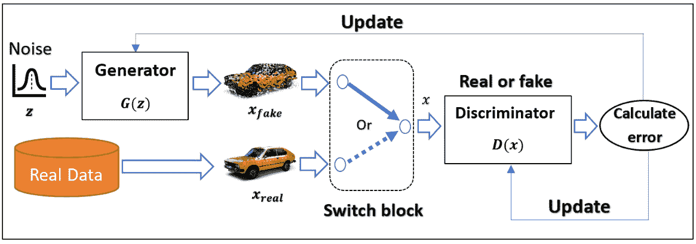
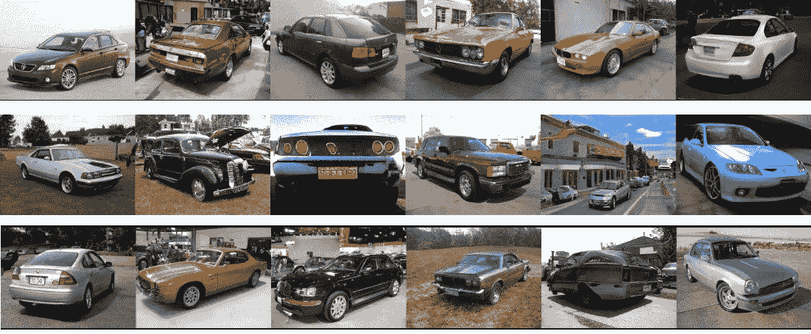
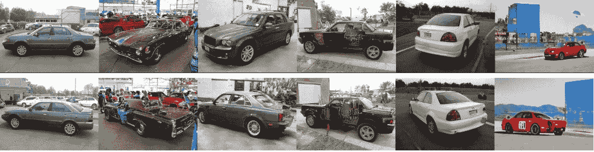
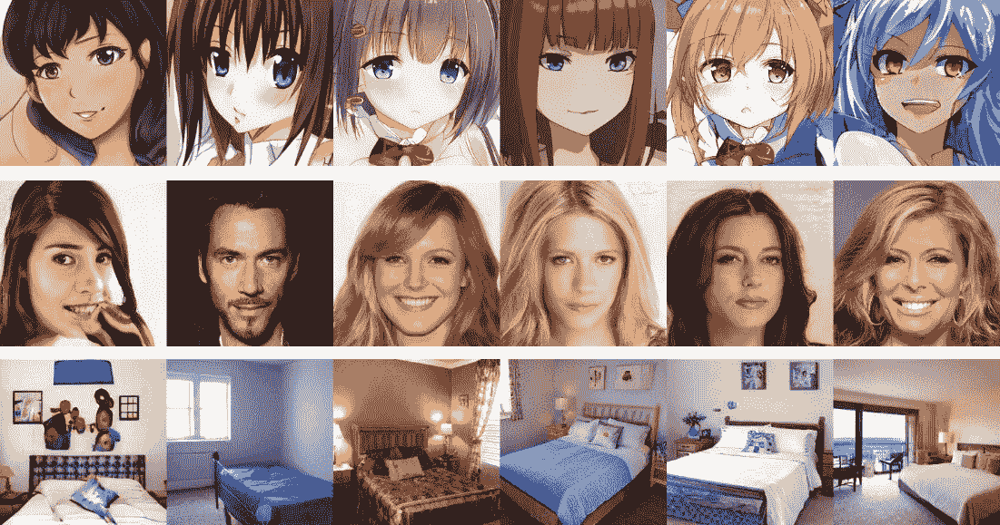

# 7

# 探索生成对抗网络

在本章中，我们将介绍 **生成对抗网络**（**GANs**）并讨论这种数据生成方法的演变。你将了解 GAN 的典型架构。之后，我们将解释其训练过程并讨论主要挑战。然后，我们将突出 GANs 的各种应用，包括图像生成和文本到图像的翻译。此外，我们还将研究一个实际编码示例，展示如何使用 GANs 生成逼真的图像。最后，我们还将讨论 GANs 的变体，例如条件 GANs、CycleGANs、CTGANs、WGANs、WGAN-GPs 和 f-GANs。

在本章中，我们将涵盖以下主要主题：

+   什么是 GAN？

+   训练 GAN

+   利用 GANs 生成合成数据

+   实践中的动手 GANs

+   GANs 的变体

# 技术要求

本章中使用的代码将在本书 GitHub 存储库的相应章节文件夹中提供：[`github.com/PacktPublishing/Synthetic-Data-for-Machine-Learning`](https://github.com/PacktPublishing/Synthetic-Data-for-Machine-Learning)。

# 什么是 GAN？

在本节中，我们将介绍 GANs 并简要讨论这种特定数据生成方法的演变和进展。然后，我们将解释典型 GAN 的标准架构以及它们是如何工作的。

GAN 的概念是在 2014 年的论文 *Generative Adversarial Networks* 中提出的（[`arxiv.org/abs/1406.2661`](https://arxiv.org/abs/1406.2661)），由 Ian J. Goodfellow 和他的研究团队完成。同年，**条件 GANs** 被引入，使我们能够生成更多可定制的合成数据。然后，在 2015 年，**深度卷积 GANs**（**DCGANs**）被提出，这促进了高分辨率图像的生成。之后，在 2017 年，**CycleGANs** 被提出用于无监督的图像到图像的翻译任务。这为领域自适应等巨大应用打开了大门。**StyleGAN** 在 2019 年被引入，将 GANs 带到了新的领域，如艺术和时尚。

GANs 在视频合成领域也显示出令人印象深刻的进展。实际上，NVIDIA 最近的工作证明了它们巨大的潜力（请参阅此论文以获取更多详细信息：*One-Shot Free-View Neural Talking-Head Synthesis for Video Conferencing*，链接：[`arxiv.org/pdf/2011.15126.pdf`](https://arxiv.org/pdf/2011.15126.pdf))。

这项工作表明，GANs 现在可以使用单个源图像重新创建一个说话头视频。对于代码、数据集和在线演示，请参阅项目的页面：[`nvlabs.github.io/face-vid2vid`](https://nvlabs.github.io/face-vid2vid)。接下来，我们将深入研究 GANs 的架构。

大多数**深度学习**（**DL**）方法和架构都是设计来预测某物的。这可能包括天气条件、股票价格、物体类别或其他。然而，GANs 被提出**生成**某物。这可能包括图像、视频、文本、音乐或点云。

这种能力的核心是学习如何从给定的域或数据集中生成训练样本的基本问题。GANs 是深度学习方法，可以学习复杂的数据分布，并可以用来生成属于特定分布的无限数量的样本。这些生成的合成样本在数据增强、风格迁移和数据隐私等方面有许多应用。



图 7.1 – GAN 的典型架构和训练过程

接下来，我们将学习如何训练 GANs。

# 训练一个生成对抗网络（GAN）

在本节中，我们将学习如何训练一个典型的 GAN。然后，我们将讨论主要挑战和困难。

生成对抗网络（GAN）是通过**无监督学习**技术进行训练的，其中两个子模型通过称为**对抗训练**的过程同时训练。一个典型的 GAN 由两个神经网络（通常是卷积神经网络）组成：**生成器**和**判别器**。生成器接收一个随机噪声向量作为输入并生成一个合成（虚假）样本。生成器的目标是生成逼真且与真实数据不可区分的合成数据。另一方面，判别器被训练来区分真实和虚假样本。它接收一个样本并预测其数据源域：真实或虚假。如果判别器正确地识别了一个真实数据样本，则不会回传错误。然而，如果判别器未能识别合成样本，它将受到惩罚，而生成器将获得奖励。如果判别器能够正确地识别生成的合成数据，生成器将受到惩罚。通过这种方式，生成器和判别器都在不断努力提高其性能，从而生成越来越逼真的合成数据。请参阅*图 7.1*以可视化训练过程。让我们进一步探索并更详细地了解训练过程。

关于 GAN 实战训练的免责声明

请注意，我们不会提供如何训练 GANs 的实战元素，因为本章致力于 GANs 在合成数据生成方面的理论、概念和设计方面。因此，实战示例不在本章的范围内。但是，如果您热衷于训练您的 GAN，请参阅*深度卷积生成对抗网络*教程([`www.tensorflow.org/tutorials/generative/dcgan`](https://www.tensorflow.org/tutorials/generative/dcgan))。

## GAN 训练算法

训练算法是使 GAN 能够生成有用合成数据的关键方面。以下是一个可以用于训练 GAN 的逐步程序：

1.  通过采样适合的噪声分布（如均匀分布、高斯分布、二项分布、泊松分布、指数分布、伽马分布和韦伯分布）来创建 z。

1.  将 z 输入到生成器中，以产生一个合成或虚假样本，x fake。

1.  将 x fake 和 x real 传递给一个 `switch` 模块，该模块随机选择其输入之一并将其传递给判别器。

1.  判别器将给定的样本分类为真实或虚假。

1.  计算误差。

1.  将误差反向传播到生成器和判别器。

1.  更新生成器和判别器的权重

接下来，我们将讨论损失。

## 训练损失

下一个显示的损失是用于训练 GAN 的许多损失之一。这个特定的损失是从**交叉熵损失**派生出来的：

L = E x[log(D(x))] + E z[log(1 − D(G(z)))]

让我们分解这个公式：

+   D(x) 是判别器对 x 来自真实数据集的估计

+   E x 和 E z 分别是真实样本和生成合成（虚假）样本的期望值

+   G(z) 是生成器对噪声向量 z 的输出

+   D(G(z)) 是判别器对合成样本是真实的估计

如预期的那样，GAN 的训练过程是复杂的，但它是一种生成逼真数据的有力技术，这促使研究人员探索新的方法来增强和加速其训练和收敛。接下来，让我们讨论一些这些挑战。

GANs in action

想要交互式演示 GAN 的训练过程，请参考浏览器中的*玩转生成对抗网络（GANs）* ([`poloclub.github.io/ganlab`](https://poloclub.github.io/ganlab))。更多详情，请查看相应的论文 *GAN lab:* *通过交互式视觉实验理解复杂的深度生成模型* ([`minsuk.com/research/papers/kahng-ganlab-vast2018.pdf`](https://minsuk.com/research/papers/kahng-ganlab-vast2018.pdf))。

## 挑战

现在我们将讨论在训练生成对抗网络（GAN）时遇到的一些常见问题和挑战。让我们探讨这些问题的原因：

+   **模式坍塌**：在这种情况下，生成器过度拟合到有限数量的样本和模式，为不同的 z 值生成相同或相似的合成样本。例如，一个被训练生成猫图像的 GAN 可能会不断地生成几乎相同的猫图像，只是进行了一些细微的修改。这是我们不想看到的情况。使用 GAN 的目的就是要生成多样化的合成示例。当生成器学会产生一个或几个能够欺骗判别器的优秀合成样本时，就会发生这个问题。因此，生成器会避免生成其他样本，而更倾向于重复这些优秀的合成样本。对此问题有各种解决方案，例如*展开 GANs* ([`arxiv.org/pdf/1611.02163.pdf`](https://arxiv.org/pdf/1611.02163.pdf)) 和 *Wasserstein* *损失* ([`arxiv.org/abs/1701.07875`](https://arxiv.org/abs/1701.07875))。

+   **判别器饱和（梯度减弱）**：正如我们之前讨论的，生成器和判别器的训练是以对抗的方式进行。当判别器在区分真实样本和合成样本方面变得过于成功时，错误变得最小。因此，生成器就不再能学习到有用的东西。

+   **超参数敏感性和调整**：与其他深度学习架构类似，GAN 有许多超参数，例如学习率、批量大小、层数、激活函数等。找到最佳超参数是问题和任务相关的，通常是一个训练错误的过程。因此，找到正确的架构和超参数以成功训练你的 GAN 是一个挑战。

+   **不稳定性和非收敛性**：稳定生成器和判别器的训练过程并不容易。事实上，通常观察到某个子模型的学习效果比另一个好，这会导致 GAN 振荡，产生不可预测的行为，并且模型可能永远不会收敛。更多细节请参阅 *On Convergence and Stability of GANs* ([`arxiv.org/pdf/1705.07215.pdf`](https://arxiv.org/pdf/1705.07215.pdf))。

+   **计算复杂度**：GAN 具有复杂的结构，由两个深度学习模型组成。这使得训练过程在计算上既昂贵又耗时。然而，有一些技术被提出以加快训练过程，例如 *Small-GAN: 使用核心集加速 GAN 训练* ([`proceedings.mlr.press/v119/sinha20b/sinha20b.pdf`](http://proceedings.mlr.press/v119/sinha20b/sinha20b.pdf)) 和 *投影 GANs 收敛更快* ([`proceedings.neurips.cc/paper/2021/file/9219adc5c42107c4911e249155320648-Paper.pdf`](https://proceedings.neurips.cc/paper/2021/file/9219adc5c42107c4911e249155320648-Paper.pdf))。

在下一节中，我们将深入探讨将 GAN 用于生成合成数据。

# 利用 GAN 生成合成数据

在本节中，我们将突出一些 GAN 的有趣应用。

GANs（生成对抗网络）有巨大的应用范围，因为它们可以用于数据增强、风格迁移、隐私保护和生成逼真的照片。

让我们讨论一些这些应用：

+   **生成图像**：GANs 可以用来生成逼真的图像。例如，GANs 被用来生成手写数字、人脸、动物、物体和场景。请查看这篇论文以获取更多详细信息：*渐进式增长 GANs 以提高质量、稳定性和* *多样性* ([`arxiv.org/pdf/1710.10196.pdf`](https://arxiv.org/pdf/1710.10196.pdf))。

+   **生成卡通和动漫角色**：GANs 可以被训练来生成吸引人和多样化的角色。这可以用来评估艺术家、游戏开发者和动漫设计师。更多详细信息，请查看论文*使用生成对抗网络自动创建动漫角色* ([`arxiv.org/pdf/1708.05509.pdf`](https://arxiv.org/pdf/1708.05509.pdf))和网站([`make.girls.moe`](https://make.girls.moe))。

+   **图像到图像翻译**：GANs 可以用来将图像从一个域转换到另一个域。例如，基于机器学习的**色彩化**通常使用 GANs 将灰度图像转换为彩色图像。*基于条件对抗网络的图像到图像翻译* ([`arxiv.org/abs/1611.07004`](https://arxiv.org/abs/1611.07004))和*StarGAN：用于多域图像到图像翻译的统一生成对抗网络* ([`arxiv.org/pdf/1711.09020.pdf`](https://arxiv.org/pdf/1711.09020.pdf))是图像到图像基于 GAN 的翻译器的知名例子。

+   **文本到图像翻译**：GANs 的另一个有趣应用是从给定的场景和对象的简短文本描述中生成吸引人的图像。例如，查看*StackGAN：使用堆叠生成对抗网络进行文本到逼真图像合成* ([`arxiv.org/abs/1612.03242`](https://arxiv.org/abs/1612.03242))和 DALL-E ([`openai.com/research/dall-e`](https://openai.com/research/dall-e))。

除了我们讨论的应用之外，GANs 还可以用于以下非详尽列表中的有趣任务和应用：

+   语义图像到照片翻译

+   生成人脸照片

+   人脸老化

+   姿势引导的人像生成

+   照片转表情符号

+   照片编辑

+   图像融合

+   图像修复

+   超分辨率

+   视频预测

+   3D 物体生成

+   纹理合成

+   异常检测

接下来，我们将深入探讨一个实际应用的实例，展示 GANs 在生成逼真合成图像方面的实际应用。

# 实践中的动手 GANs

让我们探讨如何在实践中利用 GAN 生成一些合成图像。我们将研究*GANs 中潜在语义的闭式分解*([`arxiv.org/abs/2007.06600`](https://arxiv.org/abs/2007.06600))，以了解我们如何简单地为我们的人工智能问题生成合成图像。此示例的代码是从论文原始 GitHub([`github.com/genforce/sefa`](https://github.com/genforce/sefa))改编的。

我们首先导入必要的库，如下所示：

```py
# import the required libraries
import cv2
import torch
import numpy as np
from utils import to_tensor
from utils import postprocess
from utils import load_generator
from models import parse_gan_type
from utils import factorize_weight
from matplotlib import pyplot as plt
```

然后，我们选择生成过程的参数，例如要生成的图像数量和噪声种子。请注意，`seed`参数将帮助我们在这个例子中获得多样化的图像：

```py
num_samples = 1 # num of image to generate (min:1, max:8)
noise_seed = 186 # noise seed (min:0, max:1000)
```

接下来，我们有了由**SeFa**提出的 GAN 的潜在语义参数。简单来说，我们可以通过改变这些参数来改变合成图像的一些语义。例如，我们可以改变绘画风格、性别、姿势等生成的图像的语义。有关**SeFa**的更多详细信息，请参阅*GANs 中潜在语义的闭式分解*([`arxiv.org/abs/2007.06600`](https://arxiv.org/abs/2007.06600))：

```py
# params of generation
layer_idx = "0-1"  # ['all', '0-1', '2-5', '6-13']
semantic_1 = -1.4  # min:-3.0, max:3.0
semantic_2 = -2.9  # min:-3.0, max:3.0
semantic_3 = -1.2  # min:-3.0, max:3.0
semantic_4 = 0.2    # min:-3.0, max:3.0
semantic_5 = -1.4  # min:-3.0, max:3.0
```

现在，我们有以下模型：

+   `stylegan_animeface512`：这可以用来生成具有多种表情的动漫面孔。更多详情请参阅*用于生成对抗网络的基于风格的生成器架构*([`arxiv.org/abs/1812.04948`](https://arxiv.org/abs/1812.04948))。

+   `stylegan_car512`：这可以用来生成有趣的汽车模型。我们将在我们的例子中使用这个模型。

+   `stylegan_cat256`：我们可以利用这个模型来生成逼真的猫图像。

+   `pggan_celebahq1024`：这是一个**渐进式增长 GAN**（**PGGAN**），经过训练以生成逼真的名人图像。更多详情请参阅*GANs 的渐进式增长以提高质量、稳定性和多样性*([`arxiv.org/abs/1710.10196`](https://arxiv.org/abs/1710.10196))。

+   `stylegan_bedroom256`：这可以部署以生成卧室布局图像。更多详情请参阅*分析并改进 StyleGAN 的图像质量*([`arxiv.org/abs/1912.04958`](https://arxiv.org/abs/1912.04958))。

我们选择我们想要测试的模型名称：

```py
# select model name, in this example we use "stylegan_car512"
model_name = 'stylegan_car512'
```

接下来，我们需要加载 GAN 的生成器。请记住，我们不需要判别器来生成图像。它仅用于帮助生成器训练生成我们想要的图像：

```py
# load the pretrained model
generator = load_generator(model_name)
```

现在，我们将代码发送到生成器以从潜在空间中采样。代码仅仅是随机噪声。正是我们之前在*图 7.1*中看到的随机噪声向量 z：

```py
codes = torch.randn(num, generator.z_space_dim).cuda()
```

然后，我们通过发送噪声向量（代码）来合成图像：

```py
# generate the synthetic image from the code
images = synthesize(generator, gan_type, codes)
```

现在，让我们在*图 7.2*中可视化 GAN 的输出：



图 7.2 – 使用 StyleGAN 生成的图像

根据 SeFa 所描述的，改变潜在语义参数后，我们得到*图 7.3*所示的输出：



图 7.3 – 通过改变潜在语义参数来控制生成过程的 SeFa 方法

同样地，我们可以使用上述模型生成动漫面部表情、名人面孔和卧室布局的图像，如图*图 7.4*所示：



图 7.4 – 使用不同 GAN 模型生成的图像样本

正如我们在本例中看到的，我们可以轻松地利用生成对抗网络（GANs）来生成多样化的、逼真的数据，用于训练和测试我们自己的机器学习模型。接下来，我们将探讨 GANs 的各种变体，这些变体促进了许多令人惊叹的应用。

# GANs 的变体

在本节中，我们将探讨 GANs 的主要变体。对于 GANs 的一个有趣的实际应用，请参阅*第十二章*和*案例研究 3 – 预测分析*，了解亚马逊如何利用 GANs 进行欺诈交易预测。更多应用，请参阅*建筑环境中生成对抗网络：GANs 在数据类型和* *尺度* *上的综合回顾* ([`www.sciencedirect.com/science/article/abs/pii/S0360132322007089`](https://www.sciencedirect.com/science/article/abs/pii/S0360132322007089))。

## 条件 GAN (cGAN)

一个典型的 GAN 在给定一个随机噪声向量的情况下生成图像。然而，在许多场景中，我们确实希望控制生成的合成样本的属性和特性。例如，假设你正在部署一个 GAN 来生成人脸。标准的 GAN 架构没有让你指定生成人脸的一些属性的方法，例如性别、年龄、眼睛颜色和发长。使用 cGAN，我们可以在训练过程中对这些属性进行条件化。因此，我们能够生成具有特定属性的合成样本。更多详情，请参阅[`arxiv.org/abs/1411.1784`](https://arxiv.org/abs/1411.1784)上的*条件生成对抗网络*。

## CycleGAN

在一个旨在将图像从一个域转换到另一个域的图像到图像翻译任务中，深度学习模型通常需要两个域中图像的匹配对或成对对应关系。这非常难以实现。例如，想象一下为将一个季节（冬季）的图像映射到另一个季节（夏季）的图像准备这样的数据集。CycleGANs 是解决这个问题的优雅解决方案，它可以在仅给定两个域的图像集的情况下，无需任何匹配对，训练成在域之间执行未配对图像到图像翻译。因此，你只需要提供冬季和夏季拍摄的图像，无需在冬季和夏季捕捉相同的场景来提供匹配对。更多详情，请参阅 *使用循环一致对抗网络进行未配对图像到图像翻译* ([`arxiv.org/abs/1703.10593`](https://arxiv.org/abs/1703.10593))。

## 条件表格 GAN (CTGAN)

CTGANs 是 GANs 的一个特定变体，可以生成表格合成数据。其他 GANs 捕捉给定表格数据集中列或属性之间的依赖关系非常具有挑战性。CTGAN 是一种 cGAN，可以用来建模这些列之间的联合概率分布。CTGANs 在数据增强、插补和异常检测中有着巨大的应用。更多详情，请参阅 *使用条件 GAN 建模表格数据* ([`arxiv.org/abs/1907.00503`](https://arxiv.org/abs/1907.00503))。

## 水晶 GAN (WGAN) 和带梯度惩罚的水晶 GAN (WGAN-GP)

WGAN 和 WGAN-GP 是原始 GANs 的变体。与使用二元交叉熵损失来分类真实和假样本的 GANs 不同，这种变体利用 Wasserstein 距离来衡量真实和假数据概率分布之间的距离。此外，WGAN-GP 实现了一个梯度惩罚项，以强制对判别器施加 Lipschitz 约束。这两个变体已被证明能产生更好的结果，并且更稳定。更多详情，请参阅*Wasserstein GAN* ([`arxiv.org/abs/1701.07875`](https://arxiv.org/abs/1701.07875)) 和 *改进 Wasserstein GANs 的训练* ([`arxiv.org/abs/1704.00028`](https://arxiv.org/abs/1704.00028))。

## f-GAN

f-GANs 是另一类利用*f*-散度来衡量和最小化真实和假样本概率分布之间差异的 GANs。这种 GANs 的变体已在图像和文本生成中得到广泛应用。更多详情，请参阅 *f-GAN：使用变分散度最小化训练生成性神经网络采样器* ([`arxiv.org/abs/1606.00709`](https://arxiv.org/abs/1606.00709))。

## DragGAN

DragGANs 是 GANs 最近的一个有希望的变体，为许多令人惊叹的应用打开了大门，例如基于点的图像编辑。DragGANs 允许用户以交互式和直观的方式生成逼真的合成图像。DragGANs 因其独特的优化潜在空间的方法和独特的点跟踪方法而脱颖而出。更多信息，请参阅*拖动你的 GAN：在生成图像流形上的交互式基于点的操作* ([`arxiv.org/abs/2305.10973`](https://arxiv.org/abs/2305.10973))。

在我们继续之前，让我们总结一下。

# 摘要

在本章中，我们讨论了 GANs 是什么，它们的架构以及训练过程。同时，我们探讨了 GANs 是如何被用于各种应用的，例如图像到图像的翻译。此外，我们还提供了一个编码示例，展示了如何使用 GANs 生成逼真的图像。在本章中，我们还了解了 GANs 的主要变体。在下一章中，我们将通过探索利用视频游戏生成合成数据的另一种令人兴奋的方法来继续我们的学习之旅。
