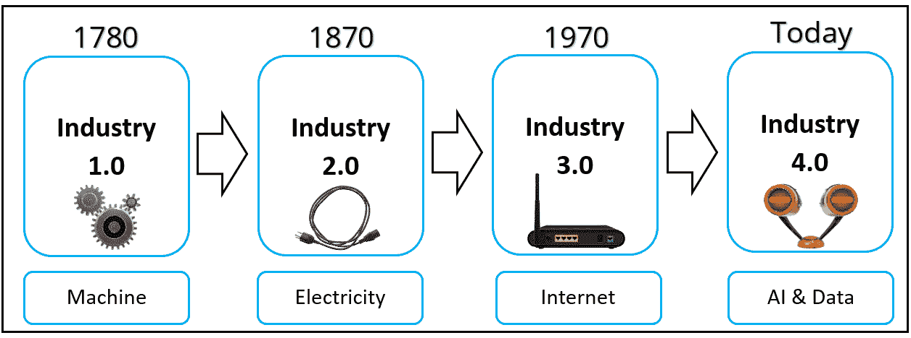

# 10

# 案例研究 1 – 计算机视觉

在本章中，您将了解计算机视觉在众多工业应用中的多样性。您将发现一些使用计算机视觉成功解决的问题。与此并行，您将掌握传统计算机视觉解决方案的主要问题。此外，您将探索并理解使用合成数据在实际中改进计算机视觉解决方案的引人深思的例子。

在本章中，我们将涵盖以下主要主题：

+   工业革命——计算机视觉作为解决方案

+   合成数据和计算机视觉——行业中的例子

# 转型产业 – 计算机视觉的力量

在本节中，我们将简要讨论主要的四次工业革命，因为它们有助于我们更好地理解人工智能、数据和计算机视觉的历史背景。然后，我们将了解为什么计算机视觉正成为我们现代工业的一个不可或缺的组成部分。

## 工业革命的四波

**工业革命**指的是全球经济发生的全球性和快速转变。通常，这种转变会带来并利用新的发明、发现和技术，使制造和生产过程更加高效。工业革命的历史可以总结为四个阶段：

图 10.1 – 工业革命

接下来，让我们更深入地讨论图 10.1*中展示的每一次工业革命。

### 工业 1.0

这指的是第一次工业革命，发生在 19 世纪初。它通过引入机械来补充、支持和增强现有的劳动过程；动物和手工劳动大多被水和蒸汽机所取代。这是一次向使用机械执行大多数相同任务但更高效的大转变。这为新的工业打开了大门，如铁的生产，这对建筑、交通和制造业的发展产生了重大影响。工业 1.0 改变了产品的生产方式，为下一次工业革命奠定了基础。

### 工业 2.0

电是工业 2.0 时期生产发生重大转变的主要驱动力。装配线生产和电力作为动力源的广泛应用促进了大规模生产。与此并行，钢铁制造和生产的大幅进步使得更复杂、更强大的机械得以建造。这为随后的工业革命奠定了基础。

### 工业 3.0

电力是我们文明发生重大变化的发现之一，包括通信和工业。随着大规模生产，这被认为是工业 2.0 的主要主题之一，迫切需要自动化以最小化错误并最大化效率。因此，制造商利用计算机来实现更加精确和高效的生产。

### 工业 4.0

大多数行业的数字化转型、全球公司之间的激烈竞争以及资源稀缺都为网络物理系统和因此**智能工厂**打开了大门。因此，人工智能、机器人和**大数据**开始吸引工业和学术界更多的关注。由于这次工业革命的主要特性是高效率、定制产品和服务的个性化，机器学习和数据是实现这些目标的关键宝石。

接下来，我们将看到为什么计算机视觉是许多我们当前行业的基础。

## 工业 4.0 和计算机视觉

计算机视觉是一个跨学科领域，它使机器能够理解图像。计算机视觉是我们当前工业革命的一个基本组成部分。它已被广泛应用于质量控制、安全保障、预测性维护和其他基本且关键的应用。接下来，让我们讨论计算机视觉在以下领域的应用：

+   制造业

+   自动驾驶

+   医疗保健

+   农业

+   监控和安全

### 制造业

在制造业中，人为错误可能导致整个生产流程的重大延误。它甚至可能损坏机器和基础设施，造成伤害和死亡。计算机视觉作为一种解决方案，可以补充、支持或替代过程中的人类因素。计算机视觉可用于指导组装和制造过程，以实现更高的吞吐量、更低的成本和更高的质量。

软镜制造商与*ADLINK*和*LEDA*合作，他们已经使用计算机视觉自动化了软镜检验过程。这项任务通常由人工检验员完成，每天要检查数千个镜片。这是一个耗时且错误难以避免的过程。通过部署 ADLINK 和 LEDA 基于计算机视觉的解决方案，制造软镜的公司能够使其检验过程准确度提高 3 倍，速度提高 50 倍！他们的创新解决方案从过程中移除了人为因素，这大大提高了检验过程的可扩展性和质量。有关此用例的更多信息，请参阅*ADLINK 和 LEDA 技术创造人工智能驱动的软镜检验解决方案*([`data.embeddedcomputing.com/uploads/articles/whitepapers/13328.pdf`](https://data.embeddedcomputing.com/uploads/articles/whitepapers/13328.pdf))。

### 自动驾驶

这是与计算机视觉紧密相关的主要领域之一。**自动驾驶**技术可以减少驾驶中的人为错误，从而最大限度地减少事故、伤害和死亡。2022 年，美国道路交通事故死亡人数超过 46,200 起([`www.statista.com/statistics/192575/road-traffic-fatalities-in-the-united-states`](https://www.statista.com/statistics/192575/road-traffic-fatalities-in-the-united-states))。因此，计算机视觉提供了一个有希望的安全、高效和富有成效的解决方案。像 *特斯拉*、*Waymo* 和 *Mobileye* 这样的自动驾驶公司已经开始利用计算机视觉进行车道检测和跟踪、行人检测、物体识别和交通标志检测与识别。正如你可能猜到的，这样的计算机视觉算法的失败可能导致财产损失、严重伤害或死亡。因此，训练和发展稳健的计算机视觉算法是机器学习研究人员的热门话题，并且正在获得更多的动力和关注。

**特斯拉汽车** 开发了一个基于神经网络的计算机视觉系统，该系统从不同的摄像头获取视频输入。然后，它处理视觉信息并预测场景中的道路布局、静态物体、行人和其他车辆。更多信息，请参阅 *Tesla – AI &* *Robotics* ([`www.tesla.com/AI`](https://www.tesla.com/AI))。

**Aurora Driver** 是一个可用于自动驾驶的计算机视觉系统。该系统学会融合来自各种传感器收集的信息，例如激光雷达、雷达和摄像头，以提供对驾驶环境的理解。更多信息，请参阅 *Perception at Aurora: No measurement left* *behind* ([`blog.aurora.tech/engineering/perception-at-aurora-no-measurement-left-behind`](https://blog.aurora.tech/engineering/perception-at-aurora-no-measurement-left-behind))。

接下来，让我们转向医疗保健领域的计算机视觉应用。

### 医疗保健

由于其分析大量患者数据并提供快速、准确和高效诊断的强大能力，计算机视觉彻底改变了医疗保健领域。计算机视觉算法可以帮助医疗保健从业者、外科医生和医生做出准确和及时的决定，从而降低成本、改善治疗和手术，并减少人为错误。

许多医疗保健提供商已经开始利用计算机视觉在该领域的潜力。让我们突出 *Viz.ai* 和 *Paige* 中的两个例子。

**Viz.ai** 利用计算机视觉算法通过分析患者的医学图像来识别中风迹象。他们将算法部署到高效分析 **计算机断层扫描** (**CT**) 和 **磁共振成像** (**MRI**)，如果发现中风迹象，就会通知神经科医生采取适当的行动。

**派吉**是另一家已部署计算机视觉来改善病理学家诊断和预测测试的公司。在耶鲁医学院最近的一项关于派吉前列腺（他们计算机视觉工具的名称）有效性的研究中，1,876 个由该系统分类为“可疑”的预测被专业病理学家审查。该研究得出结论，只有 31.4%的活检需要由病理学家审查。因此，这个工具确实可以提高病理学家的生产力。此外，它还表明，这个工具可以提高前列腺癌的检测率，尤其是在非泌尿生殖系统专业病理学家审查时。更多详情，请参阅*独立评估 AI 在前列腺癌*检测中的应用([`paige.ai/case-study/an-independent-assessment-of-ai-for-prostate-cancer-detection`](https://paige.ai/case-study/an-independent-assessment-of-ai-for-prostate-cancer-detection))。

在下一节中，让我们考察计算机视觉在农业领域的应用。

### 农业

食品安全信息网络（**FSIN**）最近发布的一份题为*2023 年全球粮食危机报告*的报告([`www.fsinplatform.org/sites/default/files/resources/files/GRFC2023-hi-res.pdf`](https://www.fsinplatform.org/sites/default/files/resources/files/GRFC2023-hi-res.pdf))对 58 个国家的当前和未来粮食不安全情况提出了警告。报告强调，2022 年约有 2.5 亿人面临严重的粮食不安全，这比 2021 年的约 1.9 亿人有所增加。据专家们说，未来情况只会变得更糟。

许多公司，如*塔兰尼斯*和*普罗斯佩拉*，利用计算机视觉引导农民更好地优化资源，分析作物数据，持续监测作物，并检测潜在问题，如害虫和疾病。让我们更详细地谈谈塔兰尼斯和普罗斯佩拉。

**塔兰尼斯**是一家专注于开发帮助农业企业和农民提高作物质量、产量和利润的技术公司。它利用无人机和计算机视觉来分析农场，使治疗更加高效。该技术开发的成果被用于在叶级水平上高效控制大型农场，这在没有计算机视觉的情况下几乎是无法实现的。如需更多信息，请参阅公司网站([`www.taranis.com`](https://www.taranis.com))。

**普罗斯佩拉**是另一家依赖计算机视觉来支持农民的公司。这项技术帮助他们控制旋转器、泵和其他灌溉系统的方面。此外，它持续监测作物健康，并立即检测任何问题。更多详情，请参阅公司网站([`prospera.ag`](https://prospera.ag))。

如您所预期的那样，这些关键的传统计算机视觉解决方案可以通过利用合成数据作为真实数据的补充或替代来进一步改进。现在，让我们深入了解这些计算机视觉解决方案的主要问题，这些问题源于它们对真实数据的重大依赖。

正如我们在前面的章节中讨论的那样，基于真实数据的计算机视觉算法通常存在以下问题：

+   训练数据不足

+   数据质量问题及偏差

+   变化性有限

在下一节中，您将了解为什么和如何行业开始在其基于计算机视觉的解决方案中采用合成数据。

### 监控和安全

计算机视觉的主要关键能力之一是准确且高效地分析视觉信息，如图像和视频。例如，它可以用于以下目的：

+   检测异常行为

+   识别可疑人员、物品或行为

+   车牌识别

+   生物识别识别：面部、虹膜、掌纹、静脉、声音和指纹识别

因此，计算机视觉可以用来防止未经授权的访问，保护人员和资产，并在实时中识别安全威胁和风险。如今，计算机视觉被用于确保公共安全。例如，它在机场、公共交通、街道、公园和其他公共场所得到应用。许多公司已经成功地将计算机视觉用于安全和监控问题，例如海康威视([`www.hikvision.com`](https://www.hikvision.com))、大华([`www.avigilon.com`](https://www.avigilon.com))、Verkada([`www.verkada.com`](https://www.verkada.com))、华为、谷歌、微软和亚马逊。让我们深入了解一个有趣的案例研究，即富士通及其在蒙特利尔监控和优化交通流量方面的有趣应用。

蒙特利尔市因入口和出口点有限、道路基础设施不足以及交通管理系统不完善等因素，在交通流量方面遇到了许多问题。作为解决方案，富士通提出了一种基于计算机视觉的解决方案来解决大多数交通问题。该系统从监控摄像头、超过 2,500 个交通信号灯和其他传感器收集数据。然后，系统做出实时决策以优化交通流量。基于计算机视觉的解决方案降低了旅行时间、空气污染和其他与交通相关的问题。更多详情请参阅*使用 AI 平滑交通流量*分析([`www2.fujitsu.com/global/customer-stories/cs-city-of-montreal-20210701`](https://www2.fujitsu.com/global/customer-stories/cs-city-of-montreal-20210701))。

# 合成数据和计算机视觉 - 行业中的例子

在本节中，您将了解并理解公司如何刚刚开始使用基于合成数据的计算机视觉解决方案来脱颖而出并克服真实数据限制和问题。

## Neurolabs 在零售中使用合成数据

根据《*正确获取可用性：控制缺货*》([`www.oliverwyman.com/content/dam/oliver-wyman/global/en/2014/aug/2012_CEU_POV_Getting%20Availability%20Right_ENG.pdf`](https://www.oliverwyman.com/content/dam/oliver-wyman/global/en/2014/aug/2012_CEU_POV_Getting%20Availability%20Right_ENG.pdf))，缺货商品会导致严重的财务损失和客户不满。对企业和收入的影响可能非常显著。同时，收集和标注大规模真实数据对于这项任务来说是一个昂贵且耗时的过程。Neurolabs，一家专注于提供零售自动化解决方案的机器学习公司，研究了使用合成数据解决这一问题的优雅方案。他们利用 Unity 和自己的合成数据生成器生成了 129 种独特**库存单位**（**SKU**）在货架上的 1,200 张图像。该数据集命名为 CPGDet-129，可以从以下链接下载([`dl.orangedox.com/SampleRetailSyntheticDataset`](https://dl.orangedox.com/SampleRetailSyntheticDataset))。此外，有关数据集和许可的更多详细信息，请参阅 GitHub 仓库([`github.com/neurolaboratories/reshelf-detection`](https://github.com/neurolaboratories/reshelf-detection))。该数据集是自动生成并标注的。此外，它专门支持目标检测任务。仅使用他们的合成数据集进行最先进的对象检测算法训练，而不使用任何真实数据，他们在真实测试数据集上实现了 60%的**平均精度均值**（**mAP**）。mAP 是一个指标，用于告诉我们目标检测模型在预测感兴趣对象周围的边界框时的准确性。mAP 分数越高，表明我们的模型做出的预测越准确。

这是一个完美的例子，展示了合成数据如何在实践中解决复杂的计算机视觉问题。

更多详细信息，请参阅[`neurolabs.medium.com/using-neurolabs-retail-specific-synthetic-dataset-in-production-bbfdd3c653d5`](https://neurolabs.medium.com/using-neurolabs-retail-specific-synthetic-dataset-in-production-bbfdd3c653d5)和[`www.neurolabs.ai/post/using-neurolabs-retail-specific-synthetic-dataset-in-production`](https://www.neurolabs.ai/post/using-neurolabs-retail-specific-synthetic-dataset-in-production)。

## 微软仅使用合成数据进行面部分析

面部分析，如面部解析和地标定位，对于现代工业至关重要。应用范围从安全和广告到医疗诊断。使用合成数据进行面部分析似乎不可避免，因为对这些任务标注真实图像不仅极其困难，而且还会带来伦理和隐私问题。您可以参考*第三章*，其中我们讨论了这些问题。

微软是面部识别技术领域的先驱公司之一。他们在该领域进行了多年的研发。*Face API*只是其中的一个例子([`azure.microsoft.com/en-gb/products/cognitive-services/face`](https://azure.microsoft.com/en-gb/products/cognitive-services/face))。他们最近的工作，题为*Fake it till you make it: face analysis in the wild using synthetic data alone*([`openaccess.thecvf.com/content/ICCV2021/papers/Wood_Fake_It_Till_You_Make_It_Face_Analysis_in_the_ICCV_2021_paper.pdf`](https://openaccess.thecvf.com/content/ICCV2021/papers/Wood_Fake_It_Till_You_Make_It_Face_Analysis_in_the_ICCV_2021_paper.pdf))，是合成数据如何在计算机视觉中得到应用的绝佳展示。

本工作中的研究人员首先以程序化方式生成了逼真的合成人脸。他们使用了一个模板人脸，然后随机化了头发、衣服、表情以及本质上的人脸特征。他们在随机环境中模拟了这些人脸。他们生成的合成数据集包含带有真实值标注的 10 万个合成人脸，包括 2D 密集人脸地标和每像素人脸部分语义分割。

他们仅使用他们生成的合成数据训练了人脸解析和地标定位的机器学习模型，而没有使用任何真实图像。他们的实验结果表明，训练好的机器学习模型在真实数据集上能够实现更优的结果。例如，与使用真实数据训练的机器学习模型相比，他们的合成数据训练的机器学习模型能够预测出 10 倍多的地标。他们声称这种成功归功于他们合成训练数据的优越性。他们强调，在实际操作中，人类标注者很难准确标注那么多的地标。此外，他们还表明，他们的合成数据生成流程可以很容易地适应生成其他计算机视觉任务（如眼动追踪）的合成训练数据。他们只需添加一个虚拟眼动追踪相机，并生成带有相应真实值的训练图像。要下载数据集，您可以参考他们的 GitHub 仓库([`microsoft.github.io/FaceSynthetics`](https://microsoft.github.io/FaceSynthetics))。

## 使用合成数据进行虚拟试穿的合成 AI

虚拟时尚正在获得更多动力，因为它提供了一种可持续的解决方案，与传统的时尚不同，它降低了成本和努力。此外，它为公司和客户提供了可扩展和更加个性化的解决方案。更进一步，它为创意、协作和社会影响开辟了更多机会。为了使该行业蓬勃发展并实现预期目标，计算机视觉技术需要在多个任务上表现出色，例如姿态估计、语义分割、视觉物体检测和跟踪。*合成 AI*通过使用具有巨大体型、性别、种族、年龄、身高和其他属性变化的合成逼真 3D 人类，提出了一种优雅的解决方案。他们能够生成深度图、表面法线、分割图和许多其他注释。更多详情，请参阅*合成 AI 虚拟试穿*([`synthesis.ai/applications/virtual-try-on`](https://synthesis.ai/applications/virtual-try-on))。此外，他们通过实验证明了生成的合成数据在许多任务中的可用性，例如人脸分割、背景抠图和面部特征点检测。他们发现，在合成数据上预训练后，在真实数据上进行微调，与仅使用真实数据或合成数据训练，甚至两者的混合训练相比，可以达到最佳结果。要更详细地了解案例研究，请参阅*合成数据案例研究：它就是* *有效* ([`synthesis.ai/2021/06/17/synthetic-data-case-studies-it-just-works`](https://synthesis.ai/2021/06/17/synthetic-data-case-studies-it-just-works))).

# 总结

总结

在下一章中，你将深入探讨自然语言处理领域另一组有趣的案例研究。
