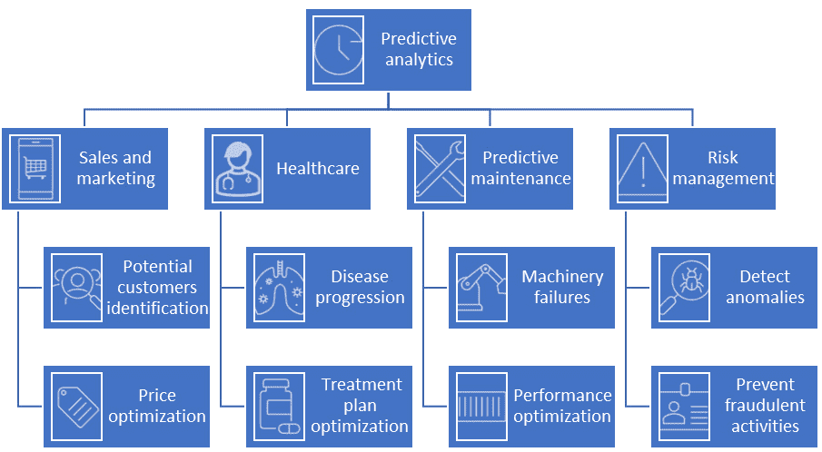

# 第十二章：案例研究 3 – 预测分析

本章向您介绍预测分析，这是合成数据最近被应用的一个新领域。此外，您将探索基于真实数据的解决方案的关键缺点。通过提供行业中的例子，讨论将得到丰富。在此之后，您将理解并清楚地识别在预测分析领域使用合成数据的益处。

在本章中，我们将涵盖以下主要内容：

+   什么是预测分析？

+   基于真实数据的预测分析问题

+   利用合成数据进行预测分析的案例研究

# 什么是预测分析？

在本节中，您将了解预测分析。您将了解其实际应用中的各种应用。您还将探索其在不同领域的广泛应用，包括银行、金融和医疗保健。

预测未来一直是人们关注的中心，并且数千年来一直吸引着人类，它仍然是一个热门话题！预测未来有助于识别和利用机会，优化资源配置，并为灾难、灾害和危机做好准备。预测分析是数据分析的一个子领域，旨在利用历史数据预测或预测未来。现在，为了开始我们理解预测分析之旅，让我们考察一些其有趣的 应用。

## 预测分析的应用

在实践中，预测分析有巨大的应用。*图 12.1* 展示了这些应用的样本。

图 12.1 – 行业中预测分析应用的样本

让我们简要讨论一些这些应用。

### 销售和营销

识别潜在客户对公司至关重要，因为它使他们能够集中资源和注意力，并将他们的广告努力有效地针对特定的客户群体。此外，它还帮助公司创建个性化的广告、产品和服 务。因此，他们可以吸引更多客户，优化他们的资源，从而实现更高的利润。例如，*星巴克* 利用您的购买历史来推荐您可能喜欢的 新饮料。有关更多信息，请参阅 *星巴克如何使用预测分析和您的忠诚度卡数据* ([`demand-planning.com/2018/05/29/how-starbucks-uses-predictive-analytics-and-your-loyalty-card-data`](https://demand-planning.com/2018/05/29/how-starbucks-uses-predictive-analytics-and-your-loyalty-card-data))。

此外，价格优化也是企业的一个核心要素。公司通常旨在找到实现最高盈利性的理想价格。在低价格吸引更多客户和高价格吸引较少客户之间往往存在权衡。因此，公司利用预测分析和机器学习来考虑市场需求、竞争对手的价格以及商品的质量和数量，以进行最佳价格预测。有关定价优化的更多信息，请参阅 *定价优化与机器学习* *技术* ([`vitalflux.com/pricing-optimization-machine-learning-techniques`](https://vitalflux.com/pricing-optimization-machine-learning-techniques))。

### 医疗保健

准确预测疾病的进展有助于控制其进展甚至预防它。例如，预测癌症的进展对于为患者制定最有效的治疗方案至关重要。一般来说，慢性病特别受益于利用预测分析。研究人员已经表明，利用测试结果、临床访问和其他有关患者的信息可以帮助他们准确预测慢性病进展。有关更多详情，请参阅 *慢性病进展预测：利用基于案例的推理和大数据* *分析* ([`doi.org/10.1111/poms.13532`](https://doi.org/10.1111/poms.13532))。

### 预测性维护

计划外的停机时间是影响客户、服务、公司声誉和收入的主要问题之一。因此，预测机械故障可以帮助避免它们并延长机器和设备的使用寿命。预测分析通常利用从各种来源收集的数据，包括以下内容：

+   来自传感器的数据，例如压力、温度和振动频率

+   来自故障记录仪的数据，例如故障类型、原因和后果

+   机器历史性能数据，例如在标准和非标准操作条件下收集的数据

+   行业基准

有关设备故障预测分析的更多详情，请参阅 *预测性维护：采用工业物联网和机器学习预防设备* *故障* ([`www.altexsoft.com/blog/predictive-maintenance`](https://www.altexsoft.com/blog/predictive-maintenance))。

### 风险管理

预测分析在现代商业中被广泛用于风险管理。以前风险事件和欺诈活动的历史数据可以用来训练机器学习模型，以预测未来的可能攻击、威胁和风险。*PayPal*、*Apple Pay*和*Amazon Pay*持续评估客户行为，以识别任何可疑活动或异常模式。这包括异常的消费模式、多次失败的认证尝试以及账户或客户信息的快速变化。机器学习模型通常在客户的相关数据上训练，例如交易模式、设备信息和客户的位置。更多信息，请参阅*4 Ways Machine Learning Helps You Detect Payment Fraud* ([`www.paypal.com/us/brc/article/payment-fraud-detection-machine-learning`](https://www.paypal.com/us/brc/article/payment-fraud-detection-machine-learning))。

现在，让我们深入了解实际数据驱动的预测分析解决方案的主要问题。

# 实际数据中的预测分析问题

在本节中，你将了解基于实际数据的预测分析解决方案的主要问题。主要地，我们将讨论以下三个问题。

## 部分和稀缺的训练数据

预测分析模型在实际中良好工作的一个主要要求是拥有大规模的历史数据。在医疗保健、银行、安全和制造等行业，找到这样的数据集并不容易。背后的主要原因包括隐私问题、法规和商业机密。正如我们所知，没有足够的训练数据集，机器学习算法在实践中的表现就无法良好。因此，基于实际数据的预测分析方法只在数据可用的某些领域表现良好。因此，通过添加合成数据来补充小型和不完整的数据集可以解决这个问题。因此，它解决了这些领域中实际数据集的主要问题之一，正如我们将在下一节中看到的。

## 偏差

当然，实际数据集中另一个主要问题是偏差。换句话说，数据通常分布不均。因此，预测模型会存在偏差，这会导致错误的决策和预测。使用合成数据，你可以通过为样本较少的类别或类别生成样本来使你的数据集平衡。这会积极影响你的预测模型性能，从而改善你公司决策流程。

## 成本

虽然收集和标注真实数据通常是一个昂贵且耗时的过程，但公司必须持续更新数据以准确捕捉和展示真实市场。因此，使用真实数据可能会使公司付出更多代价，同时可能导致机器学习模型基于过时数据做出预测。此外，正如所述，公司需要持续收集和标注真实数据，这确实是一个繁琐的过程。合成数据可以快速高效地生成，以增强真实数据。因此，它为预测分析问题提供了一个既经济又高质量的解决方案。

现在，让我们详细探讨三个利用合成数据在预测分析中的案例研究。

# 利用合成数据进行预测分析的案例研究

在本节中，您将探索合成数据为预测分析领域带来的巨大机遇。您将深入研究三个有趣的案例研究：

+   Provinzial 与合成数据

+   医疗保健从预测分析中的合成数据中受益

+   使用合成数据进行亚马逊欺诈交易预测

## Provinzial 与合成数据

Provinzial 是德国顶级保险公司之一，由于许多法规限制了敏感数据在快速变化的市场（如保险市场）中用于预测分析的可用性，因此一直面临着许多真实保险数据可用性的问题。同时，他们希望提高他们的服务和向客户提供的报价。为了解决这些问题，他们研究了使用合成数据，并且确实使用生成的合成数据训练了他们的机器学习模型。基于合成数据的预测分析系统“下一最佳报价”取得了惊人的成果，帮助公司更好地理解和支持客户。利用合成数据，他们能够在包含 380 个特征的 100 万客户的大规模数据集上训练他们的模型，该数据集包括有关客户敏感信息，如地址、支付历史和保险索赔。他们强调，使用合成数据有助于他们的公司在不侵犯客户隐私的情况下测试他们的假设。合成数据减少了处理隐私问题所需的时间。他们得出结论，使用基于合成数据的预测分析是有益且宝贵的：

“我们发现[基于合成数据的解决方案]是我们数据科学团队的一个有用解决方案，可以简化数据访问并专注于我们的数据项目、机器学习模型优化和新想法的测试。”

– Dr. Sören Erdweg，Provinzial 公司的数据科学家

更多信息，请参阅 *保险预测分析中的合成数据：Provinzial 的案例* ([`www.statice.ai/post/synthetic-data-for-predictive-analytics`](https://www.statice.ai/post/synthetic-data-for-predictive-analytics))。

## 医疗保健从预测分析中的合成数据中受益

**嵌合抗原受体细胞疗法**（**CAR-T**）是治疗特定类型血液癌症的有效治疗方法。通常，哪些患者有资格并可以从这种治疗中更好地受益是由一个专门的委员会决定的（见[`www.england.nhs.uk/cancer/cdf/car-t-therapy`](https://www.england.nhs.uk/cancer/cdf/car-t-therapy)）。机器学习模型和预测分析被用于对这个任务进行准确预测。然而，由于可用的真实数据量有限，这个任务对机器学习模型来说是复杂的。正如预期的那样，这类模型准确性的微小提高意味着可以挽救更多生命和减少开支。因此，这仍然是一个需要更多研究的热门研究课题。

在这个特定的案例研究中，任务是二元分类问题——是否有资格接受 CAR-T 治疗。这里的主要问题，除了数据稀缺之外，还有一个数据分布不平衡的问题，其中一个类别的训练样本数量远多于另一个类别，这导致机器学习模型给出有偏见的预测。使用合成数据来增强真实数据是一个理想的解决方案，可以使训练数据集平衡。这是通过为训练数据较少的类别生成合成样本来实现的。

利用合成数据解决这个问题提高了性能至少三个百分点，并估计节省了 6500 万英镑。此外，该解决方案没有违反任何规定或侵犯任何患者的隐私。在所有这些成果之上，识别出了更多合适的患者，因此挽救了更多生命！有关这个案例研究的更多信息，请参阅*预测分析在医疗保健中受益于合成数据* *生成*（[`mostly.ai/case-study/predictive-analytics-in-healthcare`](https://mostly.ai/case-study/predictive-analytics-in-healthcare)）。

## 使用合成数据预测亚马逊欺诈交易

根据*英国金融公司 2023 年年度欺诈报告*，在英国，由于各种欺诈活动，估计损失了 12 亿英镑（[`www.ukfinance.org.uk/policy-and-guidance/reports-and-publications/annual-fraud-report-2023`](https://www.ukfinance.org.uk/policy-and-guidance/reports-and-publications/annual-fraud-report-2023)）。不幸的是，这并不是唯一的问题；欺诈活动也阻碍了经济增长，破坏了关系，并削弱了社会凝聚力。

*亚马逊*在可利用的真实数据集方面遇到了许多问题，特别是对于欺诈交易预测分析。除了真实数据集的偏差和不平衡问题外，它们在罕见事件下没有包含足够的训练样本。这导致机器学习模型在这些场景下的准确性较低。为了解决这些问题，他们使用了**WGAN-GP**，我们已在*第七章*中讨论过。他们利用 WGAN-GP 来学习真实数据。然后，他们使用这个生成模型来生成样本，使数据集平衡并包括罕见的欺诈活动。这补充了训练数据集，并直接提高了机器学习模型在标准场景和挑战场景下的鲁棒性和泛化能力，在这些场景中，没有足够的真实训练数据可用。更多信息，请参阅*在亚马逊 SageMaker 中使用合成数据增强欺诈交易* ([`aws.amazon.com/blogs/machine-learning/augment-fraud-transactions-using-synthetic-data-in-amazon-sagemaker`](https://aws.amazon.com/blogs/machine-learning/augment-fraud-transactions-using-synthetic-data-in-amazon-sagemaker))。

# 摘要

在本章中，我们讨论了预测分析和其在行业中的主要应用。我们探讨了基于真实数据的解决方案的主要局限性。然后，我们学习了合成数据如何为这些问题提供一个优雅的解决方案。此外，我们还介绍了三个案例研究，了解了某些公司如何利用合成数据来改进他们的预测分析，从而提高他们的服务和收入。在下一章中，我们将强调一些最佳实践，以成功和高效地应用合成数据来解决您自己的问题。
