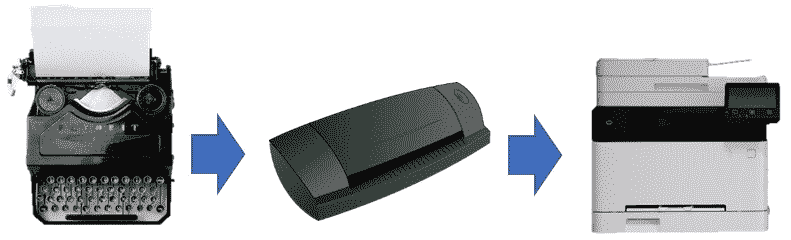
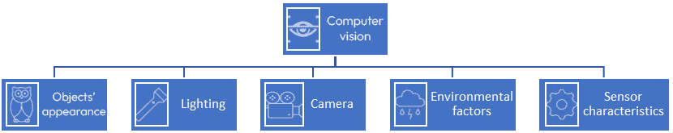
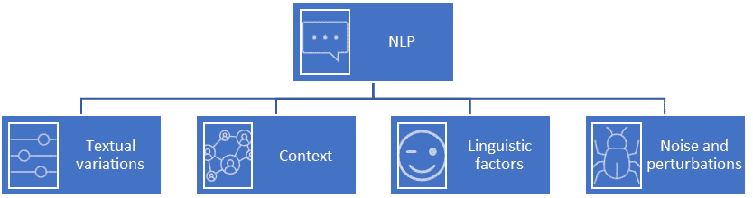

# 第十四章：合成到真实领域自适应

本章向您介绍了一个常见的问题，通常限制了合成数据的使用性，称为领域差距问题。在本章中，您将学习到各种弥合这一差距的方法，这将帮助您更好地利用合成数据。同时，本章讨论了合成到真实领域的自适应的最新研究。因此，您将了解您可能用于自己问题的方法。然后，它代表了在此背景下的问题和挑战，以便更好地理解这个问题。

在本章中，我们将涵盖以下主要主题：

+   机器学习中的领域差距问题

+   合成到真实领域自适应的方法

+   合成到真实领域自适应——问题和挑战

# 机器学习中的领域差距问题

在本节中，我们将了解领域差距是什么以及为什么它在机器学习中是一个问题。领域差距是限制合成数据在实际中可用性的主要问题之一。它通常指的是两个或更多领域中的数据分布和属性的不相似性。它不仅与合成数据相关。然而，它是机器学习中一个常见的问题。在测试类似但略有不同的数据集时，通常会发现机器学习模型性能的下降。更多信息，请参阅 *Who is closer: A computational method for domain gap evaluation* ([`doi.org/10.1016/j.patcog.2021.108293`](https://doi.org/10.1016/j.patcog.2021.108293))。

数据集之间领域差距的主要原因可以与以下因素相关联：

+   对传感器变化的敏感性

+   类别和特征分布的差异

+   概念漂移

让我们更详细地讨论这些观点。

## 对传感器变化的敏感性

在计算机视觉中，你的机器学习模型可能在某些相机、设置和参数捕获的图像上表现良好，但在使用不同相机或不同参数捕获的相似输入下会彻底失败。例如，你的计算机视觉模型可能在从第一人称视角捕获的视频上表现良好，但在从第三人称视角捕获的视频上会彻底失败。因此，我们可以看到，即使是同一任务，如动作识别，通常也会侧重于研究人的视角，如在*通过建模主体-动作相关性进行第一人称活动识别*（[`doi.org/10.1109/IJCNN55064.2022.9892547`](https://doi.org/10.1109/IJCNN55064.2022.9892547)）。另一个例子是相机的**视野**（**FoV**）。一些计算机视觉任务，如语义分割，也是在特定的相机视野下进行的。在标准视野下捕获的 Cityscapes 和 Synscapes 数据集上训练的语义分割方法，在由超广角鱼眼镜头捕获的鱼眼图像上进行分割时会失败。例如，请参阅*FPDM：用于门* *监控*的鱼眼全景分割数据集（[`ieeexplore.ieee.org/stamp/stamp.jsp?tp=&arnumber=9959151`](https://ieeexplore.ieee.org/stamp/stamp.jsp?tp=&arnumber=9959151)）。

## 类别和特征分布的差异

属性、类别和特征分布的差异或不一致性是合成域和真实域之间或甚至在同一真实域中训练和测试在不同数据集上时出现领域差距的主要原因之一。当处理基于时间序列的问题时，这一点可以清楚地观察到。很多时候，训练数据变得过时，并不来自测试或评估数据的同一分布。例如，一个基于一年前收集的数据来预测通货膨胀率的机器学习模型，一旦应用于当前数据，可能由于领域差距问题而表现不佳。这是因为源数据和目标数据分布以及特征现在与预期不同。

## 概念漂移

概念漂移指的是输入（特征）和输出（目标）之间关系的变化。让我们举一个说明性的例子。假设我们设计了一个对象分类器，“打印机”是我们感兴趣的对象之一。正如你在*图 14*.*1*中可以看到的，“打印机”概念在时间上发生了剧烈变化，从早期的打字机到喷墨打印机，再到激光打印机。因此，如果你的训练数据只包含旧打印机（打字机），它将因为领域差距问题而难以准确分类现代打印机。

图 14.1 – 概念漂移的示例（来源：Pixabay）

接下来，让我们探讨缓解合成域和真实域之间领域差距问题的主要解决方案。

# 从合成到现实域自适应的方法

在本节中，你将学习从合成到现实域自适应的关键方法。我们将讨论以下方法：

+   域随机化

+   对抗域自适应

+   基于特征的域自适应

让我们从域自适应中最常用的方法之一开始。

## 域随机化

**域随机化**是一种通常用于缓解域差距问题并提高目标域上机器学习模型性能的机制或程序。这种方法旨在随机化训练数据或环境的主要属性和属性，例如模拟器，以增加机器学习模型在训练阶段所接触到的场景的多样性。因此，我们可以增加机器学习模型对未来可能遇到的场景的鲁棒性。有关更多信息，请参阅*从模拟到现实世界的域随机化，用于迁移深度神经网络* ([`arxiv.org/pdf/1703.06907.pdf`](https://arxiv.org/pdf/1703.06907.pdf))。

让我们考察在两个有趣的领域中通常随机化的主要元素：计算机视觉和自然语言处理。

### 计算机视觉

在几乎任何计算机视觉问题、任务或系统中，我们都有以下四个主要元素，如图*图 14.2*所示。2：

图 14.2 – 计算机视觉中要随机化的主要元素

接下来，让我们更详细地讨论这些元素。

+   **物体**：它们通常是计算机视觉的主要焦点。它们充满场景并与彼此、光照和环境相互作用。计算机视觉中的许多主要任务，如物体检测、识别、分割和跟踪，从根本上与这些图像在三维世界中的外观以及世界如何被相机投影为二维图像有关。

利用域随机化来缓解域差距，例如，我们可以随机化以下元素以多样化物体的外观：

+   纹理和材料

+   颜色

+   形状

+   维度

+   变形和动画

正如你所见，决定哪些因素更相关取决于任务和问题。

+   **光照**：尽管光照对于使物体对观察者可见是必要的，但它几乎为几乎所有计算机视觉任务都带来了一个令人畏惧的问题。光照条件的一点点变化会极大地改变物体的外观，从而改变像素的强度，这使得这些物体对于基于机器学习的计算机视觉模型来说难以识别、检测或跟踪。

因此，为了使我们的机器学习模型在各种光照条件下保持鲁棒性，我们可能需要多样化以下元素：

+   光照强度

+   光照颜色和温度

+   光源

+   光照异常：耀斑、眩光和闪烁

+   **相机和传感器特性**：相机从场景中捕获视觉数据，这是计算机视觉模型最通用和传统的输入。因此，为了确保我们的机器学习模型即使在新的相机设置下也能很好地泛化，我们需要在训练阶段多样化，例如，多样化的相机设置。这可以通过以下方式实现：

    +   相机位置

    +   方向

    +   海拔

    +   视角

    +   光圈、曝光和焦点

此外，相机参数（如焦距）的变化也可能极大地改变世界被捕捉和感知的方式。因此，它将直接影响计算机视觉系统识别世界的方式。因此，我们可能需要在我们的训练数据中考虑以下传感器特性变化：

+   镜头畸变

+   蒙影

+   色差

+   划痕

+   雾

+   光泄漏

+   **环境因素**：即使场景、光照和相机参数相同，环境因素也会在很大程度上改变场景可能的外观。例如，像雾这样的天气条件充当低通滤波器，移除远离相机的物体细节。因此，这使得在这些场景中提取稳健特征变得更加困难。因此，许多机器学习模型可能在类似情况下失败或挣扎。

在许多情况下，我们无法清楚地识别我们的计算机视觉系统将工作的环境因素，因此我们可能需要随机化以下因素：

+   天气状况

+   白天时间

+   室内和室外环境

+   污染程度

+   风的影响

+   地形和景观

+   路面状况

+   人群密度

+   背景杂乱

+   地理位置信息

因此，基于我们在本节中学到的知识，为了缓解源（训练）和目标（评估）域之间的领域差距，我们需要在训练过程中使我们的机器学习模型学习的场景多样化并随机化。接下来，让我们深入了解如何利用领域随机化来解决 NLP 问题。

### 自然语言处理（NLP）

与我们在计算机视觉中讨论的类似，领域随机化也可以用于 NLP 问题。通常，它可以部署来使 NLP 模型更加鲁棒和准确。更多信息，请参阅 *《扩大规模与提炼：语言引导的机器人技能获取》* ([`arxiv.org/abs/2307.14535`](https://arxiv.org/abs/2307.14535))。

如您在 *图 14.3* 中所见，有四个关键元素可以随机化，以在实际中提高 NLP 模型的泛化能力：

图 14.3 – NLP 中需要随机化的主要元素

让我们详细讨论以下这些元素：

+   **文本变化**：为了提高 NLP 模型对现实世界问题的泛化能力和鲁棒性，引入了许多文本变化来增强和补充训练数据。这通常通过以下元素的变化来完成：

    +   词汇表

    +   句子结构

    +   句子长度

+   **上下文**：NLP 模型可以在不同的上下文中以及各种应用中使用。例如，ChatGPT 可以用来回答关于各种主题的问题，如医疗保健、数学、金融和历史。它可以用来提出旅行计划，甚至总结文本。因此，在训练数据中多样化这些元素至关重要：

    +   主题

    +   领域

    +   文本体裁，如社交媒体、研究论文和小说

+   **语言因素**：一个理想的 NLP 模型应该能够处理和回应不同格式和风格的查询。此外，它应该能够理解各种应用中的情感。因此，以下因素应在训练阶段随机化，以确保在实际应用中表现更佳：

    +   风格，如正式、非正式、技术或口语

    +   情感，如积极、消极或中性表达

+   **噪声和扰动**：在训练数据中引入扰动，并指导 NLP 模型如何处理这些场景，将确保您的 ML 模型学会如何正确应对这些问题。现实世界是嘈杂的，因此在训练阶段关注以下因素至关重要，以覆盖通常在文本数据中观察到的这些已知不完美之处：

    +   拼写错误

    +   语法错误

    +   标点符号错误

接下来，让我们探索另一种有趣的域适应方法。

## 对抗域适应

**对抗域适应**是基于 GANs 在合成域和真实域之间架起桥梁的另一种强大技术。在这种域适应方法中，生成器试图提取域无关的特征，而判别器试图识别数据的来源：合成还是真实。一旦模型训练完成，判别器无法再识别数据域的来源，生成器就可以生成域不变的特征。更多信息，请参阅*对抗判别域* *适应* ([`arxiv.org/pdf/1702.05464.pdf`](https://arxiv.org/pdf/1702.05464.pdf))。

让我们简要讨论一个来自计算机视觉的例子，说明这种合成到真实域的自适应方法如何被利用。例如，让我们考虑车辆重识别问题。研究表明，使用对抗性领域自适应训练合成和真实数据提高了两个评估真实数据集*CityFlow-ReID* ([`paperswithcode.com/dataset/cityflow`](https://paperswithcode.com/dataset/cityflow))和*VeRi* ([`github.com/VehicleReId/VeRi`](https://github.com/VehicleReId/VeRi))的性能，与其他解决方案相比有很好的差距。该方法在合成和真实车辆重识别数据集的混合上训练。机器学习模型被引导学习判别性特征，特别是从真实训练图像中学习。同时，它还被引导学习合成域和真实域之间的共同特征。更多细节请参阅*StRDAN：用于车辆重识别的合成到真实域自适应网络* ([`arxiv.org/abs/2004.12032`](https://arxiv.org/abs/2004.12032))。接下来，让我们看看另一种用于领域自适应的方法。

## 基于特征的领域自适应

与先前的方法不同，**基于特征的领域自适应**旨在学习一种变换，该变换可以从合成域和真实域中提取域无关的特征。这种方法将两个域的特征转换成新的表示，然后最小化合成域和真实域之间的差异。换句话说，这种方法试图使两个域的特征分布相互对齐。因此，这种方法促使机器学习模型学习基本特征，同时丢弃特定于领域的细节和变化。例如，如果机器学习模型通过在*Synscapes* ([`synscapes.on.liu.se`](https://synscapes.on.liu.se))和*Cityscapes* ([`www.cityscapes-dataset.com`](https://www.cityscapes-dataset.com))数据集上训练来学习语义分割，我们希望模型能够通过某种方式学习这些对象的意义。例如，人类通常在人行道或人行道上行走，他们通常具有胶囊状形状。这些都是我们希望模型学习的高级和域不变特征。

最后，为了详细了解领域自适应方法，请参阅*领域自适应简评* ([`arxiv.org/pdf/2010.03978v1.pdf`](https://arxiv.org/pdf/2010.03978v1.pdf))。现在，我们已经了解了通常用于合成到真实域自适应的一些关键方法。接下来，让我们深入了解它们的共同局限性以及如何在实践中克服它们。

# 合成到真实域的自适应——问题和挑战

在本节中，你将探索从合成到真实领域自适应的主要问题和挑战。这将帮助你了解这种方法的优势。此外，它还将为你提供更深入的了解，了解如何在你的问题中克服这些问题。因此，我们将重点关注以下问题：

+   未知的领域

+   有限的真实数据

+   计算复杂性

+   合成数据局限性

+   多模态数据复杂性

让我们在以下小节中详细讨论它们。

## 未知的领域

在许多情况下，目标是确保你的机器学习模型能够很好地泛化到新的领域。如果我们知道领域，领域自适应方法可能有效。然而，有时预测这个新领域的属性是不可能的。例如，假设你有一个在欧洲表现良好的计算机视觉模型，但你还想让这个算法在中国、非洲、中东甚至火星上也能工作！我们并不总是能够拥有关于机器学习模型将要部署的环境或领域的先进知识，以便进行适当的适应。

## 有限的真实数据

如我们所知，真实数据稀缺且昂贵。因此，监督式领域自适应方法不能轻易应用于所有机器学习问题。此外，合成领域和真实领域之间配对数据的有限可用性使得问题更加困难。因此，从合成领域到真实领域的映射学习确实复杂且繁琐。

## 计算复杂性

领域自适应方法计算成本高，可能需要资源、时间、经验、大量预算和领域专家。因此，训练这些模型，尤其是对抗性领域自适应模型，并不容易，有时甚至具有挑战性。

## 合成数据局限性

合成数据有一些局限性，特别是如果数据生成不当。合成数据可能缺乏真实数据的多样性和现实性。因此，这使得适应方法弥合差距变得更加困难。请参阅*第十三章*。

## 多模态数据复杂性

最近最先进的计算机视觉系统，如 *Tesla Vision Autopilot*，利用来自不同来源的数据，例如摄像头、激光雷达传感器、雷达传感器、加速度计和陀螺仪。然而，生成和标注真实数据以及将其与合成数据匹配并不是一个简单的过程。例如，可以生成语义分割、光流或其他相关地面真实情况，但模拟虚拟世界中加速度计和陀螺仪的行为非常困难。此外，开发一个提供所有这些地面真实情况的模拟器非常复杂。与此并行，领域自适应学习如何适当地将一个领域的数据适应到另一个领域也相当困难。

# 总结

在本章中，你学习了机器学习领域中域差距问题的本质。此外，你还探讨了缓解该问题的主要解决方案。我们重点讨论了计算机视觉和自然语言处理中的域随机化。然后，你了解了从合成域到真实域适应的主要问题和局限性。在下一章中，我们将探讨并强调合成数据中的多样性问题，以便更好地理解合成数据在机器学习中的优缺点。
