# 需求、数据建模和规划

你开始你的旅程是通过评估你的项目需求和数据。用例将是一个虚构的场景，但一切都将使用来自**联邦航空管理局（FAA）野生动物撞击数据库**的真实数据来构建。数据是真实的，主题可以被任何人理解，数据中的发现既有趣又吸引人。根据 FAA 网站的数据，大约有 47 起动物撞击事件每天由飞机报告。这些事件可能会损坏飞机，可能危及乘客，并对野生动物（尤其是鸟类）种群产生负面影响。

对于这个用例，你被分配的任务是为你的领导提供工具，以便对 FAA 野生动物撞击数据进行交互式分析，找出影响事件的因素，并对未来的野生动物撞击事件及其相关成本进行预测。你的项目的主要目标，即预测 FAA 野生动物撞击的未来影响，将需要构建一些 Power BI 机器学习模型。

在将数据上传到 Power BI 的**机器学习**（**ML**）工具之前，你需要创建用于训练 ML 模型的数据表。关于数据和数据分析有一句古老的谚语：“**垃圾进，垃圾出**。”**软件即服务**（**SaaS**）机器学习工具易于使用，但你仍然需要向它们提供高质量的数据。确定正确的训练数据并将其转换为正确的格式是 ML 项目中的关键步骤。

在你开始使用 Power BI ML 工具之前，这个项目将包括数据探索、数据转换、数据分析以及额外的下游数据转换。你已经是一位经验丰富的**商业智能**（**BI**）专业人士和 Power BI 用户，现在你准备好通过 Power BI 中的 ML 将你的技能提升到下一个层次！

**Power BI**支持连接到多种不同格式的源数据，从关系型数据库到非结构化数据源，再到原始数据的扁平表格。关于为不同用例结构化和建模数据的最佳方法，已经写下了无数本书。对于这本书，我们不会深入探讨数据建模的细节，而是从两个简单的假设开始：

+   大多数情况下，**星型模式**设计将为商业智能数据模型提供最有效的存储和查询性能。

+   基本 ML 模型，例如你将在本书中构建的模型，通常是用**扁平表**创建的。

为了明确起见，并非每个解决方案都会遵循这些假设。相反，这些假设是一般化，可以在你接近设计新的数据模型时为你提供一个起点。很多时候，可能没有完美的答案，最佳设计将由数据模型的最终用户生成的查询和业务逻辑来决定。

如果你之前从未听说过星型模式和扁平化数据这些术语，不要担心！本书将以适合学习的速度推进，同时也会保持一个在你审查 FAA 数据时合理的水平。让我们浏览 FAA 野生动物撞击数据，并决定你新项目的最佳数据建模策略！

在本章中，我们将采取以下步骤，以便你能够理解数据，思考其使用方式，然后为数据模型制定初步计划：

+   审查源数据

+   审查解决方案的要求

+   设计初步数据模型

+   机器学习考虑事项

# 技术要求

对于本章，你需要以下内容：

+   Power BI 桌面版 2023 年 4 月或更高版本（无需许可证）

+   来自 FAA 网站或 Packt GitHub 仓库的 FAA 野生动物撞击数据文件：[`github.com/PacktPublishing/Unleashing-Your-Data-with-Power-BI-Machine-Learning-and-OpenAI/tree/main/Chapter-01`](https://github.com/PacktPublishing/Unleashing-Your-Data-with-Power-BI-Machine-Learning-and-OpenAI/tree/main/Chapter-01)

# 审查源数据

你将从挖掘你将为项目使用的数据源开始你的旅程。让我们开始吧！

## 访问数据

你将为这本书使用的数据是来自美国**FAA**的真实数据。数据包含飞机撞击野生动物时提交的报告。在以下 URL 中有一个提供详细信息、文档、更新和访问说明的网站：[`wildlife.faa.gov/home`](https://wildlife.faa.gov/home)。该 URL（以及所有 URL）也将从关联的 GitHub 网站[`github.com/PacktPublishing/Unleashing-Your-Data-with-Power-BI-Machine-Learning-and-OpenAI`](https://github.com/PacktPublishing/Unleashing-Your-Data-with-Power-BI-Machine-Learning-and-OpenAI)链接，以防本书出版后有所变动。

如果你更喜欢使用本章内容的完成版本而不是逐步构建，你可以从 Packt GitHub 网站文件夹中*第* *1* *章*的 PBIT 文件版本下载：[`github.com/PacktPublishing/Unleashing-Your-Data-with-Power-BI-Machine-Learning-and-OpenAI/tree/main/Chapter-01`](https://github.com/PacktPublishing/Unleashing-Your-Data-with-Power-BI-Machine-Learning-and-OpenAI/tree/main/Chapter-01)。

在 FAA 野生动物撞击数据库网站上，你可以导航到这个链接，对数据进行基本查询，并熟悉其内容：[`wildlife.faa.gov/search`](https://wildlife.faa.gov/search)。此页面上还链接了两个文件，你可以在审查源数据时参考。

在本书编写时，网页上的第二个标题为 **下载 FAA 野生动物撞击数据库**，它有一个名为 **下载** 的链接，允许您下载整个历史数据库以及一个参考文件。您可以从 FAA 网站下载这些文件以用于本书。GitHub 仓库中还将包含本章努力的成果 Power BI PBIT 文件。PBIT 文件是 Power BI 模板，可以填充您从 Packt GitHub 网站下载的文件。如果 FAA 数据不可用，您仍然可以使用 GitHub 网站上的内容来重新创建每个章节的内容。

您将使用的 FAA 文件如下：

+   `wildlife.accdb`：此文件包含所有历史 FAA 野生动物撞击报告。您也可以从 Packt GitHub 网站下载与书中相同的文件副本：[`github.com/PacktPublishing/Unleashing-Your-Data-with-Power-BI-Machine-Learning-and-OpenAI/tree/main/Chapter-01`](https://github.com/PacktPublishing/Unleashing-Your-Data-with-Power-BI-Machine-Learning-and-OpenAI/tree/main/Chapter-01)。

+   `read_me.xls`：此文件包含关于 `wildlife.accdb` 数据库文件中数据的描述性信息。该文件的 `.xlsx` 版本也可在 Packt GitHub 网站上找到。

## 探索 FAA 野生动物撞击报告数据

`wildlife.accdb` 文件是 Access 文件格式，可以用许多不同的工具打开，包括 Microsoft Access、Microsoft Excel、Power BI 等。本书中，您将使用 **Power BI Desktop** 打开它。Power BI Desktop 可在此链接免费下载：[`powerbi.microsoft.com/en-us/downloads/`](https://powerbi.microsoft.com/en-us/downloads/)。

1.  首先，打开 Power BI Desktop。一旦它在您的桌面上打开，从功能区选择 **获取数据** 下拉菜单，然后点击 **更多…**，如图下截图所示：

图 1.1 – 使用 Power BI Desktop 连接到数据

1.  接下来，在 **获取数据** 窗口中，选择 **Access 数据库** 并点击 **连接**：

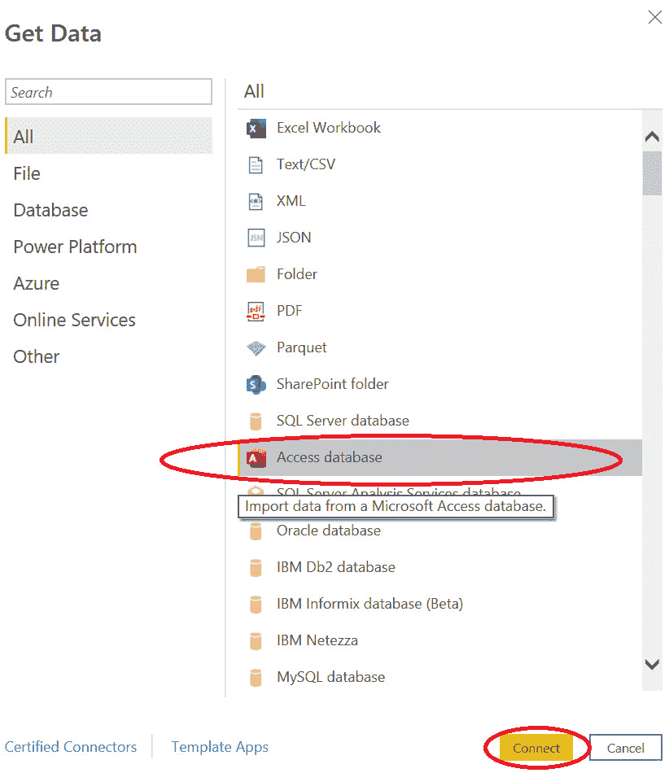

图 1.2 – Power BI 中的 Access 数据库连接器

1.  选择从 FAA 野生动物撞击数据库下载并解压的 **Access 数据库** 文件，命名为 **wildlife**：

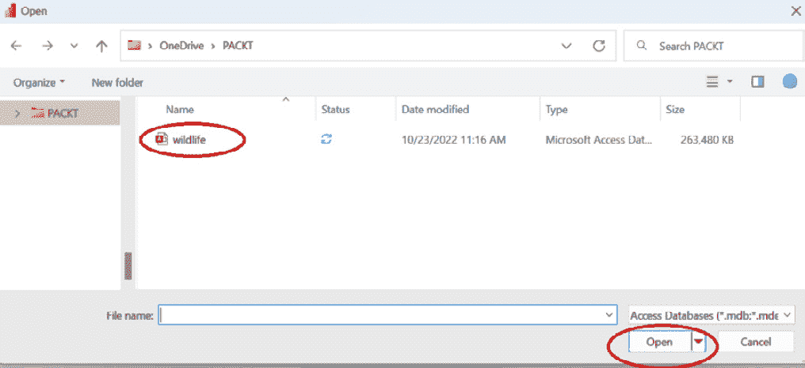

图 1.3 – wildlife 文件在 Power BI 中显示

1.  选择 **STRIKE_REPORTS** 表并点击 **转换数据**：

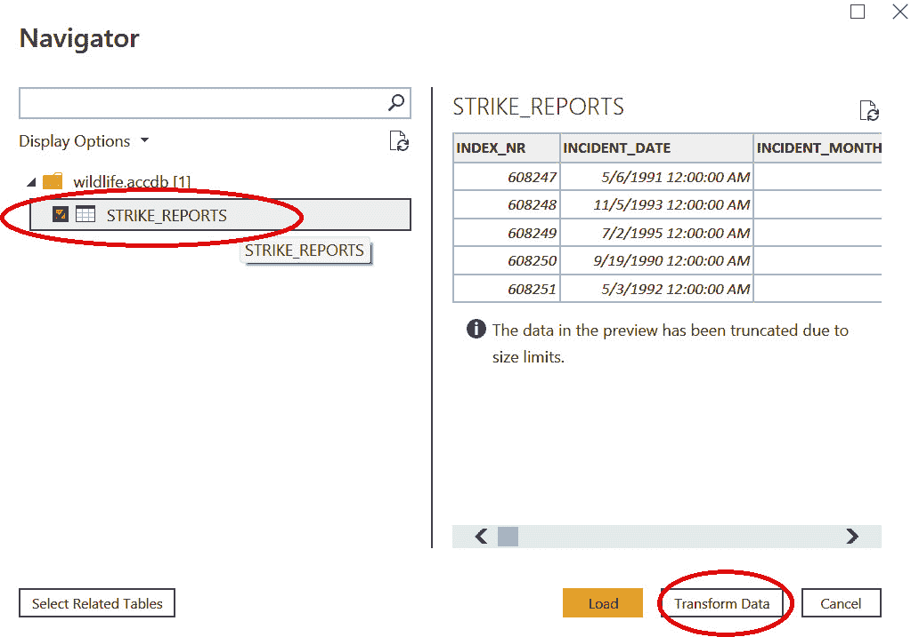

图 1.4 – 变换前数据预览

1.  Power Query 窗口将在 Power BI Desktop 中打开，并预览 FAA 野生动物撞击数据。在功能区，选择**数据预览**的**视图**标题，然后勾选**列质量**、**列分布**和**列概要**的复选框。这些功能将为数据预览提供一些见解，有助于您探索和理解数据：

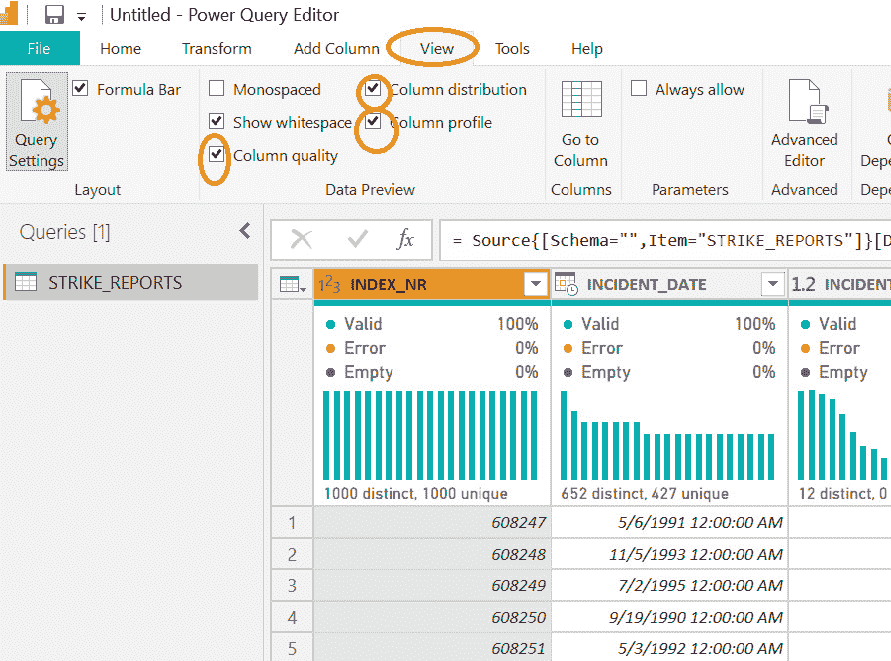

图 1.5 – Power Query 中的数据预览功能

在**图 1.5**中，请注意第一列**INDEX_NR**被突出显示。您可以看到，没有任何值是空的，没有错误，并且在**图 1.6**底部的**列统计信息**中，每个值都是唯一的整数。名称**INDEX_NR**揭示了这一点，但此列是每行数据的唯一标识符。

让我们再回顾 Power Query 中的另一列。请突出显示**TIME_OF_DAY**。如您在**图 1.6**中看到的那样，有四个不同的值，大约 12% 是空的。空值是此解决方案的重要考虑因素。非空值包括**Day**、**Dawn**、**Dusk**和**Night**等术语。空值意味着什么？是填写报告的人故意留空的吗？还是没有正确输入到系统中？您将在本书的后面重新讨论这个话题。

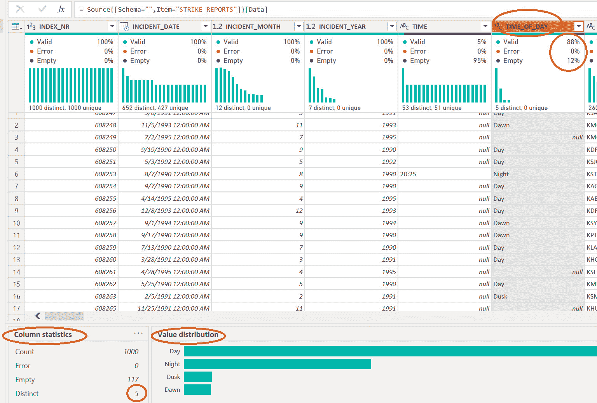

图 1.6 – 列统计信息有助于理解数据

由于 FAA 野生动物撞击报告数据中超过 100 列，我们不会在本章中讨论所有这些列。但话说回来，检查每一列是检查数据错误、空字段、值分布等的好方法。为了本章的目的，请打开与 FAA ZIP 文件一起提供的 `read_me.xls` 文件。第一个工作表是 `wildlife.accdb` 文件。大多数列属于以下类别之一：

+   详细说明与每个报告相关事件日期、时间和年份的日期和时间字段

+   关于事件的描述性信息，例如接触高度、纬度和经度、出发机场和航班号

+   关于飞机的描述性信息，例如所有权、飞机类型和制造商、发动机数量、发动机位置等

+   由于撞击造成的损害估计，如成本、调整通货膨胀的成本、飞机上的损害位置等

+   关于被飞机撞击的野生动物的信息，包括物种、大小、撞击数量等

一旦您浏览完报告数据，关闭桌面上的 `read_me.xlsx` 文档，然后按照以下步骤从 Power BI 连接到它。本书中使用的文档版本可以从 Packt GitHub 网站下载：[`github.com/PacktPublishing/Unleashing-Your-Data-with-Power-BI-Machine-Learning-and-OpenAI/tree/main/Chapter-01`](https://github.com/PacktPublishing/Unleashing-Your-Data-with-Power-BI-Machine-Learning-and-OpenAI/tree/main/Chapter-01)。

1.  在左侧面板中点击 **Excel 工作簿**：

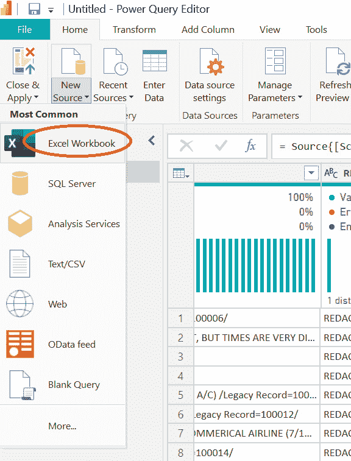

图 1.7 – Excel 工作簿是新的数据源

1.  从浏览器中选择 **read_me** 文件并点击 **打开**：

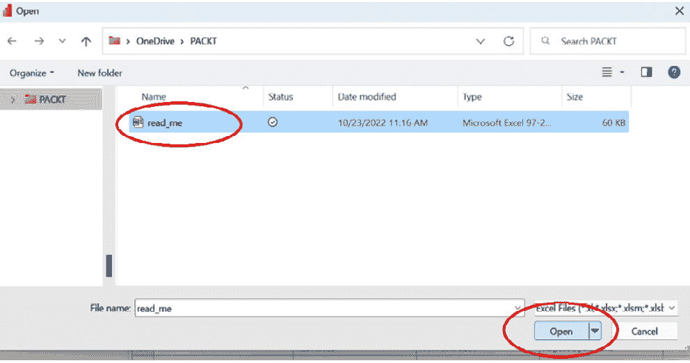

图 1.8 – Excel 文件准备在 Power Query 中打开

1.  打勾 **飞机类型**、**发动机代码**和**发动机位置**复选框。然后，点击 **确定**。

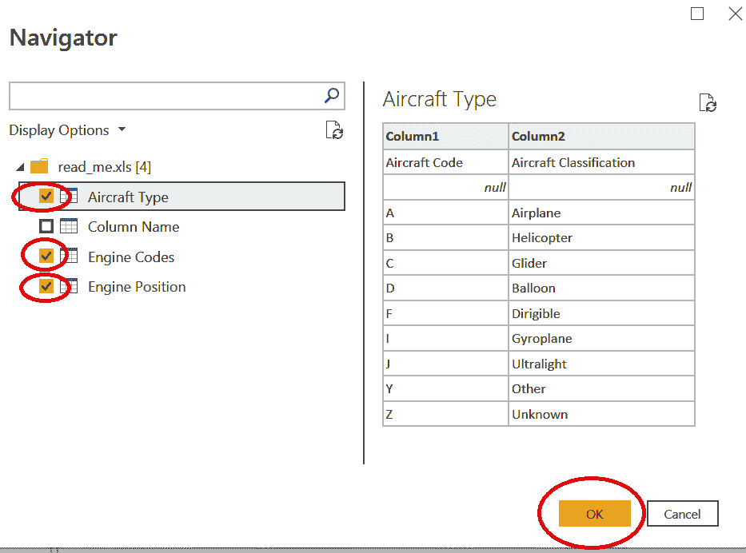

图 1.9 – Power Query 中的工作表可以单独选择

点击 **确定** 并导入三个工作表后，注意 **飞机类型**、**发动机代码**和**发动机位置**现在在 Power Query 中作为三个独立的数据表可用：

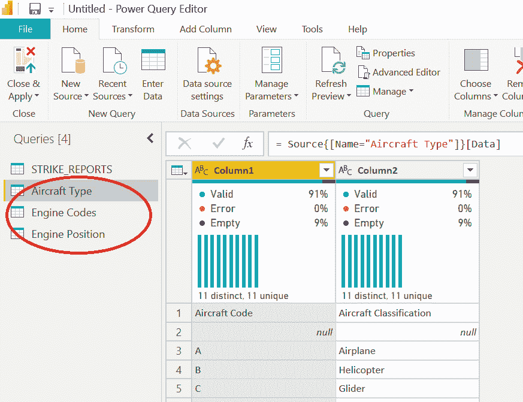

图 1.10 – 在 Power Query 中预览了三个新表格

三张表格包含关于 FAA 野生动物撞击报告数据中存在的值的描述性信息：

+   **飞机类型**：将飞机代码映射到描述，如飞机、直升机或滑翔机

+   **发动机代码**：关于发动机制造商和型号信息

+   **发动机位置**：关于飞机上发动机位置的详细信息

对于这三张表格，您会注意到有一些不必要的行和空白值。您将在本书的后续部分解决这些问题，因此在此阶段无需在 Power Query 中进行任何修改。

一旦您在 Power Query 中浏览了所有不同表格中的不同列，点击 **关闭并应用** 将数据导入 Power BI 并保存，如下图所示：

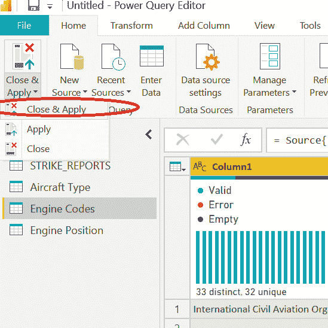

图 1.11 – 点击“关闭并应用”按钮将数据导入 Power BI

数据导入后，您可以将 Power BI Desktop 文件保存为 `.pbix` 文件。一个名为 *第一章* `Template.pbit` 的 PBIT 文件副本，可以填充数据然后保存为 PBIX，可以在以下 GitHub 链接找到：[`github.com/PacktPublishing/Unleashing-Your-Data-with-Power-BI-Machine-Learning-and-OpenAI/tree/main/Chapter-01`](https://github.com/PacktPublishing/Unleashing-Your-Data-with-Power-BI-Machine-Learning-and-OpenAI/tree/main/Chapter-01)。

# 审查解决方案的要求

现在，您已经探索了 FAA 野生动物撞击数据，您对可用于您解决方案的数据有了更好的了解。您从利益相关者那里得到的原始任务如下：

+   为领导提供工具，以便对 FAA 野生动物撞击数据进行交互式分析

+   寻找影响事件的因素的见解

+   对未来野生动物撞击事件进行预测

这些需求听起来相当模糊！现在，您对可用的数据有了更好的了解，是时候与利益相关者回过头来澄清这些需求了。您会问他们如下问题：

+   您想进行哪些类型的交互式分析？

+   您是否对受威胁的鸟类物种的影响感兴趣？

+   您是否想查看野生动物撞击导致的时间趋势，并比较机场和地区？

+   您是否想查看不同时间野生动物撞击的高度和频率？

+   理解与飞机大小、一天中的时间、季节、地理和高度等因素的相关性是否有用？

+   您是否对预测特定的风险或结果感兴趣？

关于为数据和分析项目收集需求，已经撰写了整本书，关于这个特定主题的讨论也可能非常广泛。为了保持这本书的可读性，让我们假设您与利益相关者的讨论导致了以下可交付成果的优先排序：

+   **分析报告**：查看时间趋势，如事件数量、事件位置、高度以及飞机类型和野生动物物种等细节

+   **预测损害**：当报告撞击时，预测是否会有与任何损害相关的成本

+   **预测大小**：当报告撞击时，预测撞击飞机的野生动物的大小

+   **预测高度**：对于野生动物撞击，预测事件的高度

现在，您回顾一下在您的数据探索努力中关于 FAA 野生动物撞击数据的笔记。在这样做的时候，您可以思考数据如何与用例相匹配。根据需求和您对数据的初步探索，您决定`wildlife.accdb`文件中的 FAA 野生动物撞击数据和`read_me.xls`文件中的表格（**发动机代码**、**飞机类型**和**发动机位置**）是项目初期阶段应包含的适当内容。

# 设计初步数据模型

在本章的早期，我们对数据建模做出了两个简单的假设：

+   大多数情况下，*星型模式*设计将为商业智能数据模型提供最有效的存储和查询性能

+   基本机器学习模型，例如您可以在本书中构建的模型，通常是用*扁平表*创建的

现在你已经掌握了底层数据和需求，是时候考虑你的 FAA 野生动物撞击数据解决方案的数据模型了。从逻辑上讲，你可以这样描述你的数据表：

+   (`wildlife.accdb`): 每一行代表一份提交的报告。数据表包含描述性值（日期、位置和类型）以及可以汇总和平均的值（高度和成本）。

+   (`read-me.xls`): 这包含有关可以与**STRIKE_REPORTS**关联的飞机发动机的信息。

+   (`read-me.xls`): 这包含有关可以与**STRIKE_REPORTS**关联的飞机的信息。

+   (`read-me.xls`): 这包含有关可以与**STRIKE_REPORTS**关联的飞机发动机位置的信息。

在这一点上，你将面临一些数据模型选择。无论你做出什么决定，有些人可能会质疑你的架构，因为没有完美的设计。根据最终用户如何使用数据，数据模型设计可能会改变。本书将展示一些用于 ML 模型与传统 BI 设计的数据模型设计差异。在 Power BI 中，你可以采取以下三种基本方法之一：

+   **扁平化**：你可以通过将**发动机代码**、**飞机类型**和**发动机位置**与**STRIKE_REPORTS**表连接，将所有数据扁平化到一个单独的表中。

+   **星型模式**：你可以构建一个真正的星型模式，其中**STRIKE_REPORTS**作为事实表，**发动机代码**、**飞机类型**和**发动机位置**作为维度表。**STRIKE_REPORTS**的一些其他数据也会被拆分到单独的维度表中。例如，**AIRPORT_ID**、**AIRPORT**、**STATE**和**FAAREGION**可以是单独的维度表。

+   **混合设计**：为了实用性和易用性，你可以使用扁平化和星型模式设计模式来构建混合设计。

让我们逐一查看这些内容。

## 扁平化数据

扁平化 FAA 野生动物撞击报告的数据将需要将**发动机代码**、**飞机类型**和**发动机位置**表连接到**STRIKE_REPORTS**表，以便所有内容都在一个大的扁平数据表中。结果将类似于以下内容：

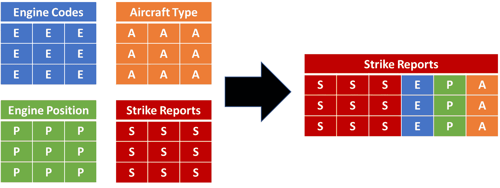

图 1.12 – 左侧的表合并成右侧的单个表

下表包含了一些，但不是全部，关于数据扁平化表优缺点的信息：

| **优点** | **缺点** |
| --- | --- |

|

+   简单性

+   无需进行代码连接

+   通常被数据科学家使用

+   可以很好地与列式数据库压缩

+   对于商业用户没有关系数据模型

|

+   重复的数据可能导致不高效的存储占用

+   高级逻辑查询的限制

+   对于解决方案未来变化和演化的灵活性较低

+   复杂的逻辑查询可能效率较低

|

图 1.13 – 扁平化表在 BI 中的优缺点

接下来，让我们看看星型模式。

## 星型模式

按照最佳实践构建的真正星型模式将包括**发动机代码**、**飞机类型**和**发动机位置**与**STRIKE_REPORTS**表之间的关系。它还会将**STRIKE_REPORTS**表的一部分拆分成更小的维度表。以下图表示了真正星型模式的方法。除了**位置**和**物种**之外，可能还需要从**STRIKE_REPORTS**表中拆分出更多的维度表，但这是一个示例，说明它可能看起来是什么样子：

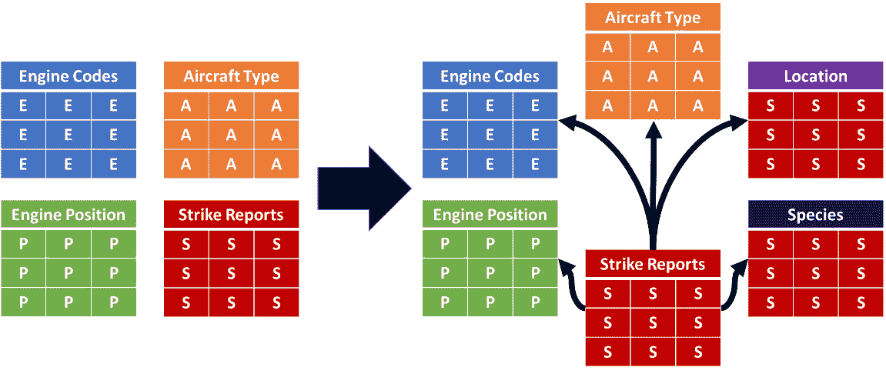

图 1.14 – 左侧的表组合成一个星型模式，部分数据被拆分到新的维度表中

以下表格包含了一些，但不是全部，关于真正星型模式设计的优缺点：

| **优点** | **缺点** |
| --- | --- |

|

+   表通常与业务逻辑一致

+   最小数据重复与高效查询的平衡

+   如果解决方案的范围扩大并引入了新的数据，通常可以扩展

+   传统上被认为是 BI 数据模型的黄金标准

|

+   与较老的工具相比，使用现代工具减少数据重复的好处影响较小

+   ETL 过程复杂

+   机器学习模型通常使用扁平的数据表进行训练

+   不总是能够很好地扩展到具有数十亿行的大型数据量

|

图 1.15 – 星型模式在 BI 中的优缺点

## 混合设计

对于 FAA 野生动物撞击数据，结合扁平设计和星型模式的特点也是一个选项。在本书撰写时，整个**STRIKE_REPORTS**表少于 300,000 行，且列数少于 100 列。只有两列包含冗长的自由文本，因此在使用 Power BI 时数据量不是问题。对于这个特定的用例，扁平模型和星型模式数据模型在数据存储需求上的差异很小。对于如此小的数据量，你可以设计数据模型以满足解决方案的需求，而无需引入那些对于包含数千万行或数百列自由文本字段的数据源的性能担忧。在交易表中保留的数据列，将用作分类，在技术上被称为**退化维度**。混合设计可能看起来像以下示例：

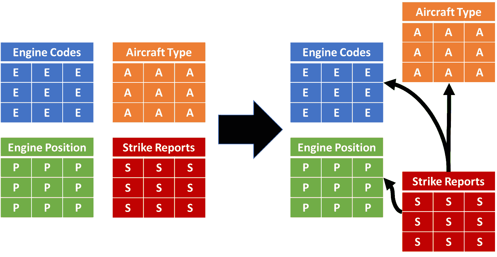

图 1.16 – 左侧的表经过增强和组合，形成了一个带有一些描述性数据的星型模式

以下表格包含了一些，但不是全部，关于混合设计的优缺点：

| **优点** | **缺点** |
| --- | --- |

|

+   快速原型设计

+   数据转换层中的逻辑较少

+   灵活的设计

|

+   可能不如传统的 BI 星型模式性能好

+   与大型扁平表相比，对用户来说有额外的逻辑复杂性

+   数据仍需要为机器学习进行扁平化处理

+   不太适合 BI 或 ML，但介于两者之间的折衷方案

|

图 1.17 – 混合设计的优缺点以及额外数据的考虑

在最终确定 FAA 野生动物撞击解决方案的初步逻辑设计之前，退一步思考数据和需求。你可以回顾本章早些时候的预期可交付成果，包括分析报告和对损害、大小和高度的预测。

除了你一直在使用的 FAA 野生动物撞击数据外，还有哪些数据可能对解决方案有用？获取这些数据需要多少努力？以下是一些你可以研究的例子：

| **额外** **数据源** | **努力** **程度** |
| --- | --- |
| 基于月份、季度、季节和节假日等聚合的日期表 | 容易 |
| 基于小时、上午/下午等聚合的时间表 | 容易 |
| 没有野生动物撞击的飞行数据可以提供飞行撞击百分比的基线 | 困难 |
| 可映射到野生动物撞击日期和时间的天气数据 | 困难 |
| 关于野生动物物种的额外数据，如体重范围、栖息地范围等 | 困难 |

图 1.18 – 解决方案的其他潜在数据源

额外的飞行、天气和野生动物数据可以为解决方案提供更大的分析和预测价值。然而，添加这些来源将需要相当多的努力，这超出了你的项目范围和本书的长度。如果初始项目进展顺利，你可以将来对这些选项进行改进。

在解决方案中添加时间表可能是有价值的，所以打开 Power Query 并再次查看 **TIME** 列。注意，95% 的条目都是空的：

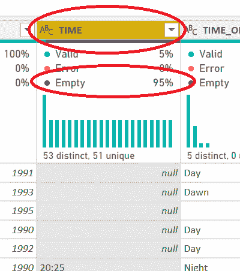

图 1.19 – TIME 的 95% 值为空

由于数据不完整，你决定在初始构建中省略时间表。

有没有这样一个日期表，你可以通过周、月、季度、年、节假日、周末等来汇总数据？查看 Power Query 中的 **INCIDENT_DATE** 列，它在预览中的每个条目都已填充：

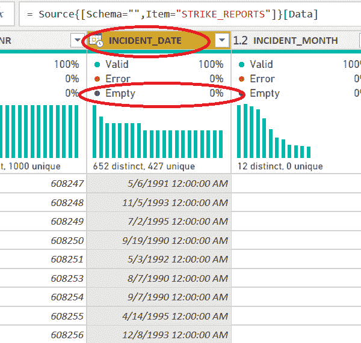

图 1.20 – INCIDENT_DATE 已完全填充日期值

**INCIDENT_DATE** 可以用作连接包含许多不同基于日期聚合的日期表的键。你决定为架构引入一个日期表。因此，初步数据模型现在将如下所示：

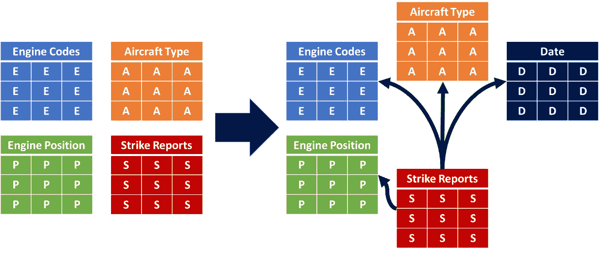

图 1.21 – 在初步数据模型中添加了日期表

日期表在源数据中不存在，但在你的报告模型中，它将允许你按日、周、月、季度、年、周末等切片和切块数据。当你探索未来章节中的数据时，它将添加新的方式来深入探索基于日期的趋势。日期表将在*第二章*中添加。

在本章的最后部分，我们将探讨在机器学习（ML）中还需要考虑哪些其他因素。

# 机器学习考虑因素

现在你已经创建了一个初步的数据模型，它将作为 Power BI 分析报告的基础，你开始思考创建用于与 Power BI 机器学习一起使用的数据表的过程。你需要为每个你训练、测试和部署的机器学习模型创建一个单一的数据表，其中包含扁平化的数据。

创建用于训练机器学习模型的数据表涉及将每个列视为你将要训练并用于预测的算法的特征，然后使用这些特征进行预测。例如，如果你想要创建一个预测某物是否为昆虫的机器学习算法，你需要`[六条腿 Y/N?]`、`[生命形式 Y/N?]`、`[眼睛数量]`和`[重量]`等列，以及一个将要预测的列，例如`[昆虫 Y/N?]`。每一行将代表被评估以进行预测以回答问题“这是昆虫吗？”的对象。

你决定按照以下顺序采取以下方法，以便你可以在 Power BI 中完成所有操作：

1.  在 Power BI 桌面 Power Query 中进行数据探索和初始数据模型创建。

1.  在 Power BI 中创建分析报告。

1.  Power BI 中的特征发现。

1.  在 Power Query 中创建训练数据集。

1.  将训练数据集移动到 Power BI 数据流。

1.  在 Power BI 数据流中训练、测试和部署 Power BI 机器学习模型。

此过程在*图 1*.*22*中显示。

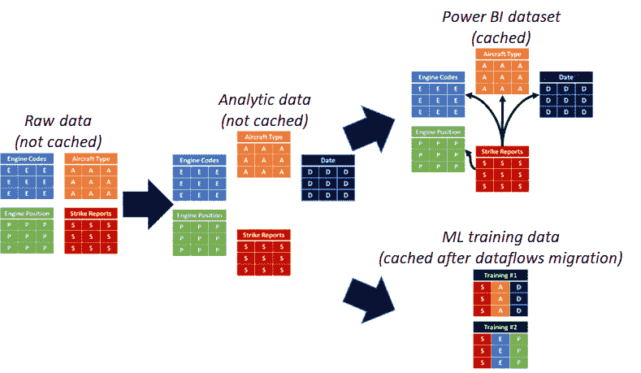

图 1.22 – 所有的 ETL（提取、转换、加载）将在 Power BI Power Query 和 Power BI 数据流中发生

Power BI ML 提供了三种不同的预测模型类型。这些类型在 Power BI 服务中定义如下：

+   **二元预测**模型预测是否能够实现某个结果。实际上，返回的预测是“是”或“否”。

+   **通用分类**模型预测超过两个可能的结果，例如*A*、*B*、*C*或*D*。

+   **回归**模型将预测一系列可能值中的数值。例如，它将根据类似的历史事件预测活动的成本。

作为你的初步规划的一部分，你考虑这些选项如何映射到你的利益相关者优先考虑的可交付成果：

+   **分析报告**：这个可交付成果将是一个 Power BI 分析报告，可能需要一些 Power BI AI 功能，但它不会是一个 Power BI ML 模型。分析报告将帮助您探索和确定适合 Power BI 机器学习模型的数据。

+   **预测损害**：预测野生动物撞击是否会导致损害是一个很好的二进制预测模型匹配，因为答案将有两个可能的结果：是或否。

+   **预测大小**：根据损害成本、损害位置、高度、年度时间和机场位置等因素预测撞击飞机的野生动物的大小，可能会预测出多个值，如*大型*、*中型*和*小型*。这一需求可能非常适合通用分类模型。

+   **预测高度**：这个可交付成果预测野生动物撞击发生的高度，并将该预测作为表示地面以上高度的数值。它可能非常适合回归模型，该模型预测数值。

无法确定 FAA 野生动物撞击数据是否支持这些特定的用例，但您只有尝试了才知道！发现是过程的关键部分。首先，您必须识别数据中可能具有预测价值的特征，然后在 Power BI 中训练和测试机器学习模型。只有到那时，您才会知道您项目可能有哪些类型的预测。

# 摘要

在本章中，您探索了您项目可用的数据，并回顾了将数据映射到利益相关者需求的后继选项。您审查了数据架构选项以满足 Power BI 中的商业智能和机器学习需求，并决定采用一种混合方法，将星型模式设计与扁平化数据相结合。您还制定了一个计划来探索、分析、设计、构建和部署您的解决方案。最后，您确定了三个在 Power BI 中使用预测机器学习模型的用例。

在下一章中，您将使用 Power BI 中的 Power Query 从 FAA 野生动物撞击数据库中摄取和准备数据。您将深入研究数据特征，决定您的设计需要什么，并构建一个灵活的基础，它将支持当前项目和未来的迭代和变化。您在 Power Query 中的方法将支持 Power BI 中的商业智能分析和 Power BI ML 中的预测分析。
