# 使用 Power BI 探索数据并创建语义模型

*第二章*是一个繁琐的过程，需要仔细检查 FAA 野生动物打击原始数据，识别你想要用于分析的列，然后设置查询以转换数据及其元数据，以便进行分析和机器学习。然而，这是一项重要的工作。

现在，你已经准备好创建一个`列名`，或者`column_name`可能会通过语义层显示为**列名**。此外，如**年度累计销售额**等运行时计算的逻辑通常存在于语义层中。在 Microsoft Power BI 生态系统中，语义层存在于 Power BI 数据集中。

Power BI 数据集将包含*第二章*中查询创建的所有数据，但会添加自定义列、表之间的关系以及计算度量，这些将帮助你聚合列，以便进行数学运算，以支持你的分析。回到*第一章*中**审查解决方案需求**部分，这将是你被要求交付的**分析报告**的基础。

一旦你使用一些基本的计算度量创建了 Power BI 数据集，你将开始构建用于 Power BI 中机器学习的数据基础。这将作为**预测损害**、**预测尺寸**和**预测高度**机器学习模型的基础，这些模型是来自*第一章*中**审查解决方案需求**部分的必需要求。

# 技术要求

对于本章，你需要以下内容：

+   Power BI 桌面版 2023 年 4 月或更高版本（无需许可证）

+   来自 FAA 野生动物打击数据文件，可以从 FAA 网站或通过以下链接的 Packt GitHub 站点获取：[`github.com/PacktPublishing/Unleashing-Your-Data-with-Power-BI-Machine-Learning-and-OpenAI/`](https://github.com/PacktPublishing/Unleashing-Your-Data-with-Power-BI-Machine-Learning-and-OpenAI/)

# 设计表之间的关系

在 Power BI 数据集中，表之间的关系决定了涉及两个表数据的查询是如何生成的。如果你已经参加了 Power BI 的入门课程，例如*一天构建仪表板*，了解关系是 Power BI 开发的基础技能。回到*第二章*，你确定了以下键值以建立关系：

+   `日期`列与`打击报告`表中的`事件日期`列相匹配

+   `飞机代码`与`飞机类别代码`在`打击报告`表上相匹配

+   `制造商代码`和`型号代码`是复合键，与`打击报告`表中的`AMA`和`AMO`相匹配

+   `发动机代码`映射到`打击报告`表中的四列——`发动机 1 位置代码`、`发动机 2 位置代码`、`发动机 3 位置代码`和`发动机 4 位置代码`

让我们继续确保所有这些表都存在适当的关键值！

您可以从*第二章*的 PBIX 文件中断点继续，或者使用本章内容的完成版进行跟随。您可以从 Packt GitHub 网站文件夹的*第三章*下载文件的 PBIT 版本：[`github.com/PacktPublishing/Unleashing-Your-Data-with-Power-BI-Machine-Learning-and-OpenAI/tree/main/Chapter-03`](https://github.com/PacktPublishing/Unleashing-Your-Data-with-Power-BI-Machine-Learning-and-OpenAI/tree/main/Chapter-03).

## 日期表

您已经创建了一个名为**日期信息**的**日期**表，其中包含一个名为**日期**的字段，包含 1990-2024 年之间的每个唯一日期值。在 Power Query 中，您会在**列统计信息**中看到没有空白值，每个值都是唯一的且不重复。**日期**是**日期**表的主键。

对于**打击报告**表，**事件日期**是映射到**日期**表的外键值。该列表示报告野生动物打击发生的日期。该列也完全填充了有效数据。

由于**日期**表包含有效的主键，并且**打击报告**表中的**事件日期**是一个有效的**日期**字段，因此您不需要进行任何额外的转换。这些列在数据集中已准备好建立关系！

## 飞机类型信息

在**飞机类型信息**表中，您会看到一个名为**飞机代码**的文本列。每一行包含一个唯一字母，用于标识该行。**飞机分类**是另一列，提供了飞机类型的描述。如果处理极大量的数据，整数键值是一个最佳实践。然而，由于总数据量是可管理的，您可以使用字符文本值作为**飞机类型**表的主键。

**打击报告**表包含一个名为**飞机类别代码**的对应列。您左键单击列名旁边的箭头并选择**加载更多**以查看表中所有可能的唯一值。您会发现有值注册为**（null）**，这实际上是空白，以及四个字母的值**NULL**，这是一个文本条目：

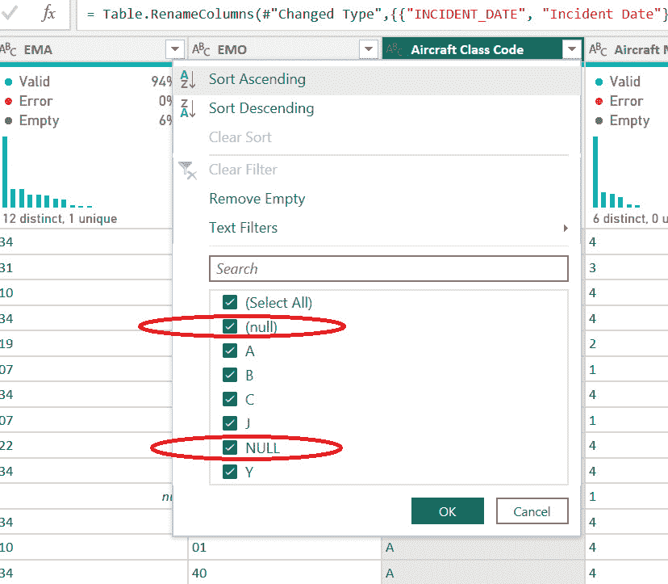

图 3.1 – 展示(null)和 NULL 文本值的屏幕截图

**NULL**文本值在飞机类型信息查询中不存在。它与**(null)**不同，因为**NULL**包含实际的文本，而**(null)**是一个空值。如果你对**(null)**或**NULL**文本值进行筛选，你会注意到包含这些值的行似乎存在差异。大多数空白**(null)**值出现在未知航班撞击野生动物的行上，并且许多列都是空的，而一些**NULL**文本值包含**航班**号码。

当你构建用于与 Power BI ML 一起使用的数据时，你将想要删除或替换所有空白值，因为 ML 模型通常需要一个不包含空值的结构。Power BI 数据集仍然可以与空外键值一起工作，但这种方法并不理想。你决定向飞机类型信息查询中添加两行新数据，一行用于**NULL**文本值，另一行用于显示为**(null)**的空白值。你还需要替换打击报告查询中的空白值。以下是你需要执行的步骤：

1.  右键单击`blank`的`null`的`blank`。

1.  在 Power Query 的**主页**选项卡上，选择**获取数据**。将新表命名为**飞机类型添加数据**。创建两列，**飞机代码**和**飞机分类**。

1.  在第 1 行中为两列输入`blank`，在第 2 行中为两列输入`NULL`。在点击**确定**之前，你的表格应该看起来像这样：

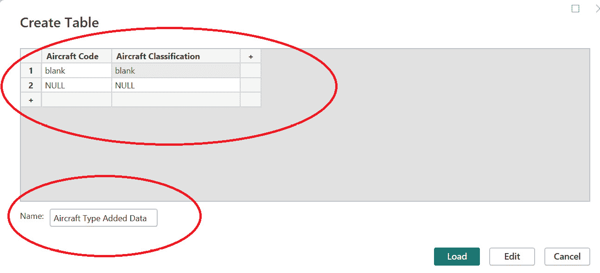

图 3.2 – 为飞机类型添加新数据以处理空白值和文本值 NULL

1.  在**查询**面板中右键单击新查询，并将其移动到**原始数据**组。再次右键单击它，取消选中**启用加载**。Power Query 现在应该看起来像这样：

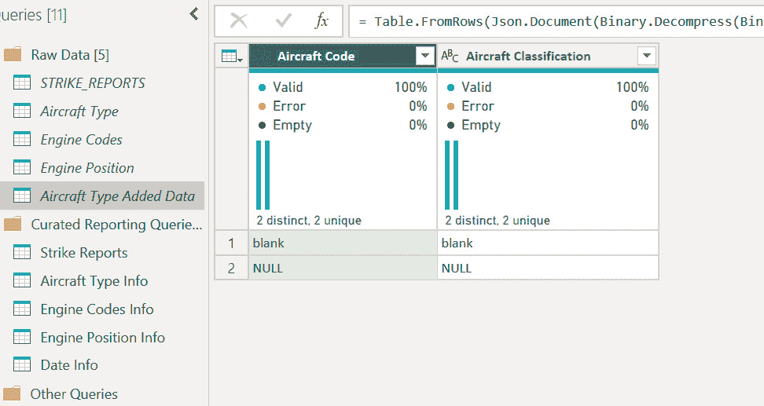

图 3.3 – 添加到原始数据组的新数据，这些数据将不会加载到数据集中

1.  左键单击**飞机类型信息**查询。在 Power Query 选项卡下，在**主页** | **合并**中，选择**追加查询** | **追加查询**。追加**飞机类型添加数据**查询。现在，你的**飞机类型信息**查询应该看起来像这样：

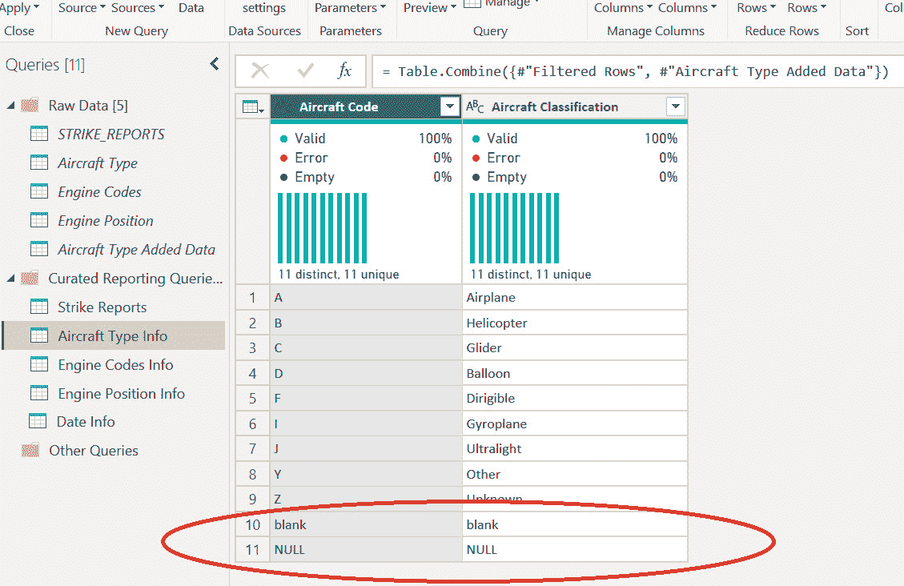

图 3.4 – 添加到飞机类型信息查询的新行

现在，**打击报告**查询和**飞机类型信息**查询都将具有引用完整性，这意味着当你填充数据集时，**打击报告**表上的每个键值都将与**飞机类型信息**表上的值匹配。**飞机类型信息**查询已准备就绪！

## 发动机代码信息

如前所述，你已经确定**制造商代码**和**型号代码**是复合键，与**打击报告**查询中的**AMA**和**AMO**相匹配。对于**引擎代码信息**查询，你观察到**制造商代码**和**型号代码**的组合产生了一个唯一的行定义。在**打击报告**查询中，你浏览**AMA**和**AMO**列的值，发现两个列中都有空白**(null**)值，还有一些无效值，这些值不会与**引擎代码信息**查询匹配。你评估了几种处理这些差异的选项：

+   通过在**引擎代码****信息**查询中添加新行，来考虑所有不完整和不匹配的值。

+   将**引擎制造**数据拆分为一个单独的查询，这将是一个新的维度。

+   在`不完整或缺失`中添加新行。将为不完整或缺失的复合键值在**引擎代码信息**查询中添加一个新的外键。

虽然第一个和第二个选项遵循最佳实践，但你决定在第一轮开发中采用第三个选项（将所有不完整条目和不匹配值放入一个单独的类别中）。如果你后来确定更好的匹配将以有意义的方式改善你的结果，你可以在未来的开发轮次中回过头来。选项一和二将需要大量的努力，而现在，你怀疑这些好处是否足以证明投入时间的价值。你有一个截止日期要遵守！由于 Power Query 和 Power BI 的灵活性，未来改变架构仍然是一个有效的选项。

首先，向**引擎代码信息**查询中添加新行。在**原始数据**组中创建一个新的查询，命名为**引擎代码添加数据**，就像你为**飞机类型****添加数据**所做的那样：

1.  在 Power Query 的选项卡上，选择**获取数据**。将新表命名为**引擎代码添加数据**。创建四个列：**制造商代码**、**型号代码**、**引擎制造商**和**引擎型号**。

1.  在第 1 行中，为所有四个列输入`不完整或缺失`。在点击**确定**之前，你的表格应该看起来像这样：

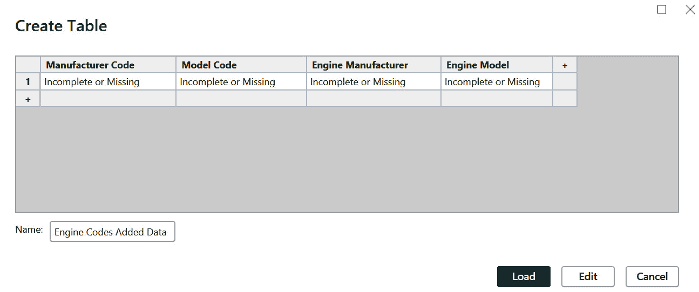

图 3.5 – 在引擎代码报告中，不完整或缺失的关键值可以被归入不同的类别

1.  在**查询**面板中右键点击新的查询，并将其移动到**原始数据**组。再次右键点击，取消勾选**启用加载**。

1.  左键点击**引擎代码信息**查询。在 Power Query 选项卡下，在**主页**|**组合**中，选择**追加查询**|**追加查询**。追加**引擎代码添加数据**查询。现在，你的**引擎代码信息**查询包含了额外的数据行。Power Query 现在应该看起来像这样（注意**不完整或缺失**现在在表中）：

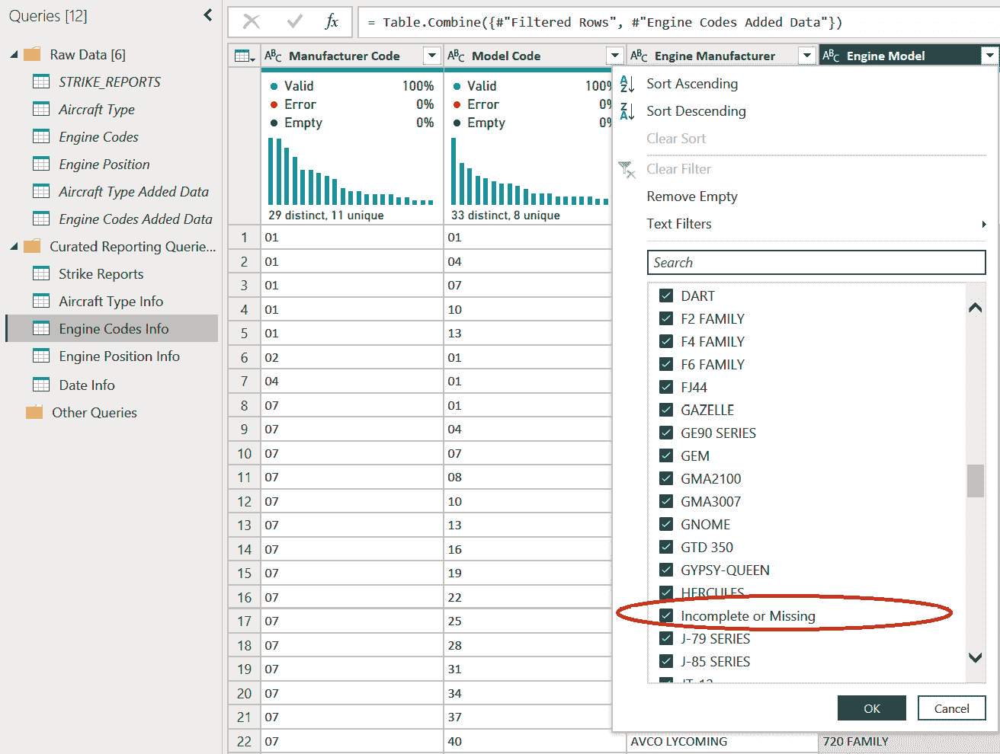

图 3.6 – Engine Codes Info 查询现在有一个用于缺失和不完整键值的桶

1.  Power BI 数据集需要一个单独的键列，并且不支持复合键。您需要向**Engine Codes Info**查询添加一个单独的主键。在 Power Query 功能区，选择**添加列** | **常规** | **索引列** | **从 1**。将新的**索引**列重命名为**Engine Codes Info Key**。现在**Engine Codes Info**查询看起来是这样的：

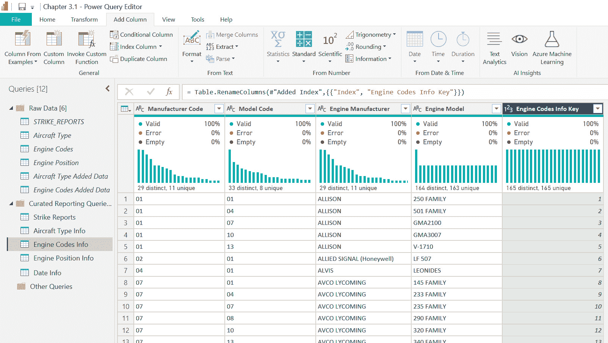

图 3.7 – 将整数主键值添加到 Engine Codes Info 查询中

1.  现在，您将为**Strike Reports**查询添加相应的外键。在 Power Query 中的**Strike** **Reports**查询上，选择**主页** | **组合** | **合并查询** | **合并查询**。选择**Engine Codes Info**作为第二个表。在**Strike Reports**表上点击**EMA**，在**Engine Codes Info**表上点击**制造商代码**。您将看到超过 50%的行找到了匹配项：

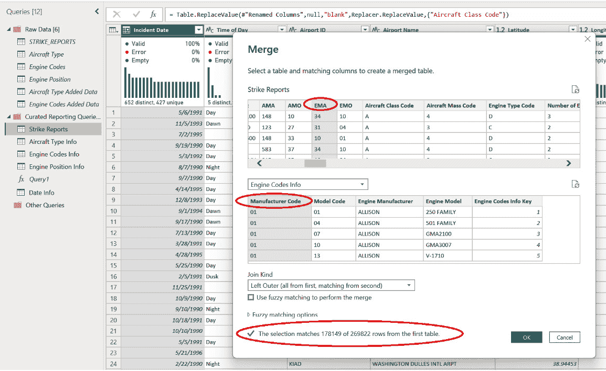

图 3.8 – Strike Reports 中的 EMA 值并非全部在 Engine Codes Info 查询中找到匹配项

1.  由于表通过复合键匹配，**EMA**和**EMO**与**制造商代码**和**型号代码**匹配，您在**Strike Reports**表上按 Ctrl 并点击**EMO**，对于**Engine Codes Info**表点击**型号代码**。与仅使用**制造商**键相比，您会丢失一些匹配项，这可以证明将**制造商**信息拆分为单独的维度表是合理的。然而，由于差异很小，您决定将拆分**制造商**作为单独的维度添加到开发的后备计划中。如果您没有找到任何匹配项，请检查两个表中的**EMA**和**EMO**列是否为文本值，因为数据类型需要相同。按照当前计划进行仍将给出相当相似的匹配率：

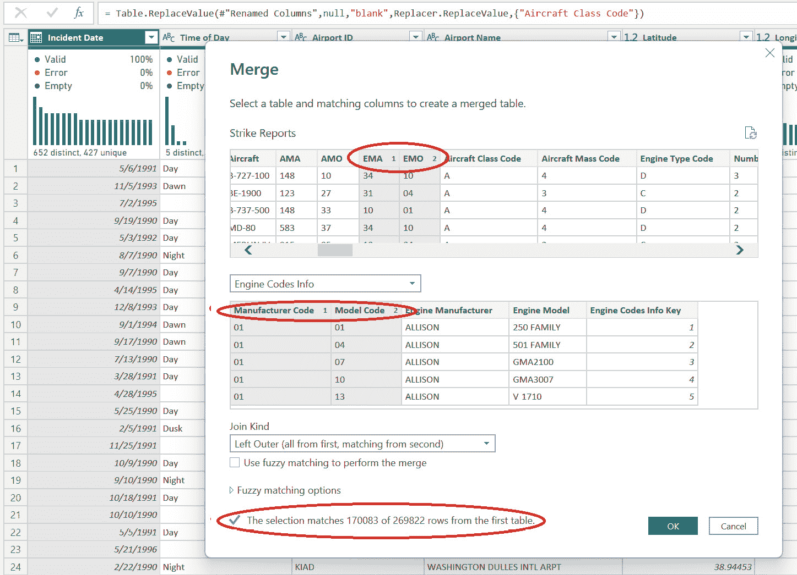

图 3.9 – 复合键可以将 Strike Reports 和 Engine Codes Info 关联起来，但并非每一行都能找到匹配项

1.  点击**确定**。您将看到在**Strike Reports**中添加了一个名为**Engine Codes Info**的新列。点击箭头并仅选择**Engine Codes** **Info Key**：

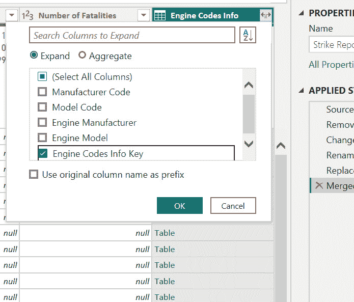

图 3.10 – 在 Strike Reports 中为 Engine Codes Info 添加了外键

1.  点击**确定**。现在，您数据集中**Engine Codes Info**表有一个单独的外键值，**Engine Codes Info Key**。

让我们继续下一步。

## 发动机位置信息

您之前确定**发动机位置信息**表上的**发动机代码**是该表的唯一键，**野生动物打击**查询中的所有四个列（**发动机 1 位置代码**、**发动机 2 位置代码**、**发动机 3 位置代码**和**发动机 4 位置代码**）都是外键，引用发动机位置。您重新审视初步数据模型，该模型包括**发动机位置信息**作为维度表，引用**打击报告**作为事实表。由于**发动机位置信息**表上没有单个外键引用**打击报告**表上的单个主键，因此可以以几种不同的方式处理维度设计，如下所示：

+   一个单独的事实表，为每个发动机位置有一个单独的行。

+   将现有事实表的粒度更改为为每个发动机位置有一个单独的行。

+   为**打击报告**表上的四个外键列中的每一个添加一个单独的**发动机位置信息**副本。

+   在**发动机位置信息**和**打击报告**表之间添加不活动的关联，可以使用 DAX 表达式语言交互式地切换。

如果要对发动机位置执行重要的分析并且您正在构建复杂的星型模式设计，第一个选项可能是一个有效的选择。第二个和第三个选项在逻辑上可能可行，但会给您的结构增加不必要的复杂性和冗余。记住，您将执行分析以使用 Power BI 中的 ML 构建预测模型。保持**打击报告**表上的列的当前格式将很好地用于构建用于 ML 目的的查询。您知道 Power BI ML 与简单扁平的数据表配合得最好，其中每个四个列都是数据的潜在特征。您决定选择第四个选项，因为它最适合您的 ML 用例，并且不会给设计增加冗余或不必要的复杂性。

您查看**打击报告**表中的**发动机 1 位置代码**、**发动机 2 位置代码**、**发动机 3 位置代码**和**发动机 4 位置代码**列中的数据。这四个列与您之前审查的**飞机类别代码**列类似，都具有**（null）**条目，实际上为空白，以及四个字母的**NULL**值，这是一个文本条目。您可以通过为**发动机位置信息**查询中的**空白**和**NULL**条目添加两个新行以类似方式处理此场景：

1.  右键单击每个**空白**的**替换为**。现在，所有空值都将包含单词**空白**。

1.  在 Power Query 的选项卡上选择**获取数据**。将新表命名为**发动机位置添加数据**。创建两个列，**发动机代码**和**发动机位置**。

1.  在第 1 行中为两列输入`blank`，在第 2 行中为两列输入`NULL`。

1.  在**查询**面板中右键单击新查询，并将其移动到**原始数据**组。再次右键单击它，并取消选中**启用加载**。Power Query 现在应如下所示：

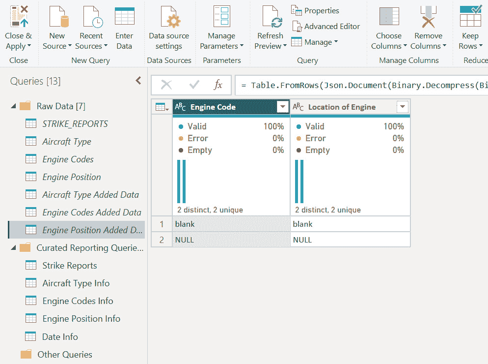

图 3.11 – 新数据以处理发动机位置中的空白和 NULL 文本值

1.  左键单击**发动机位置信息**查询。在 Power Query 功能区中，在**主页** | **组合选择追加查询** | **追加查询**下，追加**发动机位置添加数据**查询。现在您的**发动机位置信息**查询应如下所示：

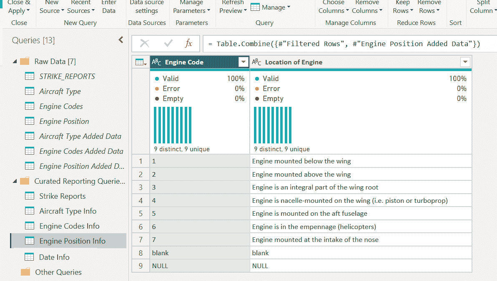

图 3.12 – 现在可以匹配空白行和 NULL 文本值

您一定会注意到，尽管使用整数值作为主键和外键是最佳实践，但 Power BI 具有灵活性和性能来处理此解决方案中作为键列的文本值。在您的工作的这个阶段，用整数值替换这些表上的所有键值将引入不必要的复杂性。

到此为止，您已准备好开始构建您的 Power BI 数据集！

# 构建 Power BI 数据集

您回顾了之前努力的初步数据模型设计，并注意到您已经接近一个分叉点，其中将填充 Power BI 数据集的关系分析数据可能与 Power BI 中用于机器学习的扁平化数据存在差异：

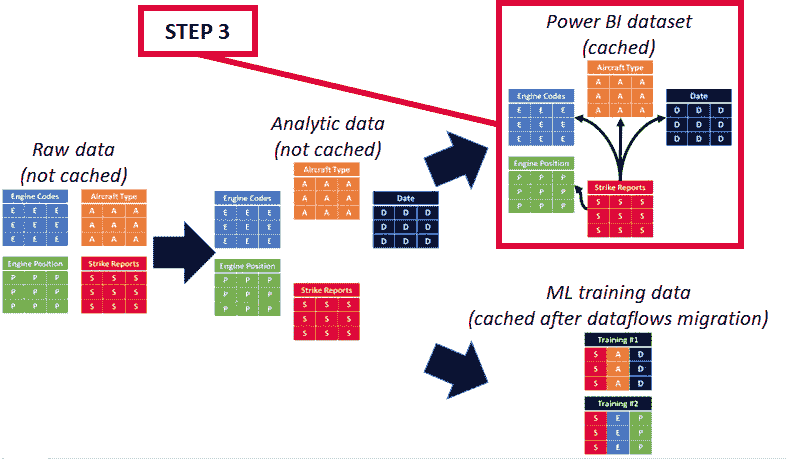

图 3.13 – 您现在将填充 Power Query 查询以用于 Power BI 数据集

为了使您的工作既有序又为未来的更改优化，您决定在 Power Query 中创建一个新的组，该组将包含 Power BI 数据集的表。您注意到，当处理极大量的数据或复杂的数据模型时，避免 Power Query 中的复杂性通常是最佳实践。然而，考虑到您数据量、复杂性和整体用例，为项目的不同部分有单独的组是有意义的：

1.  在**查询**中创建一个新的组，称为**精选数据集表**。

1.  右键单击每个**打击报告**、**飞机类型信息**、**发动机代码信息**、**发动机位置信息**和**日期**查询，并选择**引用**。

1.  将每个新查询移动到**精选数据集** **表**组。

1.  将查询重命名为**打击报告事实**、**飞机类型维度**、**发动机代码维度**、**发动机位置维度**和**日期维度**以提高可读性。

1.  在**精选报告查询**组中，右键单击每个查询并取消选中**启用加载**。这些查询不需要导入并缓存到 Power BI 中。

Power Query 现在应如下所示：

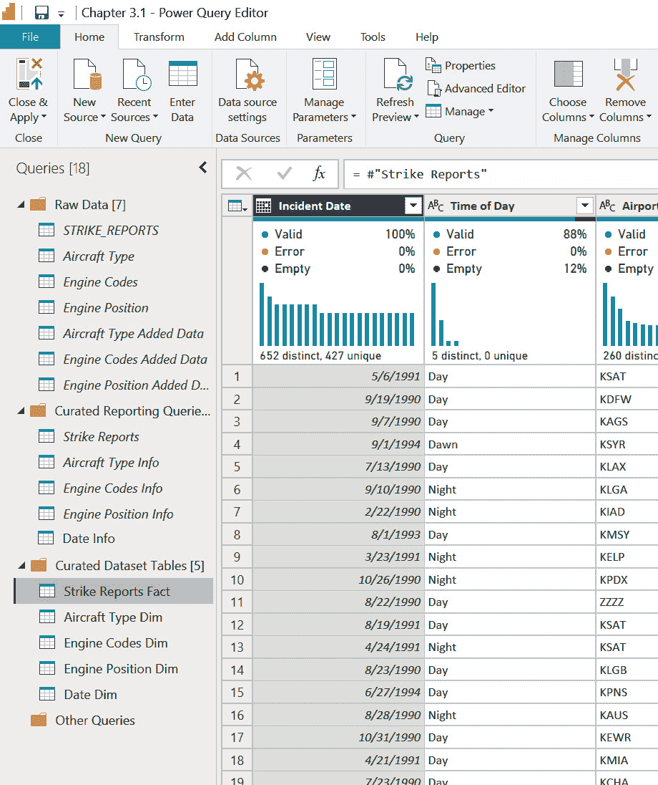

图 3.14 – 将作为 Power BI 数据集中的表填充的查询

现在，是时候让你的数据集起飞了！首先，你需要完成以下步骤来构建你的 Power BI 数据集：

1.  从 Power Query 导入并处理**野生动物空袭**数据查询。

1.  在事实表和维度表之间创建关系。

1.  清理元数据和调整设置。

## 从 Power Query 导入并处理野生动物空袭数据查询

你将运行完整查询并导入你的数据集的**野生动物空袭**数据：

1.  在 Power Query 功能区，选择**主页** | **关闭** | **关闭并应用** | **关闭并应用**。你的数据集将填充使用 Power Query 转换导入的数据。

1.  数据导入后，Power Query 关闭，你将进入 Power BI Desktop 的主界面。

1.  在应用程序的左侧，点击**模型**视图，以易于阅读的方式排列表：

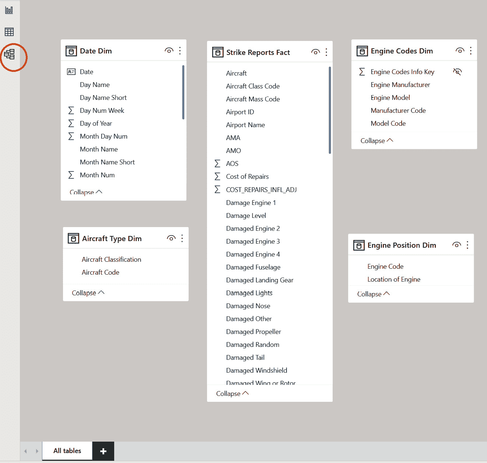

图 3.15 – 在模型视图中排列数据集表

## 在事实表和维度表之间创建关系

接下来，你将在数据表中创建关系。在**日期维度**表中，将**日期**列拖放到**空袭报告事实**表的**事件日期**列上。Power BI 将显示如下：

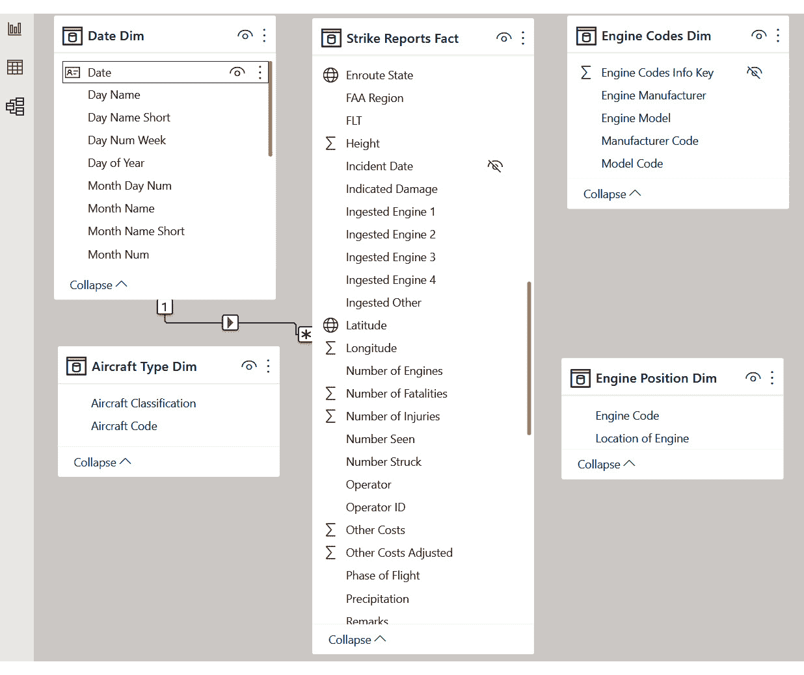

图 3.16 – 空袭报告事实与日期维度之间已创建关系

双击关系线，可以看到关系被确定为多对一，交叉过滤方向为**单一**。关系线上的箭头表示**日期维度**表可以过滤**空袭报告事实**表，但不能反过来。**使此关系生效**框也已勾选：

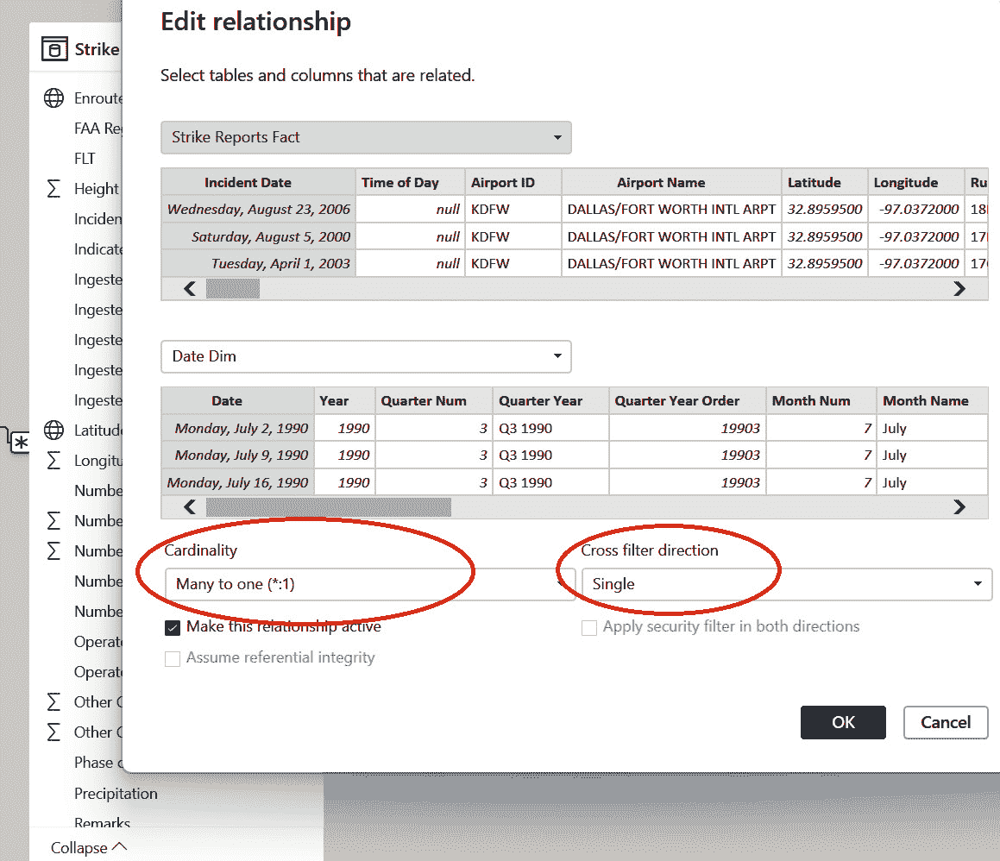

图 3.17 – 基数和过滤方向设置为多对一和单一

通过拖放剩余的列到**空袭报告事实**表来重复此过程：

| **源表（列）** | **目标表（列）** | **基数** | **交叉** **–** **过滤方向** | **使此关系生效** |
| --- | --- | --- | --- | --- |
| 空袭报告事实（飞机类别代码） | 飞机类型维度（飞机代码） | 多对一（事实到维度） | 单一（维度到事实） | 是 |
| 空袭报告事实（发动机代码信息键） | 发动机代码维度（发动机代码信息键） | 多对一（事实到维度） | 单一（维度到事实） | 是 |
| 空袭报告事实（发动机 1 位置代码） | 发动机位置维度（发动机代码） | 多对一（事实到维度） | 单一（维度到事实） | 是 |
| 击中报告事实（发动机 2 位置代码） | 发动机位置维度（发动机代码） | 多对一（事实到维度） | 单一（维度到事实） | 否 |
| 击中报告事实（发动机 2 位置代码） | 发动机位置维度（发动机代码） | 多对一（事实到维度） | 单一（维度到事实） | 否 |
| 击中报告事实（发动机 2 位置代码） | 发动机位置维度（发动机代码） | 多对一（事实到维度） | 单一（维度到事实） | 否 |

图 3.18 – 击中报告事实表与维度表之间的关系设置

您的 Power BI 模型视图现在应该看起来像这样：

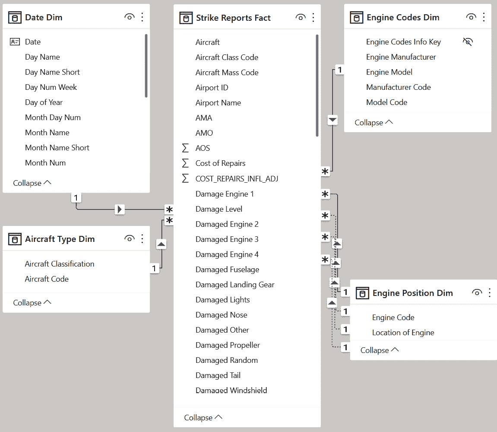

图 3.19 – Power BI 数据集完成的关联设计

表之间的关系现在已定义并完成。

## 清理元数据和调整设置

接下来，您将进行清理元数据，以便分析报告的最终用户可以轻松理解数据集的内容。此过程将涉及以下任务：

+   隐藏不必要的列

+   调整**汇总**和**数据类别**设置

+   调整**日期维度**表的设置

### 隐藏不必要的列

默认情况下，作为外键或代理主键的列仍然是报告开发人员和查看者可浏览的解决方案的一部分。您可以通过隐藏这些列的可见性来隐藏它们，因为它们是关系数据集的一部分，但在报告中没有实际用途。在屏幕右侧的**字段**面板上，右键单击这些列并选择**在** **报告视图中** **隐藏**：

| **要隐藏的（列）表** |
| --- |
| 发动机代码维度（发动机代码信息键） |
| 击中报告事实（发动机代码信息键） |
| 击中报告事实（事件日期） |
| 击中报告事实（飞机类别代码） |

图 3.20 – 报告中不需要的列被隐藏

### 调整汇总、数据类别、格式和排序依据设置

Power BI 为影响报告数据显示和聚合的数据列提供设置。**汇总**设置确定数值是否将添加/平均/最小/最大，或者它们是否不打算用于数学。**不汇总**设置将确保默认情况下数值不会被汇总。**数据类别**设置将确定当数据添加到报告时，数据在地图、URL 等上下文中的显示方式。当您突出显示一个列时，**汇总**和**数据类别**在 Power BI 数据视图选项卡上的**列工具** | **属性**。**格式**也在选项卡上配置，并确定页面上的显示特征，如小数点。**排序依据**确定一个列以排序另一个列，例如使用数字值 1-12 对数据可视化中的 1 月到 2 月进行排序。您在此解决方案中使用以下列设置：

| **表（列）** | **汇总** | **数据类别** | **格式** | **排序依据** |
| --- | --- | --- | --- | --- |
| `Strike Reports` `Fact (Latitude)` | 不汇总 | 纬度 | 具有七位小数的十进制数 |  |
| `Strike Reports` `Fact (Longitude)` | 不汇总 | 经度 | 具有七位小数的十进制数 |  |
| `Strike Reports` `Fact (State)` | 不汇总 | 州或省 | 文本 |  |
| `Strike Reports Fact (``Enroute State)` | 不汇总 | 州或省 | 文本 |  |
| `Date (``Quarter Year)` | 不汇总 |  | 文本 | **Date (****Quarter Num)** |
| `Date (``Month Name)` | 不汇总 |  | 文本 | **Date (****Month Num)** |
| `Date (Month` `Name Short)` | 不汇总 |  | 文本 | **Date (****Month Num)** |
| `Date (``Month Year)` | 不汇总 |  | 文本 | **Date (Month** **Year Order)** |
| `Date (``Week Year)` | 不汇总 |  | 文本 | **Date (Week** **Year Order)** |
| `Date (``Day Name)` | 不汇总 |  | 文本 | **Date (Day** **Num Week)** |
| `Date (Day` `Name Short)` | 不汇总 |  | 文本 | **Date (Day** **Num Week)** |

图 3.21 – 列的分类、汇总、格式和排序设置

当您构建分析报告并确定 Power BI 中机器学习（ML）的合适特征时，您可能需要修改更多设置并添加到这个列表中。

### 调整日期维度表的设置

将**日期维度表**指定为官方日期表将解锁 Power BI 中的**时间智能**等能力。通过在**数据**视图中的**表工具** | **日历** | **标记为日期表**导航，并将**日期**作为解决方案的官方日期列进行标记，可以完成将**日期维度表**标记为官方日期表的操作。

在 Power BI 数据集中构建了关系模型的基础后，您可以继续构建运行时计算。您已经以所需的方式设置了数据模型，但为语义层添加一些用于数学运算的逻辑将使您能够通过分析深入挖掘。

# 向您的 Power BI 数据集添加度量

作为本章的最终活动，您将向 Power BI 数据集添加一些基本度量。度量不是存储在数据表的表中，而是在运行时在报告中。这些度量将用于进行数学运算，例如报告总数、平均损害成本金额、平均接触高度计算等。目前，您可以选择一些基本度量，这将为您分析提供一个起点。在未来章节中，您可以在发现数据中的新视角时添加更多度量。

可以使用 DAX 表达式语言添加度量，这是 Power BI 的关键技能。对于熟悉在 Excel 中编写公式的任何人来说，大多数公式都将相当简单。

在高亮显示**打击报告事实表**时，在 Power BI 的**数据**视图中添加以下度量：

| **名称** | **DAX 公式** | **描述** |
| --- | --- | --- |
| 事故 | `事故 = COUNTROWS('Strike Reports Fact')` | 此公式将计算报告的总事故数 |
| 平均速度 | `平均速度 =` `AVERAGE([Speed])` | 在碰撞时刻的事故平均速度 |
| 平均高度 | `平均高度 =` `AVERAGE([Height])` | 在碰撞时刻的事故平均高度 |
| 维修总成本 | `维修总成本 = SUM([Cost of Repairs])` | 所有维修成本的总和 |
| 维修平均成本 | `维修平均成本 = SUM([Cost of Repairs])` | 所有维修成本的平均值 |
| 有成本的事故 | `有成本的事故 = CALCULATE([事故],FILTER('Strike Reports Fact',[Cost of Repairs] > 0))` | 导致产生成本的事故数量 |
| 有成本的百分比事故 | `有成本的百分比事故 = DIVIDE([有成本的事故],[事故])` | 导致产生成本的事故的百分比 |

图 3.22 – 计算度量值和相应的 DAX 表达式

在您探索数据的过程中，您可能会向您的列表中添加更多度量值。在进入下一个分析阶段之前，前表中列出的度量值是一个良好的起点。

# 摘要

在本章中，您为 Power BI 数据集中的表格设计了关键值，创建了一个 Power BI 数据集，并向 Power BI 数据集中添加了度量值。您已经从探索和理解原始数据进步到在 Power BI 中使用包含运行时度量的多维度数据集。现在，您已经具备了分析和构建分析报告的基本基础。

在下一章中，您将构建一个分析报告，深入数据并揭示您将为 Power BI 机器学习标记的特性。随着您丰富分析报告并发现新特性，您也将开始构建 Power Query 中的数据集，这些数据集将用于 Power BI ML 的训练和测试。
