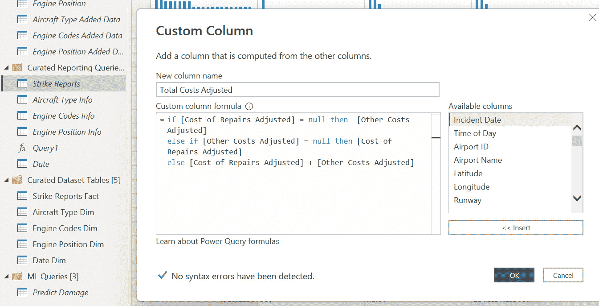

# 4

# Power BI 中机器学习的模型数据

在本书的 *第三章* 中，您为 Power BI 数据集准备了 FAA 野生动物撞击数据，构建了一个将作为分析基础的关系型数据集，然后在数据集中配置了基本设置，以便您可以深入挖掘数据并发现 Power BI 中的机器学习特征。

当您开始发现数据中适合 Power BI 机器学习的特征时，您需要一个过程将这些特征添加到查询中，以便在 Power BI 中训练和测试这些模型。在本章中，您将在探索数据集中适合 Power BI 机器学习的特征时构建 Power BI 的分析报告。当发现特征时，您将在 Power Query 中创建查询，这些查询最终将用于训练和测试您的机器学习模型。

# 技术要求

对于本章，您需要以下内容：

+   Power BI Desktop 2023 年 4 月或更高版本（无需许可证）

+   来自 FAA 网站或 Packt GitHub 网站的 FAA 野生动物撞击数据文件：[`github.com/PacktPublishing/Unleashing-Your-Data-with-Power-BI-Machine-Learning-and-OpenAI`](https://github.com/PacktPublishing/Unleashing-Your-Data-with-Power-BI-Machine-Learning-and-OpenAI)

# 通过数据探索选择特征

您的项目需要在 Power BI 中完全实现，不使用外部工具。Power BI ML 是一个 **软件即服务**（**SaaS**）工具，不需要设置基础设施或高级编码技能。传统上，大多数机器学习项目都是使用高度专业化的工具实现的，这些工具需要强大的编码技能，例如 R 和 Python 语言。通过在 Power BI 中实现整个项目，您将能够在短时间内完成它，使用 SaaS 工具和最少的编码构建所有组件，然后使用单一套件工具管理部署、可扩展性和未来的更改。

本章中的数据架构技术针对分析师和商业智能开发者，这个过程将是一个学习寻找和建模机器学习特征基础的好方法。熟练掌握 R 或 Python 的经验丰富的机器学习架构师可能处理过程的方式不同，但您需要使用您技能范围内的工具。使用 Power BI 工具，包括 Power Query、数据集、数据流和机器学习，将使您能够以最小的编码努力在 Power BI 中完成项目。

当您将潜在特征通过 Power BI ML 运行时，该工具将帮助识别具有强大预测价值的特征。您添加到表中的某些特征可能预测价值很小，但通过 Power BI ML 工具运行它们将有助于识别特征的价值。

## 将 Power Query 表添加到您的机器学习训练和测试架构中

回顾您初步的数据架构，您将在 Power Query 中填充 ML 训练数据表，这些特征是在您使用数据集在 Power BI 中创建分析报告时发现的：


图 4.1 – 在 Power BI 分析过程中将发现 ML 训练数据

您决定回顾那些将满足利益相关者需求的可交付成果，正如在*第一章*中讨论的那样：

+   **分析报告**：这将作为分析过程的一部分使用您的 Power BI 数据集创建

+   **预测损害、预测尺寸、预测高度**：您将为这三个机器学习模型中的每一个需要三个单独的训练数据表

当您构建分析报告并发现可用于预测的新特征时，您将在 Power Query 中迭代构建训练数据表，以便与 ML 一起使用。您还在构建一个可以更新和修改以适应项目未来版本的架构：


图 4.2 – 数据探索和特征发现是一个迭代过程

您可以从*第三章*中的 PBIX 文件继续，或者您可以使用本章内容的完成版本进行操作。您可以从 Packt GitHub 网站的*第四章*文件夹下载文件的 PBIT 版本：[`github.com/PacktPublishing/Unleashing-Your-Data-with-Power-BI-Machine-Learning-and-OpenAI/tree/main/Chapter-04`](https://github.com/PacktPublishing/Unleashing-Your-Data-with-Power-BI-Machine-Learning-and-OpenAI/tree/main/Chapter-04)。

首先，您需要创建一个新查询组，以便在迭代过程中修改表格：

1.  在 Power Query 中创建一个名为“ML 查询”的新组。

1.  右键单击**精炼报告**查询，在**精炼报告查询组**中，选择**引用**。

1.  将新查询重命名为“预测损害”。

1.  右键单击新查询，取消选择**启用加载**。

1.  右键单击新查询，将其移动到新的**ML** **查询**组。

1.  重复这些步骤两次，但将查询重命名为“预测尺寸”和“预测高度”。

您的 Power Query 组现在应该看起来像这样：


图 4.3 – 您现在有一个单独的 ML 查询组

你是不是挠头并想知道为什么所有三个查询都是相同的？回顾 *图 4**.2 的迭代过程，你会发现随着你使用 Power BI 在数据中发现新的特征，每个查询都将被修改。通过这个过程，每个查询都将被精简并定制，以代表与预期预测相关的独特特征集。在开始通过分析进行特征发现之前，你考虑每个查询对你机器学习模型的可能粒度。实际上，你想要定义数据单行代表什么：

+   **预测损害**：对损害的 *是/否* 二进制预测将应用于单个报告的野生动物撞击。提出的问题将是：“*根据撞击的情况，飞机受损的可能性有多大？*”每一行将是一个独特的野生动物撞击报告航班。

+   **预测大小**：预测撞击飞机的野生动物的大小是你的第二个交付成果。如果没有任何视觉确认或遗骸被回收，这个预测可以用来识别撞击飞机的动物的大小。这个预测也将处于独特的野生动物撞击报告航班级别。

+   **预测高度**：理想情况下，你希望预测撞击飞机的不同野生动物的高度。关于时间、地点和物种的数据可以用来预测高度。预测单个事件的高度也将保持表格的粒度与源数据库相同。

下一个阶段是构建报告。

## 构建分析报告以发现和选择预测损害机器学习模型的初始特征

在你的空白 Power BI 报告底部，将页面名称更改为 `Predict Damage`。这个页面将成为你的分析报告的一部分。你首先提出问题：“*什么构成了一个表示野生动物撞击是否造成损害的肯定/否定答案？*”参考 `read_me.xls` 文档，你找到一个名为 **Indicated Damage** 的列，它在 **Strike Reports** 表中，提供 *True*/*False* 值。这个列将作为你在预测损害二进制机器学习模型中预测的列。

你遵循以下步骤深入数据：

1.  从 **字段** 列表中将 **Incidents** 拖到画布上。

1.  创建一个新的计算度量来计算有损害事件的百分比：

    ```py
    Indicated Damage % = DIVIDE(CALCULATE([Incidents],FILTER('Strike Reports Fact',[Indicated Damage] = TRUE)),[Incidents])
    ```

1.  将 **Indicated Damage %** 格式化为百分比。

1.  将 **Indicated Damage %** 拖到包含 **Incidents** 的表格上。

1.  将表格更改为矩阵。

1.  将 **Aircraft Type Dim[Aircraft Classification]** 拖到行上。

你的矩阵应如下所示：


图 4.4 – 根据飞机分类报告的动物撞击及损害

你注意到绝大多数野生动物撞击报告都是针对飞机的，9.4%的报告表明有损害。直升机也有数千份报告，但你决定将数据缩小到飞机，因为那些是最常见的客运飞机，并且不会引入如悬停等飞行路径复杂性：

1.  将**Aircraft Type Dim[Aircraft Classification]**拖到 Power BI 筛选器面板的**此页面的筛选器**上。

1.  筛选**飞机**并保留其他选项未选中。

将矩阵移动到画布的左侧，并创建一个新的图表来按年查看意外事件和损害。

1.  从**可视化**列中选择**折线图和堆叠柱状图**。

1.  将**Strike Report Fact[Incidents]**放在列**y**轴上。

1.  将**Strike Report Fact[Indicated Damage %]**放在线**y**轴上。

1.  将**Date Dim[Year]**放在**x**轴上。

你在图表上注意到一个有趣的趋势。报告的意外事件数量随时间增加，直到 2020 年与 COVID 相关的中断。同时，造成损害的罢工比例下降，并在 2014 年左右趋于平稳。


图 4.5 – 按年统计的意外事件及损害事件

这些趋势是如何发展的？你不知道答案，但以下是一些可能的原因：

+   随时间推移，空中交通管制对野生动物的监视和威慑能力提高

+   在没有损害的情况下填写报告的合规性更好

+   飞机技术的改进

+   飞行数量、飞行时间和不同高度时间的改变

目前，你决定专注于从 2014 年开始的数据，因为旧数据可能具有不同的趋势。这是完美的起点吗？高级分析技术可能会揭示数据的完美起始日期，但为了你在 Power BI 中的第一次分析，你决定以 2014 年为起点。将**Date Dim[Year]**拖到 Power BI 筛选器面板的**此页面的筛选器**上，并筛选大于或等于 2014。

使用常识，似乎大型野生动物比小型动物更有可能造成损害。复制并粘贴页面左侧显示**Aircraft Classification**的矩阵，并将**Aircraft Classification**替换为**Strike Report Fact[Size]**。你的报告应该看起来如下：


图 4.6 – 应用筛选条件查看意外事件和损害

你注意到，野生动物大小的增加似乎导致了更大比例的损坏事件。也有几个事件在大小字段中留空，如果你使用该字段进行机器学习，则需要修复这个问题。基本的机器学习工具通常需要用于训练和测试的数据中非空值。Power BI ML 内置了特征化工具，可以处理空白值，但在构建机器学习模型之前处理空白值是一个好主意。

对于你在 Power BI 中进行机器学习的第一次迭代 **Predict Damage** 数据，你已经隔离了以下特征。你将在本书的未来章节中添加更多特征，但这是测试你在 Power Query 中的架构设计的一个良好起点：

+   一行代表一个报告的单独事件。

+   **打击报告事实[指示损伤]** 是你将训练机器学习模型进行预测的字段。

+   你将使用具有 `Airplane` 的行。

+   你将使用 **事件日期** 在或之后 2014 年 1 月 1 日的数据。

+   你还将使用 `blank`。

## 构建一个分析报告以发现和选择用于预测大小机器学习模型（Predict Size ML model）的初始特征

现在你继续寻找一些用于预测撞击飞机的野生动物大小的特征。预测动物的大小可能有助于了解在特定高度、位置和季节可能撞击飞机的物体。当物种未知时，大小可能是确定未来风险和识别可能碰撞的濒危或受保护野生动物的一个有价值因素。

你已经将大小作为预测因素包含在你的损坏预测机器学习模型中，但不可避免地会有动物未被看到或发现的情况。预测大小算法将预测是否发生了野生动物大型、中型或小型打击：

1.  你首先复制 `Predict Size`。你将重复使用已经创建的内容。

1.  首先，你决定保留 `Airplane`，以便你的机器学习模型适用于你的项目相同类型的用例。你按如下方式修改了折线图和堆叠柱状图：

    +   从图表中移除 **指示损伤百分比**

    +   将 **打击报告事实[大小]** 添加到列图例

    +   在过滤器面板中，清除 **日期[年份]** 的过滤器

你注意到，**大小** 的空白（空）值从 2010 年开始出现：


图 4.7 – 空白值从 2010 年开始出现

1.  你将**Strike Reports Fact[Size]**添加到**此页面的筛选器**的筛选面板中，并从报告中移除空白值。虽然空白值对于预测损坏的先前的查询是有用的，但空白值对于这个模型没有价值，因为你正在尝试预测**Strike Reports Fact[Size]**字段的输出。**Predict Damage ML**模型将有助于评估罢工造成损坏的可能性，而**Predict Size ML**模型将在其他因素已知的情况下预测野生动物罢工的规模。

你注意到，即使在移除了**Size**中的空白值之后，2010 年似乎发生了一些变化。中等规模的罢工报告较少，小型罢工报告较多：


图 4.8 – 报告的尺寸分布似乎在 2010 年发生变化

你决定通过在筛选面板中筛选**Date[Year]**来包含从 2010 年开始的数据。在**此页面的筛选器**中添加**Year**作为筛选条件。

在**Predict Damage**报告页面上，你已经观察到随着罢工规模的增加，损坏的可能性也在增加。因此，你决定将**Strike Reports Fact[Indicated Damage]**作为预测尺寸的特征。

你知道鸟类，这些野生动物罢工中常见的罪魁祸首，在一年中会迁徙。你从折线图和堆叠柱状图的*x*轴中移除**Date[Year]**，并用**Date[Month Num]**替换它。注意，罢工的频率和分布以及罢工的规模在一年中都会变化：


图 4.9 – 当所有年份汇总时，频率和分布似乎按月份变化

你决定将月份数字作为特征添加到你的查询中，以训练和测试预测尺寸的机器学习模型。与年份中的日、周或季度相比，月份是否是更好的聚合级别？你可能会在未来解决方案的迭代中重新审视这个问题，但就目前而言，你决定继续进行，因为深入分析需要额外的时间和精力，这可能会影响你的截止日期。

从逻辑上讲，大型野生动物罢工可能造成更严重或昂贵的损坏。**Strike Reports Fact**表包含四个包含成本数据的列，包括**维修成本**、**其他成本**、**调整后的维修成本**和**调整后的其他成本**。调整后的列按通货膨胀率索引，因此你决定使用这些值。你决定将这些列合并成一个单独的列。为了合并它们，你回到 Power Query，在**Curated Reporting** **Queries**组中的**Strike Reports**查询上创建一个新列：

1.  点击**Curated Reporting** **Queries**组中的**Strike Reports**查询。

1.  在 Power Query 功能区选择**添加列** | **常规** | **自定义列**。

1.  将新列命名为`总` `成本调整`。

1.  输入以下 M 表达式作为添加列的值：

    ```py
    = if [Cost of Repairs Adjusted] = null then [Other Costs Adjusted]
    ```

    ```py
    else if [Other Costs Adjusted] = null then [Cost of Repairs Adjusted]
    ```

    ```py
    else [Cost of Repairs Adjusted] + [Other Costs Adjusted]
    ```

条件语句存在是为了确保只有一个空值的行不会被跳过。

1.  将数据类型更改为**固定** **小数数字**。



图 4.10 – 为总成本添加自定义列

由于你在其他下游查询中引用了**打击报告**查询，新列也将传播到那些查询！下次你重新处理 Power BI 数据集时，**打击报告**事实表上会出现一个**总调整成本**列。在 Power Query 中点击**关闭并应用**以更新你的数据集。一旦处理完毕，你决定向数据集的**打击报告**事实表添加三个新的 DAX 表达式，用于求和（所有选定行的总费用）、平均值（所有选定行的平均值）和中位数（所有选定行的中间值，以消除极端高昂且罕见成本事件的影响）：

+   `通货膨胀调整后的总成本 = SUM([总` `成本调整])`

+   `每次打击的平均成本 = AVERAGE([总成本` `通货膨胀调整])`

+   `每次打击的中位数成本 = MEDIAN([总` `成本调整])`

最后，考虑到气候和地理环境，你意识到太平洋西北部、南部深处和新英格兰在不同时间段的动物种类将不同。某些物种将栖息在国家的不同部分，而某些物种会在一年中的不同时间迁移到新的地理区域。例如，火烈鸟永远不会飞过明尼苏达州。对于你项目的第一次迭代，你决定筛选出前 15 个经历野生动物打击的机场：

1.  复制并粘贴带有**大小**、**事件**和**指示** **损害百分比**的矩阵视觉。

1.  将**大小**从行移动到列。

1.  将**打击报告事实[机场 ID]**添加到行中。

1.  按**总事件数**排序。

1.  根据总打击次数选择前 15 个机场。排除`ZZZZ`，因为这不是有效的机场代码，很可能是在机场未知时使用的。注意，这些位置也提供了一些地理多样性：

| **机场 ID** | **机场城市** |
| --- | --- |
| KDEN | 丹佛，科罗拉多州 |
| KMEM | 孟菲斯，田纳西州 |
| KDFW | 达拉斯，德克萨斯州 |
| KSMF | 萨克拉门托，加利福尼亚州 |
| KCLT | 夏洛特，北卡罗来纳州 |
| KORD | 芝加哥，伊利诺伊州 |
| KPHL | 费城，宾夕法尼亚州 |
| KSDF | 路易斯维尔，肯塔基州 |
| KMCO | 奥兰多，佛罗里达州 |
| KLGA | 奎恩斯，纽约州 |
| KATL | 亚特兰大，乔治亚州 |
| KJFK | 奎恩斯，纽约州 |
| KIAH | 休斯顿，德克萨斯州 |
| KAUS | 奥斯汀，德克萨斯州 |
| KBNA | 纳什维尔，田纳西州 |

图 4.11 – 按事件数量排名前 15 的机场

你现在已经确定了将要预测的特征，以及用于在 Power BI 中评分机器学习模型的特征：

+   一行代表一个单独报告的事件

+   `大型`、`中型`或`小型`打击规模

+   您将使用具有`飞机`的行

+   您将使用日期在 2010 年 1 月 1 日或之后的日期的数据

+   空值将从**撞击报告事实[尺寸]**中移除

+   您将包括**撞击报告事实[指示损坏]**标志作为一个特征

+   您将筛选出野生动物撞击量最高的前 15 个机场

+   您将包括年份的月份作为一个特征

## 建立分析报告以发现和选择预测高度机器学习模型的初始特征

您在 Power BI 中的第三个机器学习模型计划预测飞机上野生动物撞击的高度。回归模型将预测地面以上的数值（英尺）。您计划在单个航班级别预测高度，如果这些结果准确性低，则将事件汇总到聚合级别。

首先，在您的 Power BI 报告中，复制`预测高度`。**高度**是数据表中的一个单独列。您将想要过滤掉高度缺失的行。

您创建新的 DAX 表达式来分析**高度**，除了在*第三章*中创建的**平均高度**：

+   `中位数高度 =` `MEDIAN([高度])`

+   `最大高度 =` `MAX([高度])`

+   `最小高度 =` `MIN([高度])`

现在，您开始分析数据：

1.  在折线图和堆叠柱状图中，从线*y*轴中移除**指示损坏百分比**，并用**撞击报告事实[平均高度]**和**撞击报告事实[中位数高度]**替换。

1.  清除**日期[年份]**在**此页面的过滤器**上的过滤器面板。

1.  保留`飞机`。

1.  在过滤器面板中，添加**高度**，并将其设置为**不是空白**。

1.  确保视觉元素的**次级 y 轴**已开启。

您的图表应如下所示：


图 4.12 – 随时间变化的平均和中位数高度

您决定将过滤器重新应用于整个页面的**年份**，以 2010 年及以后，以便日期范围与**预测尺寸**保持一致。

在包含**尺寸**、**事件**和**指示损坏百分比**的矩阵中，按照以下步骤操作：

1.  移除**指示损坏百分比**。

1.  将**撞击报告事实[平均高度]**、**撞击报告事实[中位数高度]**、**撞击报告事实[最大高度]**和**撞击报告事实[最小高度]**添加到矩阵的值中。

1.  在**所有页面上的过滤器**下的过滤器面板中添加**高度**，并将其设置为**不是空白**。

注意，随着中位数和平均值的**尺寸**增加，存在轻微的上升趋势，而对于平均值，上升趋势更为显著：


图 4.13 – 按野生动物撞击尺寸的平均、中位数、最大和最小高度

在这个总结级别，大小和高度之间似乎没有太大的差异。由于有许多不同的物种被归类到大小分类中，这个特征可能不是非常有价值。例如，一只单独的小鸟可能被归类为“小型”，而一大群相同的鸟可能被归类为“大型”。你将保留**大小**在预测高度的数据表中，然后看看它在通过 Power BI ML 运行时的表现如何。

1.  复制并粘贴你构建的矩阵视觉，并将**Strike Reports Fact[Size]**替换为**Strike Reports Fact[Species]**。你看到发生了更显著的变化：


图 4.14 – 按物种的高度指标

平均值、中位数和最大高度在物种之间差异很大。地面生物，它们很可能是被跑道上的撞击所击中，也列在清单上，并且始终有零英尺的高度。例如，如果你筛选“猪”，你可以看到有四个事件发生在零高度。常识告诉你这是预期的，你不需要测试“猪不会飞”的假设。非常严肃地说，你可能想要筛选清单，只包含可以飞行的物种，并消除像“未知小鸟 – 小型”这样的总括类别。实际上会飞的特定物种可能是一个强大的预测因素。

1.  再次复制并粘贴矩阵视觉，并将**大小**替换为**Date[Month Num]**。你还可以看到按月份的模式：


图 4.15 – 按年月度的高度指标

**月份编号**可能是预测高度的一个有价值的特征。一些鸟类物种会根据季节迁移到不同的地理区域，并占据不同的高度。将**机场 ID**字段作为特征添加，并筛选到本章**预测大小**部分列出的前 15 个机场（*构建分析报告以发现和选择预测大小机器学习模型的初始特征*）也可以提高**月份编号**的价值。

在这一点上，你决定继续进行项目的下一步，并在 Power Query 中开始构建机器学习训练和测试数据的基础。对于**预测高度**查询，你决定以下内容：

+   高度将通过回归模型进行预测

+   数据将被筛选，从 2010 年开始

+   `飞机`

+   **野生动物撞击的大小**将是一个特征

+   **物种**将是一个特征

+   前 15 个机场将作为预测高度的筛选标准

你现在已经发现了足够的潜在特征，可以返回 Power Query 并开始构建一些查询，这些查询将成为训练和测试你的机器学习模型所使用的数据的基础。

# 在 Power BI 中为机器学习创建 Power Query 的平坦表

现在您已经进行了一些分析，并发现了您希望包括在第一轮机器学习模型中的特征，您返回 Power Query 并开始工作。您回顾本章前面的笔记，并从 **ML 查询** 组中的 **Predict Damage** 表开始。

## 在 Power Query 中修改 Predict Damage 表。

由于每一行将代表一个预测的单独事件，因此您不需要对数据进行任何分组。您将选择列并筛选行，以获得更适合任务的 数据集：

1.  在 **ML 查询** 组中突出显示 **Predict Damage** 表。

1.  飞机类别代码为 `A`，因此筛选 `A`。

1.  筛选出 `1/1/2014`。

1.  在 Power Query 的功能区上，选择 **Home** | **Manage Columns** | **Choose Columns** 并保留 **Size** 和 **Indicated Damage** 列。

1.  在 `null` 值上使用 `empty`，以确保没有空白值。

您是否对只有两列感到困惑？别担心！随着您进入未来的章节，表中将添加更多功能。这个例子保持简单，是为了强调在发现过程中逐步构建特征表的方法。您的表应如下所示：


图 4.16 – Predict Damages 查询的基础，用于训练和测试机器学习模型

接下来，我们将对 **Predict Size** 表进行同样的操作。

## 在 Power Query 中修改 Predict Size 表。

在 Power Query 的 **ML 查询** 组中重复相同的 **Predict Size** 查询过程：

1.  在 **ML 查询** 组中突出显示 **Predict Size** 表。

1.  飞机类别代码为 `A`，因此筛选 `A`。

1.  筛选出 `1/1/2010`。

1.  筛选出分析期间记录的前 15 个机场。对于 `KDEN`、`KMEM`、`KDFW`、`KSMF`、`KCLT`、`KORD`、`KPHL`、`KSDF`、`KMCO`、`KLGA`、`KATL`、`KJFK`、`KIAH`、`KAUS` 和 `KBNA`。

1.  在 Power Query 的功能区上，选择 **Home** | **Manage Columns** | **Choose Columns** 并保留 **Size**、**Indicated Damage**、**Airport ID** 和 **Incident Date** 列。

1.  对于 **Size**，取消选中 **(null)** 值。

1.  使用以下 M 代码添加一个名为 **Month Number** 的自定义列：

    ```py
    = Date.Month([Incident Date])
    ```

1.  删除 **Incident Date**。

您的 **Predict Size** 查询现在应如下所示：


图 4.17 – Predict Size 查询的基础，用于训练和测试机器学习模型

最后，我们将对 **Predict Height** 表进行同样的操作。

## 在 Power Query 中修改 Predict Height 表。

Power Query 中的 **Predict Height** 表也将遵循相同的列宽和行数减少的过程：

1.  在 **ML 查询** 组中突出显示 **Predict Height** 表。

1.  飞机类别代码为`A`，因此过滤`A`。

1.  过滤`1/1/2010`。

1.  在 Power Query 功能区，选择**主页** | **管理列** | **选择列**，并保留**大小**、**物种**、**机场 ID**、**事件日期**和**高度**列。

1.  将**大小**列的空值替换为`空`。

1.  过滤到分析期间注意到的前 15 个机场。对于`KDEN`、`KMEM`、`KDFW`、`KSMF`、`KCLT`、`KORD`、`KPHL`、`KSDF`、`KMCO`、`KLGA`、`KATL`、`KJFK`、`KIAH`、`KAUS`和`KBNA`。

1.  过滤**高度**以移除空值。

1.  使用以下 M 代码添加一个名为**月份编号**的自定义列：

    ```py
    = Date.Month([Incident Date])
    ```

1.  移除**事件日期**。

您的**预测高度**表现在应该看起来像这样：


图 4.18 – 预测高度查询的基础，用于训练和测试机器学习模型

您的机器学习查询现在已修改，包括本章发现的新潜在特征。

# 摘要

本章开始构建您在 Power BI 中的机器学习冒险的基础。您在 Power Query 中创建了一组查询，这些查询将成为训练和测试您的二进制、通用分类和回归机器学习模型的基础。您在发现数据中可能对机器学习的预测分析有价值的特征的同时，开始构建分析报告。最后，您将这些特征添加到 Power Query 中的新查询中。您现在可以为查询添加新特征，这些特征将尝试预测是否发生了损坏，野生动物撞击的大小以及野生动物撞击的高度。

在下一章中，您将更深入地研究 Power BI 数据集，以发现新的预测特征。您将利用一些 Power BI AI 功能来揭示新的见解和可能的新特征，这些特征可用于机器学习。最后，您将把您的发现添加到用于在 Power BI 中训练和测试您的机器学习模型的查询中。

# 第二部分：人工智能和机器学习可视化以及发布到 Power BI 服务

在接下来的几章中，您将通过数据可视化和探索发现的新特征来丰富训练数据集。

本部分包括以下章节：

+   *第五章*，*使用分析和 AI 可视化发现特征*

+   *第六章*，*使用 R 和 Python 可视化发现新特征*

+   *第七章*，*将数据摄取和转换组件部署到 Power BI 云服务*
