# 使用 R 和 Python 可视化发现新特征

在本书的*第五章*中，你使用 Power BI Desktop 为你的查询发现了新的列和特征，这些特征将被迁移到 Power BI 云服务以训练和测试机器学习模型。在探索和发现数据的过程中，你还扩展了将用于向最终用户提供交互式数据探索的 Power BI 报告。

在将你的解决方案迁移到 Power BI 云服务之前，你将对 FAA 野生动物撞击数据进行最后一次检查，并寻找要添加到用于构建 Power BI 机器学习模型的机器学习查询中的额外特征。为了向分析报告添加一些多样化的功能，你将在 Power BI 中利用 R/Python 可视化。在本章结束时，你将准备好将你的解决方案发布到 Power BI 云服务。

# 技术要求

对于本章，你需要以下资源：

+   Power BI Desktop 2023 年 4 月或更高版本（无需许可证）

+   来自 FAA 网站或 Packt GitHub 仓库的 FAA 野生动物撞击数据文件

+   在你的本地计算机上安装 R：[`learn.microsoft.com/en-us/power-bi/create-reports/desktop-r-visuals`](https://learn.microsoft.com/en-us/power-bi/create-reports/desktop-r-visuals)

+   在你的本地计算机上安装 Python：[`learn.microsoft.com/en-us/power-bi/connect-data/desktop-python-visuals`](https://learn.microsoft.com/en-us/power-bi/connect-data/desktop-python-visuals)

# 使用 R 可视化探索数据

Power BI 具有运行 R 脚本并显示 R 可视化的功能。R 是一种强大的语言，通常被数据科学家用于统计和机器学习。你将需要按照[`learn.microsoft.com/en-us/power-bi/create-reports/desktop-r-visuals`](https://learn.microsoft.com/en-us/power-bi/create-reports/desktop-r-visuals)中的说明在你的本地计算机上安装 R，以便与 Power BI Desktop 一起使用。

有许多 R 可视化可以用于数据分析以及为机器学习模型寻找新的特征。FAA 野生动物撞击数据包含与飞机被击中的部分、损坏位置、动物被吸入发动机等相关的一些真/假标志。这些值应该非常适合 R 相关性图，它将以图形方式显示倾向于正相关或负相关的标志。让我们试试吧！

你将遵循三个步骤来寻找新的特征：

1.  准备数据以用于 R 相关性图。

1.  构建 R 相关性图可视化并将其添加到你的报告中。

1.  为你的 Power BI 机器学习查询识别新的特征。

注意，如果您不想将所有这些 Power BI 报告页面作为您通过本书的旅程的一部分来构建，则可在以下链接处找到完成后的 PBIT 模板*第六章*（包括 R 和 Python 组件）：[`github.com/PacktPublishing/Unleashing-Your-Data-with-Power-BI-Machine-Learning-and-OpenAI/tree/main/Chapter-06`](https://github.com/PacktPublishing/Unleashing-Your-Data-with-Power-BI-Machine-Learning-and-OpenAI/tree/main/Chapter-06)。

## 准备 R 相关图的数据

将真/假列转换为整数列，其中`1`代表真，`0`代表假，这是为 R 相关图准备数据所必需的。让我们确定将在**精选报告查询**组的**打击报告**查询中使用的列：

| 吞入其他 | 指示损伤 | 随机撞击 | 随机损坏 |
| --- | --- | --- | --- |
| 撞击挡风玻璃 | 损坏挡风玻璃 | 撞击机头 | 损坏机头 |
| 撞击引擎 1 | 损坏引擎 1 | 吞入引擎 1 | 撞击引擎 2 |
| 损坏引擎 2 | 吞入引擎 2 | 撞击引擎 3 | 损坏引擎 3 |
| 吞入引擎 3 | 撞击引擎 4 | 损坏引擎 4 | 吞入引擎 4 |
| 撞击螺旋桨 | 损坏螺旋桨 | 撞击机翼或旋翼 | 损坏机翼或旋翼 |
| 撞击机身 | 损坏机身 | 撞击起落架 | 损坏起落架 |
| 尾部撞击 | 尾部损坏 | 灯光撞击 | 灯光损坏 |
| 撞击其他 | 损坏其他 |  |  |

图 6.1 – 与野生动物撞击相关的真/假列

如果您要更改列的数据类型，并且该列正在 Power BI 中使用，您可能会破坏报告或 DAX 表达式。通常，除非绝对必要，否则避免更改数据类型是一种最佳实践。报告用户通常也会更了解报告中的真或假选项，而不是 1 或 0。继续创建每个整数数据类型的列的新版本。在未来的某个时候，您可以根据用例决定将哪个版本包含在每个数据集或 ML 查询中。对*图 6.1*中的列执行以下步骤：

1.  在**精选报告查询**组中，复制所有这些列。

1.  将新列重命名为以 `Int` 结尾，以便**指示损伤 – 复制**变为**指示** **损伤 Int**。

1.  将新列的数据类型更改为`整数`。

1.  在 Power Query 中点击**关闭并应用**以更新 Power BI 数据集。

这些标志主要与损伤和撞击位置相关，但也可以用于预测动物的高度和大小。例如，起落架可能不会在超过一定高度的地方被撞击，因为它只在起飞和降落时放下。如果飞机的多个部分被撞击，可能与一群鸟与一只单独的动物相关。

现在您可以返回 Power BI 报告并构建 R 相关图视觉！

## 构建 R 相关性图可视化并将其添加到您的报告中

根据本章前面提到的技术要求，FAA 野生动物撞击数据中的真/假列的整数版本现在应可在您的 Power BI 数据集中使用。同时，您应该在运行 Power BI Desktop 的本地计算机上安装 R：

1.  在 Power BI Desktop 中选择 R 脚本可视化，并将其添加到新页面的画布上。

1.  在页面上设置过滤器以匹配“飞机”和“大于或等于 2014”。将整数**指示损坏**列添加到**值**。

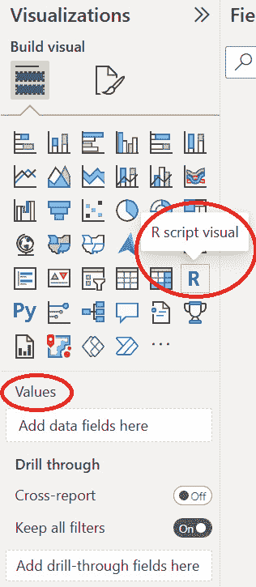

图 6.2 – Power BI 中的 R 脚本可视化

1.  当 R 可视化被突出显示时，页面底部将显示一个脚本窗口。添加一些 R 代码以激活 R 相关性图：

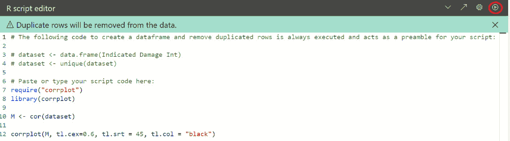

图 6.3 – 添加 R 相关性图代码

这是添加到可视化中的代码：

```py
require("corrplot")
library(corrplot)
M <- cor(dataset)
corrplot(M, tl.cex=0.6, tl.srt = 45, tl.col = "black")
```

1.  现在将您创建的新整数列以及添加的原始字段添加到**值**。

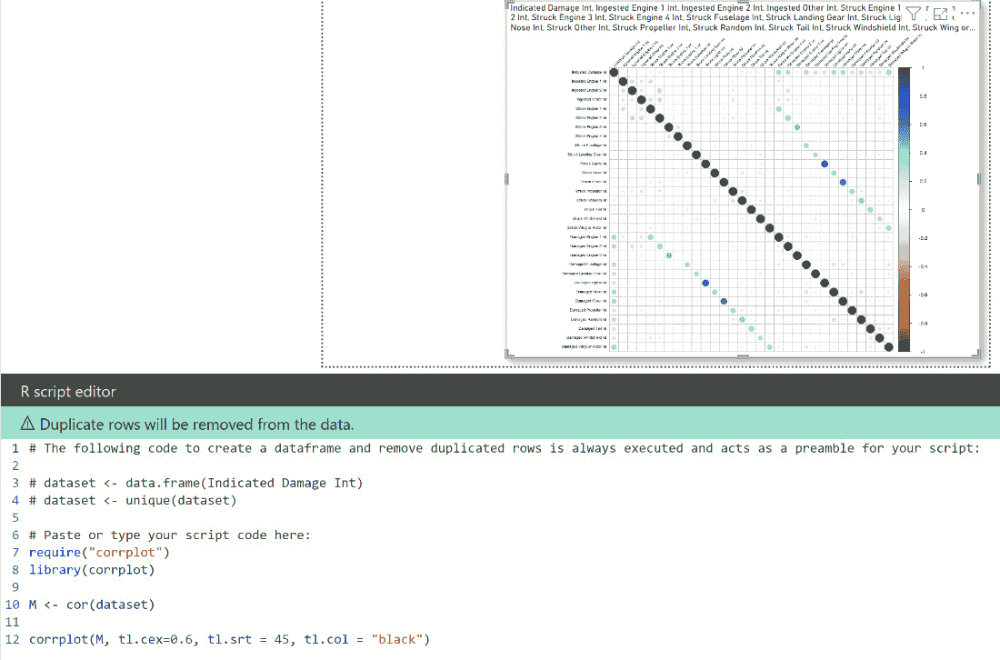

图 6.4 – 使用真/假整数列的 R 相关性图

图 6.5 中的图被扩展。

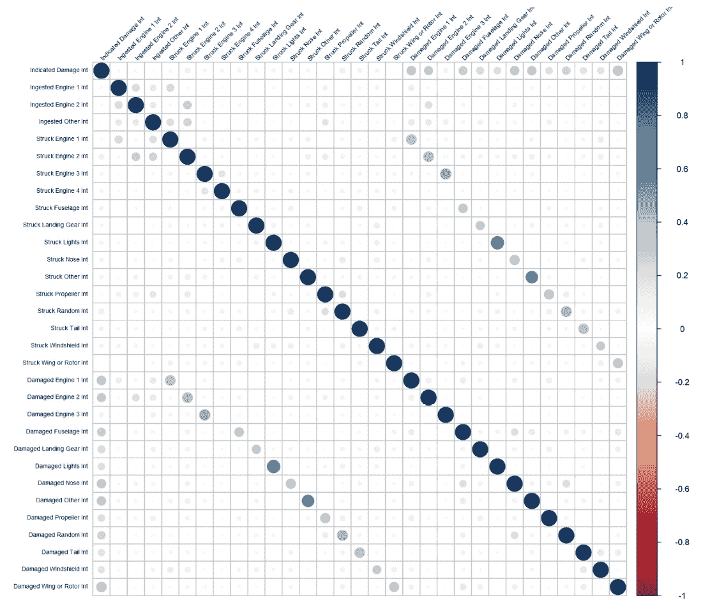

图 6.5 – 使用真/假整数列的 R 相关性图

*图 6.5* 中列的文本太小，难以阅读，但表示所有转换为整数值的 TRUE/FALSE 指示器。GitHub 仓库中 *第六章* 的 PBIT 文件允许您查看这些值。

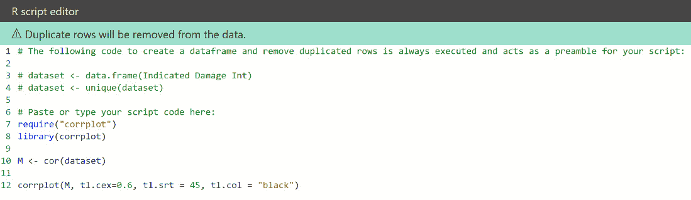

图 6.6 – 使用真/假整数列的 R 相关性图代码。

现在，您可以使用 R 相关性图深入数据！

## 为您的 Power BI ML 查询识别新特征

R 相关性图通过大小和颜色强度增加的圆圈显示正负相关性水平。蓝色表示正相关（值上下波动一致），白色表示无相关性（值上下波动随机相关），红色表示负相关（一个值上升时另一个值下降）。

查看 *图 6.5* 中 R 相关性图的初始渲染，除了自我匹配和几个浅蓝色圆圈表示不同的相关损坏标志外，没有很多蓝色或红色圆圈。添加一些过滤器到页面允许您探索数据子集中的相关性。每次您选择新的过滤器时，R 相关性图都会重新计算。例如，*图 6.7* 在数据集中选择了以下过滤器：

+   `大于或等于 2014`

+   `飞机`

+   `大`

+   `3`、`4` 或 `5`

+   `空白`、`无`或`其他`

+   `1` 或 `2-10`

您可以在以下屏幕截图中看到这一点：

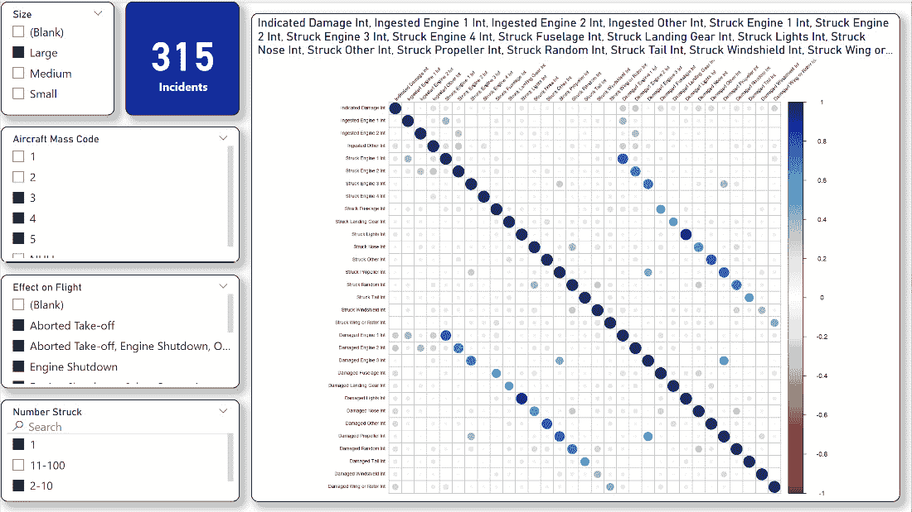

图 6.7 – 当选择过滤器时，R 相关性图将被重新处理。

图 6**.7** 中的列文本太小，难以阅读，但表示所有转换为整数值的 True/False 指示器。GitHub 仓库中*第六章* 的 PBIT 文件允许您查看这些值。

在过滤到数据子集后，R 相关性图上开始出现相关性。扩展可视化并关注**指示的损坏**字段的相关性。最强的相关性是对于也指示某种损坏的标志。然而，对于其他标志也有一些较弱的正相关相关性：


图 6.8 – 显示了指示损坏的几个弱正相关相关性

在使用 R 相关性图探索额外的过滤器组合后，以下功能将被添加到 ML 查询中：

| **特征** | **预测损坏** | **预测大小** | **预测高度** |
| --- | --- | --- | --- |
| 吞入其他 | 是 | 是 | 是 |
| 击中挡风玻璃 | 是 | 是 | 是 |
| 击中引擎 1 | 是 | 是 | 是 |
| 损坏的引擎 2 | 否 | 是 | 是 |
| 吞入的引擎 3 | 是 | 是 | 是 |
| 击中螺旋桨 | 是 | 是 | 是 |
| 击中机身 | 是 | 是 | 是 |
| 击中尾部 | 是 | 是 | 是 |
| 击中其他 | 是 | 是 | 是 |
| 损坏的挡风玻璃 | 否 | 是 | 是 |
| 损坏的引擎 1 | 否 | 是 | 是 |
| 吞入的引擎 2 | 是 | 是 | 是 |
| 击中引擎 4 | 是 | 是 | 是 |
| 损坏的螺旋桨 | 否 | 是 | 是 |
| 损坏的机身 | 否 | 是 | 是 |
| 损坏的尾部 | 否 | 是 | 是 |
| 损坏的其他 | 否 | 是 | 是 |
| 击中的随机 | 是 | 是 | 是 |
| 击中机头 | 是 | 是 | 是 |
| 吞入的引擎 1 | 是 | 是 | 是 |
| 击中引擎 3 | 是 | 是 | 是 |
| 损坏的引擎 4 | 否 | 是 | 是 |
| 击中机翼或旋翼 | 是 | 是 | 是 |
| 击中起落架 | 是 | 是 | 是 |
| 击中灯光 | 是 | 是 | 是 |
| 损坏的随机 | 否 | 是 | 是 |
| 损坏的机头 | 否 | 是 | 是 |
| 击中引擎 2 | 是 | 是 | 是 |
| 损坏的引擎 3 | 否 | 是 | 是 |
| 吞入的引擎 4 | 是 | 是 | 是 |
| 损坏的机翼或旋翼 | 否 | 是 | 是 |
| 损坏的起落架 | 否 | 是 | 是 |
| 损坏的灯光 | 否 | 是 | 是 |

图 6.9 – 将添加到 ML 查询中的功能

您已经发现了许多用于 ML 查询的特征，但您还没有完成！您还可以使用 Python 可视化在 Power BI 中探索数据，这是您的下一个任务。

# 使用 Python 可视化探索数据

除了 R 语言，Power BI 还支持 Python 查询和可视化。Python 是一种非常流行的语言，也是数据科学家经常使用的语言。根据本章开头的需求，你需要在本地机器上安装 Python 以用于 Power BI 桌面：[`learn.microsoft.com/en-us/power-bi/connect-data/desktop-python-visuals`](https://learn.microsoft.com/en-us/power-bi/connect-data/desktop-python-visuals)。

在 FAA 野生动物撞击数据中，**高度**和**速度**都是可以记录在报告中的字段。高度是事件发生时从地面测量的英尺数，而速度是飞机被野生动物撞击时的速度。你将使用 Python 直方图查看这两个指标，以便在应用不同过滤器时比较这些值的分布。

你将遵循以下步骤：

1.  准备 Python 直方图的数据。

1.  构建 Python 直方图可视化并将其添加到报告中。

1.  识别你的 Power BI ML 查询的新特征。

让我们继续。

## 准备 Python 直方图的数据

**高度**和**速度**都是包含空值的整数列。对于数值列中的空值，可能会有些棘手，因为你不知道它是零还是未知。对于报告页面，你需要为每个可视化过滤掉空值。否则，整数列就准备好用于你的 Python 直方图数据可视化了。

## 构建 Python 直方图可视化并将其添加到报告中

接下来，我们需要构建可视化：

1.  在 Power BI 桌面中，选择 Python 脚本可视化，并将其添加到新页面的画布上。

1.  在页面上设置过滤器以匹配`Airplane`和`大于或等于 2014`。将整数**速度**列添加到**值**：

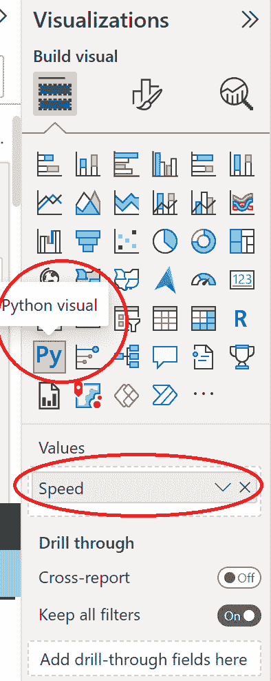

图 6.10 – 值下速度的 Python 可视化

1.  当 Python 可视化被突出显示时，页面的底部将出现一个脚本窗口。添加一些 Python 代码以激活标题为`Speed for Incidents` `with Damage`的 Python 直方图：

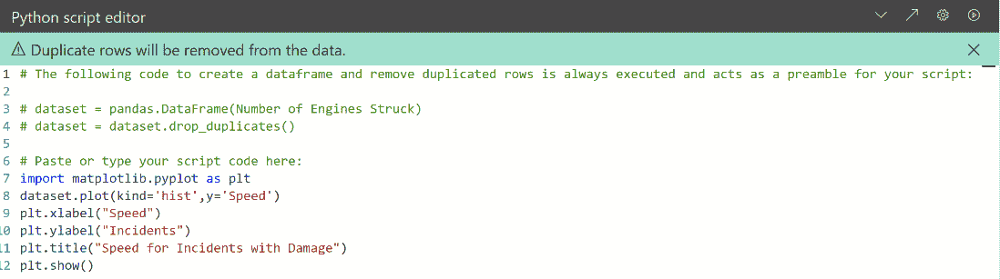

图 6.11– 在 Power BI 中渲染直方图的 Python 代码

这就是如图*图 6.11*所示的脚本编辑器中输入的代码：

```py
import matplotlib.pyplot as plt
dataset.plot(kind='hist',y='Speed')
plt.xlabel("Speed")
plt.ylabel("Incidents")
plt.title("Speed for Incidents with Damage")
plt.show()
```

1.  对于这个可视化的过滤器，设置为`True`和`is not (Blank)`。现在你可以渲染 Python 直方图可视化：

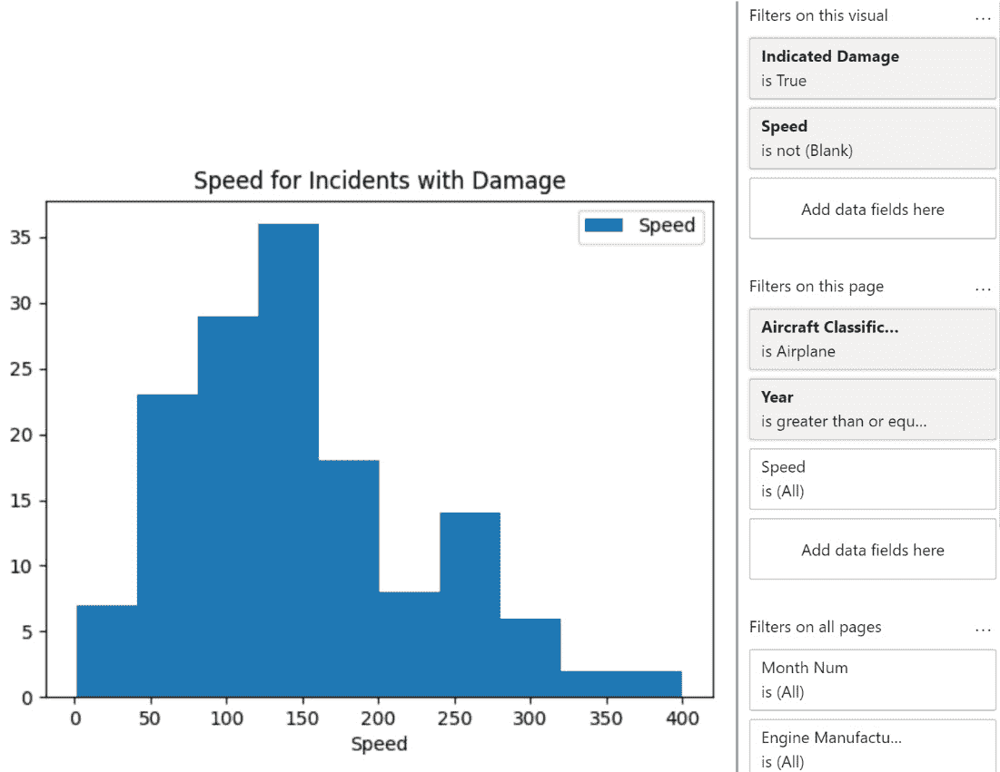

图 6.12 – 以速度为单位的损坏事件 Python 直方图

现在，你可以使用 Python 直方图可视化来分析数据的分布了！

## 识别 Power BI ML 查询的新特征

让我们看看这个可视化：

1.  复制并粘贴该视觉图表，并将标题重命名为`Speed for Incidents without Damage`。以下是 Python 代码，可以像在*图 6.10*中一样输入：

    ```py
    import matplotlib.pyplot as plt
    ```

    ```py
    dataset.plot(kind='hist',y='Speed')
    ```

    ```py
    plt.xlabel("Speed")
    ```

    ```py
    plt.ylabel("Incidents")
    ```

    ```py
    plt.title("Speed for Incidents without Damage")
    ```

    ```py
    plt.show()
    ```

1.  将`False`更改为，您就可以比较这两个视觉图表：

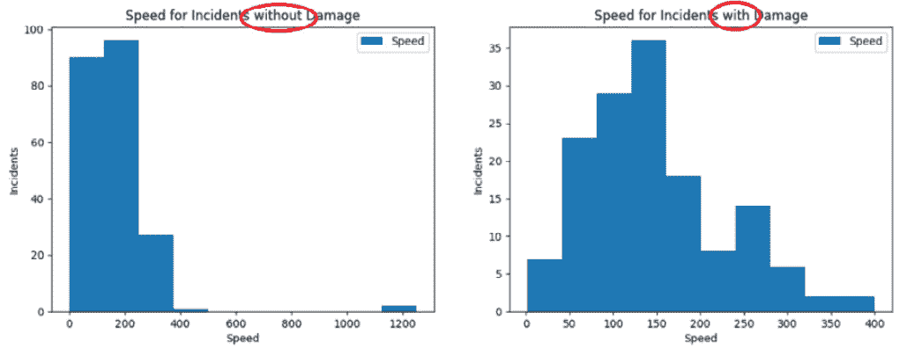

图 6.13 – 比较有损和无损事故的速度

注意，有一些无损伤的事故位于 1200 节的桶中，这进一步将直方图向左倾斜。

1.  过滤页面以创建可比较的直方图，`小于 700`。还可以在页面上添加一些过滤器（您想探索的任何内容），例如**大小**、**对飞行的影响**和**月份名称**。

1.  接下来，复制并粘贴两个图表，并将`Speed`替换为`Height`。过滤整个页面，使`Height`不为空。以下是报告损坏时高度的直方图的 Python 代码：

    ```py
    import matplotlib.pyplot as plt
    ```

    ```py
    dataset.plot(kind='hist',y='Height',color='black')
    ```

    ```py
    plt.xlabel("Height")
    ```

    ```py
    plt.ylabel("Incidents")
    ```

    ```py
    plt.title("Height for Incidents with Damage")
    ```

    ```py
    plt.show()
    ```

1.  这里是用于无损伤直方图的 Python 脚本：

    ```py
    import matplotlib.pyplot as plt
    ```

    ```py
    dataset.plot(kind='hist',y='Height',color='black')
    ```

    ```py
    plt.xlabel("Height")
    ```

    ```py
    plt.ylabel("Incidents")
    ```

    ```py
    plt.title("Height for Incidents without Damage")
    ```

    ```py
    plt.show()
    ```

您现在可以以许多不同的过滤设置交互式地查看**高度**和**速度**的分布：

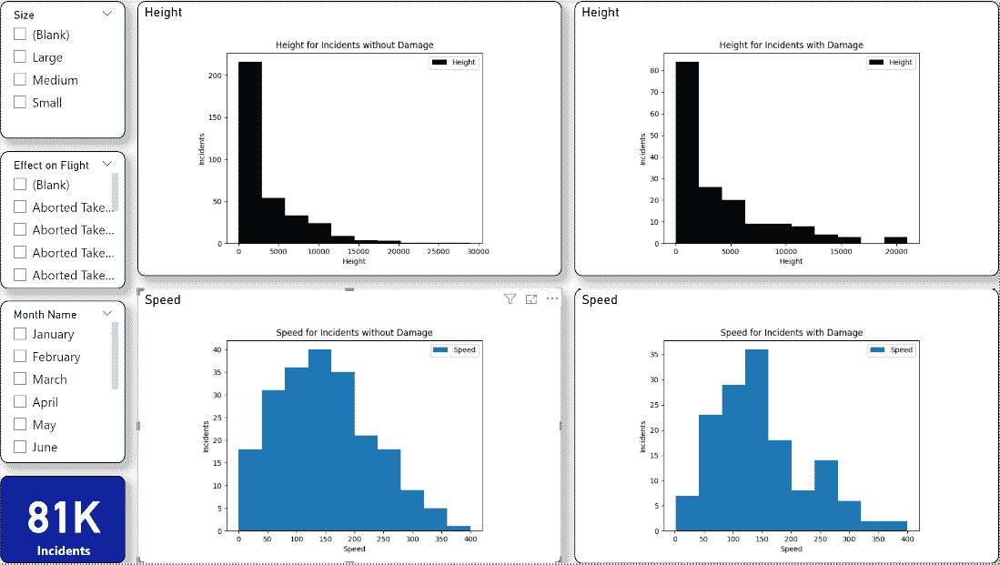

图 6.14 – 高度和速度的交互式 Python 直方图

当报告损坏时，高度和速度似乎都会发生变化。通过使用 Python 直方图进行探索，您将添加**高度**和**速度**到 ML 查询中。使用 R 和 Python 视觉图表，您已验证了众多可用于在 Power BI 中训练和测试您的 ML 模型的新特征。

# 向 ML 查询添加新功能

到目前为止，在本章中，您已经确定了要添加到 Power BI ML 模型的**预测损坏**、**预测大小**和**预测高度**ML 查询中的许多新特征。正如您在*第五章*第三部分*添加新特征到 ML 查询中*中所做的那样，您可以将这些特征添加到 Power Query 中的 ML 查询中：

1.  双击**应用步骤**下的**移除其他列**。

1.  在*图 6.9*中添加每个特征（也包括**速度**和**高度**）。

在添加特征时，您的屏幕应该看起来像这样：

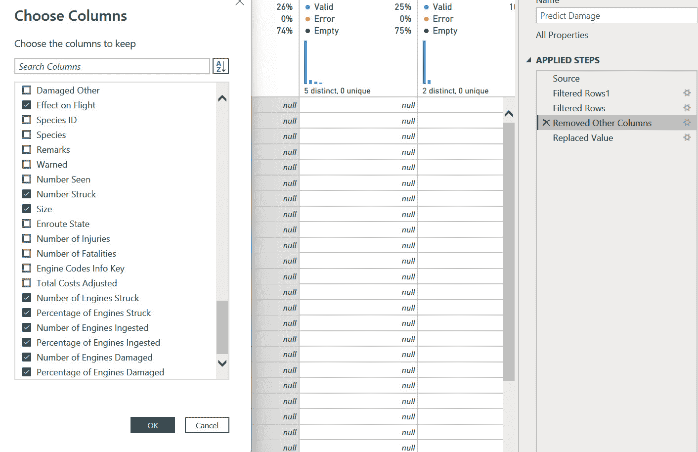

图 6.15 – 选择要添加到 ML 查询中的列

在添加新特征后，您可能会注意到`empty`。例如，对于**速度**，当以 5 节或 500 节的速度撞击大型动物时，预期的撞击影响应该非常不同。空值可能代表许多不同的场景，例如缺失数据或未知速度。当您在 Power BI 中构建和测试 ML 模型时，您将评估几种不同的处理这些缺失值的方法。

你解决方案的未来迭代可能非常可能包含你发现的额外功能。目前，你已经识别并添加了许多功能到为机器学习（ML）架构的查询中，你现在准备好进入 Power BI 云服务之旅了！

# 摘要

在本章中，你将 R 和 Python 可视化添加到你的 Power BI 报告中，以发现 FAA 野生动物撞击数据中的新功能。使用 R 相关性图，你能够交互式地切割和剖析几个事件标志值以确定正负相关性。通过 Python 直方图，你研究了速度和高度对你计划中的 Power BI ML 模型的结果的影响。最后，你向你的**预测损害**、**预测大小**和**预测高度**ML 查询中添加了新功能，这些功能将在 Power BI 中的 ML 中使用。

在下一章中，你将开始将内容迁移到 Power BI 云服务。在迁移 Power BI 数据集和报告之后，你将接着迁移 Power Query 脚本到数据流中，以便与 Power BI ML 一起使用。
