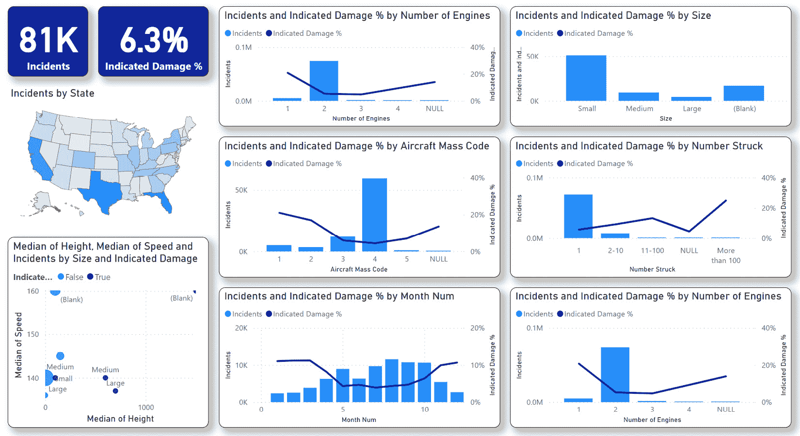
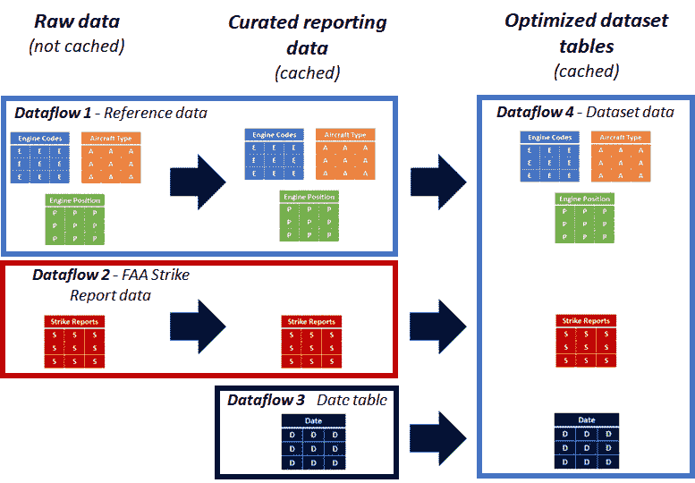
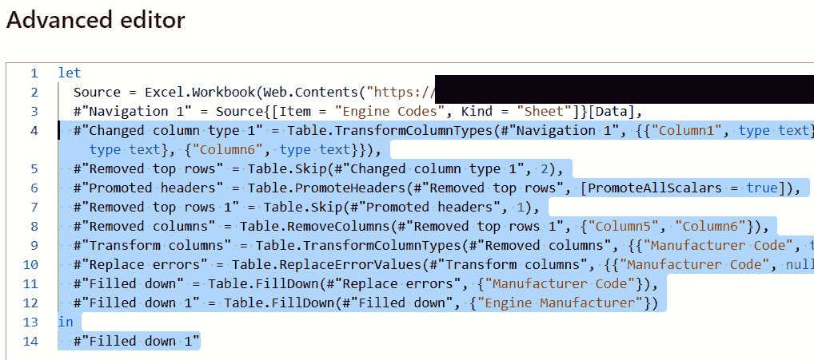
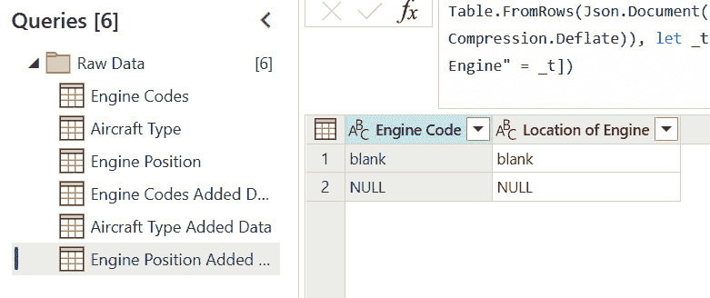
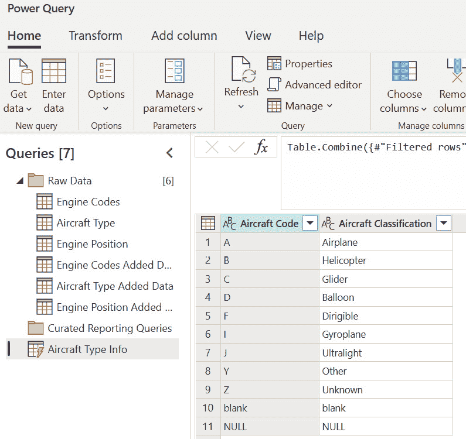
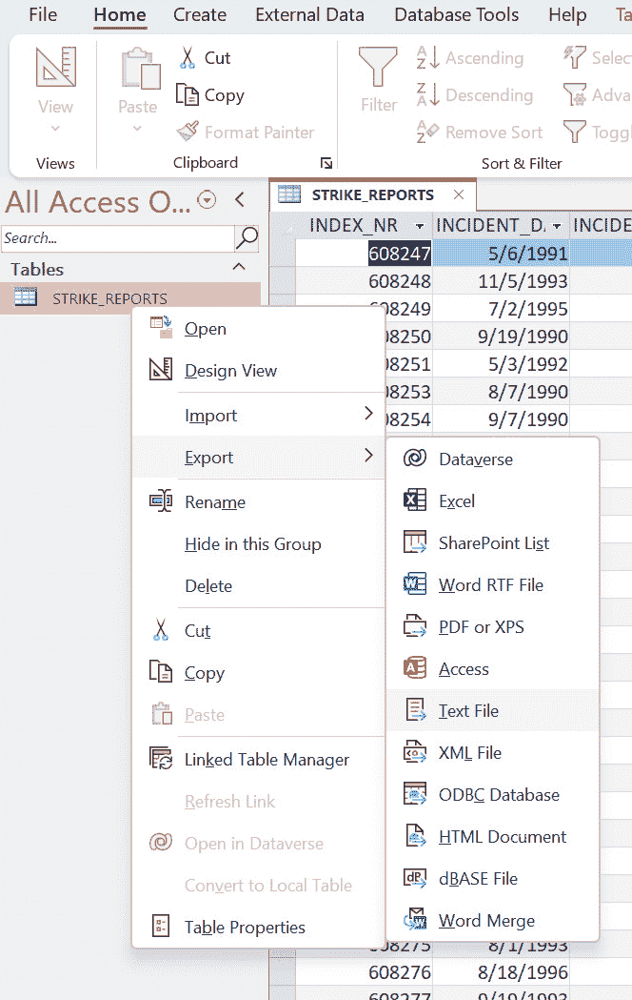
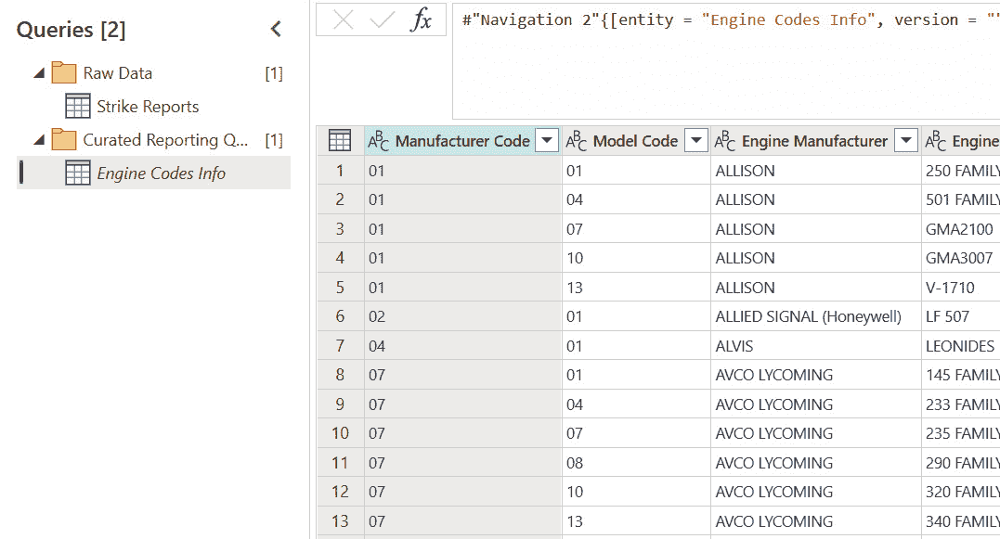
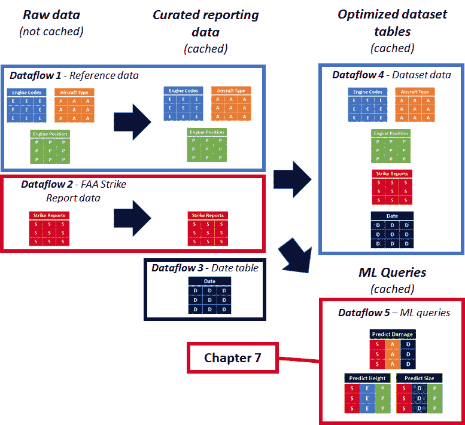
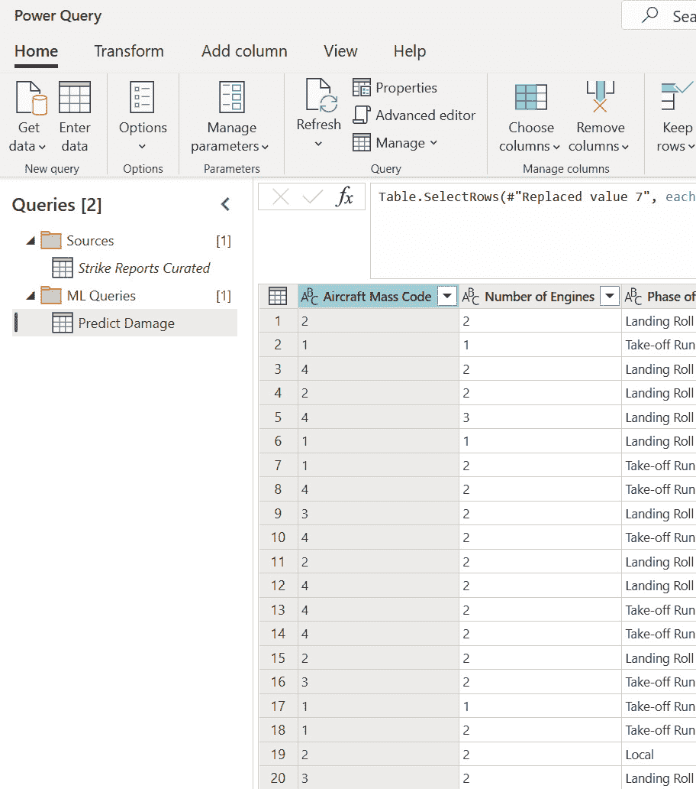
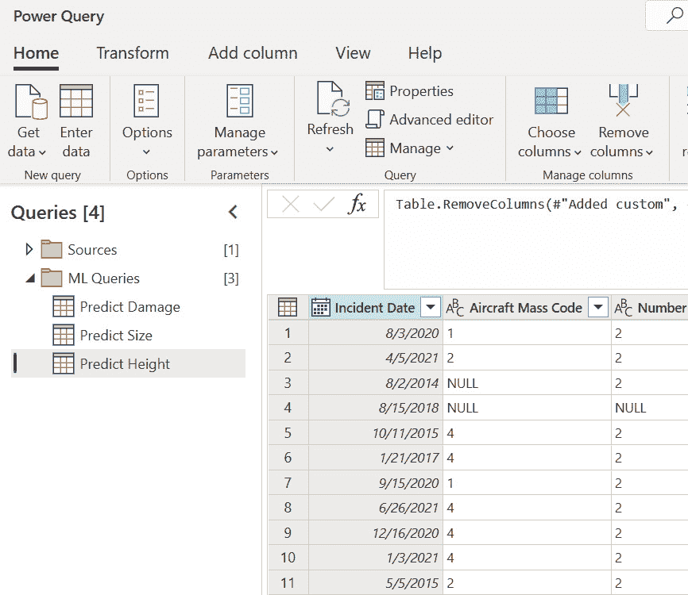

# 将数据摄取和转换组件部署到 Power BI 云服务

在*第六章*中，你完成了 ML 查询的基本设计，这些查询将被迁移到 Power BI 云服务以训练和测试 ML 模型。你专注于在 Power BI 桌面中使用 R 和 Python 可视化来可视化和评估这些 ML 查询的潜在特征。

本章将是一次探索 Power BI 云服务的冒险。你将迁移 Power Query 中的工作，并将你的 Power BI 数据集和报告发布到 Power BI 工作区。移动这些查询的过程是端到端项目、与本书并行运行的研讨会中重复但必要的步骤。经验丰富的 Power BI 开发者可能可以通过剪切和粘贴 GitHub 中的 M 查询快速完成本章。到本章结束时，你的内容将完全迁移到 Power BI 云服务，并准备好进行 Power BI ML。

# 技术要求

对于本章，你需要以下资源：

+   Power BI 桌面 2023 年 4 月或更高版本（无需许可证）

+   来自 FAA 网站或 Packt GitHub 网站的 FAA 野生动物撞击数据文件

+   Power BI Pro 许可证

+   以下 Power BI 许可选项之一用于访问 Power BI 数据流：

    +   Power BI Premium

    +   Power BI Premium Per User

+   将数据导入 Power BI 云服务的以下选项之一：

    +   Microsoft OneDrive（与 Power BI 云服务连接）

    +   Microsoft Access 和 Power BI 网关

    +   Azure 数据湖（与 Power BI 云服务连接）

# 创建 Power BI 工作区

在我们开始将内容导入 Power BI 云服务之前，你需要为项目创建一个**工作区**。工作区是在 Power BI 云服务中组织、保护和治理内容的一种方式。对于这个项目，你需要一个支持使用数据流和 ML 的工作区，这在撰写本书时需要**Power BI Premium**与**Pro**许可证或**Premium Per User**许可证。如果你没有这些许可证中的任何一个，你仍然可以为了学习目的跟随本书，并探索 Packt GitHub 仓库中的代码示例。

工作区可以扩展以包括与安全功能、信息保护、部署管道用于生命周期管理等功能集成。本书将仅涵盖如何创建基本工作区，因为有关工作区的详细文档可在网上找到。创建工作区的教程可在[`learn.microsoft.com/en-us/power-bi/collaborate-share/service-create-the-new-workspaces`](https://learn.microsoft.com/en-us/power-bi/collaborate-share/service-create-the-new-workspaces)找到。

按照以下步骤在 Power BI 中创建新的工作区：

1.  通过访问[`app.powerbi.com/`](https://app.powerbi.com/)登录 Power BI 云服务。

1.  确保您拥有 Pro 或 Premium Per User 许可证：[`powerbi.microsoft.com/en-us/pricing/`](https://powerbi.microsoft.com/en-us/pricing/)。

1.  您还需要确保您的 Power BI 管理员已授予您创建 workspace 的权限。

1.  从左侧垂直窗格中选择 **Workspaces** | **+** **New Workspace**。

1.  为您的 workspace 选择一个名称，描述它，然后选择 **Premium Per User** 或 **Premium Per Capacity** 作为 **许可模式** 选项。

现在，您已经准备好使用支持报告、数据集、数据流和机器学习的 Power BI workspace 来进行您的 FAA 野生动物撞击数据项目！

# 将 Power BI Desktop 数据集和报告发布到 Power BI 云服务

接下来，您必须将您的数据集和报告从 Power BI Desktop 导入到 Power BI 云服务中。一旦发布到云服务，您将能够与其他项目利益相关者共享分析报告。如果您想在移动中深入数据，您还可以在 Power BI 移动应用程序中查看报告。

到目前为止，您所做的工作是在您的本地机器上使用 Power BI Desktop。您有两个选项将此内容迁移到 Power BI 云服务：

+   从 Power BI Desktop 发布：[`learn.microsoft.com/en-us/power-bi/create-reports/desktop-upload-desktop-files`](https://learn.microsoft.com/en-us/power-bi/create-reports/desktop-upload-desktop-files)

+   从 Power BI 服务导入 `.pbix` 文件

这两种选项同样简单。在本教程中，您将从 Power BI 服务导入 `.pbix` 文件。

从您新创建的 Power BI workspace 中，选择您创建的 `.pbix` 文件。如果您不使用 OneDrive，您也可以从其他文件位置上传。一旦上传 `.pbix` 文件，您将看到数据集已从报告中分离出来，并且它们现在是两个独立的实体。点击报告后，您可以验证所有页面现在都可以在 Power BI 云服务中浏览：

图 7.1 – 现在可以在 Power BI 云服务中浏览 FAA 野生动物撞击报告

最终，您可能需要重新访问此报告，并允许它使用新数据刷新。由于您正在为您的机器学习（ML）工作使用 FAA 野生动物撞击数据的快照，您不希望更改此报告中的数据。此报告中的数据需要反映您在项目的初始训练和测试阶段用于训练 ML 模型的数据。这样，您就可以重新访问此报告来探索或验证用于 ML 的确切数据。

# 创建与源数据连接的 Power BI 数据流

在前几章中，Power BI Desktop 的 Power Query 工作是从您本地的数据源连接的。Power BI 数据流是一个非常类似 Power Query 的工具，但连接是从 Power BI 云服务发生的。在创建您的数据流时，您需要考虑与数据源的连接。在这本书的早期，您确定了 FAA 野生动物撞击数据库的数据源如下：

+   `wildlife.accdb`：所有历史 FAA 野生动物撞击报告。此文件是从 FAA 网站下载的 ZIP 文件格式的 Access 数据库。

+   `read_me.xls`：关于`Database.accdb`数据库文件中数据的描述性信息。此文件是下载在 Access 数据库相同 ZIP 文件中的 Excel 文件。该文件在 Packt GitHub 存储库中已更改为`.xlsx`扩展名，可在[`github.com/PacktPublishing/Unleashing-Your-Data-with-Power-BI-Machine-Learning-and-OpenAI/tree/main/Chapter-01`](https://github.com/PacktPublishing/Unleashing-Your-Data-with-Power-BI-Machine-Learning-and-OpenAI/tree/main/Chapter-01)文件夹中找到。

+   `日期`：在这个项目中，日期表将使用 Power Query 和 Power BI 数据流中的自定义 M 代码创建。该代码命名为`12 Date Table .M`，可在 Packt GitHub 网站上的[`github.com/PacktPublishing/Unleashing-Your-Data-with-Power-BI-Machine-Learning-and-OpenAI/tree/main/Chapter-07`](https://github.com/PacktPublishing/Unleashing-Your-Data-with-Power-BI-Machine-Learning-and-OpenAI/tree/main/Chapter-07)文件夹中找到。

当在 Power BI Desktop 中使用 Power Query 时，您创建了查询组来组织您的项目。原始数据、精炼报告查询、精炼数据集表和机器学习查询是基于查询预期用途的逻辑分组。使用 Power BI 数据流，您可以将这些分组拆分成更小的查询组，以便您可以监控它们、解决问题，并保持逻辑块的大小。您的数据流将具有以下架构：

图 7.2 – Power Query 的逻辑将迁移到四个 Power BI 数据流

您将首先创建**数据流 1**，它将引用数据带入 Power BI 云服务。

## 数据流 1 – 从 read_me.xls 文件中引用数据

您必须使用`read_me.xlsx`文件中的数据开始您的 Power BI 数据流冒险，该文件包含有关 FAA 野生动物撞击数据库报告数据的描述性信息。首先，您需要决定如何连接到`read_me.xlsx`文件。您有很多选择，包括但不限于以下选项：

+   将文件存储在 OneDrive 中，并从 Power BI 连接

+   将文件存储在 SharePoint Online 中，并从 Power BI 连接

+   使用 Power BI 网关从您的本地计算机或另一个存储位置连接到文件

+   将文件存储在 Azure 数据湖中，并从 Power BI 连接。

您可以通过简单的在线搜索找到关于所有这些方法的详细文档。对于本书中的示例，我们将使用 OneDrive，因为它简单且配置要求最小。按照以下步骤开始：

1.  从您新创建的 Power BI 工作区，从功能区选择**新建** | **数据流**。

1.  选择**定义新表** | **添加** **新表**。

1.  选择**Excel 工作簿**。

1.  选择`read_me.xlsx`文件。此文件是从 Packt GitHub 网站上的以下文件夹位置复制的：[`github.com/PacktPublishing/Unleashing-Your-Data-with-Power-BI-Machine-Learning-and-OpenAI/tree/main/Chapter-01`](https://github.com/PacktPublishing/Unleashing-Your-Data-with-Power-BI-Machine-Learning-and-OpenAI/tree/main/Chapter-01)。

1.  点击**选择**。

1.  点击**下一步**以继续到表选择。

1.  选择`Aircraft Type`、`Engine Codes`和`Engine Position`。

1.  选择**转换数据**。

您的浏览器应如下所示：

图 7.3 – 显示 read_me.xls 文件中的三个数据流

现在，您可以从 Power Query 迁移逻辑到数据流。而不是复制本书前几章中的步骤，可以从 Packt GitHub 网站复制可粘贴到**高级编辑器**区域或 Power Query 或数据流的**M 脚本**。M 脚本是由 Power Query SaaS 界面创建的代码，可以粘贴到**高级编辑器**区域或 Power Query 或数据流中。

您可以将这些脚本剪切粘贴到数据流中以节省时间。以下是对第一个查询**Engine Codes**的示例：

1.  从 GitHub 存储库文件夹[`github.com/PacktPublishing/Unleashing-Your-Data-with-Power-BI-Machine-Learning-and-OpenAI/tree/main/Chapter-07`](https://github.com/PacktPublishing/Unleashing-Your-Data-with-Power-BI-Machine-Learning-and-OpenAI/tree/main/Chapter-07)复制**01 Raw Data - Engine Codes.M** M 代码。

1.  在您新数据流中的**Engine Codes**查询上右键单击并选择**高级编辑器**。

1.  将 M 代码粘贴到 M 代码中的`YOUR_ONEDRIVE_URL`以反映您的 OneDrive URL。**高级编辑器**区域应如下所示：

图 7.4 – 将代码粘贴到您的数据流查询中

为了清晰起见，*图 7*.*4* 也已放大并呈现为两张图片。*图 7*.*5* 显示了代码的左侧：

图 7.5 – 将代码粘贴到您的数据流查询中

*图 7*.*6* 显示了代码的右侧。

图 7.6 – 复制到你的数据流查询中的代码

1.  点击**确定**；你的查询应该看起来如下：

图 7.7 – 应用步骤的发动机代码查询

注意，这些额外的步骤对数据格式做了一些修改。由于 Excel 文件中的一些格式问题，这些清理步骤对于“发动机代码信息”查询是独特的。在一个完美的架构中，原始数据查询不应该有任何转换或格式更改。由于你在现实世界中处理真实数据，在这个特定情况下，这种妥协是必要的。

对于“数据类型”的**文本**查询。在同一个 GitHub 文件夹中，你也可以获取**02 原始数据 - 飞机类型.M**和**03 原始数据 – 发动机** **位置.M**查询的 M 代码。

现在，你可以添加 GitHub 仓库中`Chapter-07`文件夹的查询：

+   `04 原始数据 – 发动机代码` `添加数据.M`

+   `05 原始数据 – 飞机类型` `添加数据.M`

+   `06 原始数据 – 发动机位置` `添加数据.M`

1.  在“原始数据”中右键点击，并添加你创建的所有六个查询。现在在你的浏览器中，你的数据流应该看起来像这样：

图 7.8 – 数据流中原始数据组的查询

1.  接下来，在数据流中创建一个名为“精选报告查询”的新组。你需要为此组添加三个新的查询，分别是“飞机类型信息”、“发动机代码信息”和“发动机位置信息”。要在数据流中这样做，请选择**获取数据** | **空白查询**。将相应的 M 代码粘贴到新空白查询的**连接到数据**源窗口中。M 代码可以在 Packt GitHub 文件夹中找到，网址为[`github.com/PacktPublishing/Unleashing-Your-Data-with-Power-BI-Machine-Learning-and-OpenAI/tree/main/Chapter-07`](https://github.com/PacktPublishing/Unleashing-Your-Data-with-Power-BI-Machine-Learning-and-OpenAI/tree/main/Chapter-07)。以下示例显示了**飞机** **类型信息**的 M 代码：

图 7.9 – 飞机类型信息的 M 代码

1.  选择**下一步**后，验证数据流查询是否正常工作，并看起来如下：

图 7.10 – 精选报告查询组中的新飞机类型信息查询

对于“发动机代码信息”和“发动机位置信息”查询，重复相同的步骤，并确保所有三个查询都在新的“精选报告查询”组中。这三个查询的 M 代码在 Packt GitHub 网站上命名为以下名称：

+   `07 精选数据 - 飞机` `类型信息.M`

+   `08 精选数据 – 发动机` `代码信息.M`

+   `09 精选数据 - 发动机` `位置信息.M`

完成后，**保存并关闭**您的数据流，并将其命名为 **参考数据**。您的第一个数据流已完成！

## 数据流 2 – 从数据库.accdb 文件中获取野生动物撞击数据

现在，您可以继续进行第二个数据流，这将引入 FAA 野生动物撞击数据库的报告级数据。`database.accdb` 文件包含来自 FAA 野生动物撞击数据库的事故级数据。该文件采用 Microsoft Access 数据库格式。有关连接到 Access 数据库的官方文档，请参阅 [`learn.microsoft.com/en-us/power-query/connectors/accessdatabase`](https://learn.microsoft.com/en-us/power-query/connectors/accessdatabase)。您有几个选项，包括但不限于以下：

+   使用 Power BI 网关连接到 Access 文件。

+   使用 ELT/ETL 工具，如 Azure Data Factory，从 Access 文件中提取数据并将其放入数据湖或数据库：[`learn.microsoft.com/en-us/azure/data-factory/connector-microsoft-access?tabs=data-factory`](https://learn.microsoft.com/en-us/azure/data-factory/connector-microsoft-access?tabs=data-factory)。

+   从 Access 数据库导出数据至平面文件，并使用提取的文件作为源。

对于本书，数据将从 Access 导出至平面文本文件。如果您没有 Microsoft Access，您也可以从 Packt GitHub 网站下载提取文件，网址为 [`github.com/PacktPublishing/Unleashing-Your-Data-with-Power-BI-Machine-Learning-and-OpenAI/tree/main/Chapter-07`](https://github.com/PacktPublishing/Unleashing-Your-Data-with-Power-BI-Machine-Learning-and-OpenAI/tree/main/Chapter-07)。

首先，您必须从 Access 提取数据至文本文件：

1.  使用 Microsoft Access 打开 `wildlife.accdb` 文件。

1.  右键点击 **STRIKE_REPORTS** 表格并选择 **导出** | **文本文件**。

1.  选择存储文本文件的路径，例如 OneDrive。

下面是导出过程的截图：

图 7.11 – 从 Microsoft Access 导出至文本文件

现在，您可以按照为参考数据创建数据流时采取的类似步骤创建一个名为 Strike Reports 的数据流：

1.  从您新创建的 Power BI 工作区中，从功能区选择 **新建** | **数据流**。

1.  选择 **定义新表** | **添加** **新表**。

1.  选择 **文本/CSV**。

1.  选择 `STRIKE_REPORTS.txt` 文件。

1.  点击 **选择**。

1.  点击 **下一步** 进入下一屏幕。

1.  选择 **转换数据**。将表格带入编辑视图。

1.  根据源的不同，数据流可能会自动更改一些数据类型。对于原始数据层，通过移除 **更改列类型** 步骤来保持文本文件未格式化：

图 7.12 – 在原始数据层中不需要自动更改列类型

1.  接下来，在数据流中创建两个新的组，分别为**原始数据**和**精选报告查询**。将您创建的新查询命名为**打击报告**并将其移动到**原始** **数据**组。

精选版的**打击报告**包含与**引擎代码信息**查询的连接，以便可以向**打击报告**添加一个主键值，该值引用**引擎代码信息**。要从您的新数据流中引用**引擎代码信息**，请按照以下步骤操作：

1.  点击**获取数据** | **数据流**。

1.  点击**下一步**。

1.  展开**工作区**。

1.  展开您的 Power BI 工作区。

1.  展开参考**数据**数据流。

1.  选择**引擎代码信息**并点击**创建**。

1.  将**引擎代码信息**查询移动到**精选报告查询**，然后右键单击它并取消选择**加载**。您的浏览器屏幕应如下所示：

图 7.13 – 引擎代码信息可以在数据流中引用

现在，您可以添加针对精选版打击报告的 M 代码。该 M 代码可在 Packt GitHub 网站上找到，并且也已包含在此处：

1.  选择**获取数据** | **空白查询**。

1.  将文件夹[`github.com/PacktPublishing/Unleashing-Your-Data-with-Power-BI-Machine-Learning-and-OpenAI/tree/main/Chapter-07`](https://github.com/PacktPublishing/Unleashing-Your-Data-with-Power-BI-Machine-Learning-and-OpenAI/tree/main/Chapter-07)中的`11 Curated Data - Strike Reports Info.M` M 代码粘贴进来，然后点击**下一步**。

1.  将查询重命名为**打击报告精选**。

1.  将其移动到**精选报告** **查询**组。

一旦您验证了所有数据都如 Power BI 桌面版中所示，您就可以**保存并关闭**数据流，将其命名为**打击报告**，然后刷新它！现在您已准备好继续进行第三个数据流，它将是一个日期表。

## 数据流 3 – 日期表

从个别项目的角度来看，为日期表创建单独的数据流可能看似不必要，但它将允许您在其他未来的项目中重用日期表。按照以下步骤创建一个从 1990 年 1 月 1 日（FAA 野生动物打击数据的起始年份）开始，运行至 2024 年的**日期表**数据流：

1.  从您新创建的 Power BI 工作区，从功能区选择**新建** | **数据流**。

1.  选择**定义新表** | **添加** **新表**。

1.  选择**空白查询**。

1.  将可在 Packt GitHub 网站[`github.com/PacktPublishing/Unleashing-Your-Data-with-Power-BI-Machine-Learning-and-OpenAI/tree/main/Chapter-07`](https://github.com/PacktPublishing/Unleashing-Your-Data-with-Power-BI-Machine-Learning-and-OpenAI/tree/main/Chapter-07)找到的**12 Date Table.M** M 代码粘贴进来。

1.  点击**下一步**。

1.  重命名查询**日期**。

1.  点击**保存并** **关闭**。

1.  将您的新数据流命名为**日期表**。

1.  刷新数据流。

现在，您已经准备好将您为第四个数据流创建的所有内容整合在一起，该数据流将包含用于填充 Power BI 数据集的数据！

## 数据流 4 – 用于填充 Power BI 数据集的数据

您的第四个数据流将结合您创建的所有查询，并将它们组织在一个地方，以便可以与 Power BI 数据集一起使用。您不会对源表进行任何转换，但拥有一个独立的数据流让您在需要时可以灵活地添加新的转换，而不会影响下一章中将用于填充 ML 查询的查询。创建此数据流应该是直接的：

1.  从您新创建的 Power BI 工作空间中，从功能区选择**新建** | **数据流**。

1.  选择**定义新表** | **从其他数据流链接表**。

1.  登录并点击**下一步**。

1.  展开您的空间。

1.  展开日期表数据流并检查**日期**。

1.  展开撞击报告数据流并检查**撞击报告整理**。

1.  展开参考数据数据流，并检查**飞机类型信息**、**发动机代码信息**和**发动机位置信息**。

1.  点击**转换数据**。

1.  将查询重命名为**日期**、**撞击报告**、**飞机类型**、**发动机代码**和**发动机位置**。

1.  选择**保存并关闭**。

1.  将数据流命名为**FAA 野生动物撞击****数据集表**。

1.  保存并刷新数据流。

通过这样，您已经将主要的数据提取和转换查询从 Power BI Desktop 迁移到 Power BI 服务中的数据流。在本项目的后期，您可以回过头来将 Power BI 数据集重定向到新的 FAA 野生动物撞击数据集表。现在，您已经有了开始构建 Power BI 数据流中的 ML 查询所需的一切。这些查询将用于训练和测试您的 Power BI ML 模型。

# 为 ML 查询添加数据流

现在，您已经从 FAA 野生动物撞击数据库中提取、清理和转换了数据，您可以构建针对 Power BI ML 模型的专用查询。在您开始之前，请注意，Power BI ML 是 Azure AutoML 的一种版本，它已被构建到 Power BI 中作为 SaaS 提供服务。使用高级工具的数据科学团队通常会应用数据转换，例如填充缺失值、规范化数值范围以及在模型中对特征进行加权。本书不会涵盖特征的先进转换，因为 AutoML 具有特征化能力，可以优化数据以用于机器学习。您将要创建的查询可能可以通过高级特征化技术进行改进，但在这个项目中，我们将保持简单，并让 Power BI ML 中的 AutoML 特征化能力处理一些高级特征转换。

## 将预测损坏 ML 查询添加到数据流

现在，您将创建一个包含 ML 查询逻辑的第五个数据流。扩展后的架构将如下所示：

图 7.14 – 将 ML 查询添加到 Power BI 数据流

您将首先将 Power Query 中创建的预测损坏 ML 查询迁移到新的数据流中：

1.  从您新创建的 Power BI 工作区，从功能区选择**新建** | **数据流**。

1.  选择**定义新表 | 链接来自其他数据流中的表 | 添加**链接表**。

1.  登录并点击**下一步**。

1.  展开您的 workspace。

1.  展开**打击报告**数据流并检查**打击报告精选**。

1.  点击**转换数据**。

1.  创建一个名为**源**的组，并将**打击报告精选**移动到该组中。

1.  右键点击**打击报告精选**并取消选择**启用加载**。

接下来，您必须添加一个使用**打击报告精选**构建的**预测损坏**新查询：

1.  选择**获取数据** | **空白查询**。

1.  粘贴**13 Predict Damage.M** M 代码。此代码可在 Packt GitHub 网站上找到：[`github.com/PacktPublishing/Unleashing-Your-Data-with-Power-BI-Machine-Learning-and-OpenAI/tree/main/Chapter-07`](https://github.com/PacktPublishing/Unleashing-Your-Data-with-Power-BI-Machine-Learning-and-OpenAI/tree/main/Chapter-07)。

1.  点击**下一步**。

1.  将查询重命名为**预测损坏**。

1.  创建一个名为**ML 查询**的新组，并将**预测损坏**移动到该组中。

您的数据流现在应如下所示：

图 7.15 – 将预测损坏查询添加到 Power BI 数据流

在您继续下一个查询之前，保存并处理您的数据流以确保您不会丢失工作。

1.  点击**保存 & 关闭**。

1.  将您的新数据流命名为**ML 查询**。

1.  刷新数据流。

现在，您已准备好将另一个 ML 查询添加到数据流中！

## 将预测大小 ML 查询添加到数据流

在 Power Query for Power BI 中创建的**预测大小**ML 查询也可以添加到您创建的**ML 查询**数据流中。打开数据流的**编辑表格**视图，按照以下步骤操作：

1.  选择**获取数据** | **空白查询**。

1.  粘贴**14 Predict Size.M** M 代码。此代码可在**预测大小**查询的 Packt GitHub 网站上找到：[`github.com/PacktPublishing/Unleashing-Your-Data-with-Power-BI-Machine-Learning-and-OpenAI/tree/main/Chapter-07`](https://github.com/PacktPublishing/Unleashing-Your-Data-with-Power-BI-Machine-Learning-and-OpenAI/tree/main/Chapter-07)。

1.  点击**下一步**。

1.  将查询重命名为**预测大小**。

1.  将**预测大小**移动到**ML 查询**组。

一旦您已验证数据预览正确，您可以**保存 & 关闭**数据流以确保您不会丢失工作。现在，您已准备好添加第三个用于预测高度的 ML 查询！

## 将预测高度 ML 查询添加到数据流

最后，您必须将一个用于预测高度的查询添加到 ML 查询数据流中。该查询可以像其他两个查询一样添加：

1.  选择**获取数据** | **空白查询**。

1.  粘贴**15 Predict Height.M** M 代码。这个代码可以在 Packt GitHub 网站上找到，用于**预测身高**查询：[`github.com/PacktPublishing/Unleashing-Your-Data-with-Power-BI-Machine-Learning-and-OpenAI/tree/main/Chapter-07`](https://github.com/PacktPublishing/Unleashing-Your-Data-with-Power-BI-Machine-Learning-and-OpenAI/tree/main/Chapter-07)。

1.  点击**下一步**。

1.  重命名查询**预测身高**。

1.  将**预测身高**移动到**ML** **查询**组。

一旦你的查询被添加，你的数据流在你的浏览器中应该看起来如下：

图 7.16 – 所有三个 ML 查询已添加到数据流中

现在，你可以**保存并关闭**你的数据流，然后在 Power BI 云服务中刷新它。这样，你就准备好继续学习 Power BI 中的 ML 了！

# 摘要

在本章中，你将查询从 Power BI 桌面 Power Query 迁移到 Power BI 云服务中的数据流。这些查询摄取、准备并创建为你的 Power BI 数据集设计的表。然后，你将你的 ML 查询从 Power BI 桌面 Power Query 迁移到 Power BI 云服务中的数据流。这样做，你创建了一个新的数据流，该数据流由你在上一章中创建的数据流填充。新的 ML 查询数据流已保存在你的 Power BI 工作区中，并进行了刷新。

在*第八章*中，你将开始使用云中的 Power BI ML。你将使用在这里创建的三个 ML 查询来构建和测试 Power BI 中的二进制预测、分类和回归 ML 模型。

# 第三部分：Power BI 中的机器学习

在这部分，你将在 Power BI 中构建一个 ML 模型，评估该模型，然后配置它以与新数据和更新后的数据一起工作。

这个过程将在以下章节中介绍：

+   *第八章*，*使用 Power BI 构建机器学习模型*

+   *第九章*，*评估训练和测试的 ML 模型*

+   *第十章*，*迭代 Power BI 机器学习模型*

+   *第十一章*，*应用 Power BI 机器学习模型*
