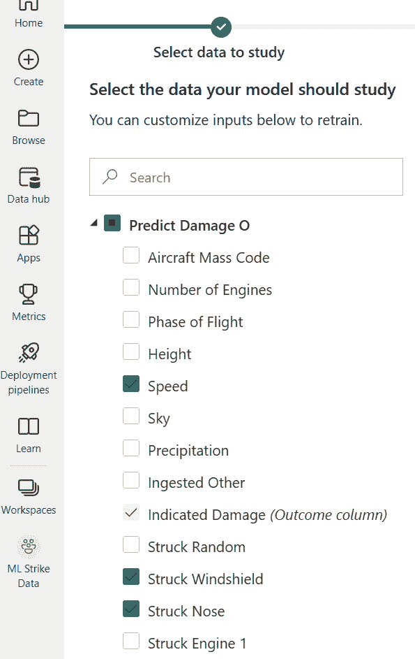

# 8

# 使用 Power BI 构建机器学习模型

在本书的*第七章*中，你在 Power BI 数据流中构建了三个查询，这些查询将在 Power BI 中用于机器学习。FAA 野生动物撞击数据是这些数据的来源，你将使用这些数据来构建你的 Power BI 机器学习模型。这些查询是与飞机撞击野生动物事件报告相关的特征集。

在本章中，你将使用在*第七章*中创建的查询构建和训练机器学习模型。在*第一章*中，你确定将创建一个二进制预测模型来预测是否发生了损坏，一个用于预测野生动物大小的通用分类模型，以及一个回归模型来预测与造成损坏的野生动物撞击相关的高度。在本章结束时，你将准备好评估你构建的机器学习模型的结果。我们将在下一章中这样做。

# 技术要求

你需要以下内容来完成本章：

+   来自 FAA 网站或 Packt GitHub 网站的 FAA 野生动物撞击数据文件

+   Power BI Pro 许可证

+   以下任一 Power BI 许可证选项用于访问 Power BI 数据流：

    +   Power BI Premium

    +   Power BI Premium 按用户计费

+   将数据导入 Power BI 云服务的以下任一选项：

    +   微软 OneDrive（与 Power BI 云服务连接）

    +   微软 Access 和 Power BI 网关

    +   Azure Data Lake（与 Power BI 云服务连接）

# 在 Power BI 中构建和训练二进制预测机器学习模型

你终于准备好在 Power BI 中构建和训练你的第一个机器学习模型了！我们将从一个二进制预测模型开始，该模型将预测野生动物撞击飞机时是否发生了损坏。如*第一章*中所述，二进制预测模型将对包含预测特征的列的给定数据行进行是/否的预测。你在*第七章*中构建的查询位于你的**ML Queries**数据流中，并命名为**Predict Damage**。

你将按照以下步骤构建你的预测模型：

1.  通过选择**新建** | **数据流**在你的 Power BI 工作区中创建一个新的数据流。

1.  选择**从其他数据流链接表**。

1.  确保你已登录到你的组织账户并选择**下一步**。

1.  展开你的 Power BI 工作区文件夹，展开**ML Queries**数据流，选择**Predict Damage**，然后点击**转换数据**。

1.  保存并关闭新的数据流。

1.  将新的数据流命名为`Predict` `Damage ML`。

1.  刷新新的数据流。

现在，你可以在 Power BI 工作区中开始构建你的二进制预测机器学习模型。

1.  点击你的工作区中的新数据流**Predict Damage ML**。

1.  点击工具栏上的**机器学习模型**。

1.  选择如图所示的**开始**：

图 8.1 – 在 Power BI 数据流中启动 ML 模型

现在，选择 ML 模型将要预测的数据列。对于您的二进制预测模型，您必须选择一个有两个可能结果的数据列。在`预测损伤`表中的`指示损伤`列，当报告野生动物撞击时包含`1`值，当未报告损伤时包含`0`值。每一行代表一个独特的野生动物撞击事件。

1.  选择`预测损伤`表。

1.  选择`指示损伤`。

1.  点击**下一步**。您的屏幕应该如下所示：

图 8.2 – 选择二进制预测模型的表格和结果列

Power BI 自动识别`指示损伤`列。`1`值表示报告了损伤，这是 ML 模型最感兴趣的预测。损伤是较少见的结果，也将与可能的安全问题和成本相关联。

1.  从**选择目标结果**字段中选择**1**。

1.  对于`1`表示预测准确匹配结果。

1.  对于`非 1`表示预测未达到目标。

1.  在您点击**下一步**之前，您的屏幕应该看起来像以下截图：

图 8.3 – Power BI 检测到二进制预测模型的拟合

选择用于训练二进制预测 ML 模型的特征是下一步。如您在*图 8.4*中看到的那样，Power BI 已检测到与结果相关的列。在拍摄此截图时，推荐的列包括**速度**、**撞击挡风玻璃**、**撞击机头**、**吸入发动机 2**、**撞击螺旋桨**、**撞击机翼或旋翼**、**撞击机身**、**撞击起落架**、**撞击尾部**和**尺寸**。您检查所有不直接指示某种形式损伤的列的复选框，这些列不在推荐之列。建议基于数据样本，因此特征中可能存在一些未被标记的隐藏宝藏。除非有太多唯一值，否则将所有特征添加到 Power BI AutoML 工具的第一步尝试中并无害处。您将在迭代 ML 模型并尝试改进未来结果时削减特征。以下是您检查所有特征之前的选择页面截图：

图 8.4 – ML 模型的默认列选择包含 Power BI 推荐列

现在您可以选择将要训练的 ML 模型的设置。

1.  给 ML 模型起一个像`预测损伤 ML 模型`这样的名字。

1.  在**描述**字段中添加描述。

1.  选择`29`分钟。请注意，你也可以在不同的持续时间下重新运行训练过程以比较结果。

1.  注意，在屏幕底部，Power BI 表示它将自动使用**20%**的数据进行测试，**80%**的数据进行训练。以下是在你选择**保存并训练**之前的截图：

图 8.5 – 命名和训练机器学习模型的设置

一旦你选择**保存并训练**，Power BI 将开始训练和测试不同的机器学习算法，以找到最适合你数据的最优拟合。现在你可以放松，让 Power BI 做工作，然后继续你的下一个机器学习模型！机器学习模型训练完成后，你将在下一章深入探讨测试结果。

# 在 Power BI 中构建和训练通用分类机器学习模型

接下来，进行你的第二个机器学习模型，你将根据关于撞击的数据预测撞击飞机的野生动物的大小。这个机器学习模型可以用于预测可能撞击飞机的物种。使用名为**Predict Size**的**ML Queries**数据流中的查询：

1.  通过选择**新建** | **数据流**在你的 Power BI 工作区中创建一个新的数据流。

1.  选择**从其他数据流链接表**。

1.  确保你已登录到你的组织账户并选择**下一步**。

1.  展开 Power BI 工作区文件夹，展开**ML Queries**数据流，选择**预测大小**，然后点击**转换数据**。

1.  保存并关闭新的数据流。

1.  将新的数据流命名为`Predict Size ML`。

1.  刷新新的数据流。

现在，你可以在 Power BI 中开始构建你的通用分类机器学习模型。

1.  点击你工作区中的新**Predict Size ML**数据流。

1.  点击**机器学习模型**的标签页。

1.  选择**开始**。

对于一个通用分类机器学习模型，你现在选择一个具有两个以上可能值的列进行预测。在**Predict Size**表中的**大小**列包含三个值：**大**、**中**和**小**。每一行仍然代表一个独特的野生动物撞击事件，就像在先前的二分类机器学习模型中一样。

1.  选择**预测大小**表。

1.  选择名为**大小**的结果列。

1.  点击**下一步**。

1.  Power BI 自动识别**通用分类**模型是最佳选择。在你点击**下一步**之前，你的屏幕应该看起来像以下截图：

图 8.6 – Power BI 检测到通用分类模型的拟合

与之前的二进制预测 ML 模型一样，Power BI 将为您构建模型的第一尝试推荐特征。在本书编写时，用于您的通用分类 ML 模型的推荐列包括**机场 ID**、**飞机质量代码**、**发动机数量**、**飞行阶段**、**高度**、**速度**、**天空**、**降水**、**吸入其他**、**指示性损害**、**随机撞击**、**随机损坏**、**挡风玻璃撞击**、**挡风玻璃损坏**、**机头撞击**、**机头损坏**、**发动机 1 撞击**、**发动机 2 损坏**、**发动机 3 撞击**、**螺旋桨撞击**、**机翼或旋翼撞击**、**机翼或旋翼损坏**、**机身撞击**、**机身损坏**、**起落架撞击**、**尾巴撞击**、**尾巴损坏**、**灯光撞击**、**灯光损坏**、**其他撞击**、**对飞行的影响**、**吸入的发动机数量**、**吸入的发动机百分比**、**损坏的发动机数量**和**月份编号**。注意这些特征，然后也在 Power BI ML 工具的第一遍中检查其他特征的复选框。

现在，您可以为将要训练的 ML 模型选择设置。

1.  为 ML 模型命名，例如`Predict Size` `ML Model`。

1.  在**描述**字段中添加描述。

1.  在**训练时间**中选择一个值。

1.  一旦您选择**保存并训练**，Power BI 将开始训练和测试不同的 ML 算法，以找到最适合您数据的最优匹配。

一旦您为您的 ML 模型构建留出一些时间，您可以在下一章中回顾测试数据。

# 在 Power BI 中构建和训练回归 ML 模型

最后，您将构建一个 ML 模型来预测与野生动物撞击相关的冲击高度。回归 ML 模型可以根据用于训练模型的特征预测数值。此 ML 模型在野生动物撞击造成损害时预测预期成本可能很有用。使用名为**预测高度**的**ML 查询**数据流中的查询：

1.  通过选择**新建** | **数据流**在您的 Power BI 工作区中创建一个新的数据流。

1.  选择**从其他数据流链接表**。

1.  确保您已登录到您的组织账户并选择**下一步**。

1.  展开您的 Power BI 工作区文件夹，展开数据流**ML 查询**，选择**预测高度**，然后点击**转换数据**。

1.  保存并关闭新的数据流。

1.  将新的数据流命名为`Predict` `Height ML`。

1.  刷新新的数据流。

现在，您可以在 Power BI 中开始构建您的回归 ML 模型。

1.  在您的工作区中点击新的**预测高度 ML**数据流。

1.  点击**机器** **学习模型**的选项卡头。

1.  选择**开始使用**。

一个回归机器学习模型将根据特征预测一个数值。在这个用例中，你将构建一个预测与野生动物撞击相关的高度的机器学习模型。在**预测身高**表中的名为**身高**的列包含表示地面以上的英尺数的整数值。每一行仍然代表一个独特的野生动物撞击事件。

1.  选择**预测身高**表。

1.  选择名为**身高**的**结果列**。

1.  点击**下一步**。

1.  如果没有自动检测到回归用例，Power BI 会为你提供所有三种机器学习模型类型的选择。如图*图 8**.7*所示，在点击**下一步**之前，点击**回归**：

图 8.7 – 回归模型将预测数值

Power BI 再次推荐特征，你可以在第一次运行机器学习模型时选择所有这些特征。

现在你可以选择将要训练的机器学习模型的设置。

1.  给你的机器学习模型起一个名字，例如 `预测身高` `机器学习模型`。

1.  在**描述**字段中添加一个描述。

1.  在**训练时间**中选择一个值。

1.  一旦你选择了**保存并训练**，Power BI 将开始训练和测试不同的机器学习算法，以找到最适合你数据的最佳模型。

你现在已经到达了一个项目阶段，其中所有三个机器学习模型的第一次尝试都已经构建完成。虽然这可能看起来很简单，但在接下来的章节中仍然有许多工作要做！

# 摘要

在本章中，你使用 Power BI 构建数据流并训练了一个二元预测机器学习模型、一个通用分类模型和一个回归模型。这三个模型都依赖于你在*第七章*中完成的工作，以识别 FAA 野生动物撞击数据中的特征，为机器学习准备查询，然后将所有内容发布到 Power BI 云服务。

在*第九章*中，你将回顾机器学习模型的测试结果，并评估测试预测的准确性。需要改进的机器学习模型可以根据需要修改和重新训练，直到获得可接受的结果。
