# 第九章：评估训练和测试的机器学习模型

在本书的*第八章*中，您在 Power BI 中构建了三个机器学习模型。这些模型使用 FAA 野生动物撞击数据进行训练和测试，并试图预测以下内容：

+   野生动物撞击飞机是否造成损坏

+   撞击飞机的野生动物的大小

+   野生动物撞击发生的高度

本章将回顾 Power BI 在训练机器学习模型后进行的测试结果。在查看测试结果后，您将更改训练数据，目的是提高机器学习模型的预测能力。在本章结束时，所有三个机器学习模型都准备好部署并配置以供 Power BI 使用。

# 技术要求

如果您是机器学习的新手，在阅读本章之前，您可能需要研究以下几个关键术语。这里给出的定义直接取自以下链接的文档：[`learn.microsoft.com/en-us/azure/machine-learning/how-to-understand-automated-ml?view=azureml-api-2#classification-metrics`](https://learn.microsoft.com/en-us/azure/machine-learning/how-to-understand-automated-ml?view=azureml-api-2#classification-metrics)：

+   **曲线下面积**（**AUC**）：AUC 可以解释为正确分类样本的比例。更精确地说，AUC 是分类器将随机选择的正样本排名高于随机选择的负样本的概率。

+   **召回率**：召回率是指模型检测所有正样本的能力。

+   **精度**：精度是指模型避免将负样本标记为正样本的能力。

与前几章一样，您需要以下内容：

+   来自 FAA 网站或 Packt GitHub 网站的 FAA 野生动物撞击数据文件

+   Power BI Pro 许可证

+   以下 Power BI 许可选项之一用于访问 Power BI 数据流：

    +   Power BI Premium

    +   Power BI Premium 按用户

+   将数据导入 Power BI 云服务的以下选项之一：

    +   Microsoft OneDrive（与 Power BI 云服务连接）

    +   Microsoft Access + Power BI 网关

    +   Azure 数据湖（与 Power BI 云服务连接）

# 评估 Power BI 中预测损坏 ML 模型的测试结果

在三个机器学习模型完成训练后，您可以使用 Power BI 中的预构建报告查看每个模型的测试结果。训练报告将提供指标，帮助您确定模型是否对预测的价值有一些反馈。您从**预测损坏 ML 模型**开始，这是一个二元预测机器学习模型。在您的工作区中，按照以下步骤操作：

1.  点击**预测损坏 ML 模型**数据流。

1.  在功能区选择**机器学习模型**。

1.  在**操作**列下，点击剪贴板以访问**查看训练报告**，如下截图所示：

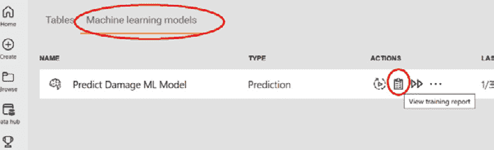

图 9.1 – 预测损伤机器学习模型训练报告的导航

1.  报告应展开，看起来像以下图示：

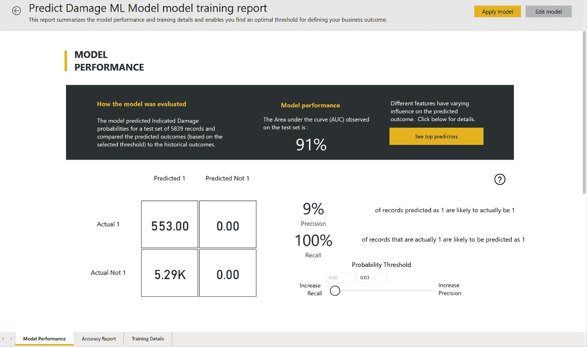

图 9.2 – 预测损伤机器学习模型的训练报告

注意，由于测试数据的随机抽样以及用于训练和测试的源数据范围的任何变化，此页上的指标可能不同。此外，Power BI ML 将随机将数据分为测试集和训练集，每次运行可能都不同。

## 预测损伤机器学习模型的模型性能

预测损伤机器学习模型的测试产生了一些有趣的结果。在上面的示例中，你可以看到模型性能，或 AUC，列出的值为 91%。AUC 越接近 100%，机器学习模型在整体正确预测方面的表现就越好。你可能会首先认为这是成功的，但还有一些额外的细节需要考虑。

对于二元预测机器学习模型，预测结果为 1（是）或 0（否）。当预测是否由于野生动物撞击造成损坏时，每行数据有四种可能的预测结果，并与实际结果进行比较：

| **预测** | **实际发生的情况** | **结果** |
| --- | --- | --- |
| 发生了损坏 | 实际上发生了损坏 | 真阳性 |
| 发生了损坏 | 没有发生损坏 | 假阳性 |
| 没有发生损坏 | 实际上发生了损坏 | 假阴性 |
| 没有发生损坏 | 没有发生损坏 | 真阴性 |

图 9.3 – 测试机器学习模型与现实的四种可能结果

如*图 9.2*所示，在报告的右下角有一个滑动条过滤器，称为**概率阈值**。概率阈值是分配给每个预测的介于零和一之间的值，以表示预测的确定性。99 的概率得分可以解释为“*机器学习模型有 99%的确定性认为这一事件造成了损坏*。”你能依赖机器学习模型的确定性吗？这个数字反映了现实吗？测试结果可以帮助你找出答案！

你将概率阈值移动到`0.50`并查看结果。注意页面上的其他值发生变化：

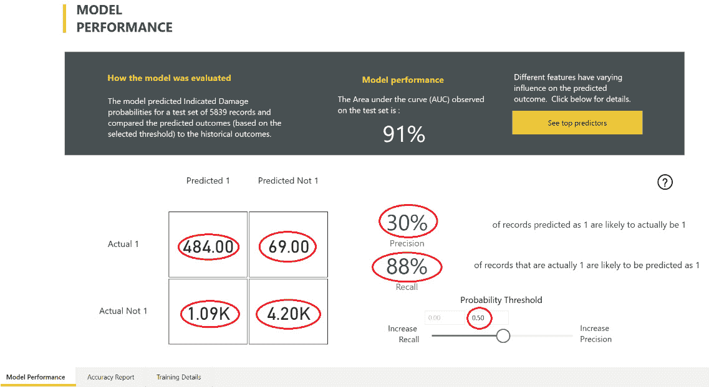

图 9.4 – 将概率阈值设置为 0.50 的模型性能报告

从有四个框的网格开始，你注意到有 484 起事件被正确预测为发生了损坏。然而，有 69 起实际发生损坏的事件被机器学习模型遗漏。484/(484 + 69)大约是`0.50`，只有**30%**的标记为造成损坏的事件实际上造成了损坏。

当概率阈值设置为`0.80`时，指标发生变化：

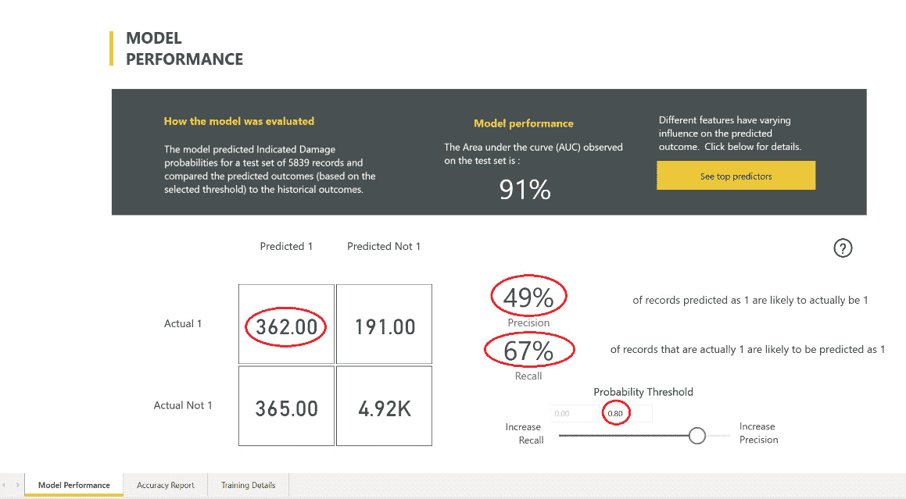

图 9.5 – 将概率阈值设置为 0.80 的模型性能报告

当设置为 `0.80` 时，`0.80` 可能会消除假阳性，但 33%（1 – **召回率** 为 0.67）的实际真实损害事件将被遗漏。

总结来说，**概率阈值** 作为一种截止值，可以影响此二进制预测机器学习模型的四种可能结果，如下面的图表所示。

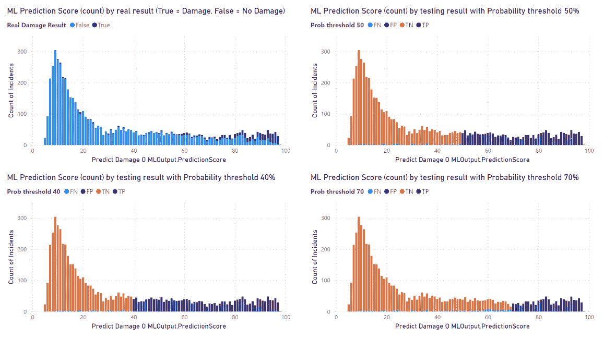

图 9.6 – 概率阈值对结果与实际测试结果的影响

让我们分解 *图 9.6*：

+   左上角的图表显示了每个事件的实际结果，其中 **机器学习预测分数** 在 *x* 轴上

+   右上角的图表显示了将 `0.50` 设置在 **假阴性**（**FN**）、**假阳性**（**FP**）、**真阴性**（**TN**）和 **真阳性**（**TP**）上的影响

+   左下角的图表显示了将 `0.40` 设置的影响

+   右下角的图表显示了将 `0.70` 设置的影响

*图 9.7* 从实际角度总结了改变 **概率阈值** 对此机器学习模型的影响：

| **测试结果** | **增加** **概率阈值** | **减少** **概率阈值** |
| --- | --- | --- |
| 真阳性 | 更少 | 更多 |
| 真阴性 | 更多 | 更少 |
| 假阳性 | 更少 | 更多 |
| 假阴性 | 更多 | 更少 |

图 9.7 – 概率阈值对测试结果的影响

你需要回到你的利益相关者那里，请求他们对 *图 9.6* 和 *9.7* 中不同可能结果的重要性提供反馈。将这种影响用非技术性语言表达可能是一个挑战。最佳的 **概率阈值** 将取决于你利益相关者的需求。你需要询问类似以下的问题：

*你希望更频繁地标记事件，以尽可能多地捕获有损害的真实事件，但代价是会有更多未造成损害的错误标记事件？还是你希望标记的事件更少，错误标记的事件也更少，但代价是未标记并遗漏一些有损害的事件*？

屏幕已被分成两半以提高可见性。*图 9.8* 展示了屏幕的左侧：

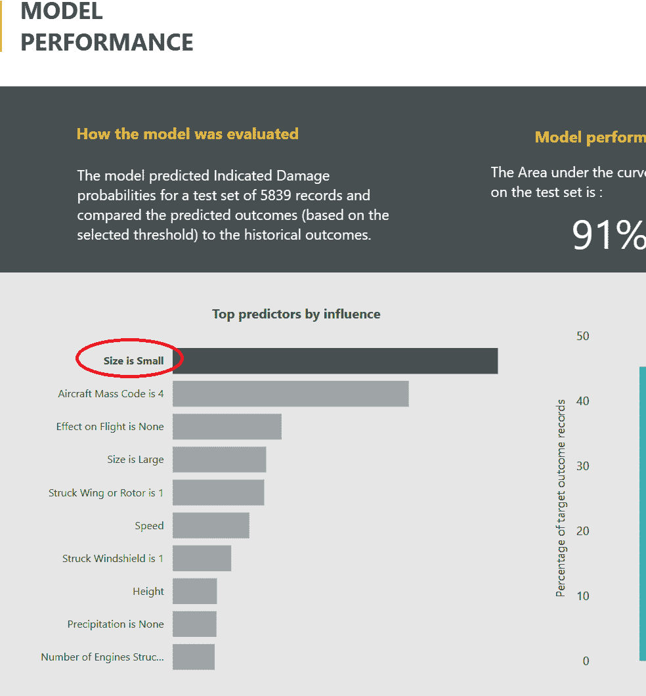

图 9.8 – 预测损害机器学习二进制预测模型的顶级预测因子

在报告页面的右上部分（见 *图 9.9*），你点击一个标有 **查看顶级预测因子** 的黄色框。显示了一个顶级预测特征的列表，然后你点击 **大小** **为小**：

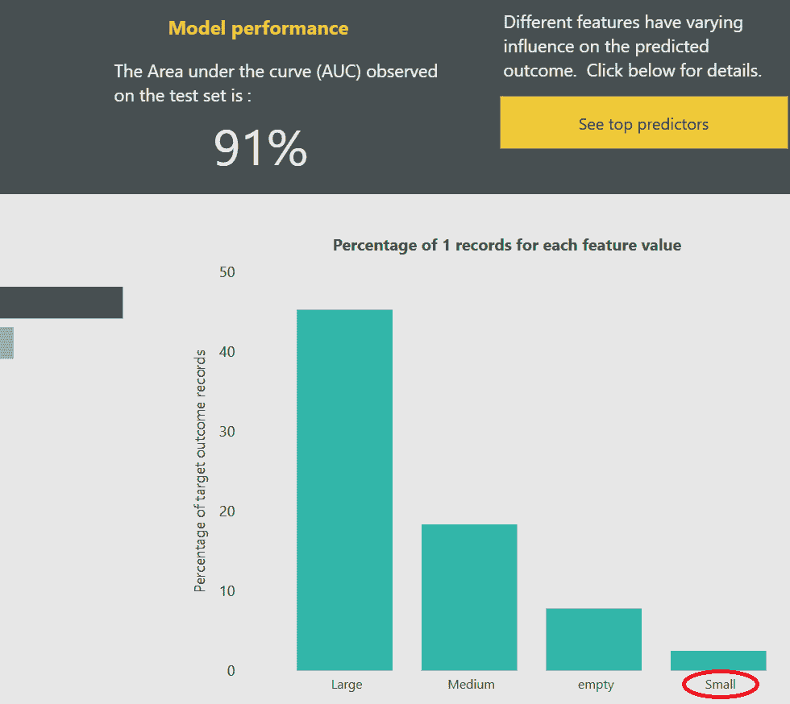

图 9.9 – 预测损害机器学习二进制预测模型的顶级预测因子

您可以看到，当您点击一个预测器（特征）值时，右侧会弹出一个图表来可视化该特征。您还可以在这些图表上悬停以获取更多细节。对于**尺寸小**，图表显示当**尺寸大**时，损伤发生大约 45%的时间。当**尺寸小**时，损伤发生大约 2.5%的时间。这差距很大！您可以点击每个顶级预测器并记录发现。

在**模型性能**页面的底部，您会发现一个带有过滤器的**成本效益分析**图表，如图*图 9.9*所示：

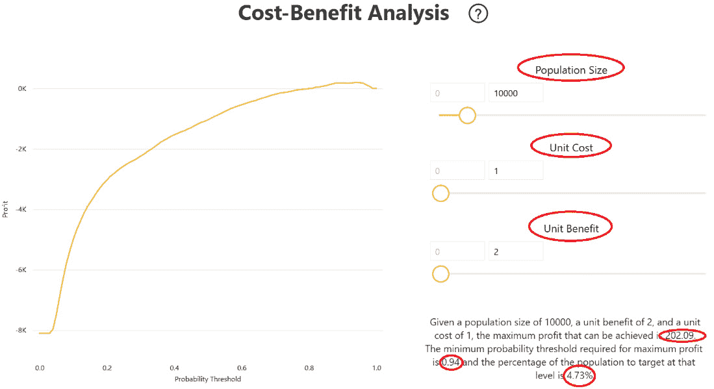

图 9.10 – 预测损伤机器学习的成本效益分析

用实际术语总结此图表的最好方法是，它允许您确定不同`10,000`的影响，预测的成本（`1`），以及正确预测的相对效益设置为`2`，那么测试的最大利润将是`202.09`，如果阈值设置为`0.94`，那么只有`4.73%`的人口将被定位。对于这个特定的用例，**概率阈值**的设置可能需要与您的利益相关者进行讨论。虽然这是一个有趣的讨论点，但还有其他因素需要考虑野生动物撞击飞机的影响，例如乘客安全、对野生动物的影响、最终用户对预测的使用，等等。

## 预测损伤机器学习模型的准确率报告

接下来，您将转到训练报告的下一页，命名为**准确率报告**，如下截图所示。

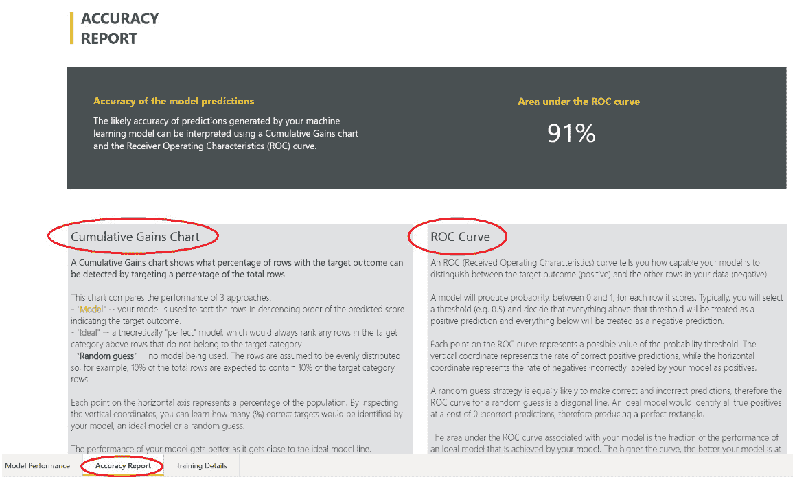

图 9.11 – 预测损伤机器学习二分类预测模型的准确率报告

准确率报告的顶部提供了对**累计收益图**和**ROC 曲线**分解的详细解释。向下滚动页面以查看这些图表。**累计收益图**位于左侧，显示了 ML 模型与完美模型和随机猜测相比的性能。当您悬停在曲线上并向右移动时，您可以看到随着**概率阈值**的降低，性能的变化：

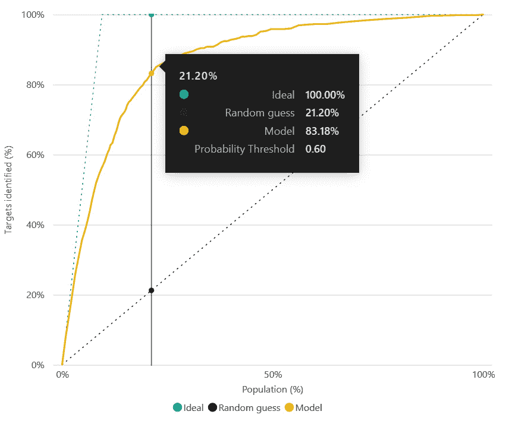

图 9.12 – 累计收益图（左侧）显示了与完美模型和随机猜测的测试结果

页面右侧的**ROC 曲线**显示了模型如何将正例预测为正例（真阳性）和负例预测为负例（真阴性）。向上向左升高的曲线表示良好的性能：

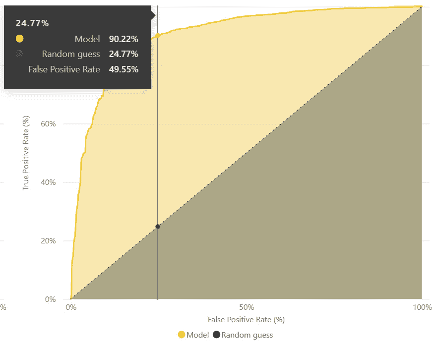

图 9.13 – ROC 曲线（右侧）可视化 ML 模型区分目标结果的能力

## 预测损伤机器学习模型的训练详情

最后，你将翻到报告的最后一页，该页名为**训练详情**。此页顶部显示有关测试的详细信息，例如样本行数、用于测试的行数、选为最佳结果的模型类型以及用于确定最佳拟合模型的迭代次数。该页面可以在*图 9.13*中查看：

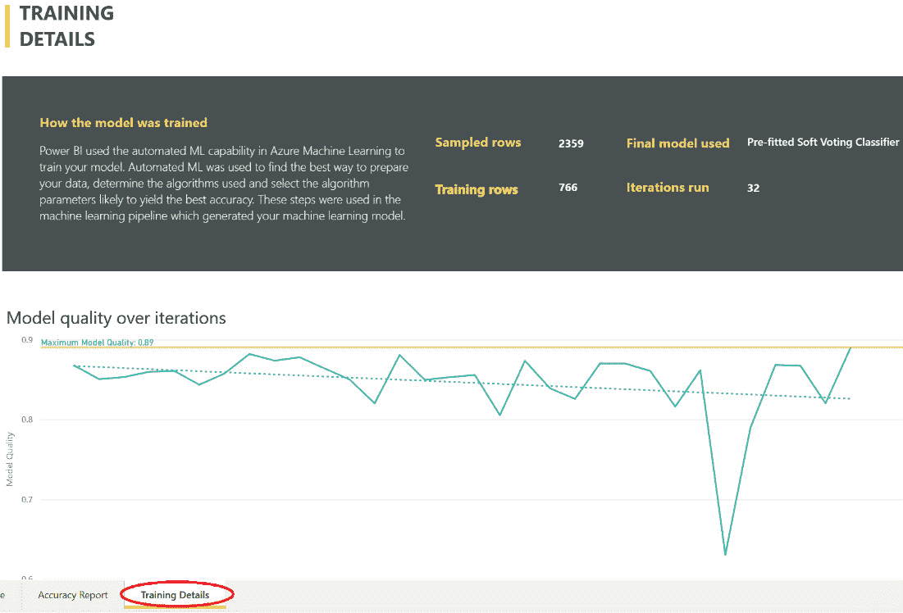

图 9.14 – 预测损伤 ML 二元预测 ML 模型的训练详情

你还会注意到**模型质量随迭代变化**图表，显示了迭代训练和测试期间 ML 模型的质量比较。滚动到页面底部，你可以查看有关 ML 模型的详细信息，例如模型中的特征、这些特征的数据类型和插补，以及用于创建模型的参数。以下是截图：

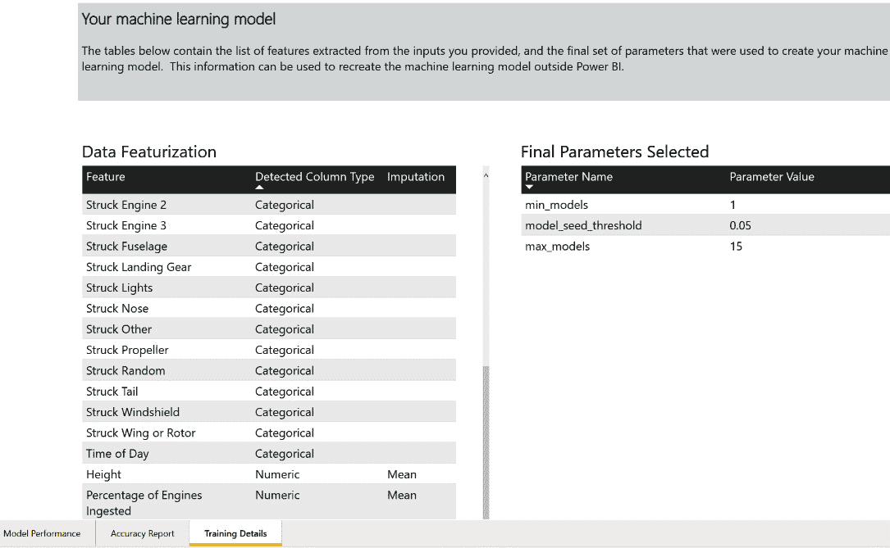

图 9.15 – 包括特征和参数的 ML 模型详情

滚动到**训练详情**页面的底部三分之一，你会看到一个饼图，显示了作为集成模型一部分使用的不同 ML 算法。将鼠标悬停在算法上，你可以看到有关其使用方式的详细信息。使用 Power BI，你使用 SaaS ML 工具，因此不需要深入了解这些细节。如果数据科学团队想要通过在 Azure ML 等工具中构建自定义 ML 模型来扩展你的发现，这些信息可能对他们规划后续项目时很有价值：

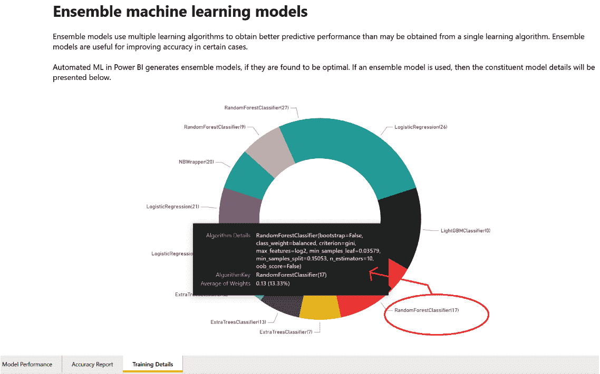

图 9.16 – 预测损伤 ML 模型的集成机器学习模型算法

回顾创建**预测损伤 ML**模型的过程，你包含了一个长长的特征列表，你考虑了这些特征可能具有预测能力。在*第十章*中，你将重新审查这个 ML 模型，在部署 ML 模型之前，使用一个更简洁且仔细选择的特征列表对其进行重新训练。现在，你准备好继续本章的下一个 ML 模型。

# 在 Power BI 中评估预测大小 ML 模型的测试结果

你接下来要审查的下一个 ML 模型是一个用于预测撞击飞机的野生动物大小的分类模型。这些预测并不一定表示实际动物的大小。例如，一大群较小的鸟也可能被视为大型撞击。预测这些值可以帮助理解被认为更严重的意外事件的概率。

## 预测大小 ML 模型的模型性能

继续到测试结果，以预测动物或动物撞击飞机的大小，你将遵循与上一节类似的步骤来打开报告。从你的 Power BI 工作区，执行以下操作：

1.  点击**Predict Size ML** **模型**数据流。

1.  在功能区，选择**机器学习模型**。

1.  在**操作**列下，点击剪贴板以访问**查看****训练报告**。

1.  报告应该看起来像以下图示，在柱状图上，你可以点击**小型**类别：

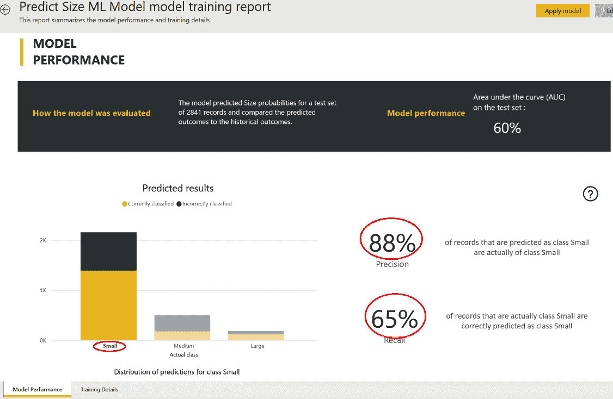

图 9.17 – 选择小型类别时 Predict Size ML 分类模型的训练报告

首先，你会注意到这份报告看起来略有不同，因为它是为不同类型的机器学习模型，即分类模型而准备的。报告右上角的 AUC（曲线下面积）为`60%`。一般来说，AUC 低于 70%并不是很好。AUC 为 50%通常代表随机猜测，而 60%只是略高于这个值。你需要深入查看测试结果以找到改进的机会。

**小型**类别（你在图 9.16 中点击的）的**精确度**评分为**88%**，这意味着当做出**小型**预测时，88%的情况下结果是正确的。**召回率**对于**小型**仅为**65%**，这意味着只有 65%的实际小型事件被捕捉到。

现在，点击**中等**类别：

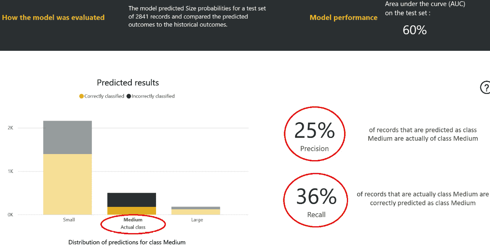

图 9.18 – 选择中等类别时 Predict Size ML 分类模型的训练报告

预测**中等**的结果并不理想。**精确度**评分为**25%**，这意味着大多数**中等**预测都是错误的。更令人失望的是，只有**36%**的实际中等打击事件被**中等**预测捕捉到。

让我们继续到**大型**类别：

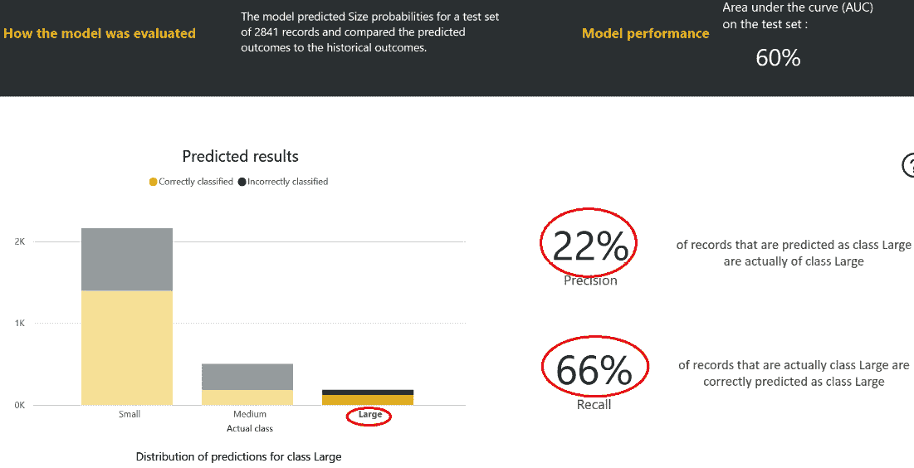

图 9.19 – 选择大型类别时 Predict Size ML 分类模型的训练报告

**大型**类别的**精确度**评分为**22%**，这意味着**大型**预测只有大约五分之一的时候是正确的。在这些预测中，**66%**的实际大型事件被捕捉到。总的来说，**大型**预测通常不准确，但大约三分之二的实际大型事件都被捕捉到。

滚动到**模型性能**页面的底部，你可以点击预测的不同类别，以查看顶级预测因素。在**大型**类别中，点击**指示损坏**条形图，将在右侧弹出图表，显示该特性的详细信息：

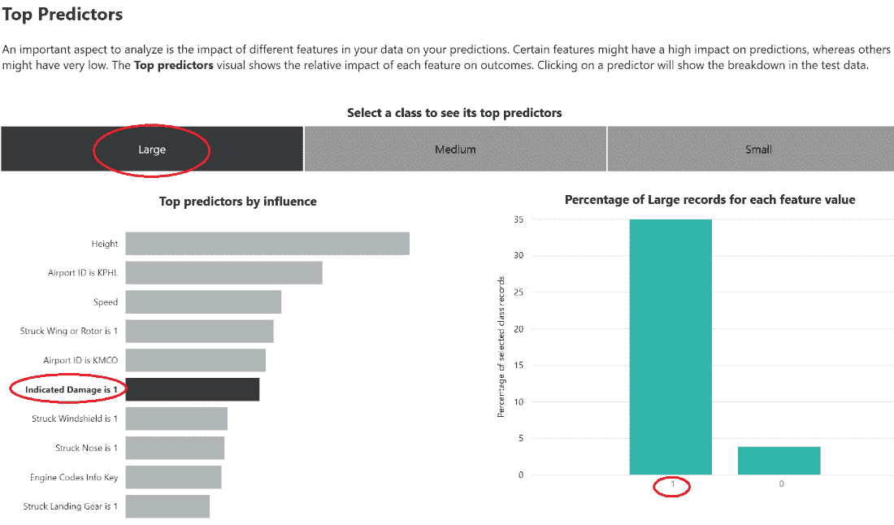

图 9.20 – 大类中指示损坏的顶级预测因素细节

当类别是**大型**时，*图 9.18*左侧图表中的特性被确定为影响该类别的因素。你点击了**指示损坏**特性，可以看到当该值为**1**时，该类别将有 35%的时间是**大型**。当设置为**0**时，**大型**分类的发生率不到 5%。你可以点击不同的类别（**大型**、**中型**和**小型**）来查看顶级影响因素，并为你的下一个机器学习模型迭代做笔记。

## 预测大小机器学习模型的训练细节

继续浏览到**预测大小机器学习**的**训练细节**页面，你会看到一个与**预测损坏机器学习**相似的页面：

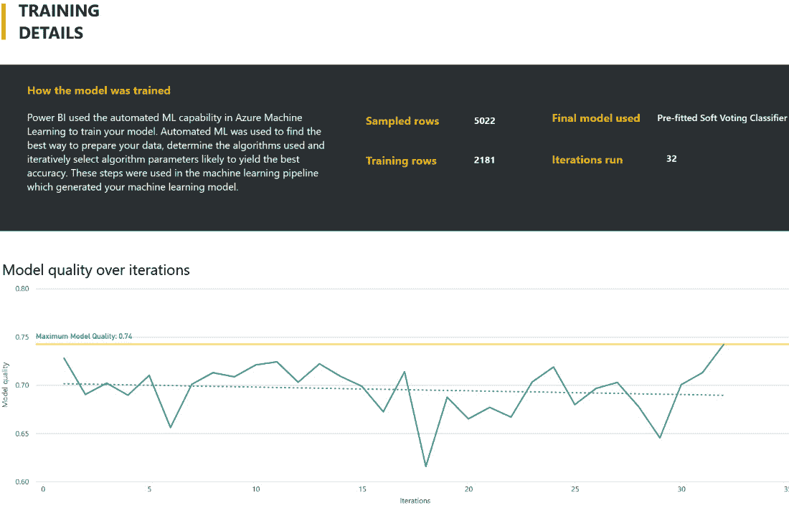

图 9.21 – 训练细节包含有关训练机器学习模型的详细信息

有趣的是，随着迭代次数的增加，机器学习模型的质量有所下降。在机器学习中，更多的数据并不总是更好的，更大的复杂性也不总是能带来更好的结果。作为一个对这些工具的新手，有时，试错是熟悉这些概念的最佳方式。

滚动到**训练细节**页面的中间，你可以查看机器学习模型中使用的特性和最终参数。同样，这是一个与**预测损坏****机器学习**报告相似的页面：

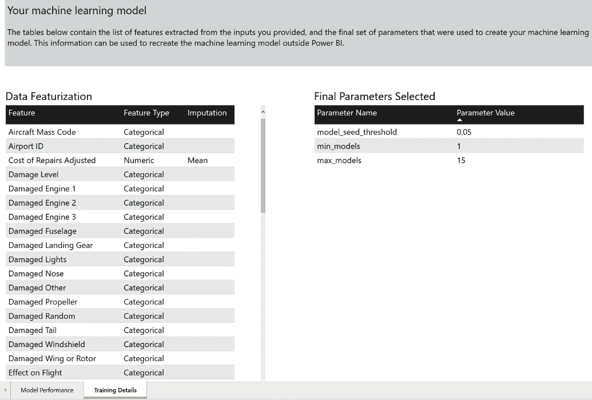

图 9.22 – 预测大小机器学习模型的特性和参数

你也可以向下滚动到页面的底部三分之一，查看**集成机器学习**信息。正如在**预测损坏机器学习**中所述，这些信息很有趣，但主要对希望将本项目发现扩展到 Azure ML 等工具的数据科学家有用。你将在下一章重新访问这个机器学习模型，但现在你可以继续浏览到**预测高度****机器学习**模型。

# 在 Power BI 中评估预测高度机器学习模型的测试结果

最后，你回顾了**预测高度机器学习**模型的测试结果。这是一个回归模型，试图预测野生动物撞击飞机的高度。此模型不预测是/否答案或分类值，而是预测从地面起的高度数值。

## 预测高度机器学习模型的模型性能

首先，导航到训练报告的**模型性能**页面：

1.  点击 **预测高度 ML** **模型** 数据流。

1.  在功能区选择 **机器学习模型**。

1.  在 **操作** 列下，点击剪贴板以访问 **查看** **训练报告**。

1.  报告应类似于以下图示：

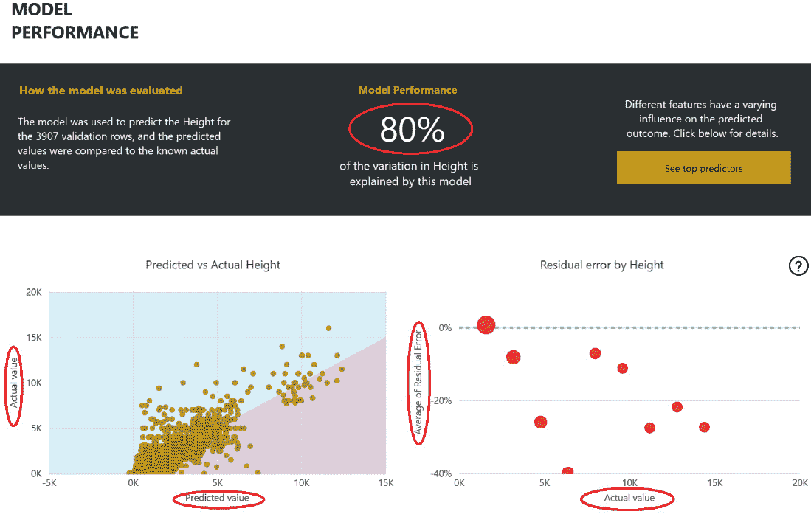

图 9.23 – 预测高度 ML 回归模型的性能

首先，您会注意到页面顶部 **模型性能** 为 **80%**。对于回归模型，预测值与实际结果之间的数值差异由这个值表示。特征提供了可预测性，但您希望这个数字更高以获得更好的结果。

页面左侧的图表 **预测值与实际高度** 绘制了发生撞击的高度处的 **实际值** 与 **预测值**。由于不同的飞机型号、天气、物种以及许多其他因素，预期会有变化。完美的可预测性会在图表的红蓝部分之间分离的线上显示点。您可以看到回归线通常贯穿结果。

在页面右侧的 *图 9*.22 中，**残差错误按高度** 图表显示了测试的不同值的平均误差。-5% 的值意味着预测通常对于一系列值来说低 5%。您会注意到 *x* 轴上的第一个气泡接近 0%。当您悬停在它上面时，您会看到值，并且您可以点击它以过滤左侧的图表：

图 9.24 – 最小高度范围内的残差错误数极高

观察到 **预测值与实际高度** 图表，您可以看到地面以上低高度有 **1%** 的残差错误。

如果您点击从左数第三个气泡，即 6,500-7,800 英尺的高度，平均残差错误现在为 **-40%**：

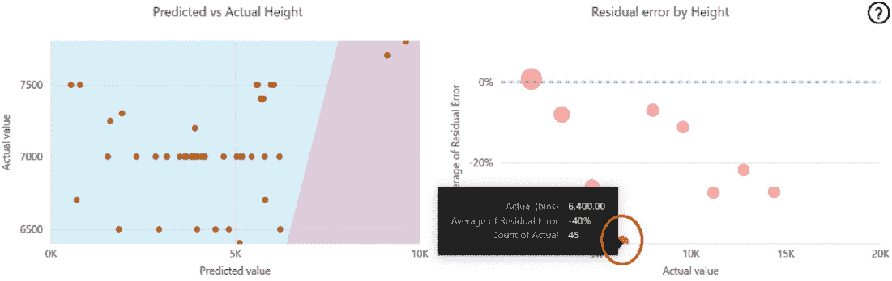

图 9.25 – 覆盖高度为 3,200-4,500 英尺的箱子具有较低的平均残差错误数

在第三箱的 **预测高度与实际高度** 图表上，当您点击气泡以过滤左侧图表时，会发现许多实际值报告在 6,500、7,000 和 7,500 英尺的高度。研究这种一致性的原因可能有助于您理解源数据中的细微差别。飞行员是在估计野生动物撞击事件的高度吗？当它们不增加或减少高度时，这些是否是飞机飞行计划的常见稳定高度？这种一致性仅仅是巧合吗？这种模式的根本原因只能通过进一步调查来发现。

## 预测高度 ML 的训练详情

继续查看**预测高度机器学习**的训练报告最后一页，名为**训练细节**，您会看到与前两个机器学习模型训练报告相似的报告结构。页面顶部显示了样本行数、用于训练的行数、最终使用的模型以及运行的迭代次数：

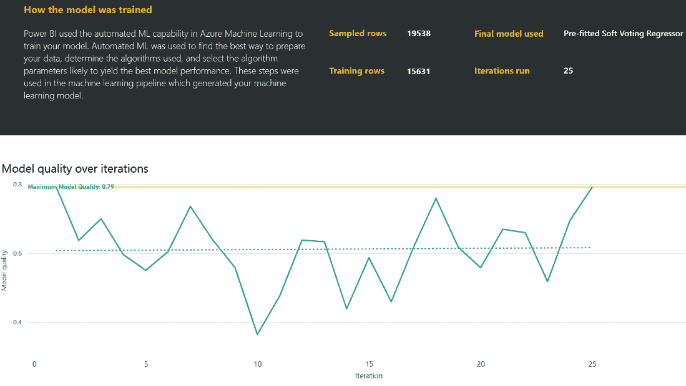

图 9.26 – **预测高度机器学习回归模型**的训练细节

滚动页面，您将再次看到关于使用的特征、参数以及 Power BI 中自动机器学习使用的算法的类似图表和信息。

完成对所有三个机器学习模型的测试和训练报告的审查后，您就可以进入本书的下一章了。

# 摘要

本章深入探讨了您**预测损伤机器学习**、**预测尺寸机器学习**和**预测高度机器学习**模型的训练和测试报告。在这个过程中，您回顾了 Power BI 中所有三种类型机器学习模型的报告：二元预测、分类和回归。您通过查看 Power BI 中的测试数据来评估每个模型预测的效果。您还探索了具有高度预测性的特征列表。

在下一章中，您将修改机器学习模型的筛选标准和选定的特征，目标是提高预测能力。迭代训练和测试是提高机器学习模型的最佳方式，这个过程将帮助您为超出本书范围的 Power BI 机器学习项目做好准备。
