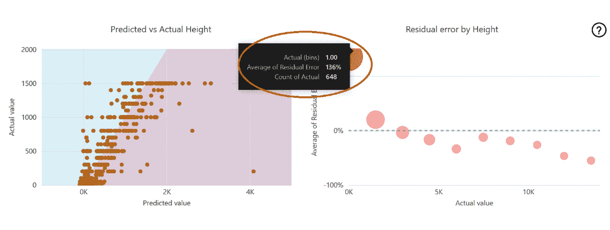

# 10

# 迭代 Power BI ML 模型

在 *第八章* 中，您使用为每个三个 ML 模型（即 **预测损害 ML**、**预测大小 ML** 和 **预测高度 ML**）选择的全部特征，利用 FAA 野生动物撞击数据库中的数据来训练 Power BI ML 模型。在 *第九章* 中，您评估了 Power BI 自动化训练和测试过程的测试结果。测试结果帮助您了解预测模型的优缺点，以及有助于正确预测的特征的详细信息。

本章将回顾第 *9 章* 的发现，并使用这些发现来决定您是否需要修改和重新训练 ML 模型，以通过迭代开发获得更好的结果。用于训练这些 ML 模型的特征列表可以缩减，筛选标准可以调整，新的一轮训练和测试的结果可以与第 *9 章* 的结果进行比较。

# 技术要求

本章的要求与前面章节相同：

+   来自 FAA 网站或 Packt GitHub 网站的 FAA 野生动物撞击数据文件

+   一个 Power BI Pro 许可证

+   以下 Power BI 许可证选项之一用于访问 Power BI 数据流：

    +   Power BI Premium

    +   Power BI Premium 每用户

+   以下选项之一用于将数据导入 Power BI 云服务：

    +   微软 OneDrive（与 Power BI 云服务连接）

    +   微软 Access 和 Power BI 网关

    +   Azure 数据湖（与 Power BI 云服务连接）

# ML 模型迭代的考虑因素

关于机器学习（ML）及其模型表现好坏的原因已经撰写了众多书籍，包括 Packt 出版的书籍。本书的目的是帮助您学习 Power BI，以便您可以探索 FAA 野生动物撞击数据，分析这些数据，然后创建 SaaS ML 模型。在本书的这一部分，您站在一个十字路口。您是否继续在 SaaS 工具中迭代这些 ML 模型？您是否已经证明了足够的价值，可以将 ML 模型项目移交给数据科学团队，他们将通过 Azure ML 或高级工具改进模型？或者您是否回到您的利益相关者那里，报告您的发现，并寻求下一步行动的指导？以下图表显示了您可以考虑的几个下一步选项：

图 10.1 – 您的 Power BI ML 模型的可能下一步

而不是深入探讨机器学习理论的技术细节，您将关注一些可以通过对每个 SaaS Power BI ML 模型进行修改来轻松解决的预测不准确的可能原因。根据您对每个模型的评估，您将根据*图 10**.1*中显示的选项决定下一步行动。让我们看看您应该考虑的几个话题。

## 不准确的数据

“*垃圾输入，垃圾输出*”是数据世界中的一个流行说法。用不良数据训练机器学习模型，或者通过机器学习模型对不良数据进行评分，可能会导致不准确的结果。这个问题可以通过您作为数据专业人士的工作来解决，但如果数据收集机制本身就有问题呢？如果源数据不准确，那么在不改变源数据收集过程的情况下，您能做的就只有这么多来解决这个问题。

## 预测价值低的特征

在对您的机器学习模型进行第一轮的训练和测试时，您将您从 FAA 野生动物撞击数据库中识别或创建的每个特征都通过 Power BI SaaS ML 工具进行了运行。不过不深入技术细节，对于机器学习来说（尤其是使用像 Power BI 这样的 SaaS 工具），保持小而简单是一个很好的目标。您在机器学习模型中包含的许多特征可能对预测价值贡献很小。您已经记录了被认定为具有预测价值的特征，但可能需要通过新的训练和测试迭代进行试错。您最终可能达到收益递减的点。那将是您能做的最好的吗，或者您应该将机器学习模型转交给拥有先进工具和技能集的数据科学团队？

## 数据量

讨论数据量对机器学习模型的影响可能需要一整本书。一般来说，具有良好数据的简单机器学习模型比复杂机器学习模型或使用不完美数据进行训练的模型需要的训练数据要少。再次强调，关于机器学习最佳数据量的主题超出了本书的范围，本书旨在创建 Power BI 中的简单 SaaS ML 模型。使用 Power BI SaaS ML 工具，将您的训练数据集保持在数万行或更少是一个很好的经验法则。

## 数据特性

机器学习模型可能会受到各种数据特性的影响，如下所示：

+   **特征的高基数**：一个分类列中过多的唯一值会降低该列的预测价值。例如，在 FAA 野生动物撞击数据库中包含每个机场的机场代码会导致高基数列。

+   **数据倾斜**：结果被捕获在数值范围或少数几个类别中，但其他选项缺失。例如，如果 FAA 野生动物撞击数据缺少高空撞击事件，或者如果大部分数据来自单个机场。如果准确数据自然存在倾斜，那么可以采用超出本书范围的高级技术来解决机器学习模型的倾斜问题。

+   其他特征，如 **偏差**、**过拟合**、**欠拟合** 以及许多其他潜在问题都可以进行评估。再次强调，这些主题在专注于机器学习理论的书籍中有详细讨论。

在继续之前，你需要明确你的目标和目标。你并不是试图使用 Power BI 机器学习工具创建完美的机器学习模型。相反，你正在证明 FAA 野生动物撞击数据对你预测损害、预测野生动物大小和预测撞击高度的使用案例的预测价值。你对每个这些机器学习模型所做的决定将向利益相关者展示，以展示你项目的结果，以及关于未来迭代机器学习模型和整个项目的建议。

# 评估预测损害二元预测机器学习模型

在前两章中构建和审查的 **预测损害机器学习** 模型旨在预测由于野生动物撞击飞机而报告损害的可能性。以下表格显示了该二元预测模型的训练报告中的几个关键指标：

| **指标名称** | **指标值** | **注释** |
| --- | --- | --- |
| **曲线下面积** (**AUC**) | 91% | AUC 表示机器学习模型的表现，100% 表示完美。50% 将是随机猜测，而低于 50% 表示预测比随机猜测更差。 |
| 训练行数 | 23,356 | 用于训练机器学习模型的行数。 |
| 测试行数 | 5839 | 用于测试训练的机器学习模型的行数。 |
| 成本效益分析最佳概率阈值 | 0.94 | 考虑精确度和召回率时的最大投资回报概率阈值。 |

图 10.2 – 初始预测损害机器学习模型的指标

在 *第十章* 中详细讨论了 **预测损害机器学习** 模型的测试结果。一般来说，91% 的 AUC 对于你的第一个机器学习模型来说不是一个坏的开始。你能使模型在预测损害方面做得更好吗？如果可以，你可以做出哪些改变？你可以从 **概率阈值** 设置的角度审查不同的指标：

| **概率阈值设置** | **精确度 – 有多少标记事件** **造成了损害？** | **召回率 – 有多少实际损害事件被标记为** **造成损害？** | **注释** |
| --- | --- | --- | --- |
| 0.94 | 67% | 38% | 最大成本效益分析阈值 |
| 0.70 | 44% | 75% | 不到一半的标记事件有实际损害，但 75% 被捕获 |
| 0.50 | 30% | 88% | 88% 的所有损害事件都被捕获，但标记的事件有 70% 的时间是误报 |
| 0.03 | 9% | 100% | 所有损害事件都被捕获，但 91% 的标记事件是误报 |

图 10.3 – 概率阈值设置对预测损害机器学习模型的影响

通过使用 Power BI 浏览这些特征并搜索本章前面提到的不同考虑因素，你可以权衡你的选项的优缺点。例如，在用于训练和测试的数据集中的 29,195 行中，**飞行阶段**特征**停放**仅在六行中使用。这六行中没有任何一行有损坏。从逻辑上讲，这很有道理，因为损坏大型停放飞机需要灰熊或大象的力量。你如何处理这种代表性不足的类别？现在是时候召唤数据科学团队了吗？你的选项已在以下表格中总结：

| **选项** | **考虑因素** |
| --- | --- |
| 转交给数据科学团队 |

+   可能可以通过更简单的 ML 模型减少大量特征以获得更好的结果

+   91%的 AUC 可能难以通过 SaaS ML 工具进行改进

+   ML 专家可以审查模型是否存在偏差和倾斜

|

| 用于生产 |
| --- |

+   ML 模型是否足够好，可以为利益相关者提供价值？

+   不正确预测的后果是什么？

+   你真的能解释是什么导致了预测吗？你需要能够做到这一点吗？

|

| 结束项目 | 除非预测提供很少的价值，否则现在结束这个 ML 模型的项目并没有太多意义 |
| --- | --- |
| 迭代 ML 模型 |

+   你能改进这个 ML 模型吗？

+   你能使其变得多好？

|

图 10.4 – 预测损坏 ML 模型的选项和考虑因素

最可能的现实世界决策是与利益相关者回过头来审查你的结果。最佳选择可能是将任务转交给能够审查和评估你的发现、改进 ML 模型并为利益相关者量化业务价值的数据科学团队。你也可以迭代现有的 ML 模型，但考虑到 91%的 AUC，你的努力可能更适合于更大的 FAA 野生动物撞击数据项目中的其他工作。

# 评估预测大小 ML 分类模型

`小型`、`中型`或`大型`。以下表格显示了 ML 模型初始版本的一些关键指标：

| **指标名称** | **指标** **值** | **注释** |
| --- | --- | --- |
| AUC | 60% | AUC 表示 ML 模型的表现，100%表示完美。60%比随机猜测要好，但并不好！ |
| 训练行数 | 11,368 | 用于训练 ML 模型的行数 |
| 测试行数 | 2,841 | 用于测试训练的 ML 模型的行数 |

图 10.5 – 预测大小 ML 分类模型的关键指标

这个模型的 AUC 仅为 60%，这并不好。你能做些什么来让它变得更好？首先，查看按类别划分的精确度和召回率指标：

| **类别** | **精确度 – 有多少标记的事件匹配** **该类别？** | **召回率 – 有多少该类别的真实成员** **被捕获？** | **注释** |
| --- | --- | --- | --- |
| 小型 | 88% | 65% | 精度良好，但仍有 35%的小型事件被错误分类 |
| 中型 | 25% | 36% | 精度和召回率指标不佳 |
| 大型 | 22% | 66% | 精度不高，但 2/3 的所有大型事件都被捕捉到 |

图 10.6 – 预测尺寸 ML 分类模型按类别划分的精度和召回率指标

虽然对于“小型”类别，对“中型”和“大型”的预测令人失望。在记录了具有强大预测能力的特征后，你可以在进行 ML 模型的第二次迭代时更改一些过滤标准：

| **过滤标准** | **第一个** **ML 模型** | **新的 ML 模型迭代** | **注释** |
| --- | --- | --- | --- |
| 日期 | >= 1/1/2010 | >= 1/1/2010 | 相同 |
| 飞机类别代码 | A | A | 相同 |
| 机场 ID | 前 10 大机场 | 前 15 大机场 | 样本量更大 |
| 高度 |  | 非空且非 0 | 移除预测列中缺失数据的行 |
| 速度 |  | 非空且非 0 | 移除缺失数据并移除速度为 0 的值 |
| 尺寸 | 非空且非空白 | 非空且非空白 | 相同 – 移除缺失数据的行 |

图 10.7 – 预测尺寸 ML 的过滤标准更改

根据你在审查训练报告时所做的笔记，以及你使用 Power BI 进行数据探索的发现，你可以缩小你为下一次训练**预测尺寸** **ML 模型**的特征列表：

| **在精选 FAA 野生动物碰撞查询中的特征** **是否包含在预测尺寸** **ML 模型的第一次迭代中？** | **是否包含在预测尺寸** **ML 模型的第二次迭代中？** | **备注** |
| --- | --- | --- | --- |
| 事件日期 |  |  | 值太多，已汇总到月份 |
| 白天时间 |  | 是 |  |
| 机场 ID | 是 | 是 | 过滤到前 15 个以避免基数问题 |
| 机场名称 |  |  | 描述机场 ID |
| 纬度 |  |  | 值太多 |
| 经度 |  |  | 值太多 |
| 跑道 |  |  | 值太多 |
| 州 |  |  | 位置信息由机场 ID 覆盖 |
| FAA 区域 |  |  | 位置信息由机场 ID 覆盖 |
| 运营商 ID |  | 是 |  |
| FLT |  |  | 值太多，无法唯一确定 |
| 飞机 |  | 是 |  |
| 飞机类别代码 |  |  | 两次迭代都过滤到 A |
| 飞机质量代码 | 是 | 是 |  |
| 引擎数量 | 是 | 是 | 第二次迭代过滤到 2 |
| 飞行阶段 | 是 | 是 |  |
| 高度 | 是 | 是 |  |
| 速度 | 是 | 是 |  |
| 距离 |  |  |  |
| 天空 | 是 |  |  |
| 降水量 | 是 |  |  |
| 修复成本调整 |  | 是 |  |
| 吞入其他物体 |  | 是 |  |
| 指示的损坏 | 是 | 是 |  |
| 损坏程度 |  | 是 |  |
| 碰撞随机 | 是 | 是 |  |
| 损坏的随机 | 是 | 是 |  |
| 碰撞挡风玻璃 | 是 | 是 |  |
| 损坏的挡风玻璃 | 是 |  |  |
| 碰撞机头 | 是 | 是 |  |
| 损坏的机头 | 是 | 是 |  |
| 碰撞发动机 1 | 是 |  |  |
| 损坏的发动机 1 | 是 | 是 |  |
| 吞入发动机 1 | 是 |  |  |
| 碰撞发动机 2 | 是 |  |  |
| 损坏引擎 2 | 是 | 是 |  |
| 吞入引擎 2 | 是 |  |  |
| 被击中引擎 3 | 是 |  |  |
| 损坏引擎 3 | 是 |  |  |
| 吞入引擎 3 | 是 |  |  |
| 被击中引擎 4 | 是 |  |  |
| 损坏引擎 4 | 是 |  |  |
| 吞入引擎 4 | 是 |  |  |
| 被击中螺旋桨 | 是 | 是 |  |
| 损坏的螺旋桨 | 是 | 是 |  |
| 被击中机翼或旋翼 | 是 | 是 |  |
| 损坏的机翼或旋翼 | 是 | 是 |  |
| 被击中机身 | 是 |  |  |
| 损坏的机身 | 是 |  |  |
| 被击中起落架 | 是 | 是 |  |
| 损坏的起落架 | 是 | 是 |  |
| 被击中尾部 | 是 | 是 |  |
| 损坏的尾部 | 是 | 是 |  |
| 被击中灯光 | 是 | 是 |  |
| 损坏的灯光 | 是 | 是 |  |
| 被击中其他 | 是 |  |  |
| 损坏其他 | 是 |  |  |
| 对飞行的影响 | 是 | 是 |  |
| 看到的数量 |  | 是 |  |
| 被击中的数量 |  | 是 |  |
| 被击中引擎的数量 | 是 |  |  |
| 被击中引擎的百分比 | 是 |  |  |
| 吞入引擎的数量 | 是 |  |  |
| 吞入引擎的百分比 | 是 |  |  |
| 损坏引擎的数量 | 是 |  |  |
| 吞入引擎的百分比 | 是 |  |  |
| 月份编号 | 是 | 是 |  |
| **总特征** | **50** | **36** |  |
| **总行数** | **7,203** | **4,928** |  |

图 10.8 – 预测大小 ML 模型第一次和第二次迭代的特征选择

您有两个选项来执行**预测大小 ML**模型的第二次迭代。首先，您可以在**ML 查询**数据流中更改过滤标准，然后根据图 10.9 编辑并重新训练 ML 模型： 

图 10.9 – 如果不需要旧版本的副本，您可以迭代现有的 ML 模型

第二种选择是创建一个用于训练和测试的查询的第二版本，并创建一个新的机器学习模型。您可以选择保持简单，使用单个查询和机器学习模型，或者您更愿意构建多个版本进行比较。如果您保持准确的笔记和文档，每个版本的单份副本可能是最有效的选择。

在重新训练机器学习模型（或为第二次迭代构建新模型）后，检查训练报告。您会发现 AUC（曲线下面积）仅上升到 61%！

10.10 – 预测大小 ML 模型的第二次迭代 AUC 仅略有上升

尽管减少了特征数量并删除了一些缺失数据的行，但您的结果仍然仅略好于随机猜测。请注意，`Small`类别的精确度为 81%（有多少被标记为`Small`的是`Small`）和召回率为 70%（被`Small`预测捕获的小值总百分比）。

起初，您可能会犹豫向利益相关者报告您的发现，因为结果并不理想。在失望之前，考虑以下要点：

+   你的机器学习模型的 AUC 为 61%，这仍然比随机猜测要好，而且`Small`类别的结果还不错。

+   `Small`、`Medium`和`Large`类别可能是由填写报告的人主观选择的。不同的人，在不同的地方，参考不同大小的飞机，可能会在不同的背景下使用不同的标准来判断这些标准。如果是这样，一个人的`Medium`可能是另一个人的`Large`。

+   可能使用你正在使用的数据无法实现高度准确的分类机器学习模型。

在使用 Power BI 修改**预测大小机器学习**模型多次尝试后，你将无法显著提高结果。作为下一步，你有几个可行的选择：

+   聘请一个数据科学团队，他们可以帮助你通过选择不同的特征和使用不同的过滤标准来识别改进的机会。也许你错过了一些只有数据科学专业人士利用先进工具才能发现的东西。

+   回到你的利益相关者那里，展示结果，并请他们定义成功。81%的精确度和 70%的召回率对于`Small`类别对他们来说有价值吗？如果不是，他们如何定义成功的预测？

+   另一个选择是将这个机器学习模型转换为二元预测机器学习模型。由于`Small`类别得到了不错的成果，你可以将`Small`标记为`1`，而`Medium`或`Large`则标记为`0`。如果这被利益相关者接受，那么`Medium`和`Large`可能可以合并以获得更好的结果。

接下来，我们将评估另一个模型。

# 评估预测高度机器学习回归模型

**预测高度机器学习**模型是一个回归模型，旨在预测飞机被野生动物撞击的高度。回归机器学习模型根据报告中的特征预测一个表示高度（英尺）的数值，该高度是撞击发生时距离地面的高度。**速度**、**距离**和**飞行阶段**等特征被列为顶级预测因素。

测试结果中的 80%的变化由模型解释。80%好吗？这取决于用例和需求！如果变化（R 平方）是 100%，那么机器学习模型将给出完美的预测。80%可能表明预测是好的，但独立和随机变量可能 100%不可能。或者，可能存在更高的值，数据可能缺少重要的特征或测量不准确。

在这个用例中，常识告诉我们解释 100%的变化是不可能的。你可以走出去，观察一只鸭子从水中起飞，升入天空，然后降落。飞机可能在任何这些高度上撞击它！

您决定迭代机器学习模型，以查看是否可以获得更好的预测结果。基于已识别为顶级预测器的特征，使用源数据和 Power BI 进行额外分析，以及一些尝试和错误，可以得到略微更好的结果。以下是对机器学习模型过滤标准的更改：

| **过滤标准** | **第一个机器学习模型** | **新的机器学习模型迭代** | **注释** |
| --- | --- | --- | --- |
| 日期 | >= 1/1/2010 | >= 1/1/2010 | 相同。 |
| 飞机类别代码 | A | A | 相同。 |
| 机场 ID | 前 15 个机场 | 前 15 个机场 | 相同。 |
| 高度 | 非空 | 非空且非 0 | 添加非 0，因为在地面上有太多的可能性。这限制了飞行动物的群体。 |
| 引擎数量 |  | = 2 | 新的过滤器限制数据为最常见的商用飞机。 |
| 飞机质量代码 |  | 非空 | 新的过滤标准以消除缺失数据的条目。 |
| 速度 |  | 非空 | 消除了缺失数据。 |
| 距离 |  | 非空 | 消除了缺失数据。 |
| 物种 |  | 前 35 种动物物种；移除了“未知”条目 | 允许物种成为特征。 |

图 10.11 – 新预测高度机器学习模型迭代中过滤标准的更改

根据图 10.7 的最后一行，将**物种**作为新特征添加到数据中可能对提高预测结果有价值。不同的飞行动物物种偏好巡航高度，这也可以根据地理位置和一年中的时间而变化。

要添加`02 Top 40 Species for Height.M`。将其粘贴为名为**Top 40 Species**的新查询。

此查询将创建一个从过滤数据中筛选出的顶级 40 种动物列表，移除了包含“未知”的物种。然后可以为机器学习模型的第二次迭代添加一个新的查询。或者，您可以修改 GitHub 上的现有`03 Predict Height v2.M`查询，并将其粘贴到**Predict Height**数据流中。连接是 M 代码的一部分。

您在**ML Queries**数据流中的查询现在应如下所示：

图 10.12 – 机器学习查询数据流中的查询

用于预测高度的特征更改总结在下表中：

| **在精心整理的 FAA 野生动物碰撞查询中的特征** | **是否包含在预测高度机器学习模型的第一迭代中？** | **是否包含在预测高度机器学习模型的第二次迭代中？** | **备注** |
| --- | --- | --- | --- |
| 白天时间 | 是 |  |  |
| 机场 ID | 是 | 是 | 过滤为前 15 个以避免基数问题 |
| 飞机类别代码 |  |  | 过滤为 A，适用于两种情况 |
| 飞机质量代码 | 是 |  |  |
| 引擎数量 | 是 |  | 第二次迭代中过滤为 2 |
| 飞行阶段 | 是 | 是 |  |
| 高度 |  |  | 第二次迭代中移除了 0 |
| 速度 | 是 | 是 |  |
| 距离 | 是 | 是 |  |
| 天空 | 是 |  |  |
| 降水量 | 是 |  |  |
| 修复成本调整 | 是 | 是 |  |
| 吞入的其他部分 | 是 |  |  |
| 指示的损伤 | 是 | 是 |  |
| 损伤程度 | 是 | 是 |  |
| 碰撞的随机部分 | 是 |  |  |
| 损坏的随机部分 | 是 | 是 |  |
| 碰撞的挡风玻璃 | 是 | 是 |  |
| 损坏的挡风玻璃 | 是 |  |  |
| 碰撞的机头 | 是 |  |  |
| 损坏的机头 | 是 | 是 |  |
| 碰撞的发动机 1 | 是 |  |  |
| 损坏的发动机 1 | 是 |  |  |
| 吞入的发动机 1 | 是 |  |  |
| 碰撞的发动机 2 | 是 |  |  |
| 损坏的发动机 2 | 是 |  |  |
| 吞入的发动机 2 | 是 |  |  |
| 碰撞的螺旋桨 | 是 |  |  |
| 损坏的螺旋桨 | 是 |  |  |
| 碰撞的机翼或旋翼 | 是 | 是 |  |
| 损坏的机翼或旋翼 | 是 | 是 |  |
| 碰撞的机身 | 是 |  |  |
| 损坏的机身 | 是 |  |  |
| 碰撞的起落架 | 是 | 是 |  |
| 损坏的起落架 | 是 |  |  |
| 碰撞的尾部 | 是 |  |  |
| 损坏的尾部 | 是 | 是 |  |
| 碰撞的灯光 | 是 |  |  |
| 损坏的灯光 | 是 |  |  |
| 碰撞的其他部分 | 是 |  |  |
| 损坏的其他部分 | 是 |  |  |
| 对飞行的影响 | 是 | 是 |  |
| 物种 ID |  | 是 | 过滤到前 35 个以避免基数问题 |
| 警告 | 是 |  |  |
| 看到的数量 | 是 |  |  |
| 碰撞的次数 | 是 | 是 |  |
| 尺寸 | 是 | 是 |  |
| 碰撞的发动机数量 | 是 |  |  |
| 碰撞的发动机百分比 | 是 |  |  |
| 吞入的发动机数量 | 是 |  |  |
| 吞入的发动机百分比 | 是 |  |  |
| 损坏的发动机数量 | 是 |  |  |
| 损坏的发动机百分比 | 是 |  |  |
| 发动机代码信息键 | 是 |  |  |
| 月份 | 是 | 是 |  |
| **总特征** | **50** | **20** |  |
| **总行数** | **35,169** | **9,751** |  |

图 10.13 – 预测高度 ML 模型的第一和第二次迭代的特征

与**预测尺寸 ML**模型一样，你可以重新训练现有的 ML 模型或构建一个新的模型。再次强调，重新训练现有的 ML 模型将防止你的工作空间中出现伪影扩散（特别是如果你多次重新训练）。使用*图 10.11*和*图 10.13*中的标准重新训练后，你将得到一个略好的 AUC 结果——即，第二次尝试的 83%与第一次尝试的 80%：

图 10.14 – 预测高度 ML 第二次迭代的 83%更好的 AUC

83%的 AUC 是好的，但你能否将它提高到 90%甚至更高？当查看**残差误差按高度**图表时，点击图表左上角最大的气泡，它也有最高的残差误差：

10.15 – 在 100 英尺和 500 英尺增量处的报告高残差误差和聚类

如**图 10.15**所示，在 0 到 2,000 英尺的高度之间有 136%的残差误差。此外，正如在**第九章**（B19500_09.xhtml#_idTextAnchor125）中所述，报告仍然似乎以 100 英尺的增量聚集，在 500 英尺的增量上聚集得更强。报告中的高度是否已四舍五入到 100 英尺或 500 英尺的增量？在没有更多关于数据收集过程的信息的情况下，您无法回答这个问题。

在意识到您可以通过减少特征和优化训练和测试数据的过滤标准来实现的改进后，您在前进方向上有几个不错的选择：

+   如果您能聘请一个数据科学团队，您的测试已经证明在预期范围内预测撞击高度是可能的。数据科学团队可能可以使用高级工具和技术来改进现有模型。

+   您可以向您的利益相关者报告，预测身高是一个现实的目标，但务必描述不同身高范围内的残差误差。

现在，让我们结束本章。

# 摘要

在本章中，您回顾了您构建的每个机器学习模型。您决定从数据科学团队或您的利益相关者那里寻求关于**预测损坏机器学习**模型下一步行动的指导。对于**预测尺寸机器学习**模型，您发现其预测价值很小，需要寻求下一步行动的指导。当您添加新的过滤标准并缩小特征选择时，**预测身高机器学习**模型得到了改进，结果很有希望。此时，您必须与数据科学团队合作或与您的利益相关者会面，以获得关于模型未来计划的指导。

在**第十一章**（B19500_11.xhtml#_idTextAnchor152）中，您将引入来自 FAA 野生动物撞击数据库的新数据，并通过您的**预测损坏机器学习**模型对其进行测试，以检验结果。这样做时，您将学习如何在 Power BI 数据刷新时使用您的机器学习模型对新数据进行评分。您还将探索通过将 Microsoft OpenAI 功能添加到解决方案中找到新价值的机会。
