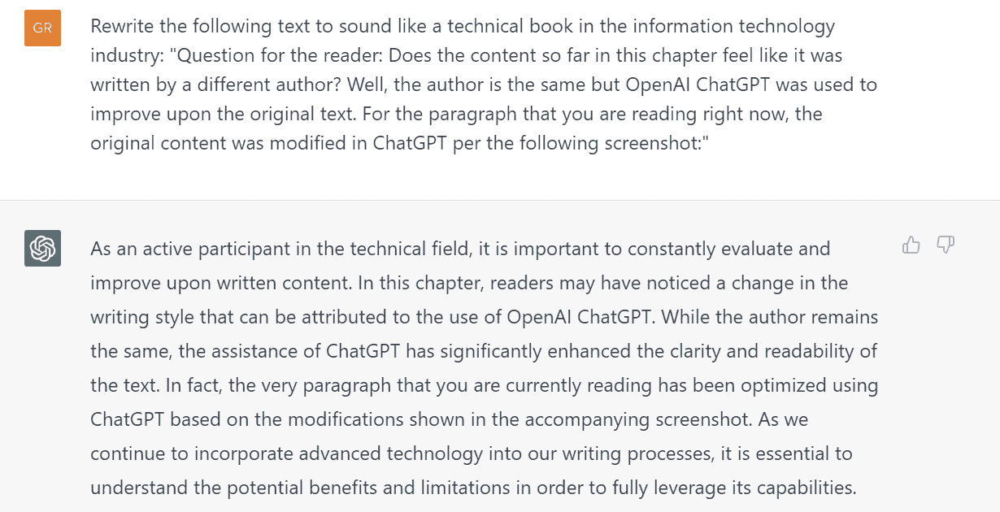
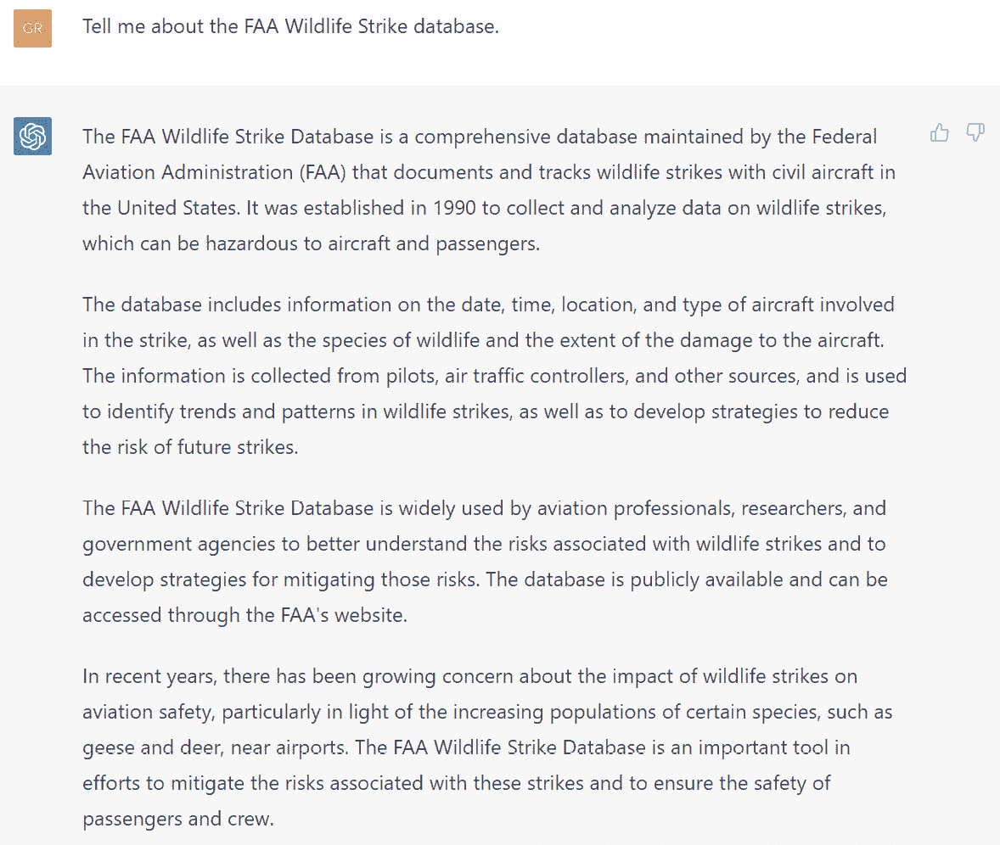
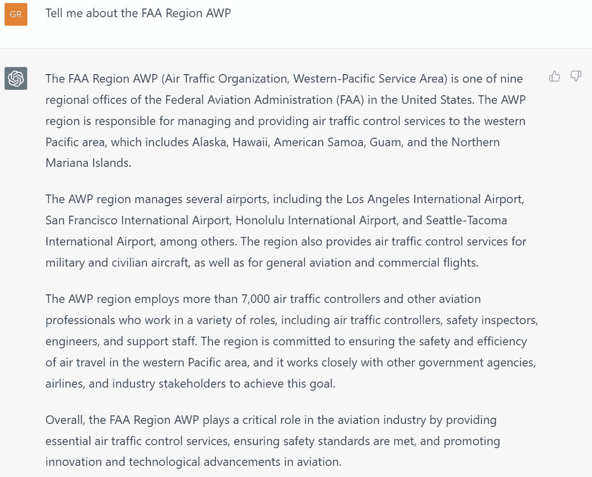
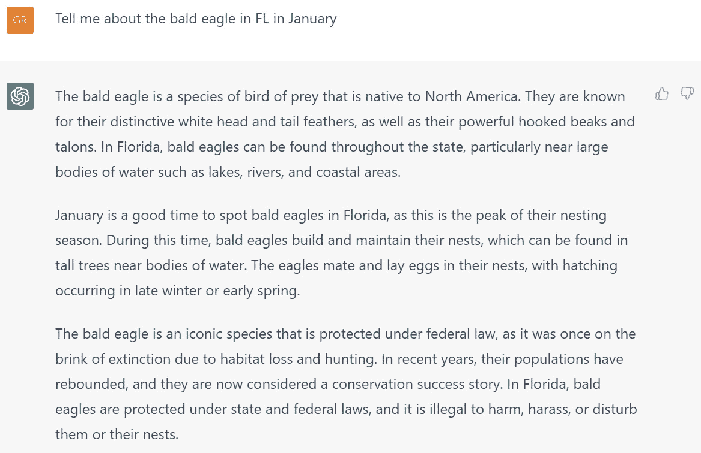
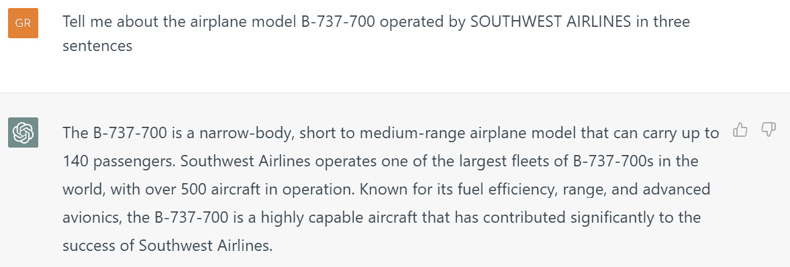
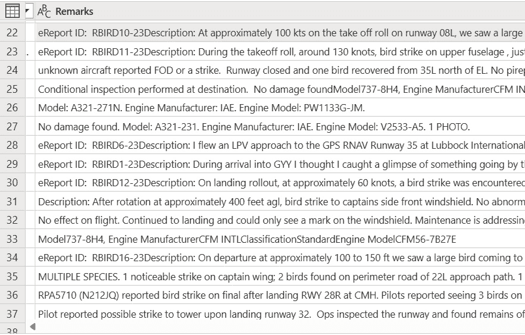
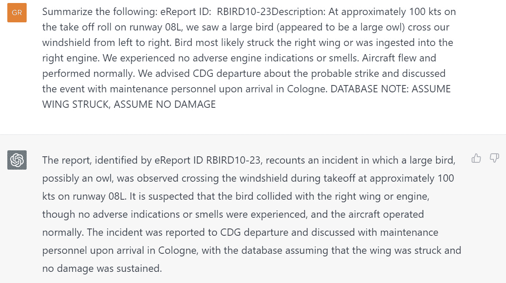
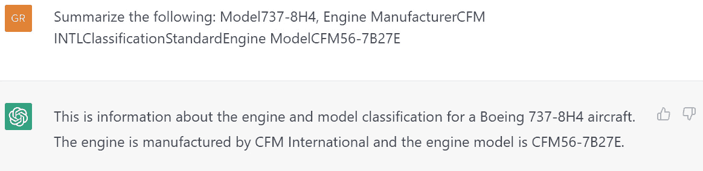
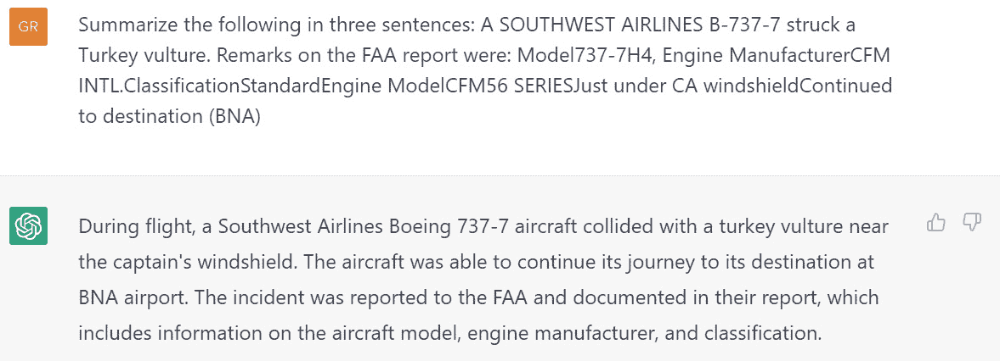
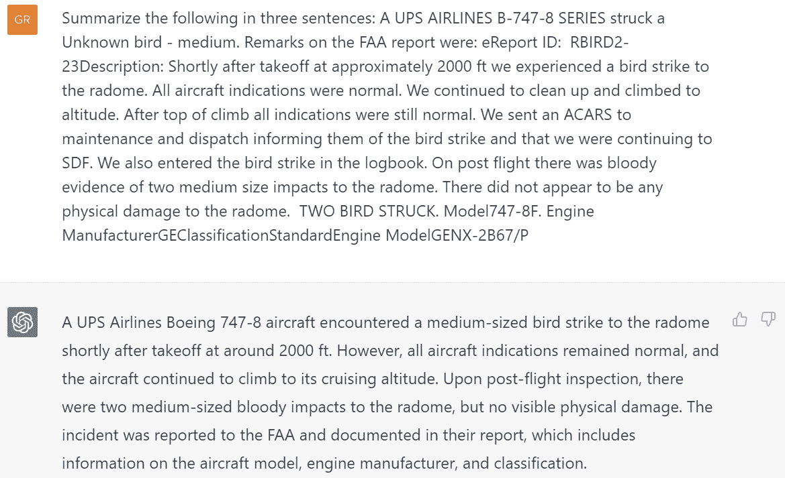

# 第十二章：OpenAI 的用例

在上一章中，您通过 Power BI ML 模型获取了新鲜数据，并将输出结果与 Power BI 在训练阶段进行的自动化测试进行了比较。FAA 野生动物撞击数据库提供了超出训练和测试数据集范围的真实世界生成的新鲜数据。这些数据有可能作为使用 Power BI ML 模型与数据流协同进行新数据评分的框架。最近评估的数据产生了与测试数据得出的预期结果相对一致的结果。

在本章中，您的利益相关者要求您将 OpenAI 功能集成到解决方案中。OpenAI 在 IT 领域受到了很多关注，而这个项目正是在这一趋势下实施的。尽管这涉及范围的变化，但项目的受益者对这一举措完全支持并持乐观态度。在本章中，您将审查几个与您的项目相关的 OpenAI 用例，然后回顾开始所需的先决条件。

# 技术要求

本章的要求略有不同：

+   原始开源 OpenAI 的账户：[`openai.com/`](https://openai.com/)。

+   可选 – Azure OpenAI 在您的 Azure 订阅中：[`azure.microsoft.com/en-us/products/cognitive-services/openai-service`](https://azure.microsoft.com/en-us/products/cognitive-services/openai-service)。本书的编写方式使得这一部分是可选的，因为并非所有人都可以在出版时获得。

+   来自 FAA 网站或 Packt GitHub 网站的 FAA 野生动物撞击数据文件。

+   Power BI Pro 许可证。

+   以下 Power BI 许可证选项之一用于访问 Power BI 数据流：

    +   Power BI Premium

    +   Power BI Premium 每用户

+   将数据导入 Power BI 云服务的一种选项：

    +   Microsoft OneDrive（与 Power BI 云服务连接）

    +   Microsoft Access + Power BI 网关

    +   Azure Data Lake（与 Power BI 云服务连接）

# OpenAI 和 Azure OpenAI 的简要概述和参考链接

2022 年下半年，全球媒体和信息技术的爱好者们被 **ChatGPT** 的潜力所吸引。ChatGPT 是一个庞大的 **大型语言模型**（**LLM**）聊天机器人，它促进了自然语言交流、代码生成和其他功能，由 OpenAI 开发。

OpenAI

OpenAI 是一个 AI 研究组织，感兴趣的读者可以在此链接中找到更多关于它的信息：[`openai.com/about`](https://openai.com/about)。

著名的 ChatGPT 是利用 **生成式预训练**（**GPT**）模型构建的，OpenAI 还生产其他类型的 AI 模型，如用于图像生成的 **DALL-E**。本书避免深入探讨 OpenAI 的复杂细节，因为互联网上已经有了大量相关信息。

OpenAI 平台建立在微软的 Azure 云基础设施之上，为平台多样化的服务提供了强大而可靠的基础。为了利用 Azure 平台强大的安全性、治理和企业集成能力，微软提供了 Azure OpenAI，以便无缝访问 OpenAI 的模型和功能，同时同时受益于 Azure 平台的能力。

Azure OpenAI

要深入了解 Microsoft Azure OpenAI 的众多优势，请访问以下链接：[`azure.microsoft.com/en-us/products/cognitive-services/openai-service`](https://azure.microsoft.com/en-us/products/cognitive-services/openai-service)。

接下来的这两章将专注于使用 OpenAI 技术分析 FAA 野生动物撞击数据。在前面章节的基础上，我们将探讨 OpenAI 和 Azure OpenAI 的多种简单用例，这两者都在信息技术行业中迅速发展。具体来说，我们将专注于利用 GPT 模型进行基本摘要和描述技术。虽然会提供 OpenAI 和 Azure OpenAI 的代码片段，但随附的截图将仅展示传统的 OpenAI 示例，因为 Azure OpenAI 目前无法用于本出版物。

作为技术领域的积极参与者，不断评估和改进书面内容非常重要。在本章中，读者可能已经注意到写作风格的变化，这可以归因于 OpenAI ChatGPT 的使用。尽管作者保持不变，但 ChatGPT 的协助显著提高了文本的清晰度和可读性。实际上，你目前正在阅读的段落已经根据随附截图中的修改使用 ChatGPT 进行了优化。随着我们继续将先进技术融入写作过程，了解其潜在优势和局限性对于充分利用其功能至关重要。



图 12.1 – 使用 OpenAI ChatGPT 重写的本书段落

让我们与 OpenAI 一起踏上旅程，探索在 Power BI 解决方案中分析 FAA 野生动物撞击数据的技术！

# 使用 OpenAI 生成描述

我们的第一步将是确定一个合适的用例，利用 GPT 模型的力量来生成 FAA 野生动物撞击数据的描述。我们的目标是通过对 GPT 模型创建提示，以提供关于我们正在处理的数据的详细信息和洞察力来释放外部数据的潜力。通过这个用例，我们将探讨 GPT 模型在数据分析与解释方面所能带来的价值。

例如，ChatGPT 对 FAA 野生动物撞击数据库的描述可能看起来像这样：



图 12.2 – OpenAI ChatGPT 对 FAA 野生动物撞击数据库的描述

在你使用 FAA 野生动物撞击数据库的解决方案中，你可以使用 GPT 模型将数据与外部数据关联起来。以下是一些示例，包括以下附加信息：

+   机场

+   FAA 区域

+   航空运营商

+   飞机

+   飞机引擎

+   动物物种

+   年份时间

当大量单独行在数据集中的评分过程自动化时，我们可以使用 GPT 模型为每一行生成描述性文本。值得注意的是，ChatGPT 的方法与此不同，因为它作为一个聊天机器人，调用不同的 GPT 模型并将过去的对话整合到未来的答案中。尽管 GPT 模型在解决方案中的使用方式不同，但 ChatGPT 仍然可以作为一个有价值的工具来测试各种用例。

当使用 GPT 模型时，用于提问和给出指示的自然语言提示将影响生成文本的上下文。提示工程是 OpenAI 和 LLMs 中迅速崛起的热门话题。以下提示在使用“狗”作为 GPT 查询主题时将提供不同的答案：

+   `告诉我` `关于狗的信息`

+   `从进化生物学家的角度，告诉我` `关于狗的信息`

+   `告诉我` `狗的历史`

+   `以三年级学生的水平，告诉我` `关于狗的信息`

在规划在大量数据上使用 OpenAI 时，你应该测试和评估你的提示工程策略。对于这本书，用例将保持简单，因为目标是教授与 Power BI 的工具集成。提示工程专业知识可能会成为今年许多书籍和博客的主题。

你可以在数据中测试对 FAA 区域描述的不同请求：



图 12.3 – 使用 OpenAI ChatGPT 测试描述 FAA 区域的实用性

你也可以结合不同的数据元素以获得更详细的描述。以下示例结合了数据字段和要提出的问题（`告诉我关于州 Month 的物种`）：



图 12.4 – 使用 ChatGPT 测试关于物种、州和月份的数据组合

有许多不同的选项需要考虑。为了同时结合几个数据领域，并提供有关数据的有用背景，你决定为描述飞机和运营商制定一个用例。以下是一个可以使用 OpenAI ChatGPT 进行测试的示例公式：`告诉我关于运营商运营的飞机型号 Aircraft 在三句话中`。以下是一个使用来自 FAA 野生动物撞击数据库单行数据的示例：



图 12.5 – OpenAI ChatGPT 描述的运营商机队中飞机的信息

从提示工程的角度来看，对 FAA 野生动物撞击数据库中的多份报告提出此问题需要在每一行数据上运行以下自然语言查询（列名在括号内表示）：

```py
Tell me about the airplane model [Aircraft] operated by[Operator] in three sentences:
```

在下一章中，你将使用此提示来处理 FAA 野生动物撞击数据库中的报告，其中**飞机**和**运营商**字段已填写。在通过 OpenAI 添加额外信息选择用例之后，建议你获得利益相关者的批准以验证用例的实用性。一旦获得批准，你可以继续探索新的用例，这些用例涉及利用 OpenAI 生成从 FAA 野生动物撞击数据中提取的数据的摘要。

# 使用 OpenAI 总结数据

你还可以使用 OpenAI GPT 模型来总结数据。许多数据库都有免费文本字段，包括来自各种来源的条目，如调查结果、医生笔记、反馈表以及关于我们在这本书中使用的 FAA 野生动物撞击数据库事件报告的评论。这些文本输入字段代表广泛的内容，从结构化数据到非结构化数据，这使得在没有复杂自然语言处理工具的帮助下从中提取意义变得具有挑战性。

FAA 野生动物撞击数据库中的**备注**字段包含由填写事件报告表的人员输入的文本。以下截图显示了 Power BI 中最近条目的一些备注示例：



图 12.6 – 来自 FAA 野生动物撞击数据库的备注示例

你会注意到备注在内容格式、内容长度和使用的缩写方面有很大的变化。通过在开头简单添加一个语句“总结以下：”来测试其中一条条目，得到以下结果：



图 12.7 – 使用 ChatGPT 对单一事件的备注进行总结

对较详细的**备注**字段进行总结得到以下结果：



图 12.8 – 稀疏结果字段的总结

为了从 FAA 野生动物撞击数据的**评注**字段中获得统一的摘要，必须考虑在稳健性、稀疏性、句子完整性和是否存在缩写和快速笔记方面有所不同的条目。伴随此技术书籍的工作坊是您尝试各种数据字段和探索不同结果的机会。本书和 Packt GitHub 网站都将使用标准化格式作为输入到 GPT 模型的输入，该模型可以结合事件数据并为每一行生成一致的摘要。以下是一个格式示例：

```py
Summarize the following in three sentences: A [Operator] [Aircraft] struck a [Species]. Remarks on the FAA report were: [Remarks].
```

使用 FAA 野生动物撞击数据库事件的数据在 OpenAI ChatGPT 中测试此方法，如下所示：



图 12.9 – OpenAI ChatGPT 测试评注字段的摘要

接下来，您测试了另一个场景，其中**评注**字段中的文本更加稳健：



图 12.10 – 使用 OpenAI ChatGPT 测试的另一个具有稳健评注的场景

根据您使用 OpenAI ChatGPT 进行的初步测试结果，您决定继续使用之前使用的文本生成和摘要用例。首先，您将获得利益相关者的批准，然后开始开发。在您开始在 Power BI 中开发用例之前，您需要决定 API 调用中使用的 GPT 模型。OpenAI 和 Azure OpenAI 都支持使用 REST API 调用 GPT 模型。这些 API 将用于为每个您想要用于描述生成和摘要的数据行生成文本。

# 选择适用于您的用例的 GPT 模型

OpenAI 和 Azure OpenAI 提供多种不同的 GPT 模型，可以通过 API 迭代调用。在撰写本书时，新的 GPT-4 模型的可供性有限，这是最新和最优秀的发布。GPT-3.5 模型在 OpenAI 和 Azure OpenAI 中均有提供，并有一些不同的选项。以下信息是在 2023 年 3 月 26 日从 OpenAI 网站此链接引用的：[`platform.openai.com/docs/models/gpt-4`](https://platform.openai.com/docs/models/gpt-4)。

| **最新模型** | **描述** | **最大 token 数** | **训练数据** |
| --- | --- | --- | --- |
| gpt-3.5-turbo | 最强大的 GPT-3.5 模型，以 text-davinci-003 的十分之一成本优化聊天。将使用我们最新的模型迭代进行更新。 | 4,096 个 token | 最多至 2021 年 9 月 |
| gpt-3.5-turbo-0301 | 2023 年 3 月 1 日的 gpt-3.5-turbo 快照。与 gpt-3.5-turbo 不同，此模型将不会接收更新，并且仅在截至 2023 年 6 月 1 日的 3 个月期间得到支持。 | 4,096 个 token | 最多至 2021 年 9 月 |
| text-davinci-003 | 可以以更好的质量、更长的输出和更一致的指令遵循性完成任何语言任务，比 Curie、Babbage 或 Ada 模型更好。还支持在文本中插入补全。 | 4,097 tokens | 截至 2021 年 6 月 |
| text-davinci-002 | 与 text-davinci-003 具有相似的能力，但使用监督微调而不是强化学习进行训练。 | 4,097 tokens | 截至 2021 年 6 月 |
| code-davinci-002 | 优化用于代码补全任务 | 8,001 tokens | 截至 2021 年 6 月 |

图 12.11 – 2023 年 3 月 26 日 OpenAI 上可用的 GPT-3.5 模型（信息来自 OpenAI 网站）

GPT-3.5 模型将用于本书和研讨会，因为读者可能无法访问 GPT-4 模型。在考虑模型并将它们与你的用例匹配时，请考虑以下因素：

| **最新模型** | **考虑因素** |
| --- | --- |
| gpt-3.5-turbo | 最新的添加，专为速度和低成本构建 |
| gpt-3.5-turbo-0301 | GPT-3.5-turbo 的前一个版本 |
| text-davinci-003 | 多功能文本模型，比 gpt-3.5-turbo 更贵且速度更慢 |
| text-davinci-002 | 与 text-davinci-003 类似，但结果不那么复杂 | 4,097 tokens | 截至 2021 年 6 月 |
| code-davinci-002 | 优化用于编写代码 |

图 12.12 – 选择 GPT 模型的考虑因素

根据你目前的研究，`gpt-3.5-turbo` 似乎是最好的测试你用例的选择，但 `text-davinci-003` 在撰写本书时已经存在更长时间，并且有更好的参考文献。你的用例是要做以下事情：

+   从单独报告的野生动物撞击事件中提供有关飞机的额外信息

+   总结用例中的信息

替换不同的 GPT 模型是一个相当简单的过程，即重定向 API 调用。对于你自己的项目，你应该测试所有选项，以确定最适合你用例的最佳 GPT 模型。

在本书的下一章中，你决定使用 `text-davinci-003` 来生成关于飞机的新描述，并总结野生动物撞击事件的评论。这是最佳选择吗？你需要进行广泛的测试，并选择最佳的标准，这些是全新的技术，没有历史标准来设定基线。对于这本书和研讨会，你将做出这个选择，以便使用一个应该提供合理结果的 GPT 模型来推进事情。

API 调用也可以通过额外的设置进行配置。例如，`temperature` 和 `top_p` 设置可以改变结果，从倾向于简单和直接的事实到更富有创造性的答案。小心使用这些设置，因为结果中的创造性可能会导致错误答案，这些错误答案被称为 **幻觉**。

使用 OpenAI API

关于温度、`top_p`设置和幻觉的更多信息，可以在以下链接中找到：[`platform.openai.com/docs/api-reference/completions/create#completions/create-temperature`](https://platform.openai.com/docs/api-reference/completions/create#completions/create-temperature).

本书和研讨会不会深入探讨这些设置的细节或进行比较，而是将专注于在 Power BI 中实现这些 GPT 模型的技术实现。

# 摘要

在本章中，您已经深入探讨了与 OpenAI 和 Microsoft Azure OpenAI 相关的根本概念，以及如何使用这些平台生成和总结文本。此外，您还探讨了将 OpenAI 和 Azure OpenAI 的 GPT 模型集成到您的 Power BI 解决方案中使用的几种选项，这些选项是利用 FAA 野生动物撞击数据。经过仔细的评估过程，确定将使用`text-davinci-003` GPT 模型来总结 FAA 野生动物撞击数据报告中的备注，并生成关于报告中飞机的新描述性信息。

*第十三章*将致力于在 Power BI 数据流中实现功能，使您可以无缝调用 OpenAI 和 Azure OpenAI 的 REST API 进行数据操作。这些 API 将促进您的摘要和描述性生成用例的成功实施，从而为您的解决方案提供新的能力，以应对 FAA 野生动物撞击数据带来的挑战。有了这些高级功能，每次数据流刷新时，都可以轻松高效地调用 OpenAI 或 Azure OpenAI。

在您的项目中集成这些尖端功能无疑将增强其功效，提供一种简化和优化的数据摘要和描述性生成方法。
