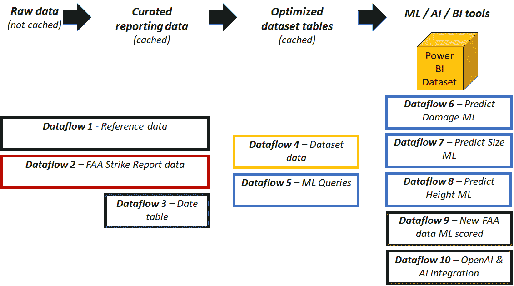
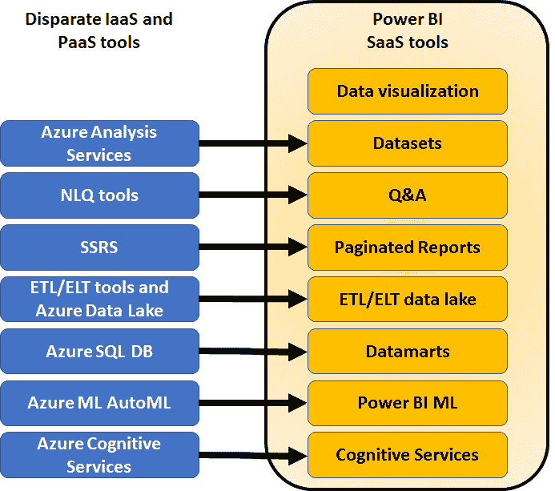
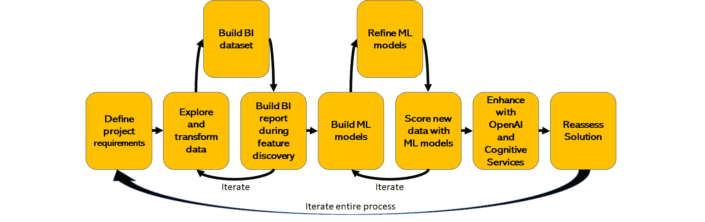

# 项目回顾与展望

*第十三章* 这本书是一次探索技术前沿的冒险，你将 OpenAI 和 Azure OpenAI 集成到你的 Power BI 项目中，使用 FAA 野生动物撞击数据。在这本书的过程中，你走过了从摄取原始数据、转换和准备数据、构建用于分析的 BI 解决方案、使用分析来发现用于预测机器学习模型的数据特征、构建这些机器学习模型、使用机器学习模型评分新数据，以及使用 OpenAI 和 Azure OpenAI 的 LLMs 添加新的、强大的描述性和总结能力到解决方案的全过程。在 *第十二章* 和 *第十三章* 中，你也使用了 OpenAI 增强了文本。所有这些都是在 Power BI 的端到端中完成的。

在本章中，你将回顾你在整本书和项目中所取得的成就，修订重要的关键概念，然后发现一些关于项目未来迭代以及作为数据专业人士职业生涯的建议。在现实世界中，大多数项目永远不会真正完成。在某些时候，它们可能会结束，但更常见的是，有机会改进现有解决方案或扩大解决方案的范围，以提供更多价值。理解和阐述通过新迭代工作可以捕捉到的突出价值，并将这一信息传达给利益相关者，以及所需投资的估计，是构建更大、更好、更有影响力的项目的关键。

与前两章不同，本章不是在 OpenAI 的帮助下撰写的，而是以作者的原创声音（在人类编辑和审稿人的帮助下）撰写的。

# 从书籍和研讨会中学到的经验

在这本书的开头，你开始的目标是为你的领导提供工具，使他们能够进行交互式分析 FAA 野生动物撞击数据，以便发现影响事件的因素，并对未来可能发生的野生动物撞击事件及其相关成本进行预测。你的项目的主要目标，即预测 FAA 野生动物撞击的未来影响，需要构建 Power BI 机器学习模型。通过这本书的章节，你通过 Packt GitHub 仓库的内容，走过了规划并实施端到端项目的过程。在这个项目中，所有的事情都是使用 Power BI 内的工具或与 Power BI 集成的工具完成的。你在 Power BI 中创建的工件的高级总结如图 *14**.1* 所示：

图 14.1 – 本书中在 Power BI 中创建的工件总结

本书的主要技术培训围绕 Power BI 中的 ML 展开，但还穿插了其他几个概念。如果您参加了微软的**Power BI Dashboard in a Day**课程([`aka.ms/diad`](https://aka.ms/diad))，您可能会发现该课程与本书之间存在一些风格上的相似之处，但增加了 ML、AI 和 OpenAI 作为关键成果，同时使用了来自现实世界的 FAA 野生动物撞击数据。

## 探索 BI、ML、AI 和 OpenAI 的交集

BI、ML、AI 和 OpenAI 涵盖了相互重叠的工具和解决方案架构方法，但也可以被视为独立的学科。在 Power BI 的背景下，许多不同的工具被组合在一个单一的 SaaS 平台之下。多年来，Power BI 已从数据可视化工具演变为将许多不同的 Microsoft 工具 SaaS 化，正如*图 14.2*所示：

图 14.2 – Power BI 由 SaaS 平台内的许多工具组成

在 Power BI SaaS 工具集的背景下，您完成了以下练习，这些练习提供了对何时何地使用 ML、AI 和 OpenAI 的基线概念理解：

+   *第一章*：您审查了用例，浏览了数据，并规划了数据模型，以实现促进数据探索和特征发现的数据设计，同时规划了一个与 ML 兼容的设计。

+   *第二章*和*第三章*：您在 Power BI 中转换了数据，并为 BI 数据集创建了一个基线设计。您以提供强大基础的方式对数据进行建模。

+   *第四章*：您设计了用于 ML 的数据表。这些表被扁平化，每一行代表一个独特的事件，其中包含描述该事件的特征。

+   *第五章*：您使用 BI 工具和 AI 可视化探索数据集以找到 ML 特征。然后，将这些新特征添加到 ML 查询中。

+   *第六章*：您使用 R 和 Python 的可视化功能找到了新的功能。这些功能也被添加到了 Power BI ML 的查询中。

+   *第七章*：您将您的作品从 Power BI 桌面迁移到 Power BI 云服务。在此章节之后，您所有的作品都是在 Power BI 云服务中完成的。

+   *第八章*至*第十一章*：您构建并改进了您的 ML 模型。您将扁平化的 ML 查询通过 Power BI ML 运行了三个不同的预测模型，审查了训练和测试结果，然后迭代 ML 模型以改进预测能力。

+   *第十二章*和*第十三章*：您将 OpenAI 和认知服务添加到解决方案中，以获得更多价值。OpenAI 被用来总结和生成可读性强的数据。

你的努力在*图 14.3*中有直观的展示。除了 OpenAI 的整合，所有工作都是在 Power BI SaaS 工具集中完成的：

图 14.3 – 在 Power BI SaaS 平台中整合 BI、ML、AI 和 OpenAI 工具的项目方法

总结来说，您已经走过了整个项目的过程，从原始的 FAA 野生动物撞击数据开始，到构建机器学习模型结束——所有这些都在 Power BI 的 SaaS 工具中完成。

## Power BI 中的机器学习

由于本书的名称是《用 Power BI 机器学习和 OpenAI 释放您的数据》，因此 Power BI ML 工具显然是您已完成的工作坊和故事冒险的基石组件。以下是一些整个书籍没有基于 Power BI ML 的原因：

+   当正确使用时，Power BI ML 极其容易使用。它是 AutoML 的一个版本，正确准备数据可能非常困难。

+   许多 BI 专家从未设计和准备过数据用于机器学习。这些技能的交集是 BI 专业人士使用 Power BI ML 时最困难的部分。

+   与本书相关的端到端工作坊旨在尽可能真实地代表现实世界项目。如果你完成了工作坊，即使你通过从 GitHub 剪切和粘贴脚本和内容来缩短了时间，你也应该能够为你的未来项目重复这个过程的变化版本。

+   在本书的结尾，您现在应该对如何在 Power BI 中使用机器学习、何时使用以及为什么使用机器学习有了非常深刻的理解。

你现在已经在 Power BI 中构建、评估、部署和重新训练了二元预测、通用分类和回归机器学习模型。你不仅完成了这个壮举，而且使用的是 FAA 野生动物撞击数据库的真实数据。这些数据不是人工整理或合成的，以改善你的结果或使过程变得容易。作为额外的奖励，你还在项目中添加了一些 OpenAI 和认知服务的整合，增加了额外的价值。你应该为自己感到骄傲！

但现在真正的考验开始了！你如何确保你的利益相关者欣赏项目的成果？项目是否完成，或者你还能做些什么来让它变得更好？你如何将这些经验应用到你的未来职业规划中？

# 展望未来

现在你已经从定义需求，到从 FAA 野生动物撞击数据库中转换和探索原始源数据，到构建机器学习模型，再到与 OpenAI 和认知服务合作，下一步是什么？你是发布解决方案给利益相关者和用户，给自己鼓掌，然后转到下一个项目吗？你是继续迭代这个项目以增加价值吗？你是基于本书的教训，进一步深入研究机器学习和 OpenAI 吗？

## FAA 野生动物撞击数据解决方案的下一步

本书使用的例子只是触及了使用 FAA 野生动物撞击数据库可以构建的不同用例的表面。在你的实际工作中，大多数人可能永远不会需要使用 FAA 野生动物撞击数据。即便如此，思考可能的下一步行动也是有价值的，这样你就可以将这种思考融入你的解决方案中。在不添加新数据的情况下，一些例子可能包括但不限于以下内容：

+   预测不同鸟种在不同时间、不同地点的高度

+   预测不同类型飞机的损坏可能性

+   预测野生动物撞击的季节性风险率

+   评估新冠疫情对野生动物撞击的影响（疫情期间航班减少）

+   评估装有尾翼发动机和机翼发动机的飞机在野生动物撞击方面的差异

引入外部数据也可能为丰富你的解决方案提供机会：

+   天气数据可以用作预测不同类型野生动物撞击标准的因素

+   所有航空公司航班的（大多数没有野生动物撞击）数据可以用来确定野生动物撞击的比率，并添加更多关于航班的稳健信息

+   在机场添加有关野生动物和鸟类驱赶措施（如围栏、捕食者诱饵等）的数据，以评估其有效性

对现有的 ML 模型进行迭代可能会比工作坊中的结果更好，同样，测试不同的特征、评估不同的日期范围、引入新的数据、测试新的筛选标准也会有所帮助。使用 Power BI，新的测试只需几步点击即可完成。如果你能够得到比工作坊更好的结果，请分享它们！本书中的 ML 模型并非旨在完美，而是为你开始这项技术提供一个起点。

## Power BI 和 ML 的下一步

现在你已经在 Power BI 中构建和部署了机器学习模型，接下来你该做什么呢？希望这本书不仅丰富了你使用 Power BI 工具集的技能，还帮助你了解了 BI、ML 和 AI（包括 OpenAI）的概念交汇点。在现代社会，像 Power BI 这样的工具将持续发展和改进。你应该如何规划使用 Power BI ML 的未来？还有哪些其他考虑因素可能是好主意？

如*图 14**.2 所示，Power BI 是一套不断发展和改进的 SaaS 工具。Power BI ML 也将不可避免地发展。本书中涵盖的工具和技术应该为你理解并适应产品套件未来的变化提供基础。你或许已经学到了一种揭示 ML 用例、发现构建 ML 模型的功能以及评估这些用例在 Power BI 环境中 ML 可能用途的方法论。

Power BI ML 是否将是这个项目下一迭代或你下一个 ML 项目的正确工具？也许，也许不是！如前几章所述，本书中开发的 ML 模型的使用案例，如果下一轮改进是在具有企业级 ML 能力的数据科学团队的帮助下进行的，可能会更有影响力，这些能力超越了 Power BI ML 中的 AutoML 能力。或者，也许在 Power BI ML 中进行几轮迭代也可能产生更好的最终产品。从长远来看，本书中的设计和架构概念有望提供比 Power BI ML 的技术培训更持久的价值。

## 你职业生涯的下一步

完成这本书和相关的研讨会，使用 FAA 野生动物撞击数据，希望你对考虑将 ML 和 AI 作为未来项目的组件感到兴奋。在你阅读这本书的过程中，你从原始数据开始，逐步构建到具有 OpenAI 集成的 Power BI ML。你使用的数据没有经过整理或优化，而是代表了现实世界中的真实数据。那么现在呢？希望这次经历能帮助你找到新的途径来提升你的职业生涯！

如果你是一个 Power BI 和数据分析爱好者，你现在可以将 ML 作为一项新工具添加到你的武器库中。你现在可以利用 Power BI ML 来完成以下工作：

+   评估使用 ML 模型解决现有项目问题的新想法

+   确定数据在更大 ML 项目中的效用

+   将 Power BI ML 作为快速原型化 ML 模型的方式，在将项目发送到数据科学团队之前

+   急切地期待来自 Microsoft 的 ML 在 Power BI 中的更新和新功能

如果你渴望成为一名数据科学专业人士，或者你已经在数据科学领域工作，你可以利用你的所学来完成以下工作：

+   更好地了解如何与 BI 团队协作解决问题

+   在 Power BI 中构建解决方案的 BI 组件

+   评估 AutoML 工具与传统数据科学工具箱的优缺点

+   深入了解 OpenAI 和 Azure OpenAI 集成在项目中的应用

对于一个热情的建筑师来说，解决方案永远不会完美，总有添加新数据、从新角度解决问题、测试新的 AI 和 ML 工具以及改进最终用户体验的机会。

# 摘要

在本章中，你回顾了书中和附属工作坊的所有课程。在 13 个章节的过程中，你通过一个单一案例穿越了 BI、ML、AI 和 OpenAI 的交汇点。从原始的 FAA 野生动物撞击数据开始，你使用附属的 Packt GitHub 仓库构建了一个端到端的工作坊。特别关注了 Power BI ML，然后是与 OpenAI 和 Azure OpenAI 的集成。讨论了与 FAA 数据一起工作的下一步和选项。然后，在本书内容的背景下，讨论了未来的职业规划。在快速技术演变的时代，希望本书中涵盖的架构设计过程和策略，在工具已经超越本书所涵盖的状态之后，仍能对你有所帮助。

在这本书中学习关于 Power BI ML 的知识，希望这能为你打开通往职业生涯下一步的大门。这可能是一个 Power BI 专业人士、未来的数据科学家、行业分析师，或者是一个项目经理。如果其他什么都没有，那么当你下次从飞机的窗户座位上凝视世界时，你将会有一个不同的周围环境视角。
